＃ 内容
- [描述](#description)
- [入门指南](#getting-started)
- [示例 1](#example-1)
- [示例 2](#example-2)
- [示例 3](#example-3)
- [积木](#blocks)
- [系统块](#系统块)
- [调试输出](#debug-output)
- [评论](#评论)
- [Steuere 州](#steuere-state)
- [更新状态](#update-state)
- [绑定状态](#bind-states)
- [写入状态](#write-states)
- [创建状态](#create-state)
- [获取状态值](#get-value-of-state)
- [获取对象 ID](#get-object-id)
- [动作块](#动作块)
- [执行命令](#exec---命令)
- [请求 URL](#request-url)
- [SendTo Blocks](#sendTo-blocks)
- [发送到 Telegram](#send-to-telegram)
- [发送至 SayIt](#send-to-sayit)
- [发送到 Pushover](#send-to-pushover)
- [发送电子邮件](#send-email)
- [自定义 sendTo 代码块](#custom-sendto-block)
- [日期和时间块](#date-and-time-blocks)
- [时间比较](#time-comparison)
- [实际时间对比](#actual-time-comparision)
- [获取指定格式的实际时间](#get-actual-time-in-specific-format)
- [获取今日天文事件时间](#get-time-of-astro-events-for-today)
- [转换块](#convert-blocks)
- [转换为数字](#convert-to-number)
- [转换为布尔值](#convert-to-boolean)
- [获取变量类型](#get-type-of-variable)
- [转换为日期/时间对象](#convert-to-datetime-object)
- [将日期/时间对象转换为字符串](#convert-datetime-object-to-string)
- [将 JSON 转换为对象](#convert-json-to-object)
- [将对象转换为 JSON](#convert-object-to-json)
- [按 JSONata 表达式转换](#convert-by-jsonata-expression)
- [触发器](#触发器)
- [状态改变时触发](#trigger-on-states-change)
- [状态改变时触发](#trigger-on-state-change)
- [触发器信息](#trigger-info)
- [日程安排](#schedule)
- [天文事件触发](#trigger-on-astro-event)
- [命名日程](#named-schedule)
- [清除日程](#clear-schedule)
- [CRON 对话框](#cron-dialog)
- [CRON 规则](#cron-rule)
- [文件更新时触发](#trigger-on-file-update)
- [取消文件更新事件](#cancel-event-on-file-update)
- [超时次数](#超时次数)
- [延迟执行](#延迟执行)
- [清除延迟执行](#clear-delayed-execution)
- [按间隔执行](#execution-by-interval)
- [按时间间隔停止执行](#stop-execution-by-interval)
- [逻辑](#逻辑)
- [If else 代码块](#if-else-block)
- [比较块](#比较块)
- [逻辑与/或块](#logical-and-or-block)
- [否定块](#negation-block)
- [逻辑值 TRUE/FALSE](#logical-value-true-false)
- [空块](#null-block)
- [测试块](#test-block)
- [循环](#循环)
- [重复 N 次](#repeat-n-times)
- [循环播放](#repeat-while)
- [计数](#计数)
- [对于每个](#for-each)
- [跳出循环](#break-out-of-loop)
- [数学](#数学)
- [数值](#数值)
- [算术运算 +-\*/^](#算术运算--)
- [平方根, 绝对值, -, ln, log10, e^, 10^](#平方根-绝对值---ln-log10-e-10)
        - [sin、cos、tan、asin、acos、atan](#sin-cos-tan-asin-acos-atan)
- [数学常量：π、e、φ、√2、√1/2、无穷大](#math-constants-pi-e-phi-sqrt2-sqrt12-infinity)
- [是偶数、奇数、质数、整数、正数、负数、能被……整除](#is-even-odd-prime-whole-positive-negative-divisibly-by)
- [按值加减修改变量](#modify-variably-by-value-plus-or-minus)
- [四舍五入、向下取整、向上取整值](#round-floor-ceil-value)
- [对值列表的操作：求和、最小值、最大值、平均值、中位数、众数、偏差、随机项](#operations-on-the-list-of-values-sum-min-max-average-median-modes-deviation-random-item)
- [模数](#模数)
- [限制某个值的最小值和最大值](#limit-some-value-by-min-and-max)
- [0 到 1 之间的随机值](#random-value-from-0-to-1)
- [介于最小值和最大值之间的随机值](#random-value-between-min-and-max)
- [文本](#文本)
- [字符串值](#string-value)
- [连接字符串](#concatenate-strings)
- [将字符串追加到变量](#append-string-to-variable)
- [字符串长度](#length-of-string)
- [字符串是否为空](#is-string-empty)
- [查找字符串中的位置](#find-position-in-string)
- [获取字符串中指定位置的符号](#get-symbol-in-string-on-specific-position)
- [获取子字符串](#get-substring)
- [转换为大写或小写](#Convert-to-upper-case-or-tolower-case)
- [修剪字符串](#trim-string)
- [列表](#lists)
- [创建空列表](#create-empty-list)
- [创建包含值的列表](#create-list-with-values)
- [创建 N 个具有相同值的列表](#create-list-with-same-value-n-times)
- [获取列表长度](#get-length-of-list)
- [列表是否为空](#is-list-empty)
- [查找列表中项目的位置](#Find-position-of-item-in-list)
- [获取列表中的项目](#get-item-in-list)
- [在列表中设置项目](#set-item-in-list)
- [获取列表的子列表](#get-sublist-of-list)
- [文本转列表，列表转文本](#convert-text-to-list-and-vice-versa)
- [颜色](#颜色)
- [颜色值](#colour-value)
- [随机颜色](#random-color)
- [RGB 颜色](#rgb-color)
- [混合颜色](#mix-colors)
- [变量](#variables)
- [设置变量的值](#set-variables-value)
- [获取变量的值](#get-variables-value)
- [函数](#functions)
- [使用代码块创建无返回值的函数](#create-function-from-blocks-with-no-return-value)
- [使用代码块创建带返回值的函数](#create-function-from-blocks-with-return-value)
- [函数返回值](#return-value-in-function)
- [创建没有返回值的自定义函数](#create-custom-function-with-no-return-value)
- [创建带返回值的自定义函数](#create-custom-function-with-return-value)
- [调用函数](#call-function)

和

# 简介 Blockly 是一款图形化编辑器，用户可以通过组合模块来创建脚本。

它的开发初衷是面向没有任何计算机编程经验的用户。
和

＃ 入门
## 示例 1
当一个数据点发生变化时，另一个数据点的状态也随之改变。

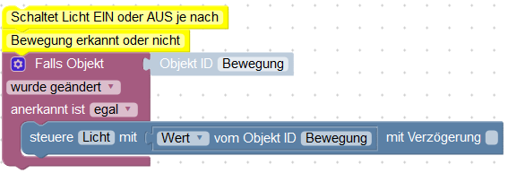

这是当某个数据点发生变化时，切换到其他内容的经典例子。

当检测到移动或未检测到移动时，这里的灯就会打开或关闭。

首先，插入“触发器=>如果对象”代码块。选择对象 ID，以使用该对象的状态作为此脚本的触发器。

添加另一个块 - “系统=>控制”，并在对话框中选择要由触发器更改的其他状态。

在该控制块中插入“系统=>对象 ID 值”块，并在对话框中选择对象“运动”，将其状态写入“灯光”：。

触发器块中有一个名为“Value”的特殊变量。该变量始终在此处定义，可用于多种用途。它包含触发对象的当前值，因此，可以使用“Variable=>Object ID”块并将其重命名为“Value”来创建更简单的脚本。

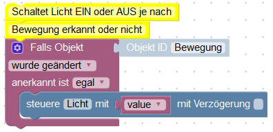

导入示例：

```xml 
<xml xmlns="http://www.w3.org/1999/xhtml">
  <block type="comment" id="s7s**k+Cc_KjDnJW`(h~" x="12" y="63">
    <field name="COMMENT">Switch light ON or OFF it motion detected or IDLE</field>
    <next>
      <block type="on_ext" id="#}:B(M-o5:/]k,_msr%y">
        <mutation items="1"></mutation>
        <field name="CONDITION">ne</field>
        <field name="ACK_CONDITION"></field>
        <value name="OID0">
          <shadow type="field_oid" id="o~6)!C0IVy{WD%Km(lkc">
            <field name="oid">javascript.0.Motion</field>
          </shadow>
        </value>
        <statement name="STATEMENT">
          <block type="control" id="(ZqzhS_7*jGpk;`zJAZg">
            <mutation delay_input="false"></mutation>
            <field name="OID">javascript.0.Light</field>
            <field name="WITH_DELAY">FALSE</field>
            <value name="VALUE">
              <block type="get_value" id="a-E@UcwER=knNljh@:M/">
                <field name="ATTR">val</field>
                <field name="OID">javascript.0.Motion</field>
              </block>
            </value>
          </block>
        </statement>
      </block>
    </next>
  </block>
</xml>
```

和

## 示例 2 **当检测到移动时打开灯，如果 10 分钟内没有检测到移动则关闭灯。**
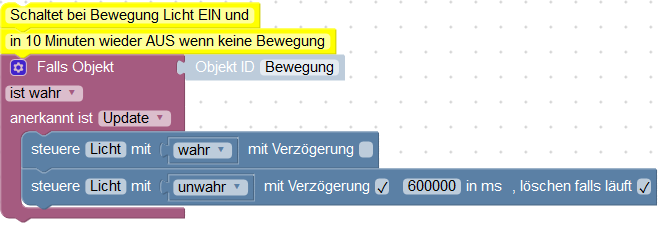

当“运动”状态更新为“真”时，执行以下操作：

打开“灯”
- 启动 10 分钟延迟以关闭“灯”，并删除此数据点的所有先前延迟。

如您所见，最后一个命令清除了“删除延迟”标志。这将清除该数据点的所有计时器并启动一个新的计时器。

导入示例：

<!-- ```xml <xml xmlns="http://www.w3.org/1999/xhtml"> --> <block type="comment" id="s7s**k+Cc_KjDnJW`(h~" x="112" y="63"> <field name="COMMENT">闲置 10 分钟后开关灯</field> <next> <block type="on_ext" id="#}:B(M-o5:/]k,_msr%y"> <mutation items="1"></mutation> <field name="CONDITION">true</field> <field name="ACK_CONDITION">true</field> <value name="OID0"> <shadow type="field_oid" id="o~6)!C0IVy{WD%Km(lkc"> <field name="oid">javascript.0.Motion</field> </shadow> </value> <statement name="STATEMENT"> <block type="control" id="(ZqzhS_7*jGpk;`zJAZg"> <mutation delay_input="false"></mutation> <field name="OID">javascript.0.Light</field> <field name="WITH_DELAY">FALSE</field> <value name="VALUE"> <block type="logic_boolean" id="%^ADwe*2l0tLw8Ga5F*Y"> <field name="BOOL">TRUE</field> </block> </value> <next> <block type="control" id="=]vmzp6j^V9:3?R?2Y,x"> <mutation delay_input="true"></mutation> <field name="OID">javascript.0.Light</field> <field name="WITH_DELAY">TRUE</field> <field name="DELAY_MS">600000</field> <field name="CLEAR_RUNNING">TRUE</field> <value name="VALUE"> <block type="logic_boolean" id="!;DiIh,D]l1oN{D;skYl"> <field name="BOOL">FALSE</field> </block> </value> </block> </next> </block> </statement> </block> </next> </block> </xml>

```


&nbsp;
## Beispiel 3
**Verschicke eine E-Mail, wenn die Außentemperatur höher als 25 Grad Celsius ist.**

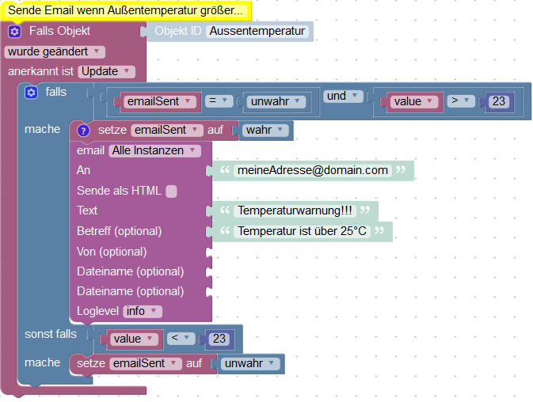

Erklärung:

Zuerst müssen wir eine Variable definieren um zu speichern, dass die E-Mail für den aktuellen Temperaturalarm bereits gesendet wurde und diese Variable auf "falsch" setzen.
Dann beobachten wir die Veränderungen der Temperatur. Wir könnten dieses Skript auch periodisch ausführen, aber das ist nicht so effektiv.

Wenn sich die Temperatur ändert vergleichen wir den aktuellen Wert mit 25 und prüfen, ob die E-Mail bereits verschickt wurde oder nicht.
Wenn die E-Mail noch nicht versendet war, speichern wir, dass wir sie jetzt senden und senden sie auch. Natürlich muss der E-Mail-Adapter vorher installiert und konfiguriert worden sein.

Wenn die Temperatur unter 23 Grad fällt setzen wir die Variable "emailSent" zurück, damit beim nächsten Temperaturalarm wieder eine E-Mail gesendet wird.
Dazu wird die aktuelle Temperatur mit 23 verglichen und es werden keine E-Mails geschickt, solange die Temperatur um 25 Grad schwankt.

Um den "falls ... sonst falls ..." Block zu erstellen klickt man auf das Zahnrad und fügt die zusätzlich benötigten Elemente dem "falls" Block hinzu.

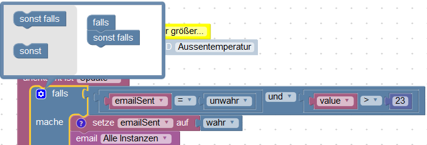

Man kann zu jedem Block einen Kommentar hinterlegen, indem man "Kommentar hinzufügen" im Kontextmenü des Blocks anklickt. Diesen Kommentar kann man später durch anklicken des Fragezeichens ansehen.

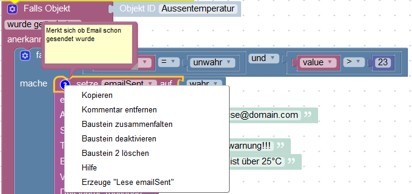

Man kann größere Blöcke einklappen, um eine bessere Übersicht zu erhalten, indem man im Kontextmenü den Punkt "Block einklappen" auswählt.

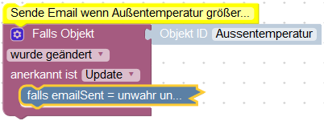


&nbsp;
Beispiel zum importieren:

```xml
<xml xmlns="http://www.w3.org/1999/xhtml">
  <block type="comment" id="r53:ZiP]3DYe;Ly;@!v5" x="87" y="13">
    <field name="COMMENT"> Send email if outside temperature is more than 25 grad Celsius.</field>
    <next>
      <block type="variables_set" id="oyEg!Z7~qid+!HYECD8C">
        <field name="VAR">emailSent</field>
        <value name="VALUE">
          <block type="logic_boolean" id="gakxd?9T354S1#_(=)%K">
            <field name="BOOL">FALSE</field>
          </block>
        </value>
        <next>
          <block type="on_ext" id="DR}w0I%EUL-FCI%`w5L4">
            <mutation items="1"></mutation>
            <field name="CONDITION">ne</field>
            <field name="ACK_CONDITION">true</field>
            <value name="OID0">
              <shadow type="field_oid" id="}TdS?2Lg~Mt[0!o0iMG.">
                <field name="oid">javascript.0.Outside_temperature</field>
              </shadow>
            </value>
            <statement name="STATEMENT">
              <block type="controls_if" id="rBBI(VLLLRnwd|ys59si">
                <mutation elseif="1"></mutation>
                <value name="IF0">
                  <block type="logic_operation" id="B5R%#,6F,xYI1gB!jjq|">
                    <field name="OP">AND</field>
                    <value name="A">
                      <block type="logic_compare" id="I=R,TaB*pge*l#j|[HZ0">
                        <field name="OP">EQ</field>
                        <value name="A">
                          <block type="variables_get" id="wd1I0gzqle,y-:h@GF)v">
                            <field name="VAR">emailSent</field>
                          </block>
                        </value>
                        <value name="B">
                          <block type="logic_boolean" id="q5~/ZIb))r`w]/RaSXUu">
                            <field name="BOOL">FALSE</field>
                          </block>
                        </value>
                      </block>
                    </value>
                  </block>
                </value>
                <statement name="DO0">
                  <block type="variables_set" id="i):z[{@|*;4zOruzXH46">
                    <field name="VAR">emailSent</field>
                    <comment pinned="false" h="80" w="160">Remember, that email was sent</comment>
                    <value name="VALUE">
                      <block type="logic_boolean" id="56A@]MZKiuL(iuuj)MRI">
                        <field name="BOOL">FALSE</field>
                      </block>
                    </value>
                    <next>
                      <block type="email" id="3J#TXZ`oei_NMEL,_w8K">
                        <field name="INSTANCE"></field>
                        <field name="IS_HTML">FALSE</field>
                        <field name="LOG">log</field>
                        <value name="TO">
                          <shadow type="text" id="j*x?kanQQyGH/pN,r9B2">
                            <field name="TEXT">myaddress@domain.com</field>
                          </shadow>
                        </value>
                        <value name="TEXT">
                          <shadow type="text" id="QE(T_Z]{=o8~h~+vz!ZU">
                            <field name="TEXT">Temperature is over 25°C</field>
                          </shadow>
                        </value>
                        <value name="SUBJECT">
                          <shadow type="text" id="/_AxN7@=T|t@XW.^Fu1(">
                            <field name="TEXT">Temperature alert</field>
                          </shadow>
                        </value>
                      </block>
                    </next>
                  </block>
                </statement>
                <value name="IF1">
                  <block type="logic_compare" id="S?0|;{3V3!_rqUk]GJ4)">
                    <field name="OP">LT</field>
                    <value name="A">
                      <block type="variables_get" id="IJwq1,|y;l7ueg1mF{~x">
                        <field name="VAR">value</field>
                      </block>
                    </value>
                    <value name="B">
                      <block type="math_number" id="m(.v?M3ezTKz(kf5b9ZE">
                        <field name="NUM">23</field>
                      </block>
                    </value>
                  </block>
                </value>
                <statement name="DO1">
                  <block type="variables_set" id="M0{G}QBtF!FYrT,xWBnV">
                    <field name="VAR">emailSent</field>
                    <value name="VALUE">
                      <block type="logic_boolean" id="ti#H=_:;-XRC%CzR/+/0">
                        <field name="BOOL">FALSE</field>
                      </block>
                    </value>
                  </block>
                </statement>
              </block>
            </statement>
          </block>
        </next>
      </block>
    </next>
  </block>
</xml>
```

和

和

# 方块
系统块
### 调试输出
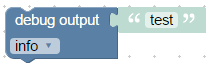

此代码块除了向日志中写入一行之外，不做任何其他操作。它可以用于调试脚本，例如：

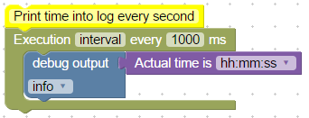

导入示例：

```xml 
<xml xmlns="http://www.w3.org/1999/xhtml">
  <block type="comment" id="K|2AnJ|5})RoNZ1T%Hh#" x="38" y="13">
    <field name="COMMENT">Print time into log every second</field>
    <next>
      <block type="timeouts_setinterval" id="LNsHTl,!r6eR8J9Yg,Xn">
        <field name="NAME">interval</field>
        <field name="INTERVAL">1000</field>
        <statement name="STATEMENT">
          <block type="debug" id=".oLS7P_oFU0%PWocRlYp">
            <field name="Severity">log</field>
            <value name="TEXT">
              <shadow type="text" id="X^Z/.qUry9B5Rr#N`)Oy">
                <field name="TEXT">test</field>
              </shadow>
              <block type="time_get" id="TPo6nim+=TBb-pnKMkRp">
                <mutation format="false" language="false"></mutation>
                <field name="OPTION">hh:mm:ss</field>
              </block>
            </value>
          </block>
        </statement>
      </block>
    </next>
  </block>
</xml>
```

您可以为消息定义 4 个不同的严重级别：

- debug（必须启用 Javascript 实例的调试级别才能使用此功能。）
- info（默认值，至少需要在 Javascript 实例中启用 info 日志级别。）
- 警告
- 错误（始终显示。如果在 Javascript 实例中进行了相应配置，则可以忽略其他级别。）

和

### 评注 
在脚本中添加注释，以便日后更好地理解。

该代码块没有任何作用，它只是一个注释。

和

### 税务州 
描述一个状态有两种不同的方法：

- 控制某个设备并将值发送到硬件（此模块）
- 写入一个仅用作信息的新值，例如温度变化（[下一个代码块](#update-state)）

该模块的典型用法：

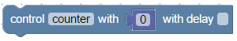

在对话框中选择对象 ID；必须指定要发送的值。根据数据点的类型，该值可以是 [字符串](#字符串值)、[数字](#数字值) 或 [布尔值]](#ogical-value-trueflase) 类型。

更多解释请参见[这里](https://github.com/ioBroker/ioBroker/wiki/Adapter-Development-Documentation#commands-and-statuses)。

此代码块将命令写入数据点（ack=false）。还可以指定延迟时间。

如果延迟时间不为 0，则状态不会立即设置，而是在指定的毫秒数后设置。

选中复选框即可删除此数据点的所有其他延迟。

在以下示例中，“Light”数据点仅切换一次（2秒后）：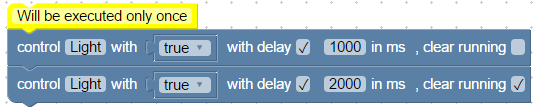

导入示例：

```xml 
<xml xmlns="http://www.w3.org/1999/xhtml">
  <block type="comment" id="K|2AnJ|5})RoNZ1T%Hh#" x="38" y="13">
    <field name="COMMENT">Will be executed only once</field>
    <next>
      <block type="control" id="IWceY@BFn9/Y?Ez^b(_-">
        <mutation delay_input="true"></mutation>
        <field name="OID">javascript.0.Light</field>
        <field name="WITH_DELAY">TRUE</field>
        <field name="DELAY_MS">1000</field>
        <field name="CLEAR_RUNNING">FALSE</field>
        <value name="VALUE">
          <block type="logic_boolean" id="I/LUv5/AknHr#[{{qd-@">
            <field name="BOOL">TRUE</field>
          </block>
        </value>
        <next>
          <block type="control" id=".Ih(K(P)SFApUP0)/K7,">
            <mutation delay_input="true"></mutation>
            <field name="OID">javascript.0.Light</field>
            <field name="WITH_DELAY">TRUE</field>
            <field name="DELAY_MS">2000</field>
            <field name="CLEAR_RUNNING">TRUE</field>
            <value name="VALUE">
              <block type="logic_boolean" id="B?)bgD[JZoNL;enJQ4M.">
                <field name="BOOL">TRUE</field>
              </block>
            </value>
          </block>
        </next>
      </block>
    </next>
  </block>
</xml>
```

与前一个例子不同，在下面的例子中，“亮”的状态切换了两次（分别在 1 秒后和 2 秒后）：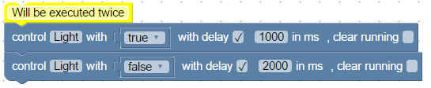

```xml 
<xml xmlns="http://www.w3.org/1999/xhtml">
  <block type="comment" id="K|2AnJ|5})RoNZ1T%Hh#" x="38" y="13">
    <field name="COMMENT">Will be executed twice</field>
    <next>
      <block type="control" id="IWceY@BFn9/Y?Ez^b(_-">
        <mutation delay_input="true"></mutation>
        <field name="OID">javascript.0.Light</field>
        <field name="WITH_DELAY">TRUE</field>
        <field name="DELAY_MS">1000</field>
        <field name="CLEAR_RUNNING">FALSE</field>
        <value name="VALUE">
          <block type="logic_boolean" id="I/LUv5/AknHr#[{{qd-@">
            <field name="BOOL">TRUE</field>
          </block>
        </value>
        <next>
          <block type="control" id=".Ih(K(P)SFApUP0)/K7,">
            <mutation delay_input="true"></mutation>
            <field name="OID">javascript.0.Light</field>
            <field name="WITH_DELAY">TRUE</field>
            <field name="DELAY_MS">2000</field>
            <field name="CLEAR_RUNNING">FALSE</field>
            <value name="VALUE">
              <block type="logic_boolean" id="B?)bgD[JZoNL;enJQ4M.">
                <field name="BOOL">FALSE</field>
              </block>
            </value>
          </block>
        </next>
      </block>
    </next>
  </block>
</xml>
```

和

### 开关状态 
这个块与 [控制状态块](#steuere-state) 类似，但它每次都会切换值——从 `true` 到 `false`，反之亦然。

和

### 更新状态 
此模块与[控制块](#steuere-state)类似，但它仅设置当前值，不会发送任何控制硬件的命令。

该模块的典型用法：


和

### 绑定状态 
这个模块将两个状态连接起来。

您可以使用以下模块实现同样的效果：

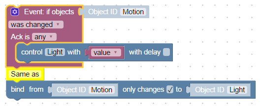

您可以选择仅在源发生更改时传递该值，还是每次更新时都传递该值。

导入示例：

```xml 
<block xmlns="http://www.w3.org/1999/xhtml" type="on_ext" id="w/@=5/5!D;8wn4DZ;jzG" x="287.99999999999943" y="37.999999999999716">
  <mutation items="1"></mutation>
  <field name="CONDITION">ne</field>
  <field name="ACK_CONDITION"></field>
  <value name="OID0">
    <shadow type="field_oid" id="tQBL3[;V1luVO[`h2ONM">
      <field name="oid">javascript.0.Motion</field>
    </shadow>
  </value>
  <statement name="STATEMENT">
    <block type="control" id="w=sN]yxb)5Jv!,YK[C5%">
      <mutation delay_input="false"></mutation>
      <field name="OID">javascript.0.Light</field>
      <field name="WITH_DELAY">FALSE</field>
      <value name="VALUE">
        <block type="variables_get" id="6`1|t;T%_h^|ES+nd~/?">
          <field name="VAR">value</field>
        </block>
      </value>
    </block>
  </statement>
</block>
```

和

### 写入状态 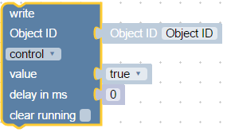
通用写入块，可以与 [“更新状态”](#update-state) 和 [“控制状态”](#control-state) 一起执行相同的操作。

但与它们相比，您可以定义对象 ID 和延迟，并与其他代码块一起使用，使您的脚本更具通用性。

### 创建状态
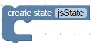 脚本中可以创建两种类型的变量：

- 本地 [变量](#set-variables-value)
- 全局变量或状态。

全局状态在所有脚本中可见，但本地状态仅在当前脚本中可见。

全局状态可用于可视化、移动应用以及所有其他逻辑或可视化模块，可以记录到数据库或其他任何地方。

此代码块用于创建全局状态。如果该状态已存在，则该命令将被忽略。您可以安全地在脚本的每次启动时调用此代码块。

此代码块会创建全局状态，如果这些状态已存在，则会忽略该命令。因此，每次脚本启动时都可以安全地使用此代码块。

该模块的典型用法：

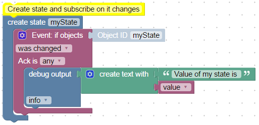

```xml 
<xml xmlns="http://www.w3.org/1999/xhtml">
  <block type="comment" id="dBV.{0z/{Fr@RB+10H5i" x="38" y="13">
    <field name="COMMENT">Create state and subscribe on it changes</field>
    <next>
      <block type="create" id="D%[{T~!b9^V#Z.7bI+3y">
        <field name="NAME">myState</field>
        <statement name="STATEMENT">
          <block type="on_ext" id="H@F~z_,FpvXo8BptmAtL">
            <mutation items="1"></mutation>
            <field name="CONDITION">ne</field>
            <field name="ACK_CONDITION"></field>
            <value name="OID0">
              <shadow type="field_oid" id="hn{OMH9y7AP_dns;KO6*">
                <field name="oid">javascript.0.myState</field>
              </shadow>
            </value>
            <statement name="STATEMENT">
              <block type="debug" id="DjP1pU?v=))`V;styIRR">
                <field name="Severity">log</field>
                <value name="TEXT">
                  <shadow type="text" id="de?mCXefl4v#XrO])~7y">
                    <field name="TEXT">test</field>
                  </shadow>
                  <block type="text_join" id="^33}.]#ov(vUAEEn8Hdp">
                    <mutation items="2"></mutation>
                    <value name="ADD0">
                      <block type="text" id="_-p%CZq4%)v1EYvh)lf@">
                        <field name="TEXT">Value of my state is </field>
                      </block>
                    </value>
                    <value name="ADD1">
                      <block type="variables_get" id="6r!TtpfrfQ@5Nf[4#[6l">
                        <field name="VAR">value</field>
                      </block>
                    </value>
                  </block>
                </value>
              </block>
            </statement>
          </block>
        </statement>
      </block>
    </next>
  </block>
</xml>
```

新创建的状态可以在代码块本身中使用。

以下代码首次执行时会出错，因为“subscribe”找不到“myState”对象：

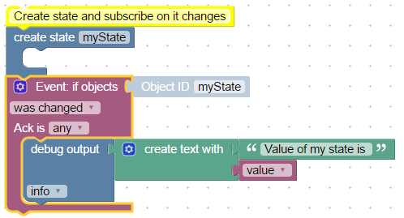

第二次执行时不会显示任何错误，因为数据点现在已经存在。

和

### 对象 ID 的值 
此模块用于读取数据点的值。可以读取数据点的以下属性：

- 价值
- 确认 - 命令 = false 或 更新 = true
- 自 1970 年 1 月 1 日以来的时间戳（以毫秒为单位）（类型为“日期对象”）
- 自 1970 年 1 月 1 日以来该值最后一次更改的时间（以毫秒为单位）（类型为“日期对象”）
- 质量
- 源 - 写入最后一个值的实例的名称，例如 `system.adapter.javascript.0`

例如，输出上次值发生变化的时间：

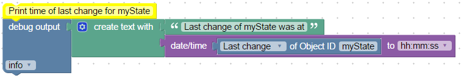

```xml 
<xml xmlns="http://www.w3.org/1999/xhtml">
  <block type="comment" id="GVW732OFexZ9HP[q]B3," x="38" y="13">
    <field name="COMMENT">Print time of last change for myState</field>
    <next>
      <block type="debug" id="t,GmgLjo]1d0{xT+@Yns">
        <field name="Severity">log</field>
        <value name="TEXT">
          <shadow type="text" id="w{UF-|ashrP4e*jl~{9_">
            <field name="TEXT">test</field>
          </shadow>
          <block type="text_join" id="i~L{r:B9oU}.ANc.AV8F">
            <mutation items="2"></mutation>
            <value name="ADD0">
              <block type="text" id="r5=i|qvrII+NCAQ~t{p5">
                <field name="TEXT">Last change of myState was at</field>
              </block>
            </value>
            <value name="ADD1">
              <block type="convert_from_date" id="?cGS1/CwThX!tTDMVSoj">
                <mutation format="false" language="false"></mutation>
                <field name="OPTION">hh:mm:ss</field>
                <value name="VALUE">
                  <block type="get_value" id="k+#N2u^rx)u%Z9lA`Yps">
                    <field name="ATTR">lc</field>
                    <field name="OID">javascript.0.myState</field>
                  </block>
                </value>
              </block>
            </value>
          </block>
        </value>
      </block>
    </next>
  </block>
</xml>
```

和

### 对象 ID


这是一个简单的辅助模块，用于方便地选择对象 ID 来触发该模块。

点击“对象 ID”即可打开 ID 选择对话框。

该模块的典型用法：

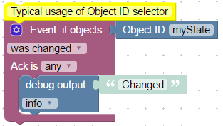

```xml 
<xml xmlns="http://www.w3.org/1999/xhtml">
  <block type="comment" id="GVW732OFexZ9HP[q]B3," x="38" y="13">
    <field name="COMMENT">Typical usage of Object ID selector</field>
    <next>
      <block type="on_ext" id="D+1_tP(lF!R]wy?R#|~A">
        <mutation items="1"></mutation>
        <field name="CONDITION">ne</field>
        <field name="ACK_CONDITION"></field>
        <value name="OID0">
          <shadow type="field_oid" id="rpg#*-DXMVqzexE8-^Xc">
            <field name="oid">default</field>
          </shadow>
          <block type="field_oid" id="YYTRKxeC@l3WE~OJx4ei">
            <field name="oid">javascript.0.myState</field>
          </block>
        </value>
        <statement name="STATEMENT">
          <block type="debug" id="{;_x6LATJ,b^leE,xgz9">
            <field name="Severity">log</field>
            <value name="TEXT">
              <shadow type="text" id="-)V}_9Cxt2kj:]36y,7#">
                <field name="TEXT">Changed</field>
              </shadow>
            </value>
          </block>
        </statement>
      </block>
    </next>
  </block>
</xml>
```

和

和

### 可用数据点
此模块返回一个布尔值（`true` / `false`），指示指定的数据点当前在状态数据库中是否存在值记录。OID 通过值输入提供——它可以来自 OID 选择模块（`Objekt ID`）、字符串变量或任何其他返回状态 ID 的模块。

**为什么会这样？** ioBroker 将**对象**（元数据）和**状态**（值）分开存储。适配器可以创建数据点的*对象*（其 ID 会出现在 OID 选择对话框中），而无需写入*值*。在这种情况下，`getState(...)` 会在日志中产生警告：

```
warn  getState "zigbee.0.187a3efffee9e4e8.load_power" not found (3)
```

即使像 `Wert von Objekt-ID … != null` 这样的检查也会触发此警告，因为它是在 `getState` 调用期间出现的——也就是说，甚至在比较被评估之前。

**数据点存在** 块内部使用 `existsStateAsync(...)`。此函数会静默检查缓存，如果状态缺失，则不会向日志写入任何内容。这是一种简洁的方法，可以防止适配器预先创建数据点但未立即填充数据时（例如，Zigbee、Tuya）调用 `getState`。

典型用例——防止读取操作因缺少状态记录而导致失败：

```
wenn [Datenpunkt vorhanden [Objekt ID "zigbee.0.…load_power"]]
    setze [leistung] auf [Wert von Objekt-ID "zigbee.0.…load_power"]
    log [leistung]
```

生成的 JavaScript 代码：

```javascript
if ((await existsStateAsync('zigbee.0.187a3efffee9e4e8.load_power'))) {
    let leistung = getState('zigbee.0.187a3efffee9e4e8.load_power').val;
    console.log(leistung);
}
```

**注意：** 如果适配器设置为“启动时不订阅所有状态”，则 `existsState` 无法同步计算。因此，该代码块会生成异步形式 (`await existsStateAsync(...)`)，该形式在两种模式下均可正常工作。

和

## 操作模块
### 执行命令
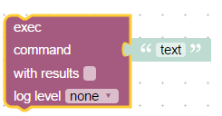

此代码块会在系统中执行输入的命令，就像通过 SSH 在命令行输入命令一样。

该命令以启动 ioBroker 的用户的权限执行。

如果不需要输出，可以将其抑制：

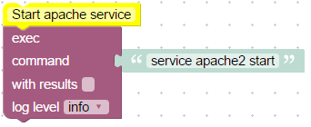

如果需要输出：

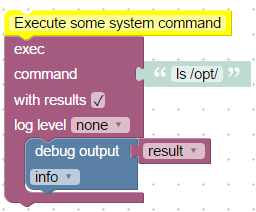

和

```xml 
<xml xmlns="http://www.w3.org/1999/xhtml">
  <block type="comment" id="GVW732OFexZ9HP[q]B3," x="313" y="38">
    <field name="COMMENT">Execute some system command</field>
    <next>
      <block type="exec" id="hGkHs.IkmiTa{jR^@-}S">
        <mutation with_statement="true"></mutation>
        <field name="WITH_STATEMENT">TRUE</field>
        <field name="LOG"></field>
        <value name="COMMAND">
          <shadow type="text" id=":KG#hyuPRhQJWFSk)6Yo">
            <field name="TEXT">ls /opt/</field>
          </shadow>
        </value>
        <statement name="STATEMENT">
          <block type="debug" id="ELv(y5V4[hZ,F8,]D51x">
            <field name="Severity">log</field>
            <value name="TEXT">
              <shadow type="text" id="J[o*Fylexfu41}smph).">
                <field name="TEXT">result</field>
              </shadow>
              <block type="variables_get" id="gWo7Y^,QI=PqL(Q;7D=^">
                <field name="VAR">result</field>
              </block>
            </value>
          </block>
        </statement>
      </block>
    </next>
  </block>
</xml>
```

和

创建了三个特殊变量来分析输出结果：

- 结果，包含控制台的常规输出（例如，命令“ls /opt”的输出为“iobroker nodejs”）
- 如果 JavaScript 模块无法执行命令，则返回错误对象。
- stderr，即已执行程序的错误输出

此外，如果日志级别未设置为“none”，则相同的输出也会出现在日志中。

和

### 请求 URL
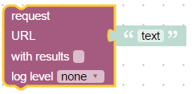

调用 URL 并返回结果。

例子：

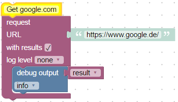

创建了三个特殊变量来分析输出结果：

结果包含所请求页面的正文。
- 错误，包含错误描述
- 响应（仅限高级用户），类型为 [http.IncomingMessage](https://nodejs.org/api/http.html#http_class_http_incomingmessage) 的特殊对象

如果不需要输出，可以将其隐藏。为此，请选中“包含结果”选项。

和

和

## SendTo 块
### 发送到 Telegram
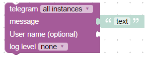

此模块用于通过 Telegram 适配器发送消息。

当然，必须事先安装并配置 Telegram 适配器。

要通过特定实例发送消息，必须选择所需的适配器实例（通常是 telegram.0）；否则，消息将通过所有可用实例发送。

*消息*字段为必填项，其中包含的文本将原样发送给客户。

用户名 ID 是可选的，这是 [电报](https://core.telegram.org/bots/api#user) 中的 ID（用户或机器人的唯一标识符）。

此外，如果日志级别不为“none”，则会将相同的消息发送到日志中。

和

### 发送至 SayIt
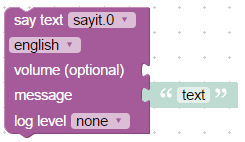

此模块用于向 `sayit` 实例发送文本，以朗读此文本。

当然，必须安装并配置 `sayit` 适配器。

要向某个特定实例发送消息，您应该选择已安装的适配器实例（通常为`sayit.0`），否则消息将发送到所有现有实例。

属性 *message* 为必填项，系统将读出此文本。

您必须检查语言属性。这将用于文本转语音引擎。

音量是可选的（通常为 0 到 100）。

此外，如果日志级别不为“none”，则会将相同的消息发送到日志中。

和

### 发送到 Pushover
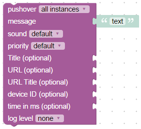

此模块用于向 Pushover 客户端发送文本。您可以阅读有关 Pushover 驱动程序 [这里](https://github.com/ioBroker/ioBroker.pushover) 的内容。

当然，推入式适配器必须安装并配置好。

要向某个特定实例发送消息，您应该选择已安装的适配器实例（通常是 pushover.0），否则消息将发送到所有现有实例。

房产*信息*为必填项，系统将向客户发送此文本。

其他所有属性均为可选，您可以阅读 [这里](https://pushover.net/api) 了解详情：

- *设备 ID* - 您的用户设备名称，用于将消息直接发送到该设备，而不是发送到用户的所有设备（多个设备可以用逗号分隔）
- *标题* - 您的消息标题，否则将使用您的应用名称。
- *URL* - 要与您的消息一起显示的补充 URL
- *URL 标题* - 您的辅助 URL 的标题，否则仅显示 URL 本身。
- *优先级* - 发送时，-2 表示不生成任何通知/提醒，-1 表示始终以静默通知形式发送，1 表示以高优先级显示并绕过用户的静默时间，2 表示还需要用户确认。
- *时间（毫秒）* - 要向用户显示的您的消息日期和时间的 Unix 时间戳，而不是我们的 API 接收到您的消息的时间。
- *声音* - 设备客户端支持的声音名称之一，用于覆盖用户的默认声音选择。

此外，如果日志级别不为“none”，则会将相同的消息发送到日志中。

和

### 发送电子邮件
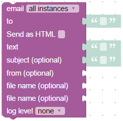

此模块用于以电子邮件形式发送文本。

当然，邮件适配器必须经过安装、配置和测试。

要向某个特定实例发送消息，您应该选择已安装的适配器实例（通常是 email.0），否则消息将发送到所有现有实例。

房产*文本*为必填项，系统将完全按照此文本发送给客户。

当然，收件人（*to*）必须填写有效的电子邮件地址。

您最多可以向电子邮件添加 5 个附件（通常是图片）。要在正文中使用图片，您必须将格式更改为 HTML（选中“以 HTML 格式发送”选项），文本格式可能如下所示：

```html
<p>Embedded image 1: </p>
<p>Embedded image 2: </p>
```

您可以将文件引用为 ``````。“file1”和“file2”是保留 ID，不能更改。

“文件名”必须包含磁盘上图像的完整路径。

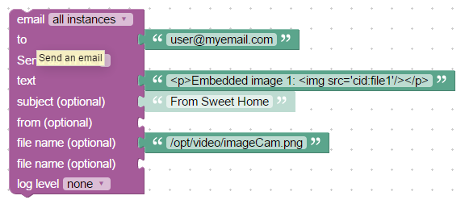

```xml 
<block xmlns="http://www.w3.org/1999/xhtml" type="email" id="VeysPTJXFh^.CW1t(s@Q" x="563" y="63">
  <field name="INSTANCE"></field>
  <field name="IS_HTML">FALSE</field>
  <field name="LOG"></field>
  <value name="TO">
    <shadow type="text" id=".6+6Rp^N7JHiNkP/.^09">
      <field name="TEXT"></field>
    </shadow>
    <block type="text" id="NC6==~4g|OB^`xZ:|Rlx">
      <field name="TEXT">user@myemail.com</field>
    </block>
  </value>
  <value name="TEXT">
    <shadow type="text" id="jaGOyI%O4wl(.s.wo(Y`">
      <field name="TEXT"></field>
    </shadow>
    <block type="text" id=")--+u-+rdoAyWpi9I87+">
      <field name="TEXT">&lt;p&gt;Embedded image 1: &lt;img src='cid:file1'/&gt;&lt;/p&gt;</field>
    </block>
  </value>
  <value name="SUBJECT">
    <shadow type="text" id="|49=rPOCP]hwFD[HX@_I">
      <field name="TEXT">From Sweet Home</field>
    </shadow>
  </value>
  <value name="FILE_1">
    <block type="text" id="tlb_Kuh5?JvPTQr)A{}4">
      <field name="TEXT">/opt/video/imageCam.png</field>
    </block>
  </value>
</block>
```

此外，如果日志级别不为“none”，则会将相同的消息发送到日志中。

和

### 自定义 sendTo 块
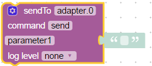

这只是一个帮助块，用于向任何适配器发送内部系统消息（sendTo）。

当然，您可以使用自定义函数块来做任何疯狂的事情，还可以发送消息。

您可以为 sendTo 命令定义自己的参数：

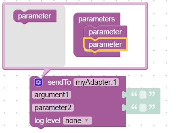

阅读更多关于“sendTo”的信息 [这里](https://github.com/ioBroker/ioBroker.javascript#sendto)。

如何将 SQL 查询发送到 SQL 适配器的示例：

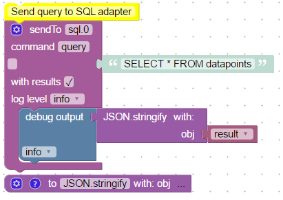

```xml 
<xml xmlns="http://www.w3.org/1999/xhtml"> -->
  <block type="comment" id="GVW732OFexZ9HP[q]B3," x="163" y="13">
    <field name="COMMENT">Send query to SQL adapter</field>
    <next>
      <block type="sendto_custom" id="84lYloO4o+RvLszPVHZ5">
        <mutation items="" with_statement="true"></mutation>
        <field name="INSTANCE">sql.0</field>
        <field name="COMMAND">query</field>
        <field name="WITH_STATEMENT">TRUE</field>
        <field name="LOG">log</field>
        <value name="ARG0">
          <shadow type="text" id=")faamoSD,nGPXawY4|(Z">
            <field name="TEXT">SELECT * FROM datapoints</field>
          </shadow>
        </value>
        <statement name="STATEMENT">
          <block type="debug" id="Q#UJl]^_g/VHzM*G/a:f">
            <field name="Severity">log</field>
            <value name="TEXT">
              <shadow type="text" id="#!NJS43!0z@}z:6~_,9(">
                <field name="TEXT">test</field>
              </shadow>
              <block type="procedures_callcustomreturn" id="0E2fmQQduf4)-({z(om|">
                <mutation name="JSON.stringify">
                  <arg name="obj"></arg>
                </mutation>
                <value name="ARG0">
                  <block type="variables_get" id=",^2E2eT#598hI^TvABD9">
                    <field name="VAR">result</field>
                  </block>
                </value>
              </block>
            </value>
          </block>
        </statement>
      </block>
    </next>
  </block>
  <block type="procedures_defcustomreturn" id="lm*.n3kQXll8o9X^*m,k" x="163" y="263">
    <mutation statements="false">
      <arg name="obj"></arg>
    </mutation>
    <field name="NAME">JSON.stringify</field>
    <field name="SCRIPT">cmV0dXJuIEpTT04uc3RyaW5naWZ5KG9iaik7</field>
    <comment pinned="false" h="80" w="160">Describe this function...</comment>
  </block>
</xml>
```

如果只使用一个空名称的参数，则不会创建任何结构，如下所示：

```javascript
var obj, result;

/**
 * Describe this function...
 */
function JSON_stringify(obj) {
    return JSON.stringify(obj);
}


// Send query to SQL adapter
sendTo("sql.0", "query", 'SELECT * FROM datapoints', function (result) {
    console.log((JSON_stringify(result)));
  });
console.log("sql.0: " + "");
```

或者如何从 SQL 适配器请求历史记录：

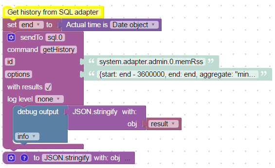

```XML
<xml xmlns="http://www.w3.org/1999/xhtml">
  <block type="comment" id="GVW732OFexZ9HP[q]B3," x="263" y="13">
    <field name="COMMENT">Get history from SQL adapter</field>
    <next>
      <block type="variables_set" id="J;8I^fN*4YQ1+jPI3FS#">
        <field name="VAR">end</field>
        <value name="VALUE">
          <block type="time_get" id="kZFFxa-2%7/:=IHU|}eB">
            <mutation format="false" language="false"></mutation>
            <field name="OPTION">object</field>
          </block>
        </value>
        <next>
          <block type="sendto_custom" id="84lYloO4o+RvLszPVHZ5">
            <mutation items="id,options" with_statement="true"></mutation>
            <field name="INSTANCE">sql.0</field>
            <field name="COMMAND">getHistory</field>
            <field name="WITH_STATEMENT">TRUE</field>
            <field name="LOG"></field>
            <value name="ARG0">
              <shadow type="text" id=")faamoSD,nGPXawY4|(Z">
                <field name="TEXT">system.adapter.admin.0.memRss</field>
              </shadow>
            </value>
            <value name="ARG1">
              <shadow type="text" id="/nmT=qDw;S`#*tXN=C6n">
                <field name="TEXT">{start: end - 3600000, end: end, aggregate: "minmax"}</field>
              </shadow>
            </value>
            <statement name="STATEMENT">
              <block type="debug" id="Q#UJl]^_g/VHzM*G/a:f">
                <field name="Severity">log</field>
                <value name="TEXT">
                  <shadow type="text" id="#!NJS43!0z@}z:6~_,9(">
                    <field name="TEXT">test</field>
                  </shadow>
                  <block type="procedures_callcustomreturn" id="0E2fmQQduf4)-({z(om|">
                    <mutation name="JSON.stringify">
                      <arg name="obj"></arg>
                    </mutation>
                    <value name="ARG0">
                      <block type="variables_get" id=",^2E2eT#598hI^TvABD9">
                        <field name="VAR">result</field>
                      </block>
                    </value>
                  </block>
                </value>
              </block>
            </statement>
          </block>
        </next>
      </block>
    </next>
  </block>
  <block type="procedures_defcustomreturn" id="lm*.n3kQXll8o9X^*m,k" x="263" y="313">
    <mutation statements="false">
      <arg name="obj"></arg>
    </mutation>
    <field name="NAME">JSON.stringify</field>
    <field name="SCRIPT">cmV0dXJuIEpTT04uc3RyaW5naWZ5KG9iaik7</field>
    <comment pinned="false" h="80" w="160">JSON.stringify object</comment>
  </block>
</xml>
```

生成的 JavaScript 代码：

```javascript
var obj, end, result;

/**
 * JSON.stringify object
 */
function JSON_stringify(obj) {
    return JSON.stringify(obj);
}


// Get history from SQL adapter
end = (new Date().getTime());
sendTo("sql.0", "getHistory", {
   "id": 'system.adapter.admin.0.memRss',
   "options": {start: end - 3600000, end: end, aggregate: "minmax"}
}, function (result) {
    console.log((JSON_stringify(result)));
  });
```

如果值以“{”开头，它将被解释为 JSON 字符串。字符串中请使用双引号。

和

### 发送到另一个脚本 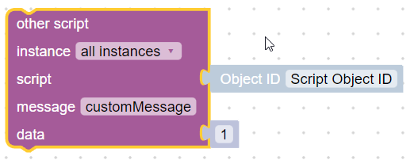
此代码块允许您向另一个脚本发送消息。然后，该消息可以由代码块 [事件 – 收到消息](#trigger-on-script-event) 处理。

和

## 日期和时间块
###时间比较


如果使用运算符“between”或“not between”，则代码块如下所示：


您可以指定一个时间，该时间必须与目标时间进行比较。代码块期望的时间格式为“Date 对象”。


比较模式有以下几种：

- 小于，检查实际时间是否小于指定时间。
等于或小于
大于
等于或大于
等于
- 之间，检查一下几天之间的时间。
例如，如果时间必须在 12:00 到 20:00 之间，则会检查实际时间是否大于或等于 12:00 且小于 20:00。如果是 20:00，则返回 false。
例如，晚上 9 点到早上 8 点之间。在最后一种情况下，将检查时间是否大于或等于 21:00 或小于 8:00。

- 如果时间不在指定的白天时段内，则不满足条件。如果时间小于开始时间且大于或等于结束时间。（如果开始时间大于结束时间，则会检查时间是否大于或等于结束时间且小于开始时间）

以下时间格式有效：

- YYYY-MM-DD hh:mm:ss
- YYYY-MM-DD hh:mm
- hh:mm:ss
- 小时:分钟

和

### 实际时间对比


此模块用于比较日期时间和实际时间。其逻辑与 [时间比较](#time-comparision) 相同，但限制不能是模块，并且仅比较实际时间。（为了与旧版本兼容）

和

### 获取特定格式的实际时间


返回指定格式的实际时间。

支持以下格式：

- 毫秒 - 仅返回当前秒的毫秒数，范围从 0 到 999（不是 Unix 时间戳的毫秒数）。要获取 Unix 时间戳的毫秒数，请使用“Date 对象”。
- seconds - 只返回当前分钟的秒数，范围从 0 到 59，
- 当天秒数 - 返回从当天开始的秒数（0 到 24 * 3600 - 1），
- 分钟 - 返回当前小时的分钟数，范围从 0 到 59，
- 一天中的分钟数 - 返回从当天开始的分钟数（0 到 24 * 60 - 1），
- hours - 返回当前日期的小时数，范围从 0 到 23，
- 日期 - 获取 1 到 31 之间的日期，
- 月份为数字 - 获取 1 到 12 之间的月份数字。
- 月份（文本格式）- 获取月份的文本格式。必须指定语言。
- 月份（短文本） - 获取月份文本：Jan、Feb、Mar、Apr、May、June、July、Aug、September、Oct、Nov、Dec。必须指定语言。
- 短年份 - 年份从 0 到 99，例如 2016 年的结果为 16。
- 全年 - 全年：2016
- 星期几短信 - 获取星期几的短信。
- 简短的星期几 - 将星期几作为简短文本获取：Su、Mon、Tu、We、Th、Fri、Sat。
- 星期几以数字表示 - 星期几以数字表示，从 1（星期一）到 7（星期日）。
- 自定义格式 - 您可以指定自己的[格式](https://github.com/ioBroker/ioBroker.javascript#formatdate)。
- 日期对象 - 返回日期和时间，以自纪元开始（1970.1.1 00:00:00.000Z GMT）以来的毫秒数表示。此时间始终为格林威治标准时间 (GMT)。
- yyyy.mm.dd - 2016.09.14
- yyyy/mm/dd - 2016/09/14
- 年.月.日 - 2014年9月16日
- 年/月/日 - 2014年9月16日
- 日.月.年 - 2016年9月14日
- 日/月/年 - 2016年9月14日
- 日.月.年 - 2016年9月14日
- 日/月/年 - 2016年9月14日
- mm/dd/yyyy - 2016年9月14日
- mm/dd/yy - 2016年9月14日
- 日.月. - 14.09.
- 日/月 - 14/09
- mm.dd - 09.14
- mm/dd - 09/14
- hh:mm - 12:00
- hh:mm:ss - 12:00:00
- hh:mm:ss.sss - 12:00:00.000

和

### 获取今日天文事件时间
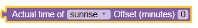

返回当前日期中某个特定天文事件发生的时间。

属性“offset”表示以分钟为单位的偏移量。它也可以是负数，表示天文事件发生前的时间。

以下值可用作天文函数中的属性：

- 日出：日出（太阳的上边缘出现在地平线上）
- 日出结束：日出结束（太阳的下边缘触及地平线）
- goldenHourEnd：早晨黄金时段（柔和光线，最适合摄影的时段）结束
- 太阳正午：太阳正午（太阳位于最高点）
- 黄金时段：傍晚黄金时段开始
- 日落开始：日落开始（太阳的下边缘触及地平线）
日落：太阳落山，傍晚民用曙暮光开始。
- 黄昏：黄昏（傍晚航海曙暮光开始）
- nauticalDusk：航海黄昏（傍晚天文曙暮光开始）
- 夜晚：夜幕降临（足够黑暗，可以进行天文观测）
- nightEnd：夜晚结束（晨曦天文曙暮光开始）
- nauticalDawn：航海黎明（早晨航海曙光开始）
- 黎明：黎明（航海曙暮光结束，民用曙暮光开始）
- 最低点：最低点（夜晚最黑暗的时刻，太阳位于最低位置）

返回值类型为“日期对象”，即自 1970.01.01 起的毫秒数。

**注意：**要使用“astro”功能，必须在javascript适配器设置中定义“纬度”和“经度”。

和

和

## 转换块
有时需要将值转换为其他类型。以下代码块允许将值转换为特定类型。

### 转换为数字


将值转换为数字（浮点数）。

和

### 转换为布尔值


将值转换为布尔值（true 或 false）。

和

### 转换为字符串


将值转换为字符串。

和

### 获取变量类型


获取值的类型。类型可以是：布尔值、数字、字符串、对象。

和

### 转换为日期/时间对象


将值转换为“日期对象”。读取[这里](#get-actual-time-im-specific-format)，了解“日期对象”是什么。

和

### 将日期/时间对象转换为字符串


将“日期对象”转换为字符串。它与 [以特定格式获取实际时间](#get-actual-time-im-specific-format) 具有相同的格式选项。

和

### 将 JSON 转换为对象


将 JSON 字符串转换为 JavaScript 对象。如果发生错误，则返回空对象。（仅限专家级用户）

和

### 将对象转换为 JSON
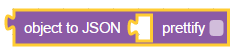

将 JavaScript 对象转换为 JSON 字符串。如果选中“美化”选项，则结果字符串如下所示：

```json
{
  "a": 1,
  "b": 2
}
```

如果不：

```
{"a": 1, "b": 2}
```

### 通过 JSONata 表达式转换


使用 JSONata 表达式转换 Javascript 对象。您可以在这里阅读更多相关信息：[https://jsonata.org/](https://jsonata.org/)

示例有效载荷：

```
{"example": [{"value": 4},{"value": 7},{"value": 13}]}
```

结果：

```
[{"value": 4},{"value": 7},{"value": 13}]
24
4
13
```

＃＃ 扳机
### 状态变化触发
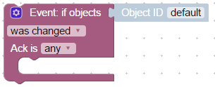

此模块会在给定对象的状态发生改变或更新时执行某些操作。它是构建不同状态及其对应系统之间交互的主要模块。

通过此模块，您可以将不同的状态绑定在一起，或者在值更改时发送消息或电子邮件。

代码块的典型用法：

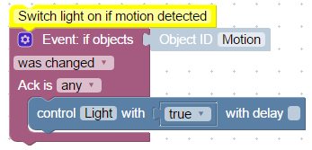

```xml 
<xml xmlns="http://www.w3.org/1999/xhtml">
  <block type="comment" id="]L0d;6j+=OH*[4n{C7v^" x="112" y="13">
    <field name="COMMENT">Switch light on if motion detected</field>
    <next>
      <block type="on_ext" id="QYVeQlu|#2hwniNg)=z8">
        <mutation items="1"></mutation>
        <field name="CONDITION">ne</field>
        <field name="ACK_CONDITION"></field>
        <value name="OID0">
          <shadow type="field_oid" id="Xe6D#r|nf9SEK`.oAuS0">
            <field name="oid">javascript.0.Motion</field>
          </shadow>
        </value>
        <statement name="STATEMENT">
          <block type="control" id="J(HiEvnNKw2B%V1~WXsX">
            <mutation delay_input="false"></mutation>
            <field name="OID">javascript.0.Light</field>
            <field name="WITH_DELAY">FALSE</field>
            <value name="VALUE">
              <block type="logic_boolean" id="o;j8lE#h.XE,0:0_LcW{">
                <field name="BOOL">TRUE</field>
              </block>
            </value>
          </block>
        </statement>
      </block>
    </next>
  </block>
</xml>
```

您可以通过扩展对话框定义任意数量的 ObjectID：

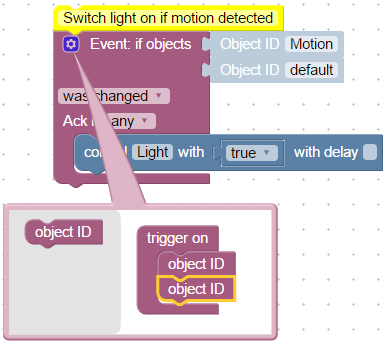

如果只使用一个对象 ID，则语句块中可以使用特殊变量：

- 值 - 状态的实际值
- oldValue - 状态的旧值

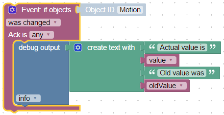

```xml 
<block xmlns="http://www.w3.org/1999/xhtml" type="on_ext" id="QYVeQlu|#2hwniNg)=z8" x="38" y="39">
  <mutation items="1"></mutation>
  <field name="CONDITION">ne</field>
  <field name="ACK_CONDITION"></field>
  <value name="OID0">
    <shadow type="field_oid" id="Xe6D#r|nf9SEK`.oAuS0">
      <field name="oid">javascript.0.Motion</field>
    </shadow>
  </value>
  <statement name="STATEMENT">
    <block type="debug" id="jT6fif_FI9ua|,rL[Ra1">
      <field name="Severity">log</field>
      <value name="TEXT">
        <shadow type="text" id="}=qIm)a0)};f+J/JRgy^">
          <field name="TEXT">test</field>
        </shadow>
        <block type="text_join" id="wjgpY(Whewaqy0d8NVx%">
          <mutation items="4"></mutation>
          <value name="ADD0">
            <block type="text" id="M?[Xy1(Fu36A;b#=4~[t">
              <field name="TEXT">Actual value is</field>
            </block>
          </value>
          <value name="ADD1">
            <block type="variables_get" id="W)*G#(JDzuVpV^1P|[2m">
              <field name="VAR">value</field>
            </block>
          </value>
          <value name="ADD2">
            <block type="text" id="7TW;voPvdc#c4e/SWCjZ">
              <field name="TEXT">Old value was</field>
            </block>
          </value>
          <value name="ADD3">
            <block type="variables_get" id="s`6)4s:}%L#f]pu4E[vK">
              <field name="VAR">oldValue</field>
            </block>
          </value>
        </block>
      </value>
    </block>
  </statement>
</block>
```

否则，如果触发器使用多个对象 ID，则可以通过 [触发信息](#trigger-info) 访问值和旧值。

和

### 状态变化触发
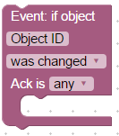

这与“状态改变时触发”模块相同，但无法使用多个对象 ID 进行触发（为了版本兼容性）。

和

### 触发信息


获取有关触发状态的值、时间戳或 ID 的信息。

此代码块只能在 [“状态改变时触发”](#trigger-on-states-change) 或 [“状态改变时触发”](#trigger-on-state-change) 代码块中使用。

您可以获取以下信息：

- 对象 ID - 触发该触发器的状态 ID
- name - 来自 common.name 的州名
- description - 来自 common.desc 的状态描述
- 通道 ID - 该状态所属通道的 ID。如果没有通道，则为 null。
- 频道名称 - 该状态所属的频道名称。如果没有频道，则为 null。
- 设备 ID - 该状态所属设备的 ID。如果没有通道，则为 null。
- 设备名称 - 该状态所属设备的名称。如果没有通道，则为 null。
- 状态值 - 触发状态的实际值
- 状态时间戳 - 实际时间戳（Date 对象）
- 状态质量 - 实际质量值代码
- 值来源 - 导致更改的实例名称
- 是命令还是更新 - 它是命令（ack=false）还是更新（ack=true）
- 状态的最后变化 - 此值最后变化的时间戳
- 先前值 - 此状态在触发器触发之前的值
- 先前时间戳 - 此状态的先前时间戳，即触发器触发之前的时间戳
- 先前质量 - 触发事件发生前该状态的先前质量
- 先前起源 - 此状态在触发事件发生之前的起源
- 先前的命令或更新 - 触发器触发前该值的先前类型
- 上一次最后更改 - 此状态在触发器触发之前的“最后更改值”。

典型用法：

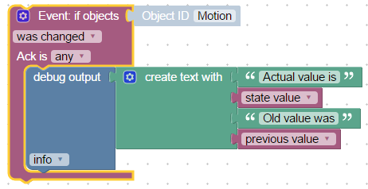

```xml 
<block xmlns="http://www.w3.org/1999/xhtml" type="on_ext" id="QYVeQlu|#2hwniNg)=z8" x="113" y="238">
  <mutation items="1"></mutation>
  <field name="CONDITION">ne</field>
  <field name="ACK_CONDITION"></field>
  <value name="OID0">
    <shadow type="field_oid" id="Xe6D#r|nf9SEK`.oAuS0">
      <field name="oid">javascript.0.Motion</field>
    </shadow>
  </value>
  <statement name="STATEMENT">
    <block type="debug" id="jT6fif_FI9ua|,rL[Ra1">
      <field name="Severity">log</field>
      <value name="TEXT">
        <shadow type="text" id="}=qIm)a0)};f+J/JRgy^">
          <field name="TEXT">test</field>
        </shadow>
        <block type="text_join" id="wjgpY(Whewaqy0d8NVx%">
          <mutation items="4"></mutation>
          <value name="ADD0">
            <block type="text" id="M?[Xy1(Fu36A;b#=4~[t">
              <field name="TEXT">Actual value is</field>
            </block>
          </value>
          <value name="ADD1">
            <block type="on_source" id="_q8v0HD`c[7e76O{@4Tq">
              <field name="ATTR">state.val</field>
            </block>
          </value>
          <value name="ADD2">
            <block type="text" id="7TW;voPvdc#c4e/SWCjZ">
              <field name="TEXT">Old value was</field>
            </block>
          </value>
          <value name="ADD3">
            <block type="on_source" id="D`gpXSShKRQuy:jyMK}6">
              <field name="ATTR">oldState.val</field>
            </block>
          </value>
        </block>
      </value>
    </block>
  </statement>
</block>
```

和

＃＃＃ 日程


这是继[“状态改变时触发”](#trigger-on-states-change)之后的第二个自动化主模块。该模块允许定期执行一些操作。

调度规则的定义将在文档非常完善的 CRON [格式](https://en.wikipedia.org/wiki/Cron) 中完成。此外，还可以定义秒数。

如果需要使用秒数，则必须将其定义为 CRON 规则的第一个参数，并且该规则将包含 6 个部分。

通常，CRON 规则由 5 或 6 个部分组成：

- 秒数规则（可选）
- 会议规则
- 工作时间规定
- 月份日期规则
- 本月规则
以及星期几的规则。

每个部分允许采用以下格式：

- \* - 每隔（秒、分钟、小时……）发射一次
- X（例如 5）- 仅在当前秒、分、时……开火
- 从-到（例如 1-9）- 仅在此区间内触发
- \*/X（例如 \*/5）- 每隔 X 秒、分钟……触发一次。如果“\*/5”表示小时，则触发器将在 0、5、10、15 和 20 小时触发。
数字和区间可以用逗号连接（例如 1,3,4-6）。数字之间不要加空格，因为空格是规则各部分的分隔符。

*/10 * * 6.7 - 周六和周日每 10 分钟开火一次。

\*/30 \* \* \* \* \* - 每 30 秒发射一次。

```
 ┌───────────── min (0 - 59)
 │ ┌────────────── hour (0 - 23)
 │ │ ┌─────────────── day of month (1 - 31)
 │ │ │ ┌──────────────── month (1 - 12)
 │ │ │ │ ┌───────────────── day of week (0 - 6) (0 to 6 are Sunday to Saturday; 7 is also Sunday)
 │ │ │ │ │
 │ │ │ │ │
 │ │ │ │ │
 * * * * *  schedule
```

或者如果使用秒数：

```
 ┌───────────── seconds (0 - 59)
 │ ┌───────────── min (0 - 59)
 │ │ ┌────────────── hour (0 - 23)
 │ │ │ ┌─────────────── day of month (1 - 31)
 │ │ │ │ ┌──────────────── month (1 - 12)
 │ │ │ │ │ ┌───────────────── day of week (0 - 6) (0 to 6 are Sunday to Saturday; 7 is also Sunday)
 │ │ │ │ │ │
 │ │ │ │ │ │
 │ │ │ │ │ │
 * * * * * *  schedule
```

不过，我们提供了一个便捷的工具来帮助您创建这样的规则。点击规则后，将打开 CRON 对话框，您可以使用鼠标来指定规则。

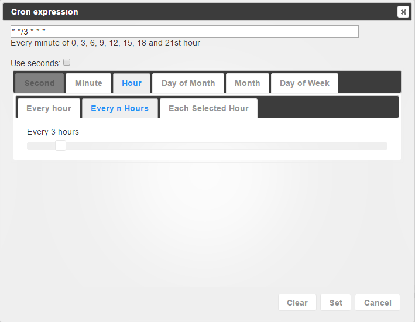

和

### 天文事件触发
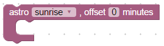

根据星象事件采取一些行动。可能发生的事件如下：

- 日出：日出（太阳的上边缘出现在地平线上）
- 日出结束：日出结束（太阳的下边缘触及地平线）
- goldenHourEnd：早晨黄金时段（柔和光线，最适合摄影的时段）结束
- 太阳正午：太阳正午（太阳位于最高点）
- 黄金时段：傍晚黄金时段开始
- 日落开始：日落开始（太阳的下边缘触及地平线）
日落：太阳落山，傍晚民用曙暮光开始。
- 黄昏：黄昏（傍晚航海曙暮光开始）
- nauticalDusk：航海黄昏（傍晚天文曙暮光开始）
- 夜晚：夜幕降临（足够黑暗，可以进行天文观测）
- nightEnd：夜晚结束（晨曦天文曙暮光开始）
- nauticalDawn：航海黎明（早晨航海曙光开始）
- 黎明：黎明（航海曙暮光结束，民用曙暮光开始）
- 最低点：最低点（夜晚最黑暗的时刻，太阳位于最低位置）

**注意：**要使用“astro”功能，必须在javascript适配器设置中定义“纬度”和“经度”。

此外，您还可以设置与天文事件的偏移量（以分钟为单位），例如，在事件发生前 1 小时触发事件：

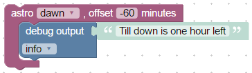

如您所见，偏移量也可以为负值，以指定占星事件发生之前的时间。

和

### 命名日程
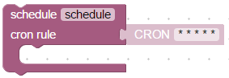

此块与 [日程](#schedule) 相同，但允许通过字符串设置 CRON 规则，并允许停止调度。

您可以指定此计划块的唯一名称，然后稍后使用 [清晰的日程安排](#clear-schedule) 将其清除。

以下是一个可配置闹钟的示例：

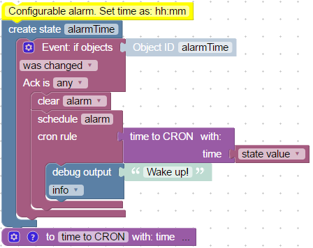

```xml 
<xml xmlns="http://www.w3.org/1999/xhtml">
  <block type="comment" id="QWp.l96v1;-4{x)j5K5y" x="38" y="13">
    <field name="COMMENT">Configurable alarm. Set time as: hh:mm</field>
    <next>
      <block type="create" id="5*XX`C;PgnU(q#Nk~D,o">
        <field name="NAME">alarmTime</field>
        <statement name="STATEMENT">
          <block type="on_ext" id="ot:9oFMh.(c)sxkufTxA">
            <mutation items="1"></mutation>
            <field name="CONDITION">ne</field>
            <field name="ACK_CONDITION"></field>
            <value name="OID0">
              <shadow type="field_oid" id="qV#=^mz,%qxL#}VsA)3C">
                <field name="oid">javascript.0.alarmTime</field>
              </shadow>
            </value>
            <statement name="STATEMENT">
              <block type="schedule_clear" id="ukGIQYyTpip_9!1H_xnN">
                <field name="NAME">alarm</field>
                <next>
                  <block type="schedule_create" id=")^!A|k+`1=[pFp(S-*sw">
                    <field name="NAME">alarm</field>
                    <value name="SCHEDULE">
                      <shadow type="field_cron" id="uSka7fK[T7j0m_4!4+fO">
                        <field name="CRON">* * * * *</field>
                      </shadow>
                      <block type="procedures_callcustomreturn" id=")E!Ljg1z9iQ3)Nb#CX~n">
                        <mutation name="time to CRON">
                          <arg name="time"></arg>
                        </mutation>
                        <value name="ARG0">
                          <block type="on_source" id="qs+k30Lnd1V(BSNs{}P!">
                            <field name="ATTR">state.val</field>
                          </block>
                        </value>
                      </block>
                    </value>
                    <statement name="STATEMENT">
                      <block type="debug" id="7arB5vcx^ci2Un#}TLKh">
                        <field name="Severity">log</field>
                        <value name="TEXT">
                          <shadow type="text" id="N;`AY!p#T_do@vP_OQr9">
                            <field name="TEXT">Wake up!</field>
                          </shadow>
                        </value>
                      </block>
                    </statement>
                  </block>
                </next>
              </block>
            </statement>
          </block>
        </statement>
      </block>
    </next>
  </block>
  <block type="procedures_defcustomreturn" id="_*_L4XpCr!7eLsYWS(R(" x="38" y="337">
    <mutation statements="false">
      <arg name="time"></arg>
    </mutation>
    <field name="NAME">time to CRON</field>
    <field name="SCRIPT">dmFyIHBhcnRzID0gdGltZS5zcGxpdCgnOicpOwovLyBpZiBpdCBpcyBDUk9OCmlmIChwYXJ0cy5sZW5ndGggPT09IDEpIHJldHVybiB0aW1lOwpyZXR1cm4gcGFydHNbMV0gKyAnICcgKyBwYXJ0c1swXSArICcgKiAqIConOw==</field>
    <comment pinned="false" h="80" w="160">Describe this function...</comment>
  </block>
</xml>
```

和

### 清晰的日程安排


使用此功能块可以清除已命名的计划任务。如果您在未清除之前再次定义已命名的计划任务，则之前的计划任务仍将保持活动状态。

参见 [命名日程](#named-schedule) 中的示例

和

### CRON 对话框


从对话框创建 CRON 规则。此块可以与 [命名日程](#named-schedule) 连接。

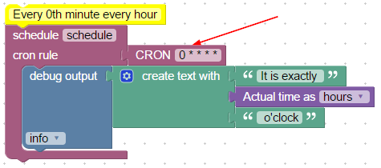

```xml 
<xml xmlns="http://www.w3.org/1999/xhtml">
  <block type="comment" id="]aB;GhQJvYrr~:H4Ft9l" x="63" y="38">
    <field name="COMMENT">Every 0th minute every hour</field>
    <next>
      <block type="schedule_create" id="?}upFtiA@CE_Gd)SmDo|">
        <field name="NAME">schedule</field>
        <value name="SCHEDULE">
          <shadow type="field_cron" id="1Ag|noK^~u]GFEW/(lb)">
            <field name="CRON">* * * * *</field>
          </shadow>
          <block type="field_cron" id="phjg#B~@BJTO9i[HmZ4O">
            <field name="CRON">0 * * * *</field>
          </block>
        </value>
        <statement name="STATEMENT">
          <block type="debug" id="Lv[a}BtvBDO-2Lt,s+z4">
            <field name="Severity">log</field>
            <value name="TEXT">
              <shadow type="text" id="evxnn0R1(AC^Y_U`oT_a">
                <field name="TEXT">It is exactly</field>
              </shadow>
              <block type="text_join" id="6!2uB_db8.g}63I{^e}#">
                <mutation items="3"></mutation>
                <value name="ADD0">
                  <block type="text" id="HH((bCdxr?A5)8Svuo6(">
                    <field name="TEXT">It is exactly </field>
                  </block>
                </value>
                <value name="ADD1">
                  <block type="time_get" id="7{BBfF0jmKD[qX,y6voK">
                    <mutation format="false" language="false"></mutation>
                    <field name="OPTION">h</field>
                  </block>
                </value>
                <value name="ADD2">
                  <block type="text" id="edML0zJ2V9kN}5/DLdS5">
                    <field name="TEXT"> o'clock</field>
                  </block>
                </value>
              </block>
            </value>
          </block>
        </statement>
      </block>
    </next>
  </block>
</xml>
```

和

### CRON 规则
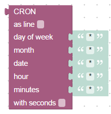

合并来自不同部分的 CRON 规则。

您可以将规则显示为块或线条：


通过添加参数“with seconds”，您也可以为 CRON 规则指定秒数。

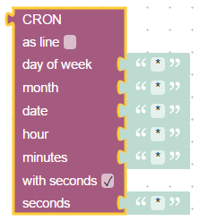

可以使用此块（如[仅限使用 [命名计划](#cron-dialog))](#named-schedule)块）。

### 文件更新触发
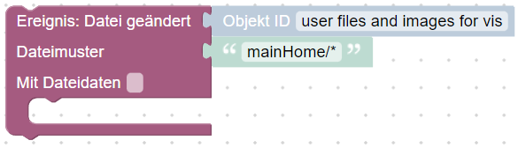

您可以订阅文件更新并执行某些操作。例如，此处会在每次项目更新时打印 `vis` 文件的内容：

```
<xml xmlns="https://developers.google.com/blockly/xml">
  <variables>
    <variable id="@-v}))=J7?dr9n$tR,=j">data</variable>
  </variables>
  <block type="onFile" id="4`C)*,R0DVN@nRaM@/[N" x="188" y="37">
    <field name="WITH_FILE">TRUE</field>
    <value name="OID">
      <shadow type="field_oid_meta" id="K^Qc~2T8{V+K017=]c^d">
        <field name="oid">vis.0</field>
      </shadow>
    </value>
    <value name="FILE">
      <shadow type="text" id="A7UXrl-.!o]Oi9g[eBxr">
        <field name="TEXT">main/*</field>
      </shadow>
    </value>
    <statement name="STATEMENT">
      <block type="debug" id="fl3BZ)}mE7qw[`W*ZUx}">
        <field name="Severity">log</field>
        <value name="TEXT">
          <shadow type="text" id="se+gg@!ryr*!AO~Bx3uX">
            <field name="TEXT">test</field>
          </shadow>
          <block type="variables_get" id="E{)LJvx~EH~shD%3!);w">
            <field name="VAR" id="@-v}))=J7?dr9n$tR,=j">data</field>
          </block>
        </value>
      </block>
    </statement>
  </block>
</xml>
```

**重要提示**：此功能仅适用于 js-controller@4.1.x 或更高版本。

### 文件更新时取消事件
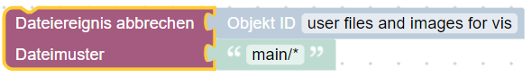 此模块允许您通过文件更新取消订阅事件。

**重要提示**：此功能仅适用于 js-controller@4.1.x 或更高版本。

### 脚本事件触发
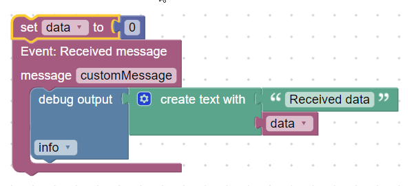

此模块允许您订阅跨脚本的事件，并在收到事件时执行操作。

## 暂停
### 等待/暂停
这个简单的代码块会暂停区块的执行。

注意：如果在区块链中使用 `pause`，则此脚本中所有后续区块的执行也会被延迟：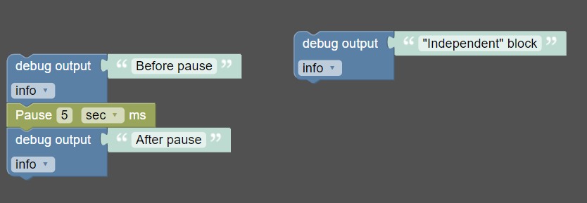 生成的代码：

```
console.log('"Independent" block'); // Wird nicht verzögert

console.log('Before pause');
await wait(5000);
console.log('After pause');
```

日志输出：

```
15:48:21.807	info	javascript.0 (7304) script.js.Skript_1: "Independent" block
15:48:21.807	info	javascript.0 (7304) script.js.Skript_1: Before pause
15:48:21.807	info	javascript.0 (7304) script.js.Skript_1: registered 0 subscriptions and 0 schedules
15:48:26.810	info	javascript.0 (7304) script.js.Skript_1: After pause
```

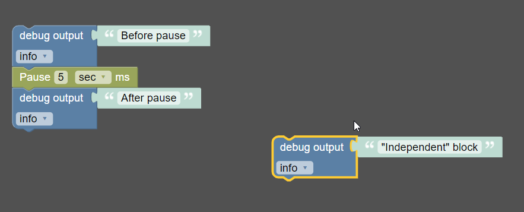

生成的代码：

```
console.log('Before pause');
await wait(5000);
console.log('After pause');

console.log('"Independent" block'); // Wird um 5 Sekunden verzögert
```

输出：

```
15:52:03.289	info	javascript.0 (7304) script.js.Skript_1: Before pause
15:52:03.290	info	javascript.0 (7304) script.js.Skript_1: registered 0 subscriptions and 0 schedules
15:52:08.296	info	javascript.0 (7304) script.js.Skript_1: After pause
15:52:08.297	info	javascript.0 (7304) script.js.Skript_1: "Independent" block
```

### 延迟执行
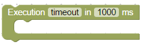

通过此代码块，您可以让其他代码块延迟执行指定的毫秒数。

如果您了解 JavaScript，它与 `setTimeout` 函数的功能相同。

Blockly 中没有“暂停”功能，但你可以使用此代码块来模拟暂停。如果你将所有必须在暂停之后执行的代码块都放在此代码块中，就能达到与使用暂停相同的效果。

另一个功能是可以使用变量设置间隔，只需将“ms”替换为预定义的变量：

每个延迟执行都可以有一个唯一的名称。它可以被其他代码块取消。[执行延迟明显](#clear-delayed-execution)

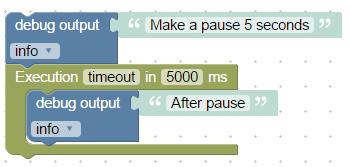

```xml 
<xml xmlns="http://www.w3.org/1999/xhtml">
  <block type="debug" id=":6GZ!E*FHy@vPKKl{`hV" x="487" y="163">
    <field name="Severity">log</field>
    <value name="TEXT">
      <shadow type="text" id="LV!-dx[I(8bAu(_kcG.U">
        <field name="TEXT">Make a pause 5 seconds</field>
      </shadow>
    </value>
    <next>
      <block type="timeouts_settimeout" id="~?BW3eBK_t:TzNk}x9l3">
        <field name="NAME">timeout</field>
        <field name="DELAY">5000</field>
        <statement name="STATEMENT">
          <block type="debug" id="glbs:mQxsDfEieLaru!0">
            <field name="Severity">log</field>
            <value name="TEXT">
              <shadow type="text" id="_7T9e{FEJTWcpLl*BltU">
                <field name="TEXT">After pause</field>
              </shadow>
            </value>
          </block>
        </statement>
      </block>
    </next>
  </block>
</xml>
```

和

### 明确延迟执行


此模块用于按名称取消运行延迟。典型用途是模拟运动检测场景。

首次检测到运动时，灯应亮起；最后一次检测到运动（30 秒后）后，灯应熄灭。

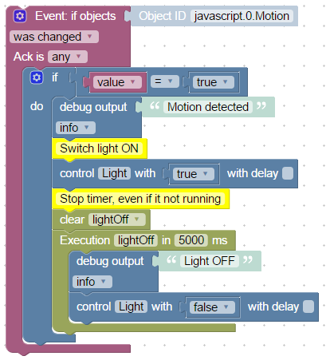

```xml 
<xml xmlns="http://www.w3.org/1999/xhtml">
  <block type="on_ext" id="+nZ`H6mh/;g(e3u,t;wJ" x="163" y="12">
    <mutation items="1"></mutation>
    <field name="CONDITION">ne</field>
    <field name="ACK_CONDITION"></field>
    <value name="OID0">
      <shadow type="field_oid" id="{mRcPH:!k^_5q-hwg1q%">
        <field name="oid">node-red.0.javascript.0.Motion</field>
      </shadow>
    </value>
    <statement name="STATEMENT">
      <block type="controls_if" id="]lX4.m?HnwXigM.6wY/D">
        <value name="IF0">
          <block type="logic_compare" id="s0DHFun9e*,c3AawmP_~">
            <field name="OP">EQ</field>
            <value name="A">
              <block type="variables_get" id="g}IH`Bx0T(mkht8~{Ul0">
                <field name="VAR">value</field>
              </block>
            </value>
            <value name="B">
              <block type="logic_boolean" id="Meek9{gS-NOR?|(fgbVg">
                <field name="BOOL">TRUE</field>
              </block>
            </value>
          </block>
        </value>
        <statement name="DO0">
          <block type="debug" id=":6GZ!E*FHy@vPKKl{`hV">
            <field name="Severity">log</field>
            <value name="TEXT">
              <shadow type="text" id="LV!-dx[I(8bAu(_kcG.U">
                <field name="TEXT">Motion detected</field>
              </shadow>
            </value>
            <next>
              <block type="comment" id="6_T-s#wApgZhu0+4uEk}">
                <field name="COMMENT">Switch light ON</field>
                <next>
                  <block type="control" id="fxgT@s0r?[`LJIsqR~M_">
                    <mutation delay_input="false"></mutation>
                    <field name="OID">javascript.0.Light</field>
                    <field name="WITH_DELAY">FALSE</field>
                    <value name="VALUE">
                      <block type="logic_boolean" id="0mgo#`N%Zm{MTELxw%~0">
                        <field name="BOOL">TRUE</field>
                      </block>
                    </value>
                    <next>
                      <block type="comment" id="rZ^o06`}^uFftKj2oYvE">
                        <field name="COMMENT">Stop timer, even if it not running</field>
                        <next>
                          <block type="timeouts_cleartimeout" id="#H#~HxipC8_-/{%,2R1P">
                            <field name="NAME">lightOff</field>
                            <next>
                              <block type="timeouts_settimeout" id="~?BW3eBK_t:TzNk}x9l3">
                                <field name="NAME">lightOff</field>
                                <field name="DELAY">5000</field>
                                <statement name="STATEMENT">
                                  <block type="debug" id="glbs:mQxsDfEieLaru!0">
                                    <field name="Severity">log</field>
                                    <value name="TEXT">
                                      <shadow type="text" id="_7T9e{FEJTWcpLl*BltU">
                                        <field name="TEXT">Light OFF</field>
                                      </shadow>
                                    </value>
                                    <next>
                                      <block type="control" id="McdOD=k4)MlO42RVgB~r">
                                        <mutation delay_input="false"></mutation>
                                        <field name="OID">javascript.0.Light</field>
                                        <field name="WITH_DELAY">FALSE</field>
                                        <value name="VALUE">
                                          <block type="logic_boolean" id="XLHrXB)/|dqGlh,nXl^[">
                                            <field name="BOOL">FALSE</field>
                                          </block>
                                        </value>
                                      </block>
                                    </next>
                                  </block>
                                </statement>
                              </block>
                            </next>
                          </block>
                        </next>
                      </block>
                    </next>
                  </block>
                </next>
              </block>
            </next>
          </block>
        </statement>
      </block>
    </statement>
  </block>
</xml>
```

和

### 按间隔执行
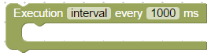

此模块允许您定期执行某些操作。当然，也有 CRON 模块，但 CRON 模块的最小间隔为一秒。

此模块可以以毫秒为单位执行操作。

如果将间隔设置得太小（小于 100 毫秒），则间隔可能会变大。

与超时块类似，您也可以设置唯一的间隔名称。

和

### 按时间间隔停止执行


借助此代码块，您可以按名称取消周期性执行的间隔代码块。

和

和

## 逻辑
### 如果/否则块
### 比较块
### 逻辑与/或块
### 否定块
### 逻辑值 TRUE/FALSE
### 空块
### 测试块
和

和

## 循环
### 重复 N 次
### 重复
＃＃＃ 数数
### 对于每个
### 跳出循环
和

和

## 数学
### 数值
### 算术运算 +-*/^
### 平方根、绝对值、负数、对数、log10、e^、10^
### Sin、cos、tan、asin、acos、atan
### 数学常数：π、e、φ、√2、√1/2、无穷大
### 是偶数、奇数、质数、整数、正数、负数，还是能被……整除
### 按值（加或减）修改变量
### 取整、向下取整、向上取整值
### 对值列表进行的操作：求和、最小值、最大值、平均值、中位数、众数、偏差、随机项
### 模量
### 通过最小值和最大值限制某些值
### 0 到 1 之间的随机值
### 介于最小值和最大值之间的随机值
和

和

＃＃ 文本
### 字符串值
### 连接字符串
### 将字符串追加到变量
### 字符串长度
### 字符串是否为空
### 查找字符串中的位置
### 获取字符串中指定位置的符号
### 获取子字符串
### 转换为大写或小写
### 修剪字符串
和

和

## 列表
### 创建空列表
### 创建包含值的列表
### 创建 N 个具有相同值的列表
### 获取列表长度
### 列表是否为空
### 查找列表中项目的位置
### 获取列表中的项目
### 在列表中设置项目
### 获取列表的子列表
### 将文本转换为列表，反之亦然
和

和

＃＃ 颜色
### 颜色值
### 随机颜色
### RGB颜色
### 混合颜色
和

和

## 变量
### 设置变量值


要使用此模块，您应该了解基本的编程规则：如何使用变量。

通过此代码块，您可以向全局变量（在此脚本中任何位置都可见）写入数据，并使用它来存储一些值。如果变量不存在，它将自动声明。

此代码块可以创建新变量或使用现有变量。

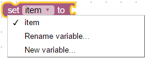

这段代码：

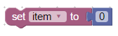

```xml 
<block xmlns="http://www.w3.org/1999/xhtml" type="variables_set" id="ch{H@omhfzI(QA{syxAG" x="212.99999999999977" y="37.99999999999994">
  <field name="VAR">item</field>
  <value name="VALUE">
    <block type="math_number" id="SbmD7,uR:hMW!(P%IZRc">
      <field name="NUM">0</field>
    </block>
  </value>
</block>
```

仅此而已：

```javascript
var item;
item = 0;
```

和

### 获取变量的值
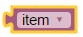

此代码块获取变量的值。您可以创建一个新变量，也可以使用现有变量。

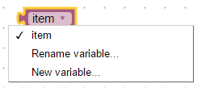

触发块 [状态改变时触发](#trigger-on-states-change) 和 [状态改变时触发]](#trigger-on-state-change) 有一个例外。

在这些块中，变量“value”仍然存在，但无论如何，要读取它们的值，您必须将变量重命名为 value，然后再使用它。

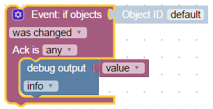

和

和

## 函数
### 使用代码块创建函数（不带返回值）


此模块允许您将重复的模块序列组合成一个函数，然后在当前 Blockly 脚本中的任何位置使用该函数。

以下是一个仅将当前时间写入日志的函数示例：

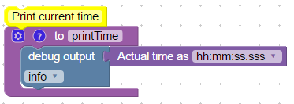

```xml
<xml xmlns="http://www.w3.org/1999/xhtml">
  <block type="comment" id=";LE@QUg[hpGG!Ed6(?Hf" x="463" y="88">
    <field name="COMMENT">Print current time</field>
  </block>
  <block type="procedures_defnoreturn" id="zz#oL]VPR)s}NMK9htHa" x="463" y="113">
    <field name="NAME">printTime</field>
    <comment pinned="false" h="80" w="160">Describe this function...</comment>
    <statement name="STACK">
      <block type="debug" id="ak(`[aJB-AH@Hvc;B,[D">
        <field name="Severity">log</field>
        <value name="TEXT">
          <shadow type="text" id="aGuA=^(ge/)=lXes9f]?">
            <field name="TEXT">test</field>
          </shadow>
          <block type="time_get" id="M}z9(p(melE7BbTGqczO">
            <mutation format="false" language="false"></mutation>
            <field name="OPTION">hh:mm:ss.sss</field>
          </block>
        </value>
      </block>
    </statement>
  </block>
</xml>
```

函数创建完成后，可以按如下方式使用：

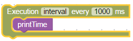

```xml
<block xmlns="http://www.w3.org/1999/xhtml" type="timeouts_setinterval" id="hp;?}l3uStXhm+a2s!9t" x="62.99999999999943" y="112.99999999999994">
  <field name="NAME">interval</field>
  <field name="INTERVAL">1000</field>
  <statement name="STATEMENT">
    <block type="procedures_callnoreturn" id="(/)MPv+z_|516CuG%[XD">
      <mutation name="printTime"></mutation>
    </block>
  </statement>
</block>
```

新创建的功能会出现在模块菜单中：

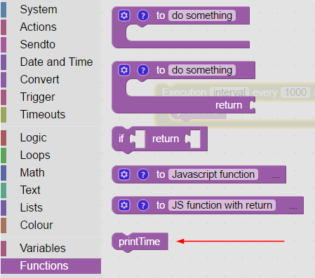

此外，还可以通过配置对话框定义函数的参数。参数名称也可以在同一个对话框中编辑。

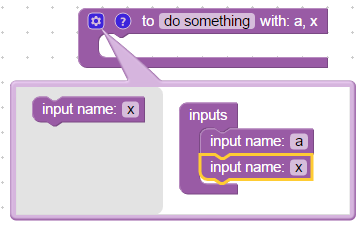

以下是一个输出第一个参数和第二个参数之和的函数示例：

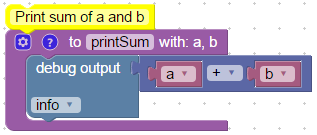

```xml
<xml xmlns="http://www.w3.org/1999/xhtml">
  <block type="comment" id=";LE@QUg[hpGG!Ed6(?Hf" x="463" y="88">
    <field name="COMMENT">Print sum of a and b</field>
  </block>
  <block type="procedures_defnoreturn" id="zz#oL]VPR)s}NMK9htHa" x="463" y="113">
    <mutation>
      <arg name="a"></arg>
      <arg name="b"></arg>
    </mutation>
    <field name="NAME">printSum</field>
    <comment pinned="false" h="80" w="160">Describe this function...</comment>
    <statement name="STACK">
      <block type="debug" id="ak(`[aJB-AH@Hvc;B,[D">
        <field name="Severity">log</field>
        <value name="TEXT">
          <shadow type="text" id="aGuA=^(ge/)=lXes9f]?">
            <field name="TEXT">test</field>
          </shadow>
          <block type="math_arithmetic" id="qUGc!b+U]:yE!I+3I+Lp">
            <field name="OP">ADD</field>
            <value name="A">
              <shadow type="math_number" id="OqjQ{@*pgO,~Xd(ef)9~">
                <field name="NUM">1</field>
              </shadow>
              <block type="variables_get" id="]dC)!=A3{(5?9hJ:1gET">
                <field name="VAR">a</field>
              </block>
            </value>
            <value name="B">
              <shadow type="math_number" id="aDp|:rn#.wve0]WKi(D[">
                <field name="NUM">1</field>
              </shadow>
              <block type="variables_get" id="5];ao,?ce{;GJ;OOW~S4">
                <field name="VAR">b</field>
              </block>
            </value>
          </block>
        </value>
      </block>
    </statement>
  </block>
</xml>
```

参数显示在变量菜单中：

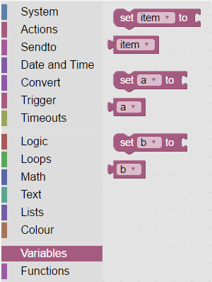

然后可以按如下方式使用该函数：

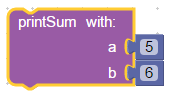

```xml
<block xmlns="http://www.w3.org/1999/xhtml" type="procedures_callnoreturn" id="(-G|y+Y7AC]w2CTQGjYC" x="138" y="188">
  <mutation name="printSum">
    <arg name="a"></arg>
    <arg name="b"></arg>
  </mutation>
  <value name="ARG0">
    <block type="math_number" id="!.UT=[{Xkz-*wlPh)sYn">
      <field name="NUM">5</field>
    </block>
  </value>
  <value name="ARG1">
    <block type="math_number" id="EMhKM9Cn#;DjMZ#Ko%EN">
      <field name="NUM">6</field>
    </block>
  </value>
</block>
```

### 用代码块创建函数（带返回值）
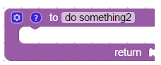

这个代码块的工作方式与前一个代码块类似，但它还可以返回一个结果，该结果随后可以在其他代码块中使用。

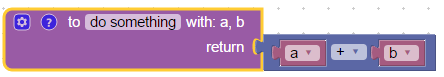

```xml
<block xmlns="http://www.w3.org/1999/xhtml" type="procedures_defreturn" id="4)|}1YzV}e6YUvVV^sY{" x="413" y="138">
  <mutation statements="false">
    <arg name="a"></arg>
    <arg name="b"></arg>
  </mutation>
  <field name="NAME">do something</field>
  <comment pinned="false" h="80" w="160">Return sum of a and b</comment>
  <value name="RETURN">
    <block type="math_arithmetic" id="qUGc!b+U]:yE!I+3I+Lp">
      <field name="OP">ADD</field>
      <value name="A">
        <shadow type="math_number" id="OqjQ{@*pgO,~Xd(ef)9~">
          <field name="NUM">1</field>
        </shadow>
        <block type="variables_get" id="]dC)!=A3{(5?9hJ:1gET">
          <field name="VAR">a</field>
        </block>
      </value>
      <value name="B">
        <shadow type="math_number" id="aDp|:rn#.wve0]WKi(D[">
          <field name="NUM">1</field>
        </shadow>
        <block type="variables_get" id="5];ao,?ce{;GJ;OOW~S4">
          <field name="VAR">b</field>
        </block>
      </value>
    </block>
  </value>
</block>
```

其用法与其他功能块类似：

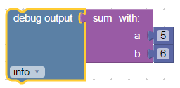

```xml
<xml xmlns="http://www.w3.org/1999/xhtml">
  <block type="debug" id="zgr7b0g)}uMe1ySGYL7X" x="163" y="137">
    <field name="Severity">log</field>
    <value name="TEXT">
      <shadow type="text" id="q-]m1ptAzK4Rq20wWRBq">
        <field name="TEXT">test</field>
      </shadow>
      <block type="procedures_callreturn" id="0RX?V1j|FZHK@*Lw3W-g">
        <mutation name="sum">
          <arg name="a"></arg>
          <arg name="b"></arg>
        </mutation>
        <value name="ARG0">
          <block type="math_number" id="Xd52^_Qp83=ah2RTWzSU">
            <field name="NUM">5</field>
          </block>
        </value>
        <value name="ARG1">
          <block type="math_number" id="-M9A9EhrgJSRc*4(X^[;">
            <field name="NUM">6</field>
          </block>
        </value>
      </block>
    </value>
  </block>
  <block type="procedures_defreturn" id="4)|}1YzV}e6YUvVV^sY{" x="413" y="138">
    <mutation statements="false">
      <arg name="a"></arg>
      <arg name="b"></arg>
    </mutation>
    <field name="NAME">sum</field>
    <comment pinned="false" h="80" w="160">Return sum of a and b</comment>
    <value name="RETURN">
      <block type="math_arithmetic" id="qUGc!b+U]:yE!I+3I+Lp">
        <field name="OP">ADD</field>
        <value name="A">
          <shadow type="math_number" id="OqjQ{@*pgO,~Xd(ef)9~">
            <field name="NUM">1</field>
          </shadow>
          <block type="variables_get" id="]dC)!=A3{(5?9hJ:1gET">
            <field name="VAR">a</field>
          </block>
        </value>
        <value name="B">
          <shadow type="math_number" id="aDp|:rn#.wve0]WKi(D[">
            <field name="NUM">1</field>
          </shadow>
          <block type="variables_get" id="5];ao,?ce{;GJ;OOW~S4">
            <field name="VAR">b</field>
          </block>
        </value>
      </block>
    </value>
  </block>
</xml>
```

每个功能都可以添加注释或描述。

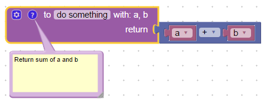

函数块中也可以使用特殊的返回元素：

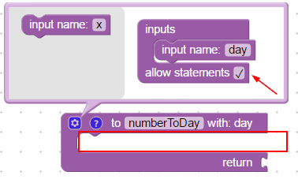

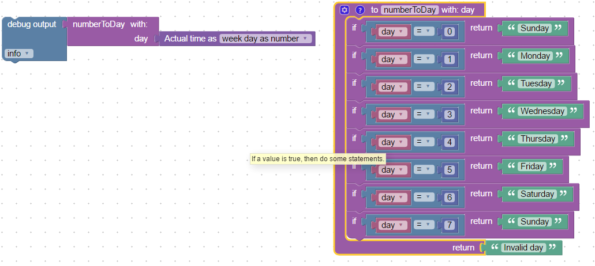

```xml
<xml xmlns="http://www.w3.org/1999/xhtml">
  <block type="debug" id="zgr7b0g)}uMe1ySGYL7X" x="63" y="12">
    <field name="Severity">log</field>
    <value name="TEXT">
      <shadow type="text" id="q-]m1ptAzK4Rq20wWRBq">
        <field name="TEXT">test</field>
      </shadow>
      <block type="procedures_callreturn" id="0RX?V1j|FZHK@*Lw3W-g">
        <mutation name="numberToDay">
          <arg name="day"></arg>
        </mutation>
        <value name="ARG0">
          <block type="math_number" id="Xd52^_Qp83=ah2RTWzSU">
            <field name="NUM">5</field>
          </block>
        </value>
      </block>
    </value>
  </block>
  <block type="debug" id="@i@bdG^90dp,cJ#W*[nB" x="12" y="188">
    <field name="Severity">log</field>
    <value name="TEXT">
      <shadow type="text" id="8:/`}T!:6Wz.d/;)jpHl">
        <field name="TEXT">test</field>
      </shadow>
      <block type="procedures_callreturn" id="hvzS!O_Q=FlccQR@*%tk">
        <mutation name="numberToDay">
          <arg name="day"></arg>
        </mutation>
        <value name="ARG0">
          <block type="time_get" id=":A,Ba,yrW_QgiX*cs9zh">
            <mutation format="false" language="false"></mutation>
            <field name="OPTION">wd</field>
          </block>
        </value>
      </block>
    </value>
  </block>
  <block type="procedures_defreturn" id="4)|}1YzV}e6YUvVV^sY{" x="588" y="163">
    <mutation>
      <arg name="day"></arg>
    </mutation>
    <field name="NAME">numberToDay</field>
    <comment pinned="false" h="80" w="160">Return sum of a and b</comment>
    <statement name="STACK">
      <block type="procedures_ifreturn" id="/qJjm#cr-naS}joAL0eT">
        <mutation value="1"></mutation>
        <value name="CONDITION">
          <block type="logic_compare" id="cbxuAYxF,ptMi.`E/nB.">
            <field name="OP">EQ</field>
            <value name="A">
              <block type="variables_get" id="`mWQWp).?qDuD=)NX2dA">
                <field name="VAR">day</field>
              </block>
            </value>
            <value name="B">
              <block type="math_number" id="s,20+9X6bB/2nL{v?g:/">
                <field name="NUM">0</field>
              </block>
            </value>
          </block>
        </value>
        <value name="VALUE">
          <block type="text" id="iI)V7P`3YP]{-S-7HcO1">
            <field name="TEXT">Sunday</field>
          </block>
        </value>
        <next>
          <block type="procedures_ifreturn" id="3=FBSCS{jzu[}2L5Spi[">
            <mutation value="1"></mutation>
            <value name="CONDITION">
              <block type="logic_compare" id="V[;S84AH5cf93^5/[AN^">
                <field name="OP">EQ</field>
                <value name="A">
                  <block type="variables_get" id=";ShgVu*+:nn9WSzbm[fA">
                    <field name="VAR">day</field>
                  </block>
                </value>
                <value name="B">
                  <block type="math_number" id="jY?Wj8lC1-~SiIHa*I)0">
                    <field name="NUM">1</field>
                  </block>
                </value>
              </block>
            </value>
            <value name="VALUE">
              <block type="text" id="=aVg_FatldZUUsS(8G`;">
                <field name="TEXT">Monday</field>
              </block>
            </value>
            <next>
              <block type="procedures_ifreturn" id="(g_VE2e?U^J-nhk,bP|0">
                <mutation value="1"></mutation>
                <value name="CONDITION">
                  <block type="logic_compare" id="M;B+SSw[Mc.iu;fUjvcV">
                    <field name="OP">EQ</field>
                    <value name="A">
                      <block type="variables_get" id="yT{.UQ)qXY8-@2XzpxQo">
                        <field name="VAR">day</field>
                      </block>
                    </value>
                    <value name="B">
                      <block type="math_number" id="Q-JC5_JZ=i{[+~:^|BpU">
                        <field name="NUM">2</field>
                      </block>
                    </value>
                  </block>
                </value>
                <value name="VALUE">
                  <block type="text" id="9`665+j*i_?3BCZWODGt">
                    <field name="TEXT">Tuesday</field>
                  </block>
                </value>
                <next>
                  <block type="procedures_ifreturn" id="{+9IT6E:N-a+Y.cFNMsw">
                    <mutation value="1"></mutation>
                    <value name="CONDITION">
                      <block type="logic_compare" id="B}D{JSK|}=bk|-|D#/_h">
                        <field name="OP">EQ</field>
                        <value name="A">
                          <block type="variables_get" id="s{Zxm|sBbEGA1#~Tv3EE">
                            <field name="VAR">day</field>
                          </block>
                        </value>
                        <value name="B">
                          <block type="math_number" id="f!3KoyGu4bWpxdaJY`JI">
                            <field name="NUM">3</field>
                          </block>
                        </value>
                      </block>
                    </value>
                    <value name="VALUE">
                      <block type="text" id="yS4pn;Fdg9JT[MjvPu,4">
                        <field name="TEXT">Wednesday</field>
                      </block>
                    </value>
                    <next>
                      <block type="procedures_ifreturn" id="g*VMz;jyw4,@;Qb*/8TN">
                        <mutation value="1"></mutation>
                        <value name="CONDITION">
                          <block type="logic_compare" id="(^azMqi{:`?S.tJ@y7-m">
                            <field name="OP">EQ</field>
                            <value name="A">
                              <block type="variables_get" id="P*CAI!ug.Xl*BM2v/kpb">
                                <field name="VAR">day</field>
                              </block>
                            </value>
                            <value name="B">
                              <block type="math_number" id="YN@VzF~X=BOcWm+P]c3i">
                                <field name="NUM">4</field>
                              </block>
                            </value>
                          </block>
                        </value>
                        <value name="VALUE">
                          <block type="text" id="H`yzv!j_GjSw|@f7Gap8">
                            <field name="TEXT">Thursday</field>
                          </block>
                        </value>
                        <next>
                          <block type="procedures_ifreturn" id=")htNPjBWw1J/gp-Y5#Kg">
                            <mutation value="1"></mutation>
                            <value name="CONDITION">
                              <block type="logic_compare" id="nFZ;s`3ij0v|.wQqw`AB">
                                <field name="OP">EQ</field>
                                <value name="A">
                                  <block type="variables_get" id="Q^3OKKD]aGa0/qxWf%*g">
                                    <field name="VAR">day</field>
                                  </block>
                                </value>
                                <value name="B">
                                  <block type="math_number" id="#brnWNXj0_dx[JwHjgh0">
                                    <field name="NUM">5</field>
                                  </block>
                                </value>
                              </block>
                            </value>
                            <value name="VALUE">
                              <block type="text" id="Y1-{3UJxFrpq{uJp6DkB">
                                <field name="TEXT">Friday</field>
                              </block>
                            </value>
                            <next>
                              <block type="procedures_ifreturn" id="K2~CLXTJ5b=T+=/6%m=~">
                                <mutation value="1"></mutation>
                                <value name="CONDITION">
                                  <block type="logic_compare" id="Cjh^D.y[m3YQn},sC1(0">
                                    <field name="OP">EQ</field>
                                    <value name="A">
                                      <block type="variables_get" id="|uXT]6-.XcdAG-6HtffC">
                                        <field name="VAR">day</field>
                                      </block>
                                    </value>
                                    <value name="B">
                                      <block type="math_number" id="N@!AqGy7OCz9:zhv@f?K">
                                        <field name="NUM">6</field>
                                      </block>
                                    </value>
                                  </block>
                                </value>
                                <value name="VALUE">
                                  <block type="text" id="omKlSmgS{[5T:v{9(j}?">
                                    <field name="TEXT">Saturday</field>
                                  </block>
                                </value>
                                <next>
                                  <block type="procedures_ifreturn" id=".XFx#9RZIGl!joSiMNyq">
                                    <mutation value="1"></mutation>
                                    <value name="CONDITION">
                                      <block type="logic_compare" id="aqkbbBOzUTv/%JlX)V}S">
                                        <field name="OP">EQ</field>
                                        <value name="A">
                                          <block type="variables_get" id="qrl+C-GvBF7QzLz8?@:u">
                                            <field name="VAR">day</field>
                                          </block>
                                        </value>
                                        <value name="B">
                                          <block type="math_number" id="_[;I?)){=vm_jnSYHumL">
                                            <field name="NUM">7</field>
                                          </block>
                                        </value>
                                      </block>
                                    </value>
                                    <value name="VALUE">
                                      <block type="text" id="MCTQyN!}ig#3~)B[r#q[">
                                        <field name="TEXT">Sunday</field>
                                      </block>
                                    </value>
                                  </block>
                                </next>
                              </block>
                            </next>
                          </block>
                        </next>
                      </block>
                    </next>
                  </block>
                </next>
              </block>
            </next>
          </block>
        </next>
      </block>
    </statement>
    <value name="RETURN">
      <block type="text" id="revjgT`{%j^1mn*-SJ1a">
        <field name="TEXT">Invalid day</field>
      </block>
    </value>
  </block>
</xml>
```

### 函数返回值


请参阅 [使用代码块创建函数（带返回值）](#funktion-aus-blöcken-erstellen-mit-rückgabewert) 下的此块的使用方法。

该代码块只能在此处使用，用于在函数中间返回一个值。

### 创建你自己的函数（不带返回值）


有时，现有的代码块不足以完成特定任务。有了这个代码块，您可以将自己的代码块定义为一个函数，该函数接受参数并执行任何所需的操作。

编写这样的函数需要一定的 JavaScript 知识。在该函数内部，您还可以访问标准 JavaScript 脚本中所有可用的函数。

要编写代码，请点击代码块末尾的 `...`，这将打开编辑器对话框。

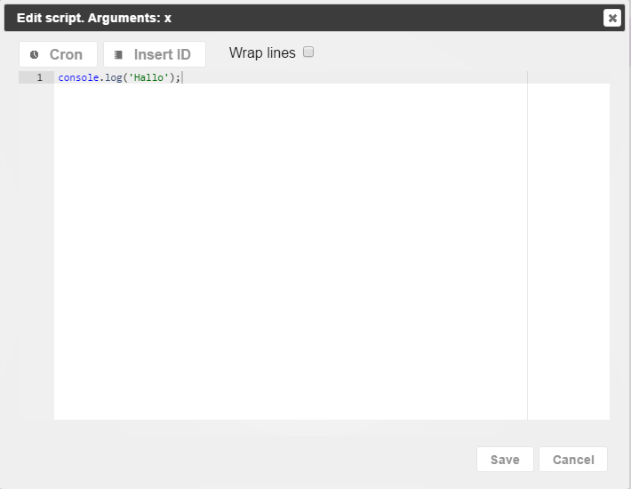

否则，此块的使用与标准功能块（例如 [使用代码块创建函数（带返回值）或使用代码块创建函数（不带返回值）](#funktion-aus-blöcken-erstellen-ohne-rückgabewert)）类似。

### 创建您自己的函数（带返回值）


这个自定义函数块可以返回值。要让函数返回结果，你可以这样写：

```
return 'dein Ergebnis';
```

例如这里：

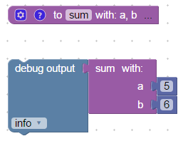

```xml
<xml xmlns="http://www.w3.org/1999/xhtml">
  <block type="procedures_defcustomreturn" id="mG^pXm=MO7vPl!c^/.Px" x="163" y="63">
    <mutation statements="false">
      <arg name="a"></arg>
      <arg name="b"></arg>
    </mutation>
    <field name="NAME">sum</field>
    <field name="SCRIPT">cmV0dXJuIGEgKyBiOw==</field>
    <comment pinned="false" h="80" w="160">Summarise a and b</comment>
  </block>
  <block type="debug" id="U6pI-lE0VS#G):ELrQ(0" x="163" y="138">
    <field name="Severity">log</field>
    <value name="TEXT">
      <shadow type="text" id="PBg^5*vuC?Isr)]pqx/u">
        <field name="TEXT">test</field>
      </shadow>
      <block type="procedures_callcustomreturn" id="XuhUUF65jRZGB#YE(GTC">
        <mutation name="sum">
          <arg name="a"></arg>
          <arg name="b"></arg>
        </mutation>
        <value name="ARG0">
          <block type="math_number" id="h_[^zH{ILtnHrsxY0j~z">
            <field name="NUM">5</field>
          </block>
        </value>
        <value name="ARG1">
          <block type="math_number" id="iIoph|b.?suX;)R=d|),">
            <field name="NUM">6</field>
          </block>
        </value>
      </block>
    </value>
  </block>
</xml>
```

调用###函数


对于每个创建的功能，菜单中都会出现一个以该功能名称命名的附加块。

你可以像使用脚本中的其他代码块一样使用它。

## Blockly 的 AI 聊天
现在，Blockly脚本也支持AI聊天面板。点击工具栏中的AI按钮（魔棒图标），即可在Blockly编辑器旁边打开聊天面板。

### 功能范围
- **聊天模式**：提出关于您的 Blockly 脚本的问题。AI 会使用生成的 JavaScript 代码作为上下文。
- **代码模式**：描述一个自动化任务，AI 将分两步生成 Blockly XML 块（先计划，再生成块）。
- **视觉预览**：AI 生成的代码块会以 Blockly 图形预览的形式直接显示在聊天中，而不是以原始 XML 的形式显示。
- **插入模块**：点击“插入模块”将 AI 生成的模块插入到 Blockly 工作区中。
- **差异视图**：点击“显示为差异”，即可将您当前的模块与 AI 建议的模块并排比较，并带有接受/拒绝按钮。

### 支持的块类型
AI 可以生成以下 ioBroker Blockly 区块类型：

- **on_ext** – 触发器（响应状态变化）
- **schedule** – 基于 Cron 的计划任务
- **控制** – 设置状态（setState）
- **get_value** – 读取状态值 (getState)
- **调试** – 日志输出
- **sendto_custom** – 发送消息（例如，Telegram）
- **timeouts_settimeout** – 延迟操作
- **controls_if** – 如果/那么条件
- **logic_compare** – 比较（EQ、NEQ、LT、GT 等）
- **math_number**、**text**、**logic_boolean** – 值块

＃＃＃ 尖端
- 使用**代码模式**根据任务描述生成新的代码块。
- 对于现有区块的问题，请使用**聊天模式**（或代理模式）。
- 如果用简单的语言描述你的自动化操作，人工智能就能发挥最佳效果，例如“当运动传感器被触发时，打开客厅的灯”。
- 您可以使用 `@devices` 将您的智能家居设备包含在上下文中。