＃ 内容
- [描述](#description)
- [开始](#getting-started)
    - [示例 1](#example-1)
    - [示例 2](#example-2)
    - [示例 3](#example-3)
- [块]（#块）
    - [系统块]（#系统块）
        - [调试输出](#debug 输出)
        - [评论](#comment)
        - [控制状态](#control-state)
        - [更新状态](#update-state)
        - [绑定状态](#bind states)
        - [写入状态](#write-states)
        - [创建状态](#create-state)
        - [获取状态值](#get-value-of-state)
        - [获取对象 ID](#get-object-id)
    - [动作块]（#动作块）
        - [执行-命令](#exec---command)
        - [请求 URL](#request-url)
    - [SendTo 块]（#sendTo 块）
        - [发送到电报](#send-to-telegram)
        - [发送到 SayIt](#send-to-sayit)
        - [发送到 pushover](#send-to-pushover)
        - [发送电子邮件](#send-email)
        - [自定义发送到块]（#custom-sendto-block）
    - [日期和时间块](#date-and-time-blocks)
        - [时间比较](#time-comparison)
        - [实际时间比较](#actual-time-comparison)
        - [获取特定格式的实际时间](#get-actual-time-in-specific-format)
        - [获取今天的天文事件时间](#get-time-of-astro-events-for-today)
    - [转换块](#convert-blocks)
        - [转换为数字](#convert-to-number)
        - [转换为布尔值](#convert-to-boolean)
        - [获取变量类型](#get-type-of-variable)
        - [转换为日期/时间对象](#convert-to-datetime-object)
        - [将日期/时间对象转换为字符串](#convert-datetime-object-to-string)
        - [将 JSON 转换为对象](#convert-json-to-object)
        - [将对象转换为 JSON](#convert-object-to-json)
        - [通过 JSONata 表达式转换](#convert-by-jsonata-expression)
    - [触发器](#triggers)
        - [触发状态变化](#trigger-on-states-change)
        - [触发状态变化](#trigger-on-state-change)
        - [触发器信息]（#触发器信息）
        - [时间表](#schedule)
        - [触发天文事件](#trigger-on-astro-event)
        - [命名日程](#named-schedule)
        - [清除日程](#clear-schedule)
        - [CRON 对话框](#cron 对话框)
        - [CRON 规则](#cron-rule)
    - [超时](#timeouts)
        - [延迟执行](#delayed-execution)
        - [清除延迟执行](#clear-delayed-execution)
        - [按间隔执行](#execution-by-interval)
        - [按间隔停止执行](#stop-execution-by-interval)
    - [逻辑]（#逻辑）
        - [如果其他块]（#if-else-block）
        - [比较块](#comparison-block)
        - [逻辑与/或块](#logical-and-or-block)
        - [否定块](#negation-block)
        - [逻辑值 TRUE/FALSE](#logical-value-true-false)
        - [空块]（#空块）
        - [测试块](#test-block)
    - [循环]（#循环）
        - [重复 N 次](#repeat-n-times)
        - [重复时]（#repeat-while）
        - [计数](#count)
        - [对于每个](#for-each)
        - [跳出循环](#跳出循环)
    - [数学](#math)
        - [数值](#number-value)
        - [算术运算 +-\*/^](#arithmetical-operations--)
        - [平方根, Abs, -, ln, log10, e^, 10^](#square-root-abs---ln-log10-e-10)
        - [sin, cos, tan, asin, acos, atan](#sin-cos-tan-asin-acos-atan)
        - [数学常数：pi, e, phi, sqrt(2), sqrt(1/2), infinity](#math-constants-pi-e-phi-sqrt2-sqrt12-infinity)
        - [是偶数，奇数，素数，整数，正数，负数，除以]（#is-even-odd-prime-whole-positive-negative-divisibly-by）
        - [按值加减可变地修改](#modify-variably-by-value-plus-or-minus)
        - [圆形，地板，天花板值]（#round-floor-ceil-value）
        - [对值列表的操作：sum、min、max、average、median、modes、deviation、random item](#operations-on-the-list-of-values-sum-min-max-average-median-模式偏差随机项）
        - [模数]（#模数）
        - [按最小值和最大值限制某个值](#limit-some-value-by-min-and-max)
        - [从 0 到 1 的随机值](#random-value-from-0-to-1)
        - [最小值和最大值之间的随机值](#random-value-between-min-and-max)
    - [文本]（#文本）
        - [字符串值](#字符串值)
        - [连接字符串](#concatenate-strings)
        - [将字符串附加到变量](#append-string-to-variable)
        - [字符串长度](#length-of-string)
        - [字符串为空](#is-string-empty)
        - [在字符串中查找位置](#find-position-in-string)
        - [获取特定位置的字符串中的符号](#get-symbol-in-string-on-specific-position)
        - [获取子字符串](#get-substring)
        - [转换为大写或小写](#Convert-to-upper-case-or-to-lower-case)
        - [修剪字符串]（#修剪字符串）
    - [列表](#lists)
        - [创建空列表](#create-empty-list)
        - [使用值创建列表](#create-list-with-values)
        - [创建具有相同值 N 次的列表](#create-list-with-same-value-n-times)
        - [获取列表长度](#get-length-of-list)
        - [列表为空](#is-list-empty)
        - [在列表中查找项目的位置](#Find-position-of-item-in-list)
        - [获取列表中的项目](#get-item-in-list)
        - [在列表中设置项目](#set-item-in-list)
        - [获取列表的子列表](#get-sublist-of-list)
        - [将文本转换为列表，反之亦然](#convert-text-to-list-and-vice-versa)
    - [颜色](#color)
        - [颜色值]（#颜色值）
        - [随机颜色](#random-color)
        - [RGB 颜色](#rgb 颜色)
        - [混合颜色](#mix-colours)
    - [变量]（#变量）
        - [设置变量的值](#set-variables-value)
        - [获取变量的值](#get-variables-value)
    - [函数](#functions)
        - [从没有返回值的块创建函数](#create-function-from-blocks-with-no-return-value)
        - [从具有返回值的块创建函数](#create-function-from-blocks-with-return-value)
        - [函数中的返回值](#return-value-in-function)
        - [创建没有返回值的自定义函数](#create-custom-function-with-no-return-value)
        - [使用返回值创建自定义函数](#create-custom-function-with-return-value)
        - [调用函数](#call-function)

&nbsp;

# Description Blockly 是一个图形编辑器，允许用户通过组装块来创建脚本。
它是为没有任何计算机编程经验的用户设计的。
&nbsp;

＃ 入门
## 示例 1
**当另一个数据点改变时改变一个数据点的状态**

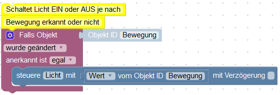

这是在数据点更改时切换其他内容的经典示例。

当检测到运动或未检测到运动时，此处的灯会打开或关闭。

首先插入块“Triggers=>If object”。选择对象 ID 以使用对象的状态作为此脚本的触发器。

添加另一个块 - “System=>Control”，然后在对话框中选择要由触发器更改的其他状态。

在该控制块中插入一个块“System=>Value of object ID”并在对话框中选择对象“Motion”以将其状态写入“Light”：。

**触发块中有一个特殊的变量“值”。这始终在此处定义，可用于各种目的。它包含触发对象的当前值，因此您可以通过使用“Variable=>Object ID”块并将其重命名为“Value”来创建更简单的脚本。**

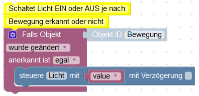

&nbsp;导入示例：

```xml 
<xml xmlns="http://www.w3.org/1999/xhtml">
  <block type="comment" id="s7s**k+Cc_KjDnJW`(h~" x="12" y="63">
    <field name="COMMENT">Switch light ON or OFF it motion detected or IDLE</field>
    <next>
      <block type="on_ext" id="#}:B(M-o5:/]k,_msr%y">
        <mutation items="1"></mutation>
        <field name="CONDITION">ne</field>
        <field name="ACK_CONDITION"></field>
        <value name="OID0">
          <shadow type="field_oid" id="o~6)!C0IVy{WD%Km(lkc">
            <field name="oid">javascript.0.Motion</field>
          </shadow>
        </value>
        <statement name="STATEMENT">
          <block type="control" id="(ZqzhS_7*jGpk;`zJAZg">
            <mutation delay_input="false"></mutation>
            <field name="OID">javascript.0.Light</field>
            <field name="WITH_DELAY">FALSE</field>
            <value name="VALUE">
              <block type="get_value" id="a-E@UcwER=knNljh@:M/">
                <field name="ATTR">val</field>
                <field name="OID">javascript.0.Motion</field>
              </block>
            </value>
          </block>
        </statement>
      </block>
    </next>
  </block>
</xml>
```

&nbsp;

## 示例2 **有动作亮灯，10分钟无动作灭灯。**


如果“运动”状态更新为“真”值，请执行以下操作：

- 打开灯”。
- 开始延迟 10 分钟以关闭“灯”并清除此数据点之前的所有延迟。

如您所见，“清除延迟”标志由最后一条命令清除。这将删除该数据点的所有计时器并启动一个新计时器

&nbsp;导入示例：

<!-- ```xml <xml xmlns="http://www.w3.org/1999/xhtml"> --> <block type="comment" id="s7s**k+Cc_KjDnJW`(h ~" x="112" y="63"> <field name="COMMENT">在 IDLE 的 10 分钟内开关灯</field> <next> <block type="on_ext" id="#} :B(M-o5:/]k,_msr%y"> <mutation items="1"></mutation> <field name="CONDITION">true</field> <field name="ACK_CONDITION">true </field> <value name="OID0"> <shadow type="field_oid" id="o~6)!C0IVy{WD%Km(lkc"> <field name="oid">javascript.0.Motion< /field> </shadow> </value> <statement name="STATEMENT"> <block type="control" id="(ZqzhS_7*jGpk;`zJAZg"> <mutation delay_input="false"></mutation> <field name="OID">javascript.0.Light</field> <field name="WITH_DELAY">FALSE</field> <value name="VALUE"> <block type="logic_boolean" id="%^ ADwe*2l0tLw8Ga5F*Y"> <field name="BOOL">TRUE</field> </block> </value> <next> <block type="control" id="=]vmzp6j^V9:3?R ?2Y,x"> <mutation delay_input="true"></mutation> <field name="OID">javascript.0.Light</field> <field name="WITH_DELAY">TR UE</field> <field name="DELAY_MS">600000</field> <field name="CLEAR_RUNNING">TRUE</field> <value name="VALUE"> <block type="logic_boolean" id="! ;DiIh,D]l1oN{D;skYl"> <field name="BOOL">FALSE</field> </block> </value> </block> </next> </block> </statement> < /block> </next> </block> </xml>

```


&nbsp;
## Beispiel 3
**Verschicke eine E-Mail, wenn die Außentemperatur höher als 25 Grad Celsius ist.**


Erklärung:

Zuerst müssen wir eine Variable definieren um zu speichern, dass die E-Mail für den aktuellen Temperaturalarm bereits gesendet wurde und diese Variable auf "falsch" setzen.
Dann beobachten wir die Veränderungen der Temperatur. Wir könnten dieses Skript auch periodisch ausführen, aber das ist nicht so effektiv.

Wenn sich die Temperatur ändert vergleichen wir den aktuellen Wert mit 25 und prüfen, ob die E-Mail bereits verschickt wurde oder nicht.
Wenn die E-Mail noch nicht versendet war, speichern wir, dass wir sie jetzt senden und senden sie auch. Natürlich muss der E-Mail-Adapter vorher installiert und konfiguriert worden sein.

Wenn die Temperatur unter 23 Grad fällt setzen wir die Variable "emailSent" zurück, damit beim nächsten Temperaturalarm wieder eine E-Mail gesendet wird.
Dazu wird die aktuelle Temperatur mit 23 verglichen und es werden keine E-Mails geschickt, solange die Temperatur um 25 Grad schwankt.

Um den "falls ... sonst falls ..." Block zu erstellen klickt man auf das Zahnrad und fügt die zusätzlich benötigten Elemente dem "falls" Block hinzu.


Man kann zu jedem Block einen Kommentar hinterlegen, indem man "Kommentar hinzufügen" im Kontextmenü des Blocks anklickt. Diesen Kommentar kann man später durch anklicken des Fragezeichens ansehen.

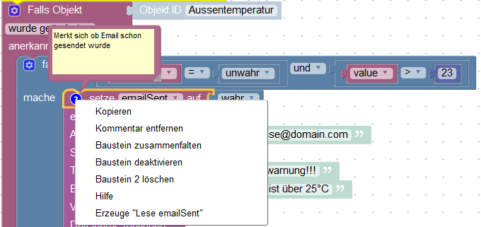

Man kann größere Blöcke einklappen, um eine bessere Übersicht zu erhalten, indem man im Kontextmenü den Punkt "Block einklappen" auswählt.


&nbsp;
Beispiel zum importieren:

```xml
<xml xmlns="http://www.w3.org/1999/xhtml">
  <block type="comment" id="r53:ZiP]3DYe;Ly;@!v5" x="87" y="13">
    <field name="COMMENT"> Send email if outside temperature is more than 25 grad Celsius.</field>
    <next>
      <block type="variables_set" id="oyEg!Z7~qid+!HYECD8C">
        <field name="VAR">emailSent</field>
        <value name="VALUE">
          <block type="logic_boolean" id="gakxd?9T354S1#_(=)%K">
            <field name="BOOL">FALSE</field>
          </block>
        </value>
        <next>
          <block type="on_ext" id="DR}w0I%EUL-FCI%`w5L4">
            <mutation items="1"></mutation>
            <field name="CONDITION">ne</field>
            <field name="ACK_CONDITION">true</field>
            <value name="OID0">
              <shadow type="field_oid" id="}TdS?2Lg~Mt[0!o0iMG.">
                <field name="oid">javascript.0.Outside_temperature</field>
              </shadow>
            </value>
            <statement name="STATEMENT">
              <block type="controls_if" id="rBBI(VLLLRnwd|ys59si">
                <mutation elseif="1"></mutation>
                <value name="IF0">
                  <block type="logic_operation" id="B5R%#,6F,xYI1gB!jjq|">
                    <field name="OP">AND</field>
                    <value name="A">
                      <block type="logic_compare" id="I=R,TaB*pge*l#j|[HZ0">
                        <field name="OP">EQ</field>
                        <value name="A">
                          <block type="variables_get" id="wd1I0gzqle,y-:h@GF)v">
                            <field name="VAR">emailSent</field>
                          </block>
                        </value>
                        <value name="B">
                          <block type="logic_boolean" id="q5~/ZIb))r`w]/RaSXUu">
                            <field name="BOOL">FALSE</field>
                          </block>
                        </value>
                      </block>
                    </value>
                  </block>
                </value>
                <statement name="DO0">
                  <block type="variables_set" id="i):z[{@|*;4zOruzXH46">
                    <field name="VAR">emailSent</field>
                    <comment pinned="false" h="80" w="160">Remember, that email was sent</comment>
                    <value name="VALUE">
                      <block type="logic_boolean" id="56A@]MZKiuL(iuuj)MRI">
                        <field name="BOOL">FALSE</field>
                      </block>
                    </value>
                    <next>
                      <block type="email" id="3J#TXZ`oei_NMEL,_w8K">
                        <field name="INSTANCE"></field>
                        <field name="IS_HTML">FALSE</field>
                        <field name="LOG">log</field>
                        <value name="TO">
                          <shadow type="text" id="j*x?kanQQyGH/pN,r9B2">
                            <field name="TEXT">myaddress@domain.com</field>
                          </shadow>
                        </value>
                        <value name="TEXT">
                          <shadow type="text" id="QE(T_Z]{=o8~h~+vz!ZU">
                            <field name="TEXT">Temperature is over 25°C</field>
                          </shadow>
                        </value>
                        <value name="SUBJECT">
                          <shadow type="text" id="/_AxN7@=T|t@XW.^Fu1(">
                            <field name="TEXT">Temperature alert</field>
                          </shadow>
                        </value>
                      </block>
                    </next>
                  </block>
                </statement>
                <value name="IF1">
                  <block type="logic_compare" id="S?0|;{3V3!_rqUk]GJ4)">
                    <field name="OP">LT</field>
                    <value name="A">
                      <block type="variables_get" id="IJwq1,|y;l7ueg1mF{~x">
                        <field name="VAR">value</field>
                      </block>
                    </value>
                    <value name="B">
                      <block type="math_number" id="m(.v?M3ezTKz(kf5b9ZE">
                        <field name="NUM">23</field>
                      </block>
                    </value>
                  </block>
                </value>
                <statement name="DO1">
                  <block type="variables_set" id="M0{G}QBtF!FYrT,xWBnV">
                    <field name="VAR">emailSent</field>
                    <value name="VALUE">
                      <block type="logic_boolean" id="ti#H=_:;-XRC%CzR/+/0">
                        <field name="BOOL">FALSE</field>
                      </block>
                    </value>
                  </block>
                </statement>
              </block>
            </statement>
          </block>
        </next>
      </block>
    </next>
  </block>
</xml>
```

&nbsp;

&nbsp;

# 块
## 系统块
### 调试输出
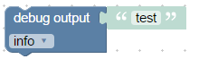

这个块除了写一行到日志之外什么都不做。您可以使用它来调试脚本，如下所示：


&nbsp;导入示例：

```xml 
<xml xmlns="http://www.w3.org/1999/xhtml">
  <block type="comment" id="K|2AnJ|5})RoNZ1T%Hh#" x="38" y="13">
    <field name="COMMENT">Print time into log every second</field>
    <next>
      <block type="timeouts_setinterval" id="LNsHTl,!r6eR8J9Yg,Xn">
        <field name="NAME">interval</field>
        <field name="INTERVAL">1000</field>
        <statement name="STATEMENT">
          <block type="debug" id=".oLS7P_oFU0%PWocRlYp">
            <field name="Severity">log</field>
            <value name="TEXT">
              <shadow type="text" id="X^Z/.qUry9B5Rr#N`)Oy">
                <field name="TEXT">test</field>
              </shadow>
              <block type="time_get" id="TPo6nim+=TBb-pnKMkRp">
                <mutation format="false" language="false"></mutation>
                <field name="OPTION">hh:mm:ss</field>
              </block>
            </value>
          </block>
        </statement>
      </block>
    </next>
  </block>
</xml>
```

您可以为消息定义 4 个不同的严重级别：

- 调试（这需要激活 javascript 实例的调试级别。）
- info（默认，至少 info 日志级别必须在 javascript 实例中激活。）
- 警告
- 错误（始终显示。如果在 javascript 实例中进行了相应设置，则可以忽略其他级别。）

&nbsp;

### 评论
为脚本添加注释以便以后更好地理解。

该块不做任何事情，它只是一个评论。

&nbsp;

### 控制状态
您可以通过两种不同的方式编写状态：

- 控制某些东西并将值发送到硬件（此块）
- 仅为信息写入一个新值，例如温度变化（[下一个块]（#update-state））

&nbsp;该模块的典型应用：

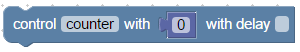

在对话框中选择对象 ID，必须指定要发送的值。根据数据点的类型，该值可以是[string](#string-value)、[number](#number-value) 或 [boolean](#ogical-value-trueflase)类型。

[这里](https://github.com/ioBroker/ioBroker/wiki/Adapter-Development-Documentation#commands-and-statuses)中有进一步的解释。

此块使用 (ack=false) 将命令写入数据点。也可以指定延迟。
如果延迟不为 0，则不会立即设置状态，而是仅在指定时间（以毫秒为单位）之后设置。

您可以通过选中复选框来删除此数据点的所有其他延迟。

在以下示例中，“Light”数据点仅切换一次（2 秒后）：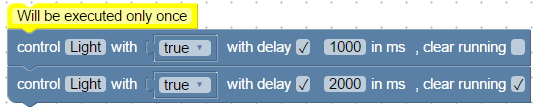

&nbsp;导入示例：

```xml 
<xml xmlns="http://www.w3.org/1999/xhtml">
  <block type="comment" id="K|2AnJ|5})RoNZ1T%Hh#" x="38" y="13">
    <field name="COMMENT">Will be executed only once</field>
    <next>
      <block type="control" id="IWceY@BFn9/Y?Ez^b(_-">
        <mutation delay_input="true"></mutation>
        <field name="OID">javascript.0.Light</field>
        <field name="WITH_DELAY">TRUE</field>
        <field name="DELAY_MS">1000</field>
        <field name="CLEAR_RUNNING">FALSE</field>
        <value name="VALUE">
          <block type="logic_boolean" id="I/LUv5/AknHr#[{{qd-@">
            <field name="BOOL">TRUE</field>
          </block>
        </value>
        <next>
          <block type="control" id=".Ih(K(P)SFApUP0)/K7,">
            <mutation delay_input="true"></mutation>
            <field name="OID">javascript.0.Light</field>
            <field name="WITH_DELAY">TRUE</field>
            <field name="DELAY_MS">2000</field>
            <field name="CLEAR_RUNNING">TRUE</field>
            <value name="VALUE">
              <block type="logic_boolean" id="B?)bgD[JZoNL;enJQ4M.">
                <field name="BOOL">TRUE</field>
              </block>
            </value>
          </block>
        </next>
      </block>
    </next>
  </block>
</xml>
```

与上例相比，下例中“Light”的状态切换了两次（1 秒后和 2 秒后）：

```xml 
<xml xmlns="http://www.w3.org/1999/xhtml">
  <block type="comment" id="K|2AnJ|5})RoNZ1T%Hh#" x="38" y="13">
    <field name="COMMENT">Will be executed twice</field>
    <next>
      <block type="control" id="IWceY@BFn9/Y?Ez^b(_-">
        <mutation delay_input="true"></mutation>
        <field name="OID">javascript.0.Light</field>
        <field name="WITH_DELAY">TRUE</field>
        <field name="DELAY_MS">1000</field>
        <field name="CLEAR_RUNNING">FALSE</field>
        <value name="VALUE">
          <block type="logic_boolean" id="I/LUv5/AknHr#[{{qd-@">
            <field name="BOOL">TRUE</field>
          </block>
        </value>
        <next>
          <block type="control" id=".Ih(K(P)SFApUP0)/K7,">
            <mutation delay_input="true"></mutation>
            <field name="OID">javascript.0.Light</field>
            <field name="WITH_DELAY">TRUE</field>
            <field name="DELAY_MS">2000</field>
            <field name="CLEAR_RUNNING">FALSE</field>
            <value name="VALUE">
              <block type="logic_boolean" id="B?)bgD[JZoNL;enJQ4M.">
                <field name="BOOL">FALSE</field>
              </block>
            </value>
          </block>
        </next>
      </block>
    </next>
  </block>
</xml>
```

&nbsp;

### 更新状态
此块类似于[控制块](#steuere-state)，但它只设置当前值。不发送任何命令来控制硬件。

该模块的典型应用：


&nbsp;

### 绑定状态
该块将两个状态绑定在一起。

使用这些块可以实现相同的目的：

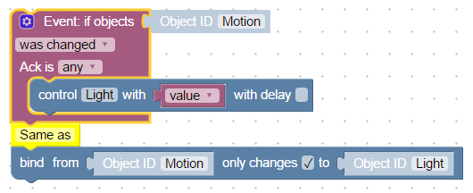

可以选择是仅在源更改时传递值，还是在每次更新时传递值。

&nbsp;导入示例：

```xml 
<block xmlns="http://www.w3.org/1999/xhtml" type="on_ext" id="w/@=5/5!D;8wn4DZ;jzG" x="287.99999999999943" y="37.999999999999716">
  <mutation items="1"></mutation>
  <field name="CONDITION">ne</field>
  <field name="ACK_CONDITION"></field>
  <value name="OID0">
    <shadow type="field_oid" id="tQBL3[;V1luVO[`h2ONM">
      <field name="oid">javascript.0.Motion</field>
    </shadow>
  </value>
  <statement name="STATEMENT">
    <block type="control" id="w=sN]yxb)5Jv!,YK[C5%">
      <mutation delay_input="false"></mutation>
      <field name="OID">javascript.0.Light</field>
      <field name="WITH_DELAY">FALSE</field>
      <value name="VALUE">
        <block type="variables_get" id="6`1|t;T%_h^|ES+nd~/?">
          <field name="VAR">value</field>
        </block>
      </value>
    </block>
  </statement>
</block>
```

&nbsp;

### 写状态
通用写入块，可以与[“更新状态”]（#update-state）和[“控制状态”](#control-state)一起执行相同的操作。

但与它们相比，您可以使用其他块定义对象 ID 和延迟，以使您的脚本更加通用。

### 创建状态
 可以在脚本中创建两种类型的变量：

- 本地 [变量](#set-variables-value)
- 全局变量或状态。

全局状态在所有脚本中可见，但局部状态仅在当前脚本中可见。

全局状态可用于 vis、mobile 和所有其他逻辑或可视化模块，可以登录到 db 或其他任何东西。

此块创建全局状态，如果状态尚存在，则该命令将被忽略。您可以在脚本的每次启动时安全地调用此块。

此块创建全局状态，如果它已经存在，则忽略该命令。因此，可以在任何脚本启动时毫无风险地使用此块。

&nbsp;该模块的典型应用：


```xml 
<xml xmlns="http://www.w3.org/1999/xhtml">
  <block type="comment" id="dBV.{0z/{Fr@RB+10H5i" x="38" y="13">
    <field name="COMMENT">Create state and subscribe on it changes</field>
    <next>
      <block type="create" id="D%[{T~!b9^V#Z.7bI+3y">
        <field name="NAME">myState</field>
        <statement name="STATEMENT">
          <block type="on_ext" id="H@F~z_,FpvXo8BptmAtL">
            <mutation items="1"></mutation>
            <field name="CONDITION">ne</field>
            <field name="ACK_CONDITION"></field>
            <value name="OID0">
              <shadow type="field_oid" id="hn{OMH9y7AP_dns;KO6*">
                <field name="oid">javascript.0.myState</field>
              </shadow>
            </value>
            <statement name="STATEMENT">
              <block type="debug" id="DjP1pU?v=))`V;styIRR">
                <field name="Severity">log</field>
                <value name="TEXT">
                  <shadow type="text" id="de?mCXefl4v#XrO])~7y">
                    <field name="TEXT">test</field>
                  </shadow>
                  <block type="text_join" id="^33}.]#ov(vUAEEn8Hdp">
                    <mutation items="2"></mutation>
                    <value name="ADD0">
                      <block type="text" id="_-p%CZq4%)v1EYvh)lf@">
                        <field name="TEXT">Value of my state is </field>
                      </block>
                    </value>
                    <value name="ADD1">
                      <block type="variables_get" id="6r!TtpfrfQ@5Nf[4#[6l">
                        <field name="VAR">value</field>
                      </block>
                    </value>
                  </block>
                </value>
              </block>
            </statement>
          </block>
        </statement>
      </block>
    </next>
  </block>
</xml>
```

您可以在块本身中使用新创建的状态。

以下代码在第一次运行时会引发错误，因为 'subscribe' for 'myState' 找不到对象：


第二次运行它时，不会抛出任何错误，因为数据点现在存在。

&nbsp;

### 对象 ID 的值 
该块用于读取数据点的值。可以读取数据点的以下属性：

- 价值
- 确认 - command = false 或 update = true
- 自 1970 年 1 月 1 日以来以毫秒为单位的时间戳（具有“日期对象”类型）
- 自 1970 年 1 月 1 日以来以毫秒为单位的最后一次更改（具有“日期对象”类型）
- 质量
- 源 - 写入最后一个值的实例的名称，例如 `system.adapter.javascript.0`

&nbsp;输出最后一次更改值的时间的示例：


```xml 
<xml xmlns="http://www.w3.org/1999/xhtml">
  <block type="comment" id="GVW732OFexZ9HP[q]B3," x="38" y="13">
    <field name="COMMENT">Print time of last change for myState</field>
    <next>
      <block type="debug" id="t,GmgLjo]1d0{xT+@Yns">
        <field name="Severity">log</field>
        <value name="TEXT">
          <shadow type="text" id="w{UF-|ashrP4e*jl~{9_">
            <field name="TEXT">test</field>
          </shadow>
          <block type="text_join" id="i~L{r:B9oU}.ANc.AV8F">
            <mutation items="2"></mutation>
            <value name="ADD0">
              <block type="text" id="r5=i|qvrII+NCAQ~t{p5">
                <field name="TEXT">Last change of myState was at</field>
              </block>
            </value>
            <value name="ADD1">
              <block type="convert_from_date" id="?cGS1/CwThX!tTDMVSoj">
                <mutation format="false" language="false"></mutation>
                <field name="OPTION">hh:mm:ss</field>
                <value name="VALUE">
                  <block type="get_value" id="k+#N2u^rx)u%Z9lA`Yps">
                    <field name="ATTR">lc</field>
                    <field name="OID">javascript.0.myState</field>
                  </block>
                </value>
              </block>
            </value>
          </block>
        </value>
      </block>
    </next>
  </block>
</xml>
```

&nbsp;

### 对象 ID


这是一个简单的帮助块，可以方便地选择对象 ID 来触发块。

通过单击“对象 ID”打开 ID 选择对话框。

&nbsp;该块的典型应用：

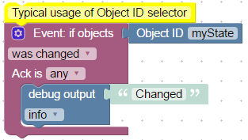

```xml 
<xml xmlns="http://www.w3.org/1999/xhtml">
  <block type="comment" id="GVW732OFexZ9HP[q]B3," x="38" y="13">
    <field name="COMMENT">Typical usage of Object ID selector</field>
    <next>
      <block type="on_ext" id="D+1_tP(lF!R]wy?R#|~A">
        <mutation items="1"></mutation>
        <field name="CONDITION">ne</field>
        <field name="ACK_CONDITION"></field>
        <value name="OID0">
          <shadow type="field_oid" id="rpg#*-DXMVqzexE8-^Xc">
            <field name="oid">default</field>
          </shadow>
          <block type="field_oid" id="YYTRKxeC@l3WE~OJx4ei">
            <field name="oid">javascript.0.myState</field>
          </block>
        </value>
        <statement name="STATEMENT">
          <block type="debug" id="{;_x6LATJ,b^leE,xgz9">
            <field name="Severity">log</field>
            <value name="TEXT">
              <shadow type="text" id="-)V}_9Cxt2kj:]36y,7#">
                <field name="TEXT">Changed</field>
              </shadow>
            </value>
          </block>
        </statement>
      </block>
    </next>
  </block>
</xml>
```

&nbsp;

&nbsp;

## 动作块
### 执行 - 命令


该块在系统中执行输入的命令，就好像它是通过 SSH 在命令行中输入的一样。

该命令以启动 ioBroker 的用户的权限执行。

如果不需要输出，可以抑制它：


如果要输出：

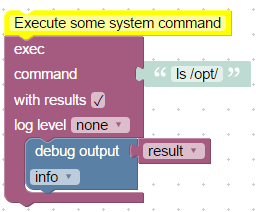

&nbsp;

```xml 
<xml xmlns="http://www.w3.org/1999/xhtml">
  <block type="comment" id="GVW732OFexZ9HP[q]B3," x="313" y="38">
    <field name="COMMENT">Execute some system command</field>
    <next>
      <block type="exec" id="hGkHs.IkmiTa{jR^@-}S">
        <mutation with_statement="true"></mutation>
        <field name="WITH_STATEMENT">TRUE</field>
        <field name="LOG"></field>
        <value name="COMMAND">
          <shadow type="text" id=":KG#hyuPRhQJWFSk)6Yo">
            <field name="TEXT">ls /opt/</field>
          </shadow>
        </value>
        <statement name="STATEMENT">
          <block type="debug" id="ELv(y5V4[hZ,F8,]D51x">
            <field name="Severity">log</field>
            <value name="TEXT">
              <shadow type="text" id="J[o*Fylexfu41}smph).">
                <field name="TEXT">result</field>
              </shadow>
              <block type="variables_get" id="gWo7Y^,QI=PqL(Q;7D=^">
                <field name="VAR">result</field>
              </block>
            </value>
          </block>
        </statement>
      </block>
    </next>
  </block>
</xml>
```

&nbsp;

为了分析输出，创建了 3 个特殊变量：

- 结果，包含到控制台的常规输出（例如，对于命令“ls /opt”，输出为“iobroker nodejs”）
- 如果无法执行来自 JavaScript 模块的命令，则会出现错误对象
-stderr，执行程序的错误输出

此外，如果日志级别未设置为“无”，日志中也会出现相同的输出。

&nbsp;

### 请求地址


调用 URL 并返回结果。

&nbsp;例子：

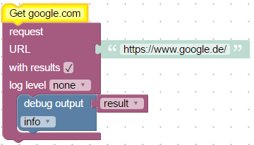

为了分析输出，创建了 3 个特殊变量：

- 结果，包含请求页面的正文
- 错误，包含错误描述
- 响应（仅限高级），类型 [http.IncomingMessage](https://nodejs.org/api/http.html#http_class_http_incomingmessage) 的特殊对象

如果不需要输出，可以将其抑制。为此，请选中“with result”选项。

&nbsp;

&nbsp;

## SendTo 块
### 发送到电报


此块用于使用电报适配器通过电报发送消息。

当然，电报适配器必须事先安装和配置。

为了通过特定实例发送消息，必须选择所需的适配器实例（通常为电报.0），否则将通过所有可用实例发送消息。

*Message* 字段是强制性的，其中包含的文本以完全相同的方式发送给客户端。

用户名 ID 是可选的，这是来自 [电报](https://core.telegram.org/bots/api#user)（用户或机器人的唯一标识符）的 ID。

此外，如果日志级别不是“无”，则会将相同的消息发送到日志。

&nbsp;

### 发送到 SayIt


此块用于将文本发送到 `sayit` 实例以发音此文本。

当然，必须安装和配置`sayit`适配器。

要将消息发送到某个特定实例，您应该选择已安装的适配器实例（通常是`sayit.0`），否则消息将发送到所有现有实例。

属性 *message* 是强制性的，并且该文本将准确发音。

您必须检查语言属性。这将用于 text2speech 引擎。

音量是可选的（通常从 0 到 100）。

此外，如果日志级别不是“无”，则会将相同的消息发送到日志。

&nbsp;

###发送到pushover


此块用于向 pushover 客户端发送文本。您可以阅读有关推车驱动程序[这里](https://github.com/ioBroker/ioBroker.pushover)的信息。

当然，必须安装和配置 Pushover 适配器。

要将消息发送到某个特定实例，您应该选择已安装的适配器实例（通常为 pushover.0），否则消息将发送到所有现有实例。

属性 *message* 是强制性的，并且该文本将准确地发送给客户端。

所有其他属性都是可选的，您可以阅读它们[这里](https://pushover.net/api)：

- *设备 ID* - 您的用户的设备名称，用于将消息直接发送到该设备，而不是所有用户的设备（多个设备可以用逗号分隔）
- *title* - 您的消息的标题，否则使用您的应用程序名称
- *URL* - 与您的消息一起显示的补充 URL
- *URL 标题* - 补充 URL 的标题，否则只显示 URL
- *priority* - 发送为 -2 不生成通知/警报，-1 始终作为安静通知发送，1 显示为高优先级并绕过用户的安静时间，或 2 还需要用户确认
- *time in ms* - 显示给用户的消息日期和时间的 Unix 时间戳，而不是我们的 API 接收消息的时间
- *sound* - 设备客户端支持覆盖用户默认声音选择的声音之一的名称

此外，如果日志级别不是“无”，则会将相同的消息发送到日志。

&nbsp;

＃＃＃ 发送电子邮件
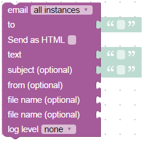

此块用于将文本作为电子邮件发送。

当然，必须安装、配置和测试电子邮件适配器。

要将消息发送到某个特定实例，您应该选择已安装的适配器实例（通常为 email.0），否则消息将发送到所有现有实例。

属性 *text* 是强制性的，并且该文本将准确地发送给客户端。

当然，目的地 (*to*) 必须填写有效的电子邮件地址。

您最多可以将文件（通常是图像）附加到电子邮件中。要在文本中使用图像，您必须将格式更改为 HTML（选中“作为 HTML 发送”选项），文本可能如下所示：

```html
<p>Embedded image 1: </p>
<p>Embedded image 2: </p>
```

您可以将文件称为``````。 “file1”和“file2”是保留的 ID，不能更改。

“文件名”必须包含磁盘上映像的完整路径。


```xml 
<block xmlns="http://www.w3.org/1999/xhtml" type="email" id="VeysPTJXFh^.CW1t(s@Q" x="563" y="63">
  <field name="INSTANCE"></field>
  <field name="IS_HTML">FALSE</field>
  <field name="LOG"></field>
  <value name="TO">
    <shadow type="text" id=".6+6Rp^N7JHiNkP/.^09">
      <field name="TEXT"></field>
    </shadow>
    <block type="text" id="NC6==~4g|OB^`xZ:|Rlx">
      <field name="TEXT">user@myemail.com</field>
    </block>
  </value>
  <value name="TEXT">
    <shadow type="text" id="jaGOyI%O4wl(.s.wo(Y`">
      <field name="TEXT"></field>
    </shadow>
    <block type="text" id=")--+u-+rdoAyWpi9I87+">
      <field name="TEXT">&lt;p&gt;Embedded image 1: &lt;img src='cid:file1'/&gt;&lt;/p&gt;</field>
    </block>
  </value>
  <value name="SUBJECT">
    <shadow type="text" id="|49=rPOCP]hwFD[HX@_I">
      <field name="TEXT">From Sweet Home</field>
    </shadow>
  </value>
  <value name="FILE_1">
    <block type="text" id="tlb_Kuh5?JvPTQr)A{}4">
      <field name="TEXT">/opt/video/imageCam.png</field>
    </block>
  </value>
</block>
```

此外，如果日志级别不是“无”，则会将相同的消息发送到日志。

&nbsp;

### 自定义 sendTo 块


这只是将内部系统消息 (sendTo) 发送到任何适配器的帮助块。

当然，您可以使用自定义功能块来做任何疯狂的事情，也可以发送消息。

您可以为 sendTo 命令定义自己的参数：

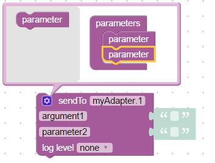

阅读更多关于“sendTo”的[这里](https://github.com/ioBroker/ioBroker.javascript#sendto)。

示例如何将 SQL 查询发送到 sql 适配器：

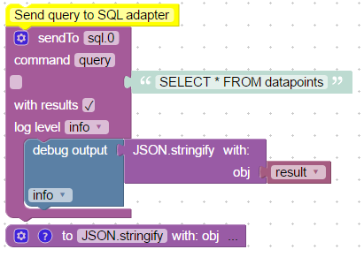

```xml 
<xml xmlns="http://www.w3.org/1999/xhtml"> -->
  <block type="comment" id="GVW732OFexZ9HP[q]B3," x="163" y="13">
    <field name="COMMENT">Send query to SQL adapter</field>
    <next>
      <block type="sendto_custom" id="84lYloO4o+RvLszPVHZ5">
        <mutation items="" with_statement="true"></mutation>
        <field name="INSTANCE">sql.0</field>
        <field name="COMMAND">query</field>
        <field name="WITH_STATEMENT">TRUE</field>
        <field name="LOG">log</field>
        <value name="ARG0">
          <shadow type="text" id=")faamoSD,nGPXawY4|(Z">
            <field name="TEXT">SELECT * FROM datapoints</field>
          </shadow>
        </value>
        <statement name="STATEMENT">
          <block type="debug" id="Q#UJl]^_g/VHzM*G/a:f">
            <field name="Severity">log</field>
            <value name="TEXT">
              <shadow type="text" id="#!NJS43!0z@}z:6~_,9(">
                <field name="TEXT">test</field>
              </shadow>
              <block type="procedures_callcustomreturn" id="0E2fmQQduf4)-({z(om|">
                <mutation name="JSON.stringify">
                  <arg name="obj"></arg>
                </mutation>
                <value name="ARG0">
                  <block type="variables_get" id=",^2E2eT#598hI^TvABD9">
                    <field name="VAR">result</field>
                  </block>
                </value>
              </block>
            </value>
          </block>
        </statement>
      </block>
    </next>
  </block>
  <block type="procedures_defcustomreturn" id="lm*.n3kQXll8o9X^*m,k" x="163" y="263">
    <mutation statements="false">
      <arg name="obj"></arg>
    </mutation>
    <field name="NAME">JSON.stringify</field>
    <field name="SCRIPT">cmV0dXJuIEpTT04uc3RyaW5naWZ5KG9iaik7</field>
    <comment pinned="false" h="80" w="160">Describe this function...</comment>
  </block>
</xml>
```

如果只使用一个名称为空的参数，则不会创建任何结构，如下所示：

```javascript
var obj, result;

/**
 * Describe this function...
 */
function JSON_stringify(obj) {
    return JSON.stringify(obj);
}


// Send query to SQL adapter
sendTo("sql.0", "query", 'SELECT * FROM datapoints', function (result) {
    console.log((JSON_stringify(result)));
  });
console.log("sql.0: " + "");
```

或者如何从 SQL 适配器请求历史记录：


```XML
<xml xmlns="http://www.w3.org/1999/xhtml">
  <block type="comment" id="GVW732OFexZ9HP[q]B3," x="263" y="13">
    <field name="COMMENT">Get history from SQL adapter</field>
    <next>
      <block type="variables_set" id="J;8I^fN*4YQ1+jPI3FS#">
        <field name="VAR">end</field>
        <value name="VALUE">
          <block type="time_get" id="kZFFxa-2%7/:=IHU|}eB">
            <mutation format="false" language="false"></mutation>
            <field name="OPTION">object</field>
          </block>
        </value>
        <next>
          <block type="sendto_custom" id="84lYloO4o+RvLszPVHZ5">
            <mutation items="id,options" with_statement="true"></mutation>
            <field name="INSTANCE">sql.0</field>
            <field name="COMMAND">getHistory</field>
            <field name="WITH_STATEMENT">TRUE</field>
            <field name="LOG"></field>
            <value name="ARG0">
              <shadow type="text" id=")faamoSD,nGPXawY4|(Z">
                <field name="TEXT">system.adapter.admin.0.memRss</field>
              </shadow>
            </value>
            <value name="ARG1">
              <shadow type="text" id="/nmT=qDw;S`#*tXN=C6n">
                <field name="TEXT">{start: end - 3600000, end: end, aggregate: "minmax"}</field>
              </shadow>
            </value>
            <statement name="STATEMENT">
              <block type="debug" id="Q#UJl]^_g/VHzM*G/a:f">
                <field name="Severity">log</field>
                <value name="TEXT">
                  <shadow type="text" id="#!NJS43!0z@}z:6~_,9(">
                    <field name="TEXT">test</field>
                  </shadow>
                  <block type="procedures_callcustomreturn" id="0E2fmQQduf4)-({z(om|">
                    <mutation name="JSON.stringify">
                      <arg name="obj"></arg>
                    </mutation>
                    <value name="ARG0">
                      <block type="variables_get" id=",^2E2eT#598hI^TvABD9">
                        <field name="VAR">result</field>
                      </block>
                    </value>
                  </block>
                </value>
              </block>
            </statement>
          </block>
        </next>
      </block>
    </next>
  </block>
  <block type="procedures_defcustomreturn" id="lm*.n3kQXll8o9X^*m,k" x="263" y="313">
    <mutation statements="false">
      <arg name="obj"></arg>
    </mutation>
    <field name="NAME">JSON.stringify</field>
    <field name="SCRIPT">cmV0dXJuIEpTT04uc3RyaW5naWZ5KG9iaik7</field>
    <comment pinned="false" h="80" w="160">JSON.stringify object</comment>
  </block>
</xml>
```

生成的javascript代码：

```javascript
var obj, end, result;

/**
 * JSON.stringify object
 */
function JSON_stringify(obj) {
    return JSON.stringify(obj);
}


// Get history from SQL adapter
end = (new Date().getTime());
sendTo("sql.0", "getHistory", {
   "id": 'system.adapter.admin.0.memRss',
   "options": {start: end - 3600000, end: end, aggregate: "minmax"}
}, function (result) {
    console.log((JSON_stringify(result)));
  });
```

如果您以“{”开始值，它将被解释为 JSON 字符串。在字符串中使用双引号。

&nbsp;

&nbsp;

## 日期和时间块
###时间比较


如果使用运算符“介于”或“不介于”，则该块如下所示：


您可以指定一个必须进行比较的时间。 Block 期望时间为“日期对象”。


比较模式有以下几种：

- 小于，检查实际时间是否小于指定时间。
- 等于或小于
- 比...更棒
- 等于或大于
- 等于
- between，检查某天时间之间的时间。
    - 例如。如果时间必须在 12:00 到 20:00 之间。将检查实际时间是否大于等于 12:00 且小于 20:00。 20:00 将返回 false。
    - 或者例如在 21:00 到 8:00 之间。在最后一种情况下，将检查时间是否大于或等于 21:00 或小于 8:00。

- 如果时间不在白天的给定时间段内，则不在中间。如果时间小于开始且大于或等于结束。 （如果开始时间大于结束时间，则检查时间是否大于等于结束且小于开始）

以下时间格式有效：

- YYYY-MM-DD hh:mm:ss
- YYYY-MM-DD hh:mm
- 时：分：秒
- hh:mm

&nbsp;

###实际时间对比


此块用于将白天时间与实际时间进行比较。它与[时间比较](#time-comparision)具有相同的逻辑，但限制不能是块，它只比较实际时间。 （为了与旧版本兼容）

&nbsp;

### 以特定格式获取实际时间


以某种指定格式返回实际时间。

支持以下格式：

- 毫秒 - 仅返回从 0 到 999 的当前秒的毫秒数（不是纪元毫秒数）。要获得纪元毫秒，请使用“日期对象”；
- seconds - 仅返回从 0 到 59 的当前分钟的秒数，
- 一天中的秒数 - 返回从一天开始的秒数（0 到 24 * 3600 - 1），
- 分钟 - 返回当前小时的分钟，从 0 到 59，
- 一天中的分钟数 - 返回从一天开始的分钟数（0 到 24 * 60 - 1），
- hours - 返回当天从 0 到 23 的小时数，
- 一个月中的一天 - 从 1 到 31 获取一个月中的一天，
- 月份作为数字 - 将月份作为从 1 到 12 的数字，
- 月份作为文本 - 获取月份作为文本。必须指定语言。
- 作为短文本的月份 - 以文本形式获取月份：1 月、2 月、3 月、4 月、5 月、6 月、7 月、8 月、9 月、10 月、11 月、12 月。必须指定语言。
- 短年份 - 从 0 到 99 的年份，例如2016 年的结果将是 16。
- 全年 - 全年：2016
- 工作日文本 - 获取星期几作为文本。
- short week day - 获取星期几作为短文本：Su、Mo、Tu、We、Th、Fr、Sa。
- 星期作为数字 - 星期几作为数字，从 1（星期一）到 7（星期日）。
- 自定义格式 - 您可以指定自己的 [格式](https://github.com/ioBroker/ioBroker.javascript#formatdate)。
- 日期对象 - 以从纪元开始（格林威治标准时间 1970.1.1 00:00:00.000Z）开始的毫秒数返回日期和时间。这始终是格林威治标准时间。
- yyyy.mm.dd - 2016.09.14
- 年年/月/日 - 2016/09/14
- yy.mm.dd - 2014 年 9 月 16 日
- 年/月/日 - 2014 年 9 月 16 日
- dd.mm.yyyy - 14.09.2016
- 日/月/年 - 2016 年 9 月 14 日
- dd.mm.yy - 14.09.16
- 日/月/年 - 16 年 9 月 14 日
- 月/日/年 - 2016 年 9 月 14 日
- 月/日/年 - 2016 年 9 月 14 日
- dd.mm。 - 14.09。
- 日/毫米 - 14/09
- 毫米.dd - 09.14
- 毫米/日 - 09/14
- hh:mm - 12:00
- hh:mm:ss - 12:00:00
- hh:mm:ss.sss - 12:00:00.000

&nbsp;

### 获取今天的天文事件时间
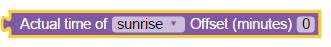

返回某些特定占星术事件在当天的时间。

属性“offset”是以分钟为单位的偏移量。在天文事件之前定义时间也可以是负面的。

以下值可用作 astro-function 中的属性：

- 日出：日出（太阳的顶部边缘出现在地平线上）
- 日出结束：日出结束（太阳的下边缘接触地平线）
-goldenHourEnd：早晨黄金时段（光线柔和，最佳摄影时间）结束
- solarNoon：太阳正午（太阳在最高位置）
- 黄金时段：晚上黄金时段开始
-sunsetStart：日落开始（太阳的下边缘接触地平线）
- 日落：日落（太阳消失在地平线以下，傍晚民间暮光开始）
- 黄昏：黄昏（傍晚航海黄昏开始）
- nauticalDusk：航海黄昏（天文暮光之夜开始）
- 夜晚：夜晚开始（对于天文观测来说足够黑）
- nightEnd：夜晚结束（早上天文暮光开始）
- nauticalDawn：航海黎明（早晨航海黄昏开始）
- 黎明：黎明（早晨航海黄昏结束，早晨民间黄昏开始）
- 最低点：最低点（夜晚最黑暗的时刻，太阳处于最低位置）

返回值的类型为“日期对象”，它只是从 1970.01.01 开始的毫秒数。

**注意：** 要使用“astro”功能，必须在 javascript 适配器设置中定义“纬度”和“经度”。

&nbsp;

&nbsp;

## 转换块
有时需要将值转换为其他类型。以下块允许将值转换为特定类型。

### 转换为数字


将值转换为数字（浮点数）。

&nbsp;

### 转换为布尔值


将值转换为布尔值（真或假）。

&nbsp;

### 转换为字符串


将值转换为字符串。

&nbsp;

### 获取变量类型


获取值的类型。类型可以是：布尔值、数字、字符串、对象。

&nbsp;

### 转换为日期/时间对象


将值转换为“日期对象”。阅读[这里](#get-actual-time-im-specific-format)，“日期对象”是什么。

&nbsp;

### 将日期/时间对象转换为字符串


将“日期对象”转换为字符串。它具有与[以特定格式获取实际时间](#get-actual-time-im-specific-format)相同的格式选项。

&nbsp;

### 将 JSON 转换为对象


将 JSON 字符串转换为 javascript 对象。如果发生错误，将返回空对象。 （仅限专家）

&nbsp;

### 将对象转换为 JSON


将 Javascript 对象转换为 JSON 字符串。如果选择了 prettify 选项，结果字符串如下所示：

```json
{
  "a": 1,
  "b": 2
}
```

如果不：

```
{"a": 1, "b": 2}
```

### 通过 JSONata 表达式转换


通过 JSONata 表达式转换 Javascript 对象。您可以在此处阅读更多相关信息：[https://jsonata.org/](https://jsonata.org/)

有效载荷示例：

```
{"example": [{"value": 4},{"value": 7},{"value": 13}]}
```

结果：

```
[{"value": 4},{"value": 7},{"value": 13}]
24
4
13
```

##触发器
### 触发状态变化


如果给定对象的状态发生更改或更新，此块将执行一些操作。这是相应地在不同状态和系统之间建立交互的主要块。

使用此块，您可以将不同的状态绑定在一起，或者在值更改时发送消息或电子邮件。

块的典型用法：

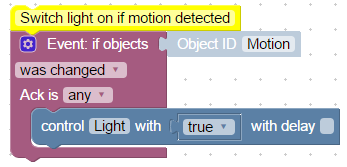

```xml 
<xml xmlns="http://www.w3.org/1999/xhtml">
  <block type="comment" id="]L0d;6j+=OH*[4n{C7v^" x="112" y="13">
    <field name="COMMENT">Switch light on if motion detected</field>
    <next>
      <block type="on_ext" id="QYVeQlu|#2hwniNg)=z8">
        <mutation items="1"></mutation>
        <field name="CONDITION">ne</field>
        <field name="ACK_CONDITION"></field>
        <value name="OID0">
          <shadow type="field_oid" id="Xe6D#r|nf9SEK`.oAuS0">
            <field name="oid">javascript.0.Motion</field>
          </shadow>
        </value>
        <statement name="STATEMENT">
          <block type="control" id="J(HiEvnNKw2B%V1~WXsX">
            <mutation delay_input="false"></mutation>
            <field name="OID">javascript.0.Light</field>
            <field name="WITH_DELAY">FALSE</field>
            <value name="VALUE">
              <block type="logic_boolean" id="o;j8lE#h.XE,0:0_LcW{">
                <field name="BOOL">TRUE</field>
              </block>
            </value>
          </block>
        </statement>
      </block>
    </next>
  </block>
</xml>
```

您可以通过扩展对话框定义任意数量的 ObjectID：

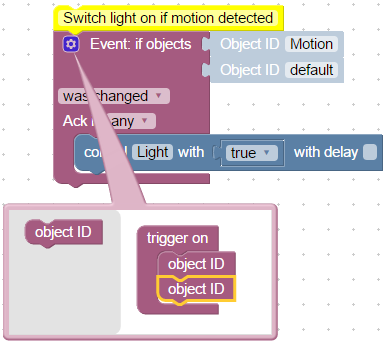

如果仅使用一个对象 ID，则语句块中可以使用特殊变量：

- 值 - 状态的实际值
- oldValue - 状态的旧值


```xml 
<block xmlns="http://www.w3.org/1999/xhtml" type="on_ext" id="QYVeQlu|#2hwniNg)=z8" x="38" y="39">
  <mutation items="1"></mutation>
  <field name="CONDITION">ne</field>
  <field name="ACK_CONDITION"></field>
  <value name="OID0">
    <shadow type="field_oid" id="Xe6D#r|nf9SEK`.oAuS0">
      <field name="oid">javascript.0.Motion</field>
    </shadow>
  </value>
  <statement name="STATEMENT">
    <block type="debug" id="jT6fif_FI9ua|,rL[Ra1">
      <field name="Severity">log</field>
      <value name="TEXT">
        <shadow type="text" id="}=qIm)a0)};f+J/JRgy^">
          <field name="TEXT">test</field>
        </shadow>
        <block type="text_join" id="wjgpY(Whewaqy0d8NVx%">
          <mutation items="4"></mutation>
          <value name="ADD0">
            <block type="text" id="M?[Xy1(Fu36A;b#=4~[t">
              <field name="TEXT">Actual value is</field>
            </block>
          </value>
          <value name="ADD1">
            <block type="variables_get" id="W)*G#(JDzuVpV^1P|[2m">
              <field name="VAR">value</field>
            </block>
          </value>
          <value name="ADD2">
            <block type="text" id="7TW;voPvdc#c4e/SWCjZ">
              <field name="TEXT">Old value was</field>
            </block>
          </value>
          <value name="ADD3">
            <block type="variables_get" id="s`6)4s:}%L#f]pu4E[vK">
              <field name="VAR">oldValue</field>
            </block>
          </value>
        </block>
      </value>
    </block>
  </statement>
</block>
```

否则，如果触发器使用了多个对象 ID，您可以通过 [触发信息](#trigger-info) 访问值和旧值。

&nbsp;

### 触发状态变化


这与“状态更改时触发”相同，但不可能使用多个对象 ID 进行触发（为了版本兼容性）。

&nbsp;

###触发器信息


获取有关触发触发器的状态的值、时间戳或 ID 的信息。

此块只能在 ["触发状态变化"](#trigger-on-states-change) 或 ["触发状态变化"](#trigger-on-state-change) 块内使用。

可以访问以下信息：

- 对象 ID - 触发触发器的状态 ID
- 名称 - 来自 common.name 的状态名称
- 描述 - 来自 common.desc 的状态描述
- 通道 ID - 状态所属的通道 ID。如果那里没有频道，它将为空
- 通道名称 - 状态所属的通道名称。如果那里没有频道，它将为空
- 设备 ID - 状态所属设备的 ID。如果那里没有频道，它将为空
- 设备名称 - 该状态所属的设备名称。如果那里没有频道，它将为空
- 状态值 - 触发状态的实际值
- 状态时间戳 - 作为日期对象的实际时间戳
- 状态质量 - 值的实际质量代码
- 值的来源 - 导致更改的实例的名称
- 是命令还是更新 - 是命令 (ack=false) 还是更新 (ack=true)
- 最后一次更改状态 - 最后一次更改此值的时间戳
- 先前值 - 此状态的先前值，在触发器触发之前
- 前一个时间戳 - 此状态的前一个时间戳，在触发器触发之前
- 先前质量 - 此状态的先前质量，在触发器触发之前
- 先前的来源 - 此状态的先前来源，在触发器触发之前
- 先前的命令或更新 - 此值的先前类型，在触发器触发之前
- 先前的最后更改 - 此状态的先前“最后更改的值”，在触发器触发之前

典型用法：

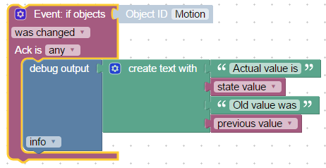

```xml 
<block xmlns="http://www.w3.org/1999/xhtml" type="on_ext" id="QYVeQlu|#2hwniNg)=z8" x="113" y="238">
  <mutation items="1"></mutation>
  <field name="CONDITION">ne</field>
  <field name="ACK_CONDITION"></field>
  <value name="OID0">
    <shadow type="field_oid" id="Xe6D#r|nf9SEK`.oAuS0">
      <field name="oid">javascript.0.Motion</field>
    </shadow>
  </value>
  <statement name="STATEMENT">
    <block type="debug" id="jT6fif_FI9ua|,rL[Ra1">
      <field name="Severity">log</field>
      <value name="TEXT">
        <shadow type="text" id="}=qIm)a0)};f+J/JRgy^">
          <field name="TEXT">test</field>
        </shadow>
        <block type="text_join" id="wjgpY(Whewaqy0d8NVx%">
          <mutation items="4"></mutation>
          <value name="ADD0">
            <block type="text" id="M?[Xy1(Fu36A;b#=4~[t">
              <field name="TEXT">Actual value is</field>
            </block>
          </value>
          <value name="ADD1">
            <block type="on_source" id="_q8v0HD`c[7e76O{@4Tq">
              <field name="ATTR">state.val</field>
            </block>
          </value>
          <value name="ADD2">
            <block type="text" id="7TW;voPvdc#c4e/SWCjZ">
              <field name="TEXT">Old value was</field>
            </block>
          </value>
          <value name="ADD3">
            <block type="on_source" id="D`gpXSShKRQuy:jyMK}6">
              <field name="ATTR">oldState.val</field>
            </block>
          </value>
        </block>
      </value>
    </block>
  </statement>
</block>
```

&nbsp;

＃＃＃ 日程


这是继[“触发状态变化”](#trigger-on-states-change)之后的第二个自动化主要模块。此块允许定期执行一些操作。

调度规则的定义将在非常有据可查的 CRON [格式](https://en.wikipedia.org/wiki/Cron) 中完成。通过扩展，也可以定义秒数。
如果应该使用秒，它们必须定义为 CRON 规则的第一个参数，并且规则将有 6 个部分。

通常 CRON 规则由 5 或 6 个部分组成：

- 秒规则（可选）
- 分钟规则
- 小时规则
- 月份规则
- 月规则
- 和星期几规则。

对于以下格式的每个部分，都允许：

- \* - 每（秒，分钟，小时，...）触发一次
- X (e.g. 5) - 仅在这一秒、一分钟、一小时内触发...
- from-to (e.g. 1-9) - 仅在此间隔内触发
- \*/X (e.g. \*/5) - 每 X 秒、分钟触发一次...如果 "\*/5" 持续数小时，触发器将在 0、5、10、15 和 20 小时触发。
- 数字和间隔可以用逗号组合（例如 1,3,4-6）。不要在数字之间留有空格，因为空格是规则部分的分隔符。

\*/10 \* \* \* 6,7 - 周六和周日每 10 分钟触发一次。

\*/30 \* \* \* \* \* - 每30秒触发一次。

```
 ┌───────────── min (0 - 59)
 │ ┌────────────── hour (0 - 23)
 │ │ ┌─────────────── day of month (1 - 31)
 │ │ │ ┌──────────────── month (1 - 12)
 │ │ │ │ ┌───────────────── day of week (0 - 6) (0 to 6 are Sunday to Saturday; 7 is also Sunday)
 │ │ │ │ │
 │ │ │ │ │
 │ │ │ │ │
 * * * * *  schedule
```

或者如果使用秒：

```
 ┌───────────── seconds (0 - 59)
 │ ┌───────────── min (0 - 59)
 │ │ ┌────────────── hour (0 - 23)
 │ │ │ ┌─────────────── day of month (1 - 31)
 │ │ │ │ ┌──────────────── month (1 - 12)
 │ │ │ │ │ ┌───────────────── day of week (0 - 6) (0 to 6 are Sunday to Saturday; 7 is also Sunday)
 │ │ │ │ │ │
 │ │ │ │ │ │
 │ │ │ │ │ │
 * * * * * *  schedule
```

但是对于您建立这样的规则有很好的帮助。通过单击规则，将打开 CRON 对话框，您可以通过鼠标指定您的规则。


&nbsp;

### 触发天文事件


对占星事件执行一些操作。以下事件是可能的：

- 日出：日出（太阳的顶部边缘出现在地平线上）
- 日出结束：日出结束（太阳的下边缘接触地平线）
-goldenHourEnd：早晨黄金时段（光线柔和，最佳摄影时间）结束
- solarNoon：太阳正午（太阳在最高位置）
- 黄金时段：晚上黄金时段开始
-sunsetStart：日落开始（太阳的下边缘接触地平线）
- 日落：日落（太阳消失在地平线以下，傍晚民间暮光开始）
- 黄昏：黄昏（傍晚航海黄昏开始）
- nauticalDusk：航海黄昏（天文暮光之夜开始）
- 夜晚：夜晚开始（对于天文观测来说足够黑）
- nightEnd：夜晚结束（早上天文暮光开始）
- nauticalDawn：航海黎明（早晨航海黄昏开始）
- 黎明：黎明（早晨航海黄昏结束，早晨民间黄昏开始）
- 最低点：最低点（夜晚最黑暗的时刻，太阳处于最低位置）

**注意：** 要使用“astro”功能，必须在 javascript 适配器设置中定义“纬度”和“经度”。

此外，您可以以分钟为单位设置占星事件的偏移量，例如在下降前 1 小时触发触发器：

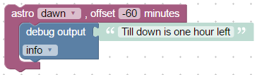

如您所见，偏移量也可以为负数，以指定占星事件之前的时间。

&nbsp;

### 命名计划


此块与[日程](#schedule)相同，但可以通过字符串设置 CRON 规则并可以停止调度。

您可以指定此计划块的唯一名称，然后使用 [明确的时间表](#clear-schedule) 将其清除。

以下是可配置闹钟的示例：


```xml 
<xml xmlns="http://www.w3.org/1999/xhtml">
  <block type="comment" id="QWp.l96v1;-4{x)j5K5y" x="38" y="13">
    <field name="COMMENT">Configurable alarm. Set time as: hh:mm</field>
    <next>
      <block type="create" id="5*XX`C;PgnU(q#Nk~D,o">
        <field name="NAME">alarmTime</field>
        <statement name="STATEMENT">
          <block type="on_ext" id="ot:9oFMh.(c)sxkufTxA">
            <mutation items="1"></mutation>
            <field name="CONDITION">ne</field>
            <field name="ACK_CONDITION"></field>
            <value name="OID0">
              <shadow type="field_oid" id="qV#=^mz,%qxL#}VsA)3C">
                <field name="oid">javascript.0.alarmTime</field>
              </shadow>
            </value>
            <statement name="STATEMENT">
              <block type="schedule_clear" id="ukGIQYyTpip_9!1H_xnN">
                <field name="NAME">alarm</field>
                <next>
                  <block type="schedule_create" id=")^!A|k+`1=[pFp(S-*sw">
                    <field name="NAME">alarm</field>
                    <value name="SCHEDULE">
                      <shadow type="field_cron" id="uSka7fK[T7j0m_4!4+fO">
                        <field name="CRON">* * * * *</field>
                      </shadow>
                      <block type="procedures_callcustomreturn" id=")E!Ljg1z9iQ3)Nb#CX~n">
                        <mutation name="time to CRON">
                          <arg name="time"></arg>
                        </mutation>
                        <value name="ARG0">
                          <block type="on_source" id="qs+k30Lnd1V(BSNs{}P!">
                            <field name="ATTR">state.val</field>
                          </block>
                        </value>
                      </block>
                    </value>
                    <statement name="STATEMENT">
                      <block type="debug" id="7arB5vcx^ci2Un#}TLKh">
                        <field name="Severity">log</field>
                        <value name="TEXT">
                          <shadow type="text" id="N;`AY!p#T_do@vP_OQr9">
                            <field name="TEXT">Wake up!</field>
                          </shadow>
                        </value>
                      </block>
                    </statement>
                  </block>
                </next>
              </block>
            </statement>
          </block>
        </statement>
      </block>
    </next>
  </block>
  <block type="procedures_defcustomreturn" id="_*_L4XpCr!7eLsYWS(R(" x="38" y="337">
    <mutation statements="false">
      <arg name="time"></arg>
    </mutation>
    <field name="NAME">time to CRON</field>
    <field name="SCRIPT">dmFyIHBhcnRzID0gdGltZS5zcGxpdCgnOicpOwovLyBpZiBpdCBpcyBDUk9OCmlmIChwYXJ0cy5sZW5ndGggPT09IDEpIHJldHVybiB0aW1lOwpyZXR1cm4gcGFydHNbMV0gKyAnICcgKyBwYXJ0c1swXSArICcgKiAqIConOw==</field>
    <comment pinned="false" h="80" w="160">Describe this function...</comment>
  </block>
</xml>
```

&nbsp;

### 清除时间表


使用此功能块，您可以清除命名计划。如果您再次定义命名而不清除它，旧的仍将处于活动状态。

请参阅[命名时间表](#named-schedule)中的示例

&nbsp;

### CRON 对话框


从对话框创建 CRON 规则。这个块可以用[命名时间表](#named-schedule)连接。


```xml 
<xml xmlns="http://www.w3.org/1999/xhtml">
  <block type="comment" id="]aB;GhQJvYrr~:H4Ft9l" x="63" y="38">
    <field name="COMMENT">Every 0th minute every hour</field>
    <next>
      <block type="schedule_create" id="?}upFtiA@CE_Gd)SmDo|">
        <field name="NAME">schedule</field>
        <value name="SCHEDULE">
          <shadow type="field_cron" id="1Ag|noK^~u]GFEW/(lb)">
            <field name="CRON">* * * * *</field>
          </shadow>
          <block type="field_cron" id="phjg#B~@BJTO9i[HmZ4O">
            <field name="CRON">0 * * * *</field>
          </block>
        </value>
        <statement name="STATEMENT">
          <block type="debug" id="Lv[a}BtvBDO-2Lt,s+z4">
            <field name="Severity">log</field>
            <value name="TEXT">
              <shadow type="text" id="evxnn0R1(AC^Y_U`oT_a">
                <field name="TEXT">It is exactly</field>
              </shadow>
              <block type="text_join" id="6!2uB_db8.g}63I{^e}#">
                <mutation items="3"></mutation>
                <value name="ADD0">
                  <block type="text" id="HH((bCdxr?A5)8Svuo6(">
                    <field name="TEXT">It is exactly </field>
                  </block>
                </value>
                <value name="ADD1">
                  <block type="time_get" id="7{BBfF0jmKD[qX,y6voK">
                    <mutation format="false" language="false"></mutation>
                    <field name="OPTION">h</field>
                  </block>
                </value>
                <value name="ADD2">
                  <block type="text" id="edML0zJ2V9kN}5/DLdS5">
                    <field name="TEXT"> o'clock</field>
                  </block>
                </value>
              </block>
            </value>
          </block>
        </statement>
      </block>
    </next>
  </block>
</xml>
```

&nbsp;

### CRON 规则
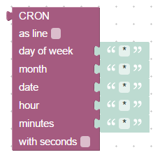

结合来自不同部分的 CRON 规则。

您可以将规则显示为块或行：


使用附加参数“with seconds”，您也可以为 CRON 规则指定秒数


可以使用此块（如 [CRON 对话框](#cron-dialog)) 仅适用于 [命名计划](#named-schedule) 块。

&nbsp;

&nbsp;

## 超时
### 延迟执行


使用此块，您可以执行延迟某个时间（以毫秒为单位）的其他块。
如果您知道 Javascript，它与 setTimeout 的功能相同。

块中没有“暂停”，但你可以使用这个块来模拟暂停。如果您放置所有块，则必须在暂停之后执行，您将获得与暂停相同的效果。

另一个功能是使用变量设置间隔，只需将“ms”替换为预定义变量：

每个延迟执行都可以有一个唯一的名称。它可以被其他块取消。 [清除延迟执行](#clear-delayed-execution)


```xml 
<xml xmlns="http://www.w3.org/1999/xhtml">
  <block type="debug" id=":6GZ!E*FHy@vPKKl{`hV" x="487" y="163">
    <field name="Severity">log</field>
    <value name="TEXT">
      <shadow type="text" id="LV!-dx[I(8bAu(_kcG.U">
        <field name="TEXT">Make a pause 5 seconds</field>
      </shadow>
    </value>
    <next>
      <block type="timeouts_settimeout" id="~?BW3eBK_t:TzNk}x9l3">
        <field name="NAME">timeout</field>
        <field name="DELAY">5000</field>
        <statement name="STATEMENT">
          <block type="debug" id="glbs:mQxsDfEieLaru!0">
            <field name="Severity">log</field>
            <value name="TEXT">
              <shadow type="text" id="_7T9e{FEJTWcpLl*BltU">
                <field name="TEXT">After pause</field>
              </shadow>
            </value>
          </block>
        </statement>
      </block>
    </next>
  </block>
</xml>
```

&nbsp;

### 清除延迟执行


此块用于按名称取消运行延迟。典型用途是模拟运动检测场景。
通过第一次动作，灯应亮起，在最后一次动作后 30 秒后，灯应熄灭。

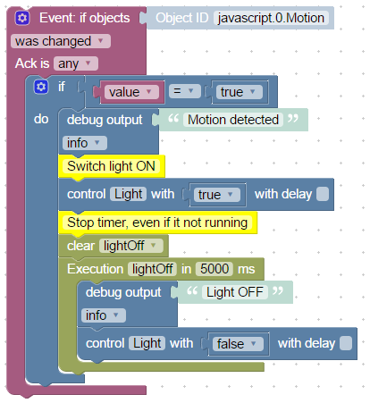

```xml 
<xml xmlns="http://www.w3.org/1999/xhtml">
  <block type="on_ext" id="+nZ`H6mh/;g(e3u,t;wJ" x="163" y="12">
    <mutation items="1"></mutation>
    <field name="CONDITION">ne</field>
    <field name="ACK_CONDITION"></field>
    <value name="OID0">
      <shadow type="field_oid" id="{mRcPH:!k^_5q-hwg1q%">
        <field name="oid">node-red.0.javascript.0.Motion</field>
      </shadow>
    </value>
    <statement name="STATEMENT">
      <block type="controls_if" id="]lX4.m?HnwXigM.6wY/D">
        <value name="IF0">
          <block type="logic_compare" id="s0DHFun9e*,c3AawmP_~">
            <field name="OP">EQ</field>
            <value name="A">
              <block type="variables_get" id="g}IH`Bx0T(mkht8~{Ul0">
                <field name="VAR">value</field>
              </block>
            </value>
            <value name="B">
              <block type="logic_boolean" id="Meek9{gS-NOR?|(fgbVg">
                <field name="BOOL">TRUE</field>
              </block>
            </value>
          </block>
        </value>
        <statement name="DO0">
          <block type="debug" id=":6GZ!E*FHy@vPKKl{`hV">
            <field name="Severity">log</field>
            <value name="TEXT">
              <shadow type="text" id="LV!-dx[I(8bAu(_kcG.U">
                <field name="TEXT">Motion detected</field>
              </shadow>
            </value>
            <next>
              <block type="comment" id="6_T-s#wApgZhu0+4uEk}">
                <field name="COMMENT">Switch light ON</field>
                <next>
                  <block type="control" id="fxgT@s0r?[`LJIsqR~M_">
                    <mutation delay_input="false"></mutation>
                    <field name="OID">javascript.0.Light</field>
                    <field name="WITH_DELAY">FALSE</field>
                    <value name="VALUE">
                      <block type="logic_boolean" id="0mgo#`N%Zm{MTELxw%~0">
                        <field name="BOOL">TRUE</field>
                      </block>
                    </value>
                    <next>
                      <block type="comment" id="rZ^o06`}^uFftKj2oYvE">
                        <field name="COMMENT">Stop timer, even if it not running</field>
                        <next>
                          <block type="timeouts_cleartimeout" id="#H#~HxipC8_-/{%,2R1P">
                            <field name="NAME">lightOff</field>
                            <next>
                              <block type="timeouts_settimeout" id="~?BW3eBK_t:TzNk}x9l3">
                                <field name="NAME">lightOff</field>
                                <field name="DELAY">5000</field>
                                <statement name="STATEMENT">
                                  <block type="debug" id="glbs:mQxsDfEieLaru!0">
                                    <field name="Severity">log</field>
                                    <value name="TEXT">
                                      <shadow type="text" id="_7T9e{FEJTWcpLl*BltU">
                                        <field name="TEXT">Light OFF</field>
                                      </shadow>
                                    </value>
                                    <next>
                                      <block type="control" id="McdOD=k4)MlO42RVgB~r">
                                        <mutation delay_input="false"></mutation>
                                        <field name="OID">javascript.0.Light</field>
                                        <field name="WITH_DELAY">FALSE</field>
                                        <value name="VALUE">
                                          <block type="logic_boolean" id="XLHrXB)/|dqGlh,nXl^[">
                                            <field name="BOOL">FALSE</field>
                                          </block>
                                        </value>
                                      </block>
                                    </next>
                                  </block>
                                </statement>
                              </block>
                            </next>
                          </block>
                        </next>
                      </block>
                    </next>
                  </block>
                </next>
              </block>
            </next>
          </block>
        </statement>
      </block>
    </statement>
  </block>
</xml>
```

&nbsp;

### 间隔执行


此块允许您定期执行某些操作。当然有一个 CRON 块，但是 CRON 块的最小间隔是一秒。
该块可以以毫秒为单位执行操作。

如果您将间隔设置得太小（低于 100 毫秒），则间隔会更大。

与超时块类似，您也可以设置唯一的间隔名称。

&nbsp;

### 按间隔停止执行


借助此块，您可以按其名称定期取消间隔块的执行。

&nbsp;

&nbsp;

##逻辑
### If else 阻塞
### 比较块
### 逻辑与/或块
### 否定块
### 逻辑值 TRUE/FALSE
### 零块
### 测试块
&nbsp;

&nbsp;

## 循环
###重复N次
### 重复
＃＃＃ 数数
### 对于每个
### 跳出循环
&nbsp;

&nbsp;

＃＃ 数学
### 数值
### 算术运算 +-*/^
### 平方根、绝对值、-、ln、log10、e^、10^
### Sin，cos，tan，asin，acos，atan
### 数学常数：pi, e, phi, sqrt(2), sqrt(1/2), infinity
### 是偶数、奇数、素数、整数、正数、负数、除以
### 按值修改变量（加号或减号）
### 圆形、地板、单元格值
### 对值列表的操作：sum、min、max、average、median、modes、deviation、random item
### 模数
### 通过最小值和最大值限制某些值
### 0到1的随机值
### 最小值和最大值之间的随机值
&nbsp;

&nbsp;

＃＃ 身体
＃＃＃ 字符串值
### 连接字符串
### 将字符串附加到变量
### 字符串长度
### 字符串是否为空
### 在字符串中查找位置
### 获取字符串中特定位置的符号
### 获取子字符串
### 转换为大写或小写
### 修剪字符串
&nbsp;

&nbsp;

## 列表
### 创建空列表
### 使用值创建列表
### 创建N次具有相同值的列表
### 获取列表长度
### 列表为空
### 查找列表中项目的位置
### 获取列表中的项目
### 设置列表中的项目
### 获取列表的子列表
### 将文本转换为列表，反之亦然
&nbsp;

&nbsp;

＃＃ 颜色
### 颜色值
### 随机颜色
### RGB 颜色
###混合颜色
&nbsp;

&nbsp;

## 变量
### 设置变量的值


要使用此块，您应该了解基本的编程规则：如何使用变量。

使用此块，您可以写入全局（在此脚本中随处可见）变量并使用它来存储一些值。如果变量不存在，它将自动声明。

此块可以创建新变量或使用现有变量。


这段代码：


```xml 
<block xmlns="http://www.w3.org/1999/xhtml" type="variables_set" id="ch{H@omhfzI(QA{syxAG" x="212.99999999999977" y="37.99999999999994">
  <field name="VAR">item</field>
  <value name="VALUE">
    <block type="math_number" id="SbmD7,uR:hMW!(P%IZRc">
      <field name="NUM">0</field>
    </block>
  </value>
</block>
```

只做这个：

```javascript
var item;
item = 0;
```

&nbsp;

### 获取变量的值
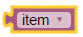

此块获取变量的值。您可以创建一个新的或使用现有的。


触发块有一个例外[状态变化触发](#trigger-on-states-change) 和[状态变化触发](#trigger-on-state-change)。
在这些块内部变量“值”还存在，但无论如何要读取它们的值，您必须将变量重命名为值然后使用它。


&nbsp;

&nbsp;

＃＃ 职能
### 从没有返回值的块创建函数
### 从具有返回值的块创建函数
###函数中的返回值
### 创建没有返回值的自定义函数
### 创建带有返回值的自定义函数
### 调用函数