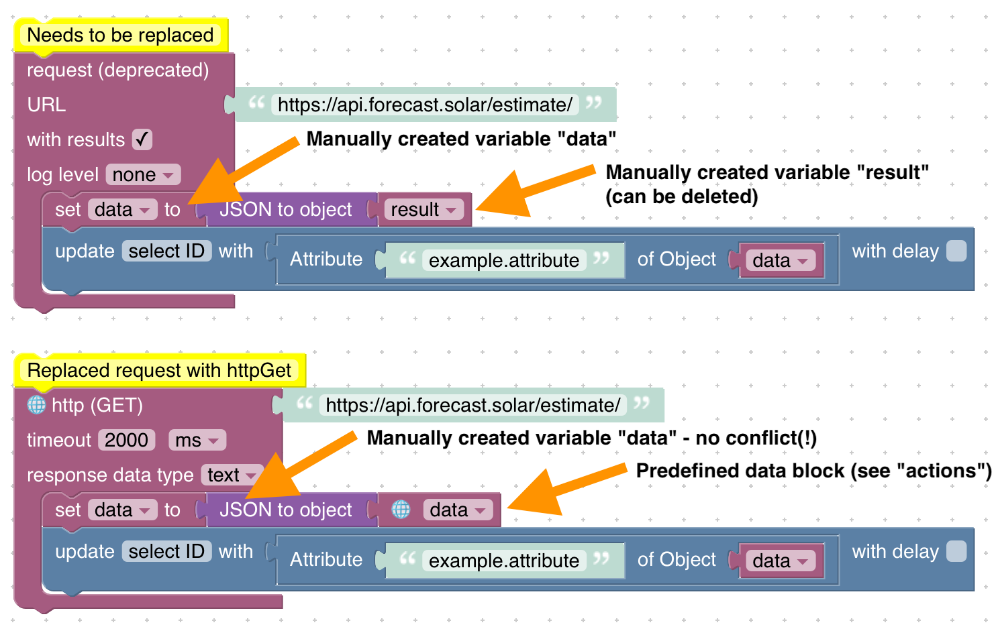

# 升级指南
## 脚本文件系统镜像的禁止目录
**自 JavaScript 适配器 v5.5.0 版本起**，以下位置（相对于 ioBroker 基本目录，通常为 `/opt/iobroker`）不再允许使用：

* ioBroker 基本目录本身及其上级目录！
* `./iobroker-data` 本身，自定义子目录（选择一个与任何适配器都不重叠的名称！）
* `./iobroker-data/backup-objects` 或以下任何内容
* `./iobroker-data/files` 或以下任何内容
* `./iobroker-data/backitup` 或以下任何内容
* `./backups` 或以下任何内容
* `./node_modules` 或以下任何内容
* `./log` 或以下任何内容

脚本文件系统镜像功能会将脚本的所有源文件存储在您的文件系统中，并允许您在网页编辑器之外，使用您喜欢的脚本编辑器编辑这些文件。所有更改都会双向同步。

启用脚本文件系统镜像时，请务必创建一个**专用的新目录**，**切勿**使用包含其他内容的现有目录。

另请确保没有其他脚本或进程会修改所提供目录中的文件，以避免访问问题。

所有位置都必须对“iobroker”用户具有写入权限！

同步是双向的，包括删除操作：**当一个文件夹从镜像目录中消失时，其中的脚本也会从 ioBroker 数据库中删除。** 因此，任何其他写入该目录的操作——例如备份作业、清理任务或部署——都可能删除您的脚本。只有当整个镜像目录无法访问时（例如，由于共享未挂载），脚本才会被保留，并在下次启动时重新写入该目录。

## 向 httpGet 发送请求
**自 JavaScript 适配器 v8.0.0 版本起**，`request` 包已被弃用，在脚本中使用该包会引发警告。

JavaScript 适配器需要在某个版本中移除该包。

为了尽可能简化迁移过程，沙箱提供了一个新的函数来请求 HTTP 资源。

### JavaScript
示例代码：

```js
const request = require('request');

schedule('*/30 * * * *', () => {
    const options = ;

    request({ url: 'https://api.forecast.solar/estimate/', method: 'GET' }, (error, response, body) => {
        if (!error && response.statusCode == 200) {
            const resObj = JSON.parse(body);

            // ...
        }
    });
});
```

迁移：

1. 移除对 `request` 包的导入
2. 使用原生方法 `httpGet`（详情请参阅文档）
3. 更新回调函数的参数
4. 将 `body` 替换为 `response.data`

```js
schedule('*/30 * * * *', () => {
    httpGet('https://api.forecast.solar/estimate/', (err, response) => {
        if (err) {
            console.error(err);
        } else if (response.statusCode == 200) {
            const resObj = JSON.parse(response.data);

            // ...
        }
    });
});
```

### Blockly
- `request` 代码块仅支持 HTTP GET 请求（不支持其他请求方法） - 请将该代码块替换为 `http (GET)`
- 之前需要创建一个名为 `result` 的自定义变量来使用响应结果。现在不再需要这样做了。请删除该变量，并使用专用代码块来处理结果参数（例如在触发器代码块中）。

