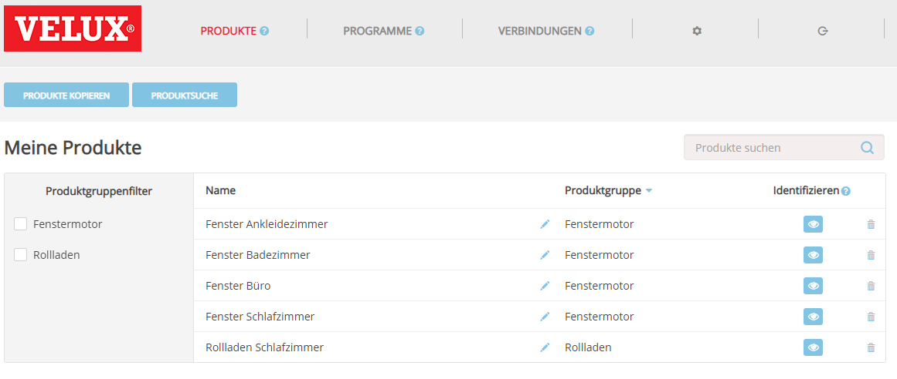
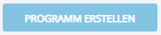
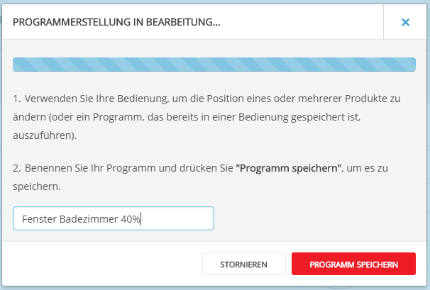
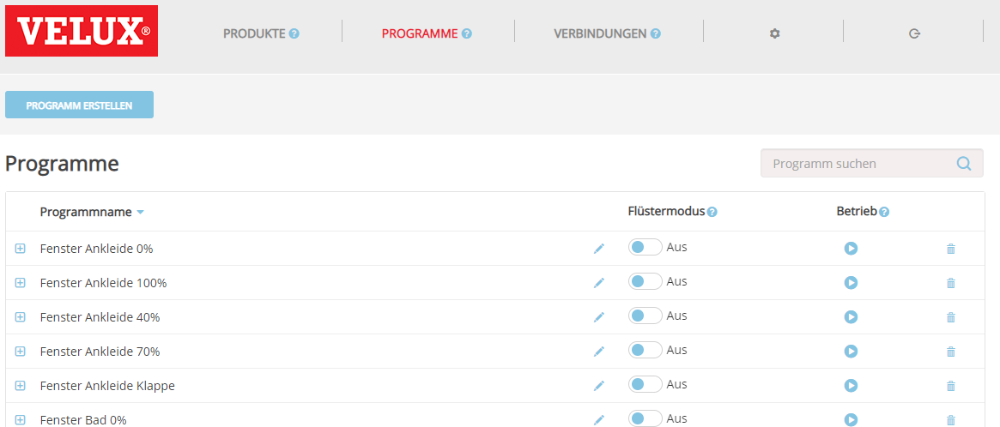
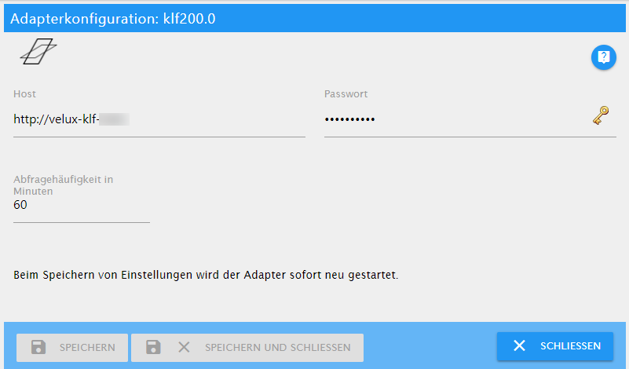

# KLF-200 适配器文档
该适配器用于控制 VELUX® KLF-200 接口。此适配器不是威卢克斯官方产品，也不是拥有威卢克斯产品的公司认可的。

该适配器的主要用途是控制电动天窗和/或电动百叶窗或百叶窗。
但是，KLF-200 接口可以连接其他设备，如灯具、开关、百叶窗等。
我没有设计适配器来使用这些设备。因此，这些设备也可能由该适配器控制。

该适配器可与 KLF-200 接口的内部 REST API 配合使用，您无需连接输入或输出，尽管仍然可以并行使用它们。

---

## 准备好你的 KLF-200 接口
为了使用这个适配器，您必须将您的 KLF-200 盒子设置为**接口模式**。如果您将盒子用作中继器，则它不起作用。

> 有关以下任务的详细说明，请参阅随包装盒提供的手册。
> > 假设您已在网络浏览器中成功登录您的盒子。

### 设置产品
您想使用此适配器控制的任何产品都必须在“我的产品”页面上注册。
您可以通过以下任一方式注册新产品

- 从另一个遥控器复制
- 搜索产品

注册所有产品后，您应该会看到如下列表：



###设置场景
要录制场景，请单击按钮



这将打开*正在进行的程序创建*窗口。现在使用产品随附的遥控器进行更改，例如将窗口打开 40%。然后输入程序的名称并单击*保存程序*。



> 提示： > - 以产品和打开程度命名您的程序，例如窗户浴室 40%。但是，适配器不使用任何命名约定。
> - 如果您的窗户是关闭的，则从 100% 的开度开始，然后随着每个附加程序下降，直到达到 0%。
> - 您最多可以在盒子中存储 32 个程序。因此请计划好您的步数，因为 30% 或 40% 打开窗口之间没有真正的区别。

当您完成录制节目时，您将获得如下列表：



### 设置连接
最后一步是可选的。如果您不使用输入和输出线，您可能已经注意到盒子上的小 LED 一直在闪烁。要摆脱烦人的闪烁，您需要设置至少一个连接。

您只需将其设置在盒子中，您无需连接任何东西！随便挑。

---

## 配置适配器


＃＃＃ 主持人
KLF-200 接口的主机名。这与您在网络浏览器的地址栏中输入以连接到您的盒子的地址相同。

＃＃＃ 密码
连接到 KLF-200 接口所需的密码。它与您在连接时在网络浏览器中使用的相同。

> KLF-200 的默认密码是`velux123`，但无论如何你都应该更改它！

### 以分钟为单位的查询频率
<span style="color: #ff0000"><strong><em>此选项计划在未来的版本中使用。如果要重新加载配置，则必须重新启动适配器。</em></strong></span>

适配器从 KLF-200 界面重新加载配置的分钟数。

---

## 使用适配器
适配器从 KLF-200 接口读取元数据后，您会在对象树中发现以下状态：

设备 |频道 |状态 |数据类型 |说明 --- | --- | --- | --- | --- 产品 | | | | KLF-200 产品列表中的每个产品都有一个子条目。
产品 | |产品发现 |价值 |列表中的产品数量。只读。
产品 | 0..n |类别 |正文 |产品分类。只读。
产品 | 0..n |水平 |水平 |产品的当前状态 设置此值以便执行相应的场景。读写。
产品 | 0..n |场景计数 |价值 |使用产品的场景数量。只读。
场景 | | | | KLF-200 产品列表中的每个产品都有一个子条目。
场景 | |场景发现 |价值 |列表中的场景数。只读。
场景 | 0..n |产品数量 |价值 |此场景中的产品数量。只读。
场景 | 0..n |运行 | button.play |指示场景是否正在运行。设置此值以运行场景。读写。
场景 | 0..n |无声 |指标.静音 |指示场景是否将以安静模式运行（如果场景的产品支持）。只读。

> **重要** > > 通道中使用的 ID 是来自 KLF-200 接口的 ID。如果您更改 KLF-200 中的产品列表或程序列表，ID 可能会更改。

要运行场景，您可以将场景的 `run` 状态设置为 `true` 或将产品的 `level` 状态设置为与将产品设置为该级别的场景对应的值。

＃＃＃ 例子
假设您的浴室窗户位于 `0` 频道上。他们在 `10` 频道上有一个场景，将浴室窗户打开 40%。

```javascript
// Variant 1: Open the bathroom window at 40% using the scenes run state:
setState('klf200.0.scenes.10.run', true);
/*
    The following will happen:
    1. Your window will start to move to 40% opening level.
    2. After your window has stopped, klf200.0.scenes.10.run will be set to 'false' again.
    3. klf200.0.products.0.level will be set to 40%.
*/

// Variant 2: Open the bathroom window at 40% using the products level state:
setState('klf200.0.products.0.level', 40);
/*
    The following will happen:
    1. Your window will start to move to 40% opening level.
    2. klf200.0.scenes.10.run will be set to true.
    3. After your window has stopped, klf200.0.scenes.10.run will be set to 'false' again.
*/

// What happens, if we don't have a scene for that level?
setState('klf200.0.products.0.level', 41);
/*
    The following will happen:
    1. Your window won't move at all!
    2. klf200.0.products.0.level will be reset to the previous value, e.g. 40
*/

```

---

## 已知限制
适配器使用盒子 Web 界面使用的内部 REST API 控制 KLF-200。
虽然我们只使用 API 的一个子集，但还是有一些限制：

- 适配器无法读取当前窗口的开度。如果您使用遥控器控制它或由于下雨而关闭它，适配器将不会知道它，它仍然会显示最后一个已知值。
- KLF-200 界面限制为最多 32 个场景。
- 适配器不知道动作何时结束。状态保持“真”至少 30 秒。
- 不要过快地一个接一个地执行场景。然后 KLF-200 可以报告错误。 （您可以在日志中找到错误。）

---

VELUX 和 VELUX 标志是 VKR Holding A/S 的注册商标。

## Changelog

#### 0.9.5
* (Michael Schroeder) Bug fixes

#### 0.9.4
* (Michael Schroeder) Compatible to Admin 3, add documentation

#### 0.9.0
* (Michael Schroeder) Initial public beta release

#### 0.0.1
* (Michael Schroeder) Initial developer release

## License
The MIT License (MIT)

Copyright (c) 2018 Michael Schroeder <klf200@gmx.de>

Permission is hereby granted, free of charge, to any person obtaining a copy
of this software and associated documentation files (the "Software"), to deal
in the Software without restriction, including without limitation the rights
to use, copy, modify, merge, publish, distribute, sublicense, and/or sell
copies of the Software, and to permit persons to whom the Software is
furnished to do so, subject to the following conditions:

The above copyright notice and this permission notice shall be included in
all copies or substantial portions of the Software.

THE SOFTWARE IS PROVIDED "AS IS", WITHOUT WARRANTY OF ANY KIND, EXPRESS OR
IMPLIED, INCLUDING BUT NOT LIMITED TO THE WARRANTIES OF MERCHANTABILITY,
FITNESS FOR A PARTICULAR PURPOSE AND NONINFRINGEMENT. IN NO EVENT SHALL THE
AUTHORS OR COPYRIGHT HOLDERS BE LIABLE FOR ANY CLAIM, DAMAGES OR OTHER
LIABILITY, WHETHER IN AN ACTION OF CONTRACT, TORT OR OTHERWISE, ARISING FROM,
OUT OF OR IN CONNECTION WITH THE SOFTWARE OR THE USE OR OTHER DEALINGS IN
THE SOFTWARE.

------------------------------------------------------------------------------

VELUX and the VELUX logo are registered trademarks of VKR Holding A/S.