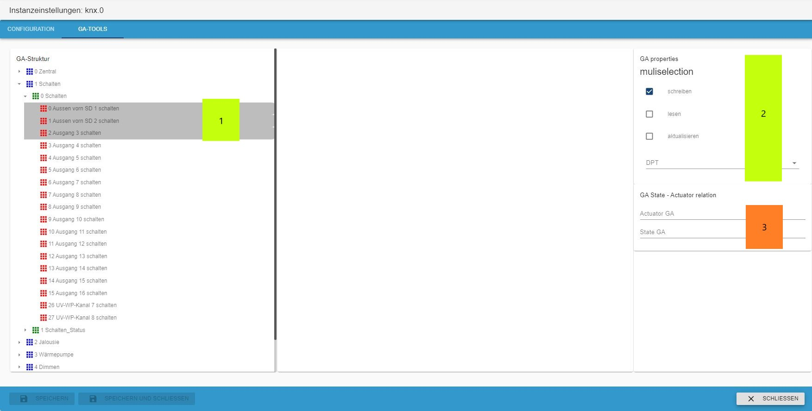

# IoBroker.knx
＃＃＃＃ 表中的内容
* [说明](#description)
* [功能](#features)
* [适配器配置](#adapter-configuration)
    * [安装许可证](#install-the-license)
    * [配置界面](#configuration-interface)
    * [对象](#objects)
    * [用法](#用法)
    * [数据点类型 (DPT)](#data-point-types-dpt)
    * [导入的工作原理](#how-the-import-works)
    * [问题的避免](#avoidance-of-problems)
* [GA-工具](#ga-tool)
* [计划功能](#planned-features)
* [更新日志](#changelog)

＃＃ 描述
en: 此适配器允许从 ETS 导入 knxproj 文件。它生成 KNX-group 地址和 ioBroker 之间的转换，并将设备放入房间（尤其是 MobileUI）。

如：[Установка и базовая настройка адаптера](docs/ru/README.md)

它连接到标准 KNX/LAN 网关。

**注意：随着更改为 KNX-Adapter 2.x 版，许可已更改。您可以从 [https://iobroker.net](https://iobroker.net/)** 获取新许可证

**您还应该将 iobroker js-controller 和 admin 更新到最新版本。**

开始之前： com.Objects 的每个 DPT 都应该在您的 ETS 项目中设置。每个设备都应分类到您的设施结构中。

＃＃ 特征：
* 导入 `knxproj` 文件
* 生成类似 ETS 的对象结构
* 寻找并结合行为通道和状态通道（启发式）
* 在开始时更新所有状态
* 向 KNX-Bus 发出 READ，同时写入状态对象
* 使用 GA-Tools 编辑和修改 GA 对象
* 使用 GA-Tools 编辑和修改状态-行为关系

##适配器配置
安装此适配器后，打开适配器配置。

###安装许可证
第一步是申请许可证。如果您尚未安装许可证，则应用 500 个数据点。

* (1) 显示您的系统 ID，您需要它来获取许可证
* (2) 单击此处申请您的许可证

如果您已经在 [https://iobroker.net](https://iobroker.net/) 下创建了一个新许可证，那么您可以将其粘贴到 (2) 中，或者您可以通过单击 (1) 直接在线获取它

如果您点击了 (1) 输入您的 iobroker.net 帐户登录。

如果您的数据正确，您将看到您获得的所有许可证。选择您要使用的那个。

如果这是成功的，保存它。

就这样。单击此页面底部的按钮进行保存。

###配置界面

1. KNX-Gateway IP：KNX-LAN网关的IPv4。
2. KNX-Gateway 端口：默认为 3671 端口。
3.物理地址：iobroker knx实例的物理地址**！重要：这不是物理。 LAN 网关的地址 !** 并且不能以 0 结尾
4. KNX 每秒包裹数：这限制了包裹速率。如果 KNX Lan 网关重新连接很多或暂时无法访问，则降低此速率。
5.本地iobroker IP：选择适配器将绑定的IP/接口
6. loglevel：通常为“Info”级别，用于调试增加级别。
7. 只导入新的数据点：这是默认启用的。在禁用新 GA 的情况下，将生成并重新创建现有的 GA。
8. 按钮上传文件：拖放可用在这里或单击文件选择器对话框。您可以在此处以“knxproj”格式上传 ETS 导出。

成功导入后，会出现一个对话框，显示导入对象的数量。现在按“保存并关闭”，适配器应该会启动。
在启动时，适配器读取带有 read-Flag 和 write-Flag 的所有组地址。这可能需要一段时间，并且会在您的 KNX 总线上产生高负载。但是您的 vis 中的值会在启动后更新。
上传受密码保护的文件尚不可用。

9. Host-ID：这是iobroker主机的特殊ID。此 ID 是生成和验证许可证所必需的
10. GA-Tools：快速更改 GA 的工具箱

### 对象
这是在 knx.0 下的组地址树，就像在您的 ETS 项目中一样。要修改属性，请使用 GA-Tool。

＃＃＃ 用法
如果适配器成功启动，您的数据点将可用于您喜欢做的任何事情。

### 数据点类型（DPT）
所有符合 KNX 协会“系统规范、互通、数据点类型”的 DPT 均可用。这意味着您可以获得两种类型的信息：1) 值或字符串 2) 逗号分隔值或值数组（目前我不知道什么是更好的处理方式）

例如，DPT5.001 被编码为 8 位无符号整数。这给出了一个单一的价值。 DPT3.007（控制调光）编码为 1Bit(Boolean)+3Bit(unsigned Int)。
这导致例如在像“0,5”这样的值中，其中“0”表示“减少”，“5”表示间隔数。

### 导入的工作原理
1. 读取所有通信对象引用（COR）：

    将 groupadressreference ID 与相应 COR 的 DPT 组合（如果存在）。

2.生成组地址结构（GAS）：

    根据 GAR ID 生成 GAS 并设置 DPT（如果尚未完成）

3. 查找状态 一个行为地址：

在 ets-exports 中没有关于状态和行为地址的信息。适配器解析所有“状态”或“状态”的 GA。如果有 2 个相似度超过 90% 的 GA，则一个地址是行为，另一个是状态。还会检查 DPT 是否相似。这就是为什么如果 GA 命名不一致，就不容易找到对等点。

4.设备配置中的标志检查：

   标志的处理方式如下：

    | KNX | | |经纪商| | |
    |-------|-----------|------------|----------|----------|-------------------------------------------------|
    |阅读 |写 |传输 |阅读 |写 |说明 |
    | - | - | - | - | - |该值将由 GroupValueRead| 更新 |
    | × | - | - | × | × |在此状态下发送任何值都会触发 GroupValueRead|
    | - | × | - | - | × |使用 GroupValueWrite| 将值写入 KNX |
    | - | - | × | × | - |状态值将由 GroupValueResponse 更新 |
    | × | - | × | × | × |在此状态下发送任何值都会触发 GroupValueRead|

6. 创建数据点对等点 (DPP)：

如果 GA、GAR 和 DPT 有效，则将创建 DPP。这是适配器正在使用的 DPP。
如果 GA 中缺少 DPT，因为找不到它，则不会创建 DPP。它可以用 GA-Tool 来完成。

7. 在适配器启动时：

所有标有“读取”标志的 GA 在开始时都会被检查。这会影响更高的总线流量。最后，所有状态都是最新的。

###避免问题
* 清洁 ETS 编程和更重要的清洁 ETS 编程和最重要的清洁 ETS 编程
* 分配 DPT！
* GA 名称的统一标记（例如“EG Wohnen Decke Licht schalten”和“EG Wohnen Decke Licht schalten status”）
* 避免特殊字符“,./;&%$§[]”（可能会导致gas产生问题）
* 检查 KNX/LAN GW 是否可达。如果不是，适配器会尝试连续连接。
* 正确选择物理地址（使用线路耦合器时很重要）。 ！！！注意：这里输入的物理地址不是局域网网关的地址，不能以0结尾！！！
* LAN接口的端口通常为3671
* 由于状态查询的可能性，必须注意一件事：必须确保ioBroker每秒生成的请求不超过40个，因为这些可以物理生成

  不能再通过适配器传递到网关。

## GA-工具
GA-Tool 可以轻松更改 GA 的属性。

1.显示GA树和选择的GA
2.在属性部分选择GA的名称
3.设置iobroker标志
4.设置GA DPT
5. 公认法案 GA
6. 公认状态 GA

1.显示状态-行为关系
2.如果关系存在，那么它可以被删除

如果不存在关系，则可以通过单击 (2) 为所选 GA (1) 创建一个新关系。
在对话框 (3) 中可以选择对等方吗

如果有更多 GA 需要更改属性，请使用多选。此功能仅适用于没有关系的 GA。

1. 选定的 GA
2.属性改变
3. 没有改变的可能

## 计划功能
* esf 导入
* GA-Mon 总线监控工具

<!-- 下一个版本的占位符（在行首）：

### __工作进行中__ -->

## Changelog
### 2.0.0 (2021-11-15) **Major release**

* Breaking change! => new license is neccessary V1 Licenses will not work => V1 business Licenses can changed to V2
* complete refactoring of knx-admin
* added Tool for handling GA in knx-admin
* fixed many bugs (in knx-stack, on importing ETS Projects, reconnect and timeouts)
* added new datapoint types
* added import till ETS V6
* changed license management

### 1.0.46 (2021-03-23)

* New admin GUI

### 1.0.45 (2021_03_22)

* import of ETS v5.7.5 projects

### 1.0.44 (2021_01_22)

* fixed act and state handling
* added some new datapoint types
* fix facility and room recognition and device allocation

### 1.0.42 (2020_09_03)

* Fixed problem with missing index_m.html

### 1.0.41

* fixed bug on GroupValue_Response event
* corrected connection to Gira GW

### 1.0.40

* fixed some import errors for ETS 5.7.x
* fixed bug on GroupValue_Response event

### 1.0.39

* fixed import error

### 1.0.38

* fixed some bugs on import
* show warning if import-file ist password protected

### 1.0.37 (2010-01-31)

* update for ETS 5.7.3 import

### 1.0.36 (2019-10-16)

* some bugs fixed

### 1.0.35 (2019-09-15)

* fixed permanent reconnects, if no traffic on knx-bus

### 1.0.34 (2019-09-15)

* changes on importer for detecting project-id

### 1.0.33 (2019-09-12)

* fixed bug while writing to bus
* added units to states
* fixed "read/write of undefined" error

### 1.0.32 (2019-09-03)

* updated importer for ETS V5.7.2, some changes in KNX-stack state-machine

### 1.0.31

* some fixes on ETS5.7.2 importer
* small changes in knx-stack statemachine
* added (again) phys address to admin config dialog
* fixed bug in deviceTree generation

### 1.0.30

* new Importer for ETS5.7.2 knxproj files
* extended accepted Data point types
* new adapter configuration menu
* implemented a switch for the user to decide to use "true" and "false" or "0" or "1" for binary values
* fixed bug in GroupValue_Read
* implemented a selector for local network interface for KNX to Gateway communication
* extended State Object for later features
* fixed some small other bugs

### 1.0.20

* fixed bug in handling KNX-data packages, which occurs periodical reconnects
* fixed bug in KNX-project file upload procedure

### 1.0.19

* reverted to true/false handling for DPT1.x

### 1.0.18

* fixed upload issue with ETS5.6.x project files
* switched values for "boolean" from 1 and 0 to true false 
* fixed recognition of role set for DPT1.x to switch
* fixed DPT16.xxx writing to KNX-Bus with values < 14Byte

### 1.0.17 (2018-08-16)

* Better state processing
* Add configurable package rate
* corrected Bug in "import only new objects"

### 1.0.15 (2018-07-18)

* change ChID on reconnect
* on Startup read wait for response of State channel or timeout

### 1.0.13 (2018-07-04)

* elimination of special signs while importing
* small bug-fixes

### 1.0.12 (2018-06-19)

* reduced and sorted log output
* small bug-fixes
* NEW Feature: request State/Val of stateObject from KNX-Bus

### 1.0.11 (2018-05-27)

* fixed DPT1 correcting value problem
* fixed reconnect problem
* other small optimizations and fixes

### 1.0.10 (2018-05-04)

* closing local port in case of undefined connection state
* added advanced debug-level via adapter-config
* many fixes

### 1.0.9 (2018-04-29)

* changed to state-wise processing
* fixed "disconnect-request"
* changed connection handling with knxd
* many small fixes

### 1.0.8 (2018-04-04)

* modified package queue
* fixed ACK if sending to KNX-Bus
* many small fixes

### 1.0.7 (2018-03-16)

* fixed Adapter-lock while uploading projects

### 1.0.6 (2018-03-11)

* fixed connection problem
* corrected package counter

### 1.0.5 (2018-03-01)

* fixed empty objects, related to DPT1 (error message \[object Object\] unknown Input value)
* fixed path variable
* fixed bug with GA's containing a "/" in the name (on proj-import)
* start implementing crosswise property update on corresponding DPT (on proj-import)

### 1.0.4 (2018-02-27)

* schema update for room enumeration coming up with ETS 5.6

### 1.0.2 (2018-02-27)

* kleine Fehler beseitigt

### 1.0.1 (2018-02-26)

* fixed certificate error

### 1.0.0 (2018-02-25)

* substitution of used KNX-stack with own from scratch build stack
* implemented full scale of DPT according to "System Specifications, Interworking, Datapointtypes" from KNX Association
* hardening connection handling for tunneling connections
* upgrade Adapter-configuration Interface to be ready with Admin3
* removed "Delay Slider" because of the new knx-stack
* many other small changes
* fixed post-comma values to scale-value of DPT
* implemented "add" mode for knxproject upload (existing Objects stay as they are, only new Objects where added)

### 0.8.6 (2017-06-17)

* some small bug-fixes
* insert slider to set a sendDelay for slow KNX/LAN Gateways to prevent connection loss

### 0.8.5 (2017-06-05)

* project loader rebuild, dpt13-fix

### 0.8.3 (2017-04-24)

* added act channel update of corresponding state
* fix bug in state-vis update
* optimized knxproj upload

### 0.8.2 (2017-02-26)

* implemented device-config parsing from knxproj
* better choice of state/val of DP objects

### 0.8.1 (2017-02-06)

* fixed DPT1 switch problem

### 0.8.0 (2017-02-xx) comming soon

### 0.7.3 (2016-12-22)

* (chefkoch009) more DPT's are supported
* faster Startup
* implemented generation of room list with device dependencies

### 0.7.2 (2016-11-20)

* (chefkoch009) added necessary dependencies

### 0.7.1 (2016-11-19)

* (chefkoch009) Support standard KNX/LAN Gateways.

### 0.7.0 (2016-10-13)

* (chefkoch009) Support of project export

### 0.6.0 (2016-07-20)

* (chefkoch009) redesign

### 0.5.0

*  (vegetto) include vis widget

#### 0.4.0

* (bluefox) fix errors with grunt

#### 0.2.0

* (bluefox) initial release

## License
To use this adapter in ioBroker you need to accept the source code license of the adapter. The source code of this adapter is available under the CC-NC-BY license.

Additionally you need a license to use the adapter. The license editions are available on https://iobroker.net/www/pricing

## License
The CC-NC-BY License (CC-NC-BY)

Copyright (c) 2016-2021 K.Ringmann <info@punktnetzwerk.net>

THE WORK IS PROVIDED UNDER THE TERMS OF THIS CREATIVE
COMMONS PUBLIC LICENSE ("CCPL" OR "LICENSE"). THE WORK IS PROTECTED BY
COPYRIGHT AND/OR OTHER APPLICABLE LAW. ANY USE OF THE WORK OTHER THAN AS
AUTHORIZED UNDER THIS LICENSE OR COPYRIGHT LAW IS PROHIBITED.

BY EXERCISING ANY RIGHTS TO THE WORK PROVIDED HERE, YOU ACCEPT AND AGREE
TO BE BOUND BY THE TERMS OF THIS LICENSE. TO THE EXTENT THIS LICENSE MAY
BE CONSIDERED TO BE A CONTRACT, THE LICENSOR GRANTS YOU THE RIGHTS
CONTAINED HERE IN CONSIDERATION OF YOUR ACCEPTANCE OF SUCH TERMS AND
CONDITIONS.

Read full license text in [LICENSE](LICENSE)