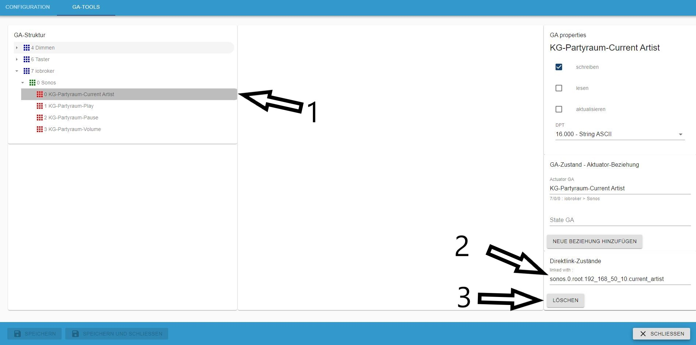

# IoBroker.knx
#### 目录
* [说明](#description)
* [要求](#requirements)
* [功能](#features)
* [安装](#安装)
* [适配器配置](#adapter-configuration)
* [安装许可证]（#install-the-license）
* [配置接口](#configuration-interface)
* [对象](#对象)
* [用法](#用法)
* [数据点类型 (DPT)](#data-point-types-dpt)
* [导入的工作原理](#how-the-import-works)
* [避免问题](#avoidance-of-problems)
* [GA-工具](#ga-tool)
* [将非 KNX 状态直接链接到 KNX 状态，反之亦然](#direct-link-non-knx-state-to-knx-vice-verse)
* [计划中的功能](#planned-features)
* [变更日志](#changelog)

＃＃ 描述
en：此适配器允许从 ETS 导入 `knxproj` 文件。它生成 KNX 组地址和 ioBroker 之间的转换，并将设备放入房间（尤其是 MobileUI）。

ru：[Установка и базовая настройка адаптера](docs/ru/README.md)

它连接到标准 KNX/LAN 网关。

**注意：随着 KNX-Adapter 版本 2.x 的变更，许可也发生了变化。您可以从 [https://iobroker.net](https://iobroker.net/) 获取新许可**

**您还应该将 iobroker js-controller 和 admin 更新到最新版本。**

开始之前：应在您的 ETS 项目中设置 com.Objects 的每个 DPT。应将每个设备分类到您的设施结构中。

＃＃ 要求
* 节点版本 >= 14.15.4
* 管理员版本 >= 5.2.0
* js-controller 版本 >=3.3.20

如果没有此要求，适配器将无法安装或无法正常工作。

＃＃ 特征
* 导入 `knxproj` 文件
* 生成类似 ETS 的对象结构
* 寻找并结合行为通道和状态通道（启发式）
* 开始时更新所有状态
* 无需云或互联网
* 在状态对象上写入时，向 KNX 总线发出读取操作
* 使用 GA-Tools 编辑和修改 GA 对象
* 使用 GA-Tools 编辑和修改状态-行为关系
* 新功能：允许非 KNX 状态直接链接（反之亦然）
* 新功能：适配器对 GroupValueRead 的响应与 directLink 连接的对象
* 新功能：导入受密码保护的项目文件（感谢 aKzenT）

＃＃＃安装
此适配器仅可通过 npm 安装。通过 GitHub 安装**不起作用**。

适配器配置
安装此适配器后，打开适配器配置。

安装许可证
第一步是应用许可证。如果您尚未安装许可证，则将应用 500 个数据点。

* (1) 显示您的系统 ID，您需要此 ID 才能获取许可证
* (2) 单击此处申请您的许可证

如果您已经根据[https://iobroker.net](https://iobroker.net/)创建了新许可证，则可以将其粘贴在（2）中，或者您可以通过点击（1）直接在线获取

如果您点击了（1），请输入您的 iobroker.net 账户登录信息。

如果您的数据正确，您将看到您获得的所有许可证。选择您想要使用的许可证。

如果成功，请保存。

就这样。点击本页底部的保存按钮。

### 配置接口

1. KNX-网关 IP：KNX-LAN 网关的 IPv4。
2. KNX-Gateway 端口：默认为端口 3671。
3. 物理地址：iobroker knx 实例的物理地址。**重要：这不是 LAN 网关的物理地址！** 并且不能以 0 结尾
4. 每秒 KNX 数据包数：限制数据包速率。如果 KNX Lan Gateway 重新连接次数过多或暂时无法访问，则降低此速率。
5. 本地 iobroker IP：选择适配器将绑定的 IP/接口
6.loglevel：通常为“Info”级别，为了调试可以增加该级别。
7. 仅导入新数据点：默认启用。如果禁用，将生成新的 GA 并重新创建现有的 GA。
8. 按钮上传文件：可在此处进行拖放，或单击文件选择器对话框。在这里，您可以以“knxproj”格式上传 ETS 导出文件。

成功导入后，对话框会显示导入对象的数量。现在按“保存并关闭”，适配器应启动。
启动时，适配器会读取所有具有读取标志和写入标志的组地址。这可能需要一段时间，并且可能会对您的 KNX 总线产生高负载。但启动后，vis 中的值会更新。
尚无法上传密码保护的文件。

9. Host-ID：这是 iobroker 主机的特殊 ID。此 ID 是生成和验证许可证所必需的
10. GA-Tools：快速变化的 GA 工具箱

### 对象
这是 knx.0 下的组地址树，类似于您的 ETS 项目中的组地址树。要修改属性，请使用 GA-Tool。

＃＃＃ 用法
如果适配器成功启动，您的数据点将可用于您喜欢做的一切。

### 数据点类型（DPT）
根据 KNX 协会的“系统规范、互通、数据点类型”，所有 DPT 均可用。这意味着您可以获得两种类型的信息：1) 值或字符串 2) 逗号分隔的值或值数组（目前我不知道哪种处理方式更好）

例如，DPT5.001 编码为 8 位无符号整数。这给出了一个值。DPT3.007（控制调光）编码为 1 位（布尔值）+3 位（无符号整数）。
例如，这些结果为“0,5”这样的值，其中“0”表示“减少”，“5”表示间隔数。

### 导入的工作原理
1. 读取所有通信对象引用（COR）：

将 groupadressreference ID 与相应 COR 的 DPT 相结合（如果存在）。

2.组地址结构（GAS）的生成：

根据 GAR ID 生成 GAS 并设置 DPT（如果尚未完成）

3. 认定某项行为涉及：

ets-exports 中没有关于 state 和 act 地址的信息。适配器解析所有“status”或“state”的 GA。如果有 2 个 GA 的相似度超过 90%，则一个地址将是 actor，另一个地址将是 state。还会检查 DPT 是否相似。这就是为什么如果 GA 命名不一致，就很难找到一对。

4.设备配置中的标志检查：

标志处理如下：

| KNX | KNX | KNX | ioBroker | ioBroker | |
    |-------|-------|----------|----------|----------|----------------------------------------------------------|
| 读 | 写 | 传输 | 读 | 写 | 解释 |
| - | - | - | - | - | 该值将由 GroupValueRead 更新 |
| x | - | - | x | x | 在此状态下发送任何值都会触发 GroupValueRead |
| - | x | - | - | x | 使用 GroupValueWrite 将值写入 KNX |
| - | - | x | x | - | 状态值将由 GroupValueResponse 更新 |
| x | - | x | x | x | 在此状态下发送任何值都会触发 GroupValueRead |

6. 创建数据点对等体（DPP）：

如果 GA、GAR 和 DPT 有效，则会创建 DPP。这些是适配器正在使用的 DPP。
如果 GA 中缺少 DPT（因为无法找到），则不会创建 DPP。可以使用 GA-Tool 完成。

7. 适配器启动时：

所有标有“已读”标志的 GA 都会在启动时进行检查。这可能会影响更高的总线流量。最后，所有状态都是最新的。

### 避免问题
* 清理 ETS 编程，更重要的是清理 ETS 编程，最重要的是清理 ETS 编程
* 分配 DPT！！
* GA 名称的统一标签（例如“EG Wohnen Decke Licht schalten”和“EG Wohnen Decke Licht schalten status”）
* 避免使用特殊字符“,./;&%$§[]”（可能会导致气体产生问题）
* 检查 KNX/LAN GW 是否可访问。如果不可访问，适配器将尝试持续连接。
* 正确选择物理地址（使用线路耦合器时很重要）。!!! 注意：此处输入的物理地址不是 LAN 网关的地址，并且不能以 0 结尾 !!!
* LAN接口的端口通常为3671
* 由于存在状态查询的可能性，必须注意一件事：必须确保 ioBroker 每秒生成的请求不超过 40 个，因为这些请求随后可能会在物理上生成

无法再通过适配器传递给网关。

## GA 工具
GA-Tool 可以轻松改变 GA 的属性。

1. 显示 GA 树和选定的 GA
2. 在属性部分中，选定 GA 的名称
3. 设置 iobroker 标志
4. 设置 GA DPT
5. 认可法案 GA
6. 认可的州 GA

1. 展示状态-行为关系
2. 如果关系存在，则可以将其删除

如果不存在关系，则可以通过单击 (2) 为所选 GA (1) 创建新关系。
在对话框 (3) 中，可以选择对等体

如果有多个 GA 需要更改属性，请使用多选。此功能仅适用于没有关系的 GA。

1. 选定的 GA
2. 要更改的属性
3. 不可能改变

### 将非 KNX 状态直接链接到 KNX 状态，反之亦然
自适配器版本 2.0.6 起，可以将非 KNX ioBroker 状态直接链接到 GA。这可用于将时间、日期、任何状态或信息应用于 KNX。（小提示：您可以将任何 IOT 组件直接链接到 KNX 中的 GA（例如，将 homematic 按钮链接到 KNX GA 或将 KNX 按钮传感器链接到您的 sonos 播放器））。可以使用 GroupValueRead 读取状态，如果状态发生变化，它将在 KNX 上自动更新。此外，如果您在 KNX 上进行更改，它将更新链接的非 KNX 物联网设备。

1. 选择要连接的 GA
2. 显示选定的 GA
3. 此 GA 必须具有 **write** 属性
4.选择一个有效的数据点类型（如果不匹配，则不起作用）
5. 不允许有行为-状态关系
6. 按钮选择要链接的非 KNX 对象

1. 选择要链接的非 KNX 对象
2.完成后点击确定

现在 KNX-GA **(1)** 直接与非 KNX iobroker **(2)** 链接。使用 **(3)** 您可以删除此关系。

## 计划中的功能
* esf-导入
* GA-Mon 总线监控工具

<!-- 下一版本的占位符（在行首）：

### **正在进行中** -->
## 异常和错误
**此适配器使用 Sentry 库自动向开发人员报告异常和代码错误。** 有关更多详细信息以及如何禁用错误报告的信息，请参阅[Sentry-插件文档](https://github.com/ioBroker/plugin-sentry#plugin-sentry)！从 js-controller 3.0 开始使用 Sentry 报告。

开发人员无法获取有关系统/配置/用户/环境的任何进一步特殊信息。如果未找到许可证，还会报告适配器版本和主机 ID。

##非常感谢您的支持和帮助
* 蓝狐
* foxriver76

## Changelog
### 2.0.30 (22.12.2024)
* fixed GUI errors, starting redesign GA-Tools

### 2.0.29 (11.12.2024)
* updated the adapter import schema for ETS 6.3.0
* nodejs >= 20 is required 

### 2.0.28
* Update license related data and fix package version

### 2.0.27 (02.05.2024)
* updated the adapter import schema for ETS 6.2.2
* fixed UTF-8 error

### 2.0.26 (28.03.2024)
* updated the adapter import schema for ETS 6.2.1
* nodejs >= 18 is required

### 2.0.25 (03.03.2024)
* updated the adapter import schema for ETS 6.2.0
* small bug-fixes

### 2.0.24 (24.11.2023)
* updated the adapter import schema for ETS 6.1.1

### 2.0.23 (11.10.2023)
* corrected wrong GW Port after adapter upgrade
* allow self-defined values for min and max
* some small other fixes

### 2.0.22 (04.07.2023)
* added import specification, solved problems in GaTools
    
### 2.0.21 (17.06.2023)
* fixed license handling

### 2.0.20 (16.06.2023)
* fixed license handling with js-controller Version > 5

### 2.0.19 (29.05.2023)
* added ETS V6.1.0 import
* required node version >= 16.13.1

### 2.0.18 (08.04.2023)
* fixed send-delay
* small changes

### 2.0.17 (14.10.2022)
* added ETSv6.0.6 import
* major changes in Adapter Config UI
* fixed change of port settings for LAN-GW

### 2.0.16 (04.09.2022)
* added ETSv6.0.5 import

### 2.0.15 (02.06.2022)
* fixed import error with extrem large KNX catalogue files
* fixed unrecognized connection breaks

### 2.0.14 (08.04.2022)
* added ETSv6.0.4 (override 6.0.3)
* small bugfixes

### 2.0.13 (12.03.2022)
* added ETSv5.7.7 import
* fixed "unknown value" bug
* some other small fixes

### 2.0.12 (25.02.2022)
* fixed handling of undefined DP
* updated the data point types
* fix warning with incompatible DPT in future
* the biggest issue of all: I get shocked because of the war in Ukraine. My thoughts are with the people of Ukraine, I am infinitely sorry for what is happening to them and their country. It is an inhuman shame.
* can't fix it, but I appeal to everyone: Be neighbors and not enemies. Respect the other and do not fight yourselves.

### 2.0.11
* fixed password handling for projects from upgraded ETS

### 2.0.10
* import of ETS6.0.2 projects **ETS6.0.1 not possible**
* bugfixes

### 2.0.9
* import password protected project files
* bug fixes

### 2.0.8
* fixed bug with unackn write
* fixed bug in linkedState

### 2.0.7
* fixed bug with unable to write on KNX

### 2.0.6
* fixed problem on ETSv6 import
* many small bugfixes
* implemented GA-Tools directLink feature

### 2.0.5

* fixed problem on ETSv4 import
* corrected some messages
* corrected DPT14.x min and max range

### 2.0.4

* fixed DPT9.xxx calculation
* implemented date-and-time DPT19.00x
* fixed confusing "no license error"
* small bugfixes

### 2.0.3 (2021-12-04)

* fixed counting 1st Datapoint
* automaticly remove old V1 license", preventing confusion after upgrade from V1 to V2

### 2.0.1

* fixed problem with license acceptance

### 2.0.0 (2021-11-15) **Major release**

* Breaking change! => new license is neccessary V1 Licenses will not work => V1 business Licenses can changed to V2
* complete refactoring of knx-admin
* added Tool for handling GA in knx-admin
* fixed many bugs (in knx-stack, on importing ETS Projects, reconnect and timeouts)
* added new datapoint types
* added import till ETS V6
* changed license management

### 1.0.46 (2021-03-23)

* New admin GUI

### 1.0.45 (2021_03_22)

* import of ETS v5.7.5 projects

### 1.0.44 (2021_01_22)

* fixed act and state handling
* added some new datapoint types
* fix facility and room recognition and device allocation

### 1.0.42 (2020_09_03)

* Fixed problem with missing index_m.html

### 1.0.41

* fixed bug on GroupValue_Response event
* corrected connection to Gira GW

### 1.0.40

* fixed some import errors for ETS 5.7.x
* fixed bug on GroupValue_Response event

### 1.0.39

* fixed import error

### 1.0.38

* fixed some bugs on import
* show warning if import-file ist password protected

### 1.0.37 (2010-01-31)

* update for ETS 5.7.3 import

### 1.0.36 (2019-10-16)

* some bugs fixed

### 1.0.35 (2019-09-15)

* fixed permanent reconnects, if no traffic on knx-bus

### 1.0.34 (2019-09-15)

* changes on importer for detecting project-id

### 1.0.33 (2019-09-12)

* fixed bug while writing to bus
* added units to states
* fixed "read/write of undefined" error

### 1.0.32 (2019-09-03)

* updated importer for ETS V5.7.2, some changes in KNX-stack state-machine

### 1.0.31

* some fixes on ETS5.7.2 importer
* small changes in knx-stack statemachine
* added (again) phys address to admin config dialog
* fixed bug in deviceTree generation

### 1.0.30

* new Importer for ETS5.7.2 knxproj files
* extended accepted Data point types
* new adapter configuration menu
* implemented a switch for the user to decide to use "true" and "false" or "0" or "1" for binary values
* fixed bug in GroupValue_Read
* implemented a selector for local network interface for KNX to Gateway communication
* extended State Object for later features
* fixed some small other bugs

### 1.0.20

* fixed bug in handling KNX-data packages, which occurs periodical reconnects
* fixed bug in KNX-project file upload procedure

### 1.0.19

* reverted to true/false handling for DPT1.x

### 1.0.18

* fixed upload issue with ETS5.6.x project files
* switched values for "boolean" from 1 and 0 to true false 
* fixed recognition of role set for DPT1.x to switch
* fixed DPT16.xxx writing to KNX-Bus with values < 14Byte

### 1.0.17 (2018-08-16)

* Better state processing
* Add configurable package rate
* corrected Bug in "import only new objects"

### 1.0.15 (2018-07-18)

* change ChID on reconnect
* on Startup read wait for response of State channel or timeout

### 1.0.13 (2018-07-04)

* elimination of special signs while importing
* small bug-fixes

### 1.0.12 (2018-06-19)

* reduced and sorted log output
* small bug-fixes
* NEW Feature: request State/Val of stateObject from KNX-Bus

### 1.0.11 (2018-05-27)

* fixed DPT1 correcting value problem
* fixed reconnect problem
* other small optimizations and fixes

### 1.0.10 (2018-05-04)

* closing local port in case of undefined connection state
* added advanced debug-level via adapter-config
* many fixes

### 1.0.9 (2018-04-29)

* changed to state-wise processing
* fixed "disconnect-request"
* changed connection handling with knxd
* many small fixes

### 1.0.8 (2018-04-04)

* modified package queue
* fixed ACK if sending to KNX-Bus
* many small fixes

### 1.0.7 (2018-03-16)

* fixed Adapter-lock while uploading projects

### 1.0.6 (2018-03-11)

* fixed connection problem
* corrected package counter

### 1.0.5 (2018-03-01)

* fixed empty objects, related to DPT1 (error message \[object Object\] unknown Input value)
* fixed path variable
* fixed bug with GA's containing a "/" in the name (on proj-import)
* start implementing crosswise property update on corresponding DPT (on proj-import)

### 1.0.4 (2018-02-27)

* schema update for room enumeration coming up with ETS 5.6

### 1.0.2 (2018-02-27)

* kleine Fehler beseitigt

### 1.0.1 (2018-02-26)

* fixed certificate error

### 1.0.0 (2018-02-25)

* substitution of used KNX-stack with own from scratch build stack
* implemented full scale of DPT according to "System Specifications, Interworking, Datapointtypes" from KNX Association
* hardening connection handling for tunneling connections
* upgrade Adapter-configuration Interface to be ready with Admin3
* removed "Delay Slider" because of the new knx-stack
* many other small changes
* fixed post-comma values to scale-value of DPT
* implemented "add" mode for knx project upload (existing Objects stay as they are, only new Objects where added)

### 0.8.6 (2017-06-17)

* some small bug-fixes
* insert slider to set a sendDelay for slow KNX/LAN Gateways to prevent connection loss

### 0.8.5 (2017-06-05)

* project loader rebuild, dpt13-fix

### 0.8.3 (2017-04-24)

* added act channel update of corresponding state
* fix bug in state-vis update
* optimized knxproj upload

### 0.8.2 (2017-02-26)

* implemented device-config parsing from knxproj
* better choice of state/val of DP objects

### 0.8.1 (2017-02-06)

* fixed DPT1 switch problem

### 0.8.0 (2017-02-xx) comming soon

### 0.7.3 (2016-12-22)

* (chefkoch009) more DPT's are supported
* faster Startup
* implemented generation of room list with device dependencies

### 0.7.2 (2016-11-20)

* (chefkoch009) added necessary dependencies

### 0.7.1 (2016-11-19)

* (chefkoch009) Support standard KNX/LAN Gateways.

### 0.7.0 (2016-10-13)

* (chefkoch009) Support of project export

### 0.6.0 (2016-07-20)

* (chefkoch009) redesign

### 0.5.0

*  (vegetto) include vis widget

#### 0.4.0

* (bluefox) fix errors with grunt

#### 0.2.0

* (bluefox) initial release

## License

For less than 500 data points, there is no need for registration or adding a license key.
If you have more than 500 data points, you need a license.
You can choose between yearly and permanent license.

To use this adapter in ioBroker, you need to accept the source code license of the adapter.
The source code of this adapter is available under the CC-NC-BY license.

Additionally, you need a license to use the adapter. The license editions are available on [https://iobroker.net/www/pricing](https://iobroker.net/www/pricing)

## License
The CC-NC-BY License (CC-NC-BY)

Copyright (c) 2016-2024 K.Ringmann <info@punktnetzwerk.net>

THE WORK IS PROVIDED UNDER THE TERMS OF THIS CREATIVE
COMMONS PUBLIC LICENSE ("CCPL" OR "LICENSE"). THE WORK IS PROTECTED BY
COPYRIGHT AND/OR OTHER APPLICABLE LAW. ANY USE OF THE WORK OTHER THAN AS
AUTHORIZED UNDER THIS LICENSE OR COPYRIGHT LAW IS PROHIBITED.

BY EXERCISING ANY RIGHTS TO THE WORK PROVIDED HERE, YOU ACCEPT AND AGREE
TO BE BOUND BY THE TERMS OF THIS LICENSE. TO THE EXTENT THIS LICENSE MAY
BE CONSIDERED TO BE A CONTRACT, THE LICENSOR GRANTS YOU THE RIGHTS
CONTAINED HERE IN CONSIDERATION OF YOUR ACCEPTANCE OF SUCH TERMS AND
CONDITIONS.

Read full license text in [LICENSE](LICENSE)