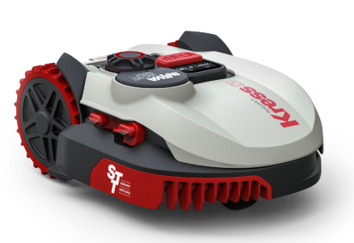

# IoBroker.kress
[德意志银行](README_de.md)

该适配器将 ioBroker 与您的 Kress 云支持连接 温度、割草时间、电池电量和从割草机读取的各种其他数据 该适配器可以控制割草机，您可以更改割草时间等配置参数。

＃＃ 安装
至少必须安装 Node 4.X.X，此适配器不再支持 Node 0.10 和 0.12。

## 设置
- 连接到割草机，在配置中从您的 worx 帐户输入电子邮件和密码。

## 第二台割草机
- 如果要集成两台割草机，则必须安装第二个实例，在配置割草机 0 中选择一个，在第二个割草机 1 中选择一个，依此类推。

＃＃ 注意
Bild-Quelle：https://www.kress-robotik.com/de/

## Changelog
### 2.5.5 (17.07.2018)
* (MeisterTR) initinal relase

## License
The MIT License (MIT)

Copyright (c) 2017 MeisterTR <meistertr.smarthome@gmail.com>

Permission is hereby granted, free of charge, to any person obtaining a copy
of this software and associated documentation files (the "Software"), to deal
in the Software without restriction, including without limitation the rights
to use, copy, modify, merge, publish, distribute, sublicense, and/or sell
copies of the Software, and to permit persons to whom the Software is
furnished to do so, subject to the following conditions:

The above copyright notice and this permission notice shall be included in
all copies or substantial portions of the Software.

THE SOFTWARE IS PROVIDED "AS IS", WITHOUT WARRANTY OF ANY KIND, EXPRESS OR
IMPLIED, INCLUDING BUT NOT LIMITED TO THE WARRANTIES OF MERCHANTABILITY,
FITNESS FOR A PARTICULAR PURPOSE AND NONINFRINGEMENT. IN NO EVENT SHALL THE
AUTHORS OR COPYRIGHT HOLDERS BE LIABLE FOR ANY CLAIM, DAMAGES OR OTHER
LIABILITY, WHETHER IN AN ACTION OF CONTRACT, TORT OR OTHERWISE, ARISING FROM,
OUT OF OR IN CONNECTION WITH THE SOFTWARE OR THE USE OR OTHER DEALINGS IN
THE SOFTWARE.