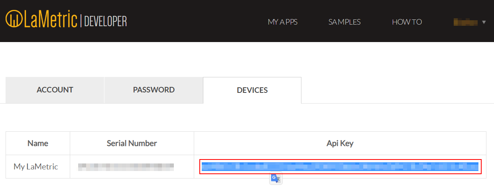

# IoBroker.lametric


此适配器允许您获取有关 [LaMetric 时间](https://haus-auto.com/p/amz/LaMetricTime) *(附属链接)* 的状态信息并向其发送通知。
您只需要设备的 IP 地址和 api 开发人员密钥。

＃＃ 由...赞助
[](https://haus-automatisierung.com/iobroker-kurs/?refid=iobroker-lametric)

＃＃ 安装
请使用 ioBroker 中的“适配器列表”来安装此适配器的稳定版本。您还可以使用 CLI 安装此适配器：

```
iobroker add lametric
```

＃＃ 配置
使用 LaMetric 固件 *2.2.2* 测试（推荐）

您可以获得您的个人密钥[这里](https://developer.lametric.com/)。



＃＃ 特征
- 设置显示亮度（百分比，自动模式/手动模式）
- 设置音量（百分比）
- 配置屏幕保护程序（启用/禁用、基于时间、黑暗时）
- 激活/停用蓝牙并更改蓝牙名称
- 在应用程序之间切换（下一个，上一个，转到特定的应用程序）
- 使用块发送通知（具有可配置的优先级、声音、图标、文本……）
- 控制时钟、收音机、秒表或天气等特殊应用程序
- 使用 *My Data (DIY)* LaMetric App 显示持久信息

功能受限于 [官方 API 功能](https://lametric-documentation.readthedocs.io/en/latest/reference-docs/lametric-time-reference.html)。

## 块状示例
您可以使用简单的字符串作为消息，它将显示为单个框架


要显示多个框架，您还可以提供一个数组作为消息


如果要使用图表框架，则必须将数字数组指定为框架


##我的数据（DIY）*（版本> 1.1.0）*
LaMetric 提供了一个应用程序（在集成应用程序市场上）来轮询自定义数据。这个应用程序被称为[我的数据DIY](https://apps.lametric.com/apps/my_data__diy_/8942)。此适配器以所需格式创建新状态。
您可以使用 Simple API Adapter 将数据传输到 LaMetric Time。

```ioBroker LaMetric Adapter -> State with Frame information <- Simple API Adapter <- My Data DIY App <- LaMetric```

### 配置（带身份验证）
1.安装【Simple API ioBroker Adapter】(https://github.com/ioBroker/ioBroker.simple-api)
2. 使用自定义密码（例如 HhX7dZl3Fe）创建一个名为“lametric”的新 ioBroker 用户
3.将“lametric”用户添加到“users”组
4. 在您的 LaMetric Time 上安装这个 *My Data DIY* 应用程序（使用 Market）
5.打开*我的数据（DIY）*应用程序设置并配置简单的api url（见下文）
6. 转到适配器配置并使用您的自定义信息（图标和文本）配置框架

```
http://172.16.0.219:8087/getPlainValue/lametric.0.mydatadiy.obj/?json
http://172.16.0.219:8087/getPlainValue/lametric.0.mydatadiy.obj/?json&user=lametric&pass=HhX7dZl3Fe
```

**重要：使用 SimpleAPI Adapter 的 json 标志（自 2.6.2 起可用）**

**如有必要，请确保更新 URL 中的 IP、端口、用户和密码！**

### 配置（无需身份验证）
1.安装【Simple API ioBroker Adapter】(https://github.com/ioBroker/ioBroker.simple-api)
2. 在您的 LaMetric Time 上安装这个 *My Data DIY* 应用程序（使用 Market）
3.打开*我的数据（DIY）*应用程序设置并配置简单的api url（见下文）
4. 转到适配器配置并使用您的自定义信息（图标和文本）配置框架

```
http://172.16.0.219:8087/getPlainValue/lametric.0.mydatadiy.obj/
```

**如有必要，请确保更新 URL 中的 IP 和端口！**

### 框架配置 *（版本 > 1.1.0）*
- 使用加号图标添加任意数量的框架
- 图标：从【官网】(https://developer.lametric.com/icons)中选择一个图标，并将ID放入配置字段。 **重要提示：添加 i（对于静态图标）或 a（对于动画图标）作为该 ID 的前缀。 （例如：`i3389`）
- 文本：只需键入框架的文本信息。您可以在花括号中使用状态。这些信息将替换为相应的状态值。 （例如：`{youtube.0.channels.HausAutomatisierungCom.statistics.subscriberCount} 订阅者`）

2 帧的示例配置：


##特殊应用程序/小工具*（版本> 1.1.2）*
您可以使用自定义信息控制某些应用程序

###clock.clockface
允许的值为：

- `weather`、`page_a_day`、`custom` 或 `none` 之一
- 自定义图标数据格式为`data:image/png;base64,<base64 编码的png 二进制>` 或`data:image/gif;base64,<base64 编码的gif 二进制>`

示例：`data:image/png;base64,iVBORw0KGgoAAAANSUhEUgAAAAgAAAAICAYAAADED76LAAAAOklEQVQYlWNUVFBgwAeYcEncv//gP04FMEmsCmCSiooKjHAFMEF0SRQTsEnCFcAE0SUZGBgYGAl5EwA+6RhuHb9bggAAAABJRU5ErkJggg==`

###倒计时.configure
允许值：以秒为单位的时间

## 脚本
要在您的 la 指标上显示消息，只需使用脚本适配器向此实例发送消息：

```JavaScript
sendTo(
    "lametric.0",
    "notification",
    {
        priority: "[info|warning|critical]",
        iconType: "[none|info|alert]",
        sound: "<string from sound list>",
        lifeTime: <milliseconds>,
        icon: "<icon>",
        text: "<string|array>",
        cycles: <integer>
    }
);
```

单帧示例：

```JavaScript
sendTo(
    "lametric.0",
    "notification",
    {
        priority: "info",
        iconType: "none",
        sound: "cat",
        lifeTime: 5000,
        icon: "i31820",
        text: "test",
        cycles: 1
    }
);
```

示例多帧：

```JavaScript
sendTo(
    "lametric.0",
    "notification",
    {
        priority: "info",
        iconType: "none",
        sound: "cat",
        lifeTime: 5000,
        icon: "i31820",
        text: ["frame 1", "frame 2", "frame 3"],
        cycles: 1
    }
);
```

显示一些信息循环的示例：

```JavaScript
let i = 0;
function show() {
    console.log('Show ' + i);
    sendTo(
        "lametric.0",
        "notification",
        {
            priority: "info",
            iconType: "info",
            lifeTime: 5000,
            icon: "data:image/png;base64,iVBORw0KGgoAAAANSUhEUgAAAAgAAAAICAIAAABLbSncAAAAAXNSR0IArs4c6QAAAARnQU1BAACxjwv8YQUAAAAJcEhZcwAADsMAAA7DAcdvqGQAAAAYdEVYdFNvZnR3YXJlAHBhaW50Lm5ldCA0LjEuNWRHWFIAAAAySURBVBhXY4AAYdcKk1lngCSUDwHIfAQbzgLqgDCgIqRLwFkQCYQoBAD5EATl4wQMDADhuxQzaDgX0gAAAABJRU5ErkJggg==",
            text: "Hi " + i,
            cycles: 1
        }
    );
    i++;
}
setInterval(show, 10000);
show();
```

##哨兵
**此适配器使用 Sentry 库自动向开发人员报告异常和代码错误。** 有关更多详细信息以及如何禁用错误报告的信息，请参阅 [Sentry-插件文档](https://github.com/ioBroker/plugin-sentry#plugin-sentry)!从 js-controller 3.0 开始使用哨兵报告。

## Changelog

<!--
  Placeholder for the next version (at the beginning of the line):
  ### **WORK IN PROGRESS**
-->

### 1.5.1

* (klein0r) Translated all objects
* (klein0r) Fixed HTTPS option

### 1.5.0

* (klein0r) Fixed myData DIY data type **(BREAKING CHANGE - requires SimpleAPI 2.6.2 or later to use json parameter)**
* (klein0r) Added version check

### 1.4.1

* (klein0r) Fixed missing translations

### 1.4.0

* (klein0r) Admin 5 Support

### 1.3.2

* (klein0r) Updated dependencies

### 1.3.1

* (klein0r) Added local start and end time for screensaver

### 1.3.0

* (klein0r) Encrypt sensitive information **(BREAKING CHANGE - RE-ENTER YOUR API KEY)**

### 1.2.1

* (klein0r) Extended regex for My Data (DIY)

### 1.2.0

* (klein0r) Added hide if value for My Data (DIY)
* (klein0r) Remove frames without text from My Data (DIY)
* (klein0r) Allow dynamic states for My Data (DIY) icons

### 1.1.3

* (klein0r) Fixed async object creation

### 1.1.2

* (klein0r) Delete app channels if app was deleted on LaMetric
* (klein0r) Custom app configuration (clockface, countdown duration)

### 1.1.1

* (klein0r) Fixed replacement issue for My Data (DIY)
* (klein0r) Updated README with more configuration details

### 1.1.0

* (klein0r) Added support for My Data (DIY)

### 1.0.1

* (klein0r) Added chart data support to notification

### 1.0.0

* (klein0r) First stable release
* (klein0r) Added iobroker sentry
* (klein0r) Added brightness and volume limit information (min, max)

### 0.0.10

* (klein0r) Switched to axios lib

### 0.0.9

* (klein0r) Added missing translations
* (GermanBluefox) Improved Blockly and main.js

### 0.0.8

* (klein0r) Updated dependencies

### 0.0.7

* (klein0r) fixed blockly

### 0.0.6

* (klein0r) switched to setTimeout instead of setInterval, improved logging and fixes eslint complaints

### 0.0.5

* (klein0r) Fixed notification, html, updated github template, enable and disable screensaver

### 0.0.4

* (klein0r) Refactored blockly sendTo / notifications

### 0.0.3

* (klein0r) Added app switching support, refactored everything
* (bluefox) The deletion of the actual shown information was added

### 0.0.2

* (Sigi74) Change message_value for variables message
* (Sigi74) Leave sound none

### 0.0.1

* (klein0r) initial release

## License

The MIT License (MIT)

Copyright (c) 2021 Matthias Kleine <info@haus-automatisierung.com>

Permission is hereby granted, free of charge, to any person obtaining a copy
of this software and associated documentation files (the "Software"), to deal
in the Software without restriction, including without limitation the rights
to use, copy, modify, merge, publish, distribute, sublicense, and/or sell
copies of the Software, and to permit persons to whom the Software is
furnished to do so, subject to the following conditions:

The above copyright notice and this permission notice shall be included in
all copies or substantial portions of the Software.

THE SOFTWARE IS PROVIDED "AS IS", WITHOUT WARRANTY OF ANY KIND, EXPRESS OR
IMPLIED, INCLUDING BUT NOT LIMITED TO THE WARRANTIES OF MERCHANTABILITY,
FITNESS FOR A PARTICULAR PURPOSE AND NONINFRINGEMENT. IN NO EVENT SHALL THE
AUTHORS OR COPYRIGHT HOLDERS BE LIABLE FOR ANY CLAIM, DAMAGES OR OTHER
LIABILITY, WHETHER IN AN ACTION OF CONTRACT, TORT OR OTHERWISE, ARISING FROM,
OUT OF OR IN CONNECTION WITH THE SOFTWARE OR THE USE OR OTHER DEALINGS IN
THE SOFTWARE.