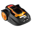

# 该适配器已弃用，不会进一步开发
-----

目前没有计划进一步开发该适配器。 __请迁移到已维护的 ioBroker.worx 适配器__。
如果您错过了 ioBroker.worx 的任何功能，请在该存储库中提出问题 (https://github.com/tp1de/ioBroker.worx/issues)。

ioBroker.landroid 将保持可用一段时间，但请记住，它不会适应节点 20 和即将推出的 js-controller v5。

-----

# IoBroker.landroid
## 适用于 ioBroker 的 Worx Landroid 适配器
这是适用于 Worx Landroid 割草机的 ioBroker 适配器。它已使用 Landroid WG796E 进行了测试。

## Changelog

<!--
    Placeholder for the next version (at the beginning of the line):
    ### **WORK IN PROGRESS**
-->
### **WORK IN PROGRESS**
-   (mcm1957) changed: Testing has been changed to support node 16, 18 and 20
-   (mcm1957) changed: Dependencies have been updated

### 1.0.3
* (ldittmar) compact mode compatibility added
* (ldittmar) add chinese support

### 1.0.2
* (ldittmar) Support of admin3

### 1.0.0
* (ldittmar) Fixed little changes

### 0.1.1
* (ldittmar) Change PIN field to type password

### 0.1.0
* (ChrBender) Bug with start/stop button fixed

### 0.0.4
* (ldittmar) Bugfixes

### 0.0.3
* (ldittmar) Minor bug fixes / compatibility with the WG797E.1 mower

### 0.0.2
* (ldittmar) read all important informations (can't start or stop ist at this time)

### 0.0.1
* (ldittmar) initial commit

## License
The MIT License (MIT)

Copyright (c) 2018-2019 ldittmar <iobroker@lmdsoft.de>

Permission is hereby granted, free of charge, to any person obtaining a copy
of this software and associated documentation files (the "Software"), to deal
in the Software without restriction, including without limitation the rights
to use, copy, modify, merge, publish, distribute, sublicense, and/or sell
copies of the Software, and to permit persons to whom the Software is
furnished to do so, subject to the following conditions:

The above copyright notice and this permission notice shall be included in
all copies or substantial portions of the Software.

THE SOFTWARE IS PROVIDED "AS IS", WITHOUT WARRANTY OF ANY KIND, EXPRESS OR
IMPLIED, INCLUDING BUT NOT LIMITED TO THE WARRANTIES OF MERCHANTABILITY,
FITNESS FOR A PARTICULAR PURPOSE AND NONINFRINGEMENT. IN NO EVENT SHALL THE
AUTHORS OR COPYRIGHT HOLDERS BE LIABLE FOR ANY CLAIM, DAMAGES OR OTHER
LIABILITY, WHETHER IN AN ACTION OF CONTRACT, TORT OR OTHERWISE, ARISING FROM,
OUT OF OR IN CONNECTION WITH THE SOFTWARE OR THE USE OR OTHER DEALINGS IN
THE SOFTWARE.