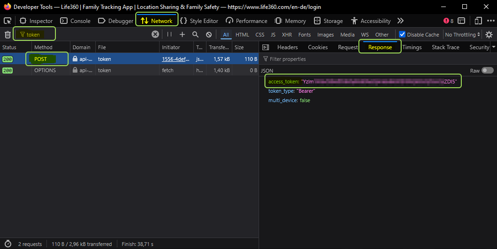

# 适用于 Life360（下一代）的 ioBroker 适配器
---

## 已更新，适用于采用现代基于令牌的身份验证的欧盟用户。
**免责声明：**这是一个非官方的、由社区开发的适配器。它与 Life360 公司没有任何关联，也未获得其认可。本适配器免费提供，仅供个人非商业用途的家庭自动化使用。使用风险自负。Life360 可能随时禁用或更改其 API，恕不另行通知。

> **隐私：**所有从 Life360 获取的数据都仅存储在您的本地 ioBroker 系统中。此适配器**不会**将任何数据传输给 Life360 API 以外的第三方或外部云服务。

＃＃ 描述
此适配器连接到 [生活360](https://www.life360.com) 云服务，用于跟踪人员并检测其在指定地点的存在情况。它检索圈子、成员和地点数据，并将其作为 ioBroker 状态持久化，以可配置的间隔进行更新。

## 文档
- 🇺🇸 [文档](https://github.com/inventwo/ioBroker.life360ng/blob/main/docs/en/README.md)
- 🇩🇪 [文档](https://github.com/inventwo/ioBroker.life360ng/blob/main/docs/de/README.md)

＃＃ 配置
### 持有者令牌（欧盟用户必需）
Life360 已禁用欧盟用户的密码登录功能。请手动获取 Bearer 令牌：

1. 在浏览器中打开 [https://life360.com/login](https://life360.com/login)。
2. 打开浏览器开发者工具（**F12**），切换到**网络**选项卡。
3. 输入您的电子邮件地址，然后点击**继续**。
4. 输入发送到您邮箱的一次性验证码。
5. 找到名为 `token` 的 **POST** 请求（忽略 OPTIONS）。
6. 在**预览** / **响应**中，复制`access_token`的值。
7. 将其粘贴到适配器配置中的 **Bearer token** 字段中。

>**注意：** 输入令牌时，请勿包含“Bearer”一词、空格和引号！

>**注意：**令牌有效期较长（通常为数月）。令牌过期后，适配器日志将显示连接错误——请重复上述步骤以获取新令牌。



### 我的地方
添加对 Life360 云服务不可见的私人场所。适配器会在每次投票时检查您自定义场所的在线状态。

- 为该地点定义一个**名称**。
- 设置地理位置（纬度和经度）。
- 设置半径，单位为米。

＃＃＃ 一体化
选择要处理的 Life360 数据：圆形、地点、人物。

### 位置追踪
启用位置跟踪，将地理位置详细信息（纬度、经度、`locationName`）添加到人员数据点。

## 迁移/升级说明
### 从 1.0.x 升级到 1.1.0
内部对象层次结构已进行重组，以符合 ioBroker 的对象类型规则。

更新后请执行以下步骤：

1. 停止适配器实例
2. 删除适配器的所有对象（在 ioBroker 管理后台中：

对象 → life360ng.0 → 全部删除）

3. 再次启动适配器实例
4. 所有数据点将自动重新创建

> ⚠️ 您现有的脚本和自动化程序**无需**更改 – > 所有数据点 ID 都保持不变。

## 州
### 圆圈
Life360 圈子及其相关地点和成员存在情况。

| 状态 | 类型 | 描述 |
|---|---|---|
| `circles.<id>.name` | 文本 | 圆圈名称（例如 `Family skvarel`） |
| `circles.<id>.memberCount` | 值 | 圆圈成员数（可能为空）* |
| `circles.<id>.createdAt` | 日期 | 圈子创建日期 |
| `circles.<id>.timestamp` | 日期 | 最后数据更新 |
| `circles.<id>.places.<placeId>.<memberId>.isPresent` | 指示符 | 成员在此地点 |
| `circles.<id>.places.<placeId>.membersPresent` | 值 | 当前在此位置的成员人数 |
| `circles.<id>.places.<placeId>.membersPresent` | value | 当前在此地点的成员人数 |

### 信息
| 状态 | 类型 | 描述 |
|---|---|---|
| `info.connection` | 布尔值 | `true` 当连接到 Life360 云时 |

### 我的地方
适配器配置中定义的自定义位置（未同步到 Life360 云端）。

结构：`myplaces.<placeName>.<memberName>.*`

| 状态 | 类型 | 描述 |
|---|---|---|
| `myplaces.<place>.<member>.distance` | value.distance | 中心点距离（米） |
| `myplaces.<place>.<member>.startTimestamp` | 日期 | 会员进入场所的时间戳 |
| `myplaces.<place>.<member>.timestamp` | 日期 | 上次检查时间戳 |
| `myplaces.<place>.gps-coordinates` | value.gps | 位置中心（JSON 格式） `{"lat":..,"lng":..}` |
| `myplaces.<place>.latitude` | value.gps.latitude | 地点中心纬度 |
| `myplaces.<place>.longitude` | value.gps.longitude | 地点中心经度 |
| `myplaces.<place>.members` | 列表 | 所有成员均已核实此位置 |
| `myplaces.<place>.membersCount` | 值 | 跟踪成员总数 |
| `myplaces.<place>.membersPresent` | 列表 | 当前在场成员姓名 |
| `myplaces.<place>.membersPresentCount` | 值 | 当前在场成员人数 |
| `myplaces.<place>.radius` | 值 | 配置半径（米） |
| `myplaces.<place>.timestamp` | 日期 | 最后数据更新 |
| `myplaces.<place>.urlMap` | text.url | OpenStreetMap 地点链接 |
| `myplaces.<place>.urlMapIframe` | text.url | 可嵌入的谷歌地图网址 |
| `myplaces.<place>.urlMapIframe` | text.url | 可嵌入的 Google 地图网址 |

＃＃＃ 人们
每个 Life360 圈子成员都会获得自己的频道，频道名称为 `people.<id>`，其中 `<id>` 是成员的 Life360 UUID。

| 状态 | 类型 | 描述 |
|---|---|---|
| `people.<id>.avatar` | text.url | 个人资料图片 URL |
| `people.<id>.createdAt` | 日期 | 账户创建日期 |
| `people.<id>.disconnected` | 指示器 | 应用已明确断开连接 |
| `people.<id>.firstName` | 文本 | 名字 |
| `people.<id>.gps-coordinates` | value.gps | GPS 位置（JSON 格式） `{"lat":..,"lng":..}` |
| `people.<id>.id` | 文本 | Life360 会员 UUID |
| `people.<id>.isConnected` | indicator.reachable | 应用已连接且可访问 |
| `people.<id>.isSharingLocation` | 指示器 | 位置共享已启用 |
| `people.<id>.lastName` | 文本 | 姓氏 |
| `people.<id>.lastPositionAt` | 日期 | 上次位置更新的时间戳 |
| `people.<id>.latitude` | value.gps.latitude | 当前纬度 |
| `people.<id>.locationName` | 文本 | 当前地点名称（例如 `Home`） |
| `people.<id>.longitude` | value.gps.longitude | 当前经度 |
| `people.<id>.status` | 文本 | 连接状态（例如 `Ok`） |
| `people.<id>.timestamp` | 日期 | 上次数据更新的时间戳 |
| `people.<id>.urlMap` | text.url | 指向当前位置的 OpenStreetMap 链接 |
| `people.<id>.urlMapIframe` | text.url | 可嵌入的谷歌地图网址 |
| `people.<id>.urlMapOsmIframe` | text.url | OpenStreetMap 可嵌入 URL (iFrame) |
| `people.<id>.urlMapOsmIframe` | text.url | OpenStreetMap 可嵌入 URL（iFrame） |

> **注意：** `isConnected` 表示 Life360 应用是否可访问，而 `disconnected` 表示明确的断开连接状态。

> 在连接丢失期间，两者可能同时为 `false`。

### 地点
Life360 地点直接从 Life360 云端同步（在 Life360 应用中定义）。

这些地点为**只读**，无法在适配器中进行配置。

| 状态 | 类型 | 描述 |
|---|---|---|
| `places.<id>.name` | 文本 | 地名（例如 `Refugium`） |
| `places.<id>.circleId` | 文本 | 此地点所属圆圈的 UUID |
| `places.<id>.ownerId` | 文本 | 地点所有者的 UUID |
| `places.<id>.gps-coordinates` | value.gps | 位置中心（JSON 格式） `{"lat":..,"lng":..}` |
| `places.<id>.latitude` | value.gps.latitude | 地点中心纬度 |
| `places.<id>.longitude` | value.gps.longitude | 地点中心经度 |
| `places.<id>.radius` | 值 | 半径（米） |
| `places.<id>.timestamp` | 日期 | 最后数据更新 |
| `places.<id>.urlMap` | text.url | OpenStreetMap 地点链接 |
| `places.<id>.urlMapIframe` | text.url | 可嵌入的谷歌地图网址 |
| `places.<id>.urlMapIframe` | text.url | 可嵌入的 Google 地图网址 |

> **注意：** 对于具有存在检测功能的自定义地点，请参阅 [我的地方](#myplaces)。

> **Life360 Places 不可用？** Life360 已限制部分账户（尤其是欧盟免费套餐账户）对云端 Places 的 API 访问。如果适配器日志显示 `All place sources returned 0 places`，则表示 Life360 API 不再返回您账户的 Places 数据。**解决方法：** 在 [我的地方](#my-places) 选项卡中定义您的 Places——它们独立于 Life360 云平台运行，并提供相同的在场检测功能。

### 追踪器
该适配器包含一个可选的 GPS 路线记录器，可记录每个 Life360 成员的移动轨迹，并生成交互式 Leaflet 地图——可通过任何浏览器、ioBroker Vis 或 Jarvis 仪表板中的 URL 直接访问。

#### 工作原理
每次 GPS 位置更新时，追踪器都会检查新位置与上次记录点之间的距离是否至少为 **minDistance** 米。如果是，则将该点添加到当天 GeoJSON LineString 中。完整的历史记录存储在 `allTime.geojson` 中，每月备份数据写入 `currentYear.MM.geojson` 中。

每次更新后都会自动（重新）生成一个 HTML 地图并写入 ioBroker 文件系统。该地图可通过 HTTP 立即访问。

#### 启用跟踪器
1. 打开适配器配置。
2. 在**跟踪器/路线记录器**下，为每个人启用跟踪。
3. （可选）为每个人启用**家庭地图**，以便将他们包含在组合家庭视图中。
4. 设置**最小距离**（默认值：20 米）以过滤掉 GPS 噪声。
5. 保存并重启适配器。

#### 地图网址
每个人和每个家庭组都会获得一个专用的地图 URL，该 URL 存储为 ioBroker 状态：

| 状态 | 描述 |
|---|---|
| `tracker.<Name>.url` | 该人员个人地图的相对 URL |
| `tracker.circle.url` | 组合圆形地图的相对 URL |
| `tracker.circle.urlLocal` | 包含 ioBroker 服务器 IP 地址和 Web 适配器端口的完整 URL |
| `tracker.circle.urlLocal` | 包含 ioBroker 服务器 IP 地址和 Web 适配器端口的完整 URL |

URL格式为：

```
/<namespace>/tracker/<name>.html
```

请在任意浏览器中打开此网址。地图将按设定的轮询间隔自动刷新。

> **注意：**追踪器地图由 [ioBroker Web适配器](https://github.com/ioBroker/ioBroker.web) 提供服务。请确保已安装并运行该服务。`urlLocal` 状态由服务器的 IP 地址和 Web 适配器端口（默认：8082）自动生成。

> > 生成的 HTML、CSS 和 JS 文件存储在 ioBroker 文件系统中，可在 **管理 → 文件 → `life360ng.<instance>/tracker/`** 下查看。

#### 地图特征
- **交互式 Leaflet 地图** — 基于 OpenStreetMap，支持平移和缩放
- **日期选择器** — 可在所有已记录的日期之间导航（完整历史记录，无限制）
- **颜色编码路线** — 每个人都有自己可配置的路线颜色
- **起始/结束标记** — 清晰地标示出当天的第一个和最后一个位置。
- **自动刷新** — 页面自动重新加载（轮询间隔 + 10 秒）
- **家庭地图** — 所有已启用功能的用户都显示在一张带有图例的地图上
- **旗帜标记** — Life360 地点和自定义地点（我的地点）可以显示为地图上的旗帜标记，每个标记的颜色、大小和不透明度均可配置（0.0 = 不可见，1.0 = 完全可见）

#### 单地图要素
- **路线复选框：** 每张单人地图都有一个“路线”复选框，用于切换所选时间段的路线显示。该状态会保存在浏览器中，并在重新加载后仍然有效。
- **动态日期选择器：** 日期范围选择器仅在启用路线时显示。如果禁用路线，则仅显示最后一个已知点。
- **个性化颜色：**复选框颜色与用户的肤色相匹配。
- **一致的标题：**无论复选框状态如何，标题高度都保持不变。

#### 跟踪状态
##### 配置 (`tracker.config.*`)
所有颜色和行为设置都可以在运行时更改——无需重新启动适配器即可立即重新渲染地图。

| 状态 | 类型 | 描述 |
|---|---|---|

| `tracker.config.enabled` | 布尔值 | 启用/禁用路由日志记录器 | as ghst

##### 每人数据 (`tracker.<Name>.*`)
| 状态 | 类型 | 描述 |
|---|---|---|
| `tracker.<Name>.allTime.geojson` | 字符串（JSON） | 完整的 GeoJSON 历史记录（所有日期） |
| `tracker.<Name>.mapSize` | 数量 (KB) | 生成的 HTML 地图的文件大小 |
| `tracker.<Name>.url` | text.url | 该人物地图的 HTTP URL |
| `tracker.<Name>.urlLocal` | text.url | 包含 ioBroker 服务器 IP 地址和 Web 适配器端口的 HTTP URL |
| `tracker.<Name>.urlLocal` | text.url | 包含 ioBroker 服务器 IP 地址和 Web 适配器端口的 HTTP URL |

##### 圆形地图 (`tracker.circle.*`)
| 状态 | 类型 | 描述 |
|---|---|---|
| `tracker.circle.allTime.geojson` | 字符串（JSON） | 所有圆成员的合并 GeoJSON |
| `tracker.circle.mapSize` | 数量 (KB) | 生成的 HTML 地图的文件大小 |
| `tracker.circle.url` | text.url | 组合圆形地图的 HTTP URL |
| `tracker.circle.urlLocal` | text.url | 包含 ioBroker 服务器 IP 地址和 Web 适配器端口的 HTTP URL |
| `tracker.circle.urlLocal` | text.url | 包含 ioBroker 服务器 IP 地址和 Web 适配器端口的 HTTP URL |

#### 在 Vis / Jarvis 中嵌入
在 **iFrame 小部件**（Vis）或 **URL 图块**（Jarvis）中使用地图 URL：

```
/life360ng.0/tracker/<name>.html
```

地图会自动刷新——无需额外配置。

> **注意：** >- 完整的路线历史记录 (`allTime.geojson`) 会持续增长。在 60 秒轮询间隔和 20 米最小距离下，预计每人每年大约会占用 **1 MB** 的空间——远低于 ioBroker 的文件存储限制。

>- 使用适配器配置中的“保留天数”设置，可以自动删除超过指定天数的数据（0 表示永久保留）。每次适配器启动时都会执行清除操作，并且每天执行一次。

>- 要手动清除某人的已记录路线数据，请在人员表中启用“清除记录”复选框并保存配置。该人员的 `allTime.geojson` 将被缩减至最后已知点。由于家庭地图是根据个人数据构建的，因此也会自动更新。每月生成的 GeoJSON 文件 (`currentYear.MM`) 不会受到影响。

>- 每个人的路线颜色在适配器设置（“追踪器”选项卡）中配置。

＃＃ 支持
如果您喜欢我们的作品并希望支持我们，我们非常感谢您的任何捐赠。

（此链接指向我们的PayPal账户，与ioBroker无关。）

[](https://www.paypal.com/donate?hosted_button_id=7W6M3TFZ4W9LW)

## 鸣谢
该适配器基于 [米戈勒](https://github.com/MiGoller) 的原始作品。<br>非常感谢您最初的实现和想法！此仓库包含优化和进一步的开发内容。<br>注意：原始的 [仓库](https://github.com/MiGoller/ioBroker.life360) 已存档，不再维护。

## 较早的更改
- [CHANGELOG_OLD.md](https://github.com/inventwo/ioBroker.life360ng/blob/main/CHANGELOG_OLD.md)

## Changelog

<!--
    ### **WORK IN PROGRESS**
-->
### 1.10.2 (2026-05-25)
- (skvarel) Updated @alcalzone/release-script and related plugins to minimum required version 5.2.0
- (skvarel) Updated minimum required Node.js engine from 20 to 22 in package.json
- (skvarel) Replaced custom wait/sleep helper with the built-in adapter.delay() method

### 1.10.1 (2026-05-24)
- (skvarel) Life360 places display settings in Map Display tab are now hidden when "Process Life360 places" is disabled in the Integration tab
- (skvarel) Added "Enable own places" checkbox in the Integration tab; disabling it hides the My Places tab, related Map Display settings and own place markers in the map hamburger menus
- (skvarel) Added descriptive info text to the Logging tab explaining what verbose logging records and when to use it

### 1.10.0 (2026-05-23)
- (skvarel) Improved Life360 places discovery with multiple API fallbacks: v3 endpoint, embedded v4 circle data (including singular "place" key), and direct v4 places endpoint; logs a one-time info message when no places are available via any source (affects some EU free-tier accounts); added documentation note about this API restriction
- (skvarel) Added person display name aliases in the Integration tab: assign a custom alias per person used in tracker map headers, legend labels, and ioBroker object display names; circle map header name setting moved to the same tab
- (skvarel) Fixed `people.<id>.disconnected` and `people.<id>.isConnected` states always showing wrong values because the Life360 API returns the `disconnected` field as a string instead of a boolean
- (skvarel) Added `notifications.lastSpokenText` state that stores every notification text for use in Blockly, Sonos, or other automations without requiring Telegram or Alexa
- (skvarel) Added Auto-Refresh checkbox (default on) and Live Follow checkbox to tracker map hamburger menus; in the circle map, clicking a person's name in the legend focuses the map on that person's route

### 1.9.1 (2026-05-20)
- (skvarel) Fixed tracker map showing wrong day (yesterday's route) for users in timezones ahead of UTC: date calculations now use local time instead of UTC, preventing GPS points and the default date range from being assigned to the previous day between midnight and the UTC offset hour
- (skvarel) Reduced risk of Cloudflare rate-limiting: API retry loops now abort immediately on a 403/503 block instead of hammering the API with further requests; added a short delay between consecutive API calls within each poll cycle

### 1.9.0 (2026-05-18)
- (skvarel) Added place-specific notification overrides table in the Notifications tab: configure custom arrival and leave messages per place and person, with optional suppression of the default standard message; place and person columns use dropdowns populated from known places and Life360 persons

## License

MIT License

Copyright (c) 2026 skvarel <sk@inventwo.com>

Permission is hereby granted, free of charge, to any person obtaining a copy
of this software and associated documentation files (the "Software"), to deal
in the Software without restriction, including without limitation the rights
to use, copy, modify, merge, publish, distribute, sublicense, and/or sell
copies of the Software, and to permit persons to whom the Software is
furnished to do so, subject to the following conditions:

The above copyright notice and this permission notice shall be included in all
copies or substantial portions of the Software.

THE SOFTWARE IS PROVIDED "AS IS", WITHOUT WARRANTY OF ANY KIND, EXPRESS OR
IMPLIED, INCLUDING BUT NOT LIMITED TO THE WARRANTIES OF MERCHANTABILITY,
FITNESS FOR A PARTICULAR PURPOSE AND NONINFRINGEMENT. IN NO EVENT SHALL THE
AUTHORS OR COPYRIGHT HOLDERS BE LIABLE FOR ANY CLAIM, DAMAGES OR OTHER
LIABILITY, WHETHER IN AN ACTION OF CONTRACT, TORT OR OTHERWISE, ARISING FROM,
OUT OF OR IN CONNECTION WITH THE SOFTWARE OR THE USE OR OTHER DEALINGS IN THE
SOFTWARE.