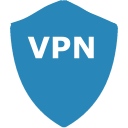

# IoBroker.link
此适配器允许通过 [ioBroker.link](https://iobroker.link/) 云进行安全连接。

＃＃ 常问问题
### 我可以用这个适配器做什么？
该适配器允许安全地连接到本地 ioBroker 安装和本地网络中位于 DSL 调制解调器/路由器/防火墙后面的其他服务器/设备。连接是通过公开可用的 `ioBroker.link` 云（link-cloud）进行的。甚至可以通过链接云设置和访问多个本地 ioBroker 安装。

### 与我可以在路由器上配置的端口转发有什么区别？
虽然您可以在路由器上配置端口转发，从而从任何地方访问本地 ioBroker 安装，但链接云提供以下主要优势：

- 无需在路由器上打开连接互联网的端口
- 本地 ioBroker 安装不需要公共 IP 或（动态）DNS 名称
- link-cloud 负责认证和授权
- link-cloud 使用 SSL/TLS 保护连接
- link-cloud 提供审计日志
- 多个本地ioBroker安装可以通过link-cloud服务器的同一个UI访问
- `ioBroker.link` 适配器充当反向代理，允许访问本地网络中支持 HTTP/TCP/UDP 协议的其他服务器/设备
- 您可以向第三个人授予对本地 ioBroker 安装的临时或永久访问权限，例如解决设备故障，而无需透露您的密码或管理凭据

### 如果没有公共 IP 且没有打开端口，如何建立到我本地 ioBroker 安装的连接？
link-cloud 永远不会连接到您的本地安装，它是 `ioBroker.link` 适配器，它在本地运行并在有连接请求的情况下启动到 link-cloud 的连接。

### 什么是_连接请求_？
连接请求是通过链接云建立与本地 ioBroker 安装的连接的意图，该连接由经过身份验证和授权的人员进行。

### `ioBroker.link` 适配器如何识别存在连接请求？
`ioBroker.link` 适配器通过轮询链接云定期检查挂起的连接请求。您可以在 `ioBroker.link` 适配器的设置中设置轮询间隔。

### 如何确保 `ioBroker.link` 适配器与链接云而不是中间人建立连接？
ioBroker.link 适配器只能连接到提供颁发给 ioBroker.link 的有效 SSL 证书的服务器。

### 链接云如何识别和授权所有 `ioBroker.link` 适配器轮询挂起的连接请求或建立连接？
每个 `ioBroker.link` 适配器都会生成自己唯一的 2048 位密钥对。在链接云注册后，适配器传输其公钥。在对链接云的每个后续请求（检查挂起的连接请求、接受或拒绝挂起的连接、关闭打开的连接等）时，适配器通过提供用适配器的私钥签名的 JSON Web 令牌 (JWT) 来授权自己.链接云使用存储的公钥验证 JWT 的签名并接受或拒绝连接。

### 一个适配器可以使用另一个适配器 JWT 连接到链接云吗？
不可以。适配器使用自己的唯一私钥对 JWT 进行签名，该私钥永远不会离开本地安装。链接云使用对应的公钥来验证签名。

### 我可以通过轮换用于授权我的适配器的密钥来提高安全性吗？
是的。密钥存储在适配器安装的 /keys 文件夹中。删除此文件夹中的所有文件并重新启动适配器。适配器将在启动时创建一个新的密钥对，并通过发送新的公钥来刷新链接云的注册。

### 如何保护已建立的连接本身？
如果有挂起的连接请求，`ioBroker.link` 适配器首先建立到链接云的 SSH 隧道并接受传入连接。双方通过证书的方式对自己进行授权。一旦建立了 SSH 隧道，通信本身就开始了。一旦连接关闭，例如，由用户通过链接云服务器 UI 关闭，SSH 隧道将关闭，不再可能进行通信。

### 是否也可以通过链接云连接到我的本地设备？
是的。如果您的设备支持 HTTP 协议，那么您可以通过链接云访问它们。您要通过链接云连接的每个设备都必须在 `ioBroker.link` 适配器设置中进行明确配置。默认情况下无法连接任何设备。甚至 ioBroker.admin Web-UI 也必须首先配置才能连接。

### 我需要安装什么才能通过链接云连接到我的本地设备？
通过您选择的浏览器连接到支持 HTTP 协议的本地设备。不需要额外的软件。

### 我的本地设备仅支持 TCP/UDP 协议。是否也可以连接到 TCP/UDP 设备？
是的。为了连接到本地 TCP/UDP 设备，请使用 ioBroker.link-box：https://www.npmjs.com/package/iobroker.link-box

### 如何授予对本地 ioBroker 安装的访问权限？
任何应该被授予访问本地 ioBroker 安装权限的人都必须在 `ioBroker.link` 适配器设置中进行明确配置。默认情况下没有人可以访问。这意味着您还必须自己配置才能连接到您自己的本地 ioBroker 安装。

### 如何以及在哪里创建我想要授予对本地安装访问权限的用户？
首先，您必须在 https://iobroker.pro 上创建一个免费帐户。创建后，您可以在 `ioBroker.link` 适配器 _Allowed users_ 设置中配置注册的电子邮件。适配器配置中无需提供密码。

### 我已经在 https://iobroker.pro 上有一个帐户。我可以将它用于链接云吗？
是的。您可以使用现有的 https://iobroker.pro 帐户。

###可以同时使用https://iobroker.pro和link-cloud服务吗？
是的。这两个服务之间没有依赖关系。您可以单独或并行使用它们。

###为什么link-cloud使用https://iobroker.pro账户？
链接云不使用 https://iobroker.pro 帐户。与 https://iobroker.pro 帐户相关的任何信息都不会传输/可用于链接云。链接云只是将身份验证联合到 https://iobroker.pro。反过来，授权完全由链接云处理。

### 如何撤销对本地安装的访问权限？
您可以通过从 `ioBroker.link` 适配器的 _Allowed user_ 设置中删除他们的电子邮件来撤销授予个人的访问权限。或者，您可以通过将 _Allowed users_ 设置留空来完全阻止对本地安装的访问。此外，停止或删除 `ioBroker.link` 适配器将阻止通过链接云进行任何访问。

### 使用链接云时是否需要支付任何费用？
目前不收取任何费用，链接云完全免费使用。无论您使用免费还是付费 https://iobroker.pro 帐户，这也是独立的。请注意，这可能会在未来发生变化。

### 为什么您计划对这项简单的服务收费？
即使是这种简单的服务也需要基础设施全天候运行并产生成本。确保此服务的高可用性、排除中断故障以及改进或添加新功能会消耗我们大量的时间。为了进一步发展，我们需要芯片。这将使我们的妻子可以去购物，让我们有更多时间关注这个项目。

### 链接云的限制是什么？
目前只能打开一个连接到本地 ioBroker 安装。这意味着如果多个用户被授予对本地安装的访问权限，一次只能连接一个用户。此外，允许每个用户的唯一连接。这意味着被授予多个本地安装访问权限的同一用户一次只能访问一个安装。

### 如何跟踪谁以及何时访问了我的本地安装？
所有请求的连接的元数据都保留下来，可以在 https://iobroker.link 下查看。

### 哪些端口必须在防火墙中可用？
必须可以访问 `ioBroker.link` 服务器上的以下端口：5000-5100（出站）

## 适配器配置::主要设置
＃＃＃ 客户名称
这是您本地 ioBroker 安装的名称。您可以自由选择。它可以帮助您在通过链接云发出连接请求时区分不同的 ioBroker 安装。

### 服务器 URI
这是链接云的域名。此设置已使用 https://iobroker.link 进行预配置，应进行更改。

###代理URI
如果您的 ioBroker 安装在代理后面，您可以在此处配置代理服务器。代理可以在这里定义为：*http://proxy:8080* 或通过 **HTTPS_PROXY** 环境变量。

### 轮询间隔（秒）
定义您的适配器轮询链接云以获取挂起的连接请求的频率。
推荐设置：10

### 允许的用户
定义必须被授予访问本地 ioBroker 安装权限的现有 https://iobroker.pro 帐户。

如果您想将访问权限授予您自己和您的妻子，并假设您在创建 https://iobroker.pro 帐户时提供了 me@gmail.com 和 darling@gmail.com，则 _Allowed users_ 设置将包含这两个 e-邮件地址。

## 适配器配置 :: 设备
您可以在此处定义可通过链接云访问的设备列表。

### 启用
定义配置的设备是否应可访问。

＃＃＃ 姓名
自由选择的设备名称。它有助于在通过链接云连接时区分不同的设备。

### IP
要在本地网络中连接的设备的 IP 地址。您可以提供主机名，例如 _localhost_，而不是 IP 地址，但请注意，此名称必须在运行 ioBroker-link 适配器的机器上可解析，并且主机名不能用于 UDP 设备。

＃＃＃ 港口
您的设备正在侦听传入连接的端口号。

＃＃＃ 类型
- TCP - 用于支持 TCP 和/或 HTTP 协议的设备
- UDP - 适用于支持 UDP 协议的设备

## 适配器配置::设备配置示例
要使您的 `ioBroker.admin` Web-UI 可通过链接云访问，您将在 _Adapter configuration :: Devices_ 下对其进行配置，如下所示：

- 启用：选中
- 名称：ioBrokerAdminWebUI（或您喜欢的任何名称）
- IP：本地主机（或 127.0.0.1）
- 端口：8081（如果您没有更改 ioBroker.admin 的默认端口）
- 类型：TCP

要访问路由器的 Web-UI，您可能需要进行如下配置：

- 启用：选中
- 名称：路由器
- IP：192.168.0.1（或任何路由器的本地网络IP）
- 端口：80（如果您没有更改路由器的 Web UI 默认端口）
- 类型：TCP

要访问 IP 摄像机的快照或实时流，请按如下方式配置设备：

- 启用：选中
- 名称：Front-Door-Snapshot（或您喜欢的任何名称）
- IP：您相机的 HTTP 端点，例如：_http://192.168.0.178:8000/tmpfs/snap.jpg_
- 端口：忽略，应该是 HTTP 端点配置的一部分
- 类型：TCP

**不要**将您的相机凭据作为请求参数放入配置的 HTTP 端点：_http://192.168.0.178:8000/tmpfs/snap.jpg?usr=admin&pwd=admin_

相反，在建立连接时出现提示时提供它们。

## Changelog
### 0.5.11 (2020-12-09)
* (bluefox) Fixed the type of `info.connection` state

### 0.5.10 (2020-12-09)
* (bluefox) Ignore errors at 4:00 because of the server restart

### 0.5.6 (2019-12-02)
* (gh-got) multi-factor connection approval
* (gh-got) Implemented the acknowledgment via telegram

### 0.5.2 (2019-11-26)
* (bluefox) Added user disable/enable

### 0.4.4 (2019-07-16)
* (gh-got) closing tunnels in case server considers an agent as offline
* (gh-got) fixed timeout to query active connection status

### 0.4.2 (2019-03-28)
* (gh-got) agents will report own version by registration

### 0.4.0 (2019-03-10)
* (bluefox) Made this adapter to be compatible with the new server

### 0.3.7 (2018-09-23)
* (bluefox) Do not connect to the cloud if no configuration defined

### 0.3.6 (2018-06-26)
* (bluefox) The download of SSF from GitHub depending on plattform was added

### 0.2.7 (2018-06-17)
* (bluefox) UDP communication is now supported

### 0.2.6 (2018-06-10)
* (bluefox) HTTP proxy support

### 0.1.3 (2018-04-25)
* (bluefox) Initial commit

## License
Creative Common Attribution-NonCommercial (CC BY-NC)

Copyright (c) 2018-2021 bluefox <dogafox@gmail.com>, gh-got

http://creativecommons.org/licenses/by-nc/4.0/

Short content:
Licensees may copy, distribute, display and perform the work and make derivative works based on it only if they give the author or licensor the credits in the manner specified by these.
Licensees may copy, distribute, display, and perform the work and make derivative works based on it only for noncommercial purposes.
(Free for non-commercial use).