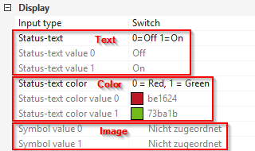

#ioBroker.loxone

**测试：** 

## IoBroker 的 loxone 适配器
**_这个适配器至少需要nodejs 10.x！_**

获取 Loxone Miniserver（和 Loxone Miniserver Go）中可用的所有信息并实时提供更改。

**此适配器使用 Sentry 库自动向开发人员报告异常和代码错误。** 有关更多详细信息以及如何禁用错误报告的信息，请参阅 [Sentry-插件文档](https://github.com/ioBroker/plugin-sentry#plugin-sentry)!从 js-controller 3.0 开始使用哨兵报告。

＃＃ 安装
通过 ioBroker Admin 安装此适配器：

1. 打开实例配置对话框
2. 输入您的 Loxone 迷你服务器的 IP 地址或主机名和 HTTP 端口（默认为 80）
3. 在 Loxone Miniserver 中创建一个新用户（使用 Loxone Config 应用程序），您只授予对所有必需变量的读写权限。
4. 在配置对话框中输入此用户的名称和密码
5. 保存配置
6. 启动适配器

＃＃ 配置
### 迷你服务器主机名/IP
这是您的 Loxone Miniserver 或 Miniserver Go 的 IP 地址或主机名。

### 迷你服务器端口
这是您的 Loxone 迷你服务器的 HTTP 端口。

默认情况下，Miniserver 配置为侦听端口 80，但您可能已经更改了它。

### 迷你服务器用户名
提供有效的用户名以访问 Loxone 迷你服务器。

出于安全原因，强烈建议使用不同于“admin”的用户。

用户只需要从 ioBroker 读取要使用的变量。

### 迷你服务器密码
提供给定用户名的密码（见上文）。

### 同步名称
这将在 ioBroker 中的名称在 Loxone 配置中更改时更新。
如果禁用此选项，名称将仅在第一次检测到控件时同步。

### 同步房间
这将使用 Loxone 迷你服务器提供的所有房间填充 enum.rooms 枚举并将链接所有控件。

### 同步函数
这将使用 Loxone Miniserver 提供的所有类别填充 enum.functions 枚举，并将链接所有控件。

### 天气服务器
选择您要同步的天气数据：

- “不同步天气数据”不会同步与天气服务器相关的任何内容
-“仅同步当前天气”将同步“实际”下的数据
- “同步24小时天气预报”将同步当前天气和24小时天气预报
-“同步整个天气预报”将同步当前天气和整个天气预报（96小时）

＃＃ 状态
适配器会自动连接到配置的 Loxone Miniserver 并为其找到的每个控制状态创建状态。

状态的 ID 格式如下：`loxone.<instance>.<control>.<state>`

- `<instance>` 是 ioBroker 适配器实例索引（通常为“0”）
- `<control>` 是控件的 UUID
- `<state>` 是控件内的状态（有关更多信息，请参阅 [支持的控件类型](#supported-control-types)）。

在 Loxone Config 中配置控件时提供的名称将仅用作其在 ioBroker 中的显示名称。
这是因为用户可以为多个控件选择相同的名称。

有关控件及其状态的更多信息，还请查看 Loxone API（尤其是结构文件）：https://www.loxone.com/enen/kb/api/

## 控制可见性
默认情况下，Loxone Miniserver 从 Web 界面隐藏了许多控件（以及它们的状态）。

这意味着，它们也对这个 ioBroker 适配器隐藏。

### 在用户界面中使用
为确保您的所有状态都正确报告给 ioBroker，请验证它们是否已选中“用户界面”部分中的“使用”：

### 显示诊断输入
要查看诊断输入（例如 Air 设备的电池状态），请确认设备已选中“显示诊断输入”：

## 全球状态
此适配器当前提供以下全局状态：

- `operatingMode`：Loxone Miniserver 当前的运行模式编号
- `operatingMode-text`：Loxone Miniserver 的当前操作模式作为文本
- `sunrise`：今天太阳升起时午夜后的分钟数
- `sunset`：今天太阳下山后午夜后的分钟数
- `notifications`：通知数量
- `modifications`：修改次数
- 所有其他全球状态都被简单地报告为文本

## 支持的控件类型
此适配器当前支持以下控件类型。

在状态名称的后面，可以看到状态的类型：

- `(rw)`：可读和可写：可以从 ioBroker 更改此状态
- `(ro)`：只读：无法从 ioBroker 更改此状态
- `(wo)`: 只写：这个适配器不报告这个状态的值，但它可以改变，在 Loxone 迷你服务器上触发一些动作

### AalSmartAlarm
由 AAL 智能报警控制提供。

- `alarmLevel` (ro) 当前警报级别的 ID
    - 0 = 无警报
    - 1 = 立即报警
    - 2 = 延迟报警
- `alarmCause` (ro) 表示最后一个警报原因的字符串
- `isLocked` (ro) 重置激活，输入将被忽略，因此不会执行任何警报
- `isLeaveActive` (ro) 设置离开输入，不会执行任何警报
- `disableEndTime` (ro) 控件被禁用的结束时间
- `confirm` (wo) 确认未决警报
- `disable` (wo) 在一定时间内禁用控制，不会执行任何警报。将其设置为 0 将重新启用智能警报
- `startDrill` (wo) 执行测试报警

### AalEmergency
由 AAL 智能紧急按钮控制提供。

- `status` (ro) 当前状态的 ID
    - 0 = 运行，正常运行，等待紧急按钮按下
    - 1 = 警报触发
    - 2 = 配置中的复位输入有效，控制被关闭
    - 3 = 应用程序已暂时禁用控制
- `disableEndTime` (ro) 控件被禁用的结束时间
- `resetActive` (ro) 文本状态与活动复位输入（如果控制处于复位状态）
- `trigger` (wo) 从应用程序触发警报
- `quit` (wo) 退出活动警报
- `disable` (wo) 在给定的时间内禁用控件（以秒为单位）。如果禁用，则设置为 0 以重新开始控制

＃＃＃ 警报
由防盗报警控制提供。

- 报警的`armed`（rw）布尔状态（真/假）；将 `true` 写入此值将立即打开警报（没有预定义的延迟）
- `nextLevel` (ro) 下一个警报级别的 ID
    - 1 = 静音
    - 2 = 声学
    - 3 = 光学
    - 4 = 内部
    - 5 = 外部
    - 6 = 远程
- `nextLevelDelay` (ro) 下一关的延迟，以秒为单位
- `nextLevelDelayTotal` (ro) 下一级的总延迟，以秒为单位
- `level` (ro) 当前警报级别的 ID
    - 1 = 静音
    - 2 = 声学
    - 3 = 光学
    - 4 = 内部
    - 5 = 外部
    - 6 = 远程
- `startTime` (ro) 闹钟开始时的时间戳
- `armedDelay` (ro) 警报控制被设防的延迟
- `armedDelayTotal` (ro) 被设防的警报控制的总延迟
- `sensors` (ro) 传感器列表
- `disabledMove` (rw) 运动被禁用 (true) 或不 (false)
- `delayedOn` (wo) 将任何值写入此状态，使用配置的延迟启动警报
- `quit` (wo) 向该状态写入任何值都会确认警报

###中央警报
由中央防盗报警控制提供。

- 报警的`armed`（rw）布尔状态（真/假）；将 `true` 写入此值将立即打开警报（没有预定义的延迟）
- `delayedOn` (wo) 将任何值写入此状态，使用配置的延迟启动警报
- `quit` (wo) 向该状态写入任何值都会确认警报

###闹钟
由闹钟控制提供。

- 闹钟的`isEnabled`（rw）布尔状态（真/假）
- `isAlarmActive` (ro) boolean (true / false) 当前闹钟是否响起
- `confirmationNeeded` (ro) boolean (true / false) 用户是否需要确认报警
- `ringingTime` (ro) 以秒为单位倒计时闹钟会响多久，直到它再次打盹
- `ringDuration` (rw) 持续时间以秒为单位闹钟响起
- `prepareDuration` (rw) 准备时间（以秒为单位）
- `snoozeTime` (ro) 秒直到打盹结束
- `snoozeDuration` (rw) 以秒为单位的打盹持续时间
- `snooze` (wo) 将任何值写入此状态会暂停当前闹钟
- `dismiss` (wo) 向该状态写入任何值会解除当前警报

### 音频区
由音乐服务器区提供。

- 音乐服务器的`serverState` (ro) 状态：
    - -3 = 未知/无效区域
    - -2 = 无法访问
    - -1 = 未知
    - 0 = 离线
    - 1 = 初始化（启动，试图达到它）
    - 2 = 在线
- `playState` (rw) 播放状态：
    - -1 = 未知（无法设置此值）
    - 0 = 停止（设置此值将暂停播放）
    - 1 = 暂停（设置此值将暂停播放）
    - 2 = 播放（设置此值将开始/恢复播放）
- 客户端的`clientState`（ro）状态：
    - 0 = 离线
    - 1 = 初始化（启动，试图达到它）
    - 2 = 在线
- `power` (rw) 客户端电源是否处于活动状态
- `volume` (rw) 当前音量
- `maxVolume` (ro) 区域可以分配最大音量
- `shuffle` (rw) 是否启用播放列表随机播放
- 包含所有区域收藏夹的`sourceList`（ro）列表
- `repeat` (rw) 重复模式：
    - -1 = 未知
    - 0 = 关闭
    - 1 = 全部重复
    - 2 = -未使用-
    - 3 = 重复当前项目
- `songName` (ro) 歌曲名称
- `duration` (ro) 整个音轨有多长，-1 如果未知（流）
- `progress` (rw) 当前位置在轨道上
- `album` (ro) 专辑名称
-`艺术家`（ro）艺术家姓名
- `station` (ro) 站名
- `流派`（ro）流派名称
- `cover` (ro) 歌曲/专辑封面图片 URL
- `source` (rw) 当前选择的源标识符（参见上面的 `sourceList`）
- `prev` (wo) 向这个状态写入任何值移动到上一个轨道
- `next` (wo) 向这个状态写入任何值移动到下一个轨道

### 中央音响
由中央音乐服务器提供。

- `control` (wo) 设置所有玩家的播放状态（`true` = 播放，`false` = 暂停）

＃＃＃ 颜色选择器
该设备仅出现在 LightController 中。

- `red` (rw) 颜色选择器的红色值
- `green` (rw) 颜色选择器的绿色值
-`blue` (rw) 颜色选择器的蓝色值

从 ioBroker 设置上述一种或多种状态只会在大约 100 毫秒后向 Miniserver 发送命令。
这是为了防止颜色因单个用户输入而多次更改。

### 颜色选择器 V2
此设备仅出现在 Loxone 软件版本 9 及更高版本的 Light Controller V2 中。

- `red` (rw) 颜色选择器的红色值
- `green` (rw) 颜色选择器的绿色值
-`blue` (rw) 颜色选择器的蓝色值

从 ioBroker 设置上述一种或多种状态只会在大约 100 毫秒后向 Miniserver 发送命令。
这是为了防止颜色因单个用户输入而多次更改。

### 日间计时器 / IRCDaytimer
由计时器/时间表提供。

- `mode` (ro) 日间计时器的当前操作模式
- `mode-text` (ro) 日间计时器的当前操作模式名称
- `override` (ro) 定时器的剩余时间
- `value` (ro) 当前值，数字的 `true` 或 `false`，模拟的值
- `value-formatted` (ro) 当前格式化的值作为文本
- `needsActivation` (ro) 仅在需要激活控件时可用
- 只要日间计时器的复位输入处于活动状态，`resetActive` (ro) 就会保持活动状态
- 如果条目需要激活，`pulse` (wo) 激活新值

###调光器
由调光器提供。

- `position` (rw) 调光器的当前位置
- `min` (ro) 当前最小值
- `max` (ro) 当前最大值
- `step` (ro) 当前步长值
- `on` (wo) 将任何值写入此状态将调光器设置为最后一个已知位置
- `off` (wo) 向该状态写入任何值会禁用调光器，将位置设置为 0 但记住最后一个位置

### EIBDimmer
由 EIB/KNX 调光器提供。

- `position` (rw) 调光器的当前位置
- `on` (wo) 将任何值写入此状态将调光器设置为最后一个已知位置
- `off` (wo) 向该状态写入任何值会禁用调光器，将位置设置为 0 但记住最后一个位置

### 弗洛纽斯
由能量监视器提供。

- `prodCurr` (ro) 当前生产能力
- 当天的`prodCurrDay`（ro）能源生产
- 当前月份的`prodCurrMonth`（ro）能源生产
- 全年`prodCurrYear`（ro）能源生产
- 自成立以来的`prodTotal`（ro）能源生产
- `consCurr` (ro) 电流消耗功率
- 当天消耗的`consCurrDay`（ro）能量
- 自设置以来消耗的`consTotal`（ro）能量
- `deliveryDay` (ro) 未知
- `earningsDay`（ro）通过自己消耗产生的电力而不是从电网消耗它，或者通过将未使用的产生的电力输出到电网，通过当前赚取了多少钱
- `earningsMonth` (ro) 当月赚了多少钱
- `earningsYear` (ro) 当年赚了多少钱
- `earningsTotal` (ro) 自成立以来赚了多少钱
- `gridCurr` (ro) 当前电网消耗/输送功率。如果为负，则正在向电网输送电力。
- `batteryCurr` (ro) 当前电池充电/使用功率。如果为负，则电池正在充电。
- `stateOfCharge` (ro) 表示电池的充电状态。 100 = 充满电。
- `co2Factor` (ro) 产生一千瓦时需要多少二氧化碳，用于计算二氧化碳减排量
- `online` (ro) true：在线，false：离线

＃＃＃ 门
由门控提供。

- `position` (ro) 从 1 = 向上到 0 = 向下的位置
- `active` (rw) 门移动的当前方向
    - -1 = 关闭
    - 0 = 不动
    - 1 = 打开
- `preventOpen` (ro) 是否阻止开门
- `preventClose` (ro) 是否防止门关闭

###中央门
由中央门控提供。

- `open` (wo) 打开所有的门
- `close` (wo) 关闭所有门
- `stop` (wo) 停止所有门电机

### 计时器
由...提供

- `total` (ro) 到目前为止计数器一直处于活动状态的总秒数
- `remaining` (ro) 距离下一次维护需要多少秒
- `lastActivation` (ro) 上次激活计数器的时间戳
- `overdue` (ro) `false` 如果没有过期，否则需要维护
- `maintenanceInterval` (ro) 秒，直到下一次维护
- `active` (ro) 计数器当前是否处于活动状态
- 自超过维护间隔以来的`overdueSince`（ro）秒
- `reset` (wo) 将导致以下值的重置
    - 剩余到维护间隔
    - 逾期为 0
    - 逾期自 0
- `resetAll` (wo) 类似于 `reset`，但也设置
    - 总数为 0
    - lastActivation 为 0

### InfoOnlyAnalog
由虚拟状态以及 Loxone Touch 开关提供。

- `value` (ro) 控件的状态值（编号）
- `value-formatted` (ro) 如果已配置，则为状态的格式化值（使用 Loxone Config 中的“Unit”格式）

### InfoOnlyDigital
由虚拟状态以及 Loxone Touch 开关提供。

- 控件的`active`（ro）布尔状态（真/假）
- `active-text` (ro) 如果已配置，则为状态的文本等效项
- `active-image` (ro) 如果已配置，则为状态的等效图像
- `active-color` (ro) 如果配置了，状态的颜色等价物

### InfoOnlyText
由虚拟文本状态提供。

- `text` (ro) 控件的状态值
- `text-formatted` (ro) 如果配置，状态的格式化值

### 对讲机
由门禁控制器提供。

- `bell` (ro) 铃声是否响起
- `lastBellEvents` (ro) 数组，包含每个未回答的铃声活动的时间戳
- `version` (ro) 仅限 Loxone Intercoms - 包含当前安装固件的文本

    版本

- `answer` (wo) 向该状态写入任何值将停用响铃

这种类型的通道可能包含其他设备。有关详细信息，请参阅相应的章节。

###智能房间控制器V2
Miniserver 10.0以后由智能房间控制器V2提供。

待办事项：当前缺少文档

###百叶窗
由不同种类的百叶窗（自动和手动）提供。

- `up` (rw) 百叶窗是否向上移动
- `down` (rw) 百叶窗是否向下移动
- 百叶窗的 `position` (ro) 位置，从 0 到 1 的数字
    - 百叶窗上位 = 0
    - 百叶窗低位 = 1
- `shadePosition` (ro) 百叶窗（百叶窗）的阴影位置，一个从 0 到 1 的数字
    - 百叶窗没有阴影 = 0
    - 百叶窗有阴影 = 1
- `safetyActive` (ro) 只被 Autopilot 使用，代表安全关闭
- `autoAllowed` (ro) 仅由使用 Autopilot 的用户使用
- `autoActive` (rw) 仅由使用 Autopilot 的用户使用
- 'locked' (ro) 仅由具有 Autopilot 的用户提供，这表示 Loxone Config 中的输出 QI
- `infoText` (ro) 通知例如是什么导致了锁定状态，或者是什么导致了安全激活。
- `fullUp` (wo) 向这个状态写入任何值都会触发一个完整的动作
- `fullDown` (wo) 向该状态写入任何值会触发完全向下运动
- `shade` (wo) 向这个状态写入任何值都会将百叶窗遮蔽到完美的位置

###中央百叶窗
由中央百叶窗控制提供。

- `autoActive` (rw) 仅由使用 Autopilot 的用户使用
- `fullUp` (wo) 向这个状态写入任何值都会触发一个完整的动作
- `fullDown` (wo) 向该状态写入任何值会触发完全向下运动
- `shade` (wo) 将任何值写入此状态将所有百叶窗的阴影设置到完美位置

### 光控制器
由（酒店）照明控制器提供。
场景只能在 Loxone 应用程序中修改，但可以在 ioBroker 中选择。

- `activeScene` (rw) 当前活动场景编号
    - 0：全部关闭
    - 1..8：用户定义场景（场景的定义/学习必须使用 Loxone 工具完成）
    - 9：全部开启
- 所有场景的`sceneList`（ro）列表
- `plus` (wo) 切换到下一个场景
- `minus` (wo) 更改为上一个场景

这种类型的通道可能包含其他设备。有关详细信息，请参阅相应的章节。

### 光控制器 V2
由 Loxone 软件版本 9 及以上的（酒店）照明控制器提供。
情绪只能在 Loxone 应用程序中修改，但可以在 ioBroker 中进行选择和组合。

- 所有配置的情绪名称的`moodList`（ro）列表
- `activeMoods` (rw) 当前活跃的情绪名称列表
- `favoriteMoods` (ro) 最喜欢的心情名称列表
- `additionalMoods` (ro) 非最喜欢的情绪名称列表
- `plus` (wo) 改变下一个心情
- `minus` (wo) 改变之前的心情

这种类型的通道可能包含其他设备。有关详细信息，请参阅相应的章节。

### 中央灯控制器
由中央照明控制器提供。

- `control` (wo) 打开或关闭所有灯

### 邮箱
由 Paketsafe Air / Tree 提供。

- `notificationsDisabledInput` (ro) 通知禁用输入的状态
- `packetReceived` (ro) 状态是否已收到数据包
- `mailReceived` (ro) 状态是否已收到邮件
- `disableEndTime` (ro) 时间戳直到通知被禁用
- `confirmPacket` (wo) 确认收到一个数据包
- `confirmMail` (wo) 确认收到邮件
- `disableNotifications` (wo) 禁用通知 x 秒； 0 秒取消定时器

＃＃＃ 仪表
由公用事业仪表提供。

- `actual` (ro) 实际值（数字）
- `actual-formatted` (ro) 如果已配置，则为状态的格式化实际值（使用 Loxone Config 中的“Unit”格式）
- `total` (ro) 总值（数字）
- `total-formatted` (ro) 如果已配置，则为状态的格式化总值（使用 Loxone Config 中的“Unit”格式）
- `reset` (wo) 向该状态写入任何值都会重置总值

### 存在检测器
由存在检测器提供。

- `active` (ro) 存在状态
- `locked` (ro) 锁定状态
- `events` (ro) 事件数量
- `infoText` (ro) 存在探测器被锁定的原因

### 按钮
由虚拟按钮输入提供。

- `active` (rw) 按钮的当前状态
- `pulse` (wo) 将任何值写入此状态将模拟按钮仅被按下很短的时间

＃＃＃ 收音机
由单选按钮（8x 和 16x）提供。

- `activeOutput` (rw) 当前活动输出的 ID 或 0 如果没有活动输出（“全部关闭”）

### 滑块
由模拟虚拟输入提供。

- `value` (rw) 滑块的当前值
- `value-formatted` (ro) 如果已配置，则为状态的格式化值（使用 Loxone Config 中的“Unit”格式）
- `error` (ro) 表示滑块的无效值

### 烟雾报警器
由公用事业仪表提供。

- `nextLevel` (ro) 下一个警报级别的 ID
    - 1 = 静音
    - 2 = 声学
    - 3 = 光学
    - 4 = 内部
    - 5 = 外部
    - 6 = 远程
- `nextLevelDelay` (ro) 以秒为单位的下一级延迟
- `nextLevelDelayTotal` (ro) 下一级的总延迟（以秒为单位）
- `level` (ro) 当前警报级别的 ID
    - 1 = 静音
    - 2 = 声学
    - 3 = 光学
    - 4 = 内部
    - 5 = 外部
    - 6 = 远程
- `sensors` (ro) 传感器列表
- `acousticAlarm` (ro) 声音警报的状态为不活动为假，活动为真
- `testAlarm` (ro) testalarm 是否处于活动状态
- `alarmCause` (ro) 报警的原因：
    - 1 = 仅烟雾探测器
    - 2 = 仅水
    - 3 = 烟和水
    - 4 = 仅温度
    - 5 = 火和温度
    - 6 = 温度和水
    - 7 = 火、温度和水
- 警报开始时的`startTime`（ro）时间戳
- `timeServiceMode` (rw) 延迟直到服务模式被禁用
- `mute` (wo) 向该状态写入任何值会使警报器静音
- `quit` (wo) 向该状态写入任何值都会确认烟雾警报

＃＃＃ 转变
由虚拟输入开关提供。

- `active` (rw) 开关的当前状态

### 文本状态
由“州”提供。

- `textAndIcon` (ro) 状态的当前值

###定时开关
由楼梯间和多功能开关提供。

- `deactivationDelayTotal` (ro) 秒，如果使用计时器，输出将处于活动状态的时间
- `deactivationDelay` (ro) 倒计时直到输出被停用
    - 0 = 输出关闭
    - -1 = 输出永久开启
    - 否则将从 deactivationDelayTotal 开始倒计时
- `on` (wo) 将任何值写入此状态将永久启用开关，而不会出现停用延迟
- `off` (wo) 向该状态写入任何值都会禁用开关
- `pulse` (wo) 脉冲开关：
    - 停用延迟 = 0
        - 将开始倒计时，从 deactivationDelayTotal 到 0
    - 如果这是楼梯间开关：
        - 停用延迟 = -1
            - 没有效果，将永久保持开启状态。
        - 停用延迟 > 0
            - 重新开始倒计时
    - 如果这是多功能开关
        - 关闭（从倒计时或永久开启状态）

### 追踪器
由楼梯间和多功能开关提供。

- `entries` (ro) 从迷你服务器返回的条目列表

### 向上向下模拟
由虚拟输入（上下按钮）提供。

- `value` (rw) 输入的当前值
- `value-formatted` (ro) 如果已配置，则为状态的格式化值（使用 Loxone Config 中的“Unit”格式）
- `error` (ro) 表示滑块的无效值

### 值选择器
值选择。

- `value` (rw) 当前值
- `min` (ro) 当前最小值
- `max` (ro) 当前最大值
- `step` (ro) 当前步长值

### 窗口监视器
由公用事业仪表提供。

- `numOpen` (ro) 打开的门窗数量
- `numClosed` (ro) 关闭的门窗数量
- `numTilted` (ro) 倾斜门窗的数量
- `numOffline` (ro) 不可用的门窗数量
- `numLocked` (ro) 锁定的门窗数量
- `numUnlocked` (ro) 已解锁的门窗数量

所有这些状态的值的总和等于监控的门窗数量。？具有两种状态的窗户/门将始终计为“最差”状态。

对于每个受监控的窗户/门，都有一个带有索引作为其 ID 和给定名称的设备。它们有以下状态：

- `closed` (ro) 窗户/门关闭
- `tilted` (ro) 窗户/门是倾斜的
- `open` (ro) 窗户/门是打开的
- `locked` (ro) 窗户/门被锁定
- `unlocked` (ro) 窗户/门被解锁

## 天气服务器
天气服务器信息作为具有多个通道的设备提供。
该设备称为 `WeatherServer`。
它包含：

- 带有当前天气值的“实际”频道
- 每个预测小时的一个频道称为“HourXX”，其中“XX”是从现在开始的小时数

每个通道包含以下状态：

- `barometricPressure`：数字气压值
- `barometricPressure-formatted`：带单位的格式化气压值
- `dewPoint`：数字露点值
- `dewPoint-formatted`：带单位的格式化露点值
- `perceivedTemperature`：数字感知温度值
- `perceivedTemperature-formatted`：带单位的格式化感知温度值
- `precipitation`：数字降水值
- `precipitation-formatted`：带单位的格式化降水值
- `relativeHumidity`：数字相对湿度值
- `relativeHumidity-formatted`：带单位的格式化相对湿度值
- `solarRadiation`：太阳辐射值
- `温度`：数字温度值
- `温度格式化`：带单位的格式化温度值
- `timestamp`：数据的时间戳为 `value.time`（JavaScript 时间）
- `weatherType`：数字天气类型枚举值
- `weatherType-text`：天气类型的文本表示
- `windDirection`：风向值
- `windSpeed`：风速值
- `windSpeed-formatted`：带单位的格式化风速值

## 不支持的控件类型
当 Loxone 添加新的控件类型时，此适配器通常不会立即支持它们。

在这种情况下，控件的名称前面将带有“Unknown:”。例如。 `Unknown: Wallbox`

这些控件将包含 Miniserver 报告的所有状态，但它们都是只读字符串。

如果您需要更好地支持新的控件类型，请按照下一节中的步骤重新请求新功能。

**Sentry：** 不支持的控件类型将报告给使用 Sentry 的开发人员。这样您就可以在下一个版本中获得新控件，而无需自己请求。

## 错误报告和功能请求
请使用 GitHub 存储库报告任何错误或请求新功能。

如果您需要不受支持的控件类型，请提供 ioBroker 错误日志中报告的名称以及 ioBroker 对象树中设备的整个原始内容：

“LightController”的日志文件示例：

来自 ioBroker 的本地值 >对象

＃＃ 合法的
该项目与 Loxone Electronics GmbH 公司没有直接或间接的关联。

Loxone 和 Miniserver 是 Loxone Electronics GmbH 的注册商标。

## Changelog

<!--
    Placeholder for the next version (at the beginning of the line):
    ### **WORK IN PROGRESS**
-->

### 2.2.2 (2021-06-23)

-   (UncleSamSwiss) Explicitly setting adapter tier to 2.
-   (UncleSamSwiss) Added support for Daytimer (IOBROKER-LOXONE-1Z)
-   (UncleSamSwiss) Added support for Radio (IOBROKER-LOXONE-21)
-   (UncleSamSwiss) Added support for Fronius (IOBROKER-LOXONE-1Y)
-   (UncleSamSwiss) Added support for IRCDaytimer (IOBROKER-LOXONE-27)
-   (UncleSamSwiss) Added support for Hourcounter (IOBROKER-LOXONE-23)
-   (UncleSamSwiss) Added support for InfoOnlyText (IOBROKER-LOXONE-29)
-   (UncleSamSwiss) Fixed issues with Lumitech color pickers (#150)

### 2.2.1 (2021-05-18)

-   (UncleSamSwiss) Fixed typo causing "Cannot read property 'off' of undefined" (IOBROKER-LOXONE-2R, #72)
-   (UncleSamSwiss) Improved Sentry reporting for structure file

### 2.2.0 (2021-05-17)

-   (UncleSamSwiss) Unknown/unsupported controls are now shown with their states as read-only strings
-   (raintonr) Fixes for auto-position based on percentage (#76)
-   (raintonr) Added support for IRoomControllerV2 (#22)
-   (UncleSamSwiss) Added experimental support for EIBDimmer (#15)
-   (UncleSamSwiss) Added support for ValueSelector (#36)
-   (UncleSamSwiss) Added support for TextState (#73)
-   (UncleSamSwiss) Added support for UpDownAnalog (#57)
-   (UncleSamSwiss) Fixed some "State has wrong type" warnings (#99, #128)
-   (UncleSamSwiss) Added support for Lumitech color picker (#44)
-   (UncleSamSwiss) Weather server data can now be filtered (#131)
-   (UncleSamSwiss) Added support for PresenceDetector (IOBROKER-LOXONE-1R)
-   (UncleSamSwiss) Added support for AAL Smart Alarm (IOBROKER-LOXONE-1X)
-   (UncleSamSwiss) Added support for AAL Emergency Button (IOBROKER-LOXONE-1W)
-   (UncleSamSwiss) Added support for Paketsafe (IOBROKER-LOXONE-1P)

### 2.1.0 (2020-12-21)

-   (raintonr) Fixed: activeMoods can get stuck/not sync properly; all events is now handled with a queue (#58, #61, #62)
-   (raintonr) Added open/close buttons to Garage/Gate Control (#59, #60)
-   (pinkit) Added support for virtual text inputs (#48)
-   (UncleSamSwiss) Updated to the latest adapter template
-   (UncleSamSwiss) Changed log level of "Currently unsupported control type" message to "info" (#65)

### 2.0.2 (2020-10-26)

-   (UncleSamSwiss) Fixed color picker updates (#52)
-   (UncleSamSwiss) TimedSwitch to have `on`/`off` instead of `active` (#53)
-   (UncleSamSwiss) Cleaning illegal characters for room and function names (#54)

### 2.0.1 (2020-09-24)

-   (UncleSamSwiss) Fixed percentage states always showing 0% (#49)
-   (UncleSamSwiss) Fixed analog virtual inputs wouldn't set the value 0 from ioBroker (#47)
-   (UncleSamSwiss) Added translations to package information.

### 2.0.0

-   **BREAKING:** Since the password is now encrypted, you will need to enter the password again after an update to this version!
-   (UncleSamSwiss) Updated to the latest development tools and changed to the TypeScript language

### 1.1.0

-   (UncleSamSwiss) Added support for Miniserver Gen 2
-   (sstroot) RGB for LightControllerV2
-   (Apollon77) Updated CI Testing

### 1.0.0

-   (UncleSamSwiss) Fixed issue that was resetting the custom settings and cloud smartName
-   (alladdin) Fixed connection issues with Loxone Miniserver 10
-   (UncleSamSwiss) Changed all write-only "switch"es to "button"s
-   (UncleSamSwiss) Added support for AlarmClock control
-   (Apollon77) Updated CI Testing

### 0.4.0

-   (UncleSamSwiss) Improved support for Loxone Config 9
-   (UncleSamSwiss) Changed all color choosers (i.e. color lights) to use RGB (previously HSV/HSL was completely wrong)

### 0.3.0

-   (UncleSamSwiss) Control names only synchronized on the first time by default (configurable); users can change control names the way they want

### 0.2.1

-   (UncleSamSwiss) Added support for Slider control

### 0.2.0

-   (UncleSamSwiss) Added proper support for Alexa for the following controls: Alarm, AudioZone, Gate, Jalousie and LightController

### 0.1.1

-   (UncleSamSwiss) Added support for synchronizing rooms and functions (categories) from Loxone Miniserver

### 0.1.0

-   (UncleSamSwiss) Added support for many more controls including commands from ioBroker to Loxone Miniserver

### 0.0.3

-   (Bluefox) Formatting, refactoring and Russian translations

### 0.0.2

-   (UncleSamSwiss) Added creation of an empty device for all unsupported controls (helps figure out its configuration)

### 0.0.1

-   (UncleSamSwiss) Initial version

## License

Copyright 2021 UncleSamSwiss

Licensed under the Apache License, Version 2.0 (the "License");
you may not use this file except in compliance with the License.
You may obtain a copy of the License at

http://www.apache.org/licenses/LICENSE-2.0

Unless required by applicable law or agreed to in writing, software
distributed under the License is distributed on an "AS IS" BASIS,
WITHOUT WARRANTIES OR CONDITIONS OF ANY KIND, either express or implied.
See the License for the specific language governing permissions and
limitations under the License.