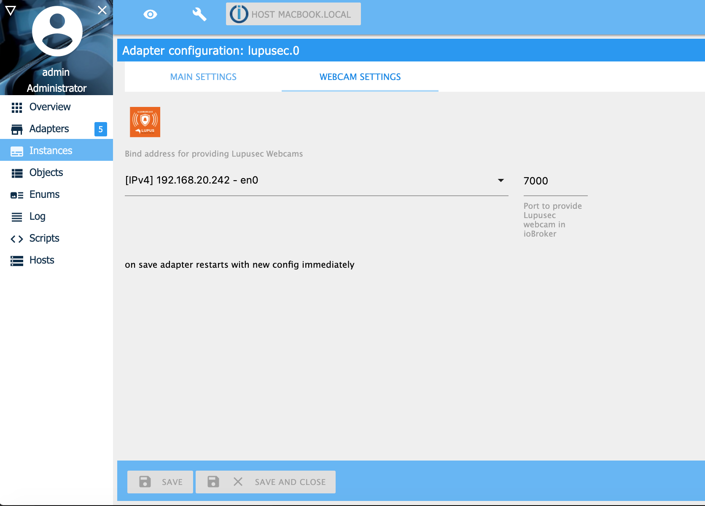
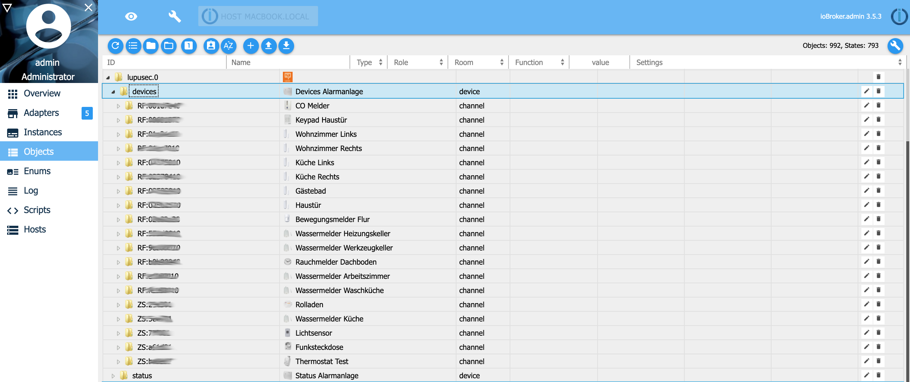
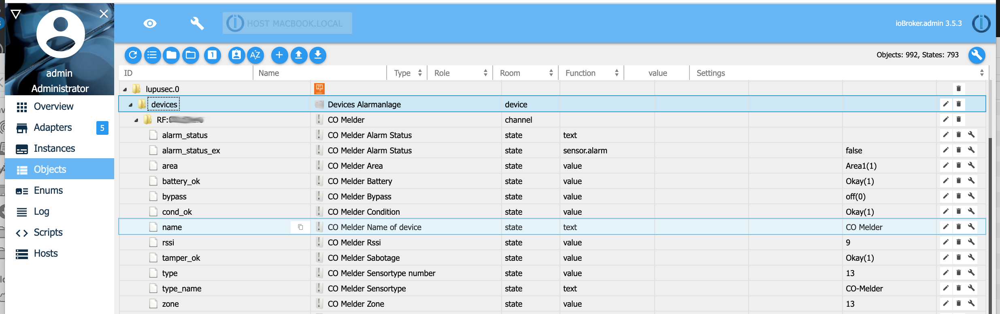
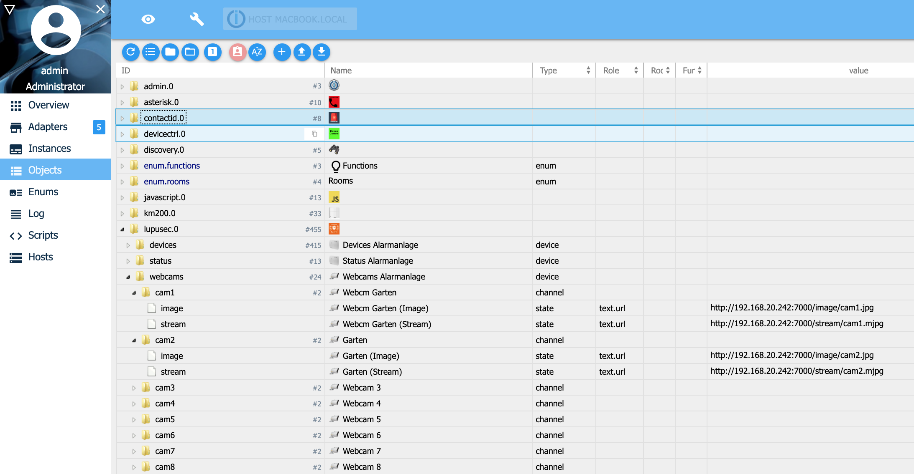

# IoBroker.lupusec
**需要 node.js 18.0 或更高版本以及 Admin v5！**

该适配器将 Lupusec 报警系统 XT1 Plus、XT2、XT2 Plus 和 XT3 与 ioBroker 连接。
不支持 XT1（不带 Plus）。您可以读取 Lupusec 传感器的状态，如门、窗、水、烟雾传感器以及报警系统的状态。
例如，您可以打开开关、控制快门以及布防/撤防警报系统。
由于适配器必须多次调用警报系统才能获取状态和设备的所有信息，因此 CPU 负载和内存使用率很高。要减少 CPU 负载，您可以增加轮询时间。

您可以在此处找到详细信息：[狼疮](https://www.lupus-electronics.de/en)

＃＃ 安装
1. 安装适配器

   最简单的方法是通过 ioBroker 中的发现适配器配置 lupusec.iobroker 适配器。发现适配器搜索 Lupusec 报警系统的正确 IP 地址。另一种方法是手动配置

2. 手动配置适配器

从 Lupusec 报警系统中选择 IP 地址或主机名和端口。如果您使用 https，请激活 https 标志。如果没有安装 http，则安装 https 时 CPU 负载会更高。
如果仅读取状态，请选择没有写入权限的用户。如果您想更改状态（例如，打开/关闭灯或布防/撤防警报），请选择具有写访问权限的用户。
使用 polltime，您可以配置调用警报系统的频率。高轮询时间会降低 CPU 负载。

 如果您的 Lupusec 报警系统连接有监控摄像头，您可以在 ioBroker 中提供它们。 Lupusec 适配器自行查找所有 Lupusec 凸轮。您必须输入一个地址（您的 ioBroker IP 地址或 0.0.0.0）和一个端口，以便稍后连接到摄像头。
 如果您将 Nuki 开门器连接到 Lupusec 报警系统，您也可以从 ioBroker 使用它。在 ioBroker 实例管理菜单上，您可以输入安装在 Nuki 门上的 Lupusec 门传感器。如果您现在打开安装 Nuki 的门，您会看到附加状态“门打开”，而不是“解锁”。如果您的 Nuki 门上没有 Lupusec 门传感器，您只会看到“已锁定”或“已锁定”状态。


默认情况下，所有 Lupusec 设备都将显示在 ioBroker 对象选项卡上。
以下设备完全支持并单独调整：

- 门触点/窗触点（类型 4）
- 水传感器（5 型）
- 紧急按钮（7 型）
- 运动探测器/360 度运动探测器（类型 9）
- CO 传感器（13 型）
- 烟雾探测器/感温探测器（14 型）
- 温度传感器 V2（20 型）
- 内置警报器（21 型）
- 状态指示器/迷你室内警报器（22 型）
- 电源开关（24 型）
- 1 个通道继电器，带 ZigBee 中继器（类型 24）
- 带 ZigBee 中继器的 2 通道继电器（类型 24）
- Repater V2（26型）
- 键盘（37 型）
- 玻璃传感器（39 型）
- 内置警报器（45 型）
- 室外警报器（48 型）
- 电源开关表（48 型）
- 电表（50 型）
- 通用红外控制器（52 型）
- 房间传感器 V1（54 型）
- LCD 温度传感器（54 型）
- 迷你温度（54 型）
- Nuki 开门器（57 型）
- 热探测器（58 型）
- 调光器（66 型）
- 灯开关 V2（66 型）
- 色调（74 型）
- 卷帘继电器 V1（76 型）
- 散热器恒温器（79 型）
- 散热器恒温器 V2（79 型）
- 光传感器（78 型）
- 场景切换 V2（81 型）
- 震动传感器（93 型）
- 烟雾探测器 V2（类型 14）
- 带调光器 V3 的入墙式继电器（66 型）
- 室外键盘 V2（17 型）

Apple Homekit 适配器 yahka 支持两个状态 apple_home_a1 和 lupusec.0.status.apple_home_a2。除了 lupusec 状态之外，您还可以打开和关闭区域 1 和 2 的警报系统。

如果您拥有的设备未在上面的列表中列出，请通过 Thorsten Stueben <thorsten@stueben.de> 与我联系。

## 对象
### Lupusec 状态
ioBroker 为您提供与 Lupusec 应用程序中相同的状态对象。


### Lupusec 设备
您可以在“设备”下找到所有受支持的 Lupsec 传感器和设备。如果设备丢失，请联系我。
 传感器或设备的详细视图。在此示例中，您将看到 CO 传感器。在 CO 警报时，状态“alarm_status_ex”更改为 true，“alarm_status”更改为“CO”。


### Lupusec 网络摄像头
您可以在“网络摄像头”下找到所有连接的监控摄像头。您可以将“图像”和“流”状态下提供的链接复制到网络浏览器中打开。


### 卢普塞克·努基
您可以在 Lupusec 设备等“设备”下找到 Nuki 开门器。 Nuki 提供 2 个状态。状态 nuki_state 显示 Nuki 开门器的实际状态，例如门已锁定或解锁。通过状态 nuki_action 您可以打开、锁定或解锁您的门。


### Lupusec 短信
如果您使用带有短信 SIM 卡的 Lupusec XT1+、XT2+ 或 XT3，您可以发送具有以下状态的短信：

或者，您可以使用以下命令从 JavaScript 发送短信：

```
sendTo('lupusec.0', 'sms', { number: '+4917247114711', text: 'Test message' });
```

如果您使用 SMS 网关，您可以在脚本中使用以下命令：

```
sendTo('lupusec.0', 'smsgw', { number: '+4917247114711', text: 'Test message' });
```

＃＃ 故障排除
如果您启动 Lupusec 适配器并收到警报系统无法访问的错误，请尝试从 ioBroker 系统的终端窗口对系统执行 ping 操作。

```
ssh <user>@<iobroker-ip-address>
sudo -u iobroker ping <lupsec-ip-address>
```

如果您收到错误_ping：icmp open socket：不允许操作_请执行以下操作，然后再次启动 Lupusec 适配器。

```
ls -l `which ping`
sudo chmod u+s `which ping`
```

## 计划中
未来计划做以下几件事：

- 支持更多传感器/设备
- 为每个传感器/设备编写[文档](docs/en/info.md)

## Changelog

### 2.0.0 (06.01.2023)

-   (Stübi) Redesign - changed everything from JavaScript to TypeScript
-   (Stübi) Using axios for http requests
-   (Stübi) the configuration changed. You have to edit the configuration

## License

The MIT License (MIT)

Copyright (c) 2024 Thorsten Stueben <thorsten@stueben.de>

Permission is hereby granted, free of charge, to any person obtaining a copy
of this software and associated documentation files (the "Software"), to deal
in the Software without restriction, including without limitation the rights
to use, copy, modify, merge, publish, distribute, sublicense, and/or sell
copies of the Software, and to permit persons to whom the Software is
furnished to do so, subject to the following conditions:

The above copyright notice and this permission notice shall be included in
all copies or substantial portions of the Software.

THE SOFTWARE IS PROVIDED "AS IS", WITHOUT WARRANTY OF ANY KIND, EXPRESS OR
IMPLIED, INCLUDING BUT NOT LIMITED TO THE WARRANTIES OF MERCHANTABILITY,
FITNESS FOR A PARTICULAR PURPOSE AND NONINFRINGEMENT. IN NO EVENT SHALL THE
AUTHORS OR COPYRIGHT HOLDERS BE LIABLE FOR ANY CLAIM, DAMAGES OR OTHER
LIABILITY, WHETHER IN AN ACTION OF CONTRACT, TORT OR OTHERWISE, ARISING FROM,
OUT OF OR IN CONNECTION WITH THE SOFTWARE OR THE USE OR OTHER DEALINGS IN
THE SOFTWARE.