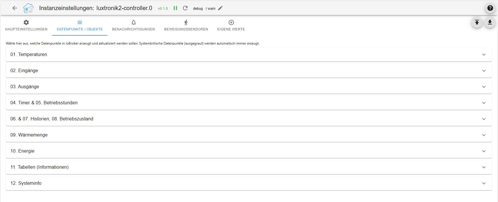
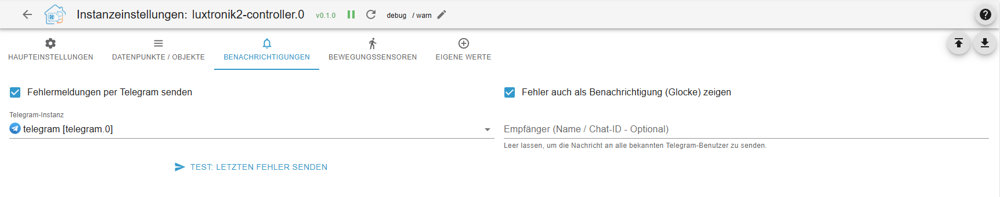
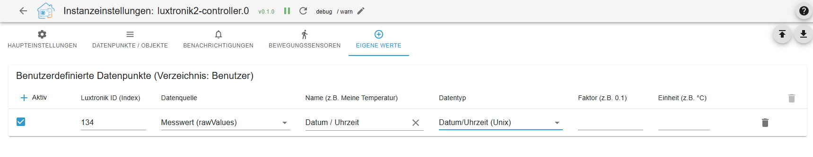

# IoBroker.luxtronik2-controller
**测试：** 

## 适用于 ioBroker 的 luxtronik2 控制器适配器
此ioBroker适配器支持对[Luxtronik 2.x 控制器](https://www.alpha-innotec.com/en/products/accessories/control/luxtronik)（例如，Alpha Innotec、Novelan）的热泵进行本地控制和监控。该适配器完全使用TypeScript编写。

## 致谢与历史
本项目建立在现有开源项目的初步工作之上。特别感谢：

[布尼](https://github.com/bouni/luxtronik-2) 其开创性工作和代码开发为与 Luxtronik 控制器通信奠定了基本基础。

[酷芯片：](https://github.com/coolchip/luxtronik2) 用于 Luxtronik 网络协议的基本逆向工程。

[UncleSamSwiss：](https://github.com/UncleSamSwiss/ioBroker.luxtronik2) 用于原始 ioBroker 适配器。

此版本创新之处：luxtronik2 控制器原生集成了 TCP 通信（端口 8888/8889），无需依赖外部库。此外，还实现了控制宏、压缩机保护逻辑和自动化数据点管理。

＃＃ 特征
- 原生 TCP 通信：直接连接到热泵，无需额外开销。

- 压缩机保护（循环优化）：将供暖和生活热水循环结合起来，以减少压缩机启动次数。

- 集成操作（宏）：预定义的强制加热、热水请求和循环泵（ZIP）控制逻辑，包括自动回退到默认值。

- 自定义数据点：可通过适配器配置添加测量值（索引 3004）和参数（索引 3003）。Unix 时间戳会自动格式化。

- 自动对象管理：适配器重启后，取消选择或删除的数据点和空文件夹结构将自动从 ioBroker 中删除。

- 通知系统：热泵故障代码可以直接发送到 Telegram 或 ioBroker 通知系统。

- 运动检测器耦合：可通过现有的 ioBroker 运动传感器按需激活循环泵。

## ⚠️ 警告
此集成提供的某些设置可能会影响热泵的性能。配置错误可能导致控制器进入故障状态，需要现场手动重置。

本项目旨在通过将配置选项限制在安全值范围内来保护您的热泵。但是，我们无法做出任何保证。请务必谨慎操作，查阅您的 Luxtronik 用户手册，切勿更改任何您不完全理解的设置。

## 🔧 兼容性
该集成方案允许您使用 Luxtronik2 控制器监控和控制热泵。它无需互联网连接即可在本地运行。

该方案已使用 Alpha Innotec 的 LWD50A (LD5) 进行过测试，目前仍在测试中。

## ⚠️ 免责声明 / Haftungsausschluss ⚠️
该项目由 Alpha Innotec、Novelan、ait-deutschland GmbH 或 Herstellern 共同完成。这是一个私人开源项目，是一个开放源代码项目。适配器的工作原理是正确的。

本项目与 Alpha Innotec、Novelan、ait-deutschland GmbH 或任何其他公司均无关联。这是一个利用业余时间维护的个人项目。使用风险自负。

## 报告错误和贡献代码
错误报告、特定固件版本的兼容性说明或功能请求可以通过 [GitHub 仓库](https://github.com/TbsJah/ioBroker.luxtronik2-controller/issues) 中的问题跟踪器提交。

＃＃ 信息
[信息德语](documentation/readme_de.md)

[信息英文](documentation/readme_en.md)

## Changelog

// ### **WORK IN PROGRESS**
### 0.6.5 (2026-08-07)

- review / fix findings reported by claude based checker.

### 0.6.4 (2026-07-23)

- Refactoring

### 0.6.3 (2026-07-23)

**Features & Enhancements**

- **External Actor Support for ZIP (100% Flash Safe):** Added the ultimate hardware protection feature. Users can now configure a list of external actors (e.g., Shelly or Zigbee relays) via their object IDs in the Admin UI. When motion is detected, the adapter switches these relays directly, completely bypassing the heat pump and reducing Luxtronik EEPROM write cycles to absolute zero.
- **External Actor Schedule Compliance:** External ZIP actors now dynamically respect the Luxtronik ZIP time tables (Week, 5+2, or Individual days). Motion triggers will be cleanly ignored if they occur outside the permitted time windows, unless the user explicitly checks the "Disable Hardware ZIP Timers" option in the configuration.
- **Hot Water Sync for External Actors:** The adapter now automatically activates external circulation pump relays when the heat pump begins a hot water generation cycle, maximizing comfort at the tap with zero impact on flash memory wear.
- **Global EEPROM Flash Protection (Read-Before-Write):** Implemented a global interceptor for all hardware write commands (`writePumpSafe`). The adapter now caches the current heat pump parameters in real-time and strictly blocks any duplicate or redundant write requests before they are sent over the network.
- **Automated Hardware-Safe ZIP Defaults:** The adapter can now automatically enforce hardware-safe circulation pump schedules upon startup. Accounts for Luxtronik firmware behavior by intelligently setting the first start block to `00:01:00` (60 seconds) to prevent invalid zero-run rejections, while keeping ON-time at `0 min` and OFF-time at `60 min`.
- **Admin UI - Flash Wear Statistics & Guidance:** Expanded the ZIP configuration page with detailed educational information. Added hard data explaining that internal ZIP control causes between 4 and 14 physical write operations per activation, highly recommending the new external actor setup.
- **Write Cycle Monitoring:** Introduced two new virtual data points under System Info (`write_cycles_today` and `write_cycles_total`) to transparently track physical write operations sent to the heat pump. The daily counter automatically resets every night at midnight.
- **Cooling Extension & Intelligent Status:** Comprehensive integration of new cooling data points (e.g., `cooling_status`, `cooling_configured`, `opStateCooling`). Added the dynamically calculated `opStateCoolingString`.
- **Admin UI - Notification Testing:** Added a dedicated "Send Test Message" button to the configuration interface to easily verify Telegram and ioBroker Notification Center setups directly from the UI.
- **Hardened ZIP Macro Execution:** Reaffirmed and secured the ZIP demand-driven macro to exclusively use the deaeration program (Entlüftungsprogramm).
- **New Flow Rate Datapoints:** Added flow rate tracking for the heat source (`flow_rate_heat_source`, ID 173) and cooling (`flow_rate_cooling`, ID 254) to the state mapping.
- **Extended Admin UI:** All newly added cooling data points and the heat source flow rate can now be individually enabled or disabled via new checkboxes in the adapter configuration (`jsonConfig.json`).
- **New Hardware Supported:** Officially added the MSW2-9S heat pump to the model recognition (`HP_TYPES`).

**Bugfixes**

- **Motion Sensor Cooldown Logic:** Fixed an issue where the 10-minute anti-cycling cooldown for motion sensors was perpetually stuck when using external relays. The logic now correctly monitors the virtual `Activate_Zip` state's timestamp instead of the bypassed internal `ZIPout` state.
- **Virtual State Reset:** Fixed a bug where the `Activate_Zip` button/state remained `true` after an external relay timer expired, which broke subsequent cooldown calculations. It now cleanly resets to `false` when the run cycle finishes.
- **External Actor State Detection:** Fixed a logic flaw where the adapter incorrectly checked the internal heat pump state (`ZIPout`) instead of the external relay state to determine if the circulation pump was already running. It now dynamically checks `getForeignStateAsync` for configured actors, cleanly preventing redundant switch commands and allowing silent timer extensions if motion is re-detected.
- **Timer Formatting in Objects:** Fixed a bug where timer schedules (Heating, Hot Water, Circulation) were incorrectly displayed as raw seconds (e.g., `60` or `0`). Applied the internal duration formatter (`isDurationFormat: true`) globally so all time tables natively and persistently display as `HH:MM:SS` (e.g., `00:01:00`) in the ioBroker object tree.
- **Admin UI i18n Compliance:** Fixed missing language definitions (E5611) in the `jsonConfig.json` dropdown menus to strictly comply with the latest ioBroker repository checks.
- **TypeScript/Linter Strictness:** Fixed strictly typed linter errors (e.g., `@typescript-eslint/no-floating-promises`, `no-redundant-type-constituents`, and template literal typings) by correctly handling asynchronous database calls, replacing `any` with `unknown`, and strictly casting types.
- **Missing Imports:** Resolved compilation errors regarding missing helper functions (e.g., `getDpPath`) during module refactoring.
- **Cooling Operating Hours:** Fixed the `hours_cooling` datapoint. The value is now correctly read from real-time telemetry data (`raw_value`), resolving an issue where the timestamp "Jan 1, 1970" was incorrectly shown.
- **Config Cleanup:** Fixed an incorrect identifier in the admin UI (changed `sync_Gerätezeit` to `sync_deviceTime`) and removed unused/dead checkboxes.

**Technical Changes (Under the Hood)**

- **Separation of Concerns (zipManager):** Completely refactored the motion sensor and circulation pump logic. Extracted the event handling and startup initialization out of `main.ts` into `zipManager.ts`. It now also dynamically handles iterations over arrays of external actors.
- **Network Queue Isolation:** Extracted the core transmission queue (`queueWrite`, `processQueue`) from the main adapter class into `rawFunctions.ts`, achieving 100% isolation of TCP/WebSocket network logic from ioBroker state management.
- **Comprehensive Code Refactoring (DRY):** Created dedicated `convert.ts` and `utils.ts` modules to centralize time string formatting (`timeStringToSeconds`, `formatTimerSecondsToTime`) and generic helper functions (`getNumber`, `delay`).
- **Global Time Refactoring:** Centralized the duration and time calculation for status texts in the `updateStatusStrings` function.
- **i18n Support for State Names:** Updated the internal state definition (`name: string | { en: string; de?: string }`) to fully support translation objects, allowing natively translated datapoint names in the ioBroker object tree.

### 0.6.2 (2026-07-17)

**Added**

- Bilingual support (i18n): Full support for English and German (adapter settings, state names, dropdown menus, and dynamic status texts).
- Language selection: Added a new dropdown menu in the adapter settings to freely choose the preferred output language for the ioBroker object tree.
- Firmware 3.x compatibility: Implemented an intelligent fallback system that dynamically calculates the status texts (heatpump_state_string) and runtime (heatpump_duration) from the main operating state. This is required because modern Luxtronik controllers no longer transmit the old LCD text lines.

**Fixed**

- Incorrect heating state (Frost protection): Fixed an issue where a switched-off heating system was incorrectly displayed as "Frost protection". The code now evaluates the correct index for the heating operating state (opStateHeating / 125) instead of incorrectly calculating it via the parameter.
- Timer display: Restored the clean HH:MM:SS formatting in the ioBroker UI without the annoying "s" (seconds) by introducing an internal isDurationFormat flag.
- Timer glitch fixed: When the compressor is idle, 00:00:01 (1 second) was often incorrectly displayed. This is now cleanly filtered to 00:00:00.
- ioBroker Repo-Checker warnings: Added the missing write: true property to the timer table selection states (role: "level") to fix the E1011 error.

**Technical**

- Fixed ESLint warnings (dot-notation) for object properties.

### 0.6.1 (2026-07-17)

- Implemented fallback mechanism: Index 80 lc is used if 117-120 are empty.

## License

MIT License

Copyright (c) 2026 TbsJah <github.tbsjah@googlemail.com>

Permission is hereby granted, free of charge, to any person obtaining a copy
of this software and associated documentation files (the "Software"), to deal
in the Software without restriction, including without limitation the rights
to use, copy, modify, merge, publish, distribute, sublicense, and/or sell
copies of the Software, and to permit persons to whom the Software is
furnished to do so, subject to the following conditions:

The above copyright notice and this permission notice shall be included in all
copies or substantial portions of the Software.

THE SOFTWARE IS PROVIDED "AS IS", WITHOUT WARRANTY OF ANY KIND, EXPRESS OR
IMPLIED, INCLUDING BUT NOT LIMITED TO THE WARRANTIES OF MERCHANTABILITY,
FITNESS FOR A PARTICULAR PURPOSE AND NONINFRINGEMENT. IN NO EVENT SHALL THE
AUTHORS OR COPYRIGHT HOLDERS BE LIABLE FOR ANY CLAIM, DAMAGES OR OTHER
LIABILITY, WHETHER IN AN ACTION OF CONTRACT, TORT OR OTHERWISE, ARISING FROM,
OUT OF OR IN CONNECTION WITH THE SOFTWARE OR THE USE OR OTHER DEALINGS IN THE
SOFTWARE.

[Older changelogs can be found there](CHANGELOG_OLD.md)