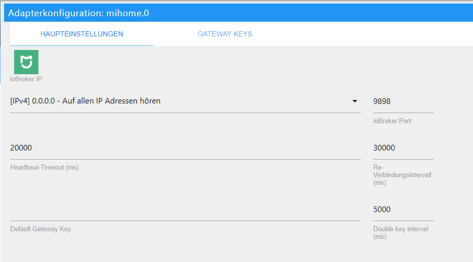
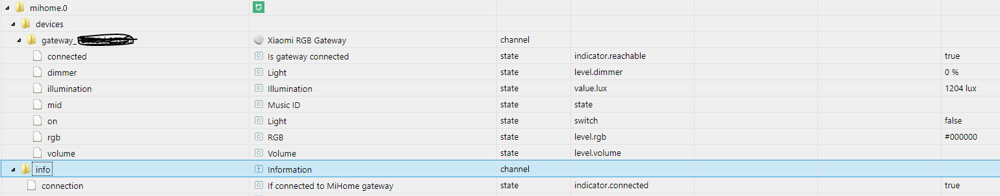

# IoBroker Mi Home Adapter 使用Mi Home Adapter，Mi Control Hub（网关）集成到ioBroker 系统中，从而使各种小米传感器、开关等能够与ioBroker 通信。
通过 ioBroker，例如可以控制网关的照明和扬声器。

＃＃ 要求
* Android 或 iOS 设备上的 Mi Home 应用程序并激活本地网络功能
* 连接小米家庭网关
* 运营ioBroker系统

### 安装米家APP并激活本地网络功能
＃＃＃＃ 安卓
* [Android 应用] (https://play.google.com/store/apps/details?id=com.xiaomi.smarthome) 在 Android 设备上，下载、安装、打开和

同意条款与条件。

*选择*中国大陆*作为国家
* 通过 *登录* 创建一个帐户
* 注册成功后，通过`+`添加设备
* 在 *家庭安全* 下选择“MI Control Hub”并按照说明进行操作

结果

* 成功集成网关后，屏幕右上角的3个点

然后按 *关于*

* 输入文字 *插件版本* 下面 10 次
* 现在开发者模式已打开，它应该在一段时间后

出现另外 2 个菜单项 > 如果没有，请重试

* 选择菜单项`无线通信协议`
* 打开顶部的滑动开关，记下密码并按“OK”确认。

> 稍后在 ioBroker 安装过程中将需要密码。

现在可以使用 `+` 符号教授更多设备。

#### IOS
* [iOS App] (https://itunes.apple.com/de/app/mi-home-xiaomi-smarthome/id957323480?mt=8) 下载、安装、打开和

我同意隐私政策

* 通过配置文件/设置/国家设置选择国家 *大陆*
* 通过 *登录* 创建一个帐户
* 注册成功后，通过`+`添加设备
* 在 *家庭安全* 下选择“MI Control Hub”并按照说明进行操作

结果

* 成功集成网关后，屏幕右上角的3个点

按下并按下 *关于*

* 在下方空白区域反复点击
* 现在开发者模式已打开，它应该在一段时间后

更多菜单项出现> 如果它没有立即工作，重复这些步骤

* 选择第四个菜单项
* 打开顶部的滑动开关，记下密码并按“OK”确认。

> 稍后在 ioBroker 安装过程中将需要密码。

现在可以使用 `+` 符号教授更多设备。

###在路由器上设置
在About/Hub info下，网关使用的网关IP地址可以在_localip_后面的文字中确定。在使用的路由器中，这个IP应该永久分配给网关。
如果您不想再通过应用程序操作示教设备，也可以在路由器中示教所有设备后关闭网关的 Internet 访问。

### 支持的设备
以下列表并不声称是完整的：

- 网关 - 小米RGB网关
- sensor_ht - 小米温度/湿度
- weather.v1 - 小米温度/湿度/压力
- 开关 - 小米无线开关
- sensor_switch.aq2 - 小米Aqara无线开关传感器
- sensor_switch.aq3 - 小米Aqara无线开关传感器
- 插头 - 小米智能插头
- 86plug - 小米智能墙插
- 86sw2 - 小米无线双壁开关
- 86sw1 - 小米无线单壁开关
- natgas - 小米米家霍尼韦尔气体报警探测器
- 烟雾 - 小米米家霍尼韦尔火灾报警探测器
- ctrl_ln1 - 小米Aqara 86防火墙一键开关
- ctrl_ln1.aq1 - 小米Aqara墙壁开关LN
- ctrl_ln2 - 小米86零防火墙开关双键
- ctrl_ln2.aq1 - 小米Aqara墙壁开关LN双键
- ctrl_neutral2 - 小米有线双壁开关
- ctrl_neutral1 - 小米有线单壁开关
- 立方体 - 小米立方体
- sensor_cube.aqgl01 - 小米魔方
- 磁铁 - 小米门磁
- sensor_magnet.aq2 - 小米Aqara门磁
- 窗帘 - 小米Aqara智能窗帘
- 运动 - 小米运动传感器
- sensor_motion.aq2 - 小米Aqara运动传感器
- sensor_wleak.aq1 - 小米Aqara水传感器
- ctrl_ln2.aq1 - 小米Aqara墙壁开关LN（双）
- remote.b286acn01 - 小米Aqara无线遥控开关（双摇杆）
- remote.b1acn01 - 小米Aqara无线遥控开关
- 振动 - 小米振动传感器
- wlak1 - 小米 Aqara 水传感器
- lock_aq1 - 小米锁

## IoBroker Mi Home Adapter 安装
进一步的设置只能通过 ioBroker 管理界面进行。
在区域 *Adapter* 中搜索适配器并使用 `+` 符号进行安装。

然后会打开以下配置窗口：

在 `Default Gateway Key` 下输入上面确定的密码，然后使用 * save * * 和 close * 关闭窗口。正在运行的适配器应该在 * Instances * 下显示为绿色：

网关及其示教设备现在显示在 *对象* 下：

这些说明是根据我们的知识和信念创建的。

## Changelog
### 1.3.8 (2021-09-13)
* (VLGorskij) fixed the error messages for some states
 
### 1.3.7 (2021-01-22)
* (Apollon77) Prevent crash case (Sentry IOBROKER-MIHOME-A)

### 1.3.6 (2020-09-25)
* (VLGorskij) Added new device QBKG24LM

### 1.3.5 (2020-09-17)
* (Apollon77) Fix crash cases (Sentry IOBROKER-MIHOME-1..4)

### 1.3.4 (2020-08-31)
* (Alan) Fixed the crash for non existing attributes 

### 1.3.3 (2020-08-26)
* (bluefox) Sentry is activated

### 1.3.2 (2020-08-25)
* (VLGorskij) Added ac-partner.v3 support
* (bluefox) Added compact mode

### 1.3.1 (2020-08-19)
* (Diginix) Fixed calculation for sensor's battery percentage

### 1.3.0 (2020-01-16)
* (algar42) Ability to add devices with missing model by their SID ([e.g. for Aqara two-channel relay](https://github.com/algar42/ioBroker.mihome#usage))

### 1.2.9 (2019-11-15)
* (Diginix) Fixed pressure range and values of Aqara weather sensor

### 1.2.8 (2019-07-18)
* (SchumyHao) Change curtain and gateway light role that making them can be detected by type-detector

### 1.2.7 (2019-06-25)
* (SchumyHao) Add several devices support for protocol 2.0.x

### 1.2.6 (2019-03-04)
* (Diginix) Improved calculation for sensor's battery percentage

### 1.2.5 (2019-01-24)
* (Vanwards) Added long click for Aquara wall switch

### 1.2.4 (2019-01-15)
* (SchumyHao) Add Chinese support

### 1.2.3 (2018-10-23)
* (goohnie) New wall switch was added

### 1.2.0 (2018-10-12)
* (bluefox) refactoring

### 1.1.2 (2018-10-08)
* (bluefox) New button switch was added

### 1.1.1 (2018-09-23)
* (bluefox) Fixed the creation of new devices

### 1.1.0 (2018-09-13)
* (bluefox) New devices added:  sensor_switch.aq3, ctrl_ln1.aq1, ctrl_ln2.aq1, sensor_cube.aqgl01, remote.b286acn01, vibration, wleak1, lock_aq1
* (bluefox) Names will be taken from gateway

### 1.0.7 (2018-06-25)
* (bluefox) The heartbeat timeout and the re-connection interval settings were added

### 1.0.6 (2018-05-26)
* (bluefox) Added new Aqara cube sensor

### 1.0.5 (2018-03-05)
* (bluefox) Xiaomi Aqara Wall Switch LN Double was added

### 1.0.4 (2018-01-21)
* (bluefox) The alarm state was fixed.

### 1.0.3 (2018-01-21)
* (bluefox) Invalid temperature values will be ignored

### 1.0.2 (2018-01-14)
* (bluefox) Ignore unknown state of sensors

### 1.0.0 (2018-01-05)
* (bluefox) Do not overwrite the names
* (bluefox) Ready for Admin3

### 0.3.3 (2017-11-26)
* (bluefox) Allow multiple mihome gateways

### 0.2.4 (2017-11-04)
* (bluefox) Add aqara water sensor

### 0.2.3 (2017-09-22)
* (bluefox) Remove "." from id of the device

### 0.2.2 (2017-08-01)
* (bluefox) Set after 300ms doublePress to false by Temperature Sensor\nAllow control of Plug

### 0.2.1 (2017-07-29)
* (bluefox) Implement double click on temperature sensor

### 0.2.0 (2017-07-18)
* (bluefox) fix battery level

### 0.1.4 (2017-06-09)
* (bluefox) add cube
* (bluefox) remove voltage by gateway

### 0.1.1 (2017-06-06)
* (bluefox) Initial commit

## License
MIT

Copyright (c) 2017-2021 bluefox <dogafox@gmail.com>