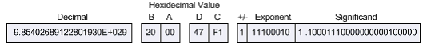
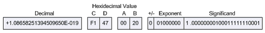
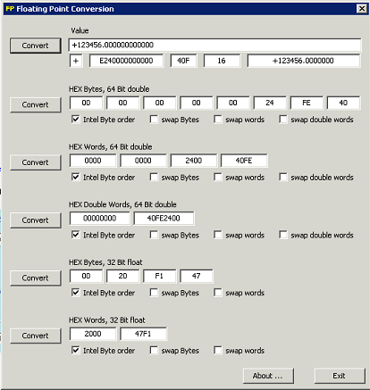

# Iobroker.modbus
 [](https://weblate.iobroker.net/engage/adapters/?utm_source=widget)

**此适配器使用 Sentry 库自动向开发人员报告异常和代码错误。** 有关更多详细信息以及如何禁用错误报告的信息，请参阅 [Sentry-插件文档](https://github.com/ioBroker/plugin-sentry#plugin-sentry)!从 js-controller 3.0 开始使用哨兵报告。

ioBroker 的 ModBus Slave 和 Master 的实现。支持以下类型：

- Modbus RTU 通过串行（主站）
- 基于 TCP 的 Modbus RTU（主站）
- Modbus TCP（从站，主站）

##设置
### 合作伙伴 IP 地址
modbus 伙伴的 IP 地址。

＃＃＃ 港口
如果配置为主机（客户端）或自己的端口（如果配置为从机（服务器）），则 modbus 伙伴的 TCP 端口。

＃＃＃ 设备编号
Modbus 设备 ID。如果使用 TCP/Modbus 桥接器，这一点很重要。

＃＃＃ 类型
从（服务器）或主（客户端）。

### 使用别名作为地址
通常所有寄存器的地址都可以从 0 到 65535。通过使用别名，您可以为每种类型的寄存器定义虚拟地址字段。一般：

- 离散输入从 10001 到 20000
- 线圈从 1 到 1000
- 输入寄存器从 30001 到 40000
- 保持寄存器从 40001 到 60000

每个别名都将在内部映射到地址，例如30011 将被映射到输入寄存器 10。等等。

###不要将地址与字对齐
通常，线圈和离散输入地址对齐为 16 位。从 3 到 20 的类似地址将与 0 到 32 对齐。
如果此选项处于活动状态，地址将不会对齐。

### 圆形真实到
浮点数和双精度数的逗号后有多少位数字。

### 轮询延迟
循环轮询间隔（仅与 master 相关）

###重新连接时间
重连间隔（只与master相关）

###脉冲时间
如果脉冲用于线圈，这定义了脉冲的间隔时间。

### 最大读取请求长度
命令 READ_MULTIPLE_REGISTERS 的最大长度作为要读取的寄存器数。

一些系统需要首先“写请求”来传递“读请求”上的数据。
您可以通过将“最大读取请求长度”设置为 1 来强制使用此模式。

**注意：** 某些 USB Modbus 解决方案（例如基于 socat）可能无法使用串行端口 npm 模块。

有一个软件 [**Modbus RTU <-> TCP 上的 Modbus RTU**](http://mbus.sourceforge.net/index.html) 网关可以通过 TCP 协议使用串行 RTU。

**RTU over TCP** 和 **TCP** 两种解决方案都运行良好。

###不要使用多个寄存器
如果从机不支持“写入多个寄存器”命令，您可以激活它以获取警告，当多个寄存器将被写入时。

### 写入间隔
两次写入请求之间的延迟（以毫秒为单位）。默认 0。

## 配置中单个地址行的参数
＃＃＃ 地址
要读取的 Modbus 地址

###从属ID
如果有多个从站，那么这就是 id，如果不是全局配置中给出的默认值

＃＃＃ 名称
这是参数的名称

＃＃＃ 描述
参数说明

＃＃＃ 单元
参数单位

＃＃＃ 类型
从总线读取的数据类型。有关可能的数据类型的详细信息，请参阅数据类型部分

＃＃＃ 长度
参数的长度。对于大多数参数，这是根据数据类型确定的，但对于字符串，这定义了以字节/字符为单位的长度

＃＃＃ 因素
该因子用于乘以来自总线的读取值以进行静态缩放。所以计算看起来像下面的 val = x * Factor + Offset

＃＃＃ 抵消
在上述乘法之后，该偏移量被添加到读取值中。所以计算看起来像下面的 val = x * Factor + Offset

＃＃＃ 公式
如果 Factor 和 Offset 不够用，此字段可用于高级计算。如果设置了该字段，则忽略 Factor 和 Offset 字段。
该公式由 eval() 函数执行。因此支持所有常用功能。尤其是数学函数。公式必须符合 Javascript 语法，因此也要注意大小写。

在公式中，“x”必须用于从 Modbus 读取的值。例如。 `x * Math.pow(10, sf['40065'])`

如果无法在运行时评估公式，则适配器将警告消息写入日志。

公式的另一个用例也可能是使用“x > 2000000 ? null : x”之类的公式来防止不合理的数据

＃＃＃ 角色
要分配的 ioBroker 角色。

＃＃＃ 房间
要分配的 ioBroker 房间。

### 投票
如果激活，将从从站以预定义的时间间隔轮询这些值。

### WP
写脉冲

### 连续波
循环写入

### 顺丰
使用值作为比例因子。这需要使用通过接口上的值提供的某些系统上的动态缩放因子。如果一个值用此 flac 标记，则该值将存储到具有以下命名约定的变量中：sf['Modbus_address']。此变量随后可用于其他参数的任何公式。例如。以下公式可以设置："(x * sf['40065']) + 50;"

## 数据类型
- uint16be - 无符号 16 位（大端）：AABB => AABB
- uint16le - 无符号 16 位（小端）：AABB => BBAA
- int16be - 有符号 16 位（大端）：AABB => AABB
- int16le - 有符号 16 位（小端）：AABB => BBAA
- uint32be - 无符号 32 位（大端）：AABBCCDD => AABBCCDD
- uint32le - 无符号 32 位（小端）：AABBCCDD => DDCCBBAA
- uint32sw - 无符号 32 位（大端字交换）：AABBCCDD => CCDDAABB
- uint32sb - 无符号 32 位（大端字节交换）：AABBCCDD => DDCCBBAA
- int32be - 有符号 32 位（大端）：AABBCCDD => AABBCCDD
- int32le - 有符号 32 位（小端）：ABBCCDD => DDCCBBAA
- int32sw - 有符号 32 位（大端字交换）：AABBCCDD => CCDDAABB
- int32sb - 有符号 32 位（大端字节交换）：AABBCCDD => DDCCBBAA
- uint64be - 无符号 64 位（大端）：AABBCCDDEEFFGGHH => AABBCCDDEEFFGGHH
- uint64le - 无符号 64 位（小端）：AABBCCDDEEFFGGHH => HHGGFFEEDDCCBBAA
- uint8be - 无符号 8 位（大端）：AA => AA
- uint8le - 无符号 8 位（小端）：AA => AA
- int8be - 有符号 8 位（大端）：AA => AA
- int8le - 有符号 8 位（小端）：AA => AA
- floatbe - Float (Big Endian): AABBCCDD => AABBCCDD
- floatle - Float (Little Endian): AABBCCDD => DDCCBBAA
- floatsw - Float (Big Endian Word Swap): AABBCCDD => CCDDAABB
- floatsb - Float（大端字节交换）：AABBCCDD => DDCCBBAA
- doublebe - Double (Big Endian)：AABBCCDDEEFFGGHH => AABBCCDDEEFFGGHH
- doublele - Double (Little Endian)：AABBCCDDEEFFGGHH => HHGGFFEEDDCCBBAA
- 字符串 - 字符串（零端）：ABCDEF\0 => ABCDEF\0
- stringle - 字符串（小端，零端）：BADCFE\0 => ABCDEF\0

以下描述复制自 [这里](http://www.chipkin.com/how-real-floating-point-and-32-bit-data-is-encoded-in-modbus-rtu-messages/)

如果没有其他原因，点对点 Modbus 协议是 RTU 通信的流行选择，因为它是基本的便利。协议本身控制 Modbus 网络上每个设备的交互、设备如何建立已知地址、每个设备如何识别其消息以及如何从数据中提取基本信息。从本质上讲，协议是整个 Modbus 网络的基础。

然而，这种便利并非没有一些复杂性，Modbus RTU 消息协议也不例外。协议本身是基于具有 16 位寄存器长度的设备设计的。因此，在实现 32 位数据元素时需要特别考虑。此实现决定使用两个连续的 16 位寄存器来表示 32 位数据或基本上 4 个字节的数据。单精度浮点数据可以在这 4 个字节的数据中编码为 Modbus RTU 消息。

### 字节顺序的重要性
Modbus 本身没有定义浮点数据类型，但人们普遍认为它使用 IEEE-754 标准实现 32 位浮点数据。但是，IEEE 标准没有明确定义数据负载的字节顺序。因此，处理 32 位数据时最重要的考虑因素是数据以正确的顺序寻址。

例如，IEEE 754 标准中为单精度 32 位浮点数定义的数字 123/456.00 显示如下：


各种字节顺序的影响是显着的。例如，以“B A D C”序列对表示 123456.00 的 4 字节数据进行排序，称为“字节交换”。当解释为 IEEE 744 浮点数据类型时，结果完全不同：



在“C D A B”序列中对相同字节进行排序称为“字交换”。同样，结果与原始值 123456.00 大不相同：



此外，“字节交换”和“字交换”本质上都将完全颠倒字节序列以产生另一个结果：


显然，在使用 Modbus 等网络协议时，必须严格注意传输时内存字节的顺序，也称为“字节顺序”。

### 确定字节顺序
根据 Modbus 应用协议规范 V1.1.b，Modbus 协议本身被声明为“大端”协议：

```Modbus uses a “big-Endian” representation for addresses and data items. This means that when a numerical quantity larger than a single byte is transmitted, the most significant byte is sent first.```

Big-Endian 是网络协议最常用的格式 - 事实上，它是如此常见，以至于它也被称为“网络顺序”。

鉴于 Modbus RTU 消息协议是 big-Endian，为了通过 Modbus RTU 消息成功交换 32 位数据类型，必须考虑主站和从站的字节序。许多 RTU 主从设备允许特定的字节顺序选择，特别是在软件模拟单元的情况下。人们只需确保所有单元都设置为相同的字节顺序。

根据经验，设备微处理器的家族决定了它的字节序。通常，在采用 Motorola 处理器设计的 CPU 中通常可以找到 big-Endian 样式（首先存储高位字节，然后是低位字节）。 little-Endian 样式（首先存储低位字节，然后是高位字节）通常在使用 Intel 架构的 CPU 中找到。至于哪种风格被认为是“落后的”，这是个人观点的问题。

但是，如果字节顺序和字节序不是可配置的选项，则必须确定如何解释字节。这可以通过从从设备请求一个已知的浮点值来完成。如果返回一个不可能的值，即具有两位数指数的数字等，则字节顺序很可能需要修改。

### 实用帮助
FieldServer Modbus RTU 驱动程序提供了多种处理 32 位整数和 32 位浮点值的函数移动。更重要的是，这些函数移动考虑了所有不同形式的字节排序。下表显示了 FieldServer 函数将两个相邻的 16 位寄存器复制为 32 位整数值的移动。

|功能关键字 |交换模式 |源字节 |目标字节 |
|-------------------|--------------------|-----------------|--------------|
| 2.i16-1.i32 |不适用 | [ a b ] [ c d ] | [ a b c d ] |
| 2.i16-1.i32-s |字节和字交换| [ a b ] [ c d ] | [ dc b a ] |
| 2.i16-1.i32-sb |字节交换| [ a b ] [ c d ] | [ b a d c ] |
| 2.i16-1.i32-sw |换字 | [ a b ] [ c d ] | [ c d a b ] |

下表显示了 FieldServer 函数将两个相邻的 16 位寄存器复制到 32 位浮点值的移动：

|功能关键字 |交换模式 |源字节 |目标字节 |
|-------------------|--------------------|-----------------|--------------|
| 2.i16-1.ifloat |不适用 | [ a b ] [ c d ] | [ a b c d ] |
| 2.i16-1.ifloat-s |字节和字交换| [ a b ] [ c d ] | [ dc b a ] |
| 2.i16-1.ifloat-sb |字节交换| [ a b ] [ c d ] | [ b a d c ] |
| 2.i16-1.ifloat-sw |换字 | [ a b ] [ c d ] | [ c d a b ] |

下表显示了 FieldServer 函数将单个 32 位浮点值复制到两个相邻的 16 位寄存器的移动：

|功能关键字 |交换模式 |源字节 |目标字节 |
|------------------|-------------------|-----------------|----------------|
| 1.float-2.i16 |不适用 | [ a b ] [ c d ] | [ a b ][ c d ] |
| 1.float-2.i16-s |字节和字交换| [ a b ] [ c d ] | [ dc ][ b a ] |
| 1.float-2.i16-sb |字节交换 | [ a b ] [ c d ] | [ b a ][ dc ] |
| 1.float-2.i16-sw |字交换 | [ a b ] [ c d ] | [ c d ][ a b ] |

鉴于各种 FieldServer 功能移动，32 位数据的正确处理取决于选择正确的数据。观察这些 FieldServer 函数在已知单精度十进制浮点值 123456.00 上的以下行为：

|16 位值 |功能移动 |结果 |功能移动 |结果 |
|---------------|-------------------|-----------|-------------------|---------------|
|0x2000 0x47F1 | 2.i16-1.float | 123456.00 | 1.float-2.i16 | 0x2000 0x47F1 |
|0xF147 0x0020 | 2.i16-1.float-s | 123456.00 | 1.float-2.i16-s | 0xF147 0X0020 |
|0x0020 0xF147 | 2.i16-1.float-sb | 123456.00 | 1.float-2.i16-sb | 0x0020 0xF147 |
|0x47F1 0x2000 | 2.i16-1.float-sw | 123456.00 | 1.float-2.i16-sw | 0x47F1 0x2000 |

请注意，不同的字节和字顺序需要使用适当的 FieldServer 函数 move。一旦选择了正确的功能移动，数据就可以双向转换。

在 Internet 上可用的许多十六进制到浮点转换器和计算器中，很少有真正允许操作字节和字顺序。一个这样的实用程序位于 www.61131.com/download.htm，可以下载该实用程序的 Linux 和 Windows 版本。安装后，该实用程序将作为具有单个对话框界面的可执行文件运行。该实用程序显示十进制浮点值 123456.00，如下所示：



然后可以交换字节和/或字来分析 Modbus RTU 主设备和从设备之间可能存在哪些潜在的字节序问题。

＃＃ 测试
文件夹 *test' 中有一些程序可以测试 TCP 通信：

- Ananas32/64 是从模拟器（只保存寄存器和输入，没有线圈和数字输入）
- RMMS 是主模拟器
- mod_RSsim.exe 是从模拟器。可能是您需要 [Microsoft Visual C++ 2008 SP1 Redistributable Package](https://www.microsoft.com/en-us/download/details.aspx?id=5582) 来启动它（因为 SideBySide 错误）。

<!-- 下一版本的占位符（在行首）：

### __工作进行中__ -->

## Changelog
### __WORK IN PROGRESS__
* (nkleber78) Corrected issue with the scale factors
* (bluefox) New react GUI added
* (bluefox) Add new option: Use only Write multiple registers

### 3.3.1 (2021-05-10)
* (bluefox) fixed the configuration dialog for "input registers" in slave mode 

### 3.3.0 (2021-04-16)
* (Apollon77) Allow to use write-only (no poll) states
* (Apollon77/TmShaz) F Write multiple registers
* (prog42) create states of type string with default value of type string

### 3.2.6 (2021-03-05)
* (Apollon77) Prevent a crash case (Sentry IOBROKER-MODBUS-20)
* (Apollon77) Better handle invalid responses

### 3.2.4 (2021-01-30)
* (Sierra83) also support ttyXRUSB0 style devices

### 3.2.3 (2021-01-21)
* (Apollon77) Catch value encoding error and do not crash adapter (Sentry IOBROKER-MODBUS-1W)
* (Apollon77) add a meta object as instance object

### 3.2.2 (2020-12-15)
* (Apollon77) prevent a rash case (Sentry IOBROKER-MODBUS-1S)

### 3.2.1 (2020-12-12)
* (Apollon77) prevent a crash case (Sentry IOBROKER-MODBUS-1R)

### 3.2.0 (2020-12-09)
* (nkleber78) Fixed formula where return keyword was missing

### 3.1.13 (2020-12-07)
* (nkleber78) Added the possibility to use formulas for values

### 3.1.12 (2020-12-05)
* (Apollon77) fix admin serial port selection

### 3.1.10 (2020-09-25)
* (nkleber78) Corrected: the exported data cannot be imported without modification

### 3.1.9 (2020-09-17)
* (Apollon77) Prevent crash case (Sentry IOBROKER-MODBUS-1C)  

### 3.1.7 (2020-07-23)
* (Apollon77) Fix some Sentry crash reports (IOBROKER-MODBUS-N)

### 3.1.6 (2020-07-06)
* (bluefox) Fix some Sentry crash reports (IOBROKER-MODBUS-J)

### 3.1.5 (2020-06-29)
* (Apollon77) Fix some Sentry crash reports (IOBROKER-MODBUS-F)

### 3.1.4 (2020-06-24)
* (Apollon77) Fix some Sentry crash reports (IOBROKER-MODBUS-4, IOBROKER-MODBUS-7, IOBROKER-MODBUS-6)
* (Apollon77) Change the way adapter restarts when reconnections do not help

### 3.1.3 (2020-06-12)
* (Apollon77) fix scheduled restart

### 3.1.2 (2020-06-12)
* (Apollon77) fix serialport list for Admin

### 3.1.1 (2020-06-11)
* (Apollon77) Add Sentry crash reporting when used with js-controller >=3.x

### 3.1.0 (2020-06-11)
* (Apollon77) Make sure that regular adapter stops do not terminate the process, so that scheduled restarts still work
* (Apollon77) update serialport, support nodejs 12/14

### 3.0.4 (2020-06-05)
* (bluefox) Added device ID by export/import
* (bluefox) Added the write interval parameter
* (bluefox) Added the disabling of write multiple registers

### 3.0.3 (2020-06-05)
* (bluefox) Corrected error after refactoring

### 3.0.2 (2020-06-01)
* (compton-git) Decodes 0xFF00 as coil ON

### 3.0.1 (2020-01-23)
* (BlackBird77) Fixes for Serial Timeouts done
* (bluefox) Refactoring

### 3.0.0 (2019-05-15)
* (Apollon77) Support for nodejs 12 added, nodejs 4 is no longer supported!

### 2.0.9 (2018-10-11)
* (Bjoern3003) Write registers was corrected

### 2.0.7 (2018-07-02)
* (bluefox) The server mode was fixed

### 2.0.6 (2018-06-26)
* (bluefox) rtu-tcp master mode was fixed

### 2.0.3 (2018-06-16)
* (bluefox) Fixed the rounding of numbers

### 2.0.2 (2018-06-12)
* (bluefox) The error with blocks reading was fixed
* (bluefox) The block reading for discrete values was implemented

### 2.0.1 (2018-05-06)
* (bluefox) Added the support of multiple device IDs

### 1.1.1 (2018-04-15)
* (Apollon77) Optimize reconnect handling

### 1.1.0 (2018-01-23)
* (bluefox) Little endian strings added
* (Apollon77) Upgrade Serialport Library

### 1.0.2 (2018-01-20)
* (bluefox) Fixed read of coils

### 0.5.4 (2017-09-27)
* (Apollon77) Several Fixes

### 0.5.0 (2017-02-11)
* (bluefox) Create all states each after other

### 0.4.10 (2017-02-10)
* (Apollon77) Do not recreate all datapoints on start of adapter
* (ykuendig) Multiple optimization and wording fixes

### 0.4.9 (2016-12-20)
* (bluefox) fix serial RTU

### 0.4.8 (2016-12-15)
* (Apollon77) update serialport library for node 6.x compatibility

### 0.4.7 (2016-11-27)
* (bluefox) Use old version of jsmodbus

### 0.4.6 (2016-11-08)
* (bluefox) backward compatibility with 0.3.x

### 0.4.5 (2016-10-25)
* (bluefox) better buffer handling on tcp and serial

### 0.4.4 (2016-10-21)
* (bluefox) Fix write of holding registers

### 0.4.1 (2016-10-19)
* (bluefox) Support of ModBus RTU over serial and over TCP (only slave)

### 0.3.11 (2016-08-18)
* (Apollon77) Fix wrong byte count in loop

### 0.3.10 (2016-02-01)
* (bluefox) fix lost of history settings.

### 0.3.9 (2015-11-09)
* (bluefox) Use always write_multiple_registers by write of holding registers.

### 0.3.7 (2015-11-02)
* (bluefox) add special read/write mode if "Max read request length" is 1.

### 0.3.6 (2015-11-01)
* (bluefox) add cyclic write for holding registers (fix)

### 0.3.5 (2015-10-31)
* (bluefox) add cyclic write for holding registers

### 0.3.4 (2015-10-28)
* (bluefox) add doubles and fix uint64

### 0.3.3 (2015-10-27)
* (bluefox) fix holding registers

### 0.3.2 (2015-10-27)
* (bluefox) fix import from text file

### 0.3.1 (2015-10-26)
* (bluefox) fix error with length of read block (master)
* (bluefox) support of read blocks and maximal length of read request (master)
* (bluefox) can define fields by import

### 0.3.0 (2015-10-24)
* (bluefox) add round settings
* (bluefox) add deviceID
* (bluefox) slave supports floats, integers and strings

### 0.2.6 (2015-10-22)
* (bluefox) add different types for inputRegisters and for holding registers ONLY FOR MASTER

### 0.2.5 (2015-10-20)
* (bluefox) fix names of objects if aliases used

### 0.2.4 (2015-10-19)
* (bluefox) fix error add new values

### 0.2.3 (2015-10-15)
* (bluefox) fix error with master

### 0.2.2 (2015-10-14)
* (bluefox) implement slave
* (bluefox) change addressing model

### 0.0.1
* (bluefox) initial commit

## License
The MIT License (MIT)

Copyright (c) 2015-2021 Bluefox <dogafox@gmail.com>

Permission is hereby granted, free of charge, to any person obtaining a copy
of this software and associated documentation files (the "Software"), to deal
in the Software without restriction, including without limitation the rights
to use, copy, modify, merge, publish, distribute, sublicense, and/or sell
copies of the Software, and to permit persons to whom the Software is
furnished to do so, subject to the following conditions:

The above copyright notice and this permission notice shall be included in
all copies or substantial portions of the Software.

THE SOFTWARE IS PROVIDED "AS IS", WITHOUT WARRANTY OF ANY KIND, EXPRESS OR
IMPLIED, INCLUDING BUT NOT LIMITED TO THE WARRANTIES OF MERCHANTABILITY,
FITNESS FOR A PARTICULAR PURPOSE AND NONINFRINGEMENT. IN NO EVENT SHALL THE
AUTHORS OR COPYRIGHT HOLDERS BE LIABLE FOR ANY CLAIM, DAMAGES OR OTHER
LIABILITY, WHETHER IN AN ACTION OF CONTRACT, TORT OR OTHERWISE, ARISING FROM,
OUT OF OR IN CONNECTION WITH THE SOFTWARE OR THE USE OR OTHER DEALINGS IN
THE SOFTWARE.