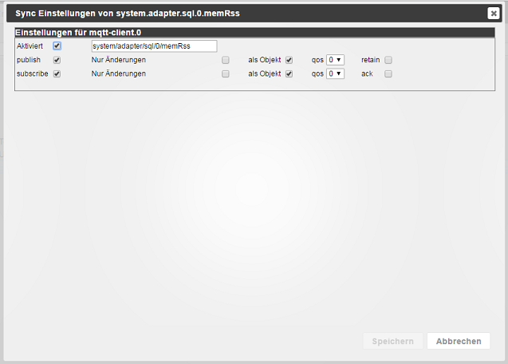

# IoBroker.mqtt-客户端
[](https://weblate.iobroker.net/engage/adapters/?utm_source=widget)</br> </br> **版本：** </br> </br> **测试：** </br> [](https://github.com/iobroker-community-adapters/ioBroker.mqtt-client/actions/workflows/test-and-release.yml) [](https://github.com/iobroker-community-adapters/ioBroker.mqtt-client/actions/workflows/codeql.yml)

## 哨兵
**此适配器使用 Sentry 库自动向开发人员报告异常和代码错误。** 有关更多详细信息以及如何禁用错误报告的信息，请参阅[Sentry 插件文档](https://github.com/ioBroker/plugin-sentry#plugin-sentry)!从 js-controller 3.0 开始使用 Sentry 报告。

## 适配器设置


### 关于连接主题和消息
每次客户端连接或重新连接到服务器时，```on connect message```都会发布到```on connect topic```。

### 关于断开主题和消息
当适配器正常停止时，```on disconnect message``` 将发布到 ```on disconnect topic```。

###最后的主题和消息
每次客户端连接或重新连接到服务器时，```last will message```都会发布到```last will topic```。
当客户端意外断开连接时，服务器将存储此消息并将其发送给其订阅者。

### 订阅
现有状态未涵盖的主题的逗号分隔列表。
接收到的消息将转换为适配器命名空间（例如 mqtt.0）内的状态并进行订阅。
创建所有状态后，您可以删除主题。

### 发布前缀
发布时，这将被添加到所有主题之前。
默认为空（无前缀）。

### 订阅前缀
订阅时，这将被添加到所有主题之前。
默认为空（无前缀）。

## 状态设置


### 已启用
启用或禁用此状态的 mqtt 客户端功能。
禁用将删除此状态下的任何 mqtt-client 设置。

＃＃＃ 话题
此状态发布和订阅的主题。
默认：state-ID 转换为 mqtt 主题。

### 发布
* ``启用````状态将被发布
* ```changes only``` 状态仅在其值发生变化时才会发布
* ```as object``` 整个状态将作为对象发布
* ```qos``` 请参阅 <http://www.hivemq.com/blog/mqtt-essentials-part-6-mqtt-quality-of-service-levels>
* ```retain``` 请参阅 <http://www.hivemq.com/blog/mqtt-essentials-part-8-retained-messages>

＃＃＃ 订阅
* ``enable```` 主题将被订阅并且状态将相应更新
* ```仅更改```状态仅在值更改时才会写入
* ```as object``` 消息将被解释为对象
* ```qos``` 请参阅 <http://www.hivemq.com/blog/mqtt-essentials-part-6-mqtt-quality-of-service-levels>
* 状态更新时“ack”将相应地设置 ack 标志

＃＃＃＃ 笔记
* 当 ack 设置为 true 时，它将覆盖对象 ack，请参阅``as object```
* 为了防止消息循环，如果同时启用了发布和订阅，则“仅更改”始终处于订阅状态

<!-- 下一个版本的占位符（在行的开头）：

### __正在进行中__ -->

## Changelog
### 1.7.0 (2023-10-30)

* (mcm1957) Dependencies have been updated
* (mcm1957) Adapter requires nodejs 16 now

### 1.6.5 (2023-09-28)
* (foxriver76) prevent crash cases on invalid subscribe

### 1.6.4 (2023-07-26)
* (DutchmanNL) Option to allow self-signed certificates in adapter settings added.

### 1.6.3 (2022-06-16)
* (Apollon77) Prevent potential crash cases reported by Sentry

### 1.6.2 (2022-04-02)
* (Apollon77) Prevent potential crash cases reported by Sentry

### 1.6.1 (2022-02-24)
* (Pmant) fix subscriptions
* (Pmant) fix unsubscribing
* (Pmant) use prefix for LWT topic

### 1.6.0 (2022-02-19)
* (Pmant) add option to select protocol version
* (Pmant) add websocket support
* (Pmant) publish values once on enabling publishing
* (Pmant) Upgrade to MQTT version 4 (resolves many connection issues)
* (Pmant) fix LWT documentation
* (Pmant) optionally publish a message when disconnecting gracefully

### 1.5.0 (2022-01-26)
* IMPORTANT: This adapter now required at least js-controller 3.3.x
* (Apollon77) Fix crash cases

### 1.4.1 (2022-01-26)
* (bluefox) js-controller 3.3 optimizations

### 1.4.0 (2021-07-16)
* IMPORTANT: This adapter now required at least js-controller 2.0.0
* (Apollon77) js-controller 3.3 optimizations
* (AlCalzone) Unpublished expired states
* (AlCalzone) Only handle stat values if state exists

### 1.3.2 (2021-04-19)
* (bluefox) Added support of admin5

### 1.3.1 (2020-03-17)
* (bluefox) mqtt package moved back to 2.x

### 1.3.0 (2020-03-11)
* (bluefox) mqtt package was updated
* (bluefox) Fixed the error with "custom" view

### 1.2.1 (2019-10-17)
* (algar42) Fix adapter restarting
* (algar42) Fix mqtt issues

### 1.2.0 (2019-10-14)
* (bluefox) Support of js-controller 2.0 was added

### 1.1.1 (2018-01-30)
* (bluefox) small fixes

### 1.1.0 (2017-12-30)
* (bluefox) Translations
* (bluefox) Update of MQTT module

### 1.0.1 (2017-11-16)

### 1.0.0 (2017-11-16)
* (bluefox) Update io-package.json

### 0.3.2 (2016-11-18)
* (Pmant) fix initial object parsing
* (Pmant) fix objects view

### 0.3.1 (2016-11-16)
* (Pmant) fix crash

### 0.3.0 (2016-09-08)
* (Pmant) add optional publish and subscribe prefixes

### 0.2.5 (2016-09-08)
* (Pmant) reduce logging -> debug

### 0.2.0 (2016-09-08)
* (Pmant) use new custom settings

### 0.1.1 (2016-06-09)
* (Pmant) fix possible loop

### 0.1.0 (2016-06-08)
* (Pmant) initial commit

## License
The MIT License (MIT)

Copyright (c) 2016-2023 Pmant

Permission is hereby granted, free of charge, to any person obtaining a copy
of this software and associated documentation files (the "Software"), to deal
in the Software without restriction, including without limitation the rights
to use, copy, modify, merge, publish, distribute, sublicense, and/or sell
copies of the Software, and to permit persons to whom the Software is
furnished to do so, subject to the following conditions:

The above copyright notice and this permission notice shall be included in
all copies or substantial portions of the Software.

THE SOFTWARE IS PROVIDED "AS IS", WITHOUT WARRANTY OF ANY KIND, EXPRESS OR
IMPLIED, INCLUDING BUT NOT LIMITED TO THE WARRANTIES OF MERCHANTABILITY,
FITNESS FOR A PARTICULAR PURPOSE AND NONINFRINGEMENT. IN NO EVENT SHALL THE
AUTHORS OR COPYRIGHT HOLDERS BE LIABLE FOR ANY CLAIM, DAMAGES OR OTHER
LIABILITY, WHETHER IN AN ACTION OF CONTRACT, TORT OR OTHERWISE, ARISING FROM,
OUT OF OR IN CONNECTION WITH THE SOFTWARE OR THE USE OR OTHER DEALINGS IN
THE SOFTWARE.