# MQTT 服务器和客户端
＃＃ 描述
[MQTT](http://mqtt.org/)（消息队列遥测传输）是一种用于设备间通信（M2M - 机器对机器）的轻量级协议。
它采用发布者-订阅者模型通过 TCP/IP 协议发送消息。
该协议的核心部分是 MQTT 服务器或代理，它们可以访问发布者和订阅者。该协议非常原始：标题很短，没有完整性（因此传输是在 TCP 之上实现的），并且对结构、编码或数据库模式没有任何限制。对每个数据包中数据的唯一要求是它们必须带有信息通道标识符。此标识符规范称为主题名称。

MQTT 协议需要一个数据代理。这是该技术的核心思想。所有设备仅向代理发送数据，也仅从代理接收数据。代理收到数据包后，会根据设备的订阅将其发送给网络上的所有设备。设备要从代理获取数据，必须订阅一个主题。主题会在订阅或收到包含该主题的数据包时动态生成。订阅主题后，您可以放弃订阅。因此，主题是一种组织不同类型关系的便捷机制：一对多、多对一和多对多。

**要点：**

* 设备本身与代理建立通信，它们可能位于 NAT 后面并且没有静态 IP 地址，
* 您可以使用 SSL 加密流量，
* MQTT 代理允许您通过端口 80 上的 WebSocket 协议连接到它们，
* 不同的经纪人可以通过相互订阅消息进行互连。

＃＃ 安装
安装在[管理系统](http://www.iobroker.net/?page_id=4179&lang=en)的**驱动程序**标签页中。
在驱动程序组**网络**中，找到名为**MQTT 适配器**的行，然后按下该行右侧带有加号图标的按钮。

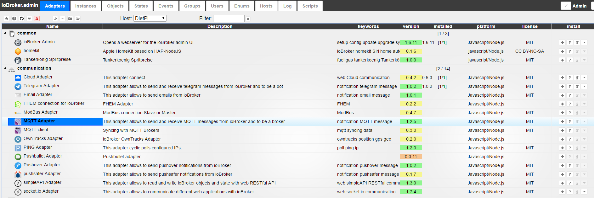

您将看到一个弹出窗口驱动程序安装，安装完成后，它将自动关闭。

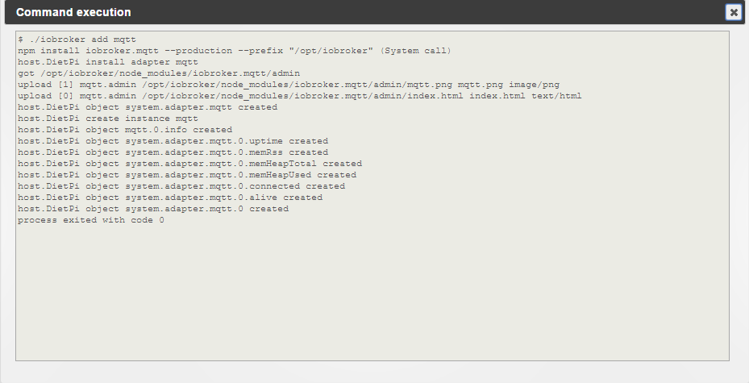

如果一切顺利，在**设置驱动程序**选项卡上会出现**mqtt.0**驱动程序的安装实例。

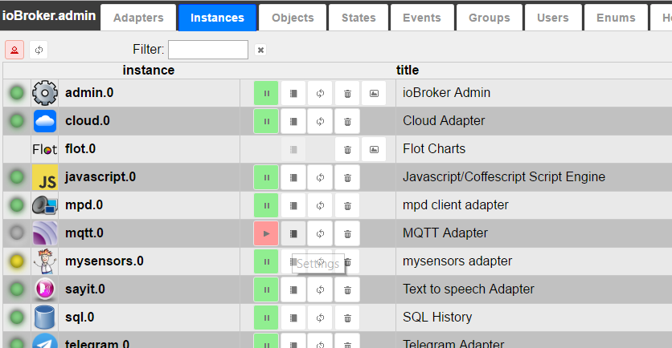

＃＃ 环境
如上所述，MQTT 协议包含一个代理和多个客户端。ioBroker 服务器可以充当代理和客户端。
设置以指定操作模式 - 类型（服务器/代理或客户/订阅者）考虑所有选项。

### IoBroker 作为 MQTT 代理
如果您打算使用服务器/代理，则基本设置如下图所示：

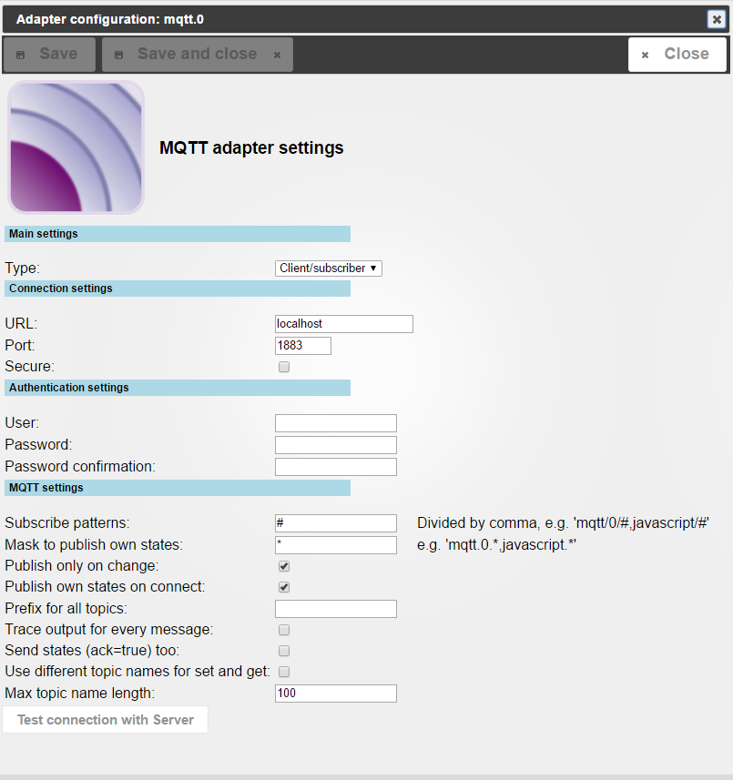

* **使用 WebSockets** - 如果需要使用 WEB 套接字进行连接，则必须安装此选项，TCP 服务器将与 WebSocket 服务器并行运行，
* **端口** - TCP 连接端口（默认为 1883），WebSocket 服务器（参见上面的选项）在端口 +1 上运行（默认为 1884），
* **SSL** - 如果您想加密所有流量（TCP 或 WebSocket），则使用此选项，因此需要指定证书 - 只需从预设列表中选择即可（在系统设置中指定，请参阅[系统管理驱动程序描述](http://www.iobroker.net/?page_id=4179&lang=en)），
* **身份验证设置**（用户名和密码） - 指示（如果需要）特定的用户身份验证，此设置始终与 SSL 加密选项结合使用（不通过不安全的连接以明文形式传输密码），
* **屏蔽私有值** - 模板（或多个逗号分隔）用于过滤ioBroker变量，这些变量将被发送到客户端，可以使用特殊字符来指定一组消息（例如，`memRSS, mqtt.0` - 可以传输所有驱动程序的所有变量的内存状态以及所有**mqtt.0驱动程序**实例变量），
* **仅发送更改** - 仅在变量发生变化的情况下才向客户端发送数据（如果状态只是更新 - 值未更改，则不会发送客户消息）来自客户端的任何消息都会被接受，即使值没有改变，
* **在启动时提供私有值** - 每次成功的客户端连接都会转移到所有已知状态（由掩码状态定义） - 以便告知客户端 ioBroker 的当前状态，
* **Post 状态订阅** - 订阅后会立即向客户发送其签名的变量值（客户端在第一次启动或重启时会收到其签名的变量值，可用于初始化变量），
* **所有值的前缀** - 如果指定了值，它将作为前缀添加到每个发送的主题，例如，如果您指定 iobroker/，那么所有发送的主题都将按照以下方式发送：`iobroker/mqtt/0/connected`，
* **输出每个更改的日志** - 在日志文件中将显示每个更改的调试信息，
* **不仅发送命令，还发送状态（ack=true）** - 如果此选项未激活，则客户端将仅发送带有 ack=false 的变量/命令，如果设置了该标志，则无论 ack 的状态如何（false / true），都会传输变量，
* **主题名称的最大长度** - 主题描述（包括服务）的最大字符数。

作为示例，考虑基于[Arduino开发板](https://www.arduino.cc/)的客户端和代理之间的数据交换是 mqtt.0 驱动系统 ioBroker 的一个实例。

* - 客户 – 基于 W5100 芯片开发 [arduino UNO](https://www.arduino.cc/en/Main/ArduinoBoardUno) + [以太网屏蔽](https://store.arduino.cc/product/A000072) 的费用，
* - 要与以太网板配合使用，请使用标准[库]（https://www.arduino.cc/en/Reference/Ethernet）与 MQTT 库 [Pubsubclient]（https://github.com/knolleary/pubsubclient）配合使用，
* - 连接到 pin_8 进行测量的 AM2302 传感器（温度和湿度）使用了带有 [DHTlib](https://github.com/RobTillaart/Arduino/tree/master/libraries/DHTlib) 资源 GitHub.com 的库，
* - LED **led_green** 连接到 pin_9，以离散模式控制开/关
* - 代理 – ioBroker 系统驱动程序 mqtt。

数据交换格式主题：

* `example1/send_interval` - 客户端签名以更改温度读数和湿度的传输间隔（以秒为单位的 int 值），
* `example1/temp` - 客户端使用 DHT22 传感器（浮点类型）发布指定的温度间隔，
* `example1/hum` - 客户端使用 DHT22 传感器（浮点型）发布指定的湿度值间隔，
* `example1/led` - 客户端订阅了 led 的状态变化（文本开/关或 0/1 或真/假）。

驱动程序设置如下：

通过 TCP 连接（无需 WebSocket），默认端口 1883\。客户端位于本地网络内，因此无需加密流量和验证用户身份。我们仅发送客户端签名的发送间隔指示和 LED 状态的更改，获取变量更新信息（不更改值）毫无意义。要发布订阅 - 请注意此选项，因为客户端首次连接（或断开连接后再次连接）时，必须知道其签名的变量的状态（当前发送间隔以及 LED 是否应亮起）。设置发送变量的 ack = true 或 false 也值得注意，因为（客户端签名的）变量可以更改任何驱动程序/脚本/ VIS，并且任何更改都应发送给客户端。Arduino 开发板的完整代码如下所示：

<pre>// 连接库

＃包括
＃包括
#include //https://github.com/knolleary/pubsubclient
#include //https://github.com/RobTillaart/Arduino/tree/master/libraries/DHTlib //网络设置 byte mac[] = { 0xAB, 0xBC, 0xCD, 0xDE, 0xEF, 0x31 }; byte ip[] = { 192, 168, 69, 31 }; //arduino 板 IP 地址 byte mqttserver[] = { 192, 168, 69, 51 }; // ioBroker 服务器 IP 地址
以太网客户端 ethClient；void回调（char *topic，byte* payload，unsigned int length）；PubSubClient客户端（mqttserver，1883，callback，ethClient）；

//全局变量

#define LED_pin 9 unsigned int send_interval = 10; //向服务器发送指示的间隔，默认为 10 秒 unsigned long last_time = 0; //计时器 dht DHT 的当前时间;
#定义 DHT22_PIN 8 char buff[20];
// 传入连接的处理函数 - 接收订阅数据 void callback(char * topic, byte * payload, unsigned int length) { Serial.println(""); Serial.println("-------"); Serial.println("MQTT-broker 的新回调"); // 让我们将主题 (topic) 和值 (payload) 转换为一行payload[length] = '\0'; String strTopic = String(topic); String strPayload = String((char * ) load); // 研究从服务器“到达”的订阅:: // 更改查询间隔 if (strTopic == "example1/send_interval") { int tmp = strPayload.toInt(); if (tmp == 0) { send_interval = 10; } else { send_interval = strPayload.toInt(); } } // 控制 LED if (strTopic == "example1/led") { if (strPayload == "off" || strPayload == "0" || strPayload == "false") digitalWrite(LED_pin, LOW); if (strPayload == "on" || strPayload == "1" || strPayload == "true") digitalWrite(LED_pin, HIGH); } Serial.print(strTopic); Serial.print(" "); Serial.println(strPayload); Serial.println("-------"); Serial.println(""); }

void setup() { Serial.begin(9600); Serial.println("Start..."); // 开始网络连接 Ethernet.begin(mac, ip); Serial.print("IP: "); Serial.println(Ethernet.localIP()); // 初始化输入/输出端口，注册起始值 pinMode(LED_pin, OUTPUT); digitalWrite(LED_pin, LOW); // 当 LED 熄灭时 }

void loop() { // 如果 MQTT 连接处于非活动状态，则我们尝试设置它并发布/订阅 if (!client.connected()) { Serial.print("Connect to MQTT-boker... "); // 连接并发布/订阅 if (client.connect("example1")) { Serial.println("success"); // 来自传感器的值 if (DHT.read22(DHT22_PIN) == DHTLIB_OK) { dtostrf(DHT.humidity, 5, 2, buff); client.publish("example1/hum", buff); dtostrf(DHT.temp, 5, 2, buff); client.publish("example1/temp", buff); } // 订阅查询间隔 client.subscribe("example1/send_interval"); // 订阅 LED 控制变量 client.subscribe("example1/led"); } else { //如果没有连接，我们等待10秒，然后重试Serial.print（“失败，rc =”）; Serial.print（client.state（））; Serial.println（“10秒后重试”）； 延迟（10000）; } //如果连接处于活动状态，则以指定的时间间隔将数据发送到服务器 } else { if（millis（）> gt;（last_time + send_interval * 1000））{last_time = millis（）; 如果（DHT.read22（DHT22_PIN）==DHTLIB_OK）{dtostrf（DHT.humidity，5，2，buff）; client.publish（“example1 / hum”，buff）; dtostrf（DHT.temp，5，2，buff）; client.publish（“example1 / temp”，buff）; } } } //检查订阅客户端上的传入连接。loop（）; } </pre>

Broker部分结果（温湿度数据按照预设的时间段更新）：

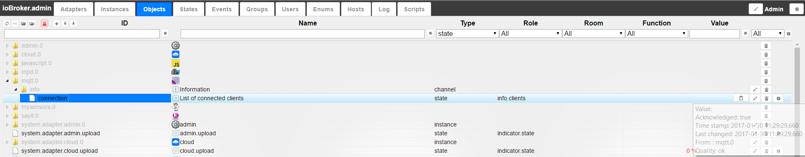

客户端的结果（将订阅进来的数据输出到控制台进行调试）：

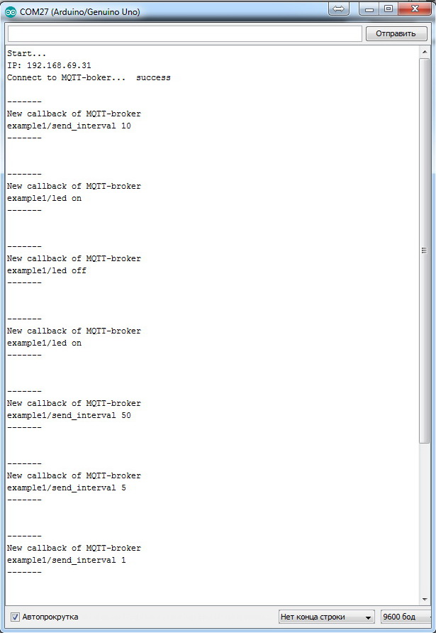

### IoBroker 作为 MQTT 客户端工作
例如，MQTT 驱动程序作为客户端/订阅者，您需要选择适当的配置类型。
这组选项会略有变化：

* **连接设置** - 指定代理的 URL 和端口（如果要加密流量，请指示 SSL） - 连接到代理的设置，
* **身份验证设置** - 用户名和密码，如果代理需要身份验证（最好使用 SSL 以避免以明文形式传输密码），
* **模式** - 客户订阅的变量掩码（经纪人变量），值以逗号分隔列出，#（磅号）用于指示集合，
* **屏蔽私有值** - 过滤应发布的变量（客户端变量），其值以逗号分隔列出，用于指示集合，使用符号 *（星号），
* **仅发送更改** - 客户端将仅发布更改值的变量（根据掩码），
* **在启动时提供私有值** - 如果选中此选项， 则每次建立连接时都会发布所有状态（根据掩码），以声明可用的变量及其值，
* **所有值的前缀** - 如果指定了该值，它将作为前缀添加到每个已发布的主题中，例如，如果指定了 client1/，那么所有发布主题都会以以下方式行：`client1/javascript/0/cubietruck`，
* **输出每个更改的日志** - 在日志文件中将显示每个更改的调试信息，
**不仅发送团队，还发送状态（ack = true）** - 如果未选中此选项，则代理仅发送带有ack = false的变量/命令，如果选项需要注意，则会发送所有数据，无论ack = true还是ack = false，
**主题的最大长度** - 主题描述（包括服务）的最大字符数。

设置订阅掩码变量（模式）的示例。请考虑以下主题：

*   “运动”
* “体育/网球”
* “体育/篮球”
* “运动/游泳”
* “体育/网球/决赛”
* “体育/篮球/决赛”
* “体育/游泳/决赛”

如果您想订阅某一组主题，您可以使用字符#（井号）或+（加号）。

* “Sport/Tennis/#”（仅限订阅“Sport/Tennis”和“Sport/Tennis/Finals”）
* “Sport/Tennis/+”（订阅仅限“Sport/Tennis/Finals”，不包括“Sport/Tennis”）

对于 JMS 主题，如果要订阅所有主题“Finals”，可以使用字符 #（井号）或 +（加号）

* “运动/#/决赛”
* “运动/+/决赛”

对于 MQTT 主题，如果您想订阅所有主题“Finals”，您可以使用 +（加号）

* “运动/+/决赛”

以两个 ioBroker 系统之间的数据交换为例。BananaPi-Board（IP 地址为 192.168.69.51）上有一个正在运行的 ioBroker 系统，它以上述示例中的服务器/代理模式启动了 MQTT 驱动程序。
客户端连接到服务器，该客户端发布来自 DHT22 传感器的数据（温度和湿度），以及间隔测量传输的带符号变量和状态指示灯（启用/禁用）（如上例所示）。
Cubietruck 板上的第二个 ioBroker 系统运行在客户端/订阅模式下，它将运行 MQTT 驱动程序。
它从代理服务器注册温度和湿度变量（代理服务器又从另一个客户端接收数据），并发布所有脚本变量 - [电池状态](http://www.iobroker.net/?page_id=4268&lang=ru#_Li-polLi-ion)（仅限更改）。客户端配置类似于以下内容：

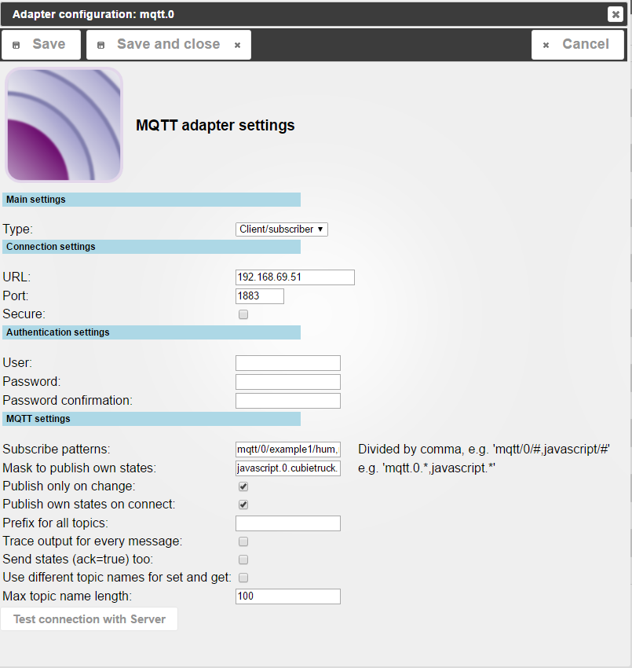

连接类型——客户/订阅者指示代理的 IP 地址和端口（默认为 1883）。
无需流量加密和身份验证。

订阅掩码（模式） - `mqtt/0/example1/hum,mqtt/0/example1/temp` - 客户端仅订阅温度和湿度（值以逗号分隔，无空格）。

屏蔽要发布的数据 - `javascript.0.cubietruck.battery.*` - 发布组`battery` 驱动程序`javascript.0` 中的所有脚本变量`cubietruck`。

仅发送更改 - 发送状态变量电池（如果值未更改，则发送无意义）。启动时提供私有值 - 启动驱动程序时，客户端将立即根据掩码释放所有变量 - 即使它们为 null 或空，以便在代理中创建变量。

为了在 ack=false 的情况下发送数据，变量会在 javascript 驱动程序中更新电池，因此它们始终为 ack=false。客户端的工作结果（另一个客户的温度和湿度数据 - 参见上面的示例）：

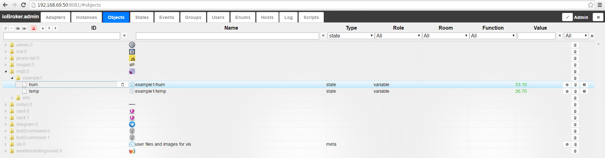

代理的结果（电池客户端的状态数据）：

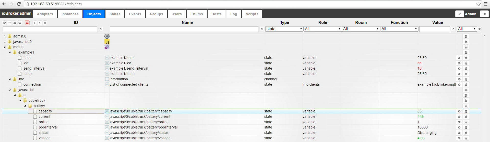

## 应用程序 - MQTT 网关协议 - ModBus RTU
MQTT 驱动程序可用作各种协议的网关，将新设备连接到 ioBroker 系统或任何其他系统。Arduino 开发板是开发此类解决方案的通用基础。网络中有许多示例、库和最佳实践。一个庞大的社区正在使用这些控制器，并且系统集成了各种设备。

例如，考虑常见的工业协议 ModBus。ioBroker 系统中有一个与之配合使用的驱动程序 - ModBus TCP 版本（基于以太网）。一组传感器、控制器和执行器在 RS-485 网络/232 和 ModBus RTU 协议上物理工作。
为了集成它们，可以使用基于 Arduino 平台的 MQTT 网关 - ModBus RTU。请考虑以下示例。

**有一个温度和湿度传感器** （用于基于arduino pro mini board DHT22传感器的测试），通过ModBUS RTU输出数据：

* 端口 UART（可以使用 MAX485 芯片转换 RS-485 接口）运行在 9600，带有选项 8E1（1 个起始位、8 个数据位、1 个偶校验位、1 个停止位），
* ModBus 的地址 – 10，
* 温度地址 0 的值乘以 10 (读取器函数 3),
* 湿度 - 地址 1 的值乘以 10（读取函数 3），
* PWM LED 地址 2 值 0...1023 用于检查记录功能（写入功能 6）。

连接方案：

Fritzing 的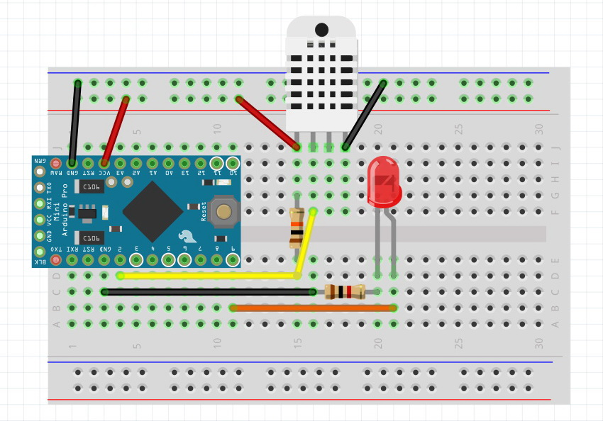

arduino pro mini 控制器的代码产生以下内容：

<pre>

#include //https://github.com/RobTillaart/Arduino/tree/master/libraries/DHTlib
#include //https://code.google.com/archive/p/simple-modbus/
#include //https://github.com/PaulStoffregen/MsTimer2 // modbus 寄存器枚举 { TEMP, HUM, PWM, TEST, HOLDING_REGS_SIZE };
#define ID_MODBUS 10 //从设备的modbus地址 unsigned int holdingRegs[HOLDING_REGS_SIZE]; //modbus寄存器数组 //温湿度传感器DHT22 dht DHT;
#定义DHT22_PIN 2
#define LED 9 // LED 连接到 PWM 引脚 9 void setup() { // 配置 modbus modbus_configure(& Serial, 9600, SERIAL_8E1, ID_MODBUS, 0, HOLDING_REGS_SIZE, holdingRegs); holdingRegs[TEST] = -157; // 用于测试负值 // 初始化一个定时器 2 秒，更新温度和湿度寄存器中的数据 MsTimer2::set(2000, read_sensors); MsTimer2::start(); // 运行定时器 pinMode(LED, OUTPUT); // LED 端口初始化 } // 定时器每 2 秒启动一次函数 void read_sensors() { if (DHT.read22(DHT22_PIN) == DHTLIB_OK) { 如果成功读取了来自传感器 DHT22 的数据 // 我们将整数值写入湿度寄存器 holdingRegs[HUM] = 10 *DHT.humidity; // 我们将整数值写入温度寄存器 holdingRegs[TEMP] = 10* DHT.temp; } else { // 如果从传感器 DHT22 读取数据不成功，我们将零写入寄存器 holdingRegs[HUM] = 0; holdingRegs[TEMP] = 0; } } void loop() { modbus_update(); // modbus 数据更新 // 数据从 LED 控制寄存器传输到 PWM（位移 2 位） analogWrite(LED, holdingRegs[PWM] >> 2); } </pre>
为了测试操作代码和架构，您可以连接串口板（例如，使用 USB-UART 转换器）并运行一个专用程序，用于访问刚刚制作的带有 ModBus RTU 接口的温度和湿度传感器。
可以使用例如 [qmodbus](http://qmodbus.sourceforge.net/) 或其他任何程序进行测试。

设置：

- 端口（从列表中选择连接到串行 Arduino 板的端口）；
- 速度和其他参数 - 9600 8E1；
- 从站ID：10，读取：功能号3读取保持寄存器，起始地址：0，寄存器数量：3，
- 从机id:10，记录：功能号6写单个寄存器起始地址：2，

读程序时得到的答案应该大致如下：

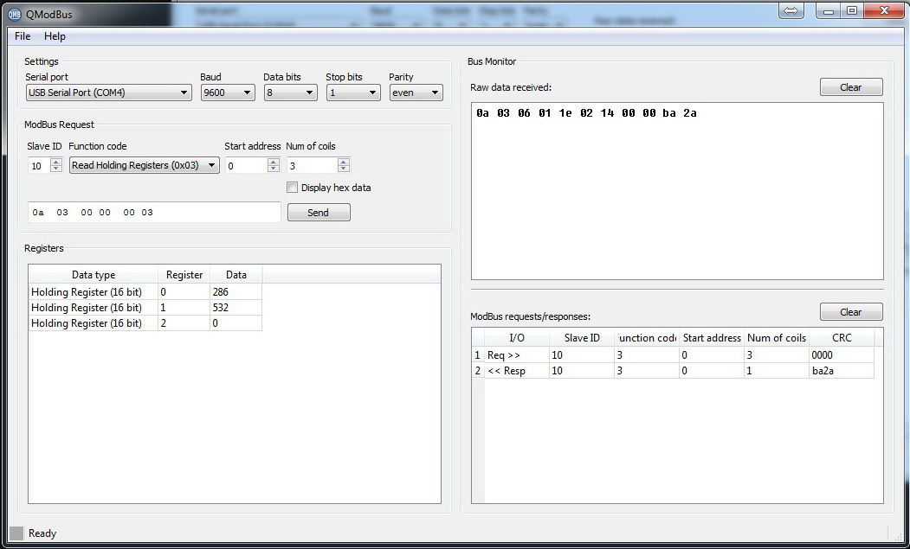

录制时节目里的答案：

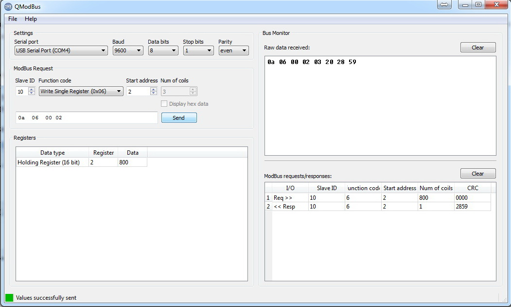

**现在配置网关本身并将其连接到 iobroker**

该网关将基于带有以太网扩展板的 arduino MEGA 2560 平台，该扩展板支持 MQTT 客户端和代理，以及 mqtt.0 ioBroker 系统驱动程序。
选择 MEGA 2560 是因为该开发板上有多个 UART 端口，分别为 Serial0（pin_0 (RX) 和 pin_1 (TX)）或 Serial（用于输出调试消息）以及 Serial1（pin_19 (RX) 和 pin_18 (TX)）用于通过 ModBus 连接从站。

* 客户——基于W5100芯片开发arduino MEGA 2560+以太网屏蔽的费用；
* 与以太网板配合使用需要使用[标准库](https://www.arduino.cc/en/Reference/Ethernet)

用于使用 MQTT 库[发布子客户端](https://github.com/knolleary/pubsubclient)；

* 用于对modbus使用库[SimpleModbus](https://code.google.com/archive/p/simple-modbus/)版本master进行调查；
* UART 端口测量（只需连接 RX 端口主机、TX 端口从机以及分别连接 TX 端口主机、RX 端口从机），传输控制端口未使用（它用于 RS-485）；
*端口设置：速度9600，8Е1；
*从设备地址10个，读取功能号3个（读取保持寄存器），记录功能号6个（写入单个寄存器）；
* 代理 – ioBroker 系统驱动程序 mqtt。

数据交换格式主题：

* `modbusgateway/send_interval` - 客户端签名以更改温度读数和湿度的传输间隔（以秒为单位的 int 值），
* `modbusgateway/temp` - 客户端以给定的间隔发布温度传感器 DHT22（浮点型）的值，
*`modbusgateway/hum` - 客户端以给定的间隔发布湿度传感器 DHT22（浮点型）的值，
* `modbusgateway/led` - 客户端订阅 led 的状态变化（PWM 控制值 0...1024）。

连接图看起来会像这样：

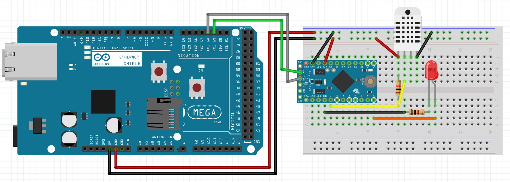

用于测试从设备，该设备由主设备供电。主设备则通过正在调试的 USB 端口 (Serial0) 进行工作。
驱动程序设置如下：

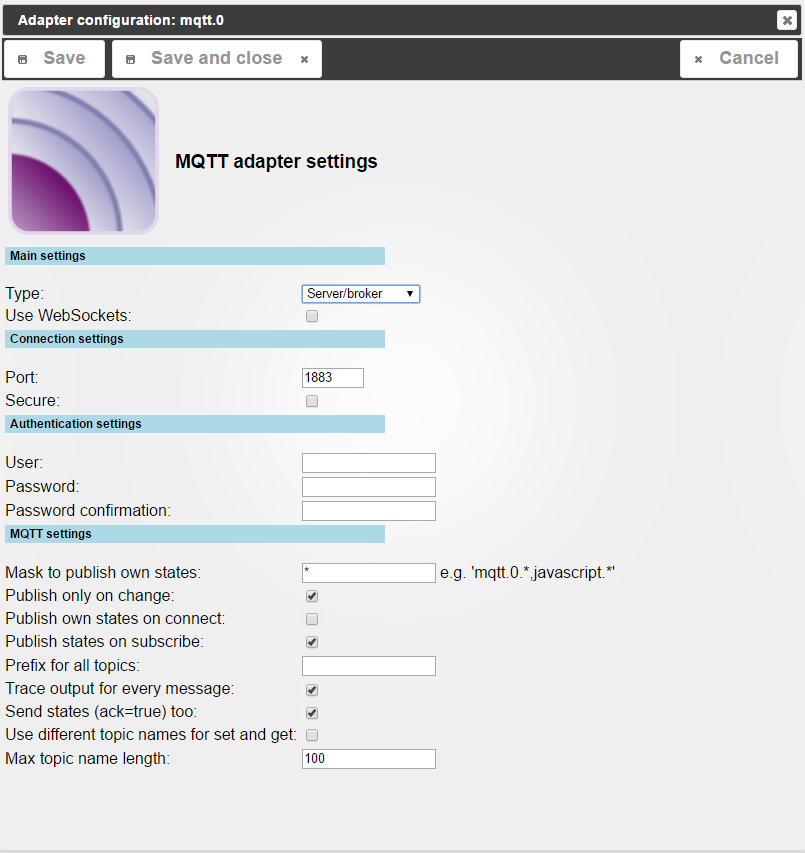

通过 TCP 连接（无需 WebSocket），默认端口 1883\。客户端位于本地网络内，因此无需加密流量和验证用户身份。我们仅发送客户端签名的发送间隔指示和 LED 状态的更改，获取有关变量更新（不更改值）的信息毫无意义。要发布订阅 - 请注意此选项，因为客户端首次连接（或断开连接后再次连接）时，必须知道其签名的变量的状态（当前发送间隔以及 LED 是否应亮起）。设置发送变量的 ack = true 或 false 也值得注意，因为（客户端签名的）变量可以更改任何驱动程序/脚本/ VIS，并且任何更改都应发送给客户端。Arduino 开发板的完整代码如下所示：

<pre class="">// 连接库

＃包括
＃包括
#include //https://github.com/knolleary/pubsubclient
#include //https://github.com/RobTillaart/Arduino/tree/master/libraries/DHTlib
// 网络设置字节 mac[] = { 0xAB, 0xBC, 0xCD, 0xDE, 0xEF, 0x31 }; 字节 ip[] = { 192, 168, 69, 31 }; // arduino 板 IP 地址字节 mqttserver[] = { 192, 168, 69, 51 }; // ioBroker 服务器 IP 地址以太网客户端 ethClient; void callback(char* topic, byte* payload, unsigned int length); PubSubClient client(mqttserver, 1884, callback, ethClient); // 全局变量 unsigned int send_interval = 10; // 向服务器发送指示的间隔，默认为 10 秒 unsigned long last_time = 0; // 计时器 dht DHT 的当前时间;

#定义 DHT22_PIN 8 char buff[20];
//传入连接的处理函数 - 接收订阅数据 void callback(char* topic, byte* payload, unsigned int length) { Serial.println(""); Serial.println("-------"); Serial.println("MQTT-broker 的新回调"); // 让我们将主题 (topic) 和值 (payload) 转换为一行，payload[length] = '\0'; String strTopic = String(topic); String strPayload = String((char*)payload); // 研究从服务器“到达”的订阅： // 更改查询间隔 if (strTopic == "example2/send_interval") { int tmp = strPayload.toInt(); if (tmp == 0) { send_interval = 10; } else { send_interval = strPayload.toInt(); } } Serial.print(strTopic); Serial.print(" ");串行打印（strPayload）；串行打印（“-------"）；串行打印（“"）；}

void setup() { Serial.begin(9600); Serial.println("Start..."); // 启动网络连接 Ethernet.begin(mac, ip); Serial.print("IP: "); Serial.println(Ethernet.localIP()); // 初始化输入/输出端口，注册起始值 }

void loop() { // 如果 MQTT 连接处于非活动状态，则我们尝试设置它并发布/订阅 if (!client.connected()) { Serial.print("Connect to MQTT-boker... "); // 连接并发布/订阅 if (client.connect("example2")) { Serial.println("success"); // 来自传感器的值 if (DHT.read22(DHT22_PIN) == DHTLIB_OK) { dtostrf(DHT.humidity, 5, 2, buff); client.publish("example2/hum", buff); dtostrf(DHT.temp, 5, 2, buff); client.publish("example2/temp", buff); } // 订阅查询间隔 client.subscribe("example2/send_interval"); } else { // 如果未连接，我们等待 10 秒并重试 Serial.print("Failed, rc="); Serial.print(client.state()); Serial.println(" 10 秒后重试"); 延迟（10000）； } // 如果连接处于活动状态，则以指定的时间间隔将数据发送到服务器 } else { if (millis() &gt; (last_time + send_interval * 1000)) { last_time = millis(); if (DHT.read22(DHT22_PIN) == DHTLIB_OK) { dtostrf(DHT.humidity, 5, 2, buff); client.publish("example2/hum", buff); dtostrf(DHT.temp, 5, 2, buff); client.publish("example2/temp", buff); } } } // 检查订阅客户端上的传入连接。loop(); } </pre>

此解决方案可作为自动化系统中的原型（示例）ModBus 网络。来自从站的数据在 ioBroker 中以所需的间隔进行传输。

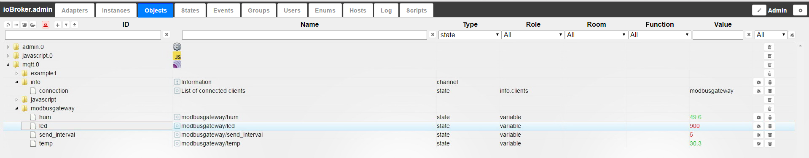

MQTT 客户端对 ModBus 网络上的从属设备所需的变量和重定向进行签名。

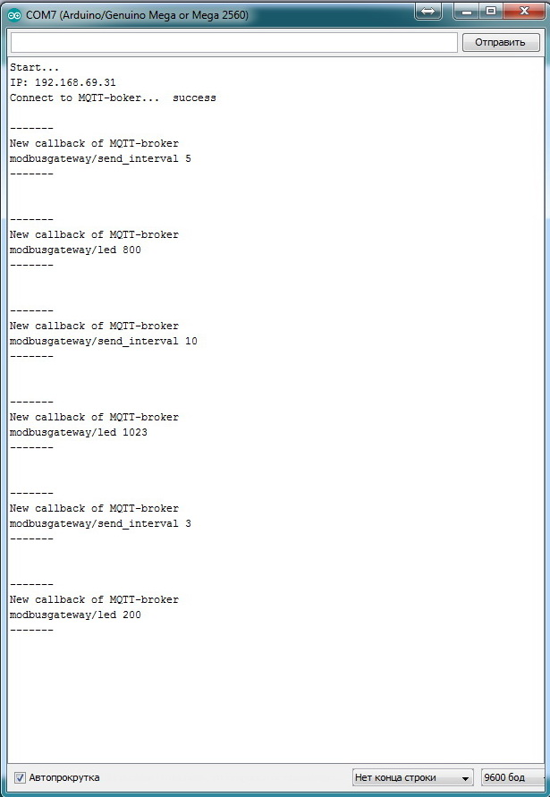

## 应用程序 - 连接移动客户端
近年来，MQTT 协议因其简单易用、流量经济以及针对不同平台的完善库而变得非常流行。
有很多程序可以在移动设备上使用 MQTT，例如 [物联网 MQTT 仪表板](https://play.google.com/store/apps/details?id=com.thn.iotmqttdashboard&hl=en)。
使用此程序，您可以连接到本地网络或互联网中的 MQTT 代理。

考虑一个例子，ioBroker 系统将充当代理的角色，它使用 MQTT 连接客户端 - 应用程序 IoT MQTT Dashboard。

在此示例中，我们控制灯光控制器[MegaD-328](http://www.ab-log.ru/smart-house/ethernet/megad-328)，该控制器通过驱动程序[MegaD](http://www.iobroker.net/?page_id=4052&lang=en)连接到ioBroker。
控制大厅中继电器（MegaD端口**P7**）灯光的脚本是一个特殊脚本，该脚本由端口按钮**P0**的状态和MQTT变量状态**mqtt.0.remotectrl.light.hall**签名，并将发布到移动客户端。
此脚本切换绑定到交换机（端口P7）的端口状态，即反转它。

事实证明，每次按下按钮，都会电连接到端口 **P0**（捕获 **true** 状态），并且每次将变量 **mqtt.0.remotectrl.light.hall** 的值发布为 **true** 时，端口 **P7** 都会打开或关闭灯。
脚本内容如下：

<pre>// 通过 MegaD 控制器的 p0 端口按钮控制大厅的照明 驱动实例 megad.0 on({ id : &#39;megad.0.p0_P0&#39;, change : &#39;any&#39; }, function(obj) { if (obj.newState.val != = &#39;&#39; || typeof obj.newState.val != = &quot;undefined&quot;) { if (obj.newState.val == = true) { if (getState(&#39;megad.0.p7_P7&#39;).val == = true) { setState(&#39;megad.0.p7_P7&#39;, false); } else { setState(&#39;megad.0.p7_P7&#39;, true); } } } }); // 通过 MQTT 远程控制大厅照明，主题为“mqtt.0.remotectrl.light.hall” on({ id : &#39;mqtt.0.remotectrl.light.hall&#39;, change : &#39;any&#39; }, function(obj) { if (obj.newState.val != = &#39;&#39; || typeof obj.newState.val != = &quot;undefined&quot;) { if (obj.newState.val == = true) { if (getState(&#39;megad.0.p7_P7&#39;).val == = true) { setState(&#39;megad.0.p7_P7&#39;, false); } else { setState(&#39;megad.0.p7_P7&#39;, true); } } } });</pre>

将按钮和灯泡连接到 MegaD 控制器：

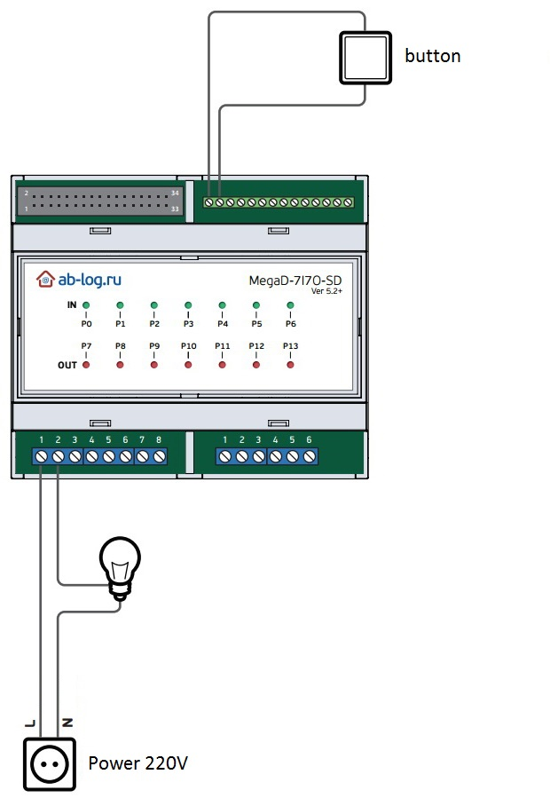

MQTT 驱动程序设置：

手机客户端可以发布数据到变量mqtt.0.remotectrl.light.hall，并注册一个真实端口状态的MegaD – megad.0.p7_P7。

配置发布和订阅：

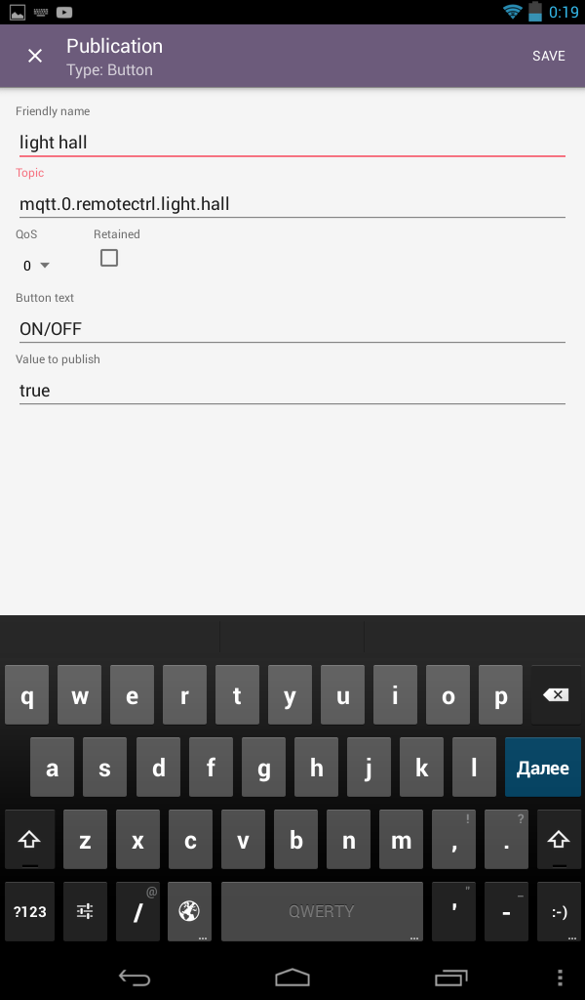

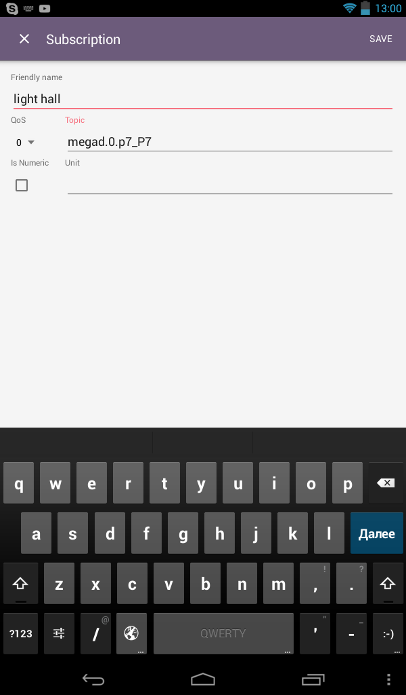

总共为一个通道的灯光控制打开控制窗口（用于发布）和订阅窗口是一个真实条件灯光继电器（用于反馈）：

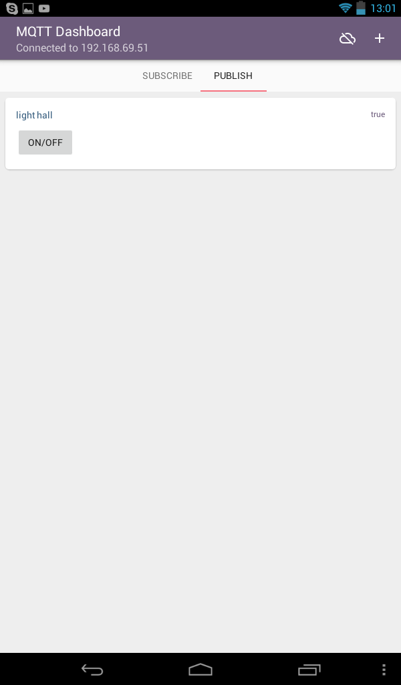

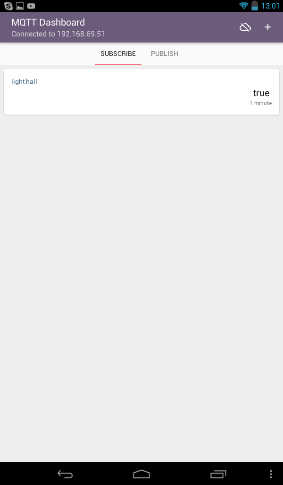

## 应用程序 - 与云服务器协作
上述示例有几个缺点。首先，移动客户端并不总是与ioBroker服务器位于同一本地网络中；其次，即使你在互联网上实现了端口转发并保护连接，ioBroker服务器本身也并不总是能够接受传入连接（位于NAT之后，无法访问设置）。全球网络中存在许多支持MQTT的不同服务——付费和免费，例如发送天气数据、地理位置等。某些服务可以充当MQTT协议代理，并可用作网关（桥梁），将ioBroker的数据输出到全球网络，或从ioBroker获取数据。例如，考虑以下捆绑软件的工作方式：

* 服务器/代理 - 服务 [cloudmqtt.com](https://www.cloudmqtt.com/)（有免费资费），
* 客户/订阅者 - ioBroker 系统可以访问互联网，发布温度和湿度数据（参见[上面的例子](http://www.iobroker.net/?page_id=6435&lang=en#ioBroker_working_as_MQTT-broker)），发布端口 **P7-P13** 的实际状态（中继驱动程序 MegaD **megad.0** - 灯光控制），订阅远程灯光控制的属性（mqtt 驱动程序 **mqtt.0** 的一个实例），
* 客户/订阅者 - 使用 [IoT MQTT Dashboard](https://play.google.com/store/apps/details?id=com.thn.iotmqttdashboard&hl=en) 应用程序进行远程工作 - 订阅温度和湿度传感器数据、订阅端口 **P7-P13** 的实际状态（中继驱动程序 MegaD **megad.0**）、发布远程控制灯的变量（驱动程序实例 **mqtt.0**）。

结果的结构如下：

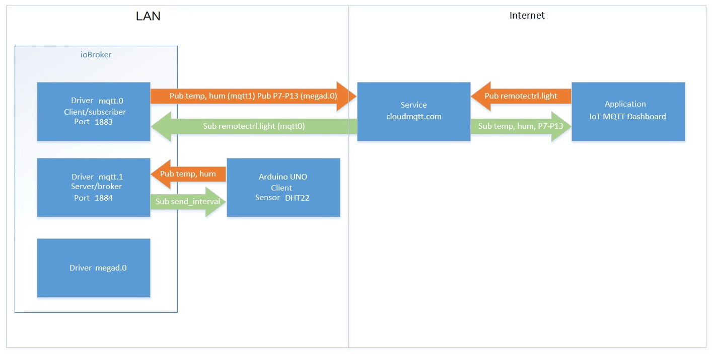

捆绑驱动程序 **mqtt.1**（代理）– Arduino UNO + 以太网 + DHT22（客户端），与[上面的例子](http://www.iobroker.net/?page_id=6435&lang=en#ioBroker_working_as_MQTT-broker) 类似，但略有修改。
配置 mqtt **driver.1** 实例：

arduino平台的代码：

<pre class="">// 连接库

＃包括
＃包括
#include //https://github.com/knolleary/pubsubclient
#include //https://github.com/RobTillaart/Arduino/tree/master/libraries/DHTlib
// 网络设置字节 mac[] = { 0xAB, 0xBC, 0xCD, 0xDE, 0xEF, 0x31 }; 字节 ip[] = { 192, 168, 69, 31 }; // arduino 板 IP 地址字节 mqttserver[] = { 192, 168, 69, 51 }; // ioBroker 服务器 IP 地址以太网客户端 ethClient; void callback(char* topic, byte* payload, unsigned int length); PubSubClient client(mqttserver, 1884, callback, ethClient); // 全局变量 unsigned int send_interval = 10; // 向服务器发送指示的间隔，默认为 10 秒 unsigned long last_time = 0; // 计时器 dht DHT 的当前时间;

#define DHT22_PIN 8 char buff[20]; //传入连接的处理函数 - 接收订阅数据 void callback(char* topic, byte* payload, unsigned int length) { Serial.println(""); Serial.println("-------"); Serial.println("MQTT-broker 的新回调"); // 让我们将主题 (topic) 和值 (payload) 转换为一行payload[length] = '\0'; String strTopic = String(topic); String strPayload = String((char*)payload); // 研究从服务器“到达”的订阅： // 更改查询间隔 if (strTopic == "example2/send_interval") { int tmp = strPayload.toInt(); if (tmp == 0) { send_interval = 10; } else { send_interval = strPayload.toInt(); } } 串行打印（strTopic）；串行打印（" "）；串行打印（strPayload）；串行打印（"-------"）；串行打印（""）；}
void setup() { Serial.begin(9600); Serial.println("Start..."); // 启动网络连接 Ethernet.begin(mac, ip); Serial.print("IP: "); Serial.println(Ethernet.localIP()); // 初始化输入/输出端口，注册起始值 }

void loop() { // 如果 MQTT 连接处于非活动状态，则我们尝试设置它并发布/订阅 if (!client.connected()) { Serial.print("Connect to MQTT-boker... "); // 连接并发布/订阅 if (client.connect("example2")) { Serial.println("success"); // 来自传感器的值 if (DHT.read22(DHT22_PIN) == DHTLIB_OK) { dtostrf(DHT.humidity, 5, 2, buff); client.publish("example2/hum", buff); dtostrf(DHT.temp, 5, 2, buff); client.publish("example2/temp", buff); } // 订阅查询间隔 client.subscribe("example2/send_interval"); } else { // 如果未连接，我们等待 10 秒并重试 Serial.print("Failed, rc="); Serial.print(client.state()); Serial.println(" 10 秒后重试"); 延迟（10000）； } //如果连接处于活动状态，则以指定的时间间隔将数据发送到服务器 } else { if (millis() &gt; (last_time + send_interval * 1000)) { last_time = millis(); if (DHT.read22(DHT22_PIN) == DHTLIB_OK) { dtostrf(DHT.humidity, 5, 2, buff); client.publish("example2/hum", buff); dtostrf(DHT.temp, 5, 2, buff); client.publish("example2/temp", buff); } } } //检查订阅客户端上的传入连接。loop(); } }

工作成果 - **mqtt.1** 驱动对象：

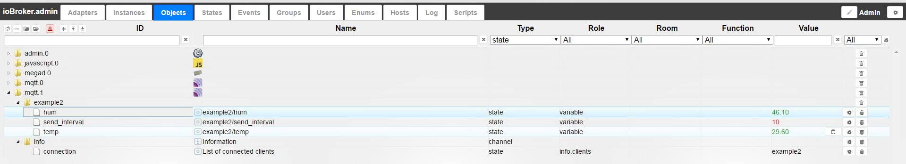

现在让我们设置将数据发布/订阅到云端。首先，请在[cloudmqtt.com](https://www.cloudmqtt.com/)网站上注册，选择所需的速率，创建实例，然后获取设置：

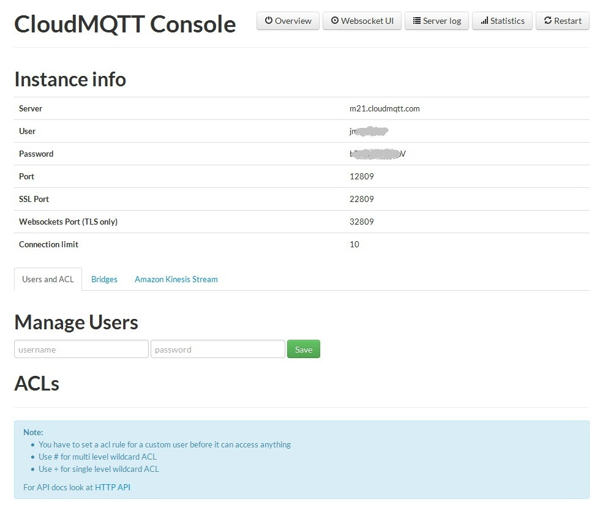

为了提高安全性，最好创建一个单独的用户，假设该用户为 iobroker，密码为 1234。
授予该用户在任何主题中的读写权限：

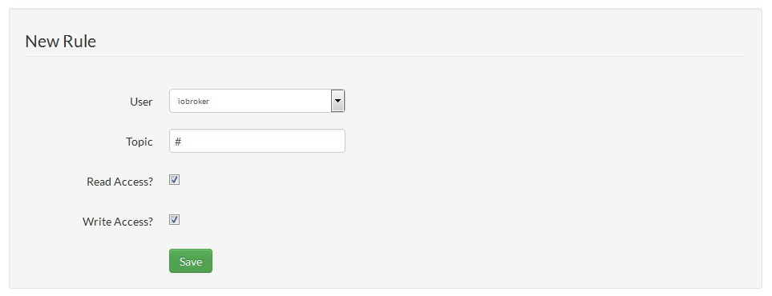

接下来设置 mqtt **driver.0** 的实例以作为客户端/订阅者云代理进行连接，并设置发布/订阅列表：

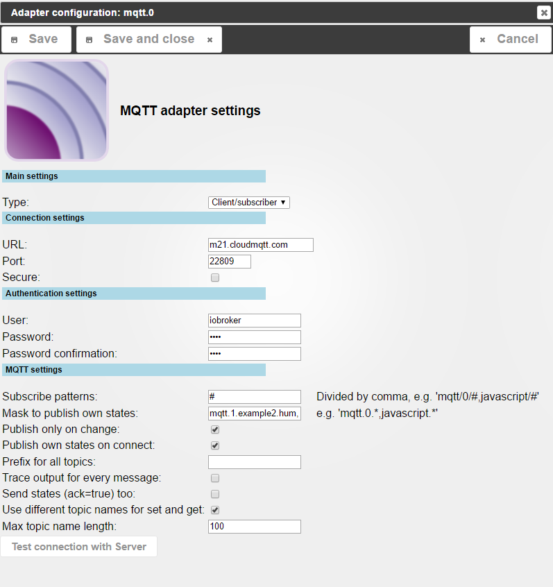

* 连接类型 – 客户/订户，
* 连接设置 - 指定在控制面板中发布的 URL [cloudmqtt.com](https://www.cloudmqtt.com/)，端口将使用与 **SSL** 兼容的 **22809**，
* 在身份验证选项中指定用户名和密码，
* 模式 – 我们的客户端 ioBroker 将在云中的所有主题上签名，因此您在此处指定数字符号（**#**），您可以使用掩码来选择性订阅，
* 客户端将向服务器发布特征值掩码**温度/湿度**和所有 megaD 端口（带中继 P7-P13 的端口）的状态，此字段用逗号分隔指定所需的变量：**mqtt.1.example2.hum、mqtt.1.example2.temp、megad.0.p7_P7、megad.0.p8_P8、megad.0.p9_P9、megad.0.p10_P10、megad.0.p11_P11、megad.0.p12_P12、megad.0.p13_P13**，
* 仅发送更改 – 勾选后将仅发布更改内容，
* 在开始时给出你自己的价值观——只需指定创建主题，
* 不仅发送命令，还发送状态（ack=true）——需要注意的是设置温度/湿度更新驱动程序 mqtt（ack=true）。

设置已保存，请确保连接已建立（在控制面板[cloudmqtt.com](https://www.cloudmqtt.com/)上查看日志服务器）。
一段时间后，数据将会出现（在面板链接**WebsocketUI**中）：

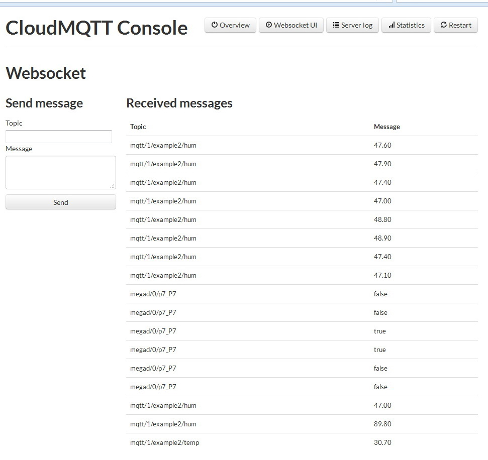

最后，只需配置一个移动客户端，例如[物联网 MQTT 仪表板](https://play.google.com/store/apps/details?id=com.thn.iotmqttdashboard&hl=en)。
创建新连接：

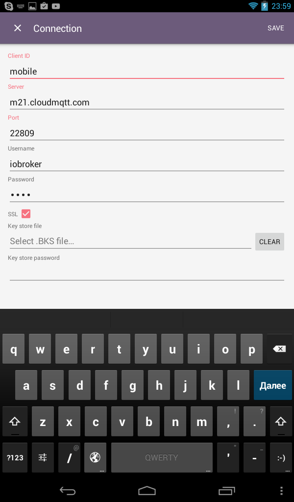

创建要发布的主题（例如，大厅的照明 - 端口**P7** MegaD）：

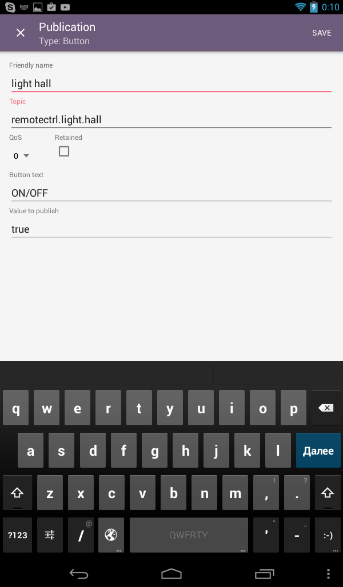

然后为主题创建订阅（温度、湿度、端口**P7** MegaD 上的大厅灯）：

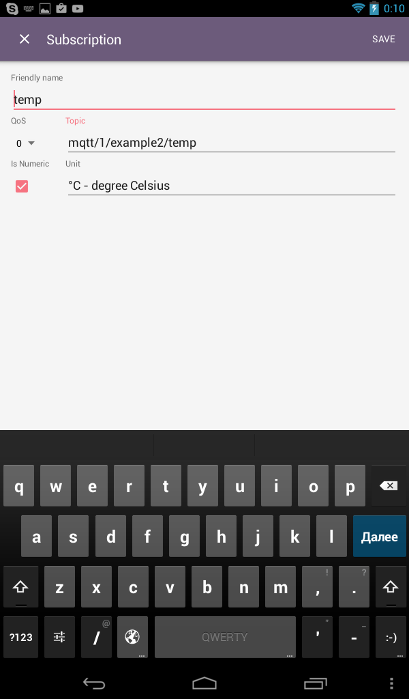

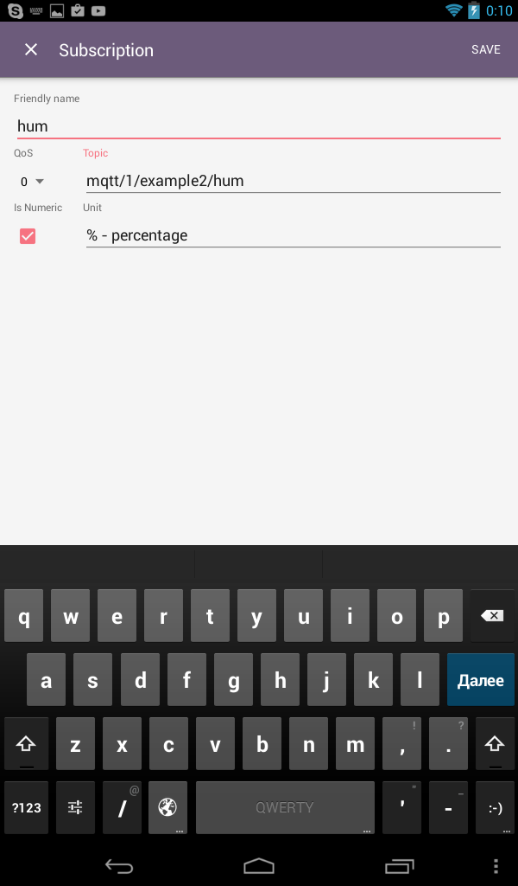

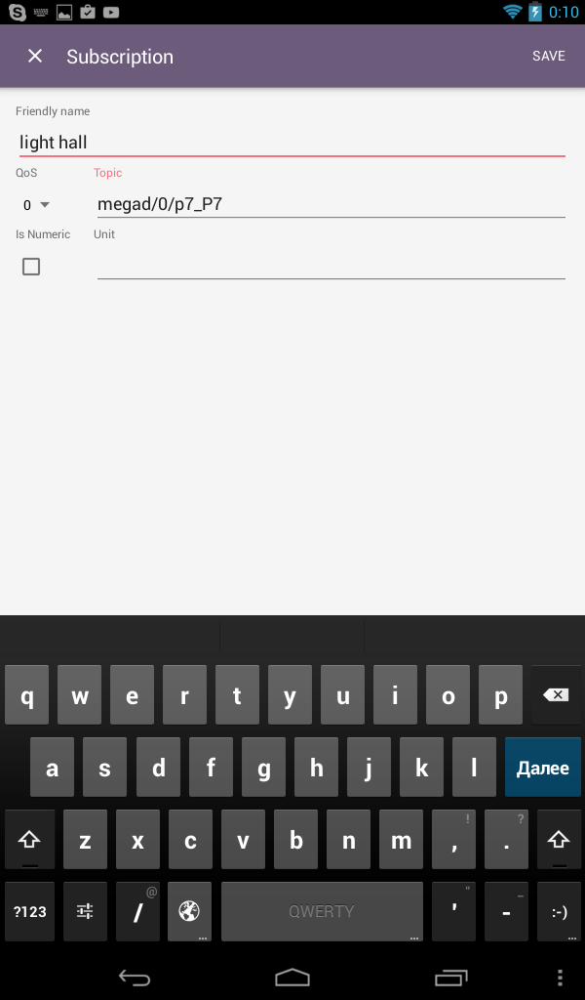

最后，您的仪表板可能看起来像这样：

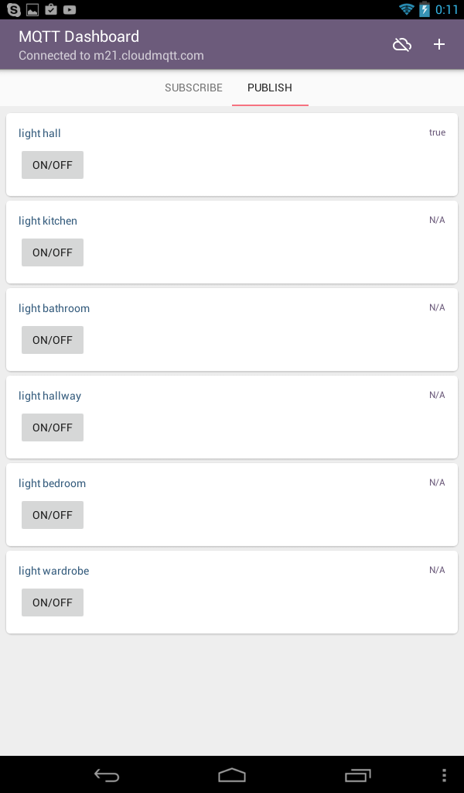

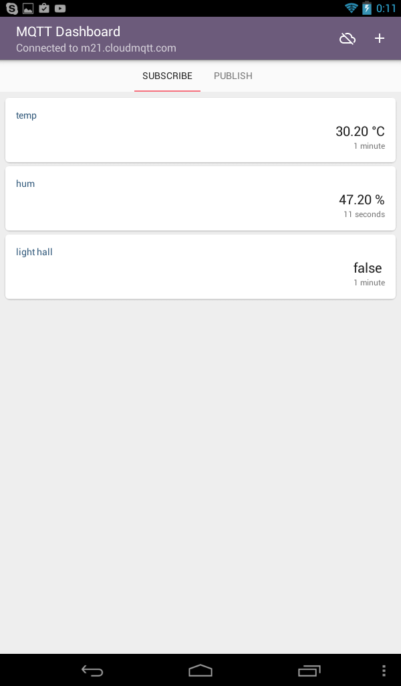

在移动设备上创建出版物后，在驱动程序实例 **mqtt.0** 系统 ioBroker 中应该出现变量灯光控制，该变量灯光控制应该在脚本中用于灯光控制（参见[上面的例子](http://www.iobroker.net/?page_id=6435&lang=en#Application_8211_connecting_mobile_clients)）：

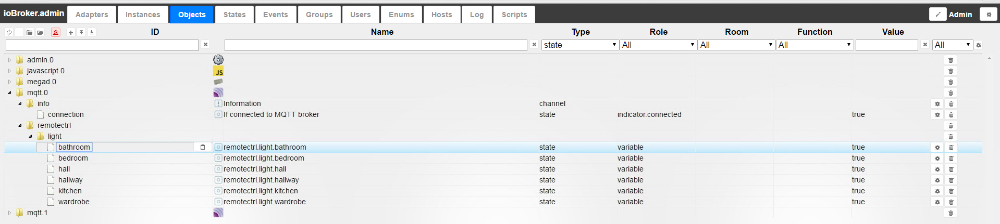

恭喜！现在您可以控制系统 ioBroker 并通过云服务接收数据！

## Changelog
### 6.1.4 (2025-05-07)
* (bluefox) Allowed disabling the client objects creation
* (bluefox) Create client objects with timeout (1s) to prevent memory leaks

### 6.1.3 (2025-05-04)
* (Code-X77) Corrected TLS communication
* (bluefox) Packages updated

### 6.1.2 (2024-09-04)
* (bluefox) Corrected error if the client has no ID

### 6.1.1 (2024-08-29)
* (bluefox) Added information about connected clients in the server mode

### 6.0.2 (2024-08-13)
* (bluefox) Added a space to the connection string for better readability

## License

The MIT License (MIT)

Copyright (c) 2014-2025, bluefox <dogafox@gmail.com>

Permission is hereby granted, free of charge, to any person obtaining a copy
of this software and associated documentation files (the "Software"), to deal
in the Software without restriction, including without limitation the rights
to use, copy, modify, merge, publish, distribute, sublicense, and/or sell
copies of the Software, and to permit persons to whom the Software is
furnished to do so, subject to the following conditions:

The above copyright notice and this permission notice shall be included in
all copies or substantial portions of the Software.

THE SOFTWARE IS PROVIDED "AS IS", WITHOUT WARRANTY OF ANY KIND, EXPRESS OR
IMPLIED, INCLUDING BUT NOT LIMITED TO THE WARRANTIES OF MERCHANTABILITY,
FITNESS FOR A PARTICULAR PURPOSE AND NONINFRINGEMENT. IN NO EVENT SHALL THE
AUTHORS OR COPYRIGHT HOLDERS BE LIABLE FOR ANY CLAIM, DAMAGES OR OTHER
LIABILITY, WHETHER IN AN ACTION OF CONTRACT, TORT OR OTHERWISE, ARISING FROM,
OUT OF OR IN CONNECTION WITH THE SOFTWARE OR THE USE OR OTHER DEALINGS IN
THE SOFTWARE.