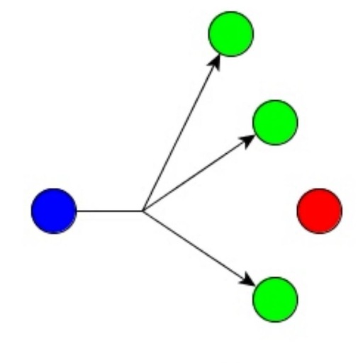

<h1>

ioBroker.多播

</h1>

# IoBroker 的多播 APi 适配器
该适配器提供基于多播通信协议的 API，用于向具有自定义固件的设备发送和接收状态。

该适配器的目的是：

* 提供 http post 和 MQTT protokoll 的替代方案
* 拥有基于组播通信和JSON格式数据传输的统一API
* 配备零接触适配器以集成任何以太网设备（例如：基于 ESP 的板 eq Wemos D1 mini），例如 Vansware/Gosound 智能插头或其他自定义构建自动化。

### 零接触？
APi 的构建方式不需要最终用户在适配器本身或要使用的设备中进行额外配置。
如果使用 Wi-Fi 转换，则只需提供 Wi-Fi 凭据（基于 LAN 的设备将完全自动处理）。
这需要二进制文件的开发人员努力将其闪存到相关芯片组（例如基于 ESP 的芯片组）。

当固件遵循 APi 的所有规则（参见下文）时，通信处理如下：

* 设备通过UDP组播发送状态值
* 适配器识别此消息并检查 ioBroker 中是否存在此设备的状态

#### 新设备
根据上一条消息，适配器指示未找到设备，将处理以下例程：

* ioBroker发送广播消息初始化设备
* 设备将所有状态和相关结构发送到ioBroker
* ioBroker 创建新设备和所有必需的状态
* 当所有状态创建完成后，ioBroker向设备发送握手“准备好接收数据”
* 设备开始按间隔或通过更改发送其状态（由固件配置定义）

#### 现有设备重新连接
根据上一条消息，适配器指示设备已存在，将处理以下例程：

* ioBroker 检查配置是否设置为“恢复”
* 激活恢复后，ioBroker 会将所有状态（信息状态除外）发送到设备
* 当接收到所有状态后，de设备向ioBroker发送握手“准备接收数据”
* ioBroker确认
* 设备开始按间隔或通过更改发送其状态（由固件配置定义）

#### 状态变化
该适配器可发送最多 5 次重试，以确保设备接收到所有状态更改。该程序的处理如下：

* ioBroker 中的状态发生变化
* 适配器识别值变化并将新值发送到设备
* 设备必须在500ms内确认消息
* 如果消息没有被确认，适配器将再次重新发送该值
* 最多可处理 5 次重试，之后会出现一条错误消息，指示通信丢失

### APi 结构和文档
{ 待完成/进行中 }

## 计划待办事项：
* [ ] 实现排队，在设备状态更改后等待 20ms，并发送包含所有状态更新的数组
* [x] 通过API实现过期值
* [x] 优化状态重试，不再每 500ms 触发一次队列
* [x] 如果收到 Harbert 并且与设备的连接为 FALSE，则发送恢复数据
* [x] 实现状态（值列表的功能）
* [x] 正确处理主机名和主机名更改

## Changelog
<!--
    Placeholder for the next version (at the beginning of the line):
    ### __WORK IN PROGRESS__
-->

### __WORK IN PROGRESS__
* ([Andiling](https://github.com/andiling)) Expire value by API implemented
* (DutchmanNL) Rebuild retry functionality

### 0.1.6 (2021-03-23)
* (DutchmanNL) Dependency updates

### 0.1.5
* (Dutchman & Andiling) Stable-Release candidate

### 0.1.4
* (DutchmanNL) Fix Device Name
* (DutchmanNL) improved way of handling info channel values compatible with old firmware

### 0.1.3
* (Dutchman) Optimise state retry, don't fire every 500ms more queuing
* (Dutchman) Send recovery data if Harbeat is received and connection to device is FALSE
* (Dutchman) Implement states (capability for value list)

### 0.1.2
* (Dutchman) Optimise state retry, don't fire every 500ms more queuing
* (Dutchman) Correct handling of hostname and hostname changes

### 0.1.1
* (Dutchman) Send recovery data if Harbeat is received and connection to device is FALSE
* (Dutchman) Implement states (capability for value list)

### 0.1.0

* (Dutchman & Andiling) initial release

## License

MIT License

Copyright (c) 2021 Dutchman & Andiling

Permission is hereby granted, free of charge, to any person obtaining a copy
of this software and associated documentation files (the "Software"), to deal
in the Software without restriction, including without limitation the rights
to use, copy, modify, merge, publish, distribute, sublicense, and/or sell
copies of the Software, and to permit persons to whom the Software is
furnished to do so, subject to the following conditions:

The above copyright notice and this permission notice shall be included in all
copies or substantial portions of the Software.

THE SOFTWARE IS PROVIDED "AS IS", WITHOUT WARRANTY OF ANY KIND, EXPRESS OR
IMPLIED, INCLUDING BUT NOT LIMITED TO THE WARRANTIES OF MERCHANTABILITY,
FITNESS FOR A PARTICULAR PURPOSE AND NONINFRINGEMENT. IN NO EVENT SHALL THE
AUTHORS OR COPYRIGHT HOLDERS BE LIABLE FOR ANY CLAIM, DAMAGES OR OTHER
LIABILITY, WHETHER IN AN ACTION OF CONTRACT, TORT OR OTHERWISE, ARISING FROM,
OUT OF OR IN CONNECTION WITH THE SOFTWARE OR THE USE OR OTHER DEALINGS IN THE
SOFTWARE.