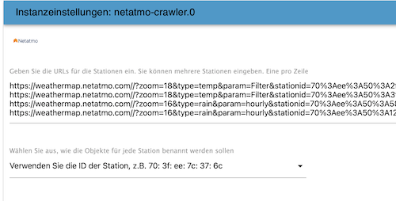

# IoBroker.netatmo-crawler
ioBroker 的 netatmo-crawler 适配器

=================

从公共网络气象站抓取信息

目录

=================

* [说明](#instruction)
* [一般信息](#general-information)
* [湿度](#湿度)
* [雨](#rain)
* [压力](#压力)
* [温度](#温度)
* [风](#wind)
* [信息](#信息)
* [积分](#积分)
* [更新日志](#changelog)
* [许可证](#license)

操作说明

===========

要查找首选气象站的 url，请按照下列步骤操作：

1.打开【Netatmo气象图】(https://weathermap.netatmo.com)
2. 找到您的电台并点击分享图标

   

3. 点击*复制链接*

   

4.在适配器的实例设置中插入链接

   

一般信息

===================

“Netatmo Crawler”会解析您附近的大量真实本地信息。你如何处理所有这些信息？以下是一些一般事实和示例：

湿度-------- Netatmo 使用相对湿度，这是当前绝对湿度与可能的最高绝对湿度（取决于当前空气温度）的比率。读数为 100% 的相对湿度意味着空气中的水蒸气完全饱和，不能再保持，因此可能会下雨。这并不意味着相对湿度必须为 100% 才能下雨——云形成的地方必须为 100%，但靠近地面的相对湿度可能要低得多。

Rain ---- 使用单位毫米。如果您希望单位升每米立方体，您无论如何都可以使用它。您可以使用它在花园里浇水（例如）。

压力 -------- 你周围的空气有重量，它压在它接触到的任何东西上。该压力称为大气压力或气压。
你应该如何处理这个值？听起来很简单：天气预报！高压 = 好天气，低压 = 坏天气。
正常的中间值为 1013 mBar。
对于“真实”天气预报，您应该需要几个小时的压力历史记录（我使用四个小时）。
如果它下降应该是未来的坏天气，如果它上升应该是好天气。
我找到了一个 [预测脚本在这里](http://www.beteljuice.co.uk/zambretti/forecast.html)（它被称为 zambretti 方法，用于 90% 的预测）。
其他单位：1 mbar = 100 Pa = 1 hPa

温度 ------------ 在这里您可以计算寒冷的温度水平。对于低温，windchill（10 °C 或更低，用风计算）对于高温，您可以使用热指数（25 °C 或更高，用湿度计算）。
示例脚本：

```
windchill1 = windchill(temp, windkmh); //Vars to-from IOBroker

function windchill(temperature, windspeed) {
	var windchill = 13.12 + 0.6215 * temperature - 11.37 * Math.pow(windspeed, 0.16) + 0.3965 *
			temperature * Math.pow(windspeed, 0.16);
	return windchill;
}

heatindex1 = heatindex(temp, hum); //Vars to-from IOBroker

function heat(temperature, humidity) {
	var heatindex = -8.784695 + 1.61139411 * temperature + 2.338549 * humidity - 0.14611605 *
			temperature * humidity - 0.012308094 * (temperature * temperature) -
			0.016424828 * (humidity * humidity) + 0.002211732* (temperature *
			temperature) * humidity + 0.00072546 * temperature * (humidity * humidity)
			- 0.000003582 * (temperature * temperature) * (humidity * humidity);
	return heatindex;
}
```

风----风速是空气从高压向低压移动的量度，通常是由于温度的变化。
阵风强度是风的最高值，在短时间内（大约三秒）测量。
您应该为您的遮阳篷或 Zambretti 方法（见上）编写脚本。

信息 ---- **此适配器使用 Sentry 库自动向开发人员报告异常和代码错误。** 有关更多详细信息以及如何禁用错误报告的信息，请参阅 [Sentry-插件文档](https://github.com/ioBroker/plugin-sentry#plugin-sentry)!从 js-controller 3.0 开始使用哨兵报告。

学分

=======

非常感谢 [回鱼](https://github.com/backfisch88) 最初的想法和支持！

## Changelog

### 0.6.0
* (Xenon-s) saves states with acknowledgement (#23 & #26)
* (Bart19) updates dependencies and documentation (#25 & #27)
### 0.5.1
* (Bart19) updates dependencies
### 0.5.0
* (Bart19) adds measures for wind and gust with m/s (#22) and do not query rain_today in the first 15 minutes of a day (#21)
### 0.4.1
* (Bart19) changes exit code and introduces an exit message
### 0.4.0
* (Bart19) Rounds values to two decimals
### 0.3.13
* (Bart19) updates dependencies
### 0.3.9
* (Bart19) updates dependencies
### 0.3.8
* (Bart19) small fix in error handling
### 0.3.7
* (Bart19) caches authorization token
### 0.3.6
* (Bart19) adds Sentry for error reporting
### 0.3.5
* (Bart19) fix for new netatmo website
### 0.3.4
* (Bart19) optimizes error handling
### 0.3.3
* (Bart19) changes some log level
* (Backfisch) adds more documentation
### 0.3.2
* (Bart19) fixes, that rain_yesterday was saved with value rain_today
### 0.3.1
* (Bart19) optimizes error handling
### 0.3.0
* (Bart19) adds timestamps, when last info retrieved from Netatmo and timestamp, when each measure was updated last. In addition, rain_yesterday added
### 0.2.0
* (Bart19) changes admin view. Now you can enter as many station urls as you want. In addition, you can select, how the data should be stored
### 0.1.2
* (Bart19) fix for station4 and introduces allowInit, so adapter will run once on config edits
### 0.1.1
* (Bart19) removes files from archive which are unnecessary
### 0.1.0
* (Bart19) implements automatic tests
### 0.0.8
* (Bart19) updates logo
### 0.0.7
* (Bart19) changes loglevel
### 0.0.6
* (Bart19) updates description
### 0.0.5
* (Bart19) bugfixes
### 0.0.4
* (Bart19) bugfixes
### 0.0.3
* (Bart19) bugfixes
### 0.0.2
* (Bart19) bugfixes
### 0.0.1
* (Bart19) initial release

## License

MIT License

Copyright (c) 2020 Bart19 <webmaster@bart19.de>

Permission is hereby granted, free of charge, to any person obtaining a copy
of this software and associated documentation files (the "Software"), to deal
in the Software without restriction, including without limitation the rights
to use, copy, modify, merge, publish, distribute, sublicense, and/or sell
copies of the Software, and to permit persons to whom the Software is
furnished to do so, subject to the following conditions:

The above copyright notice and this permission notice shall be included in all
copies or substantial portions of the Software.

THE SOFTWARE IS PROVIDED "AS IS", WITHOUT WARRANTY OF ANY KIND, EXPRESS OR
IMPLIED, INCLUDING BUT NOT LIMITED TO THE WARRANTIES OF MERCHANTABILITY,
FITNESS FOR A PARTICULAR PURPOSE AND NONINFRINGEMENT. IN NO EVENT SHALL THE
AUTHORS OR COPYRIGHT HOLDERS BE LIABLE FOR ANY CLAIM, DAMAGES OR OTHER
LIABILITY, WHETHER IN AN ACTION OF CONTRACT, TORT OR OTHERWISE, ARISING FROM,
OUT OF OR IN CONNECTION WITH THE SOFTWARE OR THE USE OR OTHER DEALINGS IN THE
SOFTWARE.