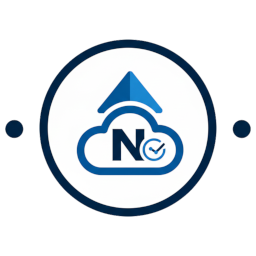

# IoBroker.nextcloud-monitoring
**测试：** 

**此适配器使用 Sentry 库自动向开发者报告异常和代码错误。** 有关禁用错误报告的更多详细信息和说明，请参阅 [Sentry插件文档](https://github.com/ioBroker/plugin-sentry#plugin-sentry)！Sentry 报告功能从 js-controller 3.0 开始使用。

我使用基于 Glitchtip 的自制 Sentry 服务器。

# IoBroker 的 nextcloud 监控适配器
---

## ⚠️ 重要提示：命名规则变更（v1.1.2+）
> **注意：** 由于 ioBroker 官方命名指南，此适配器已从 `nextcloud_monitoring`（下划线）重命名为 **`nextcloud-monitoring`**（短横线）。

这对你来说意味着什么？

* **不再自动更新：** 如果您使用的是 1.1.1 或更早版本，您将不再通过旧软件包名称接收更新。
* **需要重新安装：** 请卸载旧版本 (`nextcloud_monitoring`)，并通过 ioBroker 存储库或 GitHub 安装新版本 (`nextcloud-monitoring`)。
* **设置：** 在新版本中，您需要重新输入实例配置。

由此造成的不便，我们深表歉意，但此项更改是为了符合 ioBroker 官方代码库标准。

---

＃＃ 描述
### 首先：如果您正在寻找专门用于此适配器的组件，请使用 [VIS2-widget-nextcloud-monitoring](https://github.com/H5N1v2/VIS2-widget-nextcloud-monitoring) 创建它
此适配器允许通过官方 OCS API (`serverinfo`) 对您的 Nextcloud 实例进行详细监控。它直接在 ioBroker 中提供来自 PHP (OPcache/FPM) 和数据库的大量系统数据、用户统计信息、共享情况以及性能值。

＃＃ 特征
* **系统状态：** CPU 负载、内存使用情况、可用磁盘空间和 Nextcloud 版本。
* **用户统计信息：** 活跃用户数（5 分钟、1 小时、24 小时）、文件总数和存储使用情况。
* **共享：** 监控链接共享、讨论室和联合共享。
* **服务器健康状况：** PHP 版本、内存限制、OPcache 命中率和详细的 FPM 进程统计信息。
* **小部件：** 专门用于 Nextcloud 监控的小部件可在此处获取[https://github.com/H5N1v2/VIS2-widget-nextcloud-monitoring](https://github.com/H5N1v2/VIS2-widget-nextcloud-monitoring)。

---

## 安装与配置
### 1. 连接设置
* **域名：** 输入您的 Nextcloud 域名，无需输入 `https://`（例如，`cloud.yourdomain.com`）。
* **Token:** Nextcloud 的 OCS API 令牌（请参阅“操作方法：Token”部分）。
* **更新间隔：** API 请求之间的时间间隔（以分钟为单位）（默认值：10 分钟，最小值：5 分钟）。
* **多服务器：** 您现在可以添加多个服务器，例如：my_server_1，以及下一个服务器，例如：other_server_2

### 2. 数据选项
* **跳过应用：** 禁用已安装应用的详细列表，以减少 API 负载。
* **跳过更新检查：** 禁用对 Nextcloud 新版本的检查。

---

# 操作指南：创建和设置令牌
访问 `serverinfo` API 需要有效的 API 令牌。此令牌必须直接存储在 Nextcloud 配置中。

### 生成令牌（Linux / Windows）
要启用访问权限，您必须生成一个令牌（一个随机字符串），并使用 `occ` 工具将其注册到您的 Nextcloud 实例中。

生成令牌的命令：

* **Linux（终端）：**

`openssl rand -hex 32`

* **Windows（PowerShell）：**

`$bytes = New-Object Byte[] 32; (New-Object System.Security.Cryptography.RNGCryptoServiceProvider).GetBytes($bytes); [System.BitConverter]::ToString($bytes).Replace("-", "").ToLower()`

或者，您可以使用在线工具，例如

[it-tools.tech/token-generator](https://it-tools.tech/token-generator).*

# 在 Nextcloud 中设置令牌
**Linux（标准路径）终端示例：**

```bash
sudo -u www-data php /path_to/your/nextcloud_folder/occ config:app:set serverinfo token --value YOUR_GENERATED_TOKEN
```

**Linux 系统示例（直接在 Nextcloud 文件夹中）在终端中操作：**

```bash
sudo -u www-data php occ config:app:set serverinfo token --value YOUR_GENERATED_TOKEN
```

**如果您在网络空间或其他服务提供商处使用 Nextcloud，通常不需要 sudo，只需执行以下操作：**

```bash
#Directly in your Nextcloudfolder
hp occ config:app:set serverinfo token --value YOUR_GENERATED_TOKEN

 Or with path
hp /path_to/your/nextcloud_folder/occ config:app:set serverinfo token --value YOUR_GENERATED_TOKEN
``

Windows 命令（PowerShell/CMD）：导航到您的 Nextcloud 目录并执行：

`php occ config:app:set serverinfo token --value YOUR_GENERATED_TOKEN`

监测数据点（节选）

| 路径 | 描述 | 数据类型 |
| :--- | :--- | :--- |
| `system.version` | 已安装的 Nextcloud 版本 | 字符串 |
| `system.freespace` | 可用磁盘空间 | 字符串 |
| `storage.num_users` | 用户总数 | 数量 |
| `server.php.opcache_hit_rate` | PHP 缓存效率 | 字符串 |
| `fpm.active_processes` | 活动 PHP-FPM 进程 | 数量 |
| `activeUsers.last5min` | 最近 5 分钟内活跃的用户数 | 数量 |
| `activeUsers.last5min` | 最近 5 分钟内活跃的用户数 | 数字 |

# 故障排除（常见问题解答）
### 无效域名：请输入域名，但不要包含协议。
正确：mycloud.com 或 mycloud.com/folder

错误：https://mycloud.com 或 http://mycloud.com/folder

### API 不提供任何数据：
请确保在 Nextcloud 的“应用”中启用“服务器信息”应用（标准应用）。如果没有此应用，适配器将无法检索任何数据。

### 令牌错误：
使用以下命令验证令牌是否已正确保存到 Nextcloud 中：

* 在 Linux 系统中：

`sudo -u www-data php /path_to/your/nextcloud_folder/occ config:app:get serverinfo token`

* 或者，如果您直接位于文件夹中，请使用：

`sudo -u www-data php occ config:app:get serverinfo token`

* 如果您在网络空间或其他服务提供商处使用 Nextcloud，通常不需要 sudo：

`php occ config:app:get serverinfo token` 或 `php /path_to/your/nextcloud_folder/occ config:app:get serverinfo token`

### 维护模式：
如果您的 Nextcloud 处于维护模式，适配器将无法获取数据，并会记录一条信息。这是正常现象，因为 API 在维护期间会被禁用。

## 支持与反馈
如果您遇到任何**bug**、有**功能请求**或想提出**改进建议**，请随时在GitHub上提交**Issue**。这有助于跟踪开发进度，并帮助其他遇到类似问题的用户。

[👉 在这里提交新的问题](https://github.com/H5N1v2/iobroker.nextcloud-monitoring/issues)

---

## Changelog
### 2.0.6 (2026-03-30)
* (H5N1v2) Update axios dependency to version 1.14.0

### 2.0.5 (2026-03-26)
* (H5N1v2) add sentry plugin to automatically report errors to developer

### 2.0.4 (2026-03-25)
* (H5N1v2) update @types/node dependency to version 22.19.15
* (mcm1957) fix: update opcache hit rate state type from string to number

### 2.0.3 (2026-03-18)
* (mcm1957) fix: reevaluate state roles
* (mcm1957) fix: creation of intermediate objects missing

### 2.0.2 (2026-03-05)
* (H5N1v2) fix: language used for stateIds and names
* (H5N1v2) fix: creation of intermediate objects missing
* (H5N1v2) chore: update dependencies to latest versions
* (H5N1v2) added axios in dependencies

### 2.0.1 (2026-02-05)
* (H5N1v2) fix: Optimize state creation by caching existing states
* (H5N1v2) fix: Set Connection header to 'close' in API request

### 2.0.0 (2026-01-16)
* (H5N1v2) Added Multi-Server Support: You can now manage and monitor multiple Nextcloud instances within a single adapter instance using a dynamic table configuration.
* (H5N1v2) Refactored State Structure: Reorganized the object tree to provide a cleaner and more logical hierarchy for all monitored data.
* (H5N1v2) Expanded Data Points: Added several new monitoring points including detailed PHP Opcache, APCu stats, and FPM process information.
* (H5N1v2) Enhanced Localization: Updated and added comprehensive translations for 11 languages (DE, EN, IT, FR, ES, NL, RU, UK, ZH-CN, PL, PT).
* (H5N1v2) Improved Admin UI: Integrated a dynamic table-based management system with helpful tooltips and descriptions for better user experience.

### 1.1.3 (2026-01-14)
* (H5N1v2) repair tsconfig and cleanup release config

### 1.1.2 (2026-01-14)
* (H5N1v2) Change name from nextcloud_monitoring to nextcloud-monitoring
* (H5N1v2) Improved handling of Nextcloud maintenance mode (logged as info instead of error)

### 1.1.1 (2026-01-13)
* (H5N1v2) fixed: repository URLs and naming conventions
* (H5N1v2) added: encrypted and protected native support for tokens

### 1.1.0

* (H5N1v2) Initial release.
* (H5N1v2) Multi-language support for object names (DE/EN/IT/ES/RU etc.).
* (H5N1v2) Support for OCS API Token.
* (H5N1v2) Integrated dynamic update interval.

---

## License
MIT License

Copyright (c) 2026 H5N1v2 <h5n1@iknox.de>

Permission is hereby granted, free of charge, to any person obtaining a copy
of this software and associated documentation files (the "Software"), to deal
in the Software without restriction, including without limitation the rights
to use, copy, modify, merge, publish, distribute, sublicense, and/or sell
copies of the Software, and to permit persons to whom the Software is
furnished to do so, subject to the following conditions:

The above copyright notice and this permission notice shall be included in all
copies or substantial portions of the Software.

THE SOFTWARE IS PROVIDED "AS IS", WITHOUT WARRANTY OF ANY KIND, EXPRESS OR
IMPLIED, INCLUDING BUT NOT LIMITED TO THE WARRANTIES OF MERCHANTABILITY,
FITNESS FOR A PARTICULAR PURPOSE AND NONINFRINGEMENT. IN NO EVENT SHALL THE
AUTHORS OR COPYRIGHT HOLDERS BE LIABLE FOR ANY CLAIM, DAMAGES OR OTHER
LIABILITY, WHETHER IN AN ACTION OF CONTRACT, TORT OR OTHERWISE, ARISING FROM,
OUT OF OR IN CONNECTION WITH THE SOFTWARE OR THE USE OR OTHER DEALINGS IN THE
SOFTWARE.