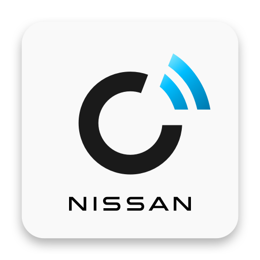

# IoBroker.nissan
**测试：** 

**此适配器使用 Sentry 库自动向开发人员报告异常和代码错误。** 有关更多详细信息以及如何禁用错误报告的信息，请参阅 [Sentry插件文档](https://github.com/ioBroker/plugin-sentry#plugin-sentry)！

## 适用于 ioBroker 的日产适配器
使用日产适配器，您可以向您的日产汽车索取最新数据，显示当前电池和充电状态、当前空调状态，远程启动或停止空调以及开始充电。

[日产互联/应用程序信息](https://www.nissan.de/kunden/nissan-connect-apps.html)

## 论坛
欢迎关注德语讨论 [iobroker论坛](https://forum.iobroker.net/topic/46700/test-adapter-nissan-v-0-0-x)

## Changelog

<!--
	Placeholder for the next version (at the beginning of the line):
	### **WORK IN PROGRESS**
-->
### 0.1.17 (2026-03-14)
- (bolliy) dependency and configuration updates

### 0.1.17-alpha.0 (2025-11-22)
- (bolliy) dependency and configuration updates
- (booliy) NPM: migration to trusted publishing

### 0.1.16 (2025-07-03)
- (bolliy) dependency and configuration updates
- (bolliy) ConnectEV: update API endpoint and enhance password encryption method

### 0.1.15 (2025-02-22)
- (bolliy) dependency and configuration updates
- (bolliy) ConnectEV: Unset user-agent

### 0.1.14 (2025-01-16)

- fix for nissan ev login

### 0.1.13 (2024-11-22)

- battery status v2 moved to to batter-statusv2 object folder

### 0.1.7 (2024-11-11)

- battery status fixed

### 0.1.6 (2024-11-01)

- (bolliy) dependency and configuration updates
- (bolliy) Requirements from ioBroker Check and Service Bot
- (bolliy) dependency and configuration updates

### 0.1.4 (2024-07-07)

- (bolliy) dependency and configuration updates
- (bolliy) breaking change: added Admin 5 configuration
- (bolliy) ConnectEV: update status before reading cachedeStatus
- (bolliy) improve State roles and types
- (bolliy) ConnectEV: update Blowfish v4.1

### 0.1.2 (2024-05-31)

- Refresh Token fix

### 0.1.1 (2024-05-20)

- Login fixed.

### 0.1.0 (2024-05-18)

- login fixed

### 0.0.2

- (TA2k) initial release

## License

MIT License

Copyright (c) 2021-2026 TA2k <tombox2020@gmail.com>

Permission is hereby granted, free of charge, to any person obtaining a copy
of this software and associated documentation files (the "Software"), to deal
in the Software without restriction, including without limitation the rights
to use, copy, modify, merge, publish, distribute, sublicense, and/or sell
copies of the Software, and to permit persons to whom the Software is
furnished to do so, subject to the following conditions:

The above copyright notice and this permission notice shall be included in all
copies or substantial portions of the Software.

THE SOFTWARE IS PROVIDED "AS IS", WITHOUT WARRANTY OF ANY KIND, EXPRESS OR
IMPLIED, INCLUDING BUT NOT LIMITED TO THE WARRANTIES OF MERCHANTABILITY,
FITNESS FOR A PARTICULAR PURPOSE AND NONINFRINGEMENT. IN NO EVENT SHALL THE
AUTHORS OR COPYRIGHT HOLDERS BE LIABLE FOR ANY CLAIM, DAMAGES OR OTHER
LIABILITY, WHETHER IN AN ACTION OF CONTRACT, TORT OR OTHERWISE, ARISING FROM,
OUT OF OR IN CONNECTION WITH THE SOFTWARE OR THE USE OR OTHER DEALINGS IN THE
SOFTWARE.