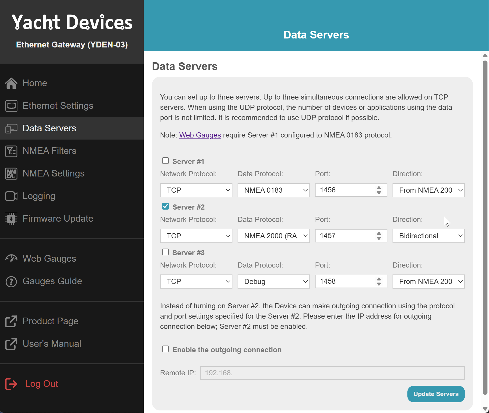

# IoBroker.nmea 此适配器允许将 ioBroker 连接到 NMEA-2000 游艇总线。
**此适配器使用 Sentry 库自动向开发者报告异常和代码错误。** 更多详情以及如何禁用错误报告，请参阅 [Sentry插件文档](https://github.com/ioBroker/plugin-sentry#plugin-sentry)！Sentry 报告功能从 js-controller 3.0 开始使用。

要使用此适配器，您需要一个能够读取 NMEA-2000 总线并将其转换为串行端口的硬件：

- [Actisense NGT-1 (USB)](https://actisense.com/products/ngt-1-nmea-2000-to-pc-interface/)
- [Actisense NGX1-USB (USB)](https://actisense.com/products/nmea-2000-gateway-ngx-1/)
- 或 [带 PiCAN-M 的 Raspberry PI](https://www.skpang.co.uk/collections/hats/products/copy-of-pican-m-with-can-bus-micro-c-and-rs422-connector-no-smps)
- [Yacht Devices YDWG-02/03](https://www.yachtd.com/products/wifi_gateway.html)
- [Yacht Devices YDEN-02/03](https://www.yachtd.com/products/ethernet_gateway.html)

PiCAN-M 可以与 Raspberry 4 和 [5](https://copperhilltech.com/blog/testing-pican-can-bus-hats-with-the-raspberry-pi-5/) 配合使用。


[YouTube 解释](https://youtu.be/flp_-mypbRU?si=k0lp95OukQ88LBxj)

## 如何在树莓派上使用 PiCAN-M
PiCAN M 是一款专为 Raspberry Pi 3/4 设计的紧凑型扩展板。

它支持将 NMEA2000 和 NMEA0183 网络连接到 Raspberry Pi。

该扩展板可通过外部 12V 电源供电。

此外，当与 PiCAN-M 扩展板配合使用时，还可以选择通过 NMEA2000 总线直接为 Raspberry Pi 供电。

PiCAN-M 的 12V 电源电压缺乏适当的反极性保护。当使用 12V 外部电源供电时，必须在电源线中加装一个 1A 保险丝。

由于树莓派对电源要求较高，我们建议使用外部电源（至少 3A）为其供电。

NMEA2000 供电和 USB 供电可以同时使用，不会出现问题。

＃＃＃ 安装
更多详情请参见[PiCAN-M 用户指南](img/pican-m_UGB_10.pdf)中的第3章，但这里先做一个简要概述：

编辑文件`/boot/config.txt`（包含`sudo nano /boot/config.txt`），并在文件末尾添加以下几行：

```
enable_uart=1
dtparam=i2c_arm=on
dtparam=spi=on
dtoverlay=mcp2515-can0,oscillator=16000000,interrupt=25
```

禁用 UART 控制台输出：

- 在命令行界面中启动 `sudo raspi-config`
- 转到“3 界面选项”
- 转到“I5 串口”
- 禁用“通过串口访问 shell”和“启用串口硬件”
退出 `raspi-config` 并重启

安装 can-utils

```shell
sudo apt-get install can-utils
```

## Actisense NGT-1
Actisense NGT-1 无需任何额外驱动程序即可在 Windows 或 Linux 系统上识别。它在 Windows 系统中显示为串口“COMn”，在 Linux 系统中显示为串口“ttyN”。

## YDEN，YDWG
启用服务器 N2 的 TCP 协议和双向模式。



UDP 也可以，但是网关会不断地将数据发送到网络中，因此总线可能会过载。

## 待办事项
- 编码
- AIS
- 找出为什么从地址 100 发送数据
- 集成 [iKonvert NMEA 2000](https://digitalyachtamerica.com/product/ikonvert-usb/)
- 集成 [Shipmodul MiniPlex-3-N2K](https://www.shipmodul.com/products.html)

## 数据模拟
您可以将外部传感器的数据传输到 NMEA2000 总线。

实际上，您只能模拟环境数据，例如温度、湿度和压力。

使用标志 `Combined environment` 可以定义用于温度、湿度和压力的 PGN 编号：

- 如果取消选中“组合环境”标志，则温度将使用 PGN 130314，湿度将使用 PGN 130313，压力将使用 PGN 130314。
- 如果您选择“组合环境”标志，则所有三个值将与其他可能的环境值一起在 PGN 130311 中发送。

## 时区
可以根据 GPS 坐标设置时区。

为此，必须在适配器设置中启用相应选项，并允许 `iobroker` 用户执行以下命令：`sudo visudo`

```
iobroker ALL=(ALL) timedatectl set-timezone
```

## 自动驾驶仪
实际上，目前只支持一款自动驾驶仪：Raymarine。

Simrad/navico/B&G 的研发尚未完成。

<!--

### **正在进行中** -->

## Changelog
### 0.4.0 (2025-11-30)
* (bluefox) Added support of YDEN-02/03 and YDWG-02/03 gateways

### 0.3.0 (2025-08-16)
* (bluefox) Widgets were rewritten on TypeScript
* (bluefox) Corrected errors in the widgets and in the calculations
* (bluefox) Small fix for ais data

### 0.2.2 (2024-06-20)
* (bluefox) Backend was rewritten on TypeScript
* (bluefox) Support for AIS added
* (bluefox) Valid processing of temperature, pressure and humidity

### 0.1.8 (2024-03-20)
* (bluefox) Corrected vis-2 widgets

### 0.1.1 (2024-03-19)
* (bluefox) Corrected vis-2 widgets

### 0.0.4 (2024-03-12)
* (bluefox) Fixed CI tests

### 0.0.3 (2024-03-12)
* (bluefox) Initial commit

## License
The MIT License (MIT)

Copyright (c) 2024-2025 bluefox <dogafox@gmail.com>

Permission is hereby granted, free of charge, to any person obtaining a copy
of this software and associated documentation files (the "Software"), to deal
in the Software without restriction, including without limitation the rights
to use, copy, modify, merge, publish, distribute, sublicense, and/or sell
copies of the Software, and to permit persons to whom the Software is
furnished to do so, subject to the following conditions:

The above copyright notice and this permission notice shall be included in
all copies or substantial portions of the Software.

THE SOFTWARE IS PROVIDED "AS IS", WITHOUT WARRANTY OF ANY KIND, EXPRESS OR
IMPLIED, INCLUDING BUT NOT LIMITED TO THE WARRANTIES OF MERCHANTABILITY,
FITNESS FOR A PARTICULAR PURPOSE AND NONINFRINGEMENT. IN NO EVENT SHALL THE
AUTHORS OR COPYRIGHT HOLDERS BE LIABLE FOR ANY CLAIM, DAMAGES OR OTHER
LIABILITY, WHETHER IN AN ACTION OF CONTRACT, TORT OR OTHERWISE, ARISING FROM,
OUT OF OR IN CONNECTION WITH THE SOFTWARE OR THE USE OR OTHER DEALINGS IN
THE SOFTWARE.