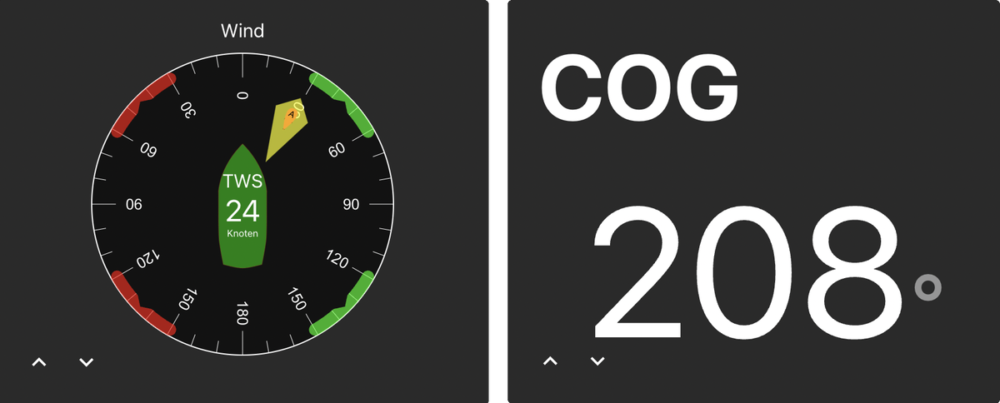

# IoBroker.nmea 此适配器允许将 ioBroker 连接到 NMEA-2000 游艇总线。
**此适配器使用 Sentry 库自动向开发人员报告异常和代码错误。**有关更多详细信息以及如何禁用错误报告的信息，请参阅[Sentry-Plugin 文档](https://github.com/ioBroker/plugin-sentry#plugin-sentry)！从 js-controller 3.0 开始使用 Sentry 报告。

要使用此适配器，您需要一个可以读取 NMEA-2000 总线并将其转换为串行端口的硬件：

Actisense NGT-1（USB）
- 或带有 PiCAN-M 的 Raspberry PI



[YouTube 解释](https://youtu.be/flp_-mypbRU?si=k0lp95OukQ88LBxj)

## 如何在 Raspberry PI 上通过 PiCAN-M 使用它
PiCAN M 是一款专为 Raspberry Pi 3/4 设计的紧凑型扩展板。
它支持将 NMEA2000 和 NMEA0183 网络连接到 Raspberry Pi。
该扩展板可通过外部 12V 电源供电。
此外，与 PiCAN-M 扩展板配合使用时，还可以选择通过 NMEA2000 总线直接为 Raspberry Pi 供电。

**PiCAN-M 缺乏针对 12V 电源电压的适当反极性保护。当外部以 12V 电压供电时，必须在电源线中加入 1A 保险丝。**

由于 Raspberry Pi 对电源的要求较高，我们建议使用外部电源（至少 3A）为 Raspberry Pi 供电。
NMEA2000 和 USB 供电可以同时正常工作。

＃＃＃ 安装
更多详细信息请参阅[PiCAN-M 用户指南](img/pican-m_UGB_10.pdf)中的第 3 章，以下是简短摘要：

编辑文件`/boot/config.txt`（使用`sudo nano /boot/config.txt`）并将以下行添加到文件末尾：

```
enable_uart=1
dtparam=i2c_arm=on
dtparam=spi=on
dtoverlay=mcp2515-can0,oscillator=16000000,interrupt=25
```

禁用 UART 控制台上的输出：

- 在 CLI `sudo raspi-config` 中启动
- 转到“3 个界面选项”
- 转到“I5 串行端口”
- 禁用“通过串行访问 shell”和“启用串行端口硬件”
- 退出“raspi-config”并重新启动

安装 can-utils

```shell
sudo apt-get install can-utils
```

## Actisense NGT-1
Actisense NGT-1 无需任何额外驱动程序即可在 Windows 或 Linux 上运行。它在 Windows 上显示为串口“COMn”，在 Linux 上显示为 ttyN。

## 待办事项
- 编码代码
- 自动识别系统
- 找出为什么从地址 100 发送数据
- 集成 [iKonvert NMEA 2000](https://digitalyachtamerica.com/product/ikonvert-usb/)
- 集成 [Shipmodul MiniPlex-3-N2K](https://www.shipmodul.com/products.html)

## 数据模拟
您可以将外部传感器的数据传送到 NMEA2000 总线。
实际上，您只能模拟环境数据，例如温度、湿度和压力。

使用标志`Combined environment`您可以定义用于温度、湿度和压力的 PGN 编号：

- 如果取消选择标志“组合环境”，则温度将使用 PGN 130314，湿度将使用 PGN 130313，压力将使用 PGN 130314。
- 如果您选择标志“组合环境”，那么所有三个值将与其他可能的环境值一起在 PGN 130311 中发送。

时区
可以根据 GPS 坐标设置时区。
为此，必须在适配器设置中启用相应选项，并允许 `iobroker` 用户执行命令：`sudo visudo`

```
iobroker ALL=(ALL) timedatectl set-timezone
```

<!--

### **工作正在进行** -->

## Changelog
### **WORK IN PROGRESS**
* (bluefox) Widgets were rewritten on TypeScript
* (bluefox) Corrected errors in the widgets and in the calculations

### 0.2.2 (2024-06-20)
* (bluefox) Backend was rewritten on TypeScript
* (bluefox) Support for AIS added
* (bluefox) Valid processing of temperature, pressure and humidity

### 0.1.8 (2024-03-20)
* (bluefox) Corrected vis-2 widgets

### 0.1.1 (2024-03-19)
* (bluefox) Corrected vis-2 widgets

### 0.0.4 (2024-03-12)
* (bluefox) Fixed CI tests

### 0.0.3 (2024-03-12)
* (bluefox) Initial commit

## License
The MIT License (MIT)

Copyright (c) 2024-2025 bluefox <dogafox@gmail.com>

Permission is hereby granted, free of charge, to any person obtaining a copy
of this software and associated documentation files (the "Software"), to deal
in the Software without restriction, including without limitation the rights
to use, copy, modify, merge, publish, distribute, sublicense, and/or sell
copies of the Software, and to permit persons to whom the Software is
furnished to do so, subject to the following conditions:

The above copyright notice and this permission notice shall be included in
all copies or substantial portions of the Software.

THE SOFTWARE IS PROVIDED "AS IS", WITHOUT WARRANTY OF ANY KIND, EXPRESS OR
IMPLIED, INCLUDING BUT NOT LIMITED TO THE WARRANTIES OF MERCHANTABILITY,
FITNESS FOR A PARTICULAR PURPOSE AND NONINFRINGEMENT. IN NO EVENT SHALL THE
AUTHORS OR COPYRIGHT HOLDERS BE LIABLE FOR ANY CLAIM, DAMAGES OR OTHER
LIABILITY, WHETHER IN AN ACTION OF CONTRACT, TORT OR OTHERWISE, ARISING FROM,
OUT OF OR IN CONNECTION WITH THE SOFTWARE OR THE USE OR OTHER DEALINGS IN
THE SOFTWARE.