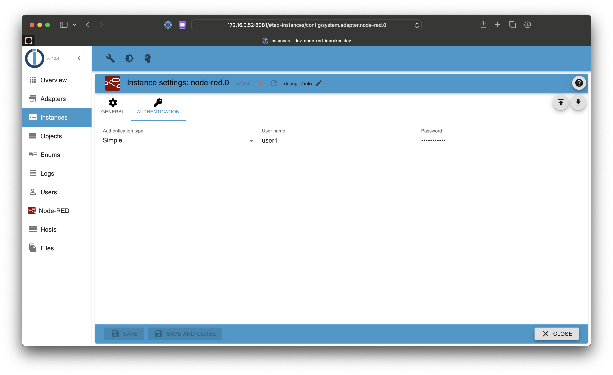
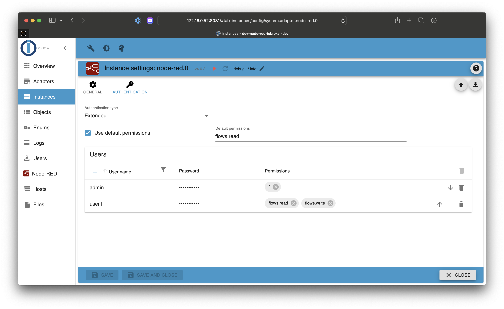

# IoBroker.node-red
**注意：** 如果您在 ioBroker 节点的选择 ID 对话框中找不到您的状态，请按实例设置中的更新按钮或重新启动节点红色实例。通过重新启动，将创建新的对象列表。

＃＃ 设置

### 最大内存设置
在适配器/实例配置中，您可以调整节点红色进程的最大 RAM/堆。默认值对于较小的 Node-Red 安装来说已经足够了。如果您有很多节点，或者您遇到性能问题或日志中的node.red进程崩溃，请升级最大RAM设置！根据您的可用 RAM（例如，请参阅“可用”上的 `free -m`），将其增加到 1024 (=1GB) 或什至更高。

＃＃＃ 安全模式
流将不会启动，您可以编辑流来修复一些过载问题。

＃＃ 验证
＃＃＃ 没有任何

＃＃＃ 简单的

### 扩展

## 节点
### IoBroker 在
### IoBroker 退出
### IoBroker 获取
### IoBroker 获取对象
### IoBroker 列表
### IoBroker 发送至

## Changelog
### 5.0.0 (2023-11-26)

**NodeJS 16.4.x is required**
**Please check instance configuration and re-enter your passwords (encryption has changed).**

- (klein0r) Updated Node-RED to 3.1.0. Please check your nodes for compatibility!
- (klein0r) Admin 5/6 JSON config for instance configuration
- (klein0r) Added sendTo node with callback
- (klein0r) Allow custom attribute name for "ioBroker in" node
- (klein0r) Added option to select editor (monaco, ace)
- (klein0r) Added table for custom env vars to instance configuration

### 4.0.3 (2023-03-24)

- (Apollon77) Optimized path handling

### 4.0.2 (2023-03-24)

- (Apollon77) Fix broken data directory when using multiple instances

### 4.0.1 (2023-03-22)

- (Apollon77) Prepare for js-controller 5.0

### 4.0.0 (2022-08-14)

- IMPORTANT: Node.js 14.x now needed at least
- (Apollon77) Upgrade to node-red 3.0.2, enable runtime-state features and switch editor to monaco-editor
- (Apollon77) Correctly escape backslashes when writing setting file on Windows

## License

Copyright 2014-2023 bluefox <dogafox@gmail.com>.

Licensed under the Apache License, Version 2.0 (the "License");
you may not use this file except in compliance with the License.
You may obtain a copy of the License at

http://www.apache.org/licenses/LICENSE-2.0

Unless required by applicable law or agreed to in writing, software
distributed under the License is distributed on an "AS IS" BASIS,
WITHOUT WARRANTIES OR CONDITIONS OF ANY KIND, either express or implied.
See the License for the specific language governing permissions and
limitations under the License.