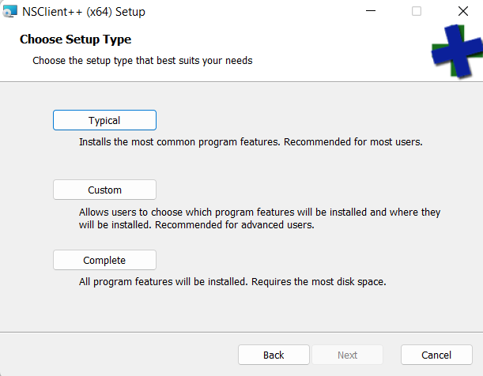
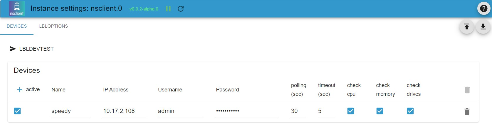

# 配置和使用 NSCLIENT 适配器
## 一般信息和功能
此适配器启用对配备 NsClient++ 代理的客户端系统的自动轮询，并将结果保存为多种状态。因此（例如）以下客户端数据将在 ioBroker 中可用：

- 系统可用性
- 多个时间范围的 CPU 使用百分比
- 多个时间范围的内存负载
- 具有绝对值和百分比值的磁盘空间

此外，每次检查都会返回二进制状态和文本状态消息。

此适配器支持无限数量的具有可配置轮询间隔的设备。

＃＃ 要求
此适配器需要在目标系统上安装 NsClient++ 代理。此代理适用于 Windows（已在 Windows 10 和 Windows 11 上测试）和 Linux。 NsClient++ 软件已在[这里](https://nsclient.org/) 中描述并可免费使用。

__注意：__ 所需的nsclient代理没有主动维护，但在Win10/Win11上依然稳定运行，在基于Nagios网络监控的环境中使用。

## 下载并安装 NsClient++ 代理
### 下载客户端代理软件
__重要：__ 请注意，nsclient++ 代理软件既不是由 ioBroker 团队开发也不是由 ioBroker 团队维护。 ioBroker 开发团队不对因 nslient++ 软件造成的任何损害或安全风险承担任何责任。

### 在 Windows 系统上安装
您可以下载 nsclient 安装工具包[这里](https://nsclient.org/download/)。请选择与您的操作系统匹配的软件包。

* 从 [nsclient++ 主页](https://nsclient.org/) 下载 nsclient++ 软件后，运行下载的镜像（例如 NSCP-0.5.2.35-x64.msi）开始安装。

* 出现提示时，选择_监控工具通用_

* 选择_安装_ _类型_ _典型_

* 添加应该允许连接到代理的主机的 IP 地址。您可以添加以逗号分隔的 IP 地址列表。有关详细信息，请参阅 [nsclient++ 文档](https://docs.nsclient.org/web/)

*设置一个强密码。

__重要提示：nsclient 保存未加密的密码。因此，切勿使用用于 nsclient++ 代理以外的任何访问的密码。__

* 启用 _common_ _check_ _plugins_ 和 _WEB_ _server_ （ioBroker 访问不需要其他模块，但如果有其他用途，请随意安装它们。）

* 允许安装继续并在 Windows 提示时输入管理员密码

* 重新启动系统以完成安装（是的，它是 Windows）。

### 在 Linux 系统上安装
您可以找到有关[nsclient++ 主页](https://nsclient.org)的更多信息。

## NsClient++ 代理配置
* 通过打开 https://localhost:8443 连接到 nsclient++ Web 界面。使用安装期间提供的密码进行授权。

您可以在 [在文档中](https://docs.nsclient.org/web/) 中找到 Web UI 的描述

* 确保加载并启用所需的模块

请参阅下一张图片中的模块列表

* 很可能您需要加载和激活一些模块。为此，单击列出模块的行以打开模块配置。检查 _loaded_ 和 _activated_ 按钮。

__不要忘记保存更改__

* 欢迎您激活其他模块进行测试

__WARNING:__ 启用可以运行脚本的模块可能会在目标系统上引入安全漏洞。在启用此类模块之前，请确保您了解 nsclient++ 的工作原理以及如何避免未经授权的访问。 ioBoker.nsclient 适配器不支持在目标系统上触发的操作。

##适配器ioBroker.nsclient的配置
ioBroker.nsclient 适配器的配置由几个选项卡构成。 （目前仅使用 _Devices_ 选项卡。）

### _Devices_ 选项卡

实例要监控的所有设备都配置在_Devices_上。您可以为每个设备添加一个包含以下数据的新表格行：

|参数 |类型 |说明 |评论 |
|----------|-------------|----------------------|------------------------------------|
|活跃 |布尔值 |如果设置为 true，则使用设备 |这可用于禁用单个设备 |
|姓名 |正文 |设备名称 |该参数用于创建数据点的名称。名称必须是唯一的，并且不能以句点或连续句点结尾。 |
| IP 地址 |正文 | IP 地址（IPv4 或 IPv6）或带有可选端口号的域名 | |
|用户名 |正文 |认证用户名 |注意：nsclient 要求用户名当前为 _admin_ |
|密码 |正文 |认证密码 | |
|查询（秒）|号码 |以秒为单位的轮询间隔 | |
|超时（秒）|号码 |以秒为单位的处理超时 | |
|检查 CPU |布尔值 |启用 CPU 相关检查 | |
|检查内存 |布尔值 |启用内存相关检查 | |
|检查驱动器 |布尔值 |启用每个驱动器检查 | |

ioBroker 状态对象在成功查询目标设备后创建。

## Changelog
<!--
    Placeholder for the next version (at the beginning of the line):
    ### **WORK IN PROGRESS**
-->
### 0.1.1 (2022-09-25)
* (mcm1957) initial release for testing

## License
MIT License

Copyright (c) 2022 mcm1957 <mcm57@gmx.at>

Permission is hereby granted, free of charge, to any person obtaining a copy
of this software and associated documentation files (the "Software"), to deal
in the Software without restriction, including without limitation the rights
to use, copy, modify, merge, publish, distribute, sublicense, and/or sell
copies of the Software, and to permit persons to whom the Software is
furnished to do so, subject to the following conditions:

The above copyright notice and this permission notice shall be included in all
copies or substantial portions of the Software.

THE SOFTWARE IS PROVIDED "AS IS", WITHOUT WARRANTY OF ANY KIND, EXPRESS OR
IMPLIED, INCLUDING BUT NOT LIMITED TO THE WARRANTIES OF MERCHANTABILITY,
FITNESS FOR A PARTICULAR PURPOSE AND NONINFRINGEMENT. IN NO EVENT SHALL THE
AUTHORS OR COPYRIGHT HOLDERS BE LIABLE FOR ANY CLAIM, DAMAGES OR OTHER
LIABILITY, WHETHER IN AN ACTION OF CONTRACT, TORT OR OTHERWISE, ARISING FROM,
OUT OF OR IN CONNECTION WITH THE SOFTWARE OR THE USE OR OTHER DEALINGS IN THE
SOFTWARE.