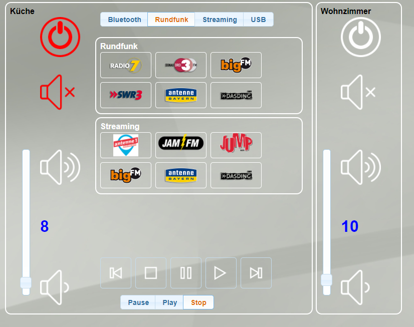

# IoBroker.onkyo
 

**此适配器使用 Sentry 库自动向开发人员报告异常和代码错误。** 有关更多详细信息以及如何禁用错误报告的信息，请参阅 [Sentry-插件文档](https://github.com/ioBroker/plugin-sentry#plugin-sentry)!从 js-controller 3.0 开始使用哨兵报告。

### 2.0 重大更新！
从 2.0 开始，结构发生了变化！如果您更新到此版本，则必须更改任何其他适配器（如 VIS 或 javascript）中的变量！新版本支持材料和封面艺术。媒体对象支持播放器小部件，如 sonos 或 winamp。

该适配器允许使用 EISCP 协议控制 Onkyo 和 Pioneer AVR。

它使用节点eiscp：https://github.com/tillbaks/node-eiscp

对于发送命令，有一个特殊的状态“RAW”。写入该状态仅触发 RAW 命令，例如已知的 EISCP Excel 文件 作为“PWR01”形式的 EISCP RAW 命令的示例。

适配器维护的另一个特殊状态是“已连接”。它是一个布尔值，显示 node-eiscp 当前是否连接到接收器。

VIS 视图示例

## 测试接收器
###安桥
* TX-NR 525
* TX-NR 626
* TX-NR 727

###先锋
* VXS-S520D
* VSX-1131

<!-- 下一版本的占位符（在行首）：

### __工作进行中__ -->

## Changelog

### __WORK IN PROGRESS__
* (Apollon77) Add reconnection and device offline detection
* (Apollon77) Add crash reporting using sentry in js.controller 3+

### 2.0.6 (2021-05-28)
* (Diginix) fixed data types

### 2.0.5 (2021-04-27)
* (Diginix) fixed some object properties
* (bluefox) Added the support of compact mode

### 2.0.3   
* (Eisbaeeer) now support zone3   

### 2.0.2
* (Eisbaeeer) fix double .js 

### 2.0.0
* (Eisbaeeer) Major update iobroker.onkyo

### 1.1.5
* (Eisbaeeer) Zones will be powered if tune preset selected   

### 1.1.4  
* (Eisbaeeer) Added direct tuning in zones (issue #2)

### 1.1.3
* (Eisbaeeer) Adding Navigation Items   

### 1.1.2
* (Eisbaeeer) Adding CoverArt

### 1.1.1
* (Eisbaeeer) Update zone 2 volume after power on. Adding Pioneer Receivers with eiscp support.

### 1.1.0
* (Eisbaeeer) Completely new structure (Zone1, Zone2, Device)

### 1.0.5
* (Eisbaeeer) Changed structure
* (Eisbaeeer) Added Object RAW to send own commands

### 1.0.4 (2018.07.24)
* (Eisbaeeer) Cleaned program
* (Eisbaeeer) Fix logging

### 1.0.2 (2018.02.28)
* (Eisbaeeer) Changed name of adapter
* (Eisbaeeer) Added testing of adapter in travis

### 1.0.0 (2017.11.28)
* (Eisbaeeer) Add max volume settings to zone1 and zone2.   
* (Eisbaeeer) changed objects to switch
* (Eisbaeeer) moved adapter to "multimedia"
* (Eisbaeeer) cleaned log outputs

### 0.1.20 (2016.03.29)
* (Eisbaeeer) Add checkbox in settings for VIS objects. Volumes can be set in
  decimal. Power states, mute states, etc. are now usable with VIS buttons.

### 0.1.12 (2016.02.25)
* (installator) Fix power state

### 0.1.11 (2016.01.13)
* (installator) Fix regexp error

### 0.1.10
* (installator) For command CTL sets Center Level -12 - 0 - +12

### 0.1.9
* (installator) change power to system-power

### 0.1.8
* (installator) fix values to control power and enable using of 1 and 0

### 0.1.7
* (bluefox) fix creation of specific states (twice)

### 0.1.6
* (bluefox) fix creation of specific states

### 0.1.5
* (bluefox) fix node-eiscp package

### 0.1.4
* (bluefox) add debug outputs

### 0.1.1
* (bluefox) replace git with tarball

### 0.1.0
* (bluefox) update adapter for new concept

### 0.0.4
* (owagner) use verify_commands=false, to be able to send high-level commands to unknown AVR models

### 0.0.3
* (owagner) allow setting of states other than "command". This will trigger a high level
  command with the state name being set to the new value. Note that this will fail for
  many newer models, as they are not yet properly represented in node-eiscp's
  command table. Use the raw command in that case
* send some initial queries upon connect to get basic state information from the AVR

### 0.0.2
* (owagner) support node-eiscp's Autodiscovery mechanism
* (owagner) updated README, notably removing bogus reference to single instancing

### 0.0.1
* (owagner) initial version

## License
The MIT License (MIT)
Copyright (c) 2014-2021 bluefox <dogafox@gmail.com>,
              2014-2015 Oliver Wagner <owagner@tellerulam.com>