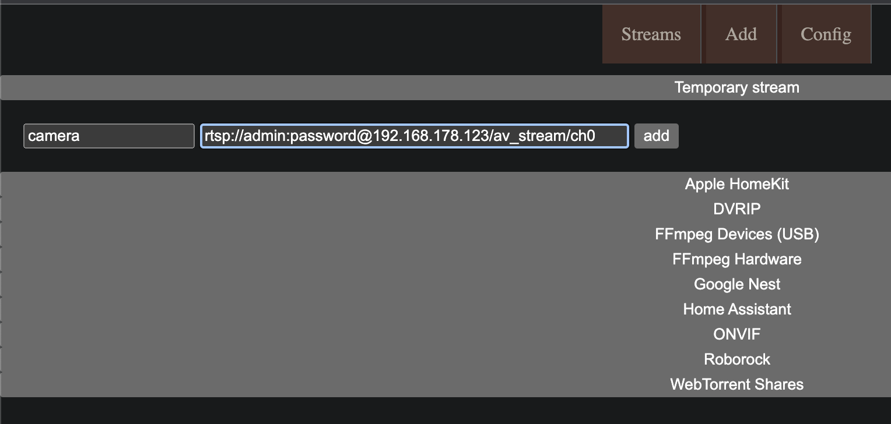
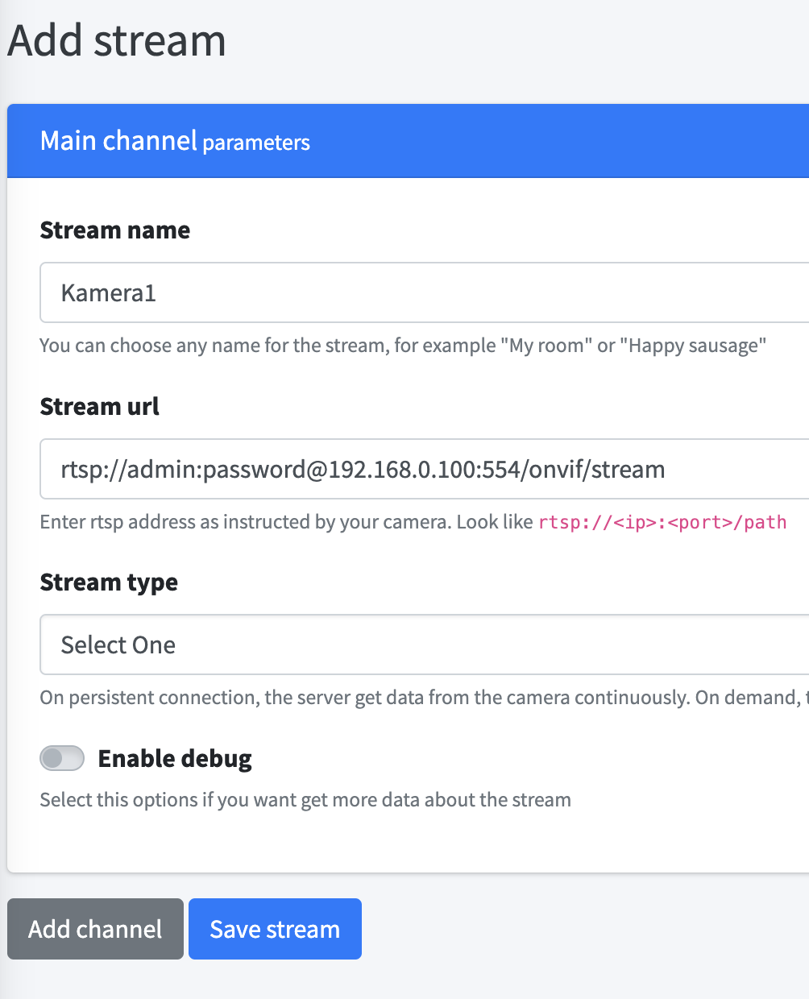
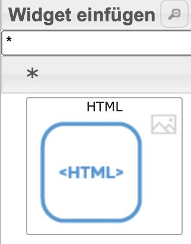
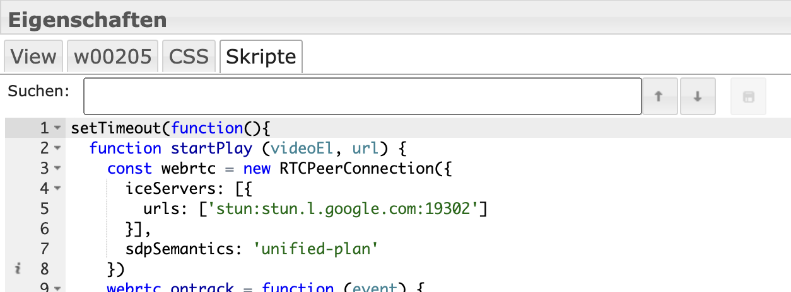

# IoBroker.onvif
**测试：** 

## IoBroker 的 ONVIF 适配器
**ONVIF 相机适配器**

**此适配器使用 Sentry 库自动向开发人员报告异常和代码错误。** 有关更多详细信息以及如何禁用错误报告的信息，请参阅[Sentry 插件文档](https://github.com/ioBroker/plugin-sentry#plugin-sentry)!从 js-controller 3.0 开始使用 Sentry 报告。

## 摄像机
### 发现：
适配器启动时，请使用名称和密码进行发现，并在相机中进行操作。相机落下后，物体就消失了。

在“Einstellungen”中，人们可以发现发现manuell ausführen。瀑布在相机下的Zugangsdaten haben müssen die jeweils eingegeben werden 和eine discovery durchgeführt werden。我记录了有关 Prozess 的详细信息。

Damit eine Kamera neu erkannt wird muss sie einfach unter Objekte gelöscht werden。

### 曼纽尔·苏切
该相机是手动拍摄的，Discovery 不具有功能。 Dazu muss eine IP Range 和 Ports eingegeben 以及 manuell ausgeführt werden。我记录了有关 Prozess 的详细信息。

## 数据点
onvif.0.IP_PORT.events 相机事件Bewegungserkennung。 Manchmal muss ein Event ausgelöst werden damit er angezeigt wrd。

onvif.0.IP_PORT.general 相机上的一般信息

onvif.0.IP_PORT.infos 适配器启动或远程刷新后摄像机上的信息

视频和快照网址：

onvif.0.IP_PORT.infos.streamUris.MediaProfile_Channel1_MainStream.snapshotUrl.uri

onvif.0.IP_PORT.remote 摄像机控制

onvif.0.IP_PORT.remote.refresh 信息更新

onvif.0.IP_PORT.remote.gotoHomePosition PTZ 摄像机在 HomePosition 设置中

onvif.0.IP_PORT.remote.gotoPreset PTZ 摄像机预设编号 auswählen

onvif.0.IP_PORT.remote.snapshot onvif.0.IP_PORT.snapshot 下的快照

＃＃ 信息
适配器 nimmt 消息“快照”entgegen und gibt ein Bild zurück

```javascript
sendTo("onvif.0", "snapshot", "192_168_178_100_80", (result) => {
  if (result) {
    sendTo("telegram.0", {
      text: result,
      type: "photo",
      caption: "Kamera 2",
    });
  }
});
```

## Telegram 的使用
```javascript
on("onvif.0.192_168_178_100_80.events.RuleEngine/CellMotionDetector/Motion", (obj) => {
  if (obj.state.val === true) {
    sendTo("onvif.0", "snapshot", "192_168_178_100_80", (result) => {
      if (result) {
        sendTo("telegram.0", {
          text: result,
          type: "photo",
          caption: "Camera 2",
        });
      }
    });
  }
});
```

# 在 vis einbinden 中流式传输
Apple Homekit 中的 Wenn Stream 可以直接在摄像头中直接播放。 Wenn das nicht funktioniert hksv benötigt wird, dann scrypted in einem docker installieren und die Kamera mit onvif und homekitplugin hinzufügen

## Go2rtsp Docker
通过 rtsp 流进行流式传输。通过运动眼睛进行的 Umwandlung 是一个资源管理器和一个 Verzögerng。 webrtc 中的 Ein Umwandlung 是 schneller 和 resourceschonender。我的 Empfehlung 位于 [go2rtsp](https://github.com/AlexxIT/go2rtc)。 Dazu muss ein Docker von alexxit/go2rtc erstellt werden。
https://hub.docker.com/r/alexxit/go2rtc

Es gibt auch eine Version mit Hardware Unterstützung：https://github.com/AlexxIT/go2rtc/wiki/Hardware-acceleration

安装 go2rtc 的本地版本：https://forum.iobroker.net/post/1031526

```
 image: alexxit/go2rtc
    network_mode: host       # important for WebRTC, HomeKit, UDP cameras
    privileged: true         # only for FFmpeg hardware transcoding
    restart: unless-stopped  # autorestart on fail or config change from WebUI
    environment:
      - TZ=Europe/Berlin  # timezone in logs
    volumes:
      - "~/go2rtc:/config"   # folder for go2rtc.yaml file (edit from WebUI)
```

这是 Pfad /config 的卷，并且是主机上的网络。

Dann ist go2rtsp erreichbar über

```
http://IP:1984
```

Dann kann man ein Stream hinzufügen。 Die Stream url findet man z.B. `onvif.0.IP_PORT.infos.streamUris.ProfileName.live_stream_tcp.uri`下



### Stream 作为 iFrame einfügen
Das Widget `iFrame` 在 der Vis hinzufügen 和 als Quelle den 流链接 von go2rtsp verwenden

`http://192.168.178.1:1984/stream.html?src=camera&mode=webrtc`

Unter links kann noch die Art des Players ausgewählt werden (Mikrofon)

## Rtsp2Web Docker
另一个替代方案是 [RTSP到Web](https://github.com/deepch/RTSPtoWeb) Docker。死亡是一个复杂的过程。
Dazu muss ein Docker von ghcr.io/deepch/rtsptoweb：最新版本。

<details>

```
docker run --name rtsp-to-web -v /YOURPATHFORCONFIG:/config --network host ghcr.io/deepch/rtsptoweb:latest
```

这是 Pfad /config 的卷，并且是主机上的网络。

Dann ist rtsptoweb erreichbar über

```
http://IP:8083
```

Dann kann man ein Stream hinzufügen。 Die Stream url findet man z.B. `onvif.0.IP_PORT.infos.streamUris.ProfileName.live_stream_tcp.uri`下



### Danach benötigen wir die Stream Id。 Dafür Stream 编辑并在 URL 中输入 Id rauskopieren
`http://192.168.178.2:8083/pages/stream/edit/ddbdb583-9f80-4b61-bafa-613aa7a5daa5`

## 可见中的 Einzelnen Stream
Dann in der vis ein HTML Objekt auswählen。 Dann 是 HTML 中的 rtsp2web 服务器上的 Widget，具有流 id eintragen：



## **Wenn mehrere Stream hinzugefügt werden soll muss `webrtc-url` 和 `webrtc-video` in html und skript mit einer neuen id ersetzt werden z.B. `webrtc-url2` 和 `webrtc-video2`**
```html
<input
  type="hidden"
  name="webrtc-url"
  id="webrtc-url"
  value="http://192.168.0.2:8083/stream/ddbdb583-9f80-4b61-bafa-613aa7a5daa5/channel/0/webrtc"
/>

<video id="webrtc-video" autoplay muted playsinline controls style="max-width: 100%; max-height: 100%;"></video>
```

在 Skripte 下的 Widget 中，Skript hinzufügen：

```javascript
setTimeout(function () {
  function startPlay(videoEl, url) {
    const webrtc = new RTCPeerConnection({
      iceServers: [
        {
          urls: ["stun:stun.l.google.com:19302"],
        },
      ],
      sdpSemantics: "unified-plan",
    });
    webrtc.ontrack = function (event) {
      console.log(event.streams.length + " track is delivered");
      videoEl.srcObject = event.streams[0];
      videoEl.play();
    };
    webrtc.addTransceiver("video", { direction: "sendrecv" });
    webrtc.onnegotiationneeded = async function handleNegotiationNeeded() {
      const offer = await webrtc.createOffer();

      await webrtc.setLocalDescription(offer);

      fetch(url, {
        method: "POST",
        body: new URLSearchParams({ data: btoa(webrtc.localDescription.sdp) }),
      })
        .then((response) => response.text())
        .then((data) => {
          try {
            webrtc.setRemoteDescription(new RTCSessionDescription({ type: "answer", sdp: atob(data) }));
          } catch (e) {
            console.warn(e);
          }
        });
    };

    const webrtcSendChannel = webrtc.createDataChannel("rtsptowebSendChannel");
    webrtcSendChannel.onopen = (event) => {
      console.log(`${webrtcSendChannel.label} has opened`);
      webrtcSendChannel.send("ping");
    };
    webrtcSendChannel.onclose = (_event) => {
      console.log(`${webrtcSendChannel.label} has closed`);
      startPlay(videoEl, url);
    };
    webrtcSendChannel.onmessage = (event) => console.log(event.data);
  }

  const videoEl = document.querySelector("#webrtc-video");
  const webrtcUrl = document.querySelector("#webrtc-url").value;

  startPlay(videoEl, webrtcUrl);
}, 1000);
```



## 所有 Streams 和 iFrame
另一种方法是使用相机概述以及 Iframe 功能：Das Widget `iFrame` hinzufügen 以及 rtsp2web Server 的功能：

`http://192.168.0.2:8083/pages/multiview/full?controls`

</详情>

## FFMpeg 讨论
使用相机快照来拍摄 ffmpeg 的 rtsp 流快照。

## Vis einbinden 中的快照服务器
快照服务器中的适配器具有密码和密码。 Dazu 服务器在 Instanzeinstellungen 中启动并且可以查看当前快照 http://iobrokerIp:8095/CAMERAIP_PORT z.B. http://192.168.0.1:8095/192_168_0_1_80 abgerufen werden。

In der Vis ein Image Widget einfügen und die Url as Quelle angeben und eine Updatezeit auswählen

## Vis einbinden 中的快照
Wenn möglich die snapshotUri verwenden z.B.
onvif.0.IP_PORT.infos.streamUris.MediaProfile_Channel1_MainStream.snapshotUrl.uri

### _Den Datenpunkt nicht als Stream verwenden，da sonst die Festplatte zu hohe 最后一顶帽子。_
#### Den Datenpunkt aktualisieren 通过 onvif.0.IP_PORT.remote.snapshot
在 `String img src` 元素中的 vif.0.IP_PORT.snapshot 上的日期

其他选项 `String img src` nicht funktioniert

Den Datenpunkt onvif.0.IP_PORT.snapshot 为 `HTML` 元素，与 fügen 和 folgendem Inhalt 相同

```javascript

```

新快照 erzeugen bei 事件：

```javascript
on("onvif.0.192_168_178_100_80.events.RuleEngine/CellMotionDetector/Motion", (obj) => {
  if (obj.state.val === true) {
    setState("onvif.0.192_168_178_100_80.remote.snapshot", true, false);
  }
});
```

＃ 英语
## 添加摄像头
### 发现：
每次启动适配器时，都会使用设置中输入的用户名和密码执行发现，并尝试登录摄像机。如果相机尚未添加到“对象”下。

您可以在设置中手动执行发现。如果摄像机具有不同的凭据，您必须输入它们并执行发现。在日志中您可以看到该过程的详细信息。

为了再次检测到摄像机，只需将其在对象下删除即可。

### 手动搜索
如果 Discovery 不起作用，可以手动搜索摄像机。为此，必须手动输入并执行 IP 范围和端口。在日志中您可以看到有关该过程的详细信息。

＃＃ 数据点
onvif.0.IP_PORT.events 相机的事件，例如运动检测。有时您必须触发事件才能看到它。

onvif.0.IP_PORT.general 有关摄像机的一般信息

onvif.0.IP_PORT.infos 有关相机的信息仅在适配器启动或remote.refresh时更新

视频和快照网址：

onvif.0.IP_PORT.infos.streamUris.MediaProfile_Channel1_MainStream.snapshotUrl.uri

onvif.0.IP_PORT.remote 控制摄像头

onvif.0.IP_PORT.remote.refresh 更新信息数据

onvif.0.IP_PORT.remote.gotoHomePosition 将 PTZ 摄像机设置为起始位置

onvif.0.IP_PORT.remote.gotoPreset 选择云台摄像机预置位编号

onvif.0.IP_PORT.remote.snapshot 将快照保存到 onvif.0.IP_PORT.snapshot

＃＃ 信息
适配器接收消息“快照”并返回图像

```javascript
sendTo("onvif.0", "snapshot", "192_168_178_100_80", (result) => {
  if (result) {
    sendTo("telegram.0", {
      text: result,

      type: "photo",

      caption: "camera2",
    });
  }
});
```

## 发送至 Telegram 的动态消息
```javascript
on("onvif.0.192_168_178_100_80.events.RuleEngine/CellMotionDetector/Motion", (obj) => {
  if (obj.state.val === true) {
    sendTo("onvif.0", "snapshot", "192_168_178_100_80", (result) => {
      if (result) {
        sendTo("telegram.0", {
          text: result,

          type: "photo",

          caption: "Camera 2",
        });
      }
    });
  }
});
```

# 在vis中包含流
如果需要在 Apple Homekit 中显示流，请直接在 yahka 中创建一个摄像头。如果这不起作用或需要 hksv，则在 docker 中安装 scrypted 并使用 onvif 和 homekit 插件添加摄像头

## Go2rtsp Docker
流通常通过 rtsp 流提供。通过运动眼进行转换非常耗费资源并且存在延迟。转换为 webrtc 速度更快并且节省资源。我的建议是[go2rtsp](https://github.com/AlexxIT/go2rtc)。必须为此创建一个来自 alexxit/go2rtc 的 docker。
https://hub.docker.com/r/alexxit/go2rtc

```
 image: alexxit/go2rtc
    network_mode: host # important for WebRTC, HomeKit, UDP cameras
    privileged: true # only for FFmpeg hardware transcoding
    restart: unless-stopped # autorestart on fail or config change from WebUI
    environment:
      - TZ=Europe/Berlin # timezone in logs
    volumes:
      - "~/go2rtc:/config" # folder for go2rtc.yaml file (edit from WebUI)
```

必须为路径 /config 和网络设置一个卷作为主机。

然后可以通过以下方式访问 go2rtsp

```
http://IP:1984
```

然后您可以添加流。可以找到流 url，例如根据`onvif.0.IP_PORT.infos.streamUris.ProfileName.live_stream_tcp.uri`


### 将流插入为 iFrame
在 Vis 中添加 `iFrame` 小部件并使用 go2rtsp 中的流链接作为源

`http://192.168.178.1:1984/stream.html?src=camera&mode=webrtc`

## Rtsp2Web Docker
另一种选择是 [RTSP到Web](https://github.com/deepch/RTSPtoWeb) Docker。然而，这设置起来比较复杂。
必须从 ghcr.io/deepch/rtsptoweb:latest 创建 Docker。

<details>

```
docker run --name rtsp-to-web -v /YOURPATHFORCONFIG:/config --network host ghcr.io/deepch/rtsptoweb:latest
```

必须为路径 /config 设置卷，并且必须将网络设置为主机。

然后可以通过以下方式访问 rtsptoweb

```
http://IP:8083
```

然后您可以添加流。可以找到流 url，例如根据`onvif.0.IP_PORT.infos.streamUris.ProfileName.live_stream_tcp.uri`


### 然后我们需要 Stream Id。为此，请流式编辑并复制 URL 中的 Id
`http://192.168.178.2:8083/pages/stream/edit/ddbdb583-9f80-4b61-bafa-613aa7a5daa5`

## 在 vis 中插入单个流
然后在vis中选择一个HTML对象。然后在 HTML 下的小部件中输入带有流 id 的 rtsp2web 服务器：


## **如果要添加多个流，则 html 和脚本中的 `webrtc-url` 和 `webrtc-video` 必须替换为新的 id，例如`webrtc-url2` 和 `webrtc-video2`**
```html
<input
  type="hidden"
  name="webrtc-url"
  id="webrtc-url"
  value="http://192.168.0.2:8083/stream/ddbdb583-9f80-4b61-bafa-613aa7a5daa5/channel/0/webrtc"
/>

<video id="webrtc-video" autoplay muted playsinline controls style="max-width: 100%; max-height: 100%;"></video>
```

在小部件的脚本下添加此脚本：

```javascript
setTimeout(function () {
  function startPlay(videoEl, url) {
    const webrtc = new RTCPeerConnection({
      iceServers: [
        {
          urls: ["stun:stun.l.google.com:19302"],
        },
      ],
      sdpSemantics: "unified-plan",
    });
    webrtc.ontrack = function (event) {
      console.log(event.streams.length + " track is delivered");
      videoEl.srcObject = event.streams[0];
      videoEl.play();
    };
    webrtc.addTransceiver("video", { direction: "sendrecv" });
    webrtc.onnegotiationneeded = async function handleNegotiationNeeded() {
      const offer = await webrtc.createOffer();

      await webrtc.setLocalDescription(offer);

      fetch(url, {
        method: "POST",
        body: new URLSearchParams({ data: btoa(webrtc.localDescription.sdp) }),
      })
        .then((response) => response.text())
        .then((data) => {
          try {
            webrtc.setRemoteDescription(new RTCSessionDescription({ type: "answer", sdp: atob(data) }));
          } catch (e) {
            console.warn(e);
          }
        });
    };

    const webrtcSendChannel = webrtc.createDataChannel("rtsptowebSendChannel");
    webrtcSendChannel.onopen = (event) => {
      console.log(`${webrtcSendChannel.label} has opened`);
      webrtcSendChannel.send("ping");
    };
    webrtcSendChannel.onclose = (_event) => {
      console.log(`${webrtcSendChannel.label} has closed`);
      startPlay(videoEl, url);
    };
    webrtcSendChannel.onmessage = (event) => console.log(event.data);
  }

  const videoEl = document.querySelector("#webrtc-video");
  const webrtcUrl = document.querySelector("#webrtc-url").value;

  startPlay(videoEl, webrtcUrl);
}, 1000);
```


## 所有流作为 iFrame
或者，您也可以将摄像头概览作为 iframe 插入：添加小部件 `iFrame` 并输入 rtsp2web 服务器作为源：

`http://192.168.0.2:8083/pages/multiview/full?controls`

</详情>

## FFMpeg 支持
如果相机不支持快照，ffmpeg 将从 rtsp 流创建快照。

## 在vis中包含快照服务器
该适配器提供无密码的快照服务器。在实例设置中激活服务器，然后您可以获取当前快照 http://iobrokerIp:8095/CAMERAIP_PORT 例如http://192.168.0.1:8095/192_168_0_1_80。

在 vis 中插入图像小部件并指定 url 作为源并选择更新时间

## 在 vis 中包含快照
如果可能，请使用 snapshotUri，例如

onvif.0.IP_PORT.infos.streamUris.MediaProfile_Channel1_MainStream.snapshotUrl.uri

### _不要将数据点用作流，否则磁盘负载会太高。_
#### 通过 onvif.0.IP_PORT.remote.snapshot 更新数据点
将 `String img src` 元素分配给 vif.0.IP_PORT.snapshot 上的数据点。

或者，如果 `String img src` 不起作用，则作为替代方案

将数据点 onvif.0.IP_PORT.snapshot 作为 `HTML` 元素插入到 vis 中，内容如下

```javascript

```

创建事件的新快照：

```javascript
on("onvif.0.192_168_178_100_80.events.RuleEngine/CellMotionDetector/Motion", (obj) => {
  if (obj.state.val === true) {
    setState("onvif.0.192_168_178_100_80.remote.snapshot", true, false);
  }
});
```

## 讨论/讨论和弗拉根
<https://forum.iobroker.net/topic/63145/test-adapter-onvif-camera-v1-0-0>

## Changelog

<!--
    Placeholder for the next version (at the beginning of the line):
    ### **WORK IN PROGRESS**
-->

### 1.1.1 (2023-10-18)

- (mcm1957) Standard iobroker release environment has been added.
- (mcm1957) Some dependencies have been updated.

### 1.1.0

- (TA2k) Bugfixes

### 1.0.5

- Improve event handling

### 1.0.4

- (TA2k) Minor bugfixes and readme update for livestream in vis

### 1.0.3

- (TA2k) Minor bugfixes

### 1.0.2

- (TA2k) Fixed a reonnect and empty event bug

### 1.0.1

- (TA2k) initial new release

## License

MIT License

Copyright (c) 2023 TA2k <tombox2020@gmail.com>

Permission is hereby granted, free of charge, to any person obtaining a copy
of this software and associated documentation files (the "Software"), to deal
in the Software without restriction, including without limitation the rights
to use, copy, modify, merge, publish, distribute, sublicense, and/or sell
copies of the Software, and to permit persons to whom the Software is
furnished to do so, subject to the following conditions:

The above copyright notice and this permission notice shall be included in all
copies or substantial portions of the Software.

THE SOFTWARE IS PROVIDED "AS IS", WITHOUT WARRANTY OF ANY KIND, EXPRESS OR
IMPLIED, INCLUDING BUT NOT LIMITED TO THE WARRANTIES OF MERCHANTABILITY,
FITNESS FOR A PARTICULAR PURPOSE AND NONINFRINGEMENT. IN NO EVENT SHALL THE
AUTHORS OR COPYRIGHT HOLDERS BE LIABLE FOR ANY CLAIM, DAMAGES OR OTHER
LIABILITY, WHETHER IN AN ACTION OF CONTRACT, TORT OR OTHERWISE, ARISING FROM,
OUT OF OR IN CONNECTION WITH THE SOFTWARE OR THE USE OR OTHER DEALINGS IN THE
SOFTWARE.

```

```