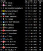
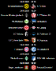
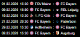
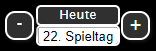
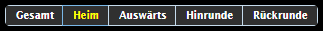

# IoBroker 适配器从 OpenLigaDB 获取足球比赛结果
＃＃ 概述
用于从 `openligadb.de` 请求足球或其他游戏比赛数据的适配器

＃＃ 配置
添加适配器的实例并单击扳手符号。在表单中，您可以添加来自联赛和赛季的快捷方式。
请访问`openligadb.de`了解可用的联赛、赛季和快捷方式。如果一个赛季跨越两年，请仅输入开始年份。

1. 德国联赛的示例数据为`shortcut = bl1 season = 2023`

如果您保存并关闭了配置，不久之后就一定会出现您的联赛和赛季的新数据点。

## 小部件
实际上有 5 个小部件可用。请在小部件过滤器中输入 openligadb

###表 4


Das ist die klassische Tabellenansicht.\ Die Tabelle enthält verschiedene Spalten。

- Sp=Anzahl gespielter 游戏
- S=围攻
- U=未显示
- N=下拉根
- Tore=Torverhältnis
- 点数=点数标准

属性表
|属性|集团 |说明 |
| ----------------------------------- | ------------------------ | ------------------------------------------------------------------------------------------------------------------------------------------------------------------------------------------------------------------------------------------------------------------------------------------------------------------------------------------------------------------------------------------------------------------------------------------ |
|百搭|                          | Hier muss ein Datenpunkt mit der Bezeichnung allmatches (Achtung im alten widget musste hier noch table ausgewählt werden) ausgewählt werden。联赛/赛季配置中的数据点，落入了安加本的罪孽之中。 Der Datenpunkt enthält alle Spieldaten einer Liga/Season im JSON 格式。我们的日期是根据该方式的基础而制定的。 |
|当前游戏日 |                          | Hier ist ein Datenpunk zu wählen, der mit curgameday benannt ist.联赛/赛季配置中的数据点，落入了安加本的罪孽之中。适配器是当前基准数据的基础。游戏标签将在未来游戏标签的游戏时间和未来游戏标签的时间间隔内进行。                           |
|模式 |                          | Listenauswahl 在 welchem Modus die Tabelle angezeigt werden soll zur Auswahl steht Gesamt (1total)、Heim (2home) 或 Auswärts (3away)、Hinrunde (4round1) 或 Rückrunde (5round2)。                                                                                                                                                                                                                                                        |
|模式绑定 |                          |属性在属性模式下有效。 Es wurde ergänzend eingeführ, so das der Tabellenmodus ebenfalls per Binding gesteuert werden kann.在 Textfeld 中，我们将使用该模式。当您使用属性模式时，该属性将被更改为属性模式。 Ein Normalanwender sollte er nichts eintragen。                                       |
|马克西康 |                          | Maxmale Größe des Manschaftsicons in x oder y-Richtung。                                                                                                                                                                                                                                                                                                                                                                                   |
|简称 |                          | Anstatt des Manschaftsnamens wrd der Kurzname angezeigt，落在 den vorliegenden Daten gepflegt wurde 中。                                                                                                                                                                                                                                                                                                                           |
|索特伦德 |                          | Auswahl，wenn Trendicons angezeigt werden solen。 Der Trend wird im Vergleich zum vorherigen Spieltag berechnet。                                                                                                                                                                                                                                                                                                                           |
|突出|                          | Hier können ein oder mehrere Begriffe mit Semikolon (;) getrennt eingegeben werden die hervorgehoben werden sollen。 Die Suche erfolgt nur in den Mannschaftsnamen。带有 HTML 标签的珠宝名称`<b>` 是最伟大的。详细格式可以参见 css-Klasse“最喜欢的”erfolgen。 Ausserdem 可以突出显示单个 CSS-Klasse angegeben werden。 Vgl。卡皮特尔待办事项 |
|过滤器|                          | Hier können ein oder mehrere Begriffe mit Semikolon (;) getrennt eingegeben werden and deren die Tabelle gefiltert dargestellt wird。                                                                                                                                                                                                                                                                                                    |
| iconup、icondn、iconst |属性组图标| Trendicons 定义了我们的特征。                                                                                                                                                                                                                                                                                                                                                                                            |
| showgameday 在 der Attributgruppe |警告 |您可以查看游戏中的游戏标签 | 游戏标签 |
|属性组中的lastgamecount |警告 | Wenn hier eine Zahl eingegeben wird, dann wird die Tabelle nur für die Anzahl von Spieltagen bis zum aktuell angezeigten Spieltag (in Abhängigkeit von currgameday und showgameday) berechnet Beispiel: Eingabe bei showgameday = 10 und bei lastgamecount=5: Die Tabelle wird nur für die Spieltage 6-10 berechnet (5 Spieltage) | 游戏 |

### Gameday v2 的游戏


Dieses Widget zeigt den Spieltag 和。我无法理解当前的情况，相对于当前的情况或最佳的游戏情况。
游戏中的游戏元素非常丰富。
Bestimmte Elemente der Anzeige wurden mit **CSS-Klassen** versehen，für die dann beliebig eine bestimmte Formatierung festgelegt werden kann：

| CSS 类 |元素的格式|安梅尔宫 |
| --------------- | ----------------------------------------------- | ------------------------------------------------------------------------------------------------------------------------------------------------------------------------- |
|最喜欢 | im Anzeigekopf eines Spieltages (Datum/Uhrzeit) | Hier kann Datum und Uhrzeit formatiert werden, wenn die Lieblingsmannschaft am Spieltag spielt. ggfs。可以看到CSS-Klasse“todaygameheader”的含义。 |
|最喜欢 |曼斯查夫特斯名称 | Hier kann der Mannschaftsname entprechend formatiert werden。                                                                                                             |
|今日游戏 |游戏的完整内容 | Wird markiert，wenn das Spiel am heutigen Tag statt findet。                                                                                                               |
|今日游戏标题 | im Anzeigekopf eines Spieltages (Datum/Uhrzeit) | Wird markiert，wenn das Spieltagsdatum am heutigen 标签 ist |

#### CSS Klassen 的说明
##### Beispiel Anzeigekopf eines Spieltages (Datum generic)
```css
.oldb-tt tr.favorite {
  color: yellow;
}
```

##### Beispiel Mannschaftsname
```css
.oldb-tt b.favorite {
  color: blue;
}
```

##### Beispiel Zeile eines Spiels
```css
.oldb-tt .todaygame {
  color: red;
}
```

##### Beispiel Anzeigekopf eines Spieltages (Datum heute)
```css
.oldb-tt .todaygameheader {
  color: lightgreen;
}
```

#### Gamedays 的属性游戏
|属性|集团 |说明 |
| ---------------- | ------------------------ | -------------------------------------------------------------------------------------------------------------------------------------------------------------------------------------------------------------------------------------------------------------------------------------------------------------------------------------------------------------------------------------------------------------------------------------- |
|百搭|                          | Hier muss ein Datenpunkt mit der Bezeichnung allmatches ausgewählt werden。联赛/赛季配置中的数据点，落入了安加本的罪孽之中。 Der Datenpunkt enthält alle Spiele and Ergebnisse einer Liga/Season im JSON-Format Wenn der Spieltag am heutigen Tag statt findet, dann wird das Datum (todaygameheader) and das jeweilige Spiel (todaygame) mit CSS-Klassen versehen. |
|当前游戏日 |                          | Hier ist ein Datenpunk zu wählen, der mit curgameday benannt ist.联赛/赛季配置中的数据点，落入了安加本的罪孽之中。适配器是当前基准数据的基础。游戏标签是指在游戏中的游戏标签和未来的游戏标签之间的时间间隔。                      |
|马克西康 |                          | Maxmale Größe des Manschaftsicons in x oder y-Richtung。                                                                                                                                                                                                                                                                                                                                                                               |
|简称 |                          | Anstatt des Manschaftsnamens wrd der Kurzname angezeigt，落在 den vorliegenden Daten gepflegt wurde 中。                                                                                                                                                                                                                                                                                                                       |
|展示目标 |                          |有关 Torschützen 的信息。                                                                                                                                                                                                                                                                                                                                                                                       |
|突出|                          |您可以使用分号 (;) 来表示所有内容，然后使用分号 (;) 来表示。 Die Suche erfolgt nur in den Mannschaftsnamen。带有 HTML 标签的珠宝名称`<b>` 是最伟大的。详细格式可以参见 css-Klasse“最喜欢的”erfolgen。 Ausserdem 可以突出显示单个 CSS-Klasse angegeben werden。 Vgl。卡皮特尔待办事项 |
|秀游戏日 |警告 | Wenn dieses Feld leer bleibt, wird immer der aktuelle Spieltag angezeigt.Trägt man eine Positive Zahl ein, dann wird, Falls vorhanden, der ausgewählte Spieltag angezeigt.Trägt man eine negative Zahl ein, dann wird relativ aktuellen Spieltag dieser angezeigt (bspw -1 entpricht dem vorherigen Spieltag) |
|显示游戏天数 |警告 | 1. 游戏中的游戏内容。一切都已经结束，但安扎尔·冯·斯皮尔塔根 (Anzahl von Spieltagen)，在 showgameday 的比赛中也将出现。                                                                                                                                                                                                |
|每周演出 |警告 | Zeigt vor dem Datum wahlweise den Wochentag 和。                                                                                                                                                                                                                                                                                                                                                                                        |

##### 示例
###### Showgameday 属性中的绑定说明
ggfs。可以将其视为 vis-bound rechnet 和 gefüllt werden。
相关游戏标签： |

```text
    Vorheriger Spieltag
    {a:openligadb.0.bl1.2019.currgameday;a-1} oder
    Nachfolgender Spieltag
    {a:openligadb.0.bl1.2019.currgameday;a+1}
```

绑定不是在编辑模式下进行的，绑定在编辑模式中是在当前的游戏标签中进行的。

### 最喜爱的俱乐部的比赛 2
 Diese Widget zeigt die nächsten Spiele deiner Lieblingsmannschaften aus ein oder mehrerer Ligen and.在 Auswahl der Anzahl der anzuzeigenden Ligen 中，我们将 Liga 与单独的配置组管理一起，在 der die folgenden Einstellungen vorgenommen werden können 中。
Wenn das Spiel am heutigen Tag statt findet，dann wird das jeweilige Spiel (todaygame) mit CSS-Klassen versehen。

#### 示例
```css
.todaygame {
  color: red;
}

.todaygameheader {
  color: yellow;
}
```

＃＃＃＃ 属性
|属性|集团 |说明 |
| ---------------- | ---------- | -------------------------------------------------------------------------------------------------------------------------------------------------------------------------------------------------------------------------------------------------------------------------------------------------------------------------------------------------------------------------------------------------------------------------- |
|安扎尔联赛|概要 |您可以通过以下方式进行安全检查。 Für jede Liga 是独立的配置组。                                                                                                                                                                                                                                                                                           |
|马克西康 |全部 | Maxmale Größe des Manschaftsicons in x oder y-Richtung。                                                                                                                                                                                                                                                                                                                                                                   |
|显示结果 |概要 | Auswahl，ob die Spielergebnisse，sofern bekannt，angezeigt werden sollen |
|显示缩写 |概要 | Um die Spiele der einzelnen Ligen unterscheiden zu können, kann man eine eigene Kürzung in der jeweiligen Configuration eintragen.您可以将其打开，然后将其打开。                                                                                                                                                                                                                            |
|每周演出 |概要 | Zeigt vor dem Datum wahlweise den Wochentag 和。 Die folgenden der Gruppe Liga können sich in Abhängigkeit der Eingabe bei **Anzahl Liga** mehrfach wiederholen。                                                                                                                                                                                                                                               |
|百搭|联赛| Hier muss ein Datenpunkt mit der Bezeichnung allmatches ausgewählt werden。联赛/赛季配置中的数据点，落入了安加本的罪孽之中。以 JSON 格式查看联赛/赛季的所有比赛和比赛 |
|当前游戏日 |联赛 |今日游戏当天请注意以下事项。联赛/赛季配置中的数据点，落入了安加本的罪孽之中。适配器是当前基准数据的基础。游戏标签是指在游戏中的游戏标签和未来的游戏标签之间的时间间隔。 |
|秀游戏日 |联赛 |温恩 (Wenn) 看着镜头，立即沉浸在游戏中。 Trägt man eine Positive Zahl ein，dann wird，falls vorhanden，vom ausgewählte Spieltag ausgegangen。 Trägt man eine negative Zahl ein，dann wird relativ aktuellen spieltag ausgegangen (bspw -1 entspricht dem vorherigen Spieltag) |
|显示游戏天数 |联赛|您可以在此处查看旧游戏中的游戏内容。请注意，请在所有剩余的 Spieltage 操作（最大 9999 Spieltage）中进行操作，然后在所有 Spiele 中进行 Anzahl von Spieltagen，然后在 showgameday 操作中进行操作。                                                                             |
|简称 |联赛| Anstatt des Manschaftsnamens wrd der Kurzname angezeigt，落在 den vorliegenden Daten gepflegt wurde 中。                                                                                                                                                                                                                                                                                                           |
|缩写|联赛| Abkürzung die für diese Liga angezeigt werden soll, sofern showabbreviation ausgewählt wurde。                                                                                                                                                                                                                                                                                                                              |
|突出|联赛 | Hier können ein oder mehrere Begriffe mit mit Colon (;) getrennt eingegeben werden, um die Lieblingsmanschaften zu finden。 Die Suche erfolgt nur in den Mannschaftsnamen。您可以在其他小部件中找到它。                                                                                                                                                                      |

#### Beispiele 最喜爱俱乐部游戏
##### Beispiele für das Binding im Attribut showgameday 最喜欢的俱乐部游戏
ggfs。可以看到与绑定的 berechnet 和 gefüllt werden 相关的字段。
相关游戏标签：

```css
    Vorheriger Spieltag
    {a:openligadb.0.bl1.2019.currgameday;a-1} oder
    Nachfolgender Spieltag
    {a:openligadb.0.bl1.2019.currgameday;a+1}
```

绑定不是在编辑模式下进行的，绑定在编辑模式中是在当前的游戏标签中进行的。

### 数据透视表 2
Diese Widget zeigt die alle Spiele 和 Ergebnisse als Pivottabelle 和

| CSS 类 |元素的格式 |贝斯皮尔 |
| ---------- | ---------------------------------------------- | -------- |
|最喜欢 |曼斯查夫特名称 | 亮点 |          |

#### 示例数据透视表
##### Beispiel Der 每个亮点 ausgewählte Mannschaftsnamen
```css
.oldb-tt .favorite {
  color: yellow;
}
```

#### 属性数据透视表
|属性 |集团 |说明 |
| ------------------- | --------- | -------------------------------------------------------------------------------------------------------------------------------------------------------------------------------------------------------------------------------------------------------------------------------------------------------------------------------------------------------------------------------------------------------------------------- |
|百搭|概要 | Hier muss ein Datenpunkt mit der Bezeichnung allmatches ausgewählt werden。联赛/赛季配置中的数据点，落入了安加本的罪孽之中。以 JSON 格式查看联赛/赛季的所有比赛和比赛 |
|当前游戏日 |概要 |今日游戏当天请注意以下事项。联赛/赛季配置中的数据点，落入了安加本的罪孽之中。适配器是当前基准数据的基础。游戏标签是指在游戏中的游戏标签和未来的游戏标签之间的时间间隔。 |
|马克西康 |           | Maxmale Größe des Manschaftsicons in x oder y-Richtung。                                                                                                                                                                                                                                                                                                                                                                   |
|排序4e |           | Einstellung nachdem sortiert werden soll。                                                                                                                                                                                                                                                                                                                                                                                  |
|简称 |           | Anstatt des Manschaftsnamens wrd der Kurzname angezeigt，落在 den vorliegenden Daten gepflegt wurde 中。                                                                                                                                                                                                                                                                                                           |
|亮点是安芳|           |这是突出显示的 Anfang der Tabelle angezeigt。                                                                                                                                                                                                                                                                                                                                                                        |
|突出|           |您可以使用分号 (;) 来表示所有内容，然后使用分号 (;) 来表示。 Die Suche erfolgt nur in den Mannschaftsnamen。带有 HTML 标签的珠宝名称`<b>` 是最伟大的。详细格式可以参见 css-Klasse“最喜欢的”erfolgen。                                                                                                                |

### 进球者 2
Widget zeigt die alle Torjäger 和

#### 属性目标获取器
|属性|集团 |说明 |
| --------------- | --------- | ------------------------------------------------------------------------------------------------------------------------------------------------------------------------------------------------------------------------------------------------------------------------------------------------------- |
|守门员 |概要 |守门员在比赛中的表现非常出色。联赛/赛季配置中的数据点，落入了安加本的罪孽之中。 Der Datenpunkt enthält alle Torjäger der aktuellen Saison。                                             |
|马克西玛拉·安扎尔 |           | Nur die angegebene Anzahl an Torjäger wird angezeigt。                                                                                                                                                                                                                                                   |
|排序|           | Auswahl der Sortierreihenfolge。                                                                                                                                                                                                                                                                         |
|努尔亮点|           | Nur die Einträge zum Higlightfilter werden angezeigt。                                                                                                                                                                                                                                                   |
|突出|           |您可以使用分号 (;) 来表示所有内容，然后使用分号 (;) 来表示。 Die Suche erfolgt nur in den Spielernamen。带有 HTML 标签的珠宝名称`<b>` 是最伟大的。详细格式可以参见 css-Klasse“最喜欢的”erfolgen。 |

## Rezepte zur Wiederverwendung
### 超过 Knöpfe 的 Tabellenmodus 管理
1. Ein Widgets 表 v2 anlegen。并在 der Hilfe beschrieben konfigurieren 中查看
2. 数据点中的组件设置

   日期朋克

3. Dieses Widget kopieren und nebeneinander einfügen, so das es insgesamt

3 观点不合

4. Bei Widgeteinstellungen in der Gruppe Sichtbarkeit den “Wert für die”

Bedingung dann bei jedem der 3 Widgets jeweils nur einen der folgenden Werte eintragen Total,home,away

5. Dann ein neues Widget anlegen：Radiobuttons ValueList（位于 der

   标准安装 von vis schon enthalten

6. 在 Gruppe Allgemein deinenangelegten ObjectID auswählen 中的 diesem Widget 中
7. Bei Werte das folgende eintragen：total;home;away（dies muss mit dem was）

   du unter sichtbarkeit bei den widgets eingetragen hast zusammenpassen

8. Bei Texte das folgende eintragen: Gesamt;Heim;Auswärts
9. Dann in den vis 运行时 gehen und ausprobieren
10. Wenn alles funktioniert zum Schluss noch die widgets exakt übereinander

    传奇，所以是澳大利亚人

### Laufschrift einer Widgetzeile
sieht nur schön aus，wenn nur eine oder wenige Zeilen angezeigt werden bspw bei dem FavGame-widget

`#w00000` 是小部件的 ID，是一个动画。

扩张

```css
#w00000 .oldb-tt {
  max-width: 100vw; /* iOS braucht das */
  overflow: hidden;
}

#w00000 .oldb-tt tbody {
  display: inline-block;
  padding-left: 100%;
  animation: marquee 10s linear infinite;
}

/* Make it move */
@keyframes marquee {
  0% {
    transform: translateX(0);
  }
  100% {
    transform: translateX(-100%);
  }
}
```

### Spieltag über +/- Buttons steuern, sowie direkte Auswahl per Listbox
 Dazu ist für die Steuerung ein zusätzlicher Datenpunkt mit Typ Zahl/number anzulegen。
在 javascript.0.bl1.spieltag genannt 中。
Danke an bommel_030 Die 4 Steuerelemente zum importieren findet ihr hier:

扩张

```text
    [{"tpl":"_tplGroup","data":{"members":["w00065","w00066","g00001"],"visibility-cond":"==","visibility-val":1,"visibility-groups-action":"hide","attrCount":"1","signals-cond-0":"==","signals-val-0":true,"signals-icon-0":"/vis/signals/lowbattery.png","signals-icon-size-0":0,"signals-blink-0":false,"signals-horz-0":0,"signals-vert-0":0,"signals-hide-edit-0":false,"signals-cond-1":"==","signals-val-1":true,"signals-icon-1":"/vis/signals/lowbattery.png","signals-icon-size-1":0,"signals-blink-1":false,"signals-horz-1":0,"signals-vert-1":0,"signals-hide-edit-1":false,"signals-cond-2":"==","signals-val-2":true,"signals-icon-2":"/vis/signals/lowbattery.png","signals-icon-size-2":0,"signals-blink-2":false,"signals-horz-2":0,"signals-vert-2":0,"signals-hide-edit-2":false,"lc-type":"last-change","lc-is-interval":true,"lc-is-moment":false,"lc-format":"","lc-position-vert":"top","lc-position-horz":"right","lc-offset-vert":0,"lc-offset-horz":0,"lc-font-size":"12px","lc-font-family":"","lc-font-style":"","lc-bkg-color":"","lc-color":"","lc-border-width":"0","lc-border-style":"","lc-border-color":"","lc-border-radius":10,"lc-zindex":0},"widgetSet":null,"style":{"top":38.28125,"left":"663px","width":"141px","height":"37px"}},{"tpl":"tplIconInc","data":{"oid":"javascript.0.bl1.spieltag","repeat_delay":"800","repeat_interval":"800","src":"","step":"-1","minmax":"1","text":"-","g_last_change":false,"lc-type":"last-change","lc-is-interval":true,"lc-is-moment":false,"lc-format":"","lc-position-vert":"top","lc-position-horz":"right","lc-offset-vert":0,"lc-offset-horz":0,"lc-font-size":"12px","lc-font-family":"","lc-font-style":"","lc-bkg-color":"","lc-color":"","lc-border-width":"0","lc-border-style":"","lc-border-color":"","lc-border-radius":10,"lc-zindex":0,"name":"spieltag_minus","g_visibility":false,"visibility-cond":"==","visibility-val":1,"visibility-groups-action":"hide","g_gestures":false,"g_signals":false,"signals-cond-0":"==","signals-val-0":true,"signals-icon-0":"/vis/signals/lowbattery.png","signals-icon-size-0":0,"signals-blink-0":false,"signals-horz-0":0,"signals-vert-0":0,"signals-hide-edit-0":false,"signals-cond-1":"==","signals-val-1":true,"signals-icon-1":"/vis/signals/lowbattery.png","signals-icon-size-1":0,"signals-blink-1":false,"signals-horz-1":0,"signals-vert-1":0,"signals-hide-edit-1":false,"signals-cond-2":"==","signals-val-2":true,"signals-icon-2":"/vis/signals/lowbattery.png","signals-icon-size-2":0,"signals-blink-2":false,"signals-horz-2":0,"signals-vert-2":0,"signals-hide-edit-2":false},"style":{"left":"0%","top":"16.22%","background":"#303030","width":"17.73%","height":"67.57%","z-index":"50","font-family":"","background-color":"#303030","font-weight":"bolder","border-width":"2px","border-radius":"10px","box-shadow":"2px 2px 3px rgba(20, 20, 20, 50)","color":"white","border-style":"solid","border-color":"white","font-size":""},"widgetSet":"jqui","grouped":true,"groupName":"w00065"},{"tpl":"tplIconInc","data":{"oid":"javascript.0.bl1.spieltag","repeat_delay":"800","repeat_interval":"800","src":"","step":"+1","minmax":"34","text":"+","gestures-offsetX":0,"gestures-offsetY":"-1","signals-cond-0":"==","signals-val-0":true,"signals-icon-0":"/vis.0/VIS/lowbattery.png","signals-icon-size-0":0,"signals-blink-0":false,"signals-horz-0":0,"signals-vert-0":0,"signals-hide-edit-0":false,"signals-cond-1":"==","signals-val-1":true,"signals-icon-1":"/vis.0/VIS/lowbattery.png","signals-icon-size-1":0,"signals-blink-1":false,"signals-horz-1":0,"signals-vert-1":0,"signals-hide-edit-1":false,"signals-cond-2":"==","signals-val-2":true,"signals-icon-2":"/vis.0/VIS/lowbattery.png","signals-icon-size-2":0,"signals-blink-2":false,"signals-horz-2":0,"signals-vert-2":0,"signals-hide-edit-2":false,"g_last_change":false,"lc-type":"last-change","lc-is-interval":true,"lc-is-moment":false,"lc-format":"","lc-position-vert":"top","lc-position-horz":"right","lc-offset-vert":0,"lc-offset-horz":0,"lc-font-size":"12px","lc-font-family":"","lc-font-style":"","lc-bkg-color":"","lc-color":"","lc-border-width":"0","lc-border-style":"","lc-border-color":"","lc-border-radius":10,"lc-zindex":0,"name":"spieltag_plus","g_visibility":false,"visibility-cond":"==","visibility-val":1,"visibility-groups-action":"hide"},"style":{"left":"82.27%","top":"16.22%","background":"#303030","width":"17.73%","height":"67.57%","z-index":"50","font-family":"","background-color":"#303030","font-weight":"bolder","border-width":"2px","border-radius":"10px","box-shadow":"2px 2px 3px rgba(20, 20, 20, 50)","color":"white","border-style":"solid","border-color":"white"},"widgetSet":"jqui","grouped":true,"groupName":"w00066"},{"tpl":"_tplGroup","data":{"members":["w00064","w00059"],"visibility-cond":"==","visibility-val":1,"visibility-groups-action":"hide","attrCount":"1","signals-cond-0":"==","signals-val-0":true,"signals-icon-0":"/vis/signals/lowbattery.png","signals-icon-size-0":0,"signals-blink-0":false,"signals-horz-0":0,"signals-vert-0":0,"signals-hide-edit-0":false,"signals-cond-1":"==","signals-val-1":true,"signals-icon-1":"/vis/signals/lowbattery.png","signals-icon-size-1":0,"signals-blink-1":false,"signals-horz-1":0,"signals-vert-1":0,"signals-hide-edit-1":false,"signals-cond-2":"==","signals-val-2":true,"signals-icon-2":"/vis/signals/lowbattery.png","signals-icon-size-2":0,"signals-blink-2":false,"signals-horz-2":0,"signals-vert-2":0,"signals-hide-edit-2":false,"lc-type":"last-change","lc-is-interval":true,"lc-is-moment":false,"lc-format":"","lc-position-vert":"top","lc-position-horz":"right","lc-offset-vert":0,"lc-offset-horz":0,"lc-font-size":"12px","lc-font-family":"","lc-font-style":"","lc-bkg-color":"","lc-color":"","lc-border-width":"0","lc-border-style":"","lc-border-color":"","lc-border-radius":10,"lc-zindex":0},"widgetSet":null,"style":{"top":"0%","left":"21.99%","width":"56.74%","height":"100%"},"grouped":true,"groupName":"g00001"},{"tpl":"tplJquiSelectList","data":{"oid":"javascript.0.bl1.spieltag","g_fixed":true,"g_visibility":false,"g_css_font_text":true,"g_css_background":true,"g_css_shadow_padding":true,"g_css_border":true,"g_gestures":false,"g_signals":false,"values":"1;2;3;4;5;6;7;8;9;10;11;12;13;14;15;16;17;18;19;20;21;22;23;24;25;26;27;28;29;30;31;32;33;34","texts":"1. Spieltag;2. Spieltag;3. Spieltag;4. Spieltag;5. Spieltag;6. Spieltag;7. Spieltag;8. Spieltag;9. Spieltag;10. Spieltag;11. Spieltag;12. Spieltag;13. Spieltag;14. Spieltag;15. Spieltag;16. Spieltag;17. Spieltag;18. Spieltag;19. Spieltag;20. Spieltag;21. Spieltag;22. Spieltag;23. Spieltag;24. Spieltag;25. Spieltag;26. Spieltag;27. Spieltag;28. Spieltag;29. Spieltag;30. Spieltag;31. Spieltag;32. Spieltag;33. Spieltag;34. Spieltag","height":"150","signals-cond-0":"==","signals-val-0":true,"signals-icon-0":"/vis/signals/lowbattery.png","signals-icon-size-0":0,"signals-blink-0":false,"signals-horz-0":0,"signals-vert-0":0,"signals-hide-edit-0":false,"signals-cond-1":"==","signals-val-1":true,"signals-icon-1":"/vis/signals/lowbattery.png","signals-icon-size-1":0,"signals-blink-1":false,"signals-horz-1":0,"signals-vert-1":0,"signals-hide-edit-1":false,"signals-cond-2":"==","signals-val-2":true,"signals-icon-2":"/vis/signals/lowbattery.png","signals-icon-size-2":0,"signals-blink-2":false,"signals-horz-2":0,"signals-vert-2":0,"signals-hide-edit-2":false,"no_style":true,"class":"","lc-type":"last-change","lc-is-interval":true,"lc-is-moment":false,"lc-format":"","lc-position-vert":"top","lc-position-horz":"right","lc-offset-vert":0,"lc-offset-horz":0,"lc-font-size":"12px","lc-font-family":"","lc-font-style":"","lc-bkg-color":"","lc-color":"","lc-border-width":"0","lc-border-style":"","lc-border-color":"","lc-border-radius":10,"lc-zindex":0,"open":false,"name":"spieltag_liste","visibility-cond":"==","visibility-val":1,"visibility-groups-action":"hide"},"style":{"left":"0%","top":"54.77%","height":"45.95%","width":"100%","background":"","box-shadow":"","border-radius":"5px","padding-left":"","padding-right":"","margin-right":"","color":"","font-weight":"bolder","border-width":"2px","border-style":"solid","border-color":"white","background-color":""},"widgetSet":"jqui","grouped":true,"groupName":"w00064"},{"tpl":"tplIconState","data":{"oid":"javascript.0.bl1.spieltag","g_fixed":true,"g_visibility":false,"g_css_font_text":true,"g_css_background":true,"g_css_shadow_padding":false,"g_css_border":true,"g_gestures":false,"g_signals":false,"g_last_change":false,"visibility-cond":"==","visibility-val":1,"visibility-groups-action":"hide","signals-cond-0":"==","signals-val-0":true,"signals-icon-0":"/vis/signals/lowbattery.png","signals-icon-size-0":0,"signals-blink-0":false,"signals-horz-0":0,"signals-vert-0":0,"signals-hide-edit-0":false,"signals-cond-1":"==","signals-val-1":true,"signals-icon-1":"/vis/signals/lowbattery.png","signals-icon-size-1":0,"signals-blink-1":false,"signals-horz-1":0,"signals-vert-1":0,"signals-hide-edit-1":false,"signals-cond-2":"==","signals-val-2":true,"signals-icon-2":"/vis/signals/lowbattery.png","signals-icon-size-2":0,"signals-blink-2":false,"signals-horz-2":0,"signals-vert-2":0,"signals-hide-edit-2":false,"lc-type":"last-change","lc-is-interval":true,"lc-is-moment":false,"lc-format":"","lc-position-vert":"top","lc-position-horz":"right","lc-offset-vert":0,"lc-offset-horz":0,"lc-font-size":"12px","lc-font-family":"","lc-font-style":"","lc-bkg-color":"","lc-color":"","lc-border-width":"0","lc-border-style":"","lc-border-color":"","lc-border-radius":10,"lc-zindex":0,"text":"Heute","invert_icon":false,"value":"{openligadb.0.bl1.2019.currgameday}"},"style":{"left":"0%","top":"0%","color":"white","background":"#303030","font-size":"small","font-weight":"normal","height":"45.95%","border-width":"2px","border-style":"solid","border-color":"white","width":"100%"},"widgetSet":"jqui","grouped":true,"groupName":"w00059"}]
```

### Anzeige von bestimmten Eigenschaften，falls eine der Lieblingsmannschaften am heutigen Tag spielen
**Beipiel 1** HTML-Widget 是一个简单的背景，来自拜仁现在的主题。
Der Bindungsausdruck 位于 das Field 背景色中，是 Reiter CSS Hintergrund gesetzt 中的。

```text
    {a:openligadb.0.bl1.2019.currgameday;vis.binds["openligadb"].checkTodayFavorite('openligadb.0.bl1.2019.allmatches','bayern')?'red':'green'}
```

扩张

```text
    [{"tpl":"tplHtml","data":{"g_fixed":false,"g_visibility":false,"g_css_font_text":false,"g_css_background":true,"g_css_shadow_padding":false,"g_css_border":true,"g_gestures":false,"g_signals":false,"g_last_change":false,"visibility-cond":"==","visibility-val":1,"visibility-groups-action":"hide","refreshInterval":"0","signals-cond-0":"==","signals-val-0":true,"signals-icon-0":"/vis/signals/lowbattery.png","signals-icon-size-0":0,"signals-blink-0":false,"signals-horz-0":0,"signals-vert-0":0,"signals-hide-edit-0":false,"signals-cond-1":"==","signals-val-1":true,"signals-icon-1":"/vis/signals/lowbattery.png","signals-icon-size-1":0,"signals-blink-1":false,"signals-horz-1":0,"signals-vert-1":0,"signals-hide-edit-1":false,"signals-cond-2":"==","signals-val-2":true,"signals-icon-2":"/vis/signals/lowbattery.png","signals-icon-size-2":0,"signals-blink-2":false,"signals-horz-2":0,"signals-vert-2":0,"signals-hide-edit-2":false,"lc-type":"last-change","lc-is-interval":true,"lc-is-moment":false,"lc-format":"","lc-position-vert":"top","lc-position-horz":"right","lc-offset-vert":0,"lc-offset-horz":0,"lc-font-size":"12px","lc-font-family":"","lc-font-style":"","lc-bkg-color":"","lc-color":"","lc-border-width":"0","lc-border-style":"","lc-border-color":"","lc-border-radius":10,"lc-zindex":0},"style":{"left":"445px","top":"589px","background":"{a:openligadb.0.bl1.2019.currgameday;vis.binds[\"openligadb\"].checkTodayFavorite('openligadb.0.bl1.2019.allmatches','bayer')?'red':'green'}","width":"70px","height":"70px","border-radius":"10px"},"widgetSet":"basic"}]
```

### 表格小部件的 Auswahl des Tabellenmodus
 将 HTML 小部件设置为 Tabellen 小部件的模式。
Der im folgenden widget verwendete Datenpunkt lautet：

`javascript.0.tabellemodus`

Dieser ist als Bindung in das attribut mode_binding im tabellen widget wie folgt zuhinterlegen:

```text
    {javascript.0.tabellemodus}
```

Hier der widget code zum importieren.

扩张

```text
    [{"tpl":"tplJquiRadioList","data":{"oid":"javascript.0.tabellemodus","g_fixed":true,"g_visibility":false,"g_css_font_text":true,"g_css_background":true,"g_css_shadow_padding":false,"g_css_border":false,"g_gestures":false,"g_signals":false,"g_last_change":false,"visibility-cond":"==","visibility-val":1,"visibility-groups-action":"hide","values":"1total;2home;3away;4round1;5round2","texts":"Gesamt;Heim;Auswärts;Hinrunde;Rückrunde","signals-cond-0":"==","signals-val-0":true,"signals-icon-0":"/vis/signals/lowbattery.png","signals-icon-size-0":0,"signals-blink-0":false,"signals-horz-0":0,"signals-vert-0":0,"signals-hide-edit-0":false,"signals-cond-1":"==","signals-val-1":true,"signals-icon-1":"/vis/signals/lowbattery.png","signals-icon-size-1":0,"signals-blink-1":false,"signals-horz-1":0,"signals-vert-1":0,"signals-hide-edit-1":false,"signals-cond-2":"==","signals-val-2":true,"signals-icon-2":"/vis/signals/lowbattery.png","signals-icon-size-2":0,"signals-blink-2":false,"signals-horz-2":0,"signals-vert-2":0,"signals-hide-edit-2":false,"lc-type":"last-change","lc-is-interval":true,"lc-is-moment":false,"lc-format":"","lc-position-vert":"top","lc-position-horz":"right","lc-offset-vert":0,"lc-offset-horz":0,"lc-font-size":"12px","lc-font-family":"","lc-font-style":"","lc-bkg-color":"","lc-color":"","lc-border-width":"0","lc-border-style":"","lc-border-color":"","lc-border-radius":10,"lc-zindex":0,"class":""},"style":{"left":"54px","top":"356px","background":"black","font-size":"xx-small"},"widgetSet":"jqui"}]
```

## 特殊功能
### Vis.binds\["openligadb"\].checkTodayFavorite(ObjectID,Favorites)
Javascript-Funktion zur Überprüfung, ob am heutigen Tag for ein oder mehrere Mannschaften ein Spiel statt findet.该功能可以与绑定版本一起使用。绑定的安装方式将在海滩上进行。

Diese Funktion 可以通过 Binding bspw 来实现。 wie folgt verwendet werden。
Zum Test 可以使用 HTML-widget eingetragen werden 中的符号。
Als Ergebnis dann entweder ja oder nein ausgegeben, je nachdem ob am heutigen Tag der Suchbegriff in den Mannschaftsnamen gefunden wurde。
Alle Anführungszeichen (einfache und doppelte) müssen exakt so eingegeben werden。

架构
```text
    {a:oid;vis.binds["openligadb"].checkTodayFavorite('oid_allmatches','clubsuche1,clubsuche2')?'ja':'nein'}
```

现实生活中的例子
```text
    {a:openligadb.0.bl1.2024.currgameday;vis.binds["openligadb"].checkTodayFavorite('openligadb.0.bl1.2024.allmatches','bayern')?'ja':'nein'}
```

#### 参数意义
```text
<table><tbody><tr><td>oid</td><td>ein beliebiger Datenpunkt, der die Aktualisierung triggert. Es empfiehlt sich bspw. currgameday zu wählen,<br>da dies gleichzeitig mit allmatches aktualisiert wird.</td></tr><tr><td>oid_allmatches</td><td>Bezeichnung eines Datenpunktes allmatches der jeweiligen Liga/Saison.</td></tr><tr><td>clubsuche</td><td>ein oder mehrere Bezeichnungen (können auch Teilbezeichnungen sein), mit Komma (,) getrennt. Bitte beachten.<br>Diese Feld entspricht in den Widgets dem Feldt highlight. Mehrere Suchbegriffe müssen hier nur mit Komma getrennt werden und nicht mit Semikolon wie in den Widgets.</td></tr></tbody></table>
```

vis-widgets 的文档可以在 vis 或[Widget 文档/德语](https://htmlpreview.github.io/?https://github.com/oweitman/ioBroker.openligadb/blob/master/widgets/openligadb/doc.html) 中找到

## `sendTo` 命令
###`getMatchData`
按联盟、赛季和时间范围从 OpenLigaDB 请求数据。

#### 强制参数
| `Parameter` | `Example` | `Type` | `Description` |
| `league` | `bl1` | `string` | `identifier of the league, see openlogadb` |
| `season` | `2024` | `string` | `name of the season, see openlogadb` |
| `datefrom` | `2024-09-01T00:00` | `string` | `date in ISO notation` |
| `datetill` | `2024-09-10T00:00` | `string` | `date in ISO notation` |
| `datetill` | `2024-09-10T00:00` | `string` | `ISO 符号中的日期` |

＃＃＃＃ 例子
```javascript
sendTo(
  "openligadb.0",
  "getMatchData",
  {
    league: "bl1",
    season: "2024",
    datefrom: "2024-09-01T00:00",
    datetill: "2024-09-10T00:00",
  },
  function (matches) {
    console.log(matches);
  }
);
```

待办事项
- 如果用户没有选择正确的数据点，则在小部件中进行验证
- ~~翻译~~
- ~~新小部件数据透视表和 goalgetters 的文档~~
- ~~扩展桌面模式，增加第一轮、第二轮~~
- ~~已玩过的游戏的新小部件数据透视表~~
- ~~新的小部件目标获取器排名，具有排序功能~~
- ~~用趋势符号扩展表格（向上/向下箭头，指向无变化）~~
- ~~扩展表格以计算最后 x 场比赛~~
- ~~扩展表格以计算特定比赛日的排名~~
- ~~文档适配器/小部件~~
- ~~修复俱乐部栏目动态问题~~
- ~~新小部件：俱乐部的下 x 场比赛~~
- ~~widget gameday 设置开始比赛日的长度 (-1,3 = 显示上一个

比赛日和之后的 3 个比赛日）~~

- ~~如果 showgameday 设置了绑定，则替换编辑模式的值~~
- ~~突出显示最喜欢的俱乐部~~
- ~~在比赛日小部件中可控制比赛日~~

## Changelog

<!--
  Placeholder for the next version (at the beginning of the line):
   ### **WORK IN PROGRESS**
-->

### 1.8.0 (2024-10-27)

- move widget documentation from html file to readme
- adjust and prove responsive design for jsonconfig
- implement individual color settings for highlite and filters for each widget

### 1.7.0 (2024-09-16)

- fix quotes

### 1.6.0 (2024-09-16)

- reimplement checkTodayFavorite

### 1.5.0 (2024-09-15)

- Addition of a CSS example for the Pivot Table widget
- add `sendTo` command to getMatchData
- remove deprecated widgets
- addition widget option "only logo" to supress the teamname

### 1.4.11 (2024-08-09)

- fix issues from adapter checker

### 1.4.10 (2024-08-02)

- switch to eslint 9
- adjust markdownlint settings to be compatible with prettier

### 1.4.9 (2024-06-13)

- fix if no game exist for team1/team2
- somme prettier changes
- launch config for vscode

### 1.4.8 (2024-06-06)

- release

### 1.4.7 (2024-06-04)

- update dependencies

### 1.4.6 (2024-06-01)

- fix yml structure

### 1.4.5 (2024-06-01)

- fix yml structure

### 1.4.4 (2024-06-01)

- Enable NPM Publish
- Enable dependabot
- fix checks from adapter checker

### 1.4.3 (2024-06-01)

- remove files from eslint check

### 1.4.2 (2024-06-01)

- fix double qoutes
- remove files from eslint check

### 1.4.1 (2024-06-01)

- update package and io-broker files
- fix problems with vis2
- remove vis as a

### 1.2.4

- fix problems reported by adapter-checker

### 1.2.3

- add connectiontype and datasource to io-package.json

### 1.2.2

- fix result calculation

### 1.2.1

- fix object type

### 1.2.0

- fix display of goals if goals are without minutes and playername saved by openligadb

- fixed that sometimed request of states failed

### 1.1.0

- prepare v1.1.0

### 1.0.3

- change setstate/createobject logic

### 1.0.2

- remove deprecated widgets / change widget beta flag

- improve debug messages

### 1.0.1

- improve error message for requests

### 1.0.0

- prepare for stable repository

### 0.11.5

- pivottable: show only results for selected gameday
- table3: icon attributes, add image selection dialog
- table3: add an extra attribute for mode to use with binding
- all widgets: update documentation

### 0.11.4

- fixed build/test problem

### 0.11.3

- pivottable: fix problem with rank number

### 0.11.2

- pivottable: fix problem with sort and highlightontop
- fix problem with goalgetters

### 0.11.1

- change some template settings, goalgetter table get headers,
  add object change sensing
- widget goalgetters: add parameter highlight and showonlyhighlight
- widget pivottable: add sort option and choice to place favorite teams on top
- remove year from date for several widgets

### 0.11.0

- extend table to calculate with x last games and extend table to calculate
  ranking for a defined gameday, to ensure backward compatibility i have to
  create a new table v3 widget
- extend table with trend sign (arrow up/down, point for no change)
- new widget goal getter ranking with sort function
- new widget pivot table of played games
- extend table modes with 1st round,2nd round

### 0.10.3

- change computing and output logic of gameday widget to mark gameday
  header with favorite class
- improve documentation with css-klasses for table widget
- bugfix for calculate gameday.

### 0.10.2

- Add data column goaldiff to table widget, improve more documentation
  (systax highlighting,copy code function), add example to
  control gameday with buttons,

### 0.10.1

- Improve documentation with more recipes and syntax highlighting,
  improve code to get and subscribe states

### 0.10.0

- New widget Table 2 that includes the calculation of the total, home and
  away results. the previous widget is now deprecated, due to the
  different datapoint (allmatches) to be selected.

### 0.9.3

- Remove ES6 features due to compatibility with older browsers

### 0.9.2

- next try to fix the experimental javascript binding function

### 0.9.1

- fix bugs in calculation matchresults and highlight clubs in favgames

### 0.9.0

- new Function for vis Binding to search for games at the actual day for
  favorite clubs, css-classes für games at actual day, fix bug to show
  the right match results,

### 0.8.0

- push version for latest repository. fix some typos. fix a problem with
  date handling on different OS

### 0.0.11

- widget gameday: fix issue with not working gamedaycount

### 0.0.10

- widget gameday: optional you can show informations about the goalgetters

### 0.0.9

- optional weekday for widgets: gameday and gamesoffavclub,highlight the
  clubname in gamesoffavclub

### 0.0.8

- new widget games of favorite clubs with multi league support as
  replacement for the old one

### 0.0.7

- close connections and remove observers (timeouts/intervals)

### 0.0.6

- NPM deployment and preperation for the latest repository

### 0.0.5

- highlight favorite club,
- Replacement value for edit mode if showgameday is set with binding,
- widget gameday setting for start gameday an length (-1,3 = show previous
  gameday and 3 gamedays after that)
- some documentation
- remove unused code
- new widget: next x games of club
- fix issue for dynamic with of club column

### 0.0.4

- fixed more oids in vis runtime

### 0.0.3

- fixed getting oids in vis runtime

### 0.0.2

- add controlable gameday logic to gameday widget and adapter

### 0.0.1

- initial release

## License

MIT License

Copyright (c) 2024 oweitman

Permission is hereby granted, free of charge, to any person obtaining a copy
of this software and associated documentation files (the "Software"), to deal
in the Software without restriction, including without limitation the rights
to use, copy, modify, merge, publish, distribute, sublicense, and/or sell
copies of the Software, and to permit persons to whom the Software is
furnished to do so, subject to the following conditions:

The above copyright notice and this permission notice shall be included in all
copies or substantial portions of the Software.

THE SOFTWARE IS PROVIDED "AS IS", WITHOUT WARRANTY OF ANY KIND, EXPRESS OR
IMPLIED, INCLUDING BUT NOT LIMITED TO THE WARRANTIES OF MERCHANTABILITY,
FITNESS FOR A PARTICULAR PURPOSE AND NONINFRINGEMENT. IN NO EVENT SHALL THE
AUTHORS OR COPYRIGHT HOLDERS BE LIABLE FOR ANY CLAIM, DAMAGES OR OTHER
LIABILITY, WHETHER IN AN ACTION OF CONTRACT, TORT OR OTHERWISE, ARISING FROM,
OUT OF OR IN CONNECTION WITH THE SOFTWARE OR THE USE OR OTHER DEALINGS IN THE
SOFTWARE.