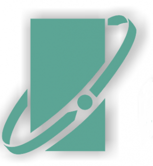

# IoBroker.opentherm
此适配器将 OpenTherm 网关的所有功能集成到 ioBroker 中。

OpenTherm 是一种网关协议，被 Remeha 等多种现代供暖系统所采用。

## 哨兵
**此适配器使用 Sentry 库自动向开发者报告异常和代码错误。** 更多详情以及如何禁用错误报告，请参阅 [Sentry插件文档](https://github.com/ioBroker/plugin-sentry#plugin-sentry)！Sentry 报告功能从 js-controller 3.0 开始使用。

更多信息请访问 http://otgw.tclcode.com/index.html#intro，所有功劳归于开发者。

### 最终状态下的主要功能：
* 提供 TCP/IP 中继服务器，以允许其他 OpenTherm 监控软件通过此实例进行连接（当使用直接 USB 连接时）。
* 如果可能，请调整 ioBroker 中的值并向 Opentherm 发送命令。
欢迎提出功能需求

### 当前已实施
* 通过 TCP/IP 连接到 OpenTherm 网关
* 通过 USB 连接直接连接到 OpenTherm 网关

待办事项
* 通过 USB 连接直接连接到 OpenTherm 网关
* 提供 TCP/IP 中继服务器，以便其他 OpenTherm 监控软件可以通过此实例进行连接（当使用直接 USB 连接时）。
* 在哪里

## 支持我
如果您喜欢我的作品，欢迎您进行个人捐赠（这是 DutchmanNL 的个人捐赠链接，与 ioBroker 项目无关！）

## Changelog

### __WORK IN PROGRESS__
* (DutchmanNL) Maintenance: raise Node.js to 22, modernise CI and release tooling, update dependencies, resolve repository checker findings

### 0.2.5 (2022-07-23) - Message library updated
* (DutchmanNL) Message library updated

### 0.2.4 (2022-07-23) - Installation issues solved
* (DutchmanNL) Update dependency's & SerialPort compatibility

### 0.2.3
* Adapter fully rebuild

### 0.2.2
* Fix read TCP/IP data (svenp)

### 0.2.1
* Fix translations

### 0.1.9
* Implemented direct connection by USB
* added configuration options to adapter settings
* Fixed issue for incorrect logging

### 0.1.8
* Fixed issue for incorrect object type (boolean/number/string)
* Implemented rounding states to 1 digit after comma

### 0.1.7
* implemented Developer mode (all states for all message types will be created in _Dev
* Implemented Developer Logging mode (if not activated no information is written to log !)
* Several small backend fixes

### 0.1.6
* Creation of logical channels
* creation of states
* reduced logging, all received messages still in log during beta for data gathering
* creation of definition file (please feel free to provide input)

### 0.1.0
* Data reading by TCP connection to logfile 

### 0.0.1
* (Dutchman) initial commit

## License
MIT License

Copyright (c) 2025 DutchmanNL <rdrozda86@gmail.com>

Permission is hereby granted, free of charge, to any person obtaining a copy
of this software and associated documentation files (the "Software"), to deal
in the Software without restriction, including without limitation the rights
to use, copy, modify, merge, publish, distribute, sublicense, and/or sell
copies of the Software, and to permit persons to whom the Software is
furnished to do so, subject to the following conditions:

The above copyright notice and this permission notice shall be included in all
copies or substantial portions of the Software.

THE SOFTWARE IS PROVIDED "AS IS", WITHOUT WARRANTY OF ANY KIND, EXPRESS OR
IMPLIED, INCLUDING BUT NOT LIMITED TO THE WARRANTIES OF MERCHANTABILITY,
FITNESS FOR A PARTICULAR PURPOSE AND NONINFRINGEMENT. IN NO EVENT SHALL THE
AUTHORS OR COPYRIGHT HOLDERS BE LIABLE FOR ANY CLAIM, DAMAGES OR OTHER
LIABILITY, WHETHER IN AN ACTION OF CONTRACT, TORT OR OTHERWISE, ARISING FROM,
OUT OF OR IN CONNECTION WITH THE SOFTWARE OR THE USE OR OTHER DEALINGS IN THE
SOFTWARE.