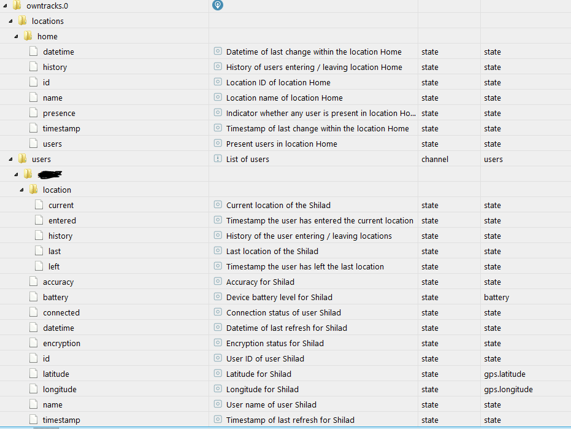
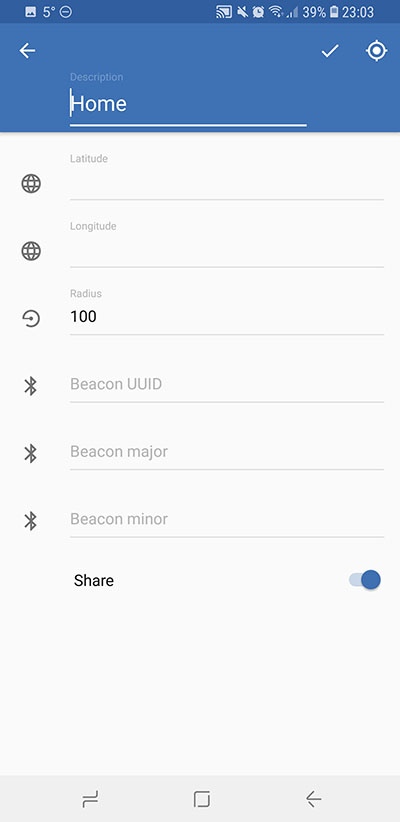

# IoBroker.owntracks

**此适配器使用 Sentry 库自动向开发人员报告异常和代码错误。**有关更多详细信息以及如何禁用错误报告的信息，请参阅[Sentry 插件文档](https://github.com/ioBroker/plugin-sentry#plugin-sentry)！从 js-controller 3.0 开始使用哨兵报告。

[自己的曲目](http://owntracks.org/)是一款适用于安卓和iOS的应用程序。

应用程序将您的位置（设备位置）连续发送到特定服务器。在我们的例子中，它将是 ioBroker 服务器。 MQTT 协议将用于通信或 ioBroker.cloud / ioBroker.iot 适配器。

链接：

- 安卓：[https://play.google.com/store/apps/details?id=org.owntracks.android](https://play.google.com/store/apps/details?id=org.owntracks 。安卓）
- iOS：[https://itunes.apple.com/de/app/owntracks/id692424691?mt=8](https://itunes.apple.com/de/app/owntracks/id692424691?mt=8)

## 设置说明
### 连接配置（使用 MQTT 服务器）
OwnTracks Adapter 在 MQTT 服务器的 1883 端口（可配置）上启动，以接收来自具有坐标的设备的消息。
问题是该服务器必须可以从 Internet 访问。
通常有一个路由器或防火墙，必须配置为转发流量。

### 应用程序和适配器配置
必须在 ioBroker 适配器中分别在 Android / iOS 应用程序中设置以下首选项：

- 连接/模式 - MQTT 私有
- 连接/主机/主机 - 您的系统或 DynDNS 域的 IP 地址。例如。 http://www.noip.com/ 允许使用域名而不是 IP 地址。
- 连接/主机/端口 - 1883 或您路由器上的端口
- 连接/主机/WebSockets - 错误
- 连接/标识/用户名 - iobroker
- 连接/标识/密码 - 来自适配器设置
- 连接/标识/DeviceID - 设备或人的名称。对于此设备，将创建状态。例如。如果 deviceID 为“Mark”，则在第一次联系后将创建以下状态：

    - owntracks.0.users.Mark.longitude
    - owntracks.0.users.Mark.latitude

- 连接/标识/TrackerID - 用户的短名称（最多 2 个字母）以将其写在地图上。
- 连接/安全/TLS - 关闭
- 高级/加密密钥 - 可选，但推荐：添加密码短语进行加密

请通过抽屉中的“状态”条目验证 owntracks 是否已连接到 iobroker 实例：

＃＃＃ 重要的提示！
** ioBroker 中的状态将在收到特定的有效载荷时生成！！这意味着 ioBroker 中的位置将在用户第一次离开或进入该位置时生成。** 下面您将看到目标结构

### 区域配置
要在 owntracks 适配器中设置位置，您必须在 owntracks Android / iOS 应用程序中创建区域。
为此，请转到抽屉中的“区域”

通过单击右上角的加号 (+) 创建新区域

使用右上角的位置按钮检索当前位置或自己输入纬度和经度。此外，指定位置的半径。如果您共享位置，您的朋友（请参阅 Android / iOS 应用程序的抽屉）会在您进入/离开位置时收到通知。

### 图标设置（在 ioBroker.owntracks 适配器中）
您可以为每个用户定义一个图标。只需通过拖放上传或用鼠标单击您的图像。它将自动缩放为 64x64。

该名称必须与 OwnTracks 应用中的 DeviceID 相同。

## Changelog
### 1.0.1 (2022-03-12)
* (Garfonso) fix roles for type detection
* (Apollon77) Add Sentry for crash reporting

### 1.0.0 (2020-12-06)
* (Apollon77) respect "bind" configuration, also for IPv6

### 0.6.3 (2020-05-12)
* (Apollon77) updated dependencies
* (bluefox) fixes some issues

### 0.6.2 (2019-02-14)
* (zefau) Added support for [ioBroker compact mode](https://forum.iobroker.net/viewtopic.php?f=24&t=20387#p213466)
* (zefau) Added support for Gulp translations

### 0.6.0 (2019-01-27)
* (zefau) Added Admin v3 / materialized support
* (zefau) Added option for websockets in the adapter settings

### 0.5.1 (2019-01-25)
* (zefau) fixed an error when connection got closed

### 0.5.0 (2018-10-14)
* (zefau) Added support for locations

### 0.4.0 (2018-10-14)
* (zefau) Added support for encryption key

### 0.3.0 (2018-06-05)
* (matspi) Fix handling of publish messages

### 0.2.0 (2017-01-03)
* (jp112sdl) added two properties timestamp and datetime

### 0.1.1 (2016-09-05)
* (bluefox) add pictures

### 0.1.0 (2016-09-04)
* (bluefox) initial release

## License
The MIT License (MIT)

Copyright (c) 2016-2022 bluefox<dogafox@gmail.com>

Permission is hereby granted, free of charge, to any person obtaining a copy
of this software and associated documentation files (the "Software"), to deal
in the Software without restriction, including without limitation the rights
to use, copy, modify, merge, publish, distribute, sublicense, and/or sell
copies of the Software, and to permit persons to whom the Software is
furnished to do so, subject to the following conditions:

The above copyright notice and this permission notice shall be included in
all copies or substantial portions of the Software.

THE SOFTWARE IS PROVIDED "AS IS", WITHOUT WARRANTY OF ANY KIND, EXPRESS OR
IMPLIED, INCLUDING BUT NOT LIMITED TO THE WARRANTIES OF MERCHANTABILITY,
FITNESS FOR A PARTICULAR PURPOSE AND NONINFRINGEMENT. IN NO EVENT SHALL THE
AUTHORS OR COPYRIGHT HOLDERS BE LIABLE FOR ANY CLAIM, DAMAGES OR OTHER
LIABILITY, WHETHER IN AN ACTION OF CONTRACT, TORT OR OTHERWISE, ARISING FROM,
OUT OF OR IN CONNECTION WITH THE SOFTWARE OR THE USE OR OTHER DEALINGS IN
THE SOFTWARE.