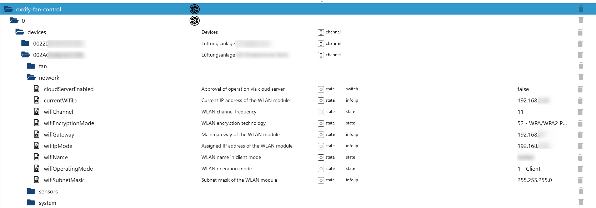
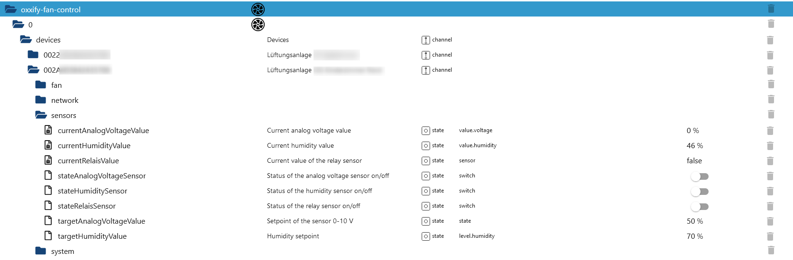

# IoBroker.oxxify-fan-control
**测试：** 

## 适用于 ioBroker 的 oxxify-fan-control 适配器
将您的 Oxxify 风扇集成到您的智能家居系统中。所有提供的 ioBroker 数据点均基于 [这里](./doc/BDA_Anschluss_SmartHome_RV_V2.pdf) 中描述的通信协议。由于其他制造商也使用相同的协议（例如 Blauberg 通风口），因此它们很可能也能正常工作。

## 工作设备
- Oxxify smart 50（我这边测试过）
- 任何其他带 WiFi 功能的 Oxxify 设备
- Blauberg Vents 和其他采用相同协议的通风设备（以下设备运行正常）
- Blauberg D180 S21
- Vento Expert A50-1 S10 W V.2

### 对象树描述
对象树包含名为“devices”的文件夹，其中为每个已配置的风扇创建一个条目。下面的通道使用制造商提供的唯一风扇 ID 创建。在“_name_”列中，使用配置中的条目，以便更好地区分不同的风扇。每个风扇下方创建四个通道，用于对每个风扇提供的数据进行分组。它们的具体说明如下：

#### 风扇数据
此通道包含所有与风扇相关的数据，例如定时器、风扇转速、开关状态以及过滤器清洁/更换周期信息。风扇运行模式包含来自通信协议的数值以及一个字符串状态。这些值只能用数字表示（例如，1 表示加热恢复）。定时器模式和风扇转速模式也遵循同样的规则，手动设置转速时，风扇转速可以输入 1、2、3 和 255。我的设备（Oxxify pro 50）无法设置风扇 2 的转速，其在关闭状态下为 0 rpm，在任何运行状态下为 1500 rpm。其他值会根据风扇转速而变化。

#### 网络数据
目前网络数据为只读，尚未实现写入/更改功能，需要使用制造商提供的应用程序进行操作。云服务器控制状态的更改也同样如此。

#### 传感器数据
传感器的数据输入方式已按照协议定义实现。模拟电压值以百分比形式表示，也符合协议规定。由于我没有连接任何设备到模拟传感器和继电器传感器，因此无法测试激活它们后会发生什么。

#### 系统数据
此通道包含硬件和固件的系统数据，以及运行时间、RTC 电池电压和日期/时间。您可以在此处重置警报，并根据配置的 NTP 服务器设置 RTC 时间。根据我的经验，有时 RTC 时间同步后，新的（正确的）值不会立即显示，需要等到下一次数据轮询才能生效。

##待办事项
- 实施更多测试
- 改进文档
- 实现缺失的数据点（例如时间表、网络数据写入和云控制）

<!-- 下一版本的占位符（位于行首）：

### **正在进行中** -->

## Changelog

### **WORK IN PROGRESS**

- Some dependency work
- Avoid warning messages, if the received protocol does not contain values to update the ioBroker states (Issue #91)

### 0.0.8 (2025-10-16)

- Some dependency work
- Issues from adapter checker fixed

### 0.0.7 (2025-07-01)

- Some dependency work
- Code documentation extended
- Added Node.js 24 to test and release pipeline
- Resending interval of not overtaken values changed from 1,5 seconds to 2,5 seconds
- Changed writable mixed numerical/string values for enums into selectable values, to show available configurations (**breaking change** if already used to remote control fans)
- Rewrite mechanism allows now manual changes within the buttons of the fan, which were overridden by the internal stored value before

### 0.0.6 (2025-04-17)

- Vulnerable dependency updated

### 0.0.5 (2025-03-21)

- Added automatic write retry mechanism for writing values within the fan, as writing with UDP is not very reliable in connection with poor network conditions
- Adapter checker issues fixed

### 0.0.4 (2025-01-31)

- Updated ESLint to 9.x.x
- Fixed copyright issue from adapter checker
- Replaced deletion of all objects with deletion of missing devices from config only
- Avoided illegal characters from user input for fan id within code
- Changed state subscription to all states below the devices folder
- Added restart logic of UDP server in case of an error
- Added adapter terminiation if multiple udp server errors occured
- Replaced cyclic checking of the send quene with a timeout approach instead of interval
- Missing intermediate objects created
- Roles updated according to the read/write definitions
- Polling interval limited in JSON config and code
- ioBroker unit in object tree for RTC date & time removed

### 0.0.3 (2025-01-11)

- Added states for objects with high byte 0x03 with reading and writing
- Recreate device objects on adapter restart
- Simplified methods for writing fan data based on subscribed states
- Added a first unit test for the parsing of numbers.

### 0.0.2 (2025-01-06)

- (N-b-dy) initial release

## License

Copyright (c) 2025 N-b-dy <daten4me@gmx.de>

                    GNU GENERAL PUBLIC LICENSE
                       Version 3, 29 June 2007

### Disclaimer of Warranty.

THERE IS NO WARRANTY FOR THE PROGRAM, TO THE EXTENT PERMITTED BY
APPLICABLE LAW. EXCEPT WHEN OTHERWISE STATED IN WRITING THE COPYRIGHT
HOLDERS AND/OR OTHER PARTIES PROVIDE THE PROGRAM "AS IS" WITHOUT WARRANTY
OF ANY KIND, EITHER EXPRESSED OR IMPLIED, INCLUDING, BUT NOT LIMITED TO,
THE IMPLIED WARRANTIES OF MERCHANTABILITY AND FITNESS FOR A PARTICULAR
PURPOSE. THE ENTIRE RISK AS TO THE QUALITY AND PERFORMANCE OF THE PROGRAM
IS WITH YOU. SHOULD THE PROGRAM PROVE DEFECTIVE, YOU ASSUME THE COST OF
ALL NECESSARY SERVICING, REPAIR OR CORRECTION.

### Limitation of Liability.

IN NO EVENT UNLESS REQUIRED BY APPLICABLE LAW OR AGREED TO IN WRITING
WILL ANY COPYRIGHT HOLDER, OR ANY OTHER PARTY WHO MODIFIES AND/OR CONVEYS
THE PROGRAM AS PERMITTED ABOVE, BE LIABLE TO YOU FOR DAMAGES, INCLUDING ANY
GENERAL, SPECIAL, INCIDENTAL OR CONSEQUENTIAL DAMAGES ARISING OUT OF THE
USE OR INABILITY TO USE THE PROGRAM (INCLUDING BUT NOT LIMITED TO LOSS OF
DATA OR DATA BEING RENDERED INACCURATE OR LOSSES SUSTAINED BY YOU OR THIRD
PARTIES OR A FAILURE OF THE PROGRAM TO OPERATE WITH ANY OTHER PROGRAMS),
EVEN IF SUCH HOLDER OR OTHER PARTY HAS BEEN ADVISED OF THE POSSIBILITY OF
SUCH DAMAGES.