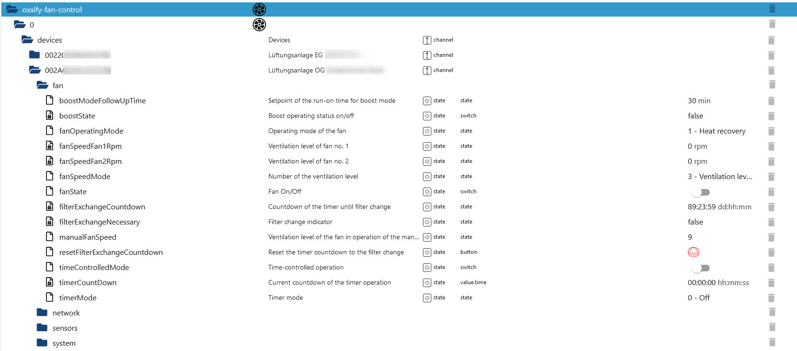
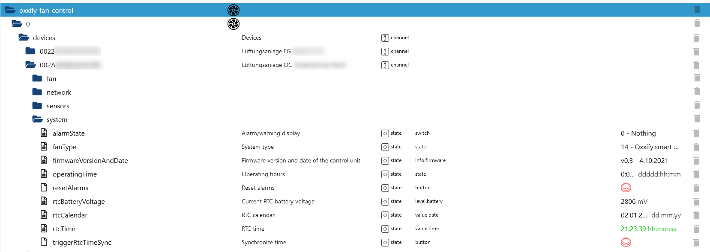

# IoBroker.oxxify-风扇控制
**测试：**

## IoBroker 的 oxxify-fan-control 适配器
将 Oxxify 风扇集成到您的智能家居中。所有提供的 ioBroker 数据点均基于[这里](./doc/BDA_Anschluss_SmartHome_RV_V2.pdf) 所述的通信协议。由于其他制造商也在使用相同的协议（例如 Blauberg 通风口），因此它们也很可能同样有效。

## 工作设备
- Oxxify smart 50（由我测试过）
- 任何其他具有 WiFi 的 Oxxify 设备
- Blauberg Vents（应该是，但尚未测试）

### 对象树描述
对象树包含名为“设备”的文件夹，该文件夹为每个配置的风扇创建一个条目。下面的通道使用制造商提供的唯一风扇 ID 创建。在列 _name_ 中，使用来自配置的条目来更好地区分风扇。在每个风扇下方创建四个通道，以对每个风扇提供的数据进行分组。它们的解释如下：

#### 粉丝数据
该通道包含任何与风扇相关的数据，如计时器、风扇速度、开/关状态以及有关过滤器清洁/更换间隔的信息。风扇操作模式包含来自通信协议的数值以及语音字符串状态。值只能用数字来写（例如，1 表示加热恢复）。计时器模式和风扇速度模式也是如此，它们接受 1、2、3 和 255 进行手动速度设置。风扇 2 的风扇速度在我的设备（Oxxify pro 50）上不可用，并且在关闭状态下保持 0 rpm，在任何运行状态下保持 1500。其他值根据速度而变化。

#### 网络数据
网络数据目前是只读的，此处的写入/更改值尚未实现，可以使用制造商的应用程序完成。云服务器控制状态也是如此。

#### 传感器数据
传感器的数据输入按照协议中的定义实现。模拟电压值以协议中的定义表示。我没有连接任何模拟和继电器传感器，因此我无法真正测试如果激活它们会发生什么。

#### 系统数据
此通道包含有关硬件和固件以及运行时间、RTC 电池电压和日期/时间的系统数据。在这里可以重置警报，还可以根据配置的 NTP 服务器设置 RTC 时间。根据我的经验，有时可能会发生这种情况：在 RTC 时间同步后，新的（正确）值不会立即显示，直到下一次数据轮询。

## 待办事项
- 在 npm 上发布稳定版本
- 将适配器添加到 ioBroker repo
- 实施更多测试
- 改进文档
- 实现缺失的数据点（如时间表、网络数据写入和云控制）

<!-- 下一版本的占位符（在行首）：

### **正在进行中** -->

## Changelog

### 0.0.4 (2025-01-31)

- Updated ESLint to 9.x.x
- Fixed copyright issue from adapter checker
- Replaced deletion of all objects with deletion of missing devices from config only
- Avoided illegal characters from user input for fan id within code
- Changed state subscription to all states below the devices folder
- Added restart logic of UDP server in case of an error
- Added adapter terminiation if multiple udp server errors occured
- Replaced cyclic checking of the send quene with a timeout approach instead of interval
- Missing intermediate objects created
- Roles updated according to the read/write definitions
- Polling interval limited in JSON config and code
- ioBroker unit in object tree for RTC date & time removed

### 0.0.3 (2025-01-11)

- Added states for objects with high byte 0x03 with reading and writing
- Recreate device objects on adapter restart
- Simplified methods for writing fan data based on subscribed states
- Added a first unit test for the parsing of numbers.

### 0.0.2 (2025-01-06)

- (N-b-dy) initial release

## License

Copyright (c) 2025 N-b-dy <daten4me@gmx.de>

                    GNU GENERAL PUBLIC LICENSE
                       Version 3, 29 June 2007

### Disclaimer of Warranty.

THERE IS NO WARRANTY FOR THE PROGRAM, TO THE EXTENT PERMITTED BY
APPLICABLE LAW. EXCEPT WHEN OTHERWISE STATED IN WRITING THE COPYRIGHT
HOLDERS AND/OR OTHER PARTIES PROVIDE THE PROGRAM "AS IS" WITHOUT WARRANTY
OF ANY KIND, EITHER EXPRESSED OR IMPLIED, INCLUDING, BUT NOT LIMITED TO,
THE IMPLIED WARRANTIES OF MERCHANTABILITY AND FITNESS FOR A PARTICULAR
PURPOSE. THE ENTIRE RISK AS TO THE QUALITY AND PERFORMANCE OF THE PROGRAM
IS WITH YOU. SHOULD THE PROGRAM PROVE DEFECTIVE, YOU ASSUME THE COST OF
ALL NECESSARY SERVICING, REPAIR OR CORRECTION.

### Limitation of Liability.

IN NO EVENT UNLESS REQUIRED BY APPLICABLE LAW OR AGREED TO IN WRITING
WILL ANY COPYRIGHT HOLDER, OR ANY OTHER PARTY WHO MODIFIES AND/OR CONVEYS
THE PROGRAM AS PERMITTED ABOVE, BE LIABLE TO YOU FOR DAMAGES, INCLUDING ANY
GENERAL, SPECIAL, INCIDENTAL OR CONSEQUENTIAL DAMAGES ARISING OUT OF THE
USE OR INABILITY TO USE THE PROGRAM (INCLUDING BUT NOT LIMITED TO LOSS OF
DATA OR DATA BEING RENDERED INACCURATE OR LOSSES SUSTAINED BY YOU OR THIRD
PARTIES OR A FAILURE OF THE PROGRAM TO OPERATE WITH ANY OTHER PROGRAMS),
EVEN IF SUCH HOLDER OR OTHER PARTY HAS BEEN ADVISED OF THE POSSIBILITY OF
SUCH DAMAGES.