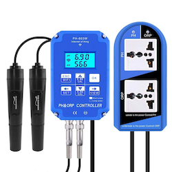

# IoBroker.ph803w
 

## 用于 ioBroker 的 ph803w 适配器
**此适配器使用 Sentry 库自动向开发人员报告异常和代码错误。** 有关更多详细信息以及如何禁用错误报告的信息，请参阅 [Sentry-插件文档](https://github.com/ioBroker/plugin-sentry#plugin-sentry)!从 js-controller 3.0 开始使用哨兵报告。

从网络中的 PH803-W 设备查询 PH 和氧化还原值。

＃＃ 配置
适配器不需要任何配置。它将通过网络中的 UDP 包自动发现 PH803W 设备。这意味着 ioBroekr 服务器和设备需要在同一网络中。
发现是在适配器启动时完成的，这意味着要发现在适配器运行时添加的新设备可能需要重新启动适配器。

＃＃ 去做
* 增强测试：状态检查和 setState 的
* 如果需要，允许指定本地网络接口来监听 UDP 包
* 如果发现不工作，如果需要，允许通过 IP 添加自己的设备
* 如果需要，在适配器运行期间添加一个状态以发送另一个发现包，以允许在不重启适配器的情况下发现新设备

## 如何报告问题和功能请求
请为此使用 GitHub 问题。

最好是将适配器设置为调试日志模式（实例 -> 专家模式 -> 列日志级别）。然后请从磁盘获取日志文件（ioBroker 安装目录中的子目录“log”，而不是从 Admin 获取，因为 Admin 截断了行）。如果您不喜欢在 GitHub 问题中提供它，您也可以通过电子邮件 (iobroker@fischer-ka.de) 将其发送给我。请添加对相关 GitHub 问题的引用，并描述我当时在日志中看到的内容。

## Changelog

### 0.1.5 (2021-06-09)
* (Apollon77) Optimize edge cases on device connection and try reconnect and make sure connection status is correct
* (Apollon77) Better handle pingpong related reconnects

### 0.1.4 (2021-06-09)
* (Apollon77) Remove unit from PH again after feedback

### 0.1.3 (2021-06-09)
* (Apollon77) Add title property

### 0.1.2 (2021-06-09)
* (Apollon77) Add unit for PH value

### 0.1.1 (2021-06-09)
* (Apollon77) Initial commit

## License
MIT License

Copyright (c) 2021 Ingo Fischer <github@fischer-ka.de>

Permission is hereby granted, free of charge, to any person obtaining a copy
of this software and associated documentation files (the "Software"), to deal
in the Software without restriction, including without limitation the rights
to use, copy, modify, merge, publish, distribute, sublicense, and/or sell
copies of the Software, and to permit persons to whom the Software is
furnished to do so, subject to the following conditions:

The above copyright notice and this permission notice shall be included in all
copies or substantial portions of the Software.

THE SOFTWARE IS PROVIDED "AS IS", WITHOUT WARRANTY OF ANY KIND, EXPRESS OR
IMPLIED, INCLUDING BUT NOT LIMITED TO THE WARRANTIES OF MERCHANTABILITY,
FITNESS FOR A PARTICULAR PURPOSE AND NONINFRINGEMENT. IN NO EVENT SHALL THE
AUTHORS OR COPYRIGHT HOLDERS BE LIABLE FOR ANY CLAIM, DAMAGES OR OTHER
LIABILITY, WHETHER IN AN ACTION OF CONTRACT, TORT OR OTHERWISE, ARISING FROM,
OUT OF OR IN CONNECTION WITH THE SOFTWARE OR THE USE OR OTHER DEALINGS IN THE
SOFTWARE.