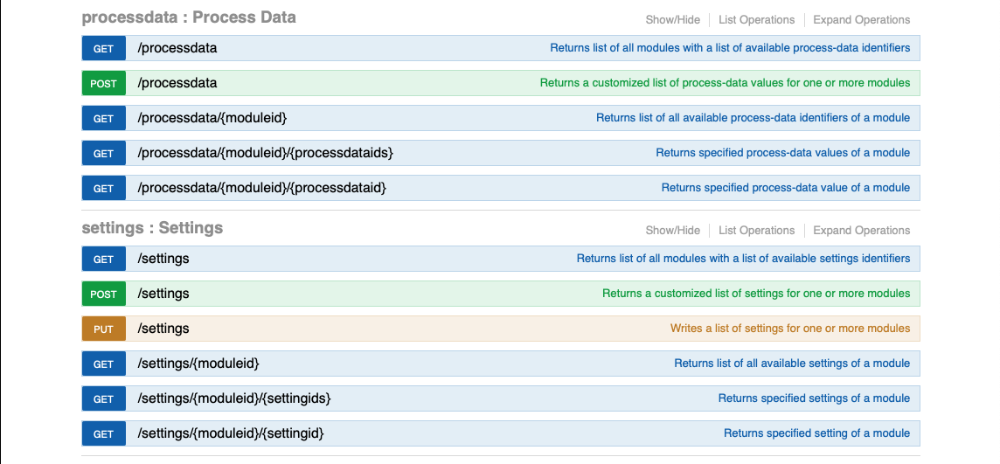

  

# IoBroker.plenticore-g3
**测试：**

## IoBroker 的 plenticore-g3 适配器
此适配器可通过 REST API 与 KOSTAL Plenticore plus 进行通信。此 API 比 Modbus 强大得多。它允许访问大约 200 个称为“过程数据”的只读数据点和大约 250 个可写设置。此 API 的文档位于以下 URL：

http://\<plenticore 主机>/api/v1

   

此适配器使用 REST API 的“流程数据”和“设置”。由于用户不需要所有可用数据，因此该适配器仅预设了少量流程数据和设置，但用户可以从所有可用流程数据和设置的列表中选择其他数据点。

  

您还可以为可选数据点添加您自己的描述，这些数据点将以描述的形式显示在 iobroker 的对象树中。大多数情况下，数据点的用途可以通过其名称推断出来。例如，“devices:local/HomeBat_P”表示家庭使用的电池电量。

### 命名
原生对象由模块 ID 和数据 ID 组成，例如“scb:statistic:EnergyFlow/Statistic:Yield:Day”。斜杠前的部分是模块 ID。在本例中为“scb:statistic:EnergyFlow”。在 iobroker 的对象树中，将根据模块 ID 创建文件夹结构： 瑞士信贷集团 统计数据 能量流 

数据 ID 中的冒号被下划线替换：  “Statistic:Yield:Day”将变为“Statistic_Yield_Day”

## Changelog
### 0.1.1 (2025-04-07)

- fix object hierarchy
- fix missing translations, adjust translations based on system language
- fix state roles

### 0.1.0 (2025-03-29)

- add notification on available updates
- make sure init completes without errors

### 0.0.8 (2025-03-28)

- fix writing of settings after 0.0.7
- fix crash after failed API requests

### 0.0.7 (2025-03-26)

- replace ':' by '_' in object IDs
- delete unused objects and channels

### 0.0.6 (2025-03-14)

-   fix repo url in package.json

### 0.0.5 (2025-03-14)

-   avoid potential issues: js-controller >= 7.0.6

### 0.0.4 (2025-03-14) 0.0.4

-   prepare for iobroker repo

### 0.0.4-beta.1 (2025-03-14) beta 1 with translations

-   update translations

### 0.0.4-beta.0 (2025-03-13) beta 1

-   exclude react from test:js
-   terminate on authentication issue (fix)
-   add read and write for settings

### 0.0.3-alpha.1 (2025-03-10)

-   eslint
-   remove node 18.x from github workflow

### 0.0.3-alpha.0 (2025-03-10)

-   Did some changes
-   Did some more changes

### v0.0.1 (2025-03-10)

Initial release

## License
MIT License

Copyright (c) 2025 fernetmenta <fernetmenta@online.de>

Permission is hereby granted, free of charge, to any person obtaining a copy
of this software and associated documentation files (the "Software"), to deal
in the Software without restriction, including without limitation the rights
to use, copy, modify, merge, publish, distribute, sublicense, and/or sell
copies of the Software, and to permit persons to whom the Software is
furnished to do so, subject to the following conditions:

The above copyright notice and this permission notice shall be included in all
copies or substantial portions of the Software.

THE SOFTWARE IS PROVIDED "AS IS", WITHOUT WARRANTY OF ANY KIND, EXPRESS OR
IMPLIED, INCLUDING BUT NOT LIMITED TO THE WARRANTIES OF MERCHANTABILITY,
FITNESS FOR A PARTICULAR PURPOSE AND NONINFRINGEMENT. IN NO EVENT SHALL THE
AUTHORS OR COPYRIGHT HOLDERS BE LIABLE FOR ANY CLAIM, DAMAGES OR OTHER
LIABILITY, WHETHER IN AN ACTION OF CONTRACT, TORT OR OTHERWISE, ARISING FROM,
OUT OF OR IN CONNECTION WITH THE SOFTWARE OR THE USE OR OTHER DEALINGS IN THE
SOFTWARE.