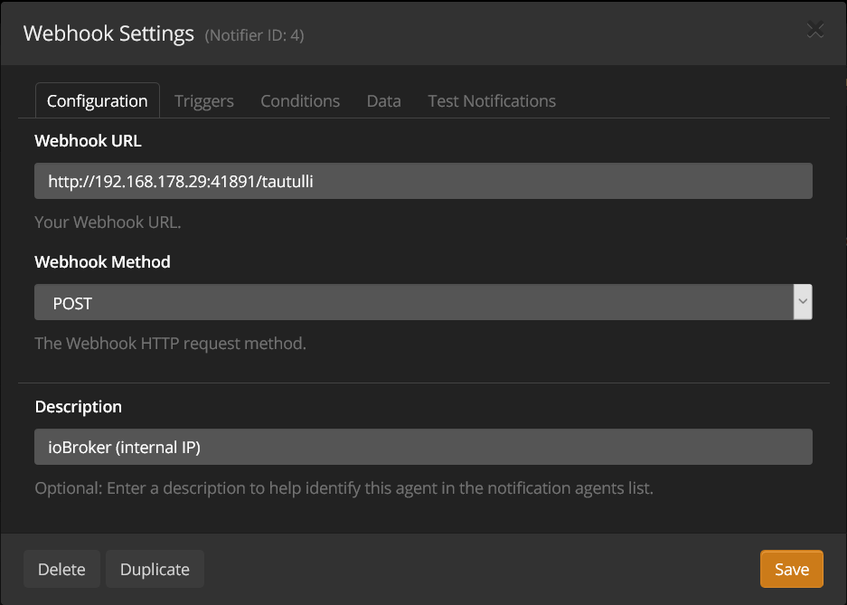

# IoBroker.plex Plex 媒体服务器在 ioBroker 中的集成（带或不带 Plex Pass）。此外，Tautulli 整合。
[](https://travis-ci.com/iobroker-community-adapters/ioBroker.plex) [](https://weblate.iobroker.net/engage/adapters/?utm_source=widget)

**目录**

1. [功能](#1-功能)
2. [设置说明](#2-设置-说明)
   1. [基本设置](#21-基本-设置)
   2. [高级设置](#22-advanced-setup-plex-pass-or-tautulli)
3. [通道和状态](#3-通道--状态)
   1. [基本设置](#31-with-basis-setup)
   2. [高级设置](#32-with-advanced-setup)
4. [变更日志](#changelog)
5. [许可证](#license)

## 1. 特点
- 接收有关当前播放媒体项的详细媒体信息（例如视频比特率、编解码器、字幕信息、音频；请参阅[高级设置](https://github.com/iobroker-community-adapters/ioBroker.plex/blob/ master/README-states.md#with-advanced-setup）以获得完整列表）
- 从 Plex 接收“事件”（通过 [Plex Webhook](https://support.plex.tv/articles/115002267687-webhooks/#toc-0) 和 [Plex 通知](https://support.plex.tv /articles/push-notifications/#toc-0) 使用 Plex Pass 或通过 Tautulli，[__see setup!__](#22-advanced-setup-plex-pass-or-tautulli))
- 玩家的播放控制
- 检索“服务器”
- 检索“库”
- 检索图书馆内的所有项目
- 检索“用户”（仅适用于 Tautulli）
- 检索“统计数据”（仅适用于 Tautulli）
- 检索“播放列表”
- 检索“设置”
- 从可控客户端检索所有数据
- 显示 Plex 最近事件的 Web 界面：

  

## 2. 设置说明
### 2.1。基本设置
对于基本设置，需要提供 Plex 安装的 IP 地址（和端口）。此外，您必须检索适配器的专用令牌才能从 Plex 检索数据。

一旦给出，ioBroker.plex 将检索所有基本数据（包括服务器、库）。有关基本数据的完整列表，请参阅[频道和状态](#21-with-basis-setup)。

### 2.2。高级设置（Plex Pass 或 Tautulli）
#### 2.2.1.复合通行证
__网络钩子__

如果您是 Plex Pass 用户，您可以在 Plex 设置中[设置网络钩子](https://support.plex.tv/articles/115002267687-webhooks/#toc-0) 从 Plex 媒体服务器检索当前事件/操作（播放、暂停、恢复、停止、观看和评级）。

导航至您的 Plex 媒体服务器并转至 ```Settings``` 和 ```Webhook```。单击 ```Add Webhook``` 创建了一个新的 Webhook，然后输入您的 ioBroker IP 地址以及 ioBroker.plex 设置中指定的自定义端口和尾随 ```/plex``` 路径，例如```http://192.168.178.29:41891/plex```：


__活动__

有关 Plex 通知的信息，请[查看官方文档](https://support.plex.tv/articles/push-notifications/#toc-0)。要在 Plex 媒体服务器上打开通知，请转至 `Settings` > `Server` > `General`，然后启用 `Push Notifications` 首选项。

#### 2.2.2.陶图利
[Tautulli 是一个第三方应用程序](https://tautulli.com/#about)，您可以与 Plex 媒体服务器一起运行来监控活动并跟踪各种统计数据。最重要的是，这些统计数据包括观看过的内容、观看者、观看时间和地点以及观看方式。所有统计数据都显示在一个漂亮且干净的界面中，其中包含许多表格和图表，这使得您可以轻松地向其他人吹嘘您的服务器。查看 [Tautulli 预览版](https://tautulli.com/#preview) 并[将其安装在您的首选系统上](https://github.com/Tautulli/Tautulli-Wiki/wiki/Installation)如果您有兴趣。

此适配器连接到 [陶图利API](https://github.com/Tautulli/Tautulli/blob/master/API.md) 并还接收来自 Tautulli 的 Webhook 事件。

##### 2.2.2.1。应用程序编程接口
安装 Tautulli 后，从 Tautulli 仪表板打开“设置”页面并导航至“Web 界面”。向下滚动到 _API_ 部分并确保选中 ```Enable API```。复制 ```API key``` 并将其输入到 ioBroker.plex 设置中。此外，添加 Tautulli IP 地址和端口以允许 API 通信。

##### 2.2.2.2。网络钩子
＃＃＃＃＃＃ 概述
要使用 Tautulli 设置网络书，请按照以下说明进行操作，并确保您已完成所有 4 个步骤：

1.添加通知代理
2. 在通知代理中配置 Webhook
3. 在通知代理中配置触发器
4. 在通知代理中配置数据
5. 配置通知选项

＃＃＃＃＃＃ 描述
安装后，从 Tautulli 仪表板打开设置页面并导航到通知代理，如下所示：


1. 单击_添加新通知代理_和_Webhook_。
2. 输入您的 ioBroker IP 地址以及 ioBroker.plex 设置中指定的自定义端口和尾随 ``/tautulli``` 路径，例如``http://192.168.178.29:41891/tautulli````：

 此外，为_Webhook 方法_选择```POST```，并在_描述_中输入您喜欢的任何描述。

3. 接下来，转到_触发器_选项卡，选择所需的（或全部）通知代理。启用的通知代理将触发一个事件，然后该事件将发送到 ioBroker。 __确保__ 在下一步中为每个启用的通知代理提供必要的数据！
4. 现在，__最重要的是__，根据__[此处找到的通知配置](README-tautulli.md#notification-configuration)__ 在_Data_选项卡中填写相应的数据负载。

   将上一步中相关通知代理的通知配置（例如，```Playback Start```、```Playback Stop```、```Playback Pause``` 和 ```Playback Resume```）复制到每个文本框中，如下所示§ §JJJJJ_4§§：

   

5. 最后，选中选项“允许连续通知”以允许发送连续通知（例如，观看和停止的通知）：

   

## 3. 通道和状态
配置基本和高级设置后，将出现以下通道（库、服务器和用户当然只是示例）。进一步参见下文的[频道和状态的完整列表](#21-with-basis-setup)。


### 3.1。带基础设置
成功完成基本设置后，将根据下表创建通道。有关将创建的所有州的列表，请[请参阅专门的州列表](README-states.md#with-basis-setup)。

|频道/文件夹 |描述 |
| ------- | ----------- |
| __图书馆__ | Plex 图书馆 |
| __服务器__ | Plex 服务器 |
| __设置__ |丛设置 |

### 3.2。具有高级设置
成功进行高级设置后，将额外创建以下通道。有关将创建的所有州的列表，请[请参阅专门的州列表](README-states.md#with-advanced-setup)。

|频道/文件夹 |描述 |备注 |
| ---------------- | ----------- | ------ |
| __\_玩__ |正在播放 Plex Media |使用 Plex Pass 或 Tautulli |
| __统计__ | Plex 观察统计 |仅限 Tautulli |
| __用户__ | Plex 用户 |仅限 Tautulli |

## 学分
如果没有 @Zefau (https://github.com/Zefau) 的伟大工作，这个适配器是不可能实现的，他创建并维护了它直到 2021 年。

## Changelog
<!--
    Placeholder for the next version (at the beginning of the line):
    ### **WORK IN PROGRESS**
-->
### 1.1.0 (2023-09-11)
- (ticaki) Added: Lyrics are written as link and text in _playing.device.Metadata.Music.Lyric
- (ticaki) Added: Connection to players with refresh of playerdetail
- (ticaki) Added: New states with player data.
- (ticaki) Added: Refresh of player can be activate by set _Controls.timeline.refreshDetails to true

### 1.0.5 (2023-08-31)
- (ticaki) Fixed: Control did not work with Plexamp.
- (ticaki) some minor improvements.

### 1.0.4 (2023-08-27)
- (ticaki) Fixed: [#184](https://github.com/iobroker-community-adapters/ioBroker.plex/issues/184)

### 1.0.3 (2023-08-25)
- (ticaki) Fixed: Don't add empty notifications to history [#183](https://github.com/iobroker-community-adapters/ioBroker.plex/issues/183)
- (ticaki) Fixed: prevent the creation of duplicate history entries in most cases

### 1.0.2 (2023-08-23)
- (ticaki) Added: a play/pause switch for mediaplayer
- (ticaki) Added: links to artworks (ready to use)
- (ticaki) Added: state viewOffsetSeconds refresh every second while playing media(internal counter)

### 1.0.1 (2023-08-21)
- (ticaki) Xmlparser call fixed

### 1.0.0 (2023-08-20)
- (ticaki) fixed: several minor issues have been fixed

### 1.0.0-alpha.3 (2023-08-16)
- (ticaki) fixed: common.type warnings have been fixed and missing state definitions have been added #114 #101 #100
- (ticaki) fixed: player controls  
- (ticaki) fixed: history page has been fixed 
- (ticaki) fixed: translation error has been fixed #108

### 0.9.0 (2020-05-23)
- (Zefau) added option for webhook IP address in case Plex is running in a Docker environment (see [#53](https://github.com/iobroker-community-adapters/ioBroker.plex/issues/53))
- (Zefau) updated dependencies

### 0.8.11 (2020-02-26)
- (Zefau) fixed error with state retrieval on startup when no states are given
- (Zefau) updated dependencies

### 0.8.10 (2020-02-16)
- (Zefau) fixed error with state retrieval on startup when no states are given
- (Zfeau) fixed incorrect handling of certificates when using secure connection
- (Zefau) updated dependencies

### 0.8.9 (2019-12-14)
- (Zefau) updated dependencies
- (Zefau) fixed missing spaces in events (and thus Adapter Web View)
- (Zefau) fixed using username instead of email for statistics (see [#17](https://github.com/iobroker-community-adapters/ioBroker.plex/issues/17))

### 0.8.8 (2019-12-05)
- (Zefau) fixed player controls

### 0.8.7 (2019-12-02)
- (Zefau) fixed error with http / https settings

### 0.8.6 (2019-12-02)
- (Zefau) added further states to Tautulli Notification (see [README-tautulli.md](https://github.com/iobroker-community-adapters/ioBroker.plex/blob/master/README-tautulli.md))
- (Zefau) fixed design issue with select-box in the adapter settings
- (Zefau) fixed not showing thumbnails in adapter web view (when not using a secure connection)

### 0.8.5 (2019-12-01)
- (Zefau) fixed missing user / library statistics
- (Zefau) fixed using username instead of email for statistics (see [#17](https://github.com/iobroker-community-adapters/ioBroker.plex/issues/17))

### 0.8.4 (2019-11-07)
- (Zefau) added support for remote player control via cloud / iot adapter
- (Zefau) added thumbnail to notifications as well as web interface of adapter
- (Zefau) fixed icons within the web interface of adapter

### 0.8.3 (2019-11-06)
- (Zefau) fixed player controls (error when triggering `start`, `stop`, etc.)
- (Zefau) added additional states to `event` channel

### 0.8.1 (2019-11-02)
- (Zefau) fixed error `Cannot read property 'forEach' of undefined`

### 0.8.0 (2019-10-28)
- (Zefau) added support for Plex Notifications including customization in adapter settings
- (Zefau) added count of streams (see [#14](https://github.com/iobroker-community-adapters/ioBroker.plex/issues/14))
- (Zefau) reworked cleaning up states when new webhook is received (see [#11](https://github.com/iobroker-community-adapters/ioBroker.plex/issues/11))

### 0.7.0 (2019-10-17)
- (Zefau) reworked duty cycle (clean up of outdated / old states)
- (Zefau) fixed incorrect states (see [#15](https://github.com/iobroker-community-adapters/ioBroker.plex/issues/15))

### 0.6.0 (2019-08-19)
- (Zefau) replaced password with token authentication

### 0.5.0 (2019-08-18)
- (Zefau) added support for Plex Notifications (see [#9](https://github.com/iobroker-community-adapters/ioBroker.plex/issues/9))
- (Zefau) added support for all Tautulli triggers
- (Zefau) added Adapter Web Interface that shows the recent events

### 0.4.3 (2019-08-11)
- (Zefau) Performance improvements (dutyCycleRun and state comparison)
- (Zefau) added refresh button (to scan library files) to libraries

### 0.4.1 / 0.4.2 (2019-08-03)
- (Zefau) fixed newly introduced playback control not working for certain players
- (Zefau) removed unnecessary dependencies

### 0.4.0 (2019-08-01)
- (Zefau) added playback control for players
- (Zefau) added configuration options to only retrieve specific objects from Plex

### 0.3.2 / 0.3.3 (2019-07-25)
- (Zefau) added file, streaming and transcoding information to Tautulli event
- (Zefau) fixed bug when no playlists exist
- (Zefau) fixed missing `EVENTS.json`

### 0.3.1 (2019-07-20)
- (Zefau) updated dependencies to fix security vulnerabilities in depending packages

### 0.3.0 (2019-05-16)
- ([@Apollon77](https://github.com/Apollon77)) updated testing for Node.js v12 (see [#6](https://github.com/iobroker-community-adapters/ioBroker.plex/pull/6))
- (Zefau) added support / discovery in [iobroker.discovery](https://github.com/ioBroker/ioBroker.discovery) (see [#62](https://github.com/ioBroker/ioBroker.discovery/pull/62))
- (Zefau) added playlists to states
- (Zefau) added state description for object tree ```_playing```
- (Zefau) updated German translation (instead of generating it from English)

### 0.2.0 (2019-05-14)
- (Zefau) added authentication method (using Plex user and Plex password)
- (Zefau) fixed @iobroker/adapter-core dependency

### 0.1.0 (2019-04-26)
- (Zefau) get initial data from Plex API
- (Zefau) receive events from Plex Webhook (Plex Pass only)
- (Zefau) receive events from Tatulli (if used)

## License
The MIT License (MIT)

Copyright (c) 2019-2020 Zefau <zefau@mailbox.org>
Copyright (c) 2023 iobroker-community-adapters

Permission is hereby granted, free of charge, to any person obtaining a copy
of this software and associated documentation files (the "Software"), to deal
in the Software without restriction, including without limitation the rights
to use, copy, modify, merge, publish, distribute, sublicense, and/or sell
copies of the Software, and to permit persons to whom the Software is
furnished to do so, subject to the following conditions:

The above copyright notice and this permission notice shall be included in
all copies or substantial portions of the Software.

THE SOFTWARE IS PROVIDED "AS IS", WITHOUT WARRANTY OF ANY KIND, EXPRESS OR
IMPLIED, INCLUDING BUT NOT LIMITED TO THE WARRANTIES OF MERCHANTABILITY,
FITNESS FOR A PARTICULAR PURPOSE AND NONINFRINGEMENT. IN NO EVENT SHALL THE
AUTHORS OR COPYRIGHT HOLDERS BE LIABLE FOR ANY CLAIM, DAMAGES OR OTHER
LIABILITY, WHETHER IN AN ACTION OF CONTRACT, TORT OR OTHERWISE, ARISING FROM,
OUT OF OR IN CONNECTION WITH THE SOFTWARE OR THE USE OR OTHER DEALINGS IN
THE SOFTWARE.