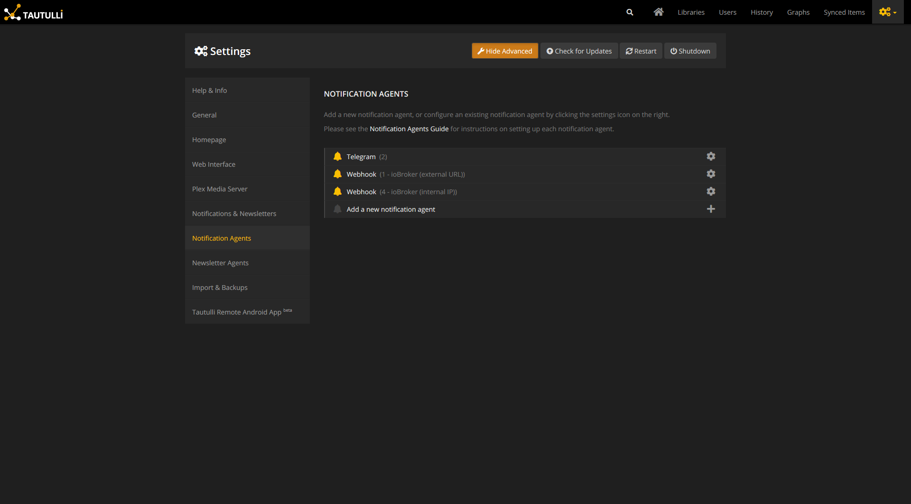

# IoBroker.plex 在 ioBroker 中集成 Plex Media Server（有或没有 Plex Pass）。此外，还集成了 Tautulli。
[](https://weblate.iobroker.net/engage/adapters/?utm_source=widget)

**目录**

1. [功能](#1-功能)
2. [安装说明](#2-setup-instructions)
1. [基本设置](#21-基本设置)
2. [高级设置](#22-advanced-setup-plex-pass-or-tautulli)
3. [渠道与状态](#3-渠道--状态)
1. [使用基本设置](#31-使用基本设置)
2. [使用高级设置](#32-使用高级设置)
4. [变更日志](#changelog)
5. [许可证](#license)

## 1. 特点
- 接收有关当前播放的媒体项目的详细媒体信息（例如视频比特率、编解码器、字幕信息、音频；有关完整列表，请参阅[高级设置]（https://github.com/iobroker-community-adapters/ioBroker.plex/blob/master/README-states.md#with-advanced-setup））
- 使用 Plex Pass 或通过 Tautulli，通过 [Plex Webhook](https://support.plex.tv/articles/115002267687-webhooks/#toc-0) 和 [Plex 通知](https://support.plex.tv/articles/push-notifications/#toc-0) 从 Plex 接收“事件”，[__请参阅设置！__](#22-advanced-setup-plex-pass-or-tautulli))
- 播放器的播放控制
- 检索“服务器”
- 检索“库”
- 检索图书馆内的所有物品
- 检索“用户”（仅限 Tautulli）
- 检索“统计数据”（仅限 Tautulli）
- 检索“播放列表”
- 检索“设置”
- 从可控客户端检索所有数据
- 显示 Plex 的最近事件的 Web 界面：

  

## 2. 设置说明
### 2.1. 基本设置
对于基本设置，需要提供 Plex 安装的 IP 地址（和端口）。此外，您必须检索适配器的专用令牌，以便从 Plex 检索数据。

一旦给出该信息，ioBroker.plex 将检索所有基本数据（包括服务器、库）。请参阅 [渠道与国家](#21-with-basis-setup) 了解基本数据的完整列表。

### 2.2。高级设置（Plex Pass 或 Tautulli）
#### 2.2.1. Plex 通行证
__Webhook__

如果您是 Plex Pass 用户，您可以在 Plex 设置中[设置 webhook](https://support.plex.tv/articles/115002267687-webhooks/#toc-0) 从您的 Plex 媒体服务器检索当前事件/操作（播放、暂停、恢复、停止、查看和评分）。

导航到您的 Plex 媒体服务器并转到 ```Settings``` 和 ```Webhook```。通过单击 ```Add Webhook``` 创建一个新的 webhook，然后输入您的 ioBroker IP 地址以及 ioBroker.plex 设置中指定的自定义端口和尾随的 ```/plex``` 路径，例如 ```http://192.168.178.29:41891/plex```：


__事件__

有关 Plex 通知的信息，请参阅[参见官方文档](https://support.plex.tv/articles/push-notifications/#toc-0)。要在您的 Plex 媒体服务器上启用通知，请转到`Settings` > `Server` > `General`，然后启用`Push Notifications` 偏好设置。

#### 2.2.2. 塔图利
如果您有兴趣，请访问 [Tautulli 是一款第三方应用程序，您可以将其与 Plex Media Server 一起运行，以监控活动并跟踪各种统计数据。最重要的是，这些统计数据包括观看的内容、观看者、观看时间和地点以及观看方式。所有统计数据都显示在简洁美观的界面中，其中包含许多表格和图表，让您可以轻松地向其他人炫耀您的服务器。查看 Tautulli 预览版并将其安装在您首选的系统上](https://github.com/Tautulli/Tautulli-Wiki/wiki/Installation)。

该适配器连接到[塔图利 API](https://github.com/Tautulli/Tautulli/blob/master/API.md) 并且还接收来自 Tautulli 的 webhook 事件。

##### 2.2.2.1. API
安装 Tautulli 后，从 Tautulli 仪表板打开“设置”页面并导航到“Web 界面”。向下滚动到“API”部分，确保选中 ```Enable API```。复制 ```API key``` 并将其输入到 ioBroker.plex 设置中。此外，添加 Tautulli IP 地址和端口以允许 API 通信。

##### 2.2.2.2. 网络钩子
＃＃＃＃＃＃ 概述
要使用 Tautulli 设置 webook，请按照以下说明进行操作并确保已完成所有 4 个步骤：

1. 添加通知代理
2. 在通知代理中配置 Webhook
3. 在通知代理中配置触发器
4. 在通知代理中配置数据
5. 配置通知选项

＃＃＃＃＃＃ 描述
安装后，从 Tautulli 仪表板打开设置页面并导航到通知代理，如下所示：



1. 单击_添加新通知代理_和_Webhook_。
2. 输入您的 ioBroker IP 地址以及在 ioBroker.plex 设置中指定的自定义端口和尾随的 ```/tautulli``` 路径，例如 ```http://192.168.178.29:41891/tautulli```：

 此外，为 _Webhook 方法_ 选择 ```POST```，并在 _描述_ 中输入您喜欢的任何描述。

3. 接下来，转到“触发器”选项卡，选择所需的（或全部）通知代理。启用的通知代理将触发事件，然后将其发送到 ioBroker。下一步，请确保为每个启用的通知代理提供必要的数据！
4. 现在，__最重要的__，根据__[此处的通知配置](README-tautulli.md#notification-configuration)__在_数据_选项卡中填写相应的数据负载。

将上一步中的相关通知代理的通知配置（例如 ```Playback Start```、```Playback Stop```、```Playback Pause``` 和 ```Playback Resume```）复制到下面 ```Playback Start``` 所示的每个文本框中：

   

5. 最后，选中“允许连续通知”选项以允许发送连续通知（例如，观看和停止的通知）：

   

## 3. 渠道与状态
配置完基本设置和高级设置后，将出现以下频道（当然，图书馆、服务器和用户只是示例）。请参阅下文的[完整的频道和州列表](#21-with-basis-setup)。


### 3.1. 使用基础设置
成功完成基本设置后，将根据下表创建通道。有关将创建的所有状态的列表，请参阅[参见专门的国家列表](README-states.md#with-basis-setup)。

| 频道 / 文件夹 | 说明 |
| ------- | ----------- |
| __libraries__ | Plex 库 |
| __服务器__ | Plex 服务器 |
| __settings__ | Plex 设置 |

### 3.2. 使用高级设置
成功完成高级设置后，将_额外_创建以下频道。有关将创建的所有状态的列表，请参阅[参见专门的国家列表](README-states.md#with-advanced-setup)。

| 频道 / 文件夹 | 说明 | 备注 |
| ---------------- | ----------- | ------ |
| __\_playing__ | Plex Media 正在播放 | 使用 Plex Pass 或 Tautulli |
| __statistics__ | Plex Watch 统计数据 | 仅限 Tautulli |
| __users__ | Plex 用户 | 仅限 Tautulli |

## 致谢
如果没有 @Zefau (https://github.com/Zefau) 的出色工作，这个适配器是不可能实现的，他创建并维护了它直到 2021 年。

## Changelog
<!--
    Placeholder for the next version (at the beginning of the line):
    ### **WORK IN PROGRESS**
-->
### **WORK IN PROGRESS**
- (ticaki) Dependencies updated
- (mcm1957) Adapter requires nodejs >= 18 now

### 1.1.4 (2023-11-06)
- (ticaki) move logmessage into debug

### 1.1.3 (2023-10-05)
- (ticaki) fixed: bug in readable offset

### 1.1.2 (2023-09-16)
- (ticaki) prevent Plex from crashing due to incorrect tautulli configuration

### 1.1.1 (2023-09-16)
- (ticaki) Fixed: State common.name english/german
- (ticaki) some minor improvements

### 1.1.0 (2023-09-11)
- (ticaki) Added: Lyrics are written as link and text in _playing.device.Metadata.Music.Lyric
- (ticaki) Added: Connection to players with refresh of playerdetail
- (ticaki) Added: New states with player data.
- (ticaki) Added: Refresh of player can be activate by set _Controls.timeline.refreshDetails to true

### 1.0.5 (2023-08-31)
- (ticaki) Fixed: Control did not work with Plexamp.
- (ticaki) some minor improvements.

### 1.0.4 (2023-08-27)
- (ticaki) Fixed: [#184](https://github.com/iobroker-community-adapters/ioBroker.plex/issues/184)

### 1.0.3 (2023-08-25)
- (ticaki) Fixed: Don't add empty notifications to history [#183](https://github.com/iobroker-community-adapters/ioBroker.plex/issues/183)
- (ticaki) Fixed: prevent the creation of duplicate history entries in most cases

### 1.0.2 (2023-08-23)
- (ticaki) Added: a play/pause switch for mediaplayer
- (ticaki) Added: links to artworks (ready to use)
- (ticaki) Added: state viewOffsetSeconds refresh every second while playing media(internal counter)

### 1.0.1 (2023-08-21)
- (ticaki) Xmlparser call fixed

### 1.0.0 (2023-08-20)
- (ticaki) fixed: several minor issues have been fixed

### 1.0.0-alpha.3 (2023-08-16)
- (ticaki) fixed: common.type warnings have been fixed and missing state definitions have been added #114 #101 #100
- (ticaki) fixed: player controls  
- (ticaki) fixed: history page has been fixed 
- (ticaki) fixed: translation error has been fixed #108

### 0.9.0 (2020-05-23)
- (Zefau) added option for webhook IP address in case Plex is running in a Docker environment (see [#53](https://github.com/iobroker-community-adapters/ioBroker.plex/issues/53))
- (Zefau) updated dependencies

### 0.8.11 (2020-02-26)
- (Zefau) fixed error with state retrieval on startup when no states are given
- (Zefau) updated dependencies

### 0.8.10 (2020-02-16)
- (Zefau) fixed error with state retrieval on startup when no states are given
- (Zfeau) fixed incorrect handling of certificates when using secure connection
- (Zefau) updated dependencies

### 0.8.9 (2019-12-14)
- (Zefau) updated dependencies
- (Zefau) fixed missing spaces in events (and thus Adapter Web View)
- (Zefau) fixed using username instead of email for statistics (see [#17](https://github.com/iobroker-community-adapters/ioBroker.plex/issues/17))

### 0.8.8 (2019-12-05)
- (Zefau) fixed player controls

### 0.8.7 (2019-12-02)
- (Zefau) fixed error with http / https settings

### 0.8.6 (2019-12-02)
- (Zefau) added further states to Tautulli Notification (see [README-tautulli.md](https://github.com/iobroker-community-adapters/ioBroker.plex/blob/master/README-tautulli.md))
- (Zefau) fixed design issue with select-box in the adapter settings
- (Zefau) fixed not showing thumbnails in adapter web view (when not using a secure connection)

### 0.8.5 (2019-12-01)
- (Zefau) fixed missing user / library statistics
- (Zefau) fixed using username instead of email for statistics (see [#17](https://github.com/iobroker-community-adapters/ioBroker.plex/issues/17))

### 0.8.4 (2019-11-07)
- (Zefau) added support for remote player control via cloud / iot adapter
- (Zefau) added thumbnail to notifications as well as web interface of adapter
- (Zefau) fixed icons within the web interface of adapter

### 0.8.3 (2019-11-06)
- (Zefau) fixed player controls (error when triggering `start`, `stop`, etc.)
- (Zefau) added additional states to `event` channel

### 0.8.1 (2019-11-02)
- (Zefau) fixed error `Cannot read property 'forEach' of undefined`

### 0.8.0 (2019-10-28)
- (Zefau) added support for Plex Notifications including customization in adapter settings
- (Zefau) added count of streams (see [#14](https://github.com/iobroker-community-adapters/ioBroker.plex/issues/14))
- (Zefau) reworked cleaning up states when new webhook is received (see [#11](https://github.com/iobroker-community-adapters/ioBroker.plex/issues/11))

### 0.7.0 (2019-10-17)
- (Zefau) reworked duty cycle (clean up of outdated / old states)
- (Zefau) fixed incorrect states (see [#15](https://github.com/iobroker-community-adapters/ioBroker.plex/issues/15))

### 0.6.0 (2019-08-19)
- (Zefau) replaced password with token authentication

### 0.5.0 (2019-08-18)
- (Zefau) added support for Plex Notifications (see [#9](https://github.com/iobroker-community-adapters/ioBroker.plex/issues/9))
- (Zefau) added support for all Tautulli triggers
- (Zefau) added Adapter Web Interface that shows the recent events

### 0.4.3 (2019-08-11)
- (Zefau) Performance improvements (dutyCycleRun and state comparison)
- (Zefau) added refresh button (to scan library files) to libraries

### 0.4.1 / 0.4.2 (2019-08-03)
- (Zefau) fixed newly introduced playback control not working for certain players
- (Zefau) removed unnecessary dependencies

### 0.4.0 (2019-08-01)
- (Zefau) added playback control for players
- (Zefau) added configuration options to only retrieve specific objects from Plex

### 0.3.2 / 0.3.3 (2019-07-25)
- (Zefau) added file, streaming and transcoding information to Tautulli event
- (Zefau) fixed bug when no playlists exist
- (Zefau) fixed missing `EVENTS.json`

### 0.3.1 (2019-07-20)
- (Zefau) updated dependencies to fix security vulnerabilities in depending packages

### 0.3.0 (2019-05-16)
- ([@Apollon77](https://github.com/Apollon77)) updated testing for Node.js v12 (see [#6](https://github.com/iobroker-community-adapters/ioBroker.plex/pull/6))
- (Zefau) added support / discovery in [iobroker.discovery](https://github.com/ioBroker/ioBroker.discovery) (see [#62](https://github.com/ioBroker/ioBroker.discovery/pull/62))
- (Zefau) added playlists to states
- (Zefau) added state description for object tree ```_playing```
- (Zefau) updated German translation (instead of generating it from English)

### 0.2.0 (2019-05-14)
- (Zefau) added authentication method (using Plex user and Plex password)
- (Zefau) fixed @iobroker/adapter-core dependency

### 0.1.0 (2019-04-26)
- (Zefau) get initial data from Plex API
- (Zefau) receive events from Plex Webhook (Plex Pass only)
- (Zefau) receive events from Tatulli (if used)

## License
The MIT License (MIT)

Copyright (c) 2023-2024 iobroker-community-adapters
Copyright (c) 2019-2020 Zefau <zefau@mailbox.org>


Permission is hereby granted, free of charge, to any person obtaining a copy
of this software and associated documentation files (the "Software"), to deal
in the Software without restriction, including without limitation the rights
to use, copy, modify, merge, publish, distribute, sublicense, and/or sell
copies of the Software, and to permit persons to whom the Software is
furnished to do so, subject to the following conditions:

The above copyright notice and this permission notice shall be included in
all copies or substantial portions of the Software.

THE SOFTWARE IS PROVIDED "AS IS", WITHOUT WARRANTY OF ANY KIND, EXPRESS OR
IMPLIED, INCLUDING BUT NOT LIMITED TO THE WARRANTIES OF MERCHANTABILITY,
FITNESS FOR A PARTICULAR PURPOSE AND NONINFRINGEMENT. IN NO EVENT SHALL THE
AUTHORS OR COPYRIGHT HOLDERS BE LIABLE FOR ANY CLAIM, DAMAGES OR OTHER
LIABILITY, WHETHER IN AN ACTION OF CONTRACT, TORT OR OTHERWISE, ARISING FROM,
OUT OF OR IN CONNECTION WITH THE SOFTWARE OR THE USE OR OTHER DEALINGS IN
THE SOFTWARE.