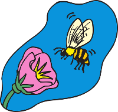
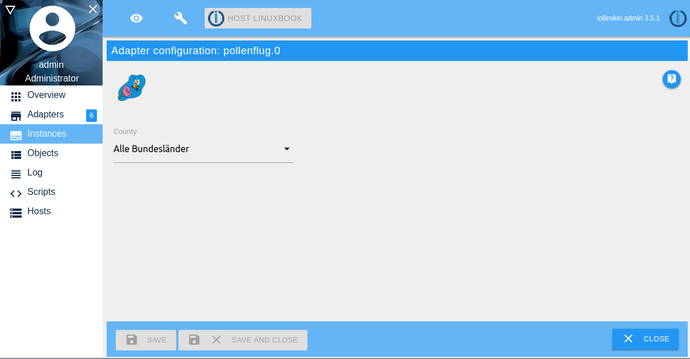
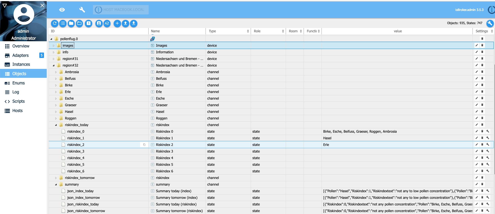
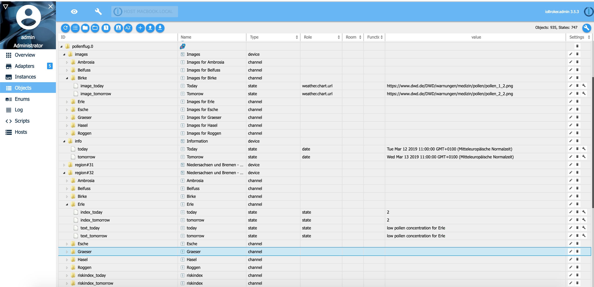

# 花粉风险指数


德国气象局 DWD 每天发布花粉风险指数预报。
预测的花粉种类为：榛树、桤木、白蜡树、桦树、草、黑麦、艾蒿和甘菊，今天和明天，周五和后天（周日）的预测花粉种类为：榛树、桤木、白蜡树、桦树、草、黑麦、艾蒿和甘菊。
每天早上更新。
有关花粉县的信息可在以下网址找到：https://www.dwd.de/pollenflug 所用花粉数据的版权：© Deutscher Wetterdienst（来源：Deutscher Wetterdienst）

## 安装和配置
在 ioBroker 适配器配置中选择县。您将获得该县的花粉风险指数。该指数每天更新一次，大约在 11 点。
在对象 info.today、info.tomorrow 和 info.dayaftertomorrow 中将显示有效期。
例如，今天是星期五，但在对象 info.today 中，日期可能是星期四。
这是正确的，因为 DWD 数据仍来自星期四，至今未更新。更新通常在 11 点进行。

提供的德国县：

* 石勒苏益格-荷尔斯泰因州和汉堡（11 区和 12 区）
    * Inseln und Marschen（11区）
    * 吉斯特、石勒苏益格-荷尔斯泰因州和汉堡（12 区）
* 梅克伦堡-前波莫瑞州 (20 区)
* 下萨克森州和不莱梅州（31 和 32 区）
    *韦斯特。下萨克森州/不莱梅（31 区）
    * 奥斯特。下萨克森州（32 区）
* 北莱茵-威斯特法伦州（41、42 和 43 区）
    * 莱茵-威斯特法尔。蒂夫兰（41 区）
    * 东威斯特法伦州（42 区）
    * 北威州中山 (43 区)
* 勃兰登堡和柏林（第 50 区）
* 萨克森-安哈特州（61 和 62 区）
    * 蒂夫兰萨克森-安哈尔特州（第 61 区）
* 哈茨山 (62 区)
* 图林根（71 和 72 区）
    * 蒂夫兰图林根（71 区）
    * 图林根中山 (72 区)
* 萨克森 (81 和 82 区)
    * 蒂夫兰萨克森州（81 区）
    * 萨克森州中山 (82 区)
* 黑森州 (91 和 92 区)
    * 北德森和赫斯。中山 (91 区)
* 莱茵-美因 (92 区)
* 莱茵兰-普法尔茨州和萨尔州（101、102 和 103 区）
    * 莱茵河、普法尔茨河、纳赫河和摩泽尔河（101 区）
    * Mittelgebirgsbereich 莱茵兰-普法尔茨州（102 区）
* 萨尔州 (103 区)
* 巴登-符腾堡州（111、112 和 113 区）
    * Oberrhein und unteres Neckartal（111区）
    * 霍恩洛厄/米特勒内卡/上施瓦本（112 区）
    * 巴登-符腾堡州中山 (113 区)
* 拜仁 (121、122、123 和 124 区)
    * 阿尔高/上巴伐利亚/拜恩。瓦尔德（121区）
    * Donauniederungen（122 区）
    * 拜仁北部。多瑙河拜尔。沃尔德，O.美因弗兰肯（123 区）
    * 美因弗兰肯（124 区）



原有DWD风险指数0、0-1、1、1-2、2、2-3、3改为0、1、2、3、4、5、6，此格式在ioBroker中可以更简便的使用。

| 索引 | DWD 索引 | 描述 |
|-----	|---------- |------------------------------------ |
| -1 | -1 | 没有可用数据 |
| 0 | 0 | 无花粉浓度 |
| 1 | 0-1 | 无至低花粉浓度 |
| 2 | 1 | 花粉浓度低 |
| 3 | 1-2 | 低到中等花粉浓度 |
| 4 | 2 | 平均花粉浓度 |
| 5 | 2-3 | 中至高花粉浓度 |
| 6 | 3 | 花粉浓度高 |

**花粉飞行示例：**



DWD 花粉图像的 URL 地址


＃＃ 例子
如果有来自 DWD 的新数据（今天的日期将会改变），脚本将显示 Hasel 和 Erle 的花粉风险指数。

```
on({id: "pollenflug.0.info.today"/*Today*/, change: "ne"}, (obj) => {
    let hasel = getState("pollenflug.0.region#12.Hasel.text_today"/*today*/).val;
    let erle  = getState("pollenflug.0.region#12.Erle.text_today"/*today*/).val;
    console.log("Haselnuss Belastung " + hasel);
    console.log("Erle Belastung " + erle);
});
```

## 致谢
如果没有 schmupu (https://github.com/schmupu) 的出色工作，这个适配器就不可能实现，他创建了该适配器的 V1.x.x。

## Changelog
<!--
	Placeholder for the next version (at the beginning of the line):
    ### **WORK IN PROGRESS**
-->
### 2.0.0 (2024-07-24)
* (mcm1957) This adapter hase been moved to iobroker-community-adapters organization
* (mcm1957) Adapter requires node.js >= 18 and js-controller >= 5 now.
* (mcm1957) Dependencies have been updated

### 1.0.6 (03.05.2019)
* (Stübi) User can enable/disable sentry logging

### 1.0.5 (29.04.2019)
* (Stübi) Add Sentry to adapter

### 1.0.4 (19.10.2019)
* (Stübi) Bugfixing

### 1.0.3 (12.04.2019)
* (Stübi) Bugfixing, changing logo size

### 1.0.2 (12.03.2019)
* (Stübi) Bugfixing, of changing sepaation of entries in riskindex_x from ',' to ', '
* (Stübi) unnecessary states will be deleted

### 1.0.1 (11.03.2019)
* (Stübi) Delete all states for day after tommorrow 
* (Stübi) Changed type of object riskindex_x from number to string
* (Stübi) Changed sepaation of entries in riskindex_x from ',' to ', '
* (Stübi) Deleted in summary (json) alle -1 entries

### 1.0.0 (10.03.2019)
* (Stübi) Changed the pollen index for better use in VIS. Now you you values -1, 0, 1, 2, 3, 4, 5 ,6
* (Stübi) Add summary for today, tomorrow and the day after tomorrow in json format for every region

### 0.1.9 (25.02.2019)
* (Stübi) Link to DWD Image of pollen flight added

### 0.1.8 (24.02.2019)
* (Stübi) Bugfixing deleting object

### 0.1.6 (20.02.2019)
* (Stübi) First Version of pollen index adapter

## License
The MIT License (MIT)

Copyright (c) 2024 iobroker-community <iobroker-community-adapters@gmx.de>
Copyright (c) 2020 Thorsten Stueben <thorsten@stueben.de> / <https://github.com/schmupu>

Permission is hereby granted, free of charge, to any person obtaining a copy
of this software and associated documentation files (the "Software"), to deal
in the Software without restriction, including without limitation the rights
to use, copy, modify, merge, publish, distribute, sublicense, and/or sell
copies of the Software, and to permit persons to whom the Software is
furnished to do so, subject to the following conditions:

The above copyright notice and this permission notice shall be included in
all copies or substantial portions of the Software.

THE SOFTWARE IS PROVIDED "AS IS", WITHOUT WARRANTY OF ANY KIND, EXPRESS OR
IMPLIED, INCLUDING BUT NOT LIMITED TO THE WARRANTIES OF MERCHANTABILITY,
FITNESS FOR A PARTICULAR PURPOSE AND NONINFRINGEMENT. IN NO EVENT SHALL THE
AUTHORS OR COPYRIGHT HOLDERS BE LIABLE FOR ANY CLAIM, DAMAGES OR OTHER
LIABILITY, WHETHER IN AN ACTION OF CONTRACT, TORT OR OTHERWISE, ARISING FROM,
OUT OF OR IN CONNECTION WITH THE SOFTWARE OR THE USE OR OTHER DEALINGS IN
THE SOFTWARE.