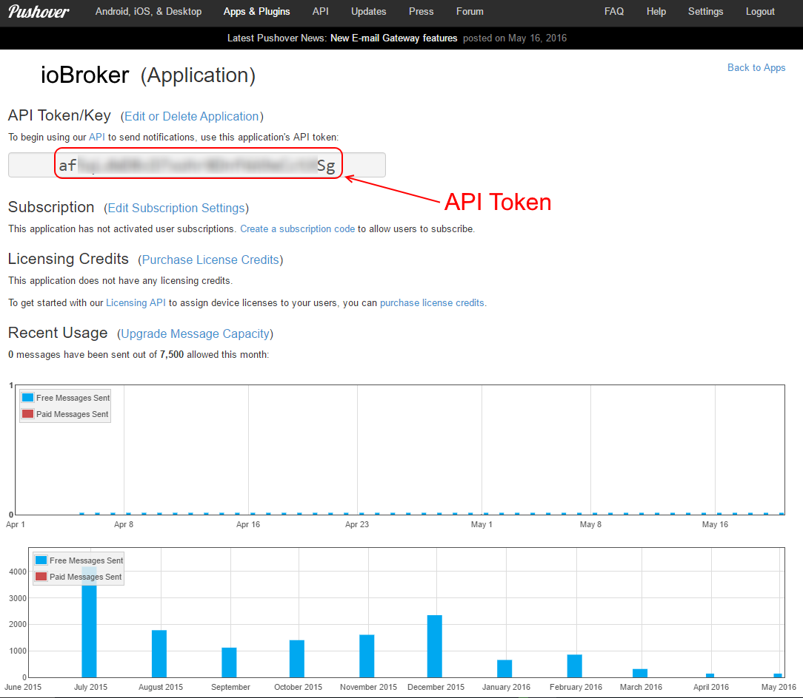
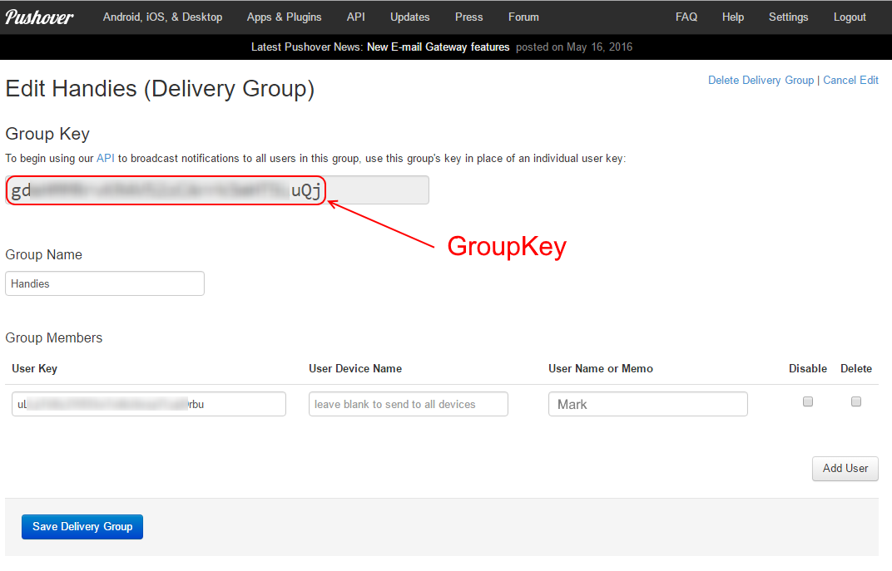

# IoBroker pushover 适配器
 [](https://weblate.iobroker.net/engage/adapters/?utm_source=widget)

从 ioBroker 发送推送通知。

**此适配器使用 Sentry 库自动向开发人员报告异常和代码错误。** 有关更多详细信息以及如何禁用错误报告的信息，请参阅 [Sentry-插件文档](https://github.com/ioBroker/plugin-sentry#plugin-sentry)!从 js-controller 3.0 开始使用哨兵报告。

＃＃ 配置
首先，它需要一个关于 pushover 的帐户。






＃＃ 用法
要从 ScriptEngine 发送通知，只需编写：

```
// send notification to all instances of pushover adapter
sendTo("pushover", "message body");

// send notification to specific instance of pushover adapter
sendTo("pushover.1", "message body");

// To specify subject or other options
sendTo("pushover", {
   message:  'Test text', // mandatory - your text message
   title:    'SweetHome', // optional  - your message's title, otherwise your app's name is used
   sound:    'magic',     // optional  - the name of one of the sounds supported by device clients to override the user's default sound choice
                          //    pushover, bike, bugle, cashregister, classical, cosmic, falling,
                          //    gamelan, incoming, intermission, magic, mechanical, pianobar, siren,
                          //    spacealarm, tugboat, alien, climb, persistent, echo, updown, none
   priority: -1,          // optional
                          //    -1 to always send as a quiet notification,
                          //    1 to display as high-priority and bypass the user's quiet hours, or
                          //    2 to also require confirmation from the user
   token: 'API/KEY token' // optional
                          // add other than configured token to the call
   url,                   // optional  - a supplementary URL to show with your message
   url_title,             // optional  - a title for your supplementary URL, otherwise just the URL is shown
   device,                // optional  - your user's device name to send the message directly to that device, rather than all of the user's devices
   timestamp              // optional  - a Unix timestamp of your message's date and time to display to the user, rather than the time your message is received by our API
   html                   // optional  - 1 to enable parsing of HTML formatting for bold, italic, underlined and font color
   monospace              // optional  - 1 to display the message in monospace font
                          //    either html or monospace is allowed
   file:                  '/opt/picture.png', // optional - attachment
   file:                  { name: '/opt/picture.png', data: fs.readFileSync('/opt/picture.png') }, // optional - attachment
});

// Example for HTML format in the message
sendTo("pushover", {
    message: 'This message includes <b>bold</b>, <i>italic</i> and <u>underlined</u> text <font color=green>in</font> <font color=#ffa500>different</font> <font color=red>colors</font>.',
    html:    1
});

// Example for monospace font in the message
sendTo("pushover", {
    message:   'This message is in monospace font.',
    monospace: 1
});

```

## 一瞥
使用 Pushover 的 Glances，您可以将少量数据直接推送到不断更新的屏幕，称为小部件，例如智能手表上的复杂功能或手机锁定屏幕上的小部件。

```
sendTo("pushover", "glances", {
   message:  'Test text',    // mandatory - (100 characters) - the main line of data, used on most screens
   title:    'SweetHome',    // optional  - (100 characters) - a description of the data being shown, such as "Widgets Sold"
   token:    'API/KEY token' // optional  - add other than configured token to the call
   subtext:  'Second line',  // optional  - (100 characters) - a second line of data
   count:    3,              // optional  - (integer, may be negative) - shown on smaller screens; useful for simple counts
   percent:   90,            // optional  - (integer 0 through 100, inclusive) - shown on some screens as a progress bar/circle
   device:   'DEVICE_NAME',  // optional  - a user's device name to restrict messages to the widget on that device, otherwise leave blank to send messages to all available widgets of that user
});
```

您可以使用名称为 `glances` 的 blockly 来发送来自 `blockly` 的消息。

## 什么是 Sentry 以及向服务器报告什么？
Sentry.io 是开发人员从他们的应用程序中获取错误概览的一种方式。而这正是在这个适配器中实现的。

当适配器崩溃或发生其他代码错误时，ioBroker 日志中也出现的此错误消息将提交到我们自己托管在德国的 Sentry 服务器。当您允许 iobroker GmbH 收集诊断数据时，您的安装 ID（这只是一个唯一 ID **没有**关于您、电子邮件、姓名等的任何其他信息）也包括在内。这允许 Sentry 对错误进行分组并显示受此类错误影响的唯一用户数量。所有这些都帮助我提供基本上从不崩溃的无错误适配器。

<!-- 下一个版本的占位符（在行首）：

### __工作进行中__ -->

## Changelog
### 2.0.5 (2021-06-29)
* (bluefox) Corrected error with token

### 2.0.4 (2021-06-28)
* (dipts) Blockly input value for attachments
* (bluefox) implemented the "glances"

### 2.0.3 (2020-09-25)
* (klein0r) Removed spaces in the admin config dropdown

### 2.0.2 (2020-04-29)
* (Apollon77) fixes case that token is not defined/existing (Sentry IOBROKER-PUSHOVER-2)

### 2.0.1 (2020-04-24)
* (bluefox) Fixed error in the blockly if language was not "ru/en/de"
* (bluefox) Breaking change: the encryption of the password was changed, so the token must be entered anew. Store your token before update.

### 1.3.2 (2020-04-17)
* (Apollon77) add Error handler to not crash adapter (fixes Sentry IOBROKER-PUSHOVER-1)

### 1.3.0 (2020-04-12)
* (Apollon77) Fix token decryption and add compatibility to js-controller 3.0
* (Apollon77) Add Sentry (used in js-controller 3.0)

### 1.2.3 (2020-02-19)
* (bluefox) Token will be encrypted now.

### 1.2.0 (2020-02-03)
* (bluefox) Removed the getMessages call.

### 1.1.1 (2019-09-18)
* (Apollon77) js-controller 2.0 compatibility, dependency updates

### 1.1.0 (2018-09-02)
* (bluefox) Admin3 is supported now

### 1.0.4 (2017-10-22)
* (janhuddel) callback is now possible (to receive the receipt from pushover if you use priority = 2)

### 1.0.3 (2017-10-21)
* (Tan-DE) Change priorities in blockly

### 1.0.2 (2016-10-12)
* (bluefox) support of blockly

### 1.0.1 (2016-08-28)
* (bluefox) filter out double messages

### 1.0.0 (2016-06-01)
* (bluefox) fix timestamp
* (bluefox) update grunt packages

### 0.1.1 (2015-05-03)
* (bluefox) add readme link

### 0.1.0 (2015-01-03)
* (bluefox) enable npm install

### 0.0.4 (2014-11-22)
* (bluefox) support of new naming concept

### 0.0.3 (2014-10-08)
* (bluefox) add "daemon" mode to "subscribe"

## License

The MIT License (MIT)

Copyright (c) 2014-2021 bluefox <dogafox@gmail.com>

Permission is hereby granted, free of charge, to any person obtaining a copy
of this software and associated documentation files (the "Software"), to deal
in the Software without restriction, including without limitation the rights
to use, copy, modify, merge, publish, distribute, sublicense, and/or sell
copies of the Software, and to permit persons to whom the Software is
furnished to do so, subject to the following conditions:

The above copyright notice and this permission notice shall be included in
all copies or substantial portions of the Software.

THE SOFTWARE IS PROVIDED "AS IS", WITHOUT WARRANTY OF ANY KIND, EXPRESS OR
IMPLIED, INCLUDING BUT NOT LIMITED TO THE WARRANTIES OF MERCHANTABILITY,
FITNESS FOR A PARTICULAR PURPOSE AND NONINFRINGEMENT. IN NO EVENT SHALL THE
AUTHORS OR COPYRIGHT HOLDERS BE LIABLE FOR ANY CLAIM, DAMAGES OR OTHER
LIABILITY, WHETHER IN AN ACTION OF CONTRACT, TORT OR OTHERWISE, ARISING FROM,
OUT OF OR IN CONNECTION WITH THE SOFTWARE OR THE USE OR OTHER DEALINGS IN
THE SOFTWARE.