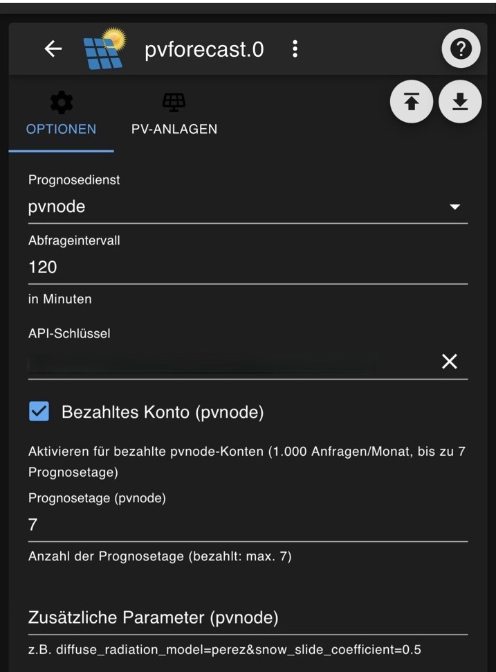

# IoBroker.pvforecast
此适配器替换了 [ioBroker论坛](https://forum.iobroker.net/topic/26068/forecast-solar-mit-dem-systeminfo-adapter) 中的 JavaScript

适配器从各种预测服务中检索基本数据，并按照 ioBroker 的说明提供这些数据。

## 支持的预测服务
- **Forecast.solar** - https://forecast.solar
- **Solcast** - https://solcast.com
- **SolarPredictionAPI** - 通过 RapidAPI
- **pvnode** - https://pvnode.com

＃＃ 设置
1. 经度（西经 180°，东经 180°）
第二平行线 -90（南）…90（北）
3. 链接到页面
4. API密钥
5. 图表 Y 轴水平
6. 数据检索计划（分钟） - 每隔 x 分钟从服务器检索数据的计划。

也可以使用 API 密钥获取天气信息（仅限 Forecast.solar）。

1. datetime - 日期和时间
2. 天空 - 介于 0 和 1 之间的值，表示晴空的百分比 [1 = 晴空]。
3. 温度 [°C]
4. 条件 - 文本
5. 图标 - 文字 + 数字
6. 风速 - [公里/小时]
7. 风向角 - 正北 0°（顺时针方向）。（如果风速为零，则该值未定义）
8. 风向 - 简称
9. 更高的时间分辨率

以下是系统可用的设置。
1. 倾斜角度（0°-90°）
2. 方位角（-180 = 北，-90 = 东，0 = 南，90 = 西，180 = 北）
3. 系统输出功率（kWp）
4. 植物名称
5. 图例名称
9. 图表颜色
10. 图表标签颜色

所有这些信息都是为了确保适配器正常工作所必需的。

如果纬度和经度已存储在系统中，系统将自动将数据输入到相应字段中。

## 光伏节点
[pvnode](https://pvnode.com) 是一项德国服务，提供以 15 分钟为间隔的高分辨率光伏预测。

### PVNode 配置
1. **API密钥**：在https://pvnode.com/api-keys 创建API密钥
2. **付费账户**：如果您拥有付费的 pvnode 账户，请启用此选项。
3. **预测天数**：预测天数（仅限付费账户，最多 7 天）。免费账户自动获得 1 天预测天数。
4. **查询间隔**：建议：90 分钟（pvnode 每天更新 16 次）
5. **附加参数**：可选的 API 参数，例如 `diffuse_radiation_model=perez&snow_slide_coefficient=0.5`

### Pvnode 账户类型
| 功能 | 免费 | 付费 |
|----------|-----------|---------|
| API 请求/月 | 40 | 1,000 |
| 预测天数 | 1 天（今天 + 明天） | 最多 7 天 |
| 历史数据 | 否 | 是（-30 天） |
| 地点 | 1 | 多个 |

**重要提示**：仅当您拥有付费的 PVNode 账户时才启用“付费账户”选项。否则，可能会出现 API 错误，因为适配器无法自动检测您使用的账户类型。

### Pvnode 附加参数
以下可选 API 参数可通过“附加参数”字段传递：

| 参数 | 说明 | 示例 |
|-----------|--------------|---------|
| `diffuse_radiation_model` | 辐射模型 | `perez` |
| `shading_config` | 遮阳配置 | `7:2:3:1_1:1:0:0_0:0:0:0` |
| `shading_config` | 着色配置 | `7:2:3:1_1:1:0:0_0:0:0:0` |

格式：`key1=value1&key2=value2`

### Pvnode 特色功能
- **15分钟分辨率**：pvnode以15分钟为间隔提供预测数据
- **方位角转换**：适配器会自动将方位角值（适配器：0=南）转换为 pvnode 格式（180=南）。
- **请求捆绑**：配置多个系统时，每个 API 请求最多会自动捆绑两个系统（pvnode `second_array` 功能）。这可以减少 API 调用次数（例如，两个系统只需一个请求，而不是两个）。合并后的预测数据存储在第一个系统中；第二个系统会被标记为已捆绑。
- **摘要数据**：摘要 JSON 包含 Clearsky 值（所有系统的总和）以及温度和天气代码（每个值均为第一个系统的值）。
- **时区**：pvnode API 提供的时间戳为 UTC 时间。适配器会自动将其转换为本地系统时间。
- “早晨阻尼”和“傍晚阻尼”字段不适用于光伏节点。

## VIS 示例
加载示例之前，请先安装：[材料设计](https://github.com/Scrounger/ioBroker.vis-materialdesign)。

如果您想在 ioBroker Vis 中使用 JSON 图表和表格，可以在这里找到 [例子](./vis.md)。

## Changelog
<!--
    Placeholder for the next version (at the beginning of the line):
    ### **WORK IN PROGRESS**
-->
### 6.0.0 (2026-04-10)

- (@patricknitsch) Added pvnode als alternative Provider
- (copilot) Adapter requires admin >= 7.7.22 now

### 5.1.0 (2026-02-03)

* (@klein0r) admin 7.6.17 and js-controller 6.0.11 (or later) are required
* (@Scrounger) solcast user agent bug fix
* (@klein0r) Updated dependencies

### 5.0.0 (2025-04-23)

NodeJS >= 20.x and js-controller >= 6 is required

* (@klein0r) Minimum peak power is 0.1 kWp

### 4.1.0 (2024-11-15)

* (@klein0r) Added estimated energy: now until end of day
* (@simatec) Admin-UI has been adapted for small displays

### 4.0.1 (2024-10-22)

* (@klein0r) Fixed: Missing color settings for new Solcast table

## License

MIT License

Copyright (c) 2026 iobroker-community-adapters <iobroker-community-adapters@gmx.de>  
Copyright (c) 2021-2025 Patrick-Walther
                        Matthias Kleine <info@haus-automatisierung.com>

Permission is hereby granted, free of charge, to any person obtaining a copy
of this software and associated documentation files (the "Software"), to deal
in the Software without restriction, including without limitation the rights
to use, copy, modify, merge, publish, distribute, sublicense, and/or sell
copies of the Software, and to permit persons to whom the Software is
furnished to do so, subject to the following conditions:

The above copyright notice and this permission notice shall be included in all
copies or substantial portions of the Software.

THE SOFTWARE IS PROVIDED "AS IS", WITHOUT WARRANTY OF ANY KIND, EXPRESS OR
IMPLIED, INCLUDING BUT NOT LIMITED TO THE WARRANTIES OF MERCHANTABILITY,
FITNESS FOR A PARTICULAR PURPOSE AND NONINFRINGEMENT. IN NO EVENT SHALL THE
AUTHORS OR COPYRIGHT HOLDERS BE LIABLE FOR ANY CLAIM, DAMAGES OR OTHER
LIABILITY, WHETHER IN AN ACTION OF CONTRACT, TORT OR OTHERWISE, ARISING FROM,
OUT OF OR IN CONNECTION WITH THE SOFTWARE OR THE USE OR OTHER DEALINGS IN THE
SOFTWARE.