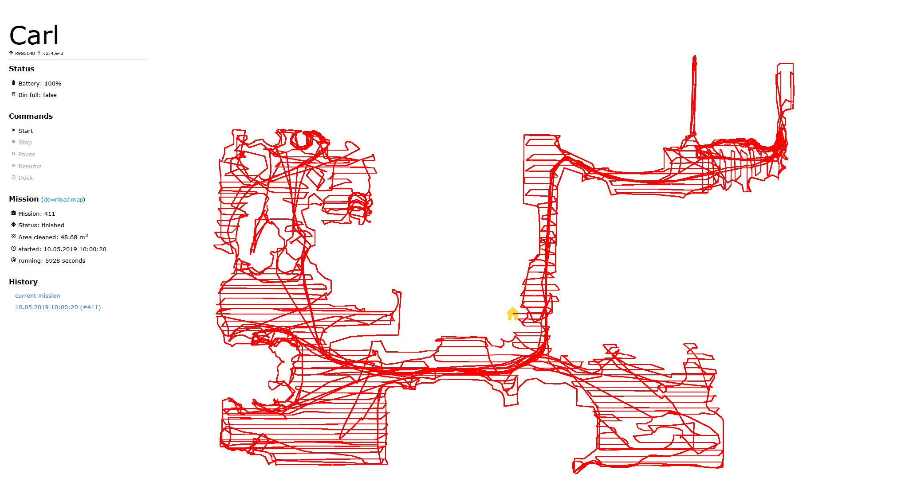

# IoBroker.roomba 将您的 iRobot Roomba 连接到 ioBroker。
基于dorita980库https://github.com/karlvr/dorita980#readme

[](https://travis-ci.com/iobroker-community-adapters/ioBroker.roomba)

**目录**

1. [功能](#features)
2. [安装](#安装)
3. [设置说明](#setup-instructions)
4. [支持的 Roomba / 固件版本](#supported-roombas--firmware-versions)
5. [频道和状态](#channels--states)
6. [偏好描述（不完整）](#description-of-preferences-incomplete)
7. [使用 ioBroker.javascript 进行智能家居/Alexa 集成](#smart-home--alexa-integration-using-iobrokerjavascript)
8. [变更日志](#changelog)
9. [制作人员](#制作人员)
10. [许可证](#license)

＃＃ 特征
该适配器具有以下功能：

- __发送命令__（“开始”、“停止”、“恢复”、“暂停”、“停靠”）到您的 Roomba
- 检索 __设备状态__，例如电池、对接、已满/插入的垃圾箱（请参阅 [通道和状态](#channels--states) 了解完整列表）
- 检索__设备配置__，例如首选项、网络或计划设置（请参阅[频道和状态](#channels--states) 了解完整列表）
- 检索__设备统计信息__，例如总任务、在扩展坞上的时间等（请参阅[频道和状态](#channels--states) 了解完整列表）
- 检索有关__当前任务__（当您的 Roomba 清洁时）的信息，例如开始和结束时间、总运行时间、清洁平方米等（仅在支持的 Roomba 上，请参阅[支持的 Roomba/固件版本](#supported-roombas --固件版本））
- __根据收到的任务数据__绘制地图（仅适用于受支持的 Roomba）
- __Web Interface__ 显示当前以及以前/存档任务的状态和地图：

  

＃＃ 安装
ioBroker.roomba 需要 [帆布](https://www.npmjs.com/package/canvas) 才能绘制 Roomba 任务地图。 ioBroker 将尝试通过 ioBroker.roomba 安装来安装此依赖项。

不过，您可能必须使用以下命令安装画布（以及画布本身）的包依赖项：

### Linux
```
sudo apt-get install build-essential libcairo2-dev libpango1.0-dev libjpeg-dev libgif-dev librsvg2-dev
```

此外，在 ioBroker.roomba 目录中运行以下命令__ (`/opt/iobroker/node_modules/iobroker.roomba`)：

```
sudo npm install canvas --unsafe-perm=true
```

### 窗口
1. 确保你已经通过以下方式安装了`node-gyp`

```
npm install -g node-gyp
```

2. 确保您已通过以下方式安装了构建必需品

```
npm install --global --production windows-build-tools
```

3. 下载 GTK 2（适用于 [Win32](http://ftp.gnome.org/pub/GNOME/binaries/win32/gtk+/2.24/gtk+-bundle_2.24.10-20120208_win32.zip) 或 [Win64](http://ftp.gnome.org/pub/GNOME/binaries/win64/gtk+/2.22/gtk+-bundle_2.22.1-20101229_win64.zip)) 并将其解压缩（例如到 `C:\path\to\GTK2`）
4. 跑步

```
node-gyp rebuild --GTK_Root=C:\path\to\GTK2
```

5. 从 iobroker.roomba 文件夹中安装 canvas

```
cd C:\path\to\iobroker\node_modules\iobroker.roomba
npm install canvas
```

有关详细信息，请参阅 https://github.com/Automattic/node-canvas/wiki/Installation:-Windows。

## 设置说明
### 自动设置
按照 ioBroker.roomba 管理面板中的说明自动设置 ioBroker.roomba。

**注意**：身份验证凭据与您在智能手机应用程序中使用的身份验证凭据不同！

1. 确保 ioBroker.roomba 适配器已启动。
2. 确保您的机器人位于 Home Base 充电座上并已通电（绿灯亮起）。
3. 然后按住机器人上的 HOME 按钮，直至发出一系列提示音（约 2 秒）。
4. 松开按钮，您的机器人将闪烁 WIFI 灯。
5. 然后返回此处按按钮检索 IP 和凭据。

如果自动过程无法检索您的凭据，请使用手动设置。

### 手动设置
有关手动设置，请参阅 https://github.com/karlvr/dorita980#how-to-get-your-usernameblid-and-password。

## 支持的 Roomba/固件版本
### 支持的固件版本
|软件版本 |固件信息 |支持 |
| ---------------- | ------------- | --------- |
| v1.4 | [发行说明](https://homesupport.irobot.com/app/answers/detail/a_id/19549#rn_PageTitle) |  **支持( 包括。地图）** |
| v3.2.xx | [发行说明](https://homesupport.irobot.com/app/answers/detail/a_id/541#rn_PageTitle) |  **支持** ( 无地图）|
| v3.2.xx | [发行说明](https://homesupport.irobot.com/app/answers/detail/a_id/541#rn_PageTitle) |  **支持** ( | （最有可能）|
| Roomba® 6xx | [692](https://github.com/iobroker-community-adapters/ioBroker.roomba/issues/28) | v3.5.62 | [发行说明](https://homesupport.irobot.com/app/answers/detail/a_id/541#rn_PageTitle) |  **支持** ( 无地图）|
| Roomba® 7xx | 774, 785, | - | |  _型号不提供 Wifi 连接，因此不支持_ |
| Roomba® 8xx | 880、886、891、896 | - | [发行说明](https://homesupport.irobot.com/app/answers/detail/a_id/541#rn_PageTitle) | （最有可能）|
| Roomba® 8xx | [895]（（https://forum.iobroker.net/post/245274））| v3.2.10 / 40 / 69 | [发行说明](https://homesupport.irobot.com/app/answers/detail/a_id/541#rn_PageTitle) |  **支持** ( 无地图）|
| Roomba® 9xx | 965、981 | - | [发行说明](https://homesupport.irobot.com/app/answers/detail/a_id/529#rn_PageTitle) | （最有可能）|
| Roomba® 9xx | [第960章【966】【980】 v2.4.6-3 | [发行说明](https://homesupport.irobot.com/app/answers/detail/a_id/529#rn_PageTitle) |  **支持（包括地图）** |
| Roomba® i | [i7 (7150)](https://forum.iobroker.net/post/240589)、i7+ (7550) | v1.4 | [发行说明](https://homesupport.irobot.com/app/answers/detail/a_id/19549#rn_PageTitle) |  **支持（包括地图）** |
| Roomba® e5 | [e5](https://forum.iobroker.net/topic/7657/irobot-roomba-adapter/158) | v3.4.42 | [发行说明](https://homesupport.irobot.com/app/answers/detail/a_id/6345#rn_PageTitle) |  **支持** ( 无地图）|
| Roomba® s | [S9+](https://github.com/Zefau/ioBroker.roomba/issues/34) | v3.2.4 | [发行说明](https://homesupport.irobot.com/app/answers/detail/a_id/26887/kw/s9%2B#rn_PageTitle) |  **支持（包括地图）** |
| Roomba® s | [S9+](https://github.com/Zefau/ioBroker.roomba/issues/34) | v3.2.4 | [发行说明](https://homesupport.irobot.com/app/answers/detail/a_id/26887/kw/s9%2B#rn_PageTitle) |  **支持（包括地图）** |

请帮助我们了解支持的设备，并告诉我[通过问题知道](https://github.com/iobroker-community-adapters/ioBroker.roomba/issues)您的 Roomba 型号是否受支持！

## 频道和状态
成功设置后，将创建以下通道和状态：

|频道|文件夹|状态|描述 |
| ------- | ------ | ----- | ----------- |
|清洁| - | - |有关清洁过程的命令和信息 |
|清洁|最后| - |发送给机器人的最后命令 |
|清洁|最后|命令|发送给机器人的最后一条命令 |
|清洁|最后|时间戳|发送最后一条命令的时间戳 |
|清洁|最后|日期时间 |发送最后一条命令的日期时间 |
|清洁|最后|发起人|最后一个命令的发起者 |
|清洁|最后|循环|循环 |
|清洁|最后|相|相|
|清洁|最后|错误 |指示上次任务期间出现错误 |
|清洁|日程 | - |日程信息|
|清洁|日程 |循环|日程周期（周日至周六）|
|清洁|日程 |小时 |开始周期的时间（周日至周六） |
|清洁|日程 |分钟|周期开始分钟（周日至周六） |
|清洁| - |码头|将机器人发送至扩展坞 |
|清洁| - |暂停|暂停当前的清洁过程 |
|清洁| - |简历 |恢复当前的清洁过程 |
|清洁| - |开始 |开始清洁过程 |
|清洁| - |停止|停止当前的清洁进程 |
|设备| - | - |设备信息|
|设备|网络| - |网络资讯|
|设备|网络| DHCP |说明 DHCP 是否已激活 |
|设备|网络|路由器|路由器的Mac地址|
|设备|网络| ip | IP 地址 |
|设备|网络|子网 |子网地址|
|设备|网络|网关|网关地址 |
|设备|网络|域名解析1 |主 DNS 地址 |
|设备|网络|域名解析2 |辅助 DNS 地址 |
|设备|偏好 | - |设置首选项 |
|设备|偏好 |暂停| **未知** |
|设备|偏好 |地毯Boost汽车|自动：Roomba 将自动增强吸尘功率以深度清洁地毯。 |
|设备|偏好 |地毯BoostHigh |性能模式：Roomba 将始终增强其真空，以最大限度地提高所有地板表面的清洁性能。 |
|设备|偏好 |生态充电| **未知** |
|设备|偏好 |没有自动通行证 |一次清洁：Roomba 只需一次清洁即可覆盖所有区域。 |
|设备|偏好 |没有PP | **未知** |
|设备|偏好 |只开放 | **未知** |
|设备|偏好 |预定保持| **未知** |
|设备|偏好 |双通 | Roomba 将第二次覆盖所有区域。这对于有宠物的家庭或偶尔进行深度清洁可能会有帮助。 |
|设备|版本 | - |版本信息 |
|设备|版本 |硬件版本 |硬件修订|
|设备|版本 |电池类型 |电池类型 |
|设备|版本 |声音版本 | **未知** |
|设备|版本 | uiSwVer | **未知** |
|设备|版本 |导航SwVer | **未知** |
|设备|版本 | wifiSwVer | **未知** |
|设备|版本 |移动性版本 | **未知** |
|设备|版本 |引导加载程序版本 |引导加载程序版本 |
|设备|版本 | umiVer | **未知** |
|设备|版本 |软件版本 |软件版本 |
|设备| - | \_rawData |原始偏好数据为 json |
|设备| - |麦克 |机器人Mac地址|
|设备| - |名称 |机器人名称|
|设备| - |类型 |机器人类型 |
|状态 | - | - |状态信息|
|状态 | - | \_连接|连接状态|
|状态 | - |电池|机器人的电池电量 |
|状态 | - |箱已满 |说明bin状态是否已满 |
|状态 | - |已插入垃圾箱 |说明是否插入了bin |
|状态 | - |停靠 |说明机器人是否对接 |
|状态 | - |信号|信号强度|
|状态 | - |状态 |机器人现状|
|统计 | - | - |统计信息|
|统计 |使命 | - |任务统计|
|统计 |使命 |失败 |失败的清洁作业数量 |
|统计 |使命 |成功|成功清洁工作的数量 |
|统计 |使命 |总计 |清洁工作数量 |
|统计 |时间 | - |时间统计|
|统计 |时间 |平均最小值 | **未知** |
|统计 |时间 | hOnDock | **未知** |
|统计 |时间 | n可用 | **未知** |
|统计 |时间 | estCap | **未知** |
|统计 |时间 | nLithChrg | nLithChrg | **未知** |
|统计 |时间 | nNimhChrg| **未知** |
|统计 |时间 | nDocks | **未知** |
| - | - |刷新日期时间 |上次更新的日期时间 |
| - | - |刷新时间戳 |上次更新的时间戳 |

## 偏好描述_（不完整）_
调用```getPreferences()```时将收到以下有效负载（请参阅https://github.com/karlvr/dorita980#getpreferences）：

|对象|索引 |类型 |描述 | ioBroker 状态 |
| ------ | ----- | ---- | ----------- | -------------- |
|网络资讯 | - |对象| Roomba 连接的网络信息 | - |
|网络资讯 | .dhcp |布尔 |说明 DHCP 是否已激活 |设备.网络.dhcp |
|网络资讯 | .addr | ip | IP 地址 |设备.网络.ip |
|网络资讯 | .mask | ip |子网地址 |设备.网络.子网 |
|网络资讯 | .gw | ip |网关地址 |设备.网络.网关 |
|网络资讯 | .dns1 | ip |主 DNS 地址 |设备.网络.dns1 |
|网络资讯 | .dns2 | ip |辅助 DNS 地址 |设备.网络.dns2 |
|网络资讯 | .bssid |麦克 |路由器的Mac地址|设备.网络.路由器 |
|网络资讯 | .sec |整数 |未知 | _（未映射）_ |
|无线网络统计 | - |对象|未知 | - |
|无线网络统计 | .wifi |整数 |未知 | _（未映射）_ |
|无线网络统计 | .uap |布尔 |未知 | _（未映射）_ |
|无线网络统计 | .云 |整数 |未知 | _（未映射）_ |
| wlcfg | - |对象|未知 | - |
| wlcfg | .sec |整数 |未知 | _（未映射）_ |
| wlcfg | .ssid |字符串|未知 | _（未映射）_ |
|麦克 | - |麦克 | Roomba 的 Mac 地址 | - |
|国家 | - |字符串|未知 | - |
|云环境 | - |字符串|未知 | - |
| svcEndpoints | .svcDeplId |字符串|未知 | - |
|允许地图上传 | - |布尔 |未知 | - |
|本地时间偏移 | - |整数 |未知 | - |
| ... | - | ... | ... | - |

请帮助我们了解偏好的描述。如果您知道表中未知的首选项的含义，请让我[通过问题了解其含义](https://github.com/iobroker-community-adapters/ioBroker.roomba/issues)！

## 使用 ioBroker.javascript 进行智能家居/Alexa 集成
### 任务完成后通过 Telegram 发送地图
这需要安装 ioBroker 适配器 ioBroker.telegram (https://github.com/ioBroker/ioBroker.telegram)。

在 ioBroker.javascript 的“common”文件夹中创建一个脚本，并向其中添加以下侦听器：

```javascript
var _fs = require('fs');

/*
 * MISSION END: Send map
 *
 */
var message = "%device.name% finished at %missions.current.endedDateTime% cleaning %missions.current.sqm% sqm in %missions.current.runtime% seconds (%missions.current.error% errors).";
var ns = 'roomba.0';
var imagePath = 'tmp/';

on({id: ns + '.missions.current.ended', change: 'any'}, function(obj)
{
    if (!obj.state || !obj.state.val) return;

    // replace variables with state values
    var pos, variable, state, value;
    while (message.indexOf('%') > -1)
    {
        pos = message.indexOf('%');
        variable = message.substring(pos, message.indexOf('%', pos+1)+1);
        state = getState(ns + '.' + variable.replace(/%/g, ''));

        if (state !== null && state.val !== null)
            value = state.val
        else
        {
            log('State ' + variable.replace(/%/g, '') + ' not found!', 'warn');
            value =  '';
        }

        if (typeof value === "boolean") value = value === true ? 'with' : 'no';
        message = message.replace(RegExp(variable, 'gi'), value);
    }

    // console
    log(message);

    // get image
    var img = getState(ns + '.missions.current.mapImage').val;

    if (img !== null && img.indexOf('data:image/png;base64,') > -1)
    {
        _fs.writeFile(imagePath + 'image.png', img.replace(/^data:image\/png;base64,/, ''), 'base64', function(err)
        {
            if (err !== null)
                log(err.message, 'warn');
            else
                sendTo('telegram', {text: imagePath + 'image.png', message: message});
        });
    }
});
```

_2019-05-04 修复了阻止发送地图的错误_

您可以将变量```message```编辑为您希望通过地图接收的任何通知。您可以使用 ```%name-of-state%``` 检索 ioBroker.roomba 对象树中状态的值。

## 学分
### 非官方API
感谢[@koalazak](https://github.com/koalazak) 用于[非官方 iRobot Roomba 980 node.js 库 (SDK)](https://github.com/koalazak/dorita980#readme)。

### 图标
由<a href="https://www.flaticon.com/authors/iconnice" title="图标尼斯">Iconnice</a>从<a href="https://www.flaticon.com/" title="平面图标">www.flaticon.com</a>制作的图标已获得<a href="http://creativecommons.org/licenses/by/3.0/" title="知识共享 3.0 之前" target="_blank">CC 3.0 BY</a>许可</div>

## Changelog
### 1.2.1 (2023-08-09)

* (mcm1957) dorita980 dependency has been upgraded
* (mcm1957) some other dependencies have been upgraded
* (mcm1957) Adapter now requires node 16 or newer and js-controller 4.0.24 or newer

### 1.2.0 (2023-08-09)

* (TheRealArthurDent) dorita980 has been updated (see PR #144)
* (mcm1957) Release script has been updated
* (mcm1957) Several issues reported by adapter checker have been fixed

### 1.1.4 (2021-07-19)
* (Apollon77) Adjust some types to prevent js-controller 3.3 warnings
* (thost96) fix hanging state loading in frontend
* (thost96) fixed link in canvas warning

### 1.1.1 (2020-02-16)
- (Zefau) moved development to Community Repository

### 1.1.0 (2020-02-06)
- (Zefau) added support to change schedule (see [#36](https://github.com/Zefau/ioBroker.roomba/issues/36))
- (Zefau) fixed bug with state `commands.last.dateTime` having incorrect value `NaN`
- (Zefau) fixed error message shown when robot is on a mission but map is not given

### 1.1.0 (2020-02-06)
- (Zefau) acknowledged support for S9+ (see [#34](https://github.com/Zefau/ioBroker.roomba/issues/34))

### 1.0.7 (2019-09-03)
- (Zefau) fixed bugs occurring when Roomba is on a mission
- (Zefau) added additional debug logging

### 1.0.6 (2019-08-19)
- (Zefau) added loading screen to web interface

### 1.0.5 (2019-08-18)
- (Zefau) fixed failing secure connection
- (Zefau) fixed broken credential retrieval
- (Zefau) fixed broken refresh

### 1.0.4 (2019-08-15)
- (Zefau) fixed password retrieval
- (Zefau) fixed German translations
- (Zefau) added donations button
- (Zefau) updated `dorita980` dependency to v3.1.3
- (Zefau) updated `canvas` dependency to v2.6.0

### 1.0.3 (2019-07-23)
- (Zefau) fixed bug _uncaught exception: Cannot read property 'x' of undefined_

### 1.0.2 (2019-07-20)
- (Zefau) reworked placing home icon ([#23](https://github.com/Zefau/ioBroker.roomba/issues/23))
- (Zefau) updated dependencies to fix security vulnerabilities in depending packages

### 1.0.1 (2019-05-15)
- (Zefau) fixed display error in Chrome ([#19](https://github.com/Zefau/ioBroker.roomba/issues/19#issuecomment-492963244))
- ([@Apollon77](https://github.com/Apollon77)) updated testing for Node.js v12 ([#18](https://github.com/Zefau/ioBroker.roomba/pull/18))
- (Zefau) updated dependencies

### 1.0.0 (2019-05-04)
- (zefau) No changes, only bump to stable release

### 0.5.0 (2019-04-21)
- (zefau) Added command buttons to map page / web interface ([#17](https://github.com/Zefau/ioBroker.roomba/issues/17))
- (zefau) Removed button to end mission manually ```missions.current._endMission```
- (zefau) Run ```stop``` command in the background when ```dock``` command is received ([#14](https://github.com/Zefau/ioBroker.roomba/issues/14))
- (zefau) Added Web Adapter as dependency

### 0.4.5 (2019-03-20)
- Zefau) Refactored retrieval of preferences and added debug mode

### 0.4.4 (2019-03-15)
- ([@Apollon77](https://github.com/Apollon77)) Core Files/Testing Update and introduce adapter-core ([#8](https://github.com/Zefau/ioBroker.roomba/pull/8))

### 0.4.3 (2019-02-10)
- (zefau) Improved compatibility for series 600

### 0.4.2 (2019-02-09)
- (zefau) Bug fixing

### 0.4.1 (2019-02-03)
- (zefau) Support for Compact Mode
- (zefau) Bug fixing

### 0.4.0 (2019-01-08)
- (zefau) Support for e5 and 600 series (due to support by [dorita980](https://github.com/koalazak/dorita980#readme))

### 0.3.0 (2019-01-06)
- (zefau) Image / Map of the current cleaning mission will be created
- (zefau) Removed encryption of password

### 0.2.3 (2018-12-03)
- (zefau) Fixed an issue encrypting the password when entered by user (no automated retrieval)

### 0.2.2 (2018-12-02)
- (zefau) Password will now be stored encrypted

Note: If you are coming from an earlier version, you have to (1) empty your settings, (2) save, (3) restart the adapter and (4) enter / fetch credentials again (duo to the fact that password will be stored encrypted now)

### 0.2.1 (2018-11-25)
- (zefau) Fixed / improved automatically retrieving of authentication credentials

### 0.2.0 (2018-11-18)
- (zefau) improved admin interface to automatically retrieve authentication credentials

### 0.1.0 (2018-11-04)
- (zefau) initial version

## License
The MIT License (MIT)

Copyright (c) 2023 iobroker-community-adapters <mcm57@gmx.at>
Copyright (c) 2018-2020 Zefau <zefau@mailbox.org>

Permission is hereby granted, free of charge, to any person obtaining a copy
of this software and associated documentation files (the "Software"), to deal
in the Software without restriction, including without limitation the rights
to use, copy, modify, merge, publish, distribute, sublicense, and/or sell
copies of the Software, and to permit persons to whom the Software is
furnished to do so, subject to the following conditions:

The above copyright notice and this permission notice shall be included in
all copies or substantial portions of the Software.

THE SOFTWARE IS PROVIDED "AS IS", WITHOUT WARRANTY OF ANY KIND, EXPRESS OR
IMPLIED, INCLUDING BUT NOT LIMITED TO THE WARRANTIES OF MERCHANTABILITY,
FITNESS FOR A PARTICULAR PURPOSE AND NONINFRINGEMENT. IN NO EVENT SHALL THE
AUTHORS OR COPYRIGHT HOLDERS BE LIABLE FOR ANY CLAIM, DAMAGES OR OTHER
LIABILITY, WHETHER IN AN ACTION OF CONTRACT, TORT OR OTHERWISE, ARISING FROM,
OUT OF OR IN CONNECTION WITH THE SOFTWARE OR THE USE OR OTHER DEALINGS IN
THE SOFTWARE.