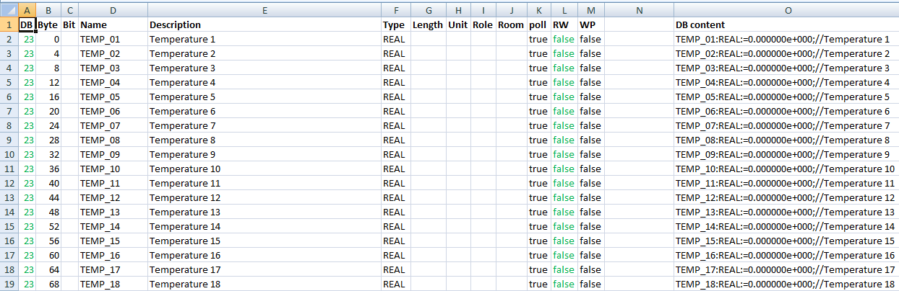
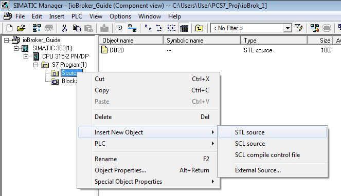
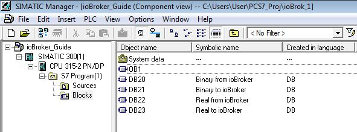
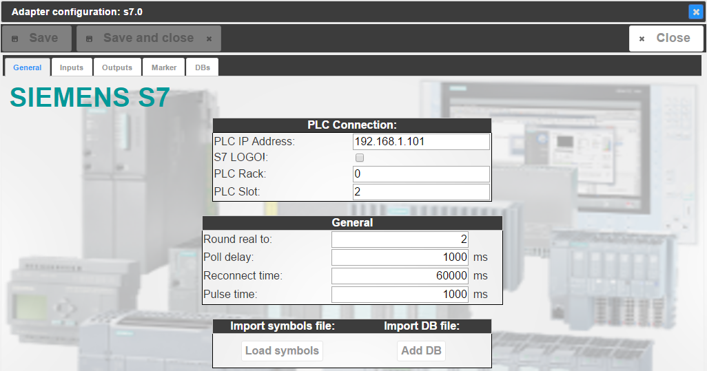
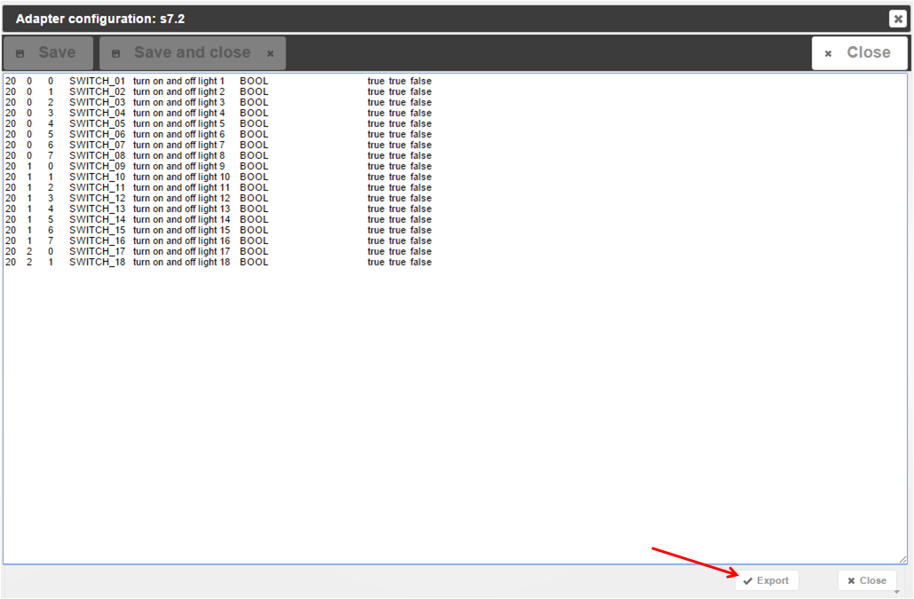
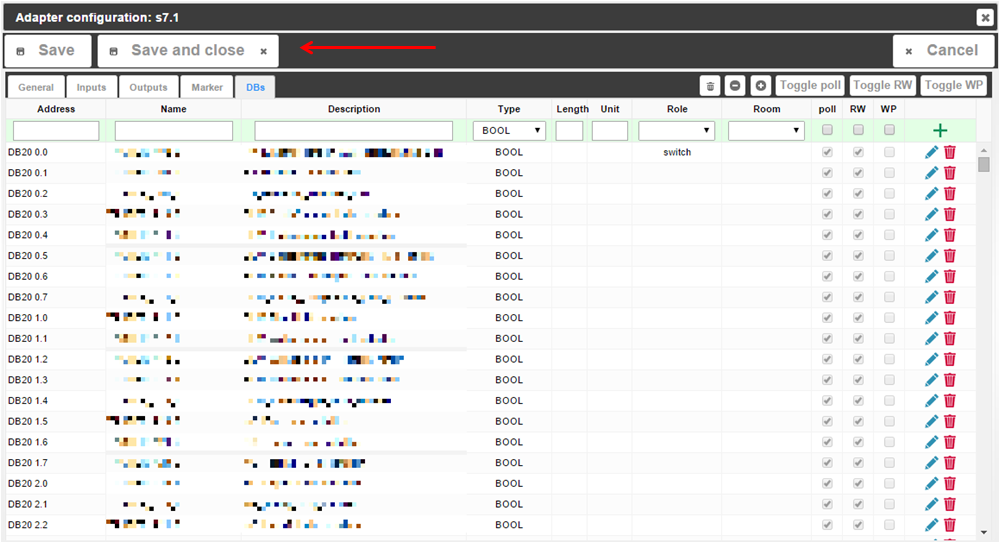
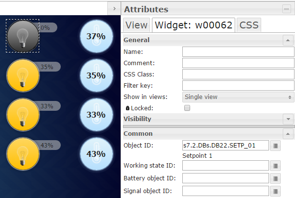

# IoBroker.S7
## 详细描述
ioBroker 附带的 S7 适配器基于 Snap7\。Snap7 将在适配器首次安装时安装，并处理 S7 PLC 和 ioBroker 之间的 TCP/IP 通信。因此，S7 必须配备以太网接口（集成或外部 CP），以便通过 TCP/IP 与运行 ioBroker 的硬件进行通信。作为先决条件，用户必须了解 TCP/IP 通信的基础知识，并且必须能够使用 Step7 软件配置 S7 PLC。但对于考虑将 S7 链接到 ioBroker 的人来说，这应该不是什么难事。

＃＃ 安装
本指南基于以下配置：

* 带有集成以太网接口的 S7-315
* Raspberry Pi 2，ioBroker 在 Debian GNU/Linux 7.8 下运行（wheezy）
* IP 地址范围 192.168.1.xxx
* 电脑运行：
* 电子表格工具，如 MS Excel、Apache Open Office
* 谷歌 Chrome 浏览器
*Step7 V5.5 SP4 HF5

**需要附加文件：（iobroker_adapter_S7.xlsx）[iobroker_adapter_S7.xlsx]**

### 通过数据块（DB）进行通信
本指南介绍了 ioBroker 和 S7 PLC 之间通过数据块进行的通信。理想情况下，可以为通信生成专用 DB。DB 必须集成在 S7\ 中运行的代码中。这种方法的优点是，您可以确保不会意外覆盖数据（例如在实例数据块中），这可能会导致 S7 软件中出现不必要的或意外的反应。如果由于内存限制而必须使用现有数据块，或者您无法对 S7 软件进行任何修改，请确保仅将相关数据填充到 ioBroker 以避免冲突。

### 生成通信数据库
我们将使用 4 个数据库：

* DB20 – 从 ioBroker 发送到 S7 的二进制值（来自 S7 视图的数字输入）
* DB21 – 从 S7 发送到 ioBroker 的二进制值（来自 S7 视图的数字输出）
* DB22 – 从 ioBroker 发送到 S7 的实际值（来自 S7 视图的模拟输入）
* DB23 – 从 S7 发送到 ioBroker 的实际值（来自 S7 视图的模拟输出）

将使用电子表格生成数据库，每个数据块一个表。


#### 准备 DB20 – 从 ioBroker 发送到 S7 的二进制值


A 到 M 列基于 ioBroker 中的结构，必须由用户根据 S7 软件填写。您可能希望使用 S7 符号表的部分内容（复制 - 粘贴）。在 O 列中，S7 DB 的代码来自 A 到 M 列中的内容。

* A 列：DB = S7 中的 DB 编号和 ioBroker 中的地址的第一部分
* B 列：字节 = S7 中 DB 中的字节和 ioBroker 中地址的第二部分
* C 列：位 = S7 中 DB 中的位和 ioBroker 中地址的第三部分
* D 列：名称 = S7 中 DB 中的名称和 ioBroker 中的名称
* E 列：说明 = S7 中 DB 中的注释和 ioBroker 中的说明
* F 列：类型 = 在 S7 中输入 DB，在 ioBroker 中输入
* G 列：长度 = ioBroker 中的长度
* H 列：单位 = ioBroker 中的单位
* 第一列：角色 = ioBroker 中的角色
* J 列：房间 = ioBroker 中的房间
* K 列：轮询 = 数据点将被循环轮询（真/假）
* L 列：RW = 数据点可以写入（真/假）è DB20 中的“真”，因为我们想将数据写入 S7
* M 列：WP = 数据点将仅在“常规 - 常规”下定义的“脉冲时间”下设置为“1”


* 第 N 列：故意留空
* 列O：DB内容=将复制到Step7生成DB的内容，公式：```=CONCATENATE(D2;":";F2;":=";"false;";"//";E2)```

#### 准备 DB21 – 从 S7 发送到 ioBroker 的二进制值


* 列 L: RW è “false” 在 DB21 中，因为我们想从 S7 读取数据

#### 准备 DB22 – 从 ioBroker 发送到 S7 的实际值


* B列：字节 = 实际值的起始字节（0、4、8、…）
* C 列：Bit = 留空
* L 列：RW 在 DB22 中为“true”，因为我们想要将数据写入 S7
* O 列：公式：```=CONCATENATE_ _(D2;":";F2;":=";"0.000000e+000;";"//";E2)```

#### 准备 DB23 – 从 S7 发送到 ioBroker 的实际值



* B列：字节 = 实际值的起始字节（0、4、8、...）
* C 列：Bit = 留空
* 列 L: RW è DB23 中的“false”，因为我们想从 S7 读取数据
* O 列：公式：```=CONCATENATE_ _(D2;":";F2;":=";"0.000000e+000;";"//";E2)```

#### 在步骤7中创建DB源
现在，我们将使用电子表格 O 列中的代码在 Step7 中生成 DB。在您的 Step7 程序中，通过右键单击“源”插入 STL 源。[

将新源重命名为“DB20”。
在空源中插入以下代码：

```
DATA_BLOCK DB 20
    TITLE =
    VERSION : 0.1
    STRUCT
    END_STRUCT ;
    BEGIN
END_DATA_BLOCK
```

源代码看起来应该是这样的：


复制源“DB20”3次，并将副本命名为DB21，DB22，DB23，同时将每个源中的第一行更改为：

*```数据块 DB 21```
*```数据块 DB 22```
*```数据块 DB 23```


现在转到电子表格 DB20，并复制 O 列中的代码（不带标题）：


将步骤7中名为“DB20”的源中的单元格粘贴到“STRUCT”和“END_STRUCT;”之间：


启动编译器，结果应为 0 个错误，0 个警告。DB20 现已生成，您可以在 S7 程序中的“块”下找到新块。


该块如下所示：


该地址应该与电子表格中的地址相对应，只需通过比较字节和位的组合进行健全性检查：


对 DB21、DB22、DB23 重复上述操作，并确保从正确的表中选择 O 列并将其粘贴到正确的源（表 DB21 到源 DB21 等）。由于 DB22 和 23 将处理实值，您可以在下面找到块的外观。


此处的地址也应与电子表格相对应（字节）：


我们现在有了通信所需的 4 个数据库：



您应该为它们指定一个相应的符号名称，这有助于保持清晰度。不要忘记将它们连接到 S7 逻辑并下载修改后的代码。

### 将数据库填充到 ioBroker
现在 4 个 DB 是 S7 中运行的代码的一部分，我们将告诉 ioBroker 如何与 S7 通信。

#### 安装 S7 适配器实例
适配器 – 硬件 – 西门子 S7 适配器 – +


如果您希望 ioBroker 连接多个 S7 CPU，则可以有多个实例。启用新的适配器实例：


适配器的标题（标准：西门子 S7 适配器）也可以在该步骤中更改。使用 IP 地址作为标题的一部分是一个好主意。打开适配器配置


并开始配置S7适配器：



* “常规”标签
* PLC 连接
* PLC IP 地址 Step7 HW Config 中定义的 PLC 的 IP 地址


* S7 LOGO！如果您使用的是 LOGO，而不是 S7 PLC
* PLC 机架 Step7 HW Config 中找到的 CPU 机架号 (R0/S2)
* PLC 插槽 Step7 HW Config 中找到的 CPU 插槽号 (R0/S2)


* 一般的
* 将实数四舍五入为：实数值将在分隔符后四舍五入为的位数，例如：2 -> 12.12 3 -> 12.123 … 9 -> 12.123456789
* 轮询延迟：通信更新周期（以毫秒为单位）
    * 重新连接时间：<span style="line-height: 1.5;">与 S7 的连接丢失后，将尝试重新连接的持续时间（以毫秒为单位）</span>
    * 脉冲时间：<span style="line-height: 1.5;">当 WP = true 时，数据点的“1”时间（以毫秒为单位）</span>
* 导入符号文件：
* 加载符号功能用于从 ASCII 文件导入 Step7 符号 – 此处未使用
* 导入数据库文件：
* 添加 DB 功能以从 ASCII 文件导入 Step7 DB – 此处未使用

#### 配置 ioBroker 进行通信
我们跳过“输入”、“输出”和“标记”选项卡，直接转到“DB”：


您可以在此处找到电子表格的结构。我们已准备好再次进行批量工程。单击“从 CSV 导入”按钮 [


然后您将得到一个空字段。现在再次转到电子表格 DB20，并复制 A 列至 M 列（不带标题）。[


将单元格粘贴到 ioBroker 中空白的导入字段中，然后单击“导出”确认 - 其含义为“导入”。[



第一个数据库已经完成并准备进行通信：


对 DB21、DB22、DB23\ 重复上述操作。每次单击“从 CSV 导入”时，您都会看到一个空框，但内容将添加到列表中。无论您要填充多少数据点，都应该很快就能完成。如果您想通过填写长度、单位、角色、房间来利用 ioBroker 附带的功能，您也可以在电子表格中执行此操作，以利用批量工程。如果您决定稍后执行此操作或仅针对几个数据点执行此操作，您也可以直接在 ioBroker 下的“DBs”下使用集成的编辑选项执行此操作。但不要忘记保存！12 [



#### 通信测试
转到 ioBroker 中的“对象”选项卡并找到 S7 实例（例如 s7.0，而不是 system.adapter.S7.0）。如果您遗漏了任何内容：F5（网页更新）是王道！在这里，您会找到两个组：

* 我们配置的 4 个 DB 的 DB：
* DB20
* DB21
* DB22
* DB23
* 有关连接的信息：
* 连接：如果可以在网络上找到 S7，则为“true”
* pdu：Snap7 与 S7 连接的 PDU 大小（S7-300 通常为 240，S7-400 通常为 480）
* poll_time：Snap7 进行通信所需的时间（以毫秒为单位） - 应低于适配器实例配置中“常规”-“常规”下配置的轮询延迟。


我们已将 DB21 和 DB23 配置为向 ioBroker 发送信息的 DB，即，如果您打开“对象”下的 DB，您应该会看到已经传入的值，因为 DB 正在从 S7 代码提供数据。

## Vis 中的监控和操作
从“Instances”选项卡启动 ioBroker.vis。我建议安装 vis-hqwidgets。让我们从开关开始：


将开关小部件拖放到视图上，将其连接到 DB20 中开关的对象 ID，就大功告成了。如果现在操作开关，您会发现“对象” - “s7.x” - “DBs” - “DB20”下的数据点将切换，并且 S7 将打开和关闭连接到 DB 的任何内容。如果您在线监控 Step7 中的 DB，您将看到 DB 中的数据点将从“0”更改为“1”等。二进制状态的工作方式完全相同：将小部件拖放到视图中，并将相关数据点从 DB21 连接到它。对于实值，情况也一样：



重要提示：用户负责将正确的数据点连接到小部件。您可以将实数值连接到二进制状态（例如灯泡），这样一旦实数值大于 1.0，灯泡就会显示“亮”。就这样，伙计们，非常简单直接，对吧？

## Changelog
### **WORK IN PROGRESS**
* (bluefox) Updated GUI packages

### 1.4.3 (2024-02-17)
* (Bettman66) Fix REAL number parsing error

### 1.4.2 (2023-12-04)
* IMPORTANT: Node.js 16+ is required to run this version!
* (Apollon77) Update dependencies to make adapter work with Node.js 20+

### 1.3.15 (2022-12-23)
* (bluefox) Updated GUI packages
* (bluefox) Added ukrainian translation

### 1.3.14 (2022-09-27)
* (bluefox) Updated GUI packages

### 1.3.13 (2022-08-02)
* (bluefox) Added preparations for ioBroker cloud
* (bluefox) Migrate GUI tu muiV5

### 1.3.12 (2022-04-03)
* (jogibear9988) Removed duplicated code
* (jogibear9988) Implemented S5TIME support (must be tested on a real device)

### 1.3.11 (2022-02-13)
* (bluefox) Updated releaser

### 1.3.10 (2021-11-13)
* (Apollon77) Better handle invalid entries with empty Address

### 1.3.9 (2021-11-09)
* (Apollon77) make sure strings work correctly
* (Apollon77) Fix several crash cases (IOBROKER-S7-17, IOBROKER-S7-19, IOBROKER-S7-1C, IOBROKER-S7-18)

### 1.3.7 (2021-11-08)
* (bluefox) Corrected type of "write" attribute

### 1.3.6 (2021-07-31)
* (bluefox) Corrected import of last line

### 1.3.5 (2021-07-07)
* (bluefox) Change edit mode behaviour

### 1.3.3 (2021-06-28)
* (bluefox) Corrected the error in GUI

### 1.3.2 (2021-06-23)
* (Apollon77) Add adapter tier for js-controller 3.3

### 1.3.1 (2021-06-23)
* (bluefox) Corrected the type of states

### 1.3.0 (2021-06-17)
* (bluefox) New configuration page on react

### 1.2.5 (2021-04-17)
* (Apollon77) Fix pot crash case (Sentry IOBROKER-S7-16)

### 1.2.4 (2021-02-22)
* (Apollon77) Make sure data are of correct type (Sentry IOBROKER-S7-K)

### 1.2.3 (2021-02-17)
* (Apollon77) null values will no longer be tried to send but give error message (Sentry IOBROKER-S7-8)
* (Apollon77) Prevent some more crash cases (IOBROKER-S7-1, IOBROKER-S7-9, IOBROKER-S7-E, IOBROKER-S7-F, IOBROKER-S7-G)

### 1.2.2 (2021-01-26)
* (Apollon77) Prevent warnings in js-controller 3.2

### 1.2.1 (2021-01-25)
* (Apollon77) fix `info.connection` state

### 1.2.0 (2021-01-25)
* (Apollon77) Prevent error case (Sentry IOBROKER-S7-4)
* (Apollon77) js-controller 2.0 is now required at minimum

### 1.1.10 (2021-01-24)
* (smiling_Jack) Bugfix in the Admin

### 1.1.9 (2020-08-02)
* (Apollon77) Fix object access issue
* (Apollon77) update node-snap7 library

### 1.1.8 (2020-05-05)
* (Steff42) Make sure objects ids/names are strings

### 1.1.6 (2019.12.27)
* (Apollon77) reconnection handling on timeouts optimized

### 1.1.4 (2018.07.10)
* (Apollon77) Support for nodejs 10 on Windows

### 1.1.3 (2018.01.19)
* (bluefox) The time offset was added

### 1.1.1 (2018.01.05)
* (Apollon77) Fix LOGO! support

### 1.1.0 (2018.01.03)
* (bluefox) Fix strings
* (bluefox) fix names if they have more than one space

### 1.0.6 (2017.12.18)
* (bluefox) Decode error codes

### 1.0.5 (2017.12.17)
* (bluefox) Error by the DB import is fixed

### 1.0.4 (2017.11.30)
* (bluefox) Fix read of DB (range error)

### 1.0.2 (2017.10.30)
* (Apollon77) Enhance object data to allow writing if available
* (bluefox) Add export from Graphpic

### 1.0.1 (2017.10.24)
* (bluefox) Detect DB and db in addresses

### 1.0.0 (2017.09.25)
* (bluefox) Activate save button if something was deleted

### 0.3.2 (2017.09.20)
* (bluefox) Fix DB bit offset bug if starting not from 0

### 0.3.0 (2017.07.12)
* (Apollon77) Upgrade node-snap7 library to current version

### 0.2.6 (2017.05.19)
* (Apollon77) Fix history handling

### 0.2.5 (2016.12.09)
* (bluefox) Fix button text: Import

### 0.2.4 (2015.10.29)
* (bluefox) add comment about python
* (bluefox) implement string read and write
* (bluefox) implement auto-increment of addresses.
* (bluefox) fix length
* (bluefox) implement export import from/to CSV
* (bluefox) fix small errors in config
* (bluefox) implement import/export for inputs and outputs too.
* (bluefox) add translation

### 0.2.3 (2015.09.24)
* (bluefox) added support of Logo!

### 0.2.2 (2015.09.11)
* (bluefox) add S7time
* (bluefox) support rooms and roles
* (bluefox) it works
* (bluefox) update packets

### 0.2.1 (2015.09.09)
* (bluefox) fix creation of objects

### 0.2.0 (2015.08.15)
* (bluefox) improve performance and enable DB2 3.9 addresses.

### 0.1.8 (2015.08.10)
* (smiling_Jack) Bugfix send info states
* (smiling_Jack) Remove unneeded console.log

### 0.1.7 (2015.08.06)
* (smiling_Jack) Bugfix send to SPS
* (smiling_Jack) Bugfix reconnect on connection lost

### 0.1.6 (2015.07.31)
* (smiling_Jack) Bugfix typo (Adress, Merkers)

### 0.1.5 (2015.07.29)
* (smiling_Jack) Bugfix translation Admin

### 0.1.4 (2015.07.28)
* (smiling_Jack) Add S5Time as Type
* (smiling_Jack) Bugfix History
* (smiling_Jack) Bugfix (fast value change)

### 0.1.3 (2015.06.04)
* (bluefox) translate admin
* (bluefox) remove jshint warnings
* (bluefox) add `info.connected` and rename `info.connection` to `info.state`

### 0.1.2
* Bugfix startup
* Bugfix add states

### 0.1.1
* change import options

### 0.1.0
* redesign Admin UI
* add write as Pulse
* Bugfix delete unused objects

### 0.0.8
* Bugfix start file
* Bugfix DB import
* Working on Admin style
* Add Units

### 0.0.6
* Bugfix start file

## License
The MIT License (MIT)

Copyright (c) 2014-2024 bluefox <dogafox@gmail.com>,

Copyright (c) 2014-2016 smiling_Jack <steffen.schorling@googlemail.com>

Permission is hereby granted, free of charge, to any person obtaining a copy
of this software and associated documentation files (the "Software"), to deal
in the Software without restriction, including without limitation the rights
to use, copy, modify, merge, publish, distribute, sublicense, and/or sell
copies of the Software, and to permit persons to whom the Software is
furnished to do so, subject to the following conditions:

The above copyright notice and this permission notice shall be included in all
copies or substantial portions of the Software.

THE SOFTWARE IS PROVIDED "AS IS", WITHOUT WARRANTY OF ANY KIND, EXPRESS OR
IMPLIED, INCLUDING BUT NOT LIMITED TO THE WARRANTIES OF MERCHANTABILITY,
FITNESS FOR A PARTICULAR PURPOSE AND NONINFRINGEMENT. IN NO EVENT SHALL THE
AUTHORS OR COPYRIGHT HOLDERS BE LIABLE FOR ANY CLAIM, DAMAGES OR OTHER
LIABILITY, WHETHER IN AN ACTION OF CONTRACT, TORT OR OTHERWISE, ARISING FROM,
OUT OF OR IN CONNECTION WITH THE SOFTWARE OR THE USE OR OTHER DEALINGS IN THE
SOFTWARE.