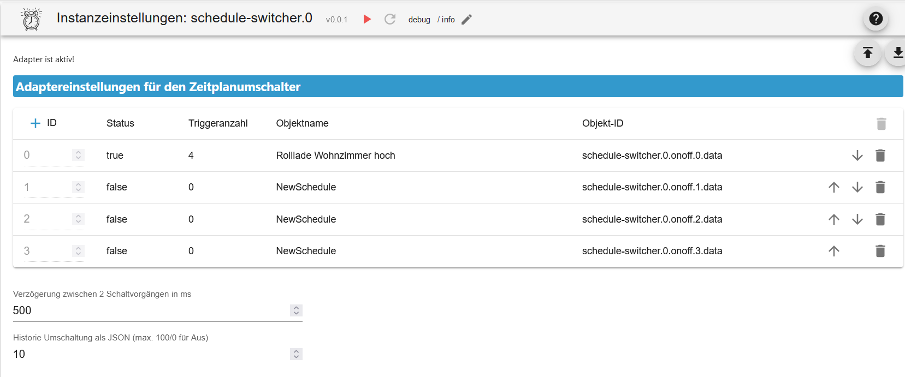
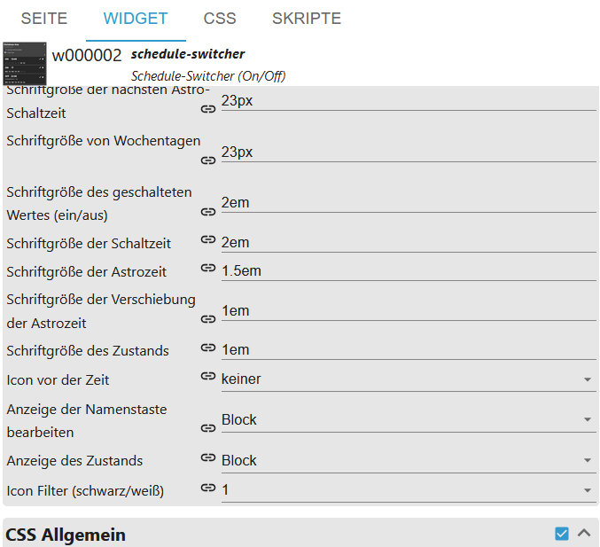
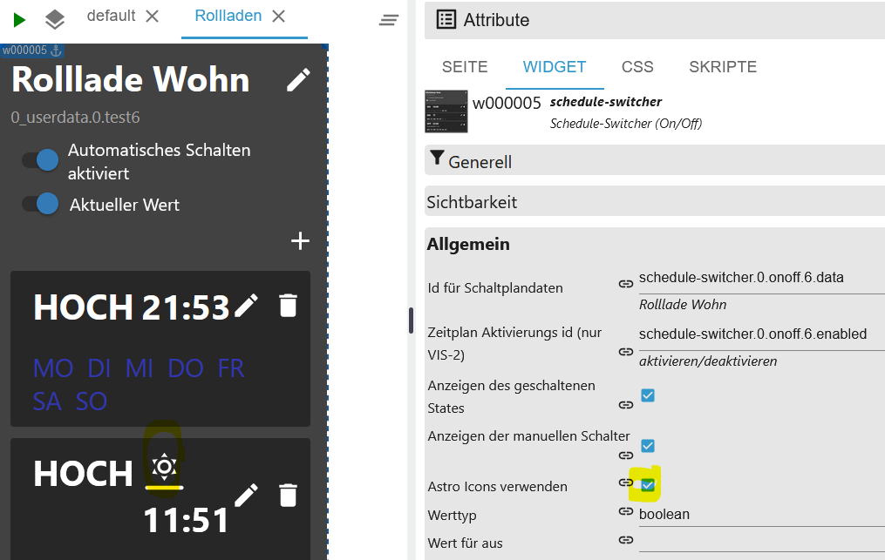
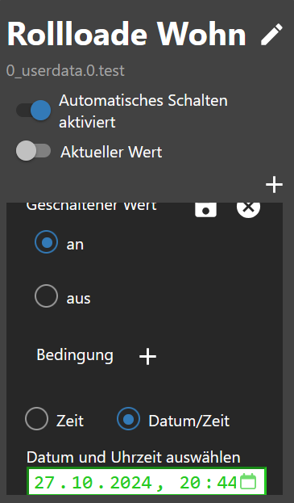
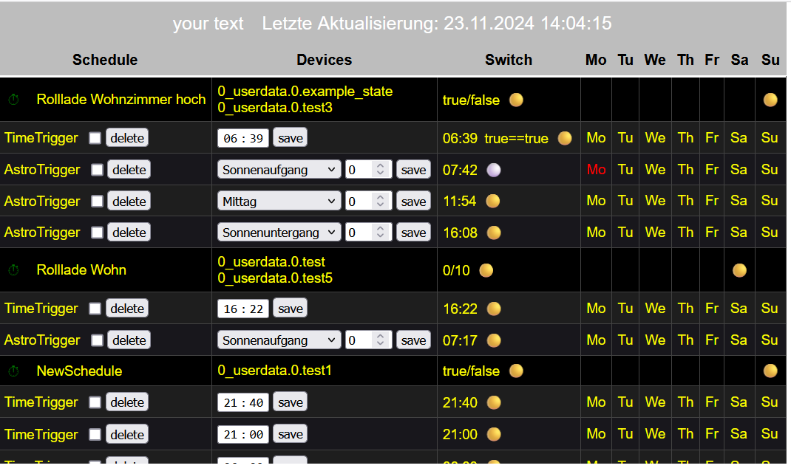

# IoBroker.schedule-switcher
[返回自述文件](/README.md)

＃ 介绍
该适配器允许用户使用时间表或 100/0 打开/关闭设备。
可以通过 Vis 或 Vis 2 小部件完全配置时间表。
计划会更改一个或多个 ioBroker 状态，并由一个或多个触发器组成，用于定义何时以及如何更改状态。
您可以配置触发器触发的时间和星期几。还可以创建天文触发器或倒计时。

＃ 概括
- [实例设置](#instance-setting-schedule-switcher)
- [对象](#states)
- [JSON 格式的触发事件示例](#example-triggerevents-json)
- [JSON 格式的触发器示例](#example-trigger-json)
- [sendTo 触发器示例（仅限专家）](#example-trigger-with-sendto-create-or-edit-experts)
- [JSON 格式的小部件示例](#example-widgets-json)
- [JSON 格式的历史记录示例](#example-history-json)
- [创建小部件](#create-widget)
- [更改名称](#change-name)
- [添加条件](#condition-add)
- [替换文本](#replace-text)
- [CSS 设置](#css-apply-description-see-css)
- [创建触发器](#trigger)
- [创建 astrotrigger](#astro-trigger)
- [创建一次性触发器](#one-time-trigger)
- [HTML 设置](#html-for-vis-and-vis-2)
- [仅限 HTML 函数 VIS-2](#function-only-for-vis-2)
- [CSS](#css)

### 实例设置计划切换器
[概括](#zusammenfassung)

- `+ 号`: 添加新时间表
- `Schematic Data Id`: 创建的对象
- `Name`: 小部件的名称
- `触发器数量`：触发器数量
- `活动`: 活动
- `删除`: 删除日程表
- `两次切换操作之间的延迟（毫秒）`：防止同时设置状态
- `历史记录切换为 JSON（最大 100/0 为关闭）` 最大。存储历史记录
- `为 VIS 和 VIS-2 创建 HTML（VIS-2 参见说明）` 激活 HTML 概述



### 州
[概括](#zusammenfassung)

- 开关
- `schedule-switcher.0.onoff.6.data` 所有触发器都为 JSON
- `schedule-switcher.0.onoff.6.enabled` 激活或未激活
- `schedule-switcher.0.onoff.6.views` 为对象创建的小部件在哪里
- 地位
- `schedule-switcher.0.counterTrigger` 触发器数量（活动和非活动）
- `schedule-switcher.0.history` 切换历史记录
- `schedule-switcher.0.nextEvents` 下一个切换事件作为 JSON 表
- `schedule-switcher.0.sendto` 在 VIS-2 中，更改通过此对象传递给适配器


# 触发事件 JSON 示例
[概括](#zusammenfassung)

```json
[
    {
        "type": "TimeTrigger", // TimeTrigger, AstroTrigger oder OneTimeTrigger
        "name": "Rollloade Wohn", // Name
        "triggerid": 0, // Trigger ID
        "action": "OnOffStateAction", // OnOffStateAction oder Condition
        "states": ["0_userdata.0.test", "0_userdata.0.test5"], // States
        "active": true, // enabled true oder false
        "hour": 16, // Stunde
        "minute": 22, // Minute
        "day": 9, // Tag
        "dateISO": "2024-11-09T15:22:00.000Z", // Zeit ohne Zeitzone
        "timestamp": 1731165720000, // Timestamp ohne Zeitzone
        "objectId": 1 // ObejektId schedule-switcher.0.onoff.<objectid>.data
    }
]
```

# 触发器 JSON 示例
[概括](#zusammenfassung)

```json
{
    "type": "OnOffSchedule",
    "name": "Rolllade Wohn", // Name vom letzten erstellte Widget
    "active": false, // Alle 24h wird geprüft, ob es ein Widget gibt. Wird keins gefunden wird der Zeitplan deaktiviert. Mit TRUE wird nicht deaktiviert.
    "onAction": {
        // Action für On
        "type": "OnOffStateAction",
        "valueType": "number",
        "onValue": 0,
        "offValue": 100,
        "booleanValue": true,
        "idsOfStatesToSet": ["0_userdata.0.test4"] // States max. 10
    },
    "offAction": {
        // Action für Off
        "type": "OnOffStateAction",
        "valueType": "number",
        "onValue": 0,
        "offValue": 100,
        "booleanValue": false,
        "idsOfStatesToSet": ["0_userdata.0.test4"] // States max. 10
    },
    "triggers": [
        {
            "type": "AstroTrigger", // Trigger - AstroTrigger - OneTimeTrigger
            "astroTime": "sunrise",
            "shiftInMinutes": 0,
            "weekdays": [1, 2, 3, 4, 5, 6],
            "id": "0",
            "action": {
                "type": "ConditionAction",
                "condition": {
                    "type": "StringStateAndConstantCondition",
                    "constant": "true",
                    "stateId": "0_userdata.0.test",
                    "sign": "=="
                },
                "action": {
                    "type": "OnOffStateAction",
                    "name": "On"
                }
            }
        }
    ]
}
```

# 示例小部件 JSON
[概括](#zusammenfassung)

```json
{
    "vis-2.0": {
        // Welche VIS Version
        "main": {
            // Projekt
            "w000005": {
                // Widget ID
                "prefix": "main", // Projekt
                "namespace": "vis-2.0", // Welche VIS Version
                "view": "Rollladen", // Welche View
                "widgetId": "w000005", // Widget ID
                "newId": "schedule-switcher.0.onoff.6.data", // Neues Objekt
                "oldId": "timer-switch.0.onoff.1.data", // Altes Objekt
                "enabled": "schedule-switcher.0.onoff.6.enabled", // Enabled Objekt
                "stateCount": 1, // Counter Zustände
                "state": [
                    // Zustände
                    {
                        "oid-stateId1": "0_userdata.0.test5"
                    }
                ],
                "conditionCount": 1, // Counter Bedingung
                "condition": [
                    // Zustände Bedingungen
                    {
                        "oid-conditionStateId1": "0_userdata.0.test"
                    }
                ]
            },
            "w000006": {
                // Widget ID
                "prefix": "main", // Projekt
                "namespace": "vis-2.0", // Welche VIS Version
                "view": "Test", // Welche View
                "widgetId": "w000006", // Widget ID
                "newId": "schedule-switcher.0.onoff.6.data", // Neues Objekt
                "oldId": "timer-switch.0.onoff.1.data", // Altes Objekt
                "enabled": "schedule-switcher.0.onoff.6.enabled", // Enabled Objekt
                "stateCount": 1, // Counter Zustände
                "state": [
                    // Zustände
                    {
                        "oid-stateId1": "0_userdata.0.test4"
                    }
                ],
                "conditionCount": 1, // Counter Bedingung
                "condition": [] // Zustände Bedingungen
            }
        }
    }
}
```

# 使用 sendTo 创建或编辑示例触发器（专家）
[概括](#zusammenfassung)

```JSON
sendTo("schedule-switcher.0", "add-trigger", { // Neuen Auslöser anlegen
    "dataId":"schedule-switcher.0.onoff.6.data",
    "triggerType":"TimeTrigger",
    "actionType":"OnOffStateAction"
});

sendTo("schedule-switcher.0", "update-trigger", { // Aktion für den neuen Auslöser festlegen
    "dataId":"schedule-switcher.0.onoff.6.data",
    "trigger":{
        "type":"TimeTrigger",
        "hour":12,
        "minute":32,
        "weekdays":[1,2,3,4,5],
        "id":"0", // ID abgleichen
        "action":{
            "type":"OnOffStateAction",
            "name":"On"
        }
    }
});

sendTo("schedule-switcher.0", "add-trigger", { // Neuen Astrotrigger anlegen
    "dataId":"schedule-switcher.0.onoff.6.data",
    "triggerType":"AstroTrigger",
    "actionType":"OnOffStateAction"
});

sendTo("schedule-switcher.0", "update-trigger", { // Aktion für den neuen Auslöser festlegen
    "dataId":"schedule-switcher.0.onoff.6.data",
    "trigger":{
        "type":"AstroTrigger",
        "astroTime":"sunrise", // sunrise, sunset or solarNoon
        "shiftInMinutes":0,
        "weekdays":[1,2,3,4,5],
        "id":"0", // ID abgleichen
        "action":{
            "type":"OnOffStateAction",
            "name":"On"
        }
    }
});

sendTo("schedule-switcher.0", "disable-schedule", { // Auslöser deaktivieren
    "dataId":"schedule-switcher.0.onoff.6.data"
});

sendTo("schedule-switcher.0", "enable-schedule", { // Auslöser aktivieren
    "dataId":"schedule-switcher.0.onoff.6.data"
});

sendTo("schedule-switcher.0", "add-one-time-trigger", { // Einmalauslöser anlegen
    "dataId":"schedule-switcher.0.onoff.6.data",
    "trigger":"{\"type\":\"OneTimeTrigger\",\"date\":\"2024-10-17T06:14:22.660Z\",\"timedate\":false,\"action\":{\"type\":\"OnOffStateAction\",\"name\":\"On\"}}"
});

sendTo("schedule-switcher.0", "delete-trigger", { // Auslöser mit bekannter ID löschen
    "dataId":"schedule-switcher.0.onoff.6.data",
    "triggerId":"0"
});

sendTo("schedule-switcher.0", "change-active", { // Zeitplan ohne Widget aktiv lassen (wird bei restart oder alle 24h geprüft)
    "dataId":"schedule-switcher.0.onoff.6.data",
    "active":false, // false: Automatische Deaktivierung wenn kein Widget vorhanden ist
});

sendTo("schedule-switcher.0", "change-active", { // Zeitplan ohne Widget aktiv lassen (wird bei restart oder alle 24h geprüft)
    "dataId":"schedule-switcher.0.onoff.6.data",
    "active":true, // true: Zeitplan wird nicht deaktiviert wenn kein Widget vorhanden ist
});
```

# 历史记录 JSON 示例
[概括](#zusammenfassung)

```JSON
[
  {
    "setObjectId": "0_userdata.0.test4",
    "objectId": 0,
    "value": "true",
    "object": "0_userdata.0.test4",
    "trigger": "TimeTrigger",
    "astroTime": "unknown",
    "shift": 0,
    "date": 0,
    "hour": 20,
    "minute": 48,
    "weekdays": [
      [
        1,
        2,
        3,
        4,
        5,
        6,
        0
      ]
    ],
    "time": 1729622880040
  },
  {
    "setObjectId": "0_userdata.0.test4",
    "objectId": 0,
    "value": "true",
    "object": "0_userdata.0.test4",
    "astroTime": "unknown",
    "shift": 0,
    "date": 0,
    "hour": 20,
    "minute": 47,
    "weekdays": [
      [
        1,
        2,
        3,
        4,
        5,
        6,
        0
      ]
    ],
    "time": 1729622820071
  }
]
```

# 示例小部件视图 JSON
[概括](#zusammenfassung)

```json
{
    "vis-2.0": {
        "main": {
            "w000004": {
                "prefix": "main", // Projekt
                "namespace": "vis-2.0", // VIS
                "view": "default", // View
                "widgetId": "w000004", // Widget ID
                "newId": "schedule-switcher.0.onoff.3.data" // Objekt ID
            }
        }
    },
    "vis.0": {
        "main": {
            "w00001": {
                "prefix": "main",
                "namespace": "vis.0",
                "view": "Rollo",
                "widgetId": "w00001",
                "newId": "schedule-switcher.0.onoff.3.data"
            }
        }
    }
}
```

### 创建小部件
[概括](#zusammenfassung)

- 将小部件插入视图


- 选择原理图数据的ID
- 选择计划激活ID
- 选择切换状态的ID（最多10个）


- 指定值的类型以及要设置的值


- 现在创建电路图


### 更改名称
[概括](#zusammenfassung)

- 更改名称 - 也将在对象中采用


### 添加条件
[概括](#zusammenfassung)

- 建立条件。


### 替换文本
[概括](#zusammenfassung)

- 更改文本的打开/关闭以及全部打开/全部关闭


### 应用 CSS [描述见css](#css)
[概括](#zusammenfassung)

- 使用 CSS 自定义样式</br>

</br> </br> </br> </br> </br> </br> </br> </br> 

＃＃＃ 扳机
[概括](#zusammenfassung)

- 点击笔输入时间或点击垃圾桶删除触发器


- 选择切换状态
- 选择条件（可选）
- 输入时间（时:分）

```:warning:
 ⚠ Zeigt in Firefox kein Uhrzeit-Feld an!
```


- 选择工作日
- 点击右上角的保存


- 完全的


### 天文触发器
[概括](#zusammenfassung)

- 点击笔选择天文时间或点击垃圾桶删除触发器


- 选择切换状态
- 选择条件（可选）
- 选择天文时间（日出、日落或中午）


- 输入偏移量（分钟）（可选）
- 选择工作日
- 点击右上角的保存


- 完全的


### 一次性触发器
[概括](#zusammenfassung)

- 选择切换状态
- 选择条件（可选）
- 输入时间（时：分：秒）
- 点击右上角的保存


- 完全的


- 选择切换状态
- 选择条件（可选）
- 输入/选择时间（日.月.年 时:分:秒）
- 点击右上角的保存

```:warning:
 ⚠ Zeigt in Firefox kein Uhrzeit-Feld an!
```



- 完全的


### VIS 和 VIS-2 的 HTML
[概括](#zusammenfassung)

- `html.background_color_body` 主体的背景颜色。对于完全 VIS 和仅适用于 VIS-2 的小部件 - 标准 #000000
- `html.background_color_even` 背景颜色触发偶数 - 默认 #1E1E1E
- `html.background_color_odd` 背景颜色触发奇数 - 默认 #18171C
- `html.background_color_trigger` 触发器对象的背景颜色 - 默认 #000000
- `html.background_color_weekdays_hover` 鼠标悬停在工作日上时的背景颜色 - 点击启用/禁用 - 默认蓝色
- `html.column_align_01` 标题文本对齐方式第 1 列 - 标准居中
- `html.column_align_02` 标题文本对齐方式第 2 列 - 标准居中
- `html.column_align_03` 标题文本对齐方式第 3 列 - 标准居中
- `html.column_align_04` 标题文本对齐方式第 4 列 - 标准居中
- `html.column_align_05` 标题文本对齐方式第 5 列 - 标准居中
- `html.column_align_06` 标题文本对齐方式第 6 列 - 标准居中
- `html.column_align_07` 标题文本对齐方式第 7 列 - 标准居中
- `html.column_align_08` 标题文本对齐方式第 8 列 - 标准居中
- `html.column_align_09` 标题文本对齐方式第 9 列 - 标准居中
- `html.column_align_10` 标题文本对齐方式第 10 列 - 标准居中
- `html.column_text_01` 标题文本第 1 列 - 标准时间表
- `html.column_text_02` 标题文本第 2 列 - 标准设备
- `html.column_text_03` 标题文本第 3 列 - 标准开关
- `html.column_text_04` 标题文本第 4 列 - 标准模式
- `html.column_text_05` 标题文本第 5 列 - 标准 Tu
- `html.column_text_06` 标题文本第 6 列 - 标准我们
- `html.column_text_07` 标题文本第 7 列 - 标准
- `html.column_text_08` 标题文本第 8 列 - 标准 Fr
- `html.column_text_09` 标题文本第 9 列 - 标准 Sa
- `html.column_text_10` 标题文本第 10 列 - 标准 Su
- `html.column_width_01` 第 1 列的宽度 - 默认自动
- `html.column_width_02` 第 2 列的宽度 - 默认自动
- `html.column_width_03` 第 3 列的宽度 - 默认自动
- `html.column_width_04` 第 4 列的宽度 - 默认自动
- `html.column_width_05` 第 5 列的宽度 - 默认为自动
- `html.column_width_06` 第 6 列的宽度 - 默认自动
- `html.column_width_07` 第 7 列的宽度 - 默认为自动
- `html.column_width_08` 列宽 8 - 默认自动
- `html.column_width_09` 第 9 列的宽度 - 默认为自动
- `html.column_width_70` 列宽 10 - 默认自动
- `html.font_color_text_disabled` 禁用对象的文本颜色 - 默认红色
- `html.font_color_text_enabled` 激活对象的文本颜色 - 默认黄色
- `html.font_color_weekdays_disabled` 禁用工作日的文本颜色 - 默认红色
- `html.font_color_weekdays_enabled` 启用工作日的文本颜色 - 默认黄色
- `html.header_border` 头部边距（像素）- 默认 2
- `html.header_font_family` 标题字体系列 - 标准 Helvetica
- `html.header_font_size` 标题字体大小 - 默认 15
- `html.header_linear_color_1` 标题背景图像：线性渐变 1 - 默认 #BDBDBD
- `html.header_linear_color_2` 标题背景图像：线性渐变 2 - 默认 #BDBDBD
- `html.header_tag_border_color` 标题 HTML 标签`<td> ` 边框颜色 - 默认#424242
- `html.header_width` 头标签`<table> ` 尺寸标准车
- `html.column_align_row_01` 第 1 列的行文本对齐方式 - 默认左对齐
- `html.column_align_row_02` 第 2 列的行文本对齐方式 - 默认左对齐
- `html.column_align_row_03` 第 3 列的文本对齐方式 - 默认左对齐
- `html.column_align_row_04` 第 4 列的文本对齐方式 - 默认左对齐
- `html.column_align_row_05` 第 5 列的行文本对齐方式 - 默认左对齐
- `html.column_align_row_06` 第 6 列的行文本对齐方式 - 默认左对齐
- `html.column_align_row_07` 第 7 列的文本对齐方式 - 默认左对齐
- `html.column_align_row_08` 第 8 列的文本对齐方式 - 默认左对齐
- `html.column_align_row_09` 第 9 列的文本对齐方式 - 默认左对齐
- `html.column_align_row_10` 第 10 列的文本对齐方式 - 默认左对齐
- `html.headline_color` 标题字体颜色（时间表、设备......） - 默认#ffffff
- `html.headline_font_size` 标题字体大小（像素）- 默认 16
- `html.headline_height` 标题行高度（像素）- 默认 35
- `html.headline_underlined` 页眉底部边距（以像素为单位）- 默认 3
- `html.headline_underlined_color` 标题底部边框颜色 - 默认 #ffffff
- `html.headline_weight` 标题字体粗细 - 默认正常
- `html.html_code` VIS、VIS-2、Jarvis、IQontrol 等的 HTML 代码。
- `html.icon_false` 图标切换状态关闭 - 标准 ⚪
- `html.icon_switch_symbol` 图标开关用于启用/禁用计时器 - 默认 ⏱
- `html.icon_true` 图标切换状态开启 - 标准 🟡
- `html.jarvis` 与 Jarvis 兼容 - 默认为 false
-`html.p_tag_text_algin` HTML`<p> ` 文本对齐方式（上次更新和页脚） - 默认居中
- `html.table_tag_border_color` 标签的边框颜色 `<table> ` - 默认 #424242
- `html.table_tag_cell` 边框与 TAG 的偏移量<table>` 以像素为单位 - 默认 6
- `html.table_tag_text_align` 标签的文本对齐方式 `<table> ` - 标准中心
- `html.table_tag_width` 标签的大小 `<table> ` - 标准自动
- `html.td_tag_border_bottom` 标签底部的边框`<td> ` 以像素为单位 - 默认 1
- `html.td_tag_border_color` 标签下方的边框颜色`<td> ` - 默认 #424242
- `html.td_tag_border_right` 标签右侧的边框`<td> ` 以像素为单位 - 默认 1
- `html.td_tag_cell` 标签文本周围的空间`<td> ` 以像素为单位（填充） - 默认 6
- `html.top_font_family` 页眉和页脚的字体系列 - 标准 Helvetica
- `html.top_font_size` 页眉和页脚的字体大小（以像素为单位）- 默认 20
- `html.top_font_weight` 页眉和页脚的字体粗细 - 默认正常”
- `html.top_text` 标题的自定义文本 - 默认文本
- `html.top_text_color` 页眉和页脚的字体颜色 - 默认#ffffff
- `html.update` 开始手动更新


- 创建一个 HTML 小部件，并在 HTML 下输入对象 `{schedule-switcher.0.html.html_code}`
- 点击文本“上次更新”执行手动更新
- 点击图标即可激活/停用小部件
- 要删除触发器，您必须先选中该框，然后按“删除”按钮
- 更改时间/天文，然后按“保存”按钮应用更改
- 点击星期几即可激活/停用它
- 在触发器名称行中，下一个事件的开启/关闭显示在工作日下



### 仅适用于 VIS-2 的功能!!!
[概括](#zusammenfassung)

不幸的是，只有 VIS-2 才必须手动插入下面列出的功能（见图片）


```java
function deleteTrigger(stateId, command, id, dataid, count) {
    var checked = document.getElementById('delete' + count).checked;
    if (checked) {
        var data = {
			"command": command,
			"message": {
				"triggerId": id,
				"dataId": dataid,
			}
		};
		vis.conn.setState(stateId + '.sendto', { val: JSON.stringify(data), ack: false });
	}
}
function changeweekdays(stateId, command, dataid, id, changeid, type) {
    if (type === "OneTimeTrigger") return;
    var data = {
		"command": command,
		"message": {
			"changeid": changeid,
			"triggerid": id,
			"dataid": dataid
		}
    };
	vis.conn.setState(stateId + '.sendto', { val: JSON.stringify(data), ack: false });
}
function updateTrigger(stateId) {
	vis.conn.setState(stateId + '.html.update', { val: true, ack: false });
}
function setState(stateId, value) {
	vis.conn.setState(stateId, { val: value == 'false' ? false : true, ack: false });
}
function sendToAstro(stateId, command, dataid, id, count) {
    var timeselect = document.getElementById('timeselect' + count).value;
    var shift = document.getElementById('shift' + count).value;
    var data = {
		"command": command,
		"message": {
			"astrotime": timeselect,
			"shift": shift,
			"triggerid": id,
			"dataid": dataid
		}
    };
	vis.conn.setState(stateId + '.sendto', { val: JSON.stringify(data), ack: false });
}
function sendToDateTime(stateId, command, id, dataid, count) {
    var value = document.getElementById('datetime' + count).value;
    var data = {
		"command": command,
		"message": {
			"time": value,
			"triggerid": id,
			"dataid": dataid
		}
    };
	vis.conn.setState(stateId + '.sendto', { val: JSON.stringify(data), ack: false });
}
function sendToTime(stateId, command, id, dataid, count) {
    var value = document.getElementById('nexttime' + count).value;
    var data = {
		"command": command,
		"message": {
			"time": value,
			"triggerid": id,
			"dataid": dataid
		}
    };
	vis.conn.setState(stateId + '.sendto', { val: JSON.stringify(data), ack: false });
}
```

### CSS
[概括](#zusammenfassung)

```
app-on-off-schedules-widget {
    /* Primary color (button background, toggle switch color) */
    --ts-widget-primary-color: #337ab7;

    /* Background color of the widget */
    --ts-widget-bg-color: #424242;
    /* Background color of the triggers */
    --ts-widget-trigger-bg-color: #272727;

    /* Foreground color (font color and scrollbar color) */
    --ts-widget-fg-color: white;
    /* Font color of the switched states id */
    --ts-widget-oid-fg-color: #a5a5a5;
    /* Font color in buttons */
    --ts-widget-btn-fg-color: white;
    /* Font color of a disabled weekday */
    --ts-widget-weekdays-disabled-fg-color: #5D5D5D;
    /* Font color of an enabled weekday */
    --ts-widget-weekdays-enabled-fg-color: white;
    /* Font color of the name of the widget (defaults to --ts-widget-fg-color) */
    --ts-widget-name-fg-color: white;
    /* Font color of switched time (defaults to --ts-widget-fg-color) */
    --ts-widget-switched-time-fg-color: white;
    /* Font color of switched value (defaults to --ts-widget-fg-color)*/
    --ts-widget-switched-value-fg-color: white;
    /* Font color of the astro time (defaults to --ts-widget-fg-color) */
    --ts-widget-astro-time-fg-color: black;
    /* Font color of the astro time's shift */
    --ts-widget-astro-shift-fg-color: #5d5d5d;
    /* Font color of condition (defaults to --ts-widget-fg-color) */
    --ts-widget-condition-fg-color: white;
    /* Font color of toogle button off */
    --ts-widget-off-color: #c0c0c0;
    /* Color background toogle button off */
    --ts-widget-off-color-container: #808080;
    /* Color of next astro switching time */
    --ts-widget-astro-next-fg-color: white;

    /* Font family used in the whole widget */
    --ts-widget-font-family: 'Roboto', 'Segoe UI', BlinkMacSystemFont, system-ui, -apple-system;
    /* Font size of the name of the widget */
    --ts-widget-name-font-size: 2em;
    /* Font size of the switched oid */
    --ts-widget-oid-font-size: 30px;
    /* Font size of switch text */
    --ts-widget-state-action-width: 65px;
    /* Font size of next astro switching time */
    --ts-widget-astro-next-font-size: 2em;
    /* Width of date time input */
    --ts-widget-datetime-width: 230px;

    /* Display of edit name button. Use 'none' to hide the button and 'block' to show it
    --ts-widget-edit-name-button-display: block;
    /* Display of condition. Use 'none' to hide the condition and 'block' to show it
    -ts-widget-condition-display: block;
    /* Display of time icon. Use 'none' to hide the button and 'block' to show it
    --ts-widget-time-icon-display: none;

    /* Applies a filter to icons used in buttons (safe, edit, remove, cancel), for
       white use invert(1) and for black invert(0) */
    --ts-widget-img-btn-filter: invert(1);

    /* Add trigger dropdown background color */
    --ts-widget-add-trigger-dropdown-bg-color: #f1f1f1;
    /* Add trigger dropdown font color */
    --ts-widget-add-trigger-dropdown-fg-color: black;
    /* Add trigger dropdown hover background color */
    --ts-widget-add-trigger-dropdown-hover-bg-color: #ddd;

    /* ! Changing these may break the layout, change at your own risk */

    /* Font size of weekdays */
    --ts-widget-weekdays-font-size: 23px;
    /* Font size of switched value (on/off) */
    --ts-widget-switched-value-font-size: 2em;
    /* Font size of switched time */
    --ts-widget-switched-time-font-size: 2em;
    /* Font size of the astro time (e.g. Sunrise, ...) */
    --ts-widget-astro-time-font-size: 1.5em;
    /* Font size of the astro time's shift */
    --ts-widget-astro-shift-font-size: 1em;
    /* Font size of condition */
    --ts-widget-condition-font-size: 1em;
}
```

## Changelog

<!--
    Placeholder for the next version (at the beginning of the line):
    ### **WORK IN PROGRESS**
-->

### **WORK IN PROGRESS**

- (Lucky-ESA) Admin 7.4.10 required

### 0.0.10 (2025-02-11)

- (Lucky-ESA) Dependencies updated
- (Lucky-ESA) Fixed: In the HTML overview, enabled / disabled does not work
- (Lucky-ESA) Fixed: Astrotime incorrectly
- (Lucky-ESA) Added: Current day in font weight bold

### 0.0.9 (2024-12-20)

- (Lucky-ESA) Fixed: Reading files from Redis database
- (Lucky-ESA) Added: Automatic deactivation control
- (Lucky-ESA) Fixed: Visibility
- (Lucky-ESA) Fixed: Bug in type check

### 0.0.8 (2024-12-07)

- (Lucky-ESA) Migration to ESLint9
- (Lucky-ESA) Bugfixes

### 0.0.7 (2024-11-26)

- (Lucky_ESA) HTML overview added

### 0.0.6 (2024-11-16)

- (Lucky_ESA) Put value of state correctly
- (Lucky_ESA) Added next triggers as JSON
- (Lucky_ESA) Added counter trigger
- (Lucky_ESA) Updating astro time fixed

## License

MIT License

Copyright (c) 2024-2025 Lucky_ESA <github@luckyskills.de>

Permission is hereby granted, free of charge, to any person obtaining a copy
of this software and associated documentation files (the "Software"), to deal
in the Software without restriction, including without limitation the rights
to use, copy, modify, merge, publish, distribute, sublicense, and/or sell
copies of the Software, and to permit persons to whom the Software is
furnished to do so, subject to the following conditions:

The above copyright notice and this permission notice shall be included in all
copies or substantial portions of the Software.

THE SOFTWARE IS PROVIDED "AS IS", WITHOUT WARRANTY OF ANY KIND, EXPRESS OR
IMPLIED, INCLUDING BUT NOT LIMITED TO THE WARRANTIES OF MERCHANTABILITY,
FITNESS FOR A PARTICULAR PURPOSE AND NONINFRINGEMENT. IN NO EVENT SHALL THE
AUTHORS OR COPYRIGHT HOLDERS BE LIABLE FOR ANY CLAIM, DAMAGES OR OTHER
LIABILITY, WHETHER IN AN ACTION OF CONTRACT, TORT OR OTHERWISE, ARISING FROM,
OUT OF OR IN CONNECTION WITH THE SOFTWARE OR THE USE OR OTHER DEALINGS IN THE
SOFTWARE.