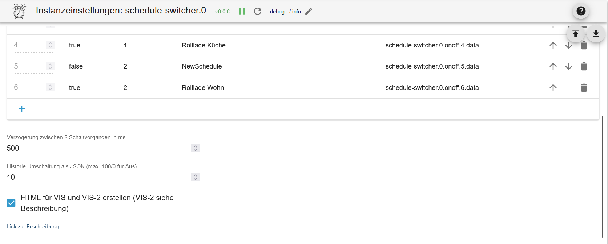
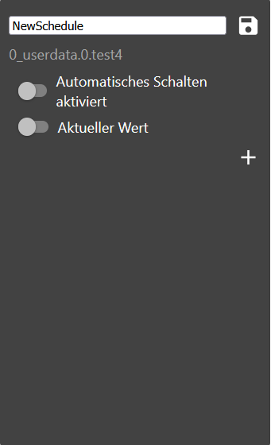

# IoBroker.schedule-switcher
[返回自述文件](/README.md)

＃ 介绍
此适配器允许用户通过定时任务来控制设备的开关。

定时任务可以通过 Vis 或 Vis 2 小部件进行全面配置。

一个定时任务可以切换一个或多个 ioBroker 状态，并包含一个或多个触发器，用于定义状态何时以及如何改变。

您可以配置触发器触发的时间和星期几。此外，还可以创建星象触发器和倒计时。

＃ 概括
- [实例设置](#instance-setting-schedule-switcher)
- [对象](#状态)
- [示例触发事件 JSON 格式](#example-triggerevents-json)
- [JSON 格式的触发器示例](#example-trigger-json)
- [仅针对专家的示例 sendTo 触发器](#example-trigger-with-sendto-create-or-edit-experts)
- [示例小部件的 JSON 格式](#example-widgets-json)
- [JSON 格式的历史记录示例](#example-history-json)
- [创建小部件](#create-widget)
- [更改名称](#name-change)
- [添加条件](#add-condition)
- [替换文本](#replace-text)
- [CSS 设置](#css-apply-description-see-css)
- [创建触发器](#trigger)
- [创建星象触发器](#astro-trigger)
- [创建一次性触发器](#one-time-trigger)
- [天文图标](#astro-icons)
- [小部件概述](#html-overview-of-widgets)
- [HTML 设置](#html-for-vis-and-vis-2)
- [HTML 函数仅限 VIS-2](#function-only-for-vis-2)
- [CSS](#css)

### 实例设置调度切换器
[概括](#zusammenfassung)

- `+ 号`：添加新日程
- `原理图数据 ID`：已创建的对象
- `名称`：小部件的名称
- `触发器数量`：触发器数量
- `Active`：活跃
- `删除`：删除日程安排
- `两次切换操作之间的延迟（毫秒）`：防止同时设置状态
- `切换历史记录（JSON 格式，最大值 100，0 表示关闭）` 历史记录最大存储量
- 为 VIS 和 VIS-2 创建 HTML（VIS-2 参见说明）激活 HTML 概述

</br> 

### 各州
[概括](#zusammenfassung)

- 开/关
- `schedule-switcher.0.onoff.6.data` 所有触发器均为 JSON 格式
- `schedule-switcher.0.onoff.6.enabled` 已启用或未启用
- `schedule-switcher.0.onoff.6.views` 这些对象的组件是在哪里创建的？
- 地位
- `schedule-switcher.0.counterTrigger` 触发器数量（活动和非活动）
- `schedule-switcher.0.history` 电路历史记录
- `schedule-switcher.0.nextEvents` 下一个切换操作以 JSON 表的形式呈现
- `schedule-switcher.0.sendto` 在 VIS-2 中，更改通过此对象传递给适配器。
- `schedule-switcher.0.widgetOverview` 所有组件概览，用于查找错误


# 示例触发事件 JSON
[概括](#zusammenfassung)

```json
[
    {
        "type": "TimeTrigger", // TimeTrigger, AstroTrigger oder OneTimeTrigger
        "name": "Rollloade Wohn", // Name
        "triggerid": 0, // Trigger ID
        "action": "OnOffStateAction", // OnOffStateAction oder Condition
        "states": ["0_userdata.0.test", "0_userdata.0.test5"], // States
        "active": true, // enabled true oder false
        "hour": 16, // Stunde
        "minute": 22, // Minute
        "day": 6, // Tag
        "valueCheck": false, // States vergleichen
        "dateISO": "2024-11-09T15:22:00.000Z", // Zeit ohne Zeitzone
        "timestamp": 1731165720000, // Timestamp ohne Zeitzone
        "objectId": 1 // ObejektId schedule-switcher.0.onoff.<objectid>.data
    }
]
```

# 示例 JSON 触发器
[概括](#zusammenfassung)

```json
{
    "type": "OnOffSchedule",
    "name": "Rolllade Wohn", // Name vom letzten erstellte Widget
    "active": false, // Alle 24h wird geprüft, ob es ein Widget gibt. Wird keins gefunden wird der Zeitplan deaktiviert. Mit TRUE wird nicht deaktiviert.
    "onAction": {
        // Action für On
        "type": "OnOffStateAction",
        "valueType": "number",
        "onValue": 0,
        "offValue": 100,
        "booleanValue": true,
        "idsOfStatesToSet": ["0_userdata.0.test4"] // States max. 10
    },
    "offAction": {
        // Action für Off
        "type": "OnOffStateAction",
        "valueType": "number",
        "onValue": 0,
        "offValue": 100,
        "booleanValue": false,
        "idsOfStatesToSet": ["0_userdata.0.test4"] // States max. 10
    },
    "triggers": [
        {
            "type": "AstroTrigger", // Trigger - AstroTrigger - OneTimeTrigger
            "astroTime": "sunrise",
            "shiftInMinutes": 0,
            "weekdays": [1, 2, 3, 4, 5, 6],
            "valueCheck": false,
            "id": "0",
            "action": {
                "type": "ConditionAction",
                "condition": {
                    "type": "StringStateAndConstantCondition",
                    "constant": "true",
                    "stateId": "0_userdata.0.test",
                    "sign": "=="
                },
                "action": {
                    "type": "OnOffStateAction",
                    "name": "On"
                }
            }
        }
    ]
}
```

# 示例小部件 JSON
[概括](#zusammenfassung)

```json
{
    "vis-2.0": {
        // Welche VIS Version
        "main": {
            // Projekt
            "w000005": {
                // Widget ID
                "prefix": "main", // Projekt
                "namespace": "vis-2.0", // Welche VIS Version
                "view": "Rollladen", // Welche View
                "widgetId": "w000005", // Widget ID
                "newId": "schedule-switcher.0.onoff.6.data", // Neues Objekt
                "oldId": "timer-switch.0.onoff.1.data", // Altes Objekt
                "enabled": "schedule-switcher.0.onoff.6.enabled", // Enabled Objekt
                "stateCount": 1, // Counter Zustände
                "state": [
                    // Zustände
                    {
                        "oid-stateId1": "0_userdata.0.test5"
                    }
                ],
                "conditionCount": 1, // Counter Bedingung
                "condition": [
                    // Zustände Bedingungen
                    {
                        "oid-conditionStateId1": "0_userdata.0.test"
                    }
                ],
                "valueType": "number", // Wertetyp
                "offValue": "100", // Wert für An - Fehlt wenn nicht gesetzt
                "onValue": "0", // Wert für Aus - Fehlt wenn nicht gesetzt
                "newOff": "Hoch", // Ersetzt AN - Fehlt wenn nicht gesetzt
                "newOn": "Runter" // Ersetzt AUS - Fehlt wenn nicht gesetzt
            },
            "w000006": {
                // Widget ID
                "prefix": "main", // Projekt
                "namespace": "vis-2.0", // Welche VIS Version
                "view": "Test", // Welche View
                "widgetId": "w000006", // Widget ID
                "newId": "schedule-switcher.0.onoff.6.data", // Neues Objekt
                "oldId": "timer-switch.0.onoff.1.data", // Altes Objekt
                "enabled": "schedule-switcher.0.onoff.6.enabled", // Enabled Objekt
                "stateCount": 1, // Counter Zustände
                "state": [
                    // Zustände
                    {
                        "oid-stateId1": "0_userdata.0.test4"
                    }
                ],
                "conditionCount": 1, // Counter Bedingung
                "condition": [], // Zustände Bedingungen
                "valueType": "boolean" // Wertetyp
            }
        }
    }
}
```

# 示例：创建或编辑带有 sendTo 的触发器（专家）
[概括](#zusammenfassung)

```JSON
sendTo("schedule-switcher.0", "add-trigger", { // Neuen Auslöser anlegen
    "dataId":"schedule-switcher.0.onoff.6.data",
    "triggerType":"TimeTrigger",
    "actionType":"OnOffStateAction"
});

sendTo("schedule-switcher.0", "update-trigger", { // Aktion für den neuen Auslöser festlegen
    "dataId":"schedule-switcher.0.onoff.6.data",
    "trigger":{
        "type":"TimeTrigger",
        "hour":12,
        "minute":32,
        "weekdays":[1,2,3,4,5],
        "valueCheck": false,
        "id":"0", // ID abgleichen
        "action":{
            "type":"OnOffStateAction",
            "name":"On"
        }
    }
});

sendTo("schedule-switcher.0", "add-trigger", { // Neuen Astrotrigger anlegen
    "dataId":"schedule-switcher.0.onoff.6.data",
    "triggerType":"AstroTrigger",
    "actionType":"OnOffStateAction"
});

sendTo("schedule-switcher.0", "update-trigger", { // Aktion für den neuen Auslöser festlegen
    "dataId":"schedule-switcher.0.onoff.6.data",
    "trigger":{
        "type":"AstroTrigger",
        "astroTime":"sunrise", // sunrise, sunset or solarNoon
        "shiftInMinutes":0,
        "weekdays":[1,2,3,4,5],
        "valueCheck": false,
        "id":"0", // ID abgleichen
        "action":{
            "type":"OnOffStateAction",
            "name":"On"
        }
    }
});

sendTo("schedule-switcher.0", "disable-schedule", { // Auslöser deaktivieren
    "dataId":"schedule-switcher.0.onoff.6.data"
});

sendTo("schedule-switcher.0", "enable-schedule", { // Auslöser aktivieren
    "dataId":"schedule-switcher.0.onoff.6.data"
});

sendTo("schedule-switcher.0", "add-one-time-trigger", { // Einmalauslöser anlegen
    "dataId":"schedule-switcher.0.onoff.6.data",
    "trigger":"{\"type\":\"OneTimeTrigger\",\"date\":\"2024-10-17T06:14:22.660Z\",\"valueCheck\": false,\"timedate\":false,\"action\":{\"type\":\"OnOffStateAction\",\"name\":\"On\"}}"
});

sendTo("schedule-switcher.0", "delete-trigger", { // Auslöser mit bekannter ID löschen
    "dataId":"schedule-switcher.0.onoff.6.data",
    "triggerId":"0"
});

sendTo("schedule-switcher.0", "change-active", { // Zeitplan ohne Widget aktiv lassen (wird bei restart oder alle 24h geprüft)
    "dataId":"schedule-switcher.0.onoff.6.data",
    "active":false, // false: Automatische Deaktivierung wenn kein Widget vorhanden ist
});

sendTo("schedule-switcher.0", "change-active", { // Zeitplan ohne Widget aktiv lassen (wird bei restart oder alle 24h geprüft)
    "dataId":"schedule-switcher.0.onoff.6.data",
    "active":true, // true: Zeitplan wird nicht deaktiviert wenn kein Widget vorhanden ist
});
```

# 示例历史记录 JSON
[概括](#zusammenfassung)

```JSON
[
  {
    "setObjectId": "0_userdata.0.test4",
    "objectId": 0,
    "actualValue": true,
    "oldValue": false,
    "checkValue": false,
    "object": "0_userdata.0.test4",
    "trigger": "TimeTrigger",
    "astroTime": "unknown",
    "shiftInMinutes": 0,
    "date": 0,
    "hour": 20,
    "minute": 48,
    "weekdays": [
      [
        1,
        2,
        3,
        4,
        5,
        6,
        0
      ]
    ],
    "timestamp": 1761384780017,
    "dateTime": "2025-10-25T09:33:00.017Z",
    "dateTimeWithTimezone": "2025-10-25T11:33:00.017Z"
  },
  {
    "setObjectId": "0_userdata.0.test4",
    "objectId": 0,
    "actualValue": true,
    "oldValue": false,
    "checkValue": false,
    "object": "0_userdata.0.test4",
    "astroTime": "unknown",
    "shiftInMinutes": 0,
    "date": 0,
    "hour": 20,
    "minute": 47,
    "weekdays": [
      [
        1,
        2,
        3,
        4,
        5,
        6,
        0
      ]
    ],
    "timestamp": 1761383520527,
    "dateTime": "2025-10-25T09:12:00.527Z",
    "dateTimeWithTimezone": "2025-10-25T11:12:00.527Z"
  }
]
```

# 示例小部件视图 JSON
[概括](#zusammenfassung)

```json
{
    "vis-2.0": {
        "main": {
            "w000004": {
                "prefix": "main", // Projekt
                "namespace": "vis-2.0", // VIS
                "view": "default", // View
                "widgetId": "w000004", // Widget ID
                "newId": "schedule-switcher.0.onoff.3.data" // Objekt ID
            }
        }
    },
    "vis.0": {
        "main": {
            "w00001": {
                "prefix": "main",
                "namespace": "vis.0",
                "view": "Rollo",
                "widgetId": "w00001",
                "newId": "schedule-switcher.0.onoff.3.data"
            }
        }
    }
}
```

### 创建小部件
[概括](#zusammenfassung)

- 将小部件插入视图


- 选择原理图数据的 ID
- 选择计划激活 ID
- 选择切换状态的 ID（最多 10 个）


- 定义值类型和要设置的值


现在绘制电路图


### 更改名称
[概括](#zusammenfassung)

- 更改名称 - 此操作也将应用于对象。



### 添加条件
[概括](#zusammenfassung)

- 设定条件。


### 替换文本
[概括](#zusammenfassung)

- 更改文本开启/关闭和所有功能开启/关闭

 

### 应用 CSS [请参阅 CSS 以了解详情](#css)
[概括](#zusammenfassung)

- 使用 CSS 自定义样式</br>

</br> </br> </br> </br> </br> </br> </br> </br> 

＃＃＃ 扳机
[概括](#zusammenfassung)

- 点击铅笔图标输入时间，或点击垃圾桶图标删除触发器。


- 选择切换状态
- 选择条件（可选）
- 仅当值不等于某个值时才设置该值。
- 请输入时间（时:分）

```:warning:
 ⚠ Zeigt in Firefox kein Uhrzeit-Feld an!
```


- 选择星期几
点击右上角的“保存”按钮


- 完全的


### 星体触发器
[概括](#zusammenfassung)

- 点击铅笔图标选择天文时间，或点击垃圾桶图标删除触发器。


- 选择切换状态
- 选择条件（可选）
- 仅当值不等于某个值时才设置该值。
- 选择天文时间（日出、日落或正午）


- 输入偏移量（以分钟为单位）（可选）
- 选择星期几
点击右上角的“保存”按钮


- 完全的


### 星象图标
[概括](#zusammenfassung)

| 图标 | 描述 |
| --------------------------------------------------------------------------------- | ------------- |
|  | 日出 |
|  | 日落 |
|  | 日出结束 |
|  | goldenHourEnd |
|  | 黄金时刻 |
|  | 日落开始 |
|  | 黄昏 |
|  | 航海黄昏 |
|  | 夜晚 |
|  | 最低点 |
|  | 夜晚结束 |
|  | nauticalDawn |
|  | 黎明 |
|  | 黎明 |

### 一次性触发器
[概括](#zusammenfassung)

- 选择切换状态
- 选择条件（可选）
- 仅当值不等于某个值时才设置该值。
- 请输入时间（时:分:秒）
点击右上角的“保存”按钮


- 完全的


- 选择切换状态
- 选择条件（可选）
- 仅当值不等于某个值时才设置该值。
- 输入/选择时间（日.月.年 时:分:秒）
点击右上角的“保存”按钮

```:warning:
 ⚠ Zeigt in Firefox kein Uhrzeit-Feld an!
```

</br> 

- 完全的


### HTML 小部件概述
[概括](#summary)


### VIS 和 VIS-2 的 HTML
[概括](#zusammenfassung)

- `html.background_color_body` body 元素的背景颜色。对于 VIS 版本，此颜色应用于整个 body 元素；对于 VIS-2 版本，此颜色仅适用于该元素本身 - 默认值为 #000000
- `html.background_color_even` 偶数背景颜色触发器 - 默认值 #1E1E1E
- `html.background_color_odd` 背景颜色触发奇数 - 默认值 #18171C
- `html.background_color_trigger` 背景颜色触发对象 - 默认值 #000000
- `html.background_color_weekdays_hover` 鼠标悬停在工作日上时的背景颜色 - 点击激活/关闭 - 默认蓝色
- `html.column_align_01` 列标题文本对齐方式（第 1 列） - 默认居中
- `html.column_align_02` 列标题文本对齐方式（第 2 列） - 默认居中
- `html.column_align_03` 列标题文本对齐方式（第 3 列） - 默认居中
- `html.column_align_04` 第 4 列标题文本对齐方式 - 默认居中
- `html.column_align_05` 第 5 列标题文本对齐方式 - 默认居中
- `html.column_align_06` 列标题文本对齐方式（第 6 列） - 默认居中
- `html.column_align_07` 第 7 列标题文本对齐方式 - 默认居中
- `html.column_align_08` 第 8 列标题文本对齐方式 - 默认居中
- `html.column_align_09` 列标题文本对齐方式（第 9 列） - 默认居中
- `html.column_align_10` 标题文本对齐方式，第 10 列 - 默认居中
- `html.column_text_01` 标题文本列 1 - 标准日程
- `html.column_text_02` 标题文本列 2 - 标准设备
- `html.column_text_03` 标题文本列 3 - 标准开关
- `html.column_text_04` 标题文本列 4 - 标准 Mon
- `html.column_text_05` 标题文本列 5 - 标准 Tu
- `html.column_text_06` 标题文本列 6 - 标准 我们
- `html.column_text_07` 标题文本列 7 - 标准 Th
- `html.column_text_08` 标题文本列 8 - 标准星期五
- `html.column_text_09` 标题文本列 9 - 标准 Sa
- `html.column_text_10` 标题文本列 10 - 标准 Su
- `html.column_width_01` 列宽 1 - 默认值 自动
- `html.column_width_02` 列宽 2 - 默认值：自动
- `html.column_width_03` 列宽 3 - 默认值：自动
- `html.column_width_04` 列宽 4 - 默认值：自动
- `html.column_width_05` 列宽 5 - 默认值：自动
- `html.column_width_06` 列宽 6 - 默认值：自动
- `html.column_width_07` 列宽 7 - 默认值：自动
- `html.column_width_08` 列宽 8 - 默认值：自动
- `html.column_width_09` 列宽 9 - 默认值：自动
- `html.column_width_70` 列宽 10 - 默认值 自动
- `html.font_color_text_disabled` 禁用对象的文本颜色 - 默认为红色
- `html.font_color_text_enabled` 激活对象的文本颜色 - 默认为黄色
- `html.font_color_weekdays_disabled` 禁用工作日的文本颜色 - 默认为红色
- `html.font_color_weekdays_enabled` 启用工作日的文本颜色 - 默认为黄色
- `html.header_border` 头部边距（像素）- 默认值 2
- `html.header_font_family` 标题字体系列 - 默认 Helvetica
- `html.header_font_size` 头部字体大小 - 默认值 15
- `html.header_linear_color_1` 头部背景图像：线性渐变 1 - 默认值 #BDBDBD
- `html.header_linear_color_2` 头部背景图像：线性渐变 2 - 默认值 #BDBDBD
- `html.header_tag_border_color` 头部 HTML 标签`<td>边框颜色 - 默认值 #424242
- `html.header_width` head 标签`<table>标准汽车尺寸
- `html.column_align_row_01` 第 1 列的行文本对齐方式 - 默认为左对齐
- `html.column_align_row_02` 第 2 列的行文本对齐方式 - 默认为左对齐
- `html.column_align_row_03` 第 3 列的行对齐方式 - 默认为左对齐
- `html.column_align_row_04` 第 4 列的行文本对齐方式 - 默认为左对齐
- `html.column_align_row_05` 第 5 列的行对齐方式 - 默认为左对齐
- `html.column_align_row_06` 第 6 列的行文本对齐方式 - 默认为左对齐
- `html.column_align_row_07` 第 7 列的行对齐方式 - 默认为左对齐
- `html.column_align_row_08` 第 8 列的文本对齐方式 - 默认为左对齐
- `html.column_align_row_09` 第 9 列的行对齐方式 - 默认为左对齐
- `html.column_align_row_10` 第 10 列的行对齐方式 - 默认为左对齐
- `html.headline_color` 标题字体颜色（日程安排、设备等）- 默认值 #ffffff
- `html.headline_font_size` 标题字体大小（像素） - 默认值：16
- `html.headline_height` 标题行高度（像素） - 默认值 35
- `html.headline_underlined` 头部底部边距（像素）- 默认值 3
- `html.headline_underlined_color` 头部底部边框颜色 - 默认值 #ffffff
- `html.headline_weight` 标题字体粗细 - 标准正常
- `html.html_code` VIS、VIS-2、Jarvis、IQontrol 等的 HTML 代码。
- `html.icon_false` 图标开关状态关闭 - 默认值 ⚪
- `html.icon_state_check_no` 状态比较已禁用 🔴
- 已启用 `html.icon_state_check_yes` 状态比较 🟢
- `html.icon_switch_symbol` 图标开关，用于激活/停用计时器 - 默认值 ⏱
- `html.icon_true` 图标切换状态开启 - 默认 🟡
- `html.jarvis` 与 Jarvis 兼容 - 默认值：false
- `html.p_tag_text_algin` HTML `<p>文本对齐方式（最后更新时间和页脚）- 默认居中
- `html.table_tag_border_color` 标签的边框颜色<table>- 标准 #424242
- `html.table_tag_cell` 边界距离标签 `<table>以像素为单位 - 标准 6
- `html.table_tag_text_align` 标签的文本对齐方式<table>- 标准中心
- `html.table_tag_width` 标签的大小<table>- 标准自动
- `html.td_tag_border_bottom` 标签的底部边缘<td>以像素为单位 - 标准 1
- `html.td_tag_border_color` 标签的底部边框颜色<td>- 标准 #424242
- `html.td_tag_border_right` 标签右侧的边框<td>以像素为单位 - 标准 1
- `html.td_tag_cell` 标签文本周围的空格<td>以像素为单位（内边距）- 默认值为 6
- `html.top_font_family` 字体系列用于页眉和页脚 - 标准 Helvetica
- `html.top_font_size` 头部和尾部的字体大小（以像素为单位） - 默认值：20
- `html.top_font_weight` 头部和尾部的字体粗细 - 默认值：正常”
- `html.top_text` 自定义页眉文本 - 默认文本
- `html.top_text_color` 头部和尾部的字体颜色 - 默认值 #ffffff
- `html.update` 开始手动更新


- 创建一个 HTML 小部件，并在 HTML 下输入对象 `{schedule-switcher.0.html.html_code}`。
- 点击“上次更新时间”文本进行手动更新。
- 点击图标即可激活/停用小部件。
- 要删除触发器，必须先选中一个复选框，然后按“删除”按钮。
- 更改时间/天文时间，然后按“保存”按钮应用更改。
- 点击星期几即可激活/停用。
- 触发器名称行显示下一个事件在工作日的开启/关闭状态。


### 此功能仅适用于 VIS-2！！！
[概括](#zusammenfassung)

只有 VIS-2 才需要手动插入下列功能（见图）。

</br> 

```java
function deleteTrigger(stateId, command, id, dataid, count) {
    var checked = document.getElementById('delete' + count).checked;
    if (checked) {
        var data = {
			"command": command,
			"message": {
				"triggerId": id,
				"dataId": dataid,
			}
		};
		vis.conn.setState(stateId + '.sendto', { val: JSON.stringify(data), ack: false });
	}
}
function changeweekdays(stateId, command, dataid, id, changeid, type) {
    if (type === "OneTimeTrigger") return;
    var data = {
		"command": command,
		"message": {
			"changeid": changeid,
			"triggerid": id,
			"dataid": dataid
		}
    };
	vis.conn.setState(stateId + '.sendto', { val: JSON.stringify(data), ack: false });
}
function changeValueCheck(stateId, command, dataid, id, value) {
    var data = {
		"command": command,
		"message": {
            "changeval": value,
            "triggerid": id,
            "dataid": dataid
		}
    };
    vis.conn.setState(stateId + '.sendto', { val: JSON.stringify(data), ack: false });
}
function updateTrigger(stateId) {
	vis.conn.setState(stateId + '.html.update', { val: true, ack: false });
}
function setState(stateId, value) {
	vis.conn.setState(stateId, { val: value == 'false' ? false : true, ack: false });
}
function sendToAstro(stateId, command, dataid, id, count) {
    var timeselect = document.getElementById('timeselect' + count).value;
    var shift = document.getElementById('shift' + count).value;
    var data = {
		"command": command,
		"message": {
			"astrotime": timeselect,
			"shift": shift,
			"triggerid": id,
			"dataid": dataid
		}
    };
	vis.conn.setState(stateId + '.sendto', { val: JSON.stringify(data), ack: false });
}
function sendToDateTime(stateId, command, id, dataid, count) {
    var value = document.getElementById('datetime' + count).value;
    var data = {
		"command": command,
		"message": {
			"time": value,
			"triggerid": id,
			"dataid": dataid
		}
    };
	vis.conn.setState(stateId + '.sendto', { val: JSON.stringify(data), ack: false });
}
function sendToTime(stateId, command, id, dataid, count) {
    var value = document.getElementById('nexttime' + count).value;
    var data = {
		"command": command,
		"message": {
			"time": value,
			"triggerid": id,
			"dataid": dataid
		}
    };
	vis.conn.setState(stateId + '.sendto', { val: JSON.stringify(data), ack: false });
}
```

### CSS
[概括](#zusammenfassung)

```
app-on-off-schedules-widget {
    /* Primary color (button background, toggle switch color) */
    --ts-widget-primary-color: #337ab7;

    /* Background color of the widget */
    --ts-widget-bg-color: #424242;
    /* Background color of the triggers */
    --ts-widget-trigger-bg-color: #272727;

    /* Foreground color (font color and scrollbar color) */
    --ts-widget-fg-color: white;
    /* Font color of the switched states id */
    --ts-widget-oid-fg-color: #a5a5a5;
    /* Font color in buttons */
    --ts-widget-btn-fg-color: white;
    /* Font color of a disabled weekday */
    --ts-widget-weekdays-disabled-fg-color: #5D5D5D;
    /* Font color of an enabled weekday */
    --ts-widget-weekdays-enabled-fg-color: white;
    /* Font color of the name of the widget (defaults to --ts-widget-fg-color) */
    --ts-widget-name-fg-color: white;
    /* Font color of switched time (defaults to --ts-widget-fg-color) */
    --ts-widget-switched-time-fg-color: white;
    /* Font color of switched value (defaults to --ts-widget-fg-color)*/
    --ts-widget-switched-value-fg-color: white;
    /* Font color of the astro time (defaults to --ts-widget-fg-color) */
    --ts-widget-astro-time-fg-color: black;
    /* Font color of the astro time's shift */
    --ts-widget-astro-shift-fg-color: #5d5d5d;
    /* Font color of condition (defaults to --ts-widget-fg-color) */
    --ts-widget-condition-fg-color: white;
    /* Font color of toogle button off */
    --ts-widget-off-color: #c0c0c0;
    /* Color background toogle button off */
    --ts-widget-off-color-container: #808080;
    /* Color of next astro switching time */
    --ts-widget-astro-next-fg-color: white;

    /* Font family used in the whole widget */
    --ts-widget-font-family: 'Roboto', 'Segoe UI', BlinkMacSystemFont, system-ui, -apple-system;
    /* Font size of the name of the widget */
    --ts-widget-name-font-size: 2em;
    /* Font size of the switched oid */
    --ts-widget-oid-font-size: 30px;
    /* Font size of switch text */
    --ts-widget-state-action-width: 65px;
    /* Font size of next astro switching time */
    --ts-widget-astro-next-font-size: 2em;
    /* Width of date time input */
    --ts-widget-datetime-width: 230px;

    /* Display of edit name button. Use 'none' to hide the button and 'block' to show it
    --ts-widget-edit-name-button-display: block;
    /* Display of condition. Use 'none' to hide the condition and 'block' to show it
    -ts-widget-condition-display: block;
    /* Display of time icon. Use 'none' to hide the button and 'block' to show it
    --ts-widget-time-icon-display: none;

    /* Applies a filter to icons used in buttons (safe, edit, remove, cancel), for
       white use invert(1) and for black invert(0) */
    --ts-widget-img-btn-filter: invert(1);

    /* Add trigger dropdown background color */
    --ts-widget-add-trigger-dropdown-bg-color: #f1f1f1;
    /* Add trigger dropdown font color */
    --ts-widget-add-trigger-dropdown-fg-color: black;
    /* Add trigger dropdown hover background color */
    --ts-widget-add-trigger-dropdown-hover-bg-color: #ddd;

    /* ! Changing these may break the layout, change at your own risk */

    /* Font size of weekdays */
    --ts-widget-weekdays-font-size: 23px;
    /* Font size of switched value (on/off) */
    --ts-widget-switched-value-font-size: 2em;
    /* Font size of switched time */
    --ts-widget-switched-time-font-size: 2em;
    /* Font size of the astro time (e.g. Sunrise, ...) */
    --ts-widget-astro-time-font-size: 1.5em;
    /* Font size of the astro time's shift */
    --ts-widget-astro-shift-font-size: 1em;
    /* Font size of condition */
    --ts-widget-condition-font-size: 1em;
}
```

## Changelog

<!--
    Placeholder for the next version (at the beginning of the line):
    ### **WORK IN PROGRESS**
-->

### **WORK IN PROGRESS**

- (Lucky-ESA) Fixed warn log (Cannot read dir...)
- (Lucky-ESA) Added state comparison enabled/disabled
- (Lucky-ESA) Fixed small some bugs
- (Lucky-ESA) History JSON changed

### 0.0.12 (2025-08-27)

- (Lucky-ESA) Astro time in widget fixed

### 0.0.11 (2025-08-16)

- (Lucky-ESA) Admin 7.6.17 required
- (Lucky-ESA) Node 20 required

### 0.0.10 (2025-02-11)

- (Lucky-ESA) Dependencies updated
- (Lucky-ESA) Fixed: In the HTML overview, enabled / disabled does not work
- (Lucky-ESA) Fixed: Astrotime incorrectly
- (Lucky-ESA) Added: Current day in font weight bold

### 0.0.9 (2024-12-20)

- (Lucky-ESA) Fixed: Reading files from Redis database
- (Lucky-ESA) Added: Automatic deactivation control
- (Lucky-ESA) Fixed: Visibility
- (Lucky-ESA) Fixed: Bug in type check

### 0.0.8 (2024-12-07)

- (Lucky-ESA) Migration to ESLint9
- (Lucky-ESA) Bugfixes

## License

MIT License

Copyright (c) 2024-2025 Lucky_ESA <github@luckyskills.de>

Permission is hereby granted, free of charge, to any person obtaining a copy
of this software and associated documentation files (the "Software"), to deal
in the Software without restriction, including without limitation the rights
to use, copy, modify, merge, publish, distribute, sublicense, and/or sell
copies of the Software, and to permit persons to whom the Software is
furnished to do so, subject to the following conditions:

The above copyright notice and this permission notice shall be included in all
copies or substantial portions of the Software.

THE SOFTWARE IS PROVIDED "AS IS", WITHOUT WARRANTY OF ANY KIND, EXPRESS OR
IMPLIED, INCLUDING BUT NOT LIMITED TO THE WARRANTIES OF MERCHANTABILITY,
FITNESS FOR A PARTICULAR PURPOSE AND NONINFRINGEMENT. IN NO EVENT SHALL THE
AUTHORS OR COPYRIGHT HOLDERS BE LIABLE FOR ANY CLAIM, DAMAGES OR OTHER
LIABILITY, WHETHER IN AN ACTION OF CONTRACT, TORT OR OTHERWISE, ARISING FROM,
OUT OF OR IN CONNECTION WITH THE SOFTWARE OR THE USE OR OTHER DEALINGS IN THE
SOFTWARE.