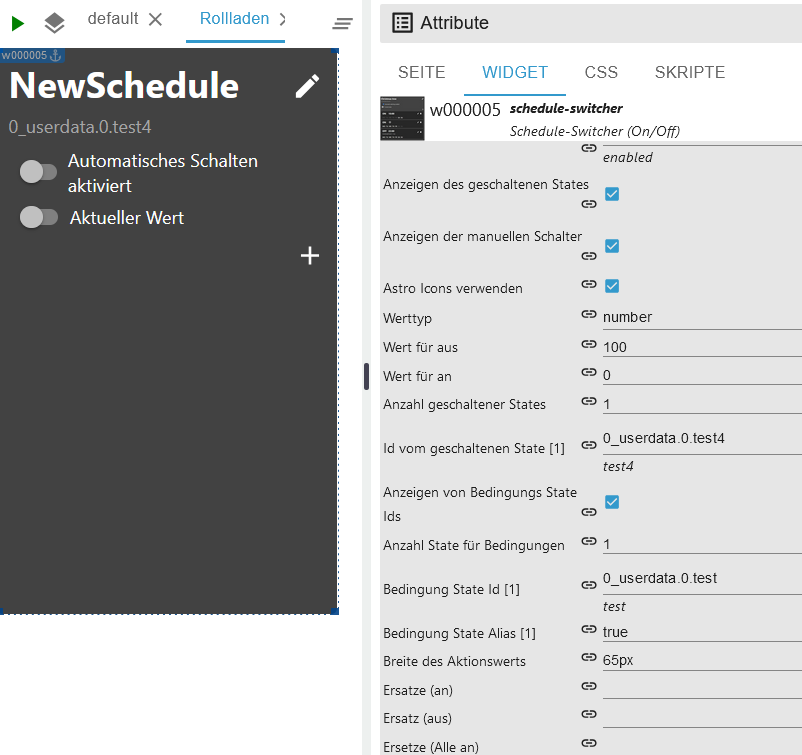
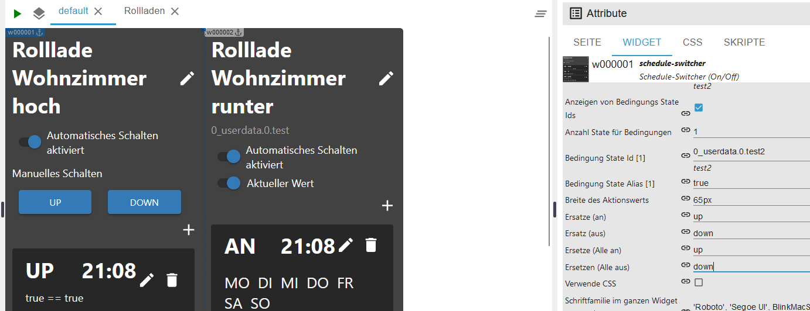
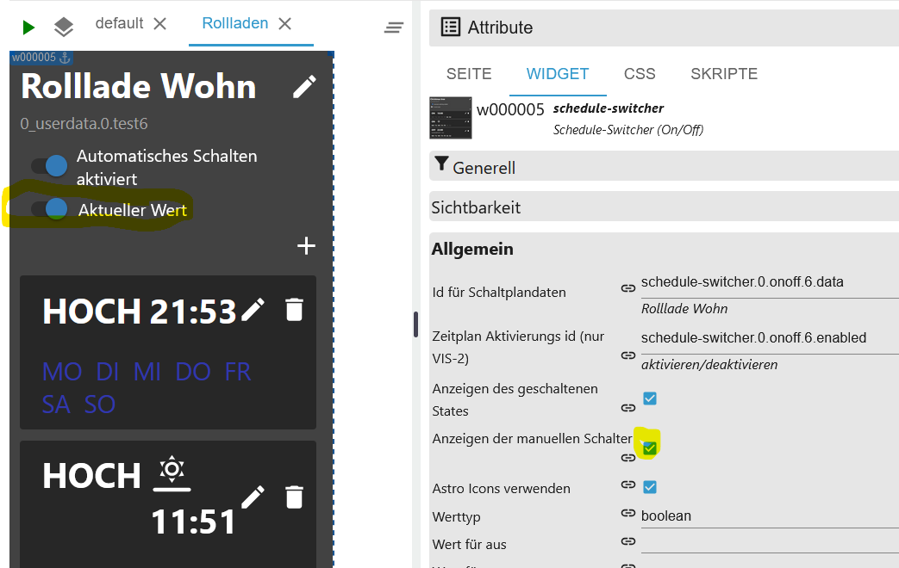
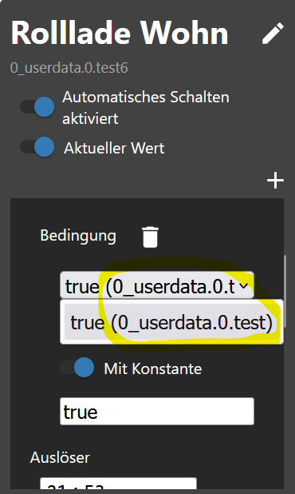
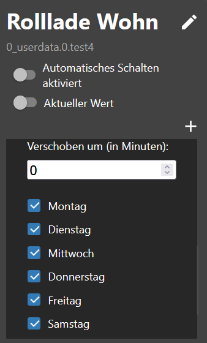

# IoBroker.schedule-switcher
[返回自述文件](/README.md)

＃ 介绍
该适配器允许用户使用时间表或 100/0 打开/关闭设备。
时间表可以通过 Vis 或 Vis 2 小部件完全配置。
调度会更改一个或多个 ioBroker 状态，并由一个或多个触发器组成，这些触发器定义何时以及如何更改状态。
可以配置在一周中的什么时间和哪几天触发触发器。还可以创建 Astro 触发器或倒计时。

＃ 概括
- [实例设置](#instance-setting-schedule-switcher)
- [对象](#states)
- [JSON 格式的触发事件示例](#example-triggerevents-json)
- [JSON 触发器示例](#example-trigger-json)
- [示例 sendTo 仅触发专家](#example-trigger-with-sendto-create-or-edit-experts)
- [JSON 格式的小部件示例](#example-widgets-json)
- [JSON 历史记录示例](#example-history-json)
- [创建小部件](#创建小部件)
- [更改名称](#更改名称)
- [添加条件](#condition-add)
- [替换文本](#text-replace)
- [CSS 设置](#css-apply-description-see-css)
- [创建触发器](#trigger)
- [创建 Astrotrigger](#astro-trigger)
- [创建一次性触发器](#one-time-trigger)
- [CSS](#css)

### 实例设置schedule-switcher
[概括](#zusammenfassung)

- `+号`：添加新时间表
- `原理图数据 Id`：创建的对象
- `Name`：小部件的名称
- `触发器数量`：触发器数量
- `活跃`：活跃
- `删除`：删除日程
- `2 个切换过程之间的延迟（以毫秒为单位）`：防止同时设置状态
- `历史记录切换为 JSON（最大 100/0 表示关闭）` 历史记录最大存储量

    

###州
[概括](#zusammenfassung)

- 开关
- `schedule-switcher.0.onoff.6.data` 所有触发器均采用 JSON 格式
- `schedule-switcher.0.onoff.6.enabled` 活动或非活动
- `schedule-switcher.0.onoff.6.views` 为对象创建小部件的位置
- 地位
- `schedule-switcher.0.counterTrigger` 触发器数量（活动和非活动）
- `schedule-switcher.0.history` 电路的历史
- `schedule-switcher.0.nextEvents` 下一个切换事件作为 JSON 表
- `schedule-switcher.0.sendto` 使用 VIS-2，更改通过此对象传递到适配器


# 触发事件 JSON 示例
[概括](#zusammenfassung)

```json
[
    {
        "type": "TimeTrigger", // TimeTrigger, AstroTrigger oder OneTimeTrigger
        "name": "Rollloade Wohn", // Name
        "triggerid": 0, // Trigger ID
        "action": "OnOffStateAction", // OnOffStateAction oder Condition
        "states": ["0_userdata.0.test", "0_userdata.0.test5"], // States
        "active": true, // enabled true oder false
        "hour": 16, // Stunde
        "minute": 22, // Minute
        "day": 9, // Tag
        "dateISO": "2024-11-09T15:22:00.000Z", // Zeit ohne Zeitzone
        "timestamp": 1731165720000, // Timestamp ohne Zeitzone
        "objectId": 1 // ObejektId schedule-switcher.0.onoff.<objectid>.data
    }
]
```

# 触发 JSON 示例
[概括](#zusammenfassung)

```json
{
    "type": "OnOffSchedule",
    "name": "Rolllade Wohn", // Name vom letzten erstellte Widget
    "onAction": {
        // Action für On
        "type": "OnOffStateAction",
        "valueType": "number",
        "onValue": 0,
        "offValue": 100,
        "booleanValue": true,
        "idsOfStatesToSet": ["0_userdata.0.test4"] // States max. 10
    },
    "offAction": {
        // Action für Off
        "type": "OnOffStateAction",
        "valueType": "number",
        "onValue": 0,
        "offValue": 100,
        "booleanValue": false,
        "idsOfStatesToSet": ["0_userdata.0.test4"] // States max. 10
    },
    "triggers": [
        {
            "type": "AstroTrigger", // Trigger - AstroTrigger - OneTimeTrigger
            "astroTime": "sunrise",
            "shiftInMinutes": 0,
            "weekdays": [1, 2, 3, 4, 5, 6],
            "id": "0",
            "action": {
                "type": "ConditionAction",
                "condition": {
                    "type": "StringStateAndConstantCondition",
                    "constant": "true",
                    "stateId": "0_userdata.0.test",
                    "sign": "=="
                },
                "action": {
                    "type": "OnOffStateAction",
                    "name": "On"
                }
            }
        }
    ]
}
```

# 示例小部件 JSON
[概括](#zusammenfassung)

```json
{
    "vis-2.0": {
        // Welche VIS Version
        "main": {
            // Projekt
            "w000005": {
                // Widget ID
                "prefix": "main", // Projekt
                "namespace": "vis-2.0", // Welche VIS Version
                "view": "Rollladen", // Welche View
                "widgetId": "w000005", // Widget ID
                "newId": "schedule-switcher.0.onoff.6.data", // Neues Objekt
                "oldId": "timer-switch.0.onoff.1.data", // Altes Objekt
                "enabled": "schedule-switcher.0.onoff.6.enabled", // Enabled Objekt
                "stateCount": 1, // Counter Zustände
                "state": [
                    // Zustände
                    {
                        "oid-stateId1": "0_userdata.0.test5"
                    }
                ],
                "conditionCount": 1, // Counter Bedingung
                "condition": [
                    // Zustände Bedingungen
                    {
                        "oid-conditionStateId1": "0_userdata.0.test"
                    }
                ]
            },
            "w000006": {
                // Widget ID
                "prefix": "main", // Projekt
                "namespace": "vis-2.0", // Welche VIS Version
                "view": "Test", // Welche View
                "widgetId": "w000006", // Widget ID
                "newId": "schedule-switcher.0.onoff.6.data", // Neues Objekt
                "oldId": "timer-switch.0.onoff.1.data", // Altes Objekt
                "enabled": "schedule-switcher.0.onoff.6.enabled", // Enabled Objekt
                "stateCount": 1, // Counter Zustände
                "state": [
                    // Zustände
                    {
                        "oid-stateId1": "0_userdata.0.test4"
                    }
                ],
                "conditionCount": 1, // Counter Bedingung
                "condition": [] // Zustände Bedingungen
            }
        }
    }
}
```

# 使用 sendTo 创建或编辑触发器的示例（专家）
[概括](#zusammenfassung)

```JSON
sendTo("schedule-switcher.0", "add-trigger", { // Neuen Auslöser anlegen
    "dataId":"schedule-switcher.0.onoff.6.data",
    "triggerType":"TimeTrigger",
    "actionType":"OnOffStateAction"
});

sendTo("schedule-switcher.0", "update-trigger", { // Aktion für den neuen Auslöser festlegen
    "dataId":"schedule-switcher.0.onoff.6.data",
    "trigger":{
        "type":"TimeTrigger",
        "hour":12,
        "minute":32,
        "weekdays":[1,2,3,4,5],
        "id":"0", // ID abgleichen
        "action":{
            "type":"OnOffStateAction",
            "name":"On"
        }
    }
});

sendTo("schedule-switcher.0", "add-trigger", { // Neuen Astrotrigger anlegen
    "dataId":"schedule-switcher.0.onoff.6.data",
    "triggerType":"AstroTrigger",
    "actionType":"OnOffStateAction"
});

sendTo("schedule-switcher.0", "update-trigger", { // Aktion für den neuen Auslöser festlegen
    "dataId":"schedule-switcher.0.onoff.6.data",
    "trigger":{
        "type":"AstroTrigger",
        "astroTime":"sunrise", // sunrise, sunset or solarNoon
        "shiftInMinutes":0,
        "weekdays":[1,2,3,4,5],
        "id":"0", // ID abgleichen
        "action":{
            "type":"OnOffStateAction",
            "name":"On"
        }
    }
});

sendTo("schedule-switcher.0", "disable-schedule", { // Auslöser deaktivieren
    "dataId":"schedule-switcher.0.onoff.6.data"
});

sendTo("schedule-switcher.0", "enable-schedule", { // Auslöser aktivieren
    "dataId":"schedule-switcher.0.onoff.6.data"
});

sendTo("schedule-switcher.0", "add-one-time-trigger", { // Einmalauslöser anlegen
    "dataId":"schedule-switcher.0.onoff.6.data",
    "trigger":"{\"type\":\"OneTimeTrigger\",\"date\":\"2024-10-17T06:14:22.660Z\",\"timedate\":false,\"action\":{\"type\":\"OnOffStateAction\",\"name\":\"On\"}}"
});

sendTo("schedule-switcher.0", "delete-trigger", { // Auslöser mit bekannter ID löschen
    "dataId":"schedule-switcher.0.onoff.6.data",
    "triggerId":"0"
});
```

# 历史 JSON 示例
[概括](#zusammenfassung)

```JSON
[
  {
    "setObjectId": "0_userdata.0.test4",
    "objectId": 0,
    "value": "true",
    "object": "0_userdata.0.test4",
    "trigger": "TimeTrigger",
    "astroTime": "unknown",
    "shift": 0,
    "date": 0,
    "hour": 20,
    "minute": 48,
    "weekdays": [
      [
        1,
        2,
        3,
        4,
        5,
        6,
        0
      ]
    ],
    "time": 1729622880040
  },
  {
    "setObjectId": "0_userdata.0.test4",
    "objectId": 0,
    "value": "true",
    "object": "0_userdata.0.test4",
    "astroTime": "unknown",
    "shift": 0,
    "date": 0,
    "hour": 20,
    "minute": 47,
    "weekdays": [
      [
        1,
        2,
        3,
        4,
        5,
        6,
        0
      ]
    ],
    "time": 1729622820071
  }
]
```

# Widget 视图 JSON 示例
[概括](#zusammenfassung)

```json
{
    "vis-2.0": {
        "main": {
            "w000004": {
                "prefix": "main", // Projekt
                "namespace": "vis-2.0", // VIS
                "view": "default", // View
                "widgetId": "w000004", // Widget ID
                "newId": "schedule-switcher.0.onoff.3.data" // Objekt ID
            }
        }
    },
    "vis.0": {
        "main": {
            "w00001": {
                "prefix": "main",
                "namespace": "vis.0",
                "view": "Rollo",
                "widgetId": "w00001",
                "newId": "schedule-switcher.0.onoff.3.data"
            }
        }
    }
}
```

### 创建小部件
[概括](#zusammenfassung)

- 在视图中插入小部件


- 选择原理图数据的ID
- 选择计划激活 ID
- 选择切换状态的 ID（最多 10 个）


- 定义值类型和应该设置的值



- 现在创建一个电路图


### 更改名称
[概括](#zusammenfassung)

- 更改名称 - 也在对象中采用


### 添加条件
[概括](#zusammenfassung)

- 设定一个条件。


### 替换文本
[概括](#zusammenfassung)

- 更改文本开/关和全部开/全部关



### 应用 CSS [说明见css](#css)
[概括](#zusammenfassung)

- 使用启用CSS自定义样式</br>

</br> </br> </br> </br> </br>  </br></br> </br> 

### 触发器
[概括](#zusammenfassung)

- 点击笔输入时间或点击垃圾桶删除触发器


- 选择开关状态
- 选择条件（可选）
- 输入时间（小时：分钟）

```:warning:
 ⚠ Zeigt in Firefox kein Uhrzeit-Feld an!
```


- 选择一周中的某一天
- 点击右上角的保存


-   完全的


### 天文触发器
[概括](#zusammenfassung)

- 点击笔选择天文时间或点击垃圾桶删除触发器


- 选择开关状态
- 选择条件（可选）
- 选择天文时间（日出、日落或中午）


- 输入以分钟为单位的偏移量（可选）
- 选择一周中的某一天
- 点击右上角的保存



-   完全的


### 一次性触发
[概括](#zusammenfassung)

- 选择开关状态
- 选择条件（可选）
- 输入时间（时：分：秒）
- 点击右上角的保存


-   完全的


- 选择开关状态
- 选择条件（可选）
- 输入/选择时间 (dd.mm.yyyy hh:mm:ss)
- 点击右上角的保存

```:warning:
 ⚠ Zeigt in Firefox kein Uhrzeit-Feld an!
```

</br> 

-   完全的


### CSS
[概括](#zusammenfassung)

```
app-on-off-schedules-widget {
    /* Primary color (button background, toggle switch color) */
    --ts-widget-primary-color: #337ab7;

    /* Background color of the widget */
    --ts-widget-bg-color: #424242;
    /* Background color of the triggers */
    --ts-widget-trigger-bg-color: #272727;

    /* Foreground color (font color and scrollbar color) */
    --ts-widget-fg-color: white;
    /* Font color of the switched states id */
    --ts-widget-oid-fg-color: #a5a5a5;
    /* Font color in buttons */
    --ts-widget-btn-fg-color: white;
    /* Font color of a disabled weekday */
    --ts-widget-weekdays-disabled-fg-color: #5D5D5D;
    /* Font color of an enabled weekday */
    --ts-widget-weekdays-enabled-fg-color: white;
    /* Font color of the name of the widget (defaults to --ts-widget-fg-color) */
    --ts-widget-name-fg-color: white;
    /* Font color of switched time (defaults to --ts-widget-fg-color) */
    --ts-widget-switched-time-fg-color: white;
    /* Font color of switched value (defaults to --ts-widget-fg-color)*/
    --ts-widget-switched-value-fg-color: white;
    /* Font color of the astro time (defaults to --ts-widget-fg-color) */
    --ts-widget-astro-time-fg-color: black;
    /* Font color of the astro time's shift */
    --ts-widget-astro-shift-fg-color: #5d5d5d;
    /* Font color of condition (defaults to --ts-widget-fg-color) */
    --ts-widget-condition-fg-color: white;
    /* Font color of toogle button off */
    --ts-widget-off-color: #c0c0c0;
    /* Color background toogle button off */
    --ts-widget-off-color-container: #808080;
    /* Color of next astro switching time */
    --ts-widget-astro-next-fg-color: white;

    /* Font family used in the whole widget */
    --ts-widget-font-family: 'Roboto', 'Segoe UI', BlinkMacSystemFont, system-ui, -apple-system;
    /* Font size of the name of the widget */
    --ts-widget-name-font-size: 2em;
    /* Font size of the switched oid */
    --ts-widget-oid-font-size: 30px;
    /* Font size of switch text */
    --ts-widget-state-action-width: 65px;
    /* Font size of next astro switching time */
    --ts-widget-astro-next-font-size: 2em;
    /* Width of date time input */
    --ts-widget-datetime-width: 230px;

    /* Display of edit name button. Use 'none' to hide the button and 'block' to show it
    --ts-widget-edit-name-button-display: block;
    /* Display of condition. Use 'none' to hide the condition and 'block' to show it
    -ts-widget-condition-display: block;
    /* Display of time icon. Use 'none' to hide the button and 'block' to show it
    --ts-widget-time-icon-display: none;

    /* Applies a filter to icons used in buttons (safe, edit, remove, cancel), for
       white use invert(1) and for black invert(0) */
    --ts-widget-img-btn-filter: invert(1);

    /* Add trigger dropdown background color */
    --ts-widget-add-trigger-dropdown-bg-color: #f1f1f1;
    /* Add trigger dropdown font color */
    --ts-widget-add-trigger-dropdown-fg-color: black;
    /* Add trigger dropdown hover background color */
    --ts-widget-add-trigger-dropdown-hover-bg-color: #ddd;

    /* ! Changing these may break the layout, change at your own risk */

    /* Font size of weekdays */
    --ts-widget-weekdays-font-size: 23px;
    /* Font size of switched value (on/off) */
    --ts-widget-switched-value-font-size: 2em;
    /* Font size of switched time */
    --ts-widget-switched-time-font-size: 2em;
    /* Font size of the astro time (e.g. Sunrise, ...) */
    --ts-widget-astro-time-font-size: 1.5em;
    /* Font size of the astro time's shift */
    --ts-widget-astro-shift-font-size: 1em;
    /* Font size of condition */
    --ts-widget-condition-font-size: 1em;
}
```

## Changelog

<!--
    Placeholder for the next version (at the beginning of the line):
    ### **WORK IN PROGRESS**
-->
### 0.0.6 (2024-11-16)

-   (Lucky_ESA) Put value of state correctly
-   (Lucky_ESA) Added next triggers as JSON
-   (Lucky_ESA) Added counter trigger
-   (Lucky_ESA) Updating astro time fixed

### 0.0.5 (2024-11-06)

-   (Lucky_ESA) Crash when updating astro time fixed
-   (Lucky_ESA) Fixed some bugs

### 0.0.4 (2024-11-04)

-   (Lucky_ESA) Temporary function removed
-   (Lucky_ESA) Creation of objects adjusted
-   (Lucky_ESA) Validation check of the states
-   (Lucky_ESA) Validation check for 2 widgets with one object

### 0.0.3 (2024-10-30)

-   (Lucky_ESA) Fixed VIS translate
-   (Lucky_ESA) Added astro time in trigger
-   (Lucky_ESA) Fixed OneTimeTrigger
-   (Lucky_ESA) Added date for OneTimeTrigger
-   (Lucky_ESA) Fixed some bugs

### 0.0.2 (2024-10-22)

-   (Lucky_ESA) Fix translate
-   (Lucky_ESA) Fix background color disable Weekdays
-   (Lucky_ESA) Fix sendTo
-   (Lucky_ESA) Added jsonConfig
-   (Lucky_ESA) Added history

### 0.0.1 (2024-10-19)

-   (Lucky_ESA) initial release

## License

MIT License

Copyright (c) 2024 Lucky_ESA <github@luckyskills.de>

Permission is hereby granted, free of charge, to any person obtaining a copy
of this software and associated documentation files (the "Software"), to deal
in the Software without restriction, including without limitation the rights
to use, copy, modify, merge, publish, distribute, sublicense, and/or sell
copies of the Software, and to permit persons to whom the Software is
furnished to do so, subject to the following conditions:

The above copyright notice and this permission notice shall be included in all
copies or substantial portions of the Software.

THE SOFTWARE IS PROVIDED "AS IS", WITHOUT WARRANTY OF ANY KIND, EXPRESS OR
IMPLIED, INCLUDING BUT NOT LIMITED TO THE WARRANTIES OF MERCHANTABILITY,
FITNESS FOR A PARTICULAR PURPOSE AND NONINFRINGEMENT. IN NO EVENT SHALL THE
AUTHORS OR COPYRIGHT HOLDERS BE LIABLE FOR ANY CLAIM, DAMAGES OR OTHER
LIABILITY, WHETHER IN AN ACTION OF CONTRACT, TORT OR OTHERWISE, ARISING FROM,
OUT OF OR IN CONNECTION WITH THE SOFTWARE OR THE USE OR OTHER DEALINGS IN THE
SOFTWARE.