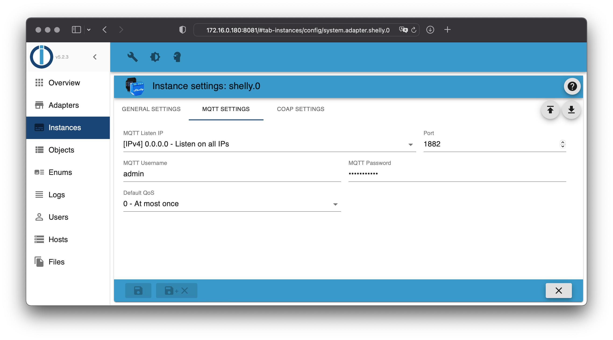
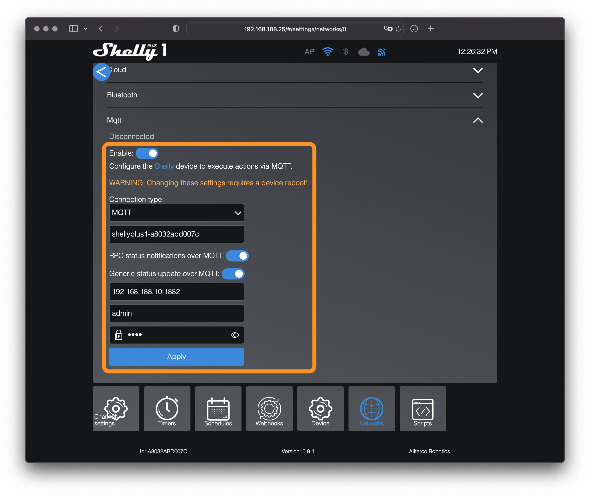
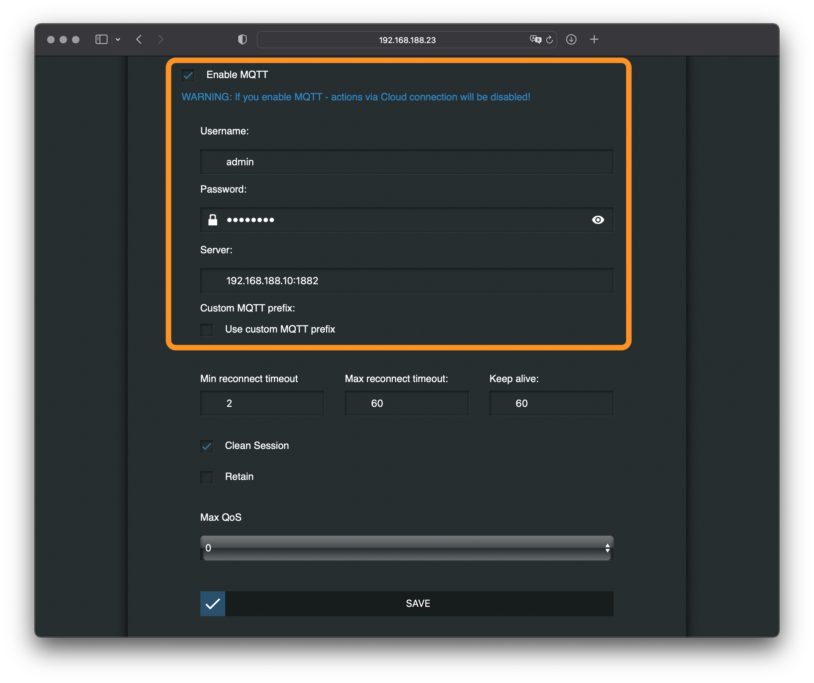

# IoBroker.shelly
这是德语文档 - [🇺🇸 英文版](../en/protocol-mqtt.md)

## MQTT

### 重要说明
- Shelly 适配器无法连接到现有的 MQTT 代理。
- Shelly 适配器启动了自己的 MQTT 代理，该代理在端口 `1882` 上启动，以避免与同一系统上的其他 MQTT 代理发生冲突（MQTT 的标准端口为 `1883`）。
- 无法将 MQTT 客户端（例如 MQTT Explorer）连接到内部 MQTT 代理。
- 可以在适配器的配置中调整内部 MQTT 代理的默认端口。
- **无需了解 MQTT 协议** - 所有通信均由内部处理

有问题？请先查看[常问问题](faq.md)！

>[!重要] >Shelly 适配器不支持通过 NAT 连接 Shellie（例如，许多 VPN 配置或 Shelly 范围扩展器）。

＃＃＃ 配置
1. 在ioBroker中打开Shelly适配器配置
2. 在“常规设置”中选择“MQTT（和 HTTP）”作为“协议”。
3. 打开 **MQTT 设置** 选项卡。
4. 选择用户名和安全密码（此信息必须在所有 Shelly 设备上输入）

Shelly适配器会启动其内部MQTT代理。所有要连接到此代理的Shelly设备都必须输入已配置的用户名和密码。

所有 Shelly 设备都必须启用 MQTT。

### 第二代及以上设备（Plus 和 Pro）
1. 在浏览器中打开 Shelly 网页配置页面（不要在 Shelly 应用中打开！）
2. 打开“设置”选项卡，然后转到“网络 -> MQTT”。
3. 激活 MQTT，输入您刚刚配置的用户数据和安装 ioBroker 的系统的 IP 地址，后跟配置的端口（例如 `192.168.1.2:1882`）。
4. 保存配置 - Shelly 将自动重启。

- **请勿更改此配置中的“客户端 ID”**
- **对于第二代及更新代设备（Gen2+），必须启用所有 RPC 选项（请参见屏幕截图）！**
- 不得启用 SSL/TLS。

### 第一代设备
1. 在浏览器中打开 Shelly 网页配置页面（不要在 Shelly 应用中打开！）
2. 进入“互联网和安全”设置 -> 高级 - 开发者选项
3. 激活 MQTT，输入您刚刚配置的用户数据和安装 ioBroker 的系统的 IP 地址，后跟配置的端口（例如 `192.168.1.2:1882`）。
4. 保存配置 - Shelly 将自动重启。

### 服务质量 (QoS)
MQTT中有3个QoS级别：

- 最多一次 (0) - 无交付保证（发送后不管）
至少一次 (1) - 保证消息至少到达收件人一次
- 恰好一次 (2) - 保证每条消息恰好到达收件人一次