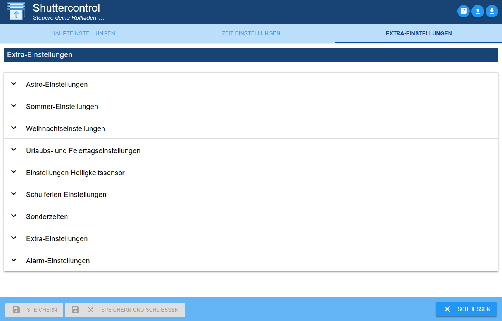
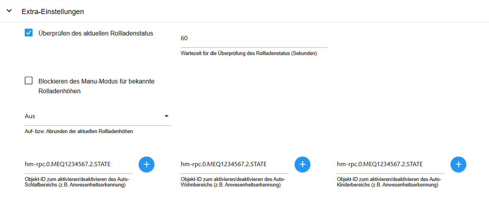
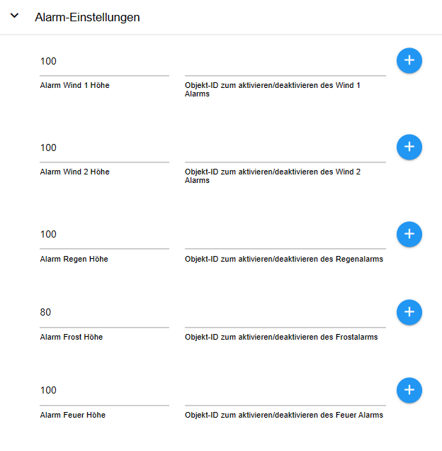

# Shuttercontrol 的文档和说明


---

## 支持适配器开发
**如果您喜欢该适配器，请考虑捐赠：**

[](https://paypal.me/mk1676)

---

＃＃ 基本
>:grey_exclamation: 本手册从稳定版本 1.6.2 起有效 :grey_exclamation:

Shuttercontrol 是一个适配器，用于对卷帘、百叶窗或遮阳篷进行非常全面的控制，包括自动遮阳和夜间变暗。

>:point_right：为了简单起见，这里只提到卷帘。

有大量可调节参数可供控制，例如：

* 三个不同的全局计时器，例如客厅、卧室和儿童区，
* 各种与太阳位置相关的参数，可以为每个卷帘单独设置。

可以为每个卷帘单独设置，

* 门/窗传感器的触发器，用作单独级别的锁定保护或自动打开。

当门或窗打开时，在单独的层面上打开，

* 各种可调节的阴影参数，取决于例如

内部温度、外部温度、亮度、热传感器或类似传感器，

* 包含太阳的位置，以便仅使实际被遮蔽的房间变暗。

被照亮。

所有配置数据点均已通过示例进行预设，以便适配器在安装并输入准备运行的快门 ID 后可快速投入使用。

然后使用进一步的配置来适应个人意愿。

> Shuttercontrol 只能通过位置控制执行器，例如LEVEL，值分别为 0 到 100 或 0-255。相应的快门或盲定时必须由执行器接管。
由执行器接管。百叶窗致动器为“高度”和“板条角度”各提供一个对象，可以使用两个百叶窗进行控制。
可与具有相同参数设置的两个快门对象一起使用。
使用。

---

＃＃ 安装
该适配器位于 ioBroker 的“稳定”存储库中。在“适配器”选项卡中选择“shuttercontrol”，并通过 (+) 创建快门控制适配器的实例。

＃＃ 配置
创建实例后，配置窗口会自动打开，其中包含“主要设置”、“时间设置”和“额外设置”选项卡。

>:point_right：应首先编辑 [时间设置](#time-settings) 和 [额外设置](#extra-settings) 选项卡，即在主设置中通过铅笔添加百叶窗之前。

---

### 主要设置
 --- >:point_right：可以通过右上角的问号 (7) 访问 github 上的文档。

#### 保存或上传适配器配置
单击右上角的向下箭头 (9)，将适配器配置保存为 .json 文件。
单击向上箭头 (8) 以上传 .json 格式的现有适配器配置。

_[回到顶部](#documentation-and-instructions-for-shuttercontrol)_

---

### 时间设置
在这里进行基本时间或 Astro 设置，稍后在每个快门的 [快门设置](#shutter-settings) 中使用这些设置。
每个快门的[快门设置](#shutter-settings)。

>:heavy_exclamation_mark: Shuttercontrol 始终在 **周末** 的设定时间 **周五** 关闭百叶窗。
**周日**始终在**工作周**的设定时间：heavy_exclamation_mark：


#### 起居区、睡眠区和儿童区的设置
各个设置通过下拉菜单打开。该描述是作为居住区域的示例给出的，并且类似地适用于所有区域。
对于所有领域。

>:point_right：当然，这种分类不一定非得用于起居区、睡眠区或儿童区。
儿童区域，但可以通过卷帘百叶窗的不同移动时间来定义建筑物中的三个区域。

**生活区自动控制类型**

下拉菜单用于选择：

* **仅居住区时间：**

*卷帘门仅受时间控制。

* 时间生活区日出和日落。

*卷帘门根据日出和日落控制，但最早时间前不升起，最晚时间后不落下。

* **黄金时段的生活区：**

*类似于日出和日落，但以“黄金时刻”的开始和结束为参考。

**在工作周期间关闭百叶窗：** *一周内通常的变暗时间*。

**一周内最早拉起百叶窗的时间：** *这是一周内拉起百叶窗的最早时间。

**本周最晚升起时间：** *这是本周卷帘百叶窗最晚升起时间*。

**卷帘百叶窗交错升起的时间延迟（秒）：** *此范围的卷帘百叶窗单独升起之间的距离，例如以避免无线电干扰或给人以手动移动的印象。

**周末关闭卷帘百叶窗：** *周末天黑的习惯时间**和公共假期**。

**周末最早拉闸时间：** *这是周末**和公共假期**拉闸的最早时间。

**周末最晚升起时间：** *此时卷帘百叶窗在周末升起**，**最迟在公共假期*。

>:point_right：如果太阳尚未超过某个未经过某个位置，则永远不会升起卷帘，则该时间必须设置为该太阳位置的最晚时间（21.12）。

_[回到顶部](#documentation-and-instructions-for-shuttercontrol)_

---

### 额外设置


#### 天文设置


**纬度和经度：** *Shuttercontrol 从 ioBroker 系统设置中获取纬度和经度。
Shuttercontrol 使用这些值来计算太阳的位置。

**以太阳高度（仰角）退出防晒功能：** *一旦太阳落到此处设定的高度以下，遮光就结束。
快门控制的阴影结束。

>:point_right：由于建筑物或高大树木可能存在的过早着色，可以在此考虑并提前结束自动着色。

**升高或降低的时间延迟（分钟）：** *可在此处输入 +/- 偏移量，通过该偏移量，快门移动应从[时间设置](#time-settings)中选择的自动控制类型延迟。

**交错快门移动的时间延迟（秒）：** *为了防止所有快门同时移动，可以在此处设置全局时间延迟（以秒为单位）。

_[回到顶部](#documentation-and-instructions-for-shuttercontrol)_

---

#### 夏季设置


**夏季开始**和**夏季结束：** *这里可以根据您自己的意愿设置夏季开始或结束。

在相应百叶窗的[快门设置](#shutter-settings)下，将复选框设置为“`Do not close shutter in summer`”可防止该百叶窗在夏季关闭。

_[回到顶部](#documentation-and-instructions-for-shuttercontrol)_

---

####圣诞节设置


**圣诞节期间的开始**和**圣诞节期间的结束：** *这里可以根据您自己的意愿设置圣诞节期间的开始或结束。

在[卷帘百叶窗的额外设置](#extra-settings-roller-shutter)圣诞节设置下，此时所需的功能已打开，并且所需的卷帘位置已打开。

_[回到顶部](#documentation-and-instructions-for-shuttercontrol)_

---

####节假日和公共假期设置


**使用公共假日：** *通过激活此复选框并选择假日适配器的相应实例，百叶窗将在公共假日从周末开始的设定时间移动。

>:point_right：如有必要，可以创建公共假期适配器的两个实例： > 一个显示所有可能的公共假期，另一个显示与工作时间相关的公共假期，然后由快门控制访问。

**用于设置假期的对象 ID： *此对象 ID 设置内部状态“假期”。
例如，在这里，可以使用来自 iCal 适配器的数据点，在假期时返回值“`true`”，从而允许百叶窗在周末移动。

_[回到顶部](#documentation-and-instructions-for-shuttercontrol)_

---

#### 亮度传感器设置


如果要使用亮度传感器自动移动百叶窗，请在此处进行配置。

然后根据[主快门设置](#main-shutter-settings)对每个快门单独执行激活。
在**关闭（或打开）卷帘百叶窗的控制类型**下，选择条目“亮度传感器”。

**使用亮度传感器关闭时的亮度值** *百叶窗关闭时的亮度值。

**使用亮度传感器打开的亮度值** *打开百叶窗的亮度值*。

**亮度传感器的对象ID** *亮度传感器的参考，例如来自气象站或室外运动传感器或单独的亮度传感器。

_[回到顶部](#documentation-and-instructions-for-shuttercontrol)_

---

#### 学校假期设置


在这里，可以通过带有 **用于激活/停用学校假期** 的对象 ID 的单独数据点或通过设置已安装 Schoolfree 适配器的实例的勾选来激活假期期间。
然后在假期期间，百叶窗会在周末驾驶的设定时间打开。
可以为每个区域单独激活假期模式。

_[回到顶部](#documentation-and-instructions-for-shuttercontrol)_

---

####特殊时期


**稍后关闭某些百叶窗** *此选项允许所有百叶窗在深夜再次降低。
这涵盖了正常关闭窗户或门仍然打开的情况。
窗户或门在正常关闭时间仍然打开，或者，例如，露台门在关闭后再次打开。
设置复选标记后，将出现设置**配置的卷帘百叶窗应延迟关闭的时间**。

> 必须为 [快门设置](#shutter-settings) 中的每个百叶窗激活此功能，并在 **关闭卷帘百叶窗** 处单独勾选每个卷帘百叶窗的复选标记，或者在不需要时停用该功能。

**将所有百叶窗完全关闭在中间位置** *所有百叶窗在晚上完全关闭的时间（例如晚上 10:00）*。

**仅当最后一次移动 x 分钟前才打开卷帘：** *仅当此处设置的时间已过时，适配器才会打开卷帘。
这里设定的时间已经过去了。

_[回到顶部](#documentation-and-instructions-for-shuttercontrol)_

---

#### 额外设置


**检查当前快门状态：** 某些用户（其中包括 shelly 用户）存在级别稍微变化的问题。因此，这里有一个复选框。
如果激活该复选框，shuttercontrol 将在检查快门状态的等待时间后检查当前级别，shuttercontrol 检查当前级别并暂时保存。

**阻止已知快门高度的手动模式** *向上或向下舍入当前快门高度*。
这里，卷帘的位置可以按 5 或 10 的步长进行舍入。

**睡眠区触发器的对象 ID（自动）：** *此触发器激活睡眠区的自动模式。

**生活区触发器的对象 ID（自动）：** *此触发器激活生活区的自动模式。

**儿童区域触发器的对象 ID（自动）：** *此触发器激活儿童区域的自动模式。

---

#### 警报设置


>:point_right：对于每个警报，激活需要一个逻辑数据点（真/假），> 激活 **警报** = 状态 **true** 或停用 **警报** = 状态 **错误的**。
>:point_right：此外，必须为每个警报定义发生警报时卷帘门移动的高度 (0-100%)。
>point_right：在相应快门的[报警设置](#alarm-setting)中，定义快门应对哪些警报做出反应。
快门应该有反应。

各个警报的优先级：

Prio 1（最高优先级）--> 火灾：

如果触发此警报，则为其配置的卷帘在**任何**情况下都会移动到设定高度。
>：感叹号：百叶窗随后被阻挡，即使火警被重置（假），也不会自动关闭。

>:point_right:火警重置后，必须使用“openAll”/“closeAll”按钮重新初始化百叶窗。
这可以防止卷帘在发生火灾时因任何原因再次自动关闭。
它还确保逃生路线保持畅通，并保证消防队能够进入。

Prio 2 - 5（相同优先级）--> 雨、风2、风1、霜：

当这些警报被激活时，Shuttercontrol 将配置的卷帘移至最后一个活动警报级别。

然而，当停用各个警报时，会遵循以下优先级： Prio 1 = 火灾 Prio 2 = 雨 Prio 3 = 风 2 Prio 4 = 风 1 Prio 5 = 霜冻

仅当激活的卷帘已关闭时，霜冻警报才会产生直接影响（卷帘冻结的危险）。如果卷帘门仍打开时触发霜冻警报，则卷帘门仅在关闭时自动移动到霜冻警报设定的高度。

_[回到顶部](#documentation-and-instructions-for-shuttercontrol)_

---

### 快门设置


>:point_right: 示例执行器*快门示例*是自动创建的，请通过垃圾箱（5）将其删除。

现在，单击 (+) (1) 添加您自己的快门执行器。 ID 选择打开并选择代表所需卷帘位置的数据点 LEVEL。


表的结构：


* **编号：** *列出的百叶窗的连续编号*。

* **激活：** *用于激活/停用相应卷帘控制的复选框*。

* **名称：** *选择 ID 时，会自动从对象中读取执行器的名称

然后可以根据自己的意愿进行更改。

* **对象 ID 快门：** *对象中要控制的数据点的唯一 ID*。

* **(+)** *更改选定的卷帘执行器* * **铅笔** * *修改选定的卷帘执行器

* **铅笔** *打开相应卷帘的单独配置*。

* **双张：** *复印卷帘*

* **箭头：** *使用相同的设置确定卷帘的移动顺序。

* 垃圾桶：* *删除快门执行器以及所有配置的数据。

创建卷帘百叶窗后，使用标签[卷帘百叶窗的主要设置](#main-shutter-settings)、[防晒设置](#sun-protection-settings) 和 [额外设置]](#extra-settings)按相应卷帘百叶窗上的铅笔 (3)，每个百叶窗将进一步单独配置。

---

#### 主要快门设置


在上部区域，打开或关闭快门的时间可以通过下拉菜单单独选择。
> :point_right：这些时间已在 [时间设置](#time-settings) 中配置。

选择选项：

* **关闭：** *不要使用计时器。

* **起居区：** *快门按照*起居区设置*中配置的时间移动。

* 起居区（自动）：** * *卷帘百叶窗按照*起居区设置*中配置的时间移动。

**并且** 此外，快门会响应额外设置下定义的触发器而激活。
用于激活/停用汽车生活区的对象 ID。如果此设置为 false，卷帘将**不会**自动移动。

* 卷帘百叶窗按照*睡眠区设置*中配置的时间移动。

* 卷帘百叶窗按照*睡眠区设置*中配置的时间移动。

**并且** 此外，快门会响应额外设置下指定的触发器而激活。
用于激活/停用自动睡眠区域的对象 ID。
如果设置为 false，卷帘将**不会**自动移动。

* 儿童区： * *卷帘百叶窗按照*儿童区设置*中配置的时间移动。

* 儿童区（自动）：* *卷帘按照*儿童区设置*中配置的时间移动。

**并且** 此外，快门会响应额外设置下定义的触发器而激活。
用于激活/停用自动儿童区域的对象 ID。
如果设置为 false，快门将**不会**自动移动。

* 日落/日出：** * *快门在日落或日出时移动。

* 太阳高度：如果高度低于此处设置的值，则卷帘关闭。

* 黄金时段：** * *卷帘在黄金时段关闭，根据纬度和一年中的时间，卷帘门关闭时间约为 15 分钟。日落前或日出后 1 小时。

日落之前或日出之后，具体取决于纬度和一年中的时间。

* 亮度传感器：** * *卷帘仅根据亮度传感器移动，亮度传感器在[亮度传感器设置](#brightness-sensor-settings)下设置。

* 仅限手动操作：** * *卷帘只能沿选定方向手动移动。

:point_right: 无法通过“`shuttercontrol.0.control`”下的按钮进行移动。
point_right：这对于遮阳篷很有用，例如，遮阳篷不应与其他卷帘百叶窗一起打开。
不应与其他百叶窗一起打开。

**门窗传感器在关闭状态下的值：** *这里定义了**门窗触点对象ID**下的触发器（例如窗或门触点）可以具有的值。
（例如窗户或转动手柄接触），允许自动卷帘系统无限期移动。
:point_right: 可以选择 true、false、0、1 或 2 等值。

> point_right：如果卷帘门不在最上面的位置并且此处指定的传感器状态发生变化，则卷帘门移动到最上面的位置。
传感器状态发生变化，卷帘门移动到**门窗打开时的**卷帘门高度**。

**倾斜状态下门窗传感器的值：** *这设置了**门窗触点的对象 ID**（例如窗或门触点）下的触发器设置的值。
（例如窗户或转动手柄接触），允许自动卷帘系统无限期移动。
:point_right: 可以选择 true、false、0、1 或 2 等值。

> point_right：如果卷帘门不在最上面的位置并且此处指定的传感器状态发生变化，则卷帘门移动到最上面的位置。
传感器状态发生变化，卷帘门移动到**门窗打开时的**卷帘门高度**。

> ：感叹号：如果不存在具有倾斜功能的窗口接触，则该值应设置为“不存在”。

**当门窗状态改变时移动卷帘：** *应执行下拉选择当门窗传感器移动时要执行的功能：*

**关闭**：无运动

* **打开**：打开窗/门时，百叶窗向上移动并保持在那里，关闭时百叶窗不移动。
* **关闭**：关闭门窗后，卷帘移动到遮光位置，打开时卷帘不动。

**打开和关闭：** 打开窗/门时，卷帘向上移动，关闭时再次向下移动。

**打开窗户或门时卷帘高度：** *所需卷帘位置为 0-100，例如窗户 25% 用于通风，或者门 100% 能够通过。
以便门能够通过。

**门窗倾斜时卷帘高度：** *所需卷帘位置为 0-100，例如窗户 25% 用于通风。

**即使在门窗打开时也使用自动卷帘门（锁定保护）** * *如果在自动关闭时，门窗传感器__不__对应于此处输入的值（门窗关闭） )，将根据所选设置执行以下操作：**。

* **关闭**：锁定保护在两个方向上均处于活动状态，窗户打开时百叶窗不会移动。
* **开放**：只允许加注。在变暗/遮光结束时，即使窗户打开，卷帘也会向上移动。当窗户打开时，卷帘门不会自动关闭。
* **关闭**：仅允许关闭。在变暗/遮光开始时，尽管窗户打开，卷帘仍向下移动。窗户打开时，卷帘门不会打开。
* **打开和关闭**：当窗户打开时，卷帘可以向两个方向移动。

**卷帘向下移动时的高度：** *卷帘关闭时的位置值。

**卷帘门升起时的高度：** *卷帘门打开时的位置值*。

> :point_right：必须根据所使用的执行器输入卷帘高度（0-100 或 0-255）： > 0 = 关闭且 100 = 打开或 0 = 打开且 100 = 关闭。

**门窗触点的对象 ID：** 使用 (+) 选择防止卷帘运动的传感器（状态）（例如门触点）。

_[回到顶部](#documentation-and-instructions-for-shuttercontrol)_

---

#### 防晒设置


**防晒控制类型：** 可以使用遮光及其结束的各种触发器来控制防晒，可以通过下拉菜单选择以下组合：

* 在......之外
* 室内外温度/光照传感器
* 指南针方向（太阳位置）
* 室内/室外温度/光线传感器和基本方向
* 室外温度/光传感器和方向
* 室外温度/光照传感器
* 室内温度

> :point_right：仅当所选组合的所有触发器均处于活动状态（逻辑 AND 连接）时，防晒保护才会触发，并在其中一个触发器变为非活动状态时结束。

> :point_right：还必须为所有选定的触发器存储对象 ID。

> :point_right：光传感器始终是可选的，并且可以保持为空。如果配置了光传感器，则它与其他参数 AND 关联。

**下移时卷帘高度：** *遮阳时卷帘应关闭多远的数值。*

**方向（太阳位置）：** *罗盘上窗口的对齐方式（0° = 北；180° = 南）*

**+/- 主动防晒的太阳位置范围：** *太阳（中心点周围）会干扰窗户的区域。该区域之外没有阴影。*

**室外温度设定值：** *遮光从此值（或更高）开始。*

**室外温度迟滞（百分比）：** *在这里您可以设置百分比迟滞，以便卷帘百叶窗在波动时不会不断上下移动。*迟滞是遮阳应达到的上限温度值之间的差异开始和遮蔽再次结束时的较低温度值。

**室外温度对象 ID：** 此处通过 (+) 选择的传感器不一定要测量室外温度。他可以提供任何可用于触发着色的值。
这也可以是热传感器（温差传感器）。
如果没有选择室外传感器作为触发器，请将此字段留空。

**防晒光传感器的设定点：** *开始遮阳的阈值。*该值取决于在 **防晒光传感器的对象 ID** 字段中选择的传感器。

**迟滞光传感器（百分比）：** 在这里您可以设置一个向下的迟滞百分比，这样当云层变化引起波动时，卷帘百叶窗就不会不断地上下移动。
滞后是遮蔽应开始的设定点与遮蔽应开始再次结束的较低亮度值之间的差值。

> :point_right: 示例：防晒光传感器的设定点设置为 30,000，迟滞为 40%：防晒保护从 30,000 开始激活，并保持激活状态，直到值低于 18,000。

**防晒光传感器的对象 ID：** *模拟室外温度传感器* 如果未选择作为触发器，请留空

**设定点室内温度：** 在此，您可以输入分配给卷帘百叶窗的内部温度传感器的温度，在该温度下不应进行任何遮蔽，例如为了减少热量，以在冬季使用辐射来支持加热。

**迟滞内部温度（百分比）：** *在这里您可以设置一个以百分比为单位的迟滞，以便卷帘在内部温度波动时不会不断地上下波动。* 迟滞是指与温度上限之间的差值。遮蔽应开始，遮蔽再次结束时的较低温度值。

**室内温度传感器对象 ID：** 使用 (+) 选择温度传感器。
如果没有选择室内传感器作为触发器，请将此字段留空。

_[回到顶部](#documentation-and-instructions-for-shuttercontrol)_

---

#### 额外设置卷帘百叶窗


#### 卷帘快门设置


**延迟关闭卷帘** 使用此选项，卷帘在定义的时间激活（可在 [特殊时期](#special-times) 中调整），同时也会关闭。
> ：感叹：此处未考虑锁定保护，尽管窗户打开，但卷帘仍会降低！ （有被锁在门外的危险！！）：感叹：

**夏天不要关闭卷帘** 有些卷帘夏天不宜关闭。该时期为 [夏季设置](#summer-settings) 的夏季。

**关闭车窗后驱动** 车窗/门关闭后，卷帘将设置为最后请求的设置 位置驱动。

> :point_right: 仅当锁定保护未设置为“关闭”时才有效！

#### 圣诞节设置


如果卷帘在圣诞节期间仅应部分关闭，因为蜡烛拱门或类似物应保持可见，则可以使用此选项。卷帘门将不会在正常关闭时间完全关闭，而只会被驱动至可设定的水平关闭。
> :point_right: **仅当设置了 **使用圣诞节时的卷帘级别** 的复选标记时，**圣诞节时的卷帘级别**才可见且可调节。

该功能应激活的时间段在[圣诞节设置](#christmas-settings)设置下设置。
> :point_right: 如果要在晚上晚些时候完全关闭卷帘，可以使用此选项 > **延迟关闭卷帘** 或 **移动到中间位置并稍后完全关闭** > 可以使用。
> :point_right：这两个选项也可以独立于圣诞节设置使用。

#### 防晒设置


**保持卷帘处于防晒状态** 如果打开此选项，即使不再有任何防晒要求，卷帘百叶窗也会保持在防晒状态，直到“关闭”为止晚上有信号。
这样可以防止卷帘每天上下多次。
当高度保持较低（选中选项）时，在盲操作中非常实用，只需打开和关闭板条即可。

**热保护** 此选项允许卷帘在炎热天气下完全关闭。
激活此选项后，将出现用于输入温度（°C）的字段。

> :point_right：如果手动调节卷帘且位置与自动位置不对应，自动系统将停止！

> :point_right：如果手动将卷帘移动到配置的打开、关闭或防晒高度，则自动功能保持不变。

#### 额外设置


**打开窗户时卷帘延迟** *打开窗/门后延迟打开卷帘的参数（以秒为单位）*

**关闭窗户时卷帘延迟** *门窗关闭后延迟卷帘关闭的参数（以秒为单位）*

**移动到中间位置，然后完全关闭** *激活后，**中间位置的卷帘高度**变得可见。然后卷帘门在关闭时移动到设定的中间位置，然后完全关闭*

#### 闹钟设置


此处，通过 [报警设置](#alarm-setting) 为当前卷帘预定义的警报被激活或停用。

_[回到顶部](#documentation-and-instructions-for-shuttercontrol)_

---

＃＃ 数据点
Shuttercontrol 在以下文件夹下创建各种数据点：

* 快门控制.x.control
* 快门控制.x.info
* 快门控制.x.快门

> :point_right: x 代表相应安装的实例

---

### 快门控制0控制


用于控制各种功能的数据点，例如： *假日 *如果```true```，则卷帘百叶窗在周末和晚上的设定时间移动

```false``` during weekday hours.*
> :point_right: Can use your own scripts that calculate or display vacation, days off, etc.
set to true to enable weekend settings.

* autoAll
*Button to set **all** shutters to auto mode*

* autoChildren
*If the roller shutters are controlled with **children's area (automatic)**, the automatic function is activated here
switched on with ```true``` and switched off with ```false```.*

* auto living
*If the roller shutters are controlled with **Living area (automatic)**, the automatic mode is used here
switched on with ```true``` and switched off with ```false```.*

* auto sleep
*If the roller shutters are controlled with **sleeping area (automatic)**, the automatic mode is used here
switched on with ```true``` and switched off with ```false```.*

* closeAll
*Button to close **all** roller shutters in **all areas***

* closeChildren
*Button to close **all** roller shutters in the children's area*

* closeLiving
*Button to close **all** roller shutters in the living area*

* closeSleep
*Button to close **all** shutters in the sleeping area*

* openAll
*Button to open **all** roller shutters in **all areas***

* openChildren
*Button to open **all** roller shutters in the children's area*

* openLiving
Button to open **all** roller shutters in the living area

* openSleep
*Button to open **all** shutters in the sleeping area*

* school free
*Button to manually activate the holiday season and have the roller shutters open at the set time on the weekend*

* sunProtect
*Button to move the roller shutters into the sun protection position*

* sunProtectChildren
*Button to move the roller shutters in the children's area to the sun protection position*

* sunProtectLiving
*Button to move the roller shutters in the living area to the sun protection position*

* sunProtectSleep
*Button to move the roller shutters in the sleeping area to the sun protection position*


_[Back to top](#documentation-and-instructions-for-shuttercontrol)_


---


### shuttercontrol0info
Data points for displaying calculated values and checking configured ones
Times:


_[Back to top](#documentation-and-instructions-for-shuttercontrol)_


---


### shuttercontrol0shutters


* autoDown
*For each roller shutter, automatic closing can be deactivated here with ```false```

或使用 ```true```.* 激活

* 自动级别

*显示每个卷帘百叶窗的当前位置（卷帘百叶窗无法通过此控制）。*

* 自动状态

*显示每个卷帘百叶窗的当前状态（向上、向下、Manu_Mode、sunProtect）（无法通过此控制卷帘百叶窗）。*

* 自动太阳

*可使用 ```false``` 禁用每个卷帘的防晒功能，或使用 ```true``` 激活每个卷帘的防晒功能。*

* 自动上升

*对于每个卷帘，可以使用 ```false``` 禁用自动打开功能，或使用 ```true``` 激活自动打开功能。*

_[回到顶部](#documentation-and-instructions-for-shuttercontrol)_

## Changelog
<!-- ### __WORK IN PROGRESS__ -->
### __WORK IN PROGRESS__
* (simatec) Dependencies updated
* (simatec) Docu updated

### 1.7.0 (2024-02-05)
* (simatec) Dependencies updated
* (simatec) @iobroker/adapter-dev added
* (simatec) Design optimizations
* (simatec) Gulp deleted
* (simatec) Docu updated
* (simatec) many small fixes

### 1.6.3 (2023-11-01)
* (simatec) Saturday added as work week
* (simatec) Dependencies updated
* (simatec) Fix Auto-Living, Auto-Sleep & Auto-Children
* (simatec) Timeout Fix
* (FredF63) Update German Docu
* (simatec) Wiki added

### 1.6.2 (2023-08-28)
* (simatec) Dependencies updated
* (simatec) node 20 tests added
* (simatec) Fix ending Sunprotect with open door/window
* (5G7K) Fix timing & some states for sunprotect

### 1.6.1 (2023-07-17)
* (simatec) Fix Heat protection

### 1.6.0 (2023-07-16)
* (simatec) Manu mode block added
* (simatec) Heat protection added
* (simatec) Added rounding of incoming shutter states
* (simatec) Ukrainian language added
* (simatec) small Bugfixes
* (simatec) Dependencies updated

### 1.5.0 (2023-06-05)
* (simatec) new Manu-Mode Check added
* (simatec) suncalc added
* (simatec) Dependencies updated

### 1.4.29 (2023-04-26)
* (simatec) Bugfix Brightness down

### 1.4.28 (2023-04-17)
* (simatec) small Fixes

### 1.4.27 (2023-04-17)
* (simatec) small Fixes

### 1.4.26 (2023-04-14)
* (simatec) Fix Sunprotect

### 1.4.25 (2023-04-13)
* (simatec) small Fixes

### 1.4.24 (2023-04-10)
* (simatec) Fix end of Sunprotect
* (simatec) small Fixes
* (simatec) Fix shutter alarm
* (simatec) Sentry fixes
* (simatec) Bugfix Brightness down
* (simatec) Dependencies updated
* (j4nv) Fix Astro Time

### 1.4.23 (2023-03-28)
* (simatec) Bugfix Brightness-Sensor
* (simatec) Dependencies updated
* (simatec) small fixes

### 1.4.22 (2023-03-18)
* (simatec) Bugfix Brightness-Sensor
* (simatec) Dependencies updated
* (simatec) Fix Alarm Settings

### 1.4.21 (2023-02-02)
* (simatec) fix Brightness Settings
* (simatec) Dependencies updated

### 1.4.20 (2023-01-30)
* (simatec) Bugfix Brightness-Sensor

### 1.4.19 (2023-01-22)
* (simatec) Time config for Brightness-Sensor added
* (simatec) small Bugfixes
* (simatec) Dependencies updated

### 1.4.18 (2022-09-24)
* (simatec) Bugfixes Button Action

### 1.4.17 (2022-09-24)
* (simatec) small Bugfixes

### 1.4.16 (2022-09-19)
* (simatec) small Bugfixes
* (simatec) Dependencies updated
* (simatec) Dev-Dependencies updated
* (simatec) Docu updated
* (simatec) travis deleted
* (simatec) update translation
* (simatec) debug for shutterstate added

### 1.4.14 (2022-06-02)
* (simatec) delay for Lightsensor added
* (simatec) Dependencies updated
* (simatec) Dev-Dependencies updated

### 1.4.13 (2022-05-24)
* (FoxRo) Bugfix Alarm handling
* (simatec) Dependencies updated
* (simatec) Dev-Dependencies updated
* (simatec) more debuglog for Trigger

### 1.4.12 (2022-04-11)
* (FoxRo) Bugfix wrongly open after deactivation of weater alarm
* (simatec) Dependencies updated
* (simatec) Dev-Dependencies updated

### 1.4.11 (2022-02-07)
* (simatec) fix objects value
* (simatec) Dependencies updated
* (simatec) Dev-Dependencies updated

### 1.4.10 (2022-01-16)
* (simatec) Bugfix xmas time
* (simatec) Bugfix Shutter delay
* (simatec) Dependencies updated
* (simatec) Dev-Dependencies updated

### 1.4.9 (2021-12-29)
* (simatec) error handling for trigger added
* (simatec) Bugfix Trigger delay
* (simatec) Dependencies updated
* (simatec) Dev-Dependencies updated

### 1.4.8 (2021-12-25)
* (simatec) error handling for trigger added
* (simatec) Bugfix Trigger delay

### 1.4.7 (2021-12-21)
* (simatec) complete error handling for states added
* (simatec) Bugfix Down Late Option
* (simatec) small Bugfixes
* (simatec) Dependencies updated
* (simatec) Dev-Dependencies updated

### 1.4.6 (2021-12-15)
* (simatec) Bugfixes shuttersettings
* (simatec) Bugfix shutter created

### 1.4.5 (2021-12-14)
* (simatec) small Bugfixes
* (simatec) Code cleaning
* (simatec) try & catch added
* (simatec) source code was converted to async
* (simatec) Dependencies updated
* (simatec) Dev-Dependencies updated

### 1.4.4 (2021-12-08)
* (simatec) Bugfix Trigger after shutter close
* (simatec) Bugfix XMas Level by frost
* (simatec) XMas Level for Elevation added
* (simatec) Summertime for Elevation added
* (simatec) small Bugfixes
* (simatec) shutter Config check added

### 1.4.3 (2021-12-05)
* (simatec) Bugfix Trigger after shutter close
* (simatec) Bugfix XMas Level by frost
* (simatec) XMas Level for GoldenHour added
* (simatec) Summertime for Goldenhour added
* (simatec) small Bugfixes

### 1.4.2 (2021-12-02)
* (simatec) Bugfix Alarm settings
* (simatec) Bugfix move shutter after closing window
* (simatec) better translation for all languages
* (simatec) small Bugfixes

### 1.4.1 (2021-12-01)
* (simatec) Code cleaning
* (simatec) Bugfix Alarm States
* (simatec) try & catch added

### 1.4.0 (2021-11-30)
* (simatec) Source code completely redesigned
* (simatec) Much of the source code was converted to async
* (simatec) many small Bugfixes
* (simatec) Dependencies updated
* (simatec) Dev-Dependencies updated

### 1.3.9 (2021-11-25)
* (simatec) Bugfix between Level
* (simatec) many small Bugfixes
* (simatec) docu updated
* (simatec) Dependencies updated
* (simatec) Dev-Dependencies updated

### 1.3.8 (2021-11-20)
* (simatec) Bugfix XMas-Level
* (simatec) Bugfix Down Complete

### 1.3.7 (2021-11-19)
* (simatec) brightness down State added
* (simatec) BrightnessSensor fix

### 1.3.6 (2021-11-17)
* (simatec) small Bugfixes

### 1.3.5 (2021-11-16)
* (simatec) Bugfix BrightnessSensor
* (simatec) Fix Delay with value 0
* (simatec) DEPENDENCIES updated
* (simatec) Dev-DEPENDENCIES updated

### 1.3.3 (2021-11-07)
* (simatec) Bugfix trigger Tilted

### 1.3.2 (2021-11-05)
* (simatec) Bugfix BrightnessSensor
* (simatec) lastAutoAction in array added
* (simatec) Bugfix Log for alarm

### 1.3.1 (2021-11-04)
* (simatec) Bugfix BrightnessSensor
* (simatec) Object-ID for school holidays added

### 1.3.0 (2021-11-03)
* (FoxRo) alarm function added
* (simatec) Trigger Tilted Window / Door added
* (FoxRo) new Feature Sunprotect end Delay added
* (FoxRo) Bugfix in window trigger
* (FoxRo/simatec) new Features in Docu added
* (simatec) many small BugFix
* (simatec) DEPENDENCIES updated
* (simatec) Dev-DEPENDENCIES updated

### 1.2.1 (2021-06-22)
* (simatec) auto-mode button added
* (simatec) many small BugFix
* (simatec) DEPENDENCIES updated
* (simatec) Dev-DEPENDENCIES updated

### 1.2.0 (2021-05-04)
* (simatec) new Feature shutterSettings added
* (simatec) new Feature brightness sensor for opening added
* (simatec) new Feature brightness sensor for closing added
* (simatec) new Feature schoolfree adapter added
* (simatec) new Feature middle position added
* (simatec) new Feature Xmas position added
* (simatec) Bugfix
* (simatec) DEPENDENCIES updated
* (simatec) Dev-DEPENDENCIES updated
* (simatec) timeout settings for shutterstatus added

### 1.1.5 (2021-01-22)
* (simatec) BugFix io-package
* (simatec) Source code structure changed
* (FoxRo) new Feature "trigger delay"
* (FoxRo) Bugfix for trigger

### 1.1.4 (2021-01-22)
* (simatec) BugFix Log
* (simatec) DEPENDENCIES updated
* (simatec) Dev-DEPENDENCIES updated

### 1.1.3 (2021-01-21)
* (simatec) small fix for objects

### 1.1.2 (2021-01-18)
* (simatec) small fix for holiday state

### 1.1.1 (2021-01-04)
* (René) bug fix xmas time
* (simatec) copy function for shutter-table added

### 1.1.0 (2020-12-08)
* (simatec) GUI redesign
* (simatec) Intermediate position added for closing

### 1.0.5 (2020-12-05)
* (Rene) fix xMas Time

### 1.0.4 (2020-10-28)
* (simatec) fix summertime for childrenarea

### 1.0.3 (2020-10-28)
* (René) bug fix: calculation IsSummerTime
* (René) bug fix: use weekend down time already on friday instead of sunday
* (René) handling of shutters in xmas time added
* (FredF63) documentation updated
* (FredF63) words.js updated
* (simatec) some Bugfixes

### 1.0.2 (2020-10-08)
* (simatec) fix uptime for childrenarea

### 1.0.1 (2020-10-06)
* (simatec) Adjustment of the configuration menu
* (simatec) time settings for the children's area added
* (simatec) button for closing the children's area added
* (simatec) button for opening the children's area added
* (simatec) button for sun protection of the children's area added

### 1.0.0 (2020-09-28)
* (simatec) some Bugfixes
* (simatec) code cleaning
* (simatec) DEPENDENCIES updated
* (simatec) Dev-DEPENDENCIES updated
* (FoxRo) Added buttons for Sunprotect Living and Sunprotect Sleep
* (FoxRo) Included Living-Auto and Sleep-Auto in Buttons for Open/Close Sleep and Living
* (FoxRo) KeepSunprotect added
* (FoxRo) Drive after close added
* (FoxRo) Extend status handling

### 0.8.7 (2020-09-22)
* (simatec) small Bugfix for weekend

### 0.8.6 (2020-08-21)
* (simatec) small Bugfixes trigger

### 0.8.5 (2020-08-03)
* (simatec) small Bugfixes
* (5G7K) bugfixes trigger
* (FredF63) new german doku

### 0.8.4 (2020-07-17)
* (simatec) small Bugfixes
* (5G7K) debug log changed
* (simatec) Dependencies updated
* (MeisterTR) Time left to detect second sleep

### 0.8.3 (2020-07-07)
* (simatec) Bugfix IsSummerTime
* (simatec) Bugfix shutter convert

### 0.8.2 (2020-07-06)
* (simatec) small Bugfixs
* (simatec) Buttons for sunprotect operation added

### 0.8.1 (2020-07-03)
* (simatec) Bugfix shutterstates
* (simatec) support for KNX

### 0.8.0 (2020-07-02)
* (simatec) added state for current shutter Action
* (simatec) added state for current shutter Level
* (simatec) added Indicator for manual operation in the states
* (simatec) code cleanup
* (simatec) complete new structure of the code
* (simatec) Buttons for manual opening and closing operation added
* (simatec) Display in the States if the shutter was moved manually
* (5G7K) Bug fix sunprotect

### 0.7.3 (2020-06-29)
* (simatec) errorhandling for sentry.io
* (simatec) bugfixes
* (simatec) cancel all schedule by unload
* (rg-engineering) bug fix and documentation

### 0.7.2 (2020-06-26)
* (simatec) Bugfix sunprotect for outsidetemp
* (simatec) better translation for all languages
* (simatec) better overview in the user interface

### 0.7.1 (2020-06-24)
* (simatec) small bugfixes
* (simatec) errorhandling for sentry.io

### 0.7.0 (2020-06-23)
* (rg-engineering) better (userfriendly) check for adjustable times
* (rg-engineering) datapoint for Holiday incl. internal check and handling
* (rg-engineering) late all down added 
* (5G7K) Extended sun protection
* (simatec) edited User Menu for Timesettings
* (simatec) Bugfix Lightvalue to 20.000 Lux
* (simatec) added better German Translation

### 0.6.2 (18.05.2020)
* (simatec) errorhandling for sentry.io
* (simatec) Bugfix getState

### 0.6.1 (11.05.2020)
* (simatec) bugfix index_m.html

### 0.6.0 (10.05.2020)
* (simatec) added sentry.io
* (simatec) added node 14 Support
* (simatec) many small Bugfixes
* (simatec) node 8 support removed
* (5G7K) added new feature for sunprotect
* (5G7K) added more debug logs

### 0.5.1 (15.04.2020)
* (simatec) Bugfix for Adapter checker
* (simatec) Added more debug logs
* (simatec) Added node Support
* (simatec) node 8 support removed
* (Rene) late all down added
* (Rene) late all down configurable per shutter
* (Rene) in summer time not to move down (configurable)

### 0.5.0 (06.04.2020)
* (simatec) Bugfix Goldenhour
* (simatec) Bugfix delay for sunprotect
* (simatec) Bugfix Goldhour with living area
* (simatec) Added auto fill for Position
* (simatec) many small Bugfixes
* (simatec) Bugfix Translations
* (simatec) Bugfix compactmode
* (5G7K) Added debug log with more Informations

### 0.4.3 (29.12.2019)
* (simatec) Bugfix update process

### 0.4.2 (22.12.2019)
* (simatec) Fix Trigger added objects

### 0.4.1 (20.10.2019)
* (simatec) Fix update process
* (simatec) Fix appveyor

### 0.4.0 (28.08.2019)
* (simatec) Fix shutdown for Elevation
* (simatec) Fix triggerHeight
* (simatec) Fix Travis

### 0.3.2 (09.07.2019)
* (simatec) Added state check for all shutter
* (simatec) Bugfix sunprotect
* (simatec) Bugfix trigger
* (simatec) Bugfix time settings
* (Homoran) Added German Docu

### 0.3.1 (02.07.2019)
* (simatec) Fix sunprotect for shelly user

### 0.3.0 (01.07.2019)
* (simatec) Fix shutter up for Sunprotect
* (simatec) Fix input for elevation
* (simatec) Fix input for Inside temperature
* (simatec) Fix input for Outside temperature
* (simatec) Fix input for Lightsensor
* (simatec) Added Object to shutter
* (simatec) Added hysteresis for Lightsensor
* (simatec) Added hysteresis for Inside temperature
* (simatec) Added hysteresis for Outside temperature
* (simatec) Added State check after running
* (simatec) Fix autodrive
* (simatec) Added check shutter up for sunprotect
* (simatec) Added Translations
* (simatec) sunprotect changed to switch
* (Homoran/simatec) Added German Docu
* (simatec) Added English Docu

### 0.2.13 (21.06.2019)
* (simatec) small Bugfix

### 0.2.12 (21.06.2019)
* (simatec) Changed Time-Settings
* (simatec) Bugfix Trigger for up and down
* (simatec) Bugfix sunprotect with azimut
* (simatec) Added sunprotect not running on state down
* (simatec) Added debug log for any shutter states

### 0.2.11 (20.06.2019)
* (simatec) Fix debug log
* (simatec) temporary storage of the state
* (simatec) automatic stop of sun protection with manual state change

### 0.2.10 (18.06.2019)
* (simatec) edit extra menu
* (simatec) clean code
* (simatec) save current states on start

### 0.2.9 (17.06.2019)
* (simatec) Bugfix PopUp
* (simatec) Fix TriggerID

### 0.2.8 (17.06.2019)
* (simatec) Menu completely revised
* (simatec) Ease of use improved
* (simatec) Example added
* (simatec) Default settings added for each roller shutter
* (simatec) fixed some bugs

### 0.2.7 (14.06.2019)
* (simatec) Beta 0.2.7

### 0.2.6 (14.06.2019)
* (simatec) Beta 0.2.6

### 0.2.5 (11.06.2019)
* (simatec) Beta 0.2.5

### 0.2.4 (11.06.2019)
* (simatec) Beta 0.2.4

### 0.2.3 (10.06.2019)
* (simatec) Fix Elevation
* (simatec) Fix direction
* (simatec) Add all translate
* (simatec) Add new popup for shutter config
* (simatec) clean table

### 0.2.2 (01.06.2019)
* (simatec) Beta 0.2.2

### 0.2.1 (01.06.2019)
* (simatec) Shutters drive when the trigger is changed
* (simatec) Add Trigger ID for Auto-Living
* (simatec) Add Trigger ID for Auto-Sleep
* (simatec) add shutter height for trigger
* (simatec) Add boolean for drive on change Trigger

### 0.2.0 (31.05.2019)
* (simatec) complete restructuring of functions

### 0.1.0 (11.05.2019)
* (simatec) First Beta

### 0.0.1 (02.04.2019)
* (simatec) initial release


*************************************************************************************************************************************

## License
MIT License

Copyright (c) 2019 - 2024 simatec

Permission is hereby granted, free of charge, to any person obtaining a copy
of this software and associated documentation files (the "Software"), to deal
in the Software without restriction, including without limitation the rights
to use, copy, modify, merge, publish, distribute, sublicense, and/or sell
copies of the Software, and to permit persons to whom the Software is
furnished to do so, subject to the following conditions:

The above copyright notice and this permission notice shall be included in all
copies or substantial portions of the Software.

THE SOFTWARE IS PROVIDED "AS IS", WITHOUT WARRANTY OF ANY KIND, EXPRESS OR
IMPLIED, INCLUDING BUT NOT LIMITED TO THE WARRANTIES OF MERCHANTABILITY,
FITNESS FOR A PARTICULAR PURPOSE AND NONINFRINGEMENT. IN NO EVENT SHALL THE
AUTHORS OR COPYRIGHT HOLDERS BE LIABLE FOR ANY CLAIM, DAMAGES OR OTHER
LIABILITY, WHETHER IN AN ACTION OF CONTRACT, TORT OR OTHERWISE, ARISING FROM,
OUT OF OR IN CONNECTION WITH THE SOFTWARE OR THE USE OR OTHER DEALINGS IN THE
SOFTWARE.