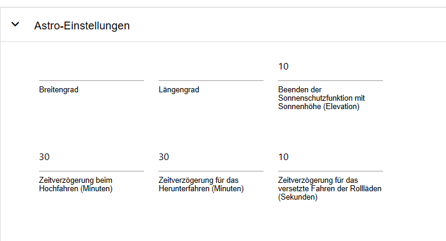
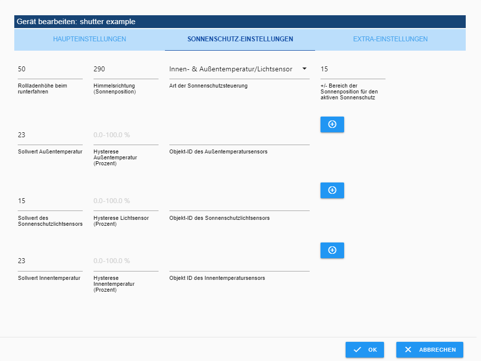
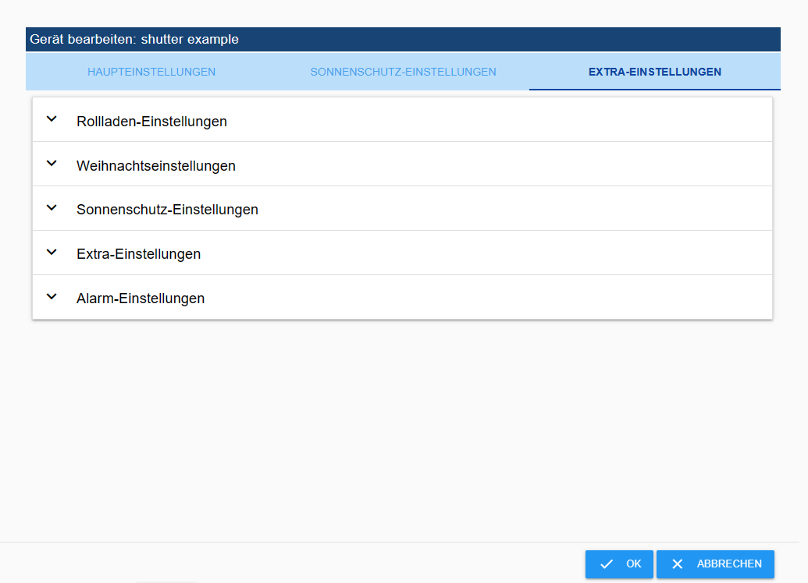
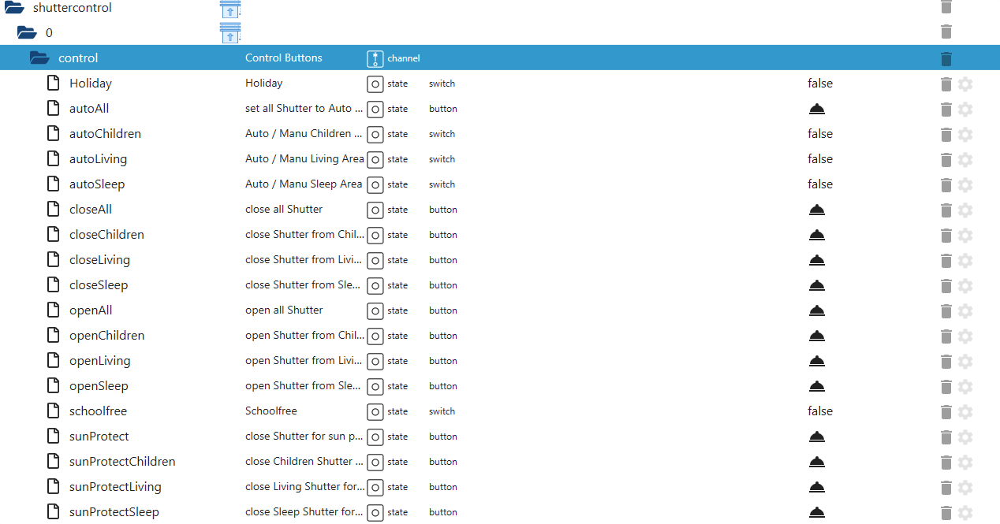
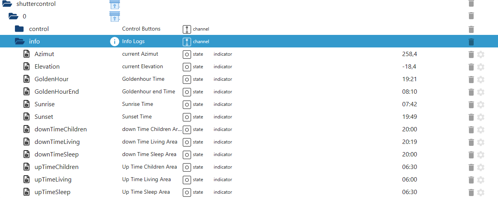

# Shuttercontrol 的文档和说明


---

## 支持适配器开发
**如果您喜欢该适配器，请考虑捐款：**

[![贝宝]（https://www.paypalobjects.com/en_US/DK/i/btn/btn_donateCC_LG.gif）](https://paypal.me/mk1676)

---

基础知识
>:grey_exclamation: 本手册从稳定版本 1.6.2 开始有效 :grey_exclamation:

Shuttercontrol 是一个适配器，用于全面控制卷帘、百叶窗或遮阳篷，包括自动遮阳和夜间变暗功能。

>:point_right: 为了简单起见，这里仅提及卷帘门。

有大量可调节参数可用于控制，例如：

* 三个不同的全局计时器，例如用于客厅、卧室和儿童区，
* 可以为每个卷帘单独设置各种与太阳位置相关的参数。

可以为每个卷帘单独设置，

* 门/窗传感器的触发器，可作为个人层面的锁定保护或自动开启功能。

当门或窗打开时，以单独的水平打开，

* 取决于例如阴影的各种可调节参数。

内部温度、外部温度、亮度、热传感器或类似传感器，

* 纳入太阳的位置以便只使实际上被遮蔽的房间变暗。

被照亮。

所有配置数据点均已预设示例，以便在安装并输入准备运行的快门 ID 后，适配器即可快速投入使用。

然后使用进一步的配置来适应个人意愿。

> Shuttercontrol 只能通过位置（例如 LEVEL）控制执行器，其值分别为 0 到 100 或 0-255。相应的百叶窗或百叶窗定时必须由执行器接管。
由执行器接管。百叶窗执行器（每个“高度”和“板条角度”各提供一个对象）可使用两个百叶窗进行控制。
可与具有相同参数设置的两个百叶窗对象一起使用。
使用。

---

＃＃ 安装
适配器位于 ioBroker 的“稳定”存储库中。在“适配器”选项卡中选择“shuttercontrol”，然后通过 (+) 创建 shuttercontrol 适配器的实例。

＃＃ 配置
创建实例后，配置窗口会自动打开，其中包含“主要设置”、“时间设置”和“额外设置”选项卡。

>:point_right: 应首先编辑[时间设置](#time-settings) 和 [额外设置](#extra-settings)选项卡，即在主设置中通过铅笔添加百叶窗之前。

---

### 主要设置
 --- >:point_right: 可以通过右上角的问号（7）访问 github 上的文档。

#### 保存或上传适配器配置
单击右上角向下的箭头 (9)，将适配器配置保存为 .json 文件。
单击向上的箭头 (8)，以 .json 格式上传现有的适配器配置。

_[返回顶部](#documentation-and-instructions-for-shuttercontrol)_

---

### 时间设置
这里进行基本时间或天文设置，稍后会在每个快门的[快门设置](#shutter-settings) 和[快门设置](#shutter-settings) 中使用。

>:heavy_exclamation_mark: Shuttercontrol 总是在**星期五**的**周末**设定的时间关闭百叶窗。
并且总是在**星期日**的**工作周**设定的时间关闭百叶窗 :heavy_exclamation_mark:


#### 起居区、睡眠区和儿童区的设置
各个设置可通过下拉菜单打开。描述以起居区为例，同样适用于所有区域。
适用于所有区域。

>:point_right: 当然，这种分类不一定必须用于起居区、睡眠区或儿童区。
儿童区，但可以通过卷帘门的不同移动时间在建筑物内定义三个区域。

**生活区自动控制类型**

下拉用于选择：

* **仅限生活区时间：**

*卷帘门仅通过时间控制操作。

* 日出和日落时分的时间生活区。

*卷帘门根据日出和日落进行控制，但在最早时间之前不会升起，在最晚时间之后不会降下。

* **黄金时段的时间生活区：**

*类似于日出和日落，但以“黄金时段”的开始和结束作为参考。

**工作日关闭百叶窗**：*一周内习惯的遮光时间*。

**一周内最早升起百叶窗的时间：** *这是一周内最早升起百叶窗的时间。

**一周内升起的最晚时间：** *这是一周内升起卷帘门的最晚时间*。

**卷帘门交错升起的时间延迟（秒）：** *此范围内的卷帘门单独升起之间的距离，例如为了避免无线电干扰或给人留下正在手动移动的印象。

**周末卷帘门关闭：** *周末**和**公共假期卷帘门的常规关闭时间。

**周末最早放假时间：** *这是周末**和**公共假期最早放假时间。

**周末升起的最晚时间：** *此时卷帘门在周末**和**最晚在公共假期升起*。

>:point_right: 如果在太阳尚未超过某个位置时卷帘门永远不会升起，则必须将这个时间设置为该太阳位置的最晚时间（12 月 21 日）。

_[返回顶部](#documentation-and-instructions-for-shuttercontrol)_

---

### 额外设置


#### Astro 设置


**纬度和经度：** *Shuttercontrol 从 ioBroker 系统设置中获取纬度和经度。
Shuttercontrol 使用这些值来计算太阳的位置。

**通过太阳高度（海拔）退出防晒功能：** *一旦太阳低于此处设置的高度，遮阳就会结束。
Shuttercontrol 的遮阳结束。

>:point_right: 可以在此考虑可能由于建筑物或高树而存在的过早遮光，并提前结束自动遮光。

**升高或降低的时间延迟（分钟）：** *可以在此处输入 +/- 偏移量，快门移动应根据在[时间设置](#time-settings) 中选择的自动控制类型延迟。

**交错快门运动的时间延迟（秒）：** *为了防止所有快门同时移动，可以在此处设置以秒为单位的全局时间延迟。

_[返回顶部](#documentation-and-instructions-for-shuttercontrol)_

---

#### 夏季设置


**夏季开始** 和 **夏季结束**：*这里可以根据自己的意愿设置夏季的开始或结束。

在相应百叶窗的[快门设置](#shutter-settings)下，将复选框设置为“`Do not close shutter in summer`”可防止此百叶窗在夏季关闭。

_[返回顶部](#documentation-and-instructions-for-shuttercontrol)_

---

#### 圣诞节设置


**圣诞节期间的开始**和**圣诞节期间的结束**：*在这里，您可以根据自己的意愿设置圣诞节期间的开始或结束。

在[卷帘门的额外设置](#extra-settings-roller-shutter)圣诞节设置下，此时所需的功能已打开，并且卷帘位置也已设置。

_[返回顶部](#documentation-and-instructions-for-shuttercontrol)_

---

#### 节假日及公众假期设置


**使用公共假期：** *通过激活此复选框并选择相应的假期适配器实例，百叶窗将在周末设定的时间在公共假期移动。

>:point_right: 如有必要，可以创建两个公共假期适配器实例：> 一个显示所有可能的公共假期，另一个显示与工作时间相关的公共假期，然后由 shuttercontrol 访问。

**用于设置假日的对象 ID：*此对象 ID 设置内部状态“假日”。
例如，可以使用来自 iCal 适配器的数据点，在假日的情况下返回值 ``true``，从而允许百叶窗在周末移动。

_[返回顶部](#documentation-and-instructions-for-shuttercontrol)_

---

#### 亮度传感器设置


如果需要使用亮度传感器自动移动百叶窗，则可在此处进行配置。

然后，在[主快门设置](#main-shutter-settings)下对每个百叶窗单独进行激活。
在**关闭（或打开）卷帘门的控制类型**下，选择条目“亮度传感器”。

**使用亮度传感器关闭的亮度值** *百叶窗关闭的亮度值。

**使用亮度传感器打开的亮度值** *百叶窗打开的亮度值*。

**亮度传感器的对象 ID** *对亮度传感器的引用，例如来自气象站或室外运动传感器或单独的亮度传感器。

_[返回顶部](#documentation-and-instructions-for-shuttercontrol)_

---

#### 学校假期设置


在这里，可以通过单独的数据点（带有**用于激活/停用学校假期的对象 ID**）或通过勾选已安装的 Schoolfree 适配器实例来激活假期。
然后，百叶窗会在假期期间在周末驾驶的设定时间打开。
可以为每个区域单独激活假期模式。

_[返回顶部](#documentation-and-instructions-for-shuttercontrol)_

---

特殊时刻


**稍后关闭某些百叶窗** *此选项允许所有百叶窗在深夜再次降下。
这涵盖了在正常关闭时间窗户或门仍打开的情况。
窗户或门在正常关闭时间仍打开，或者例如，关闭后再次打开露台门。
设置复选标记后，将出现设置**配置的卷帘门应延迟关闭的时间**。

> 必须为[快门设置](#shutter-settings) 中的每个卷帘门激活此功能，并为每个卷帘门分别勾选**延迟关闭卷帘门**，如果不需要，则可停用。

**将所有百叶窗完全关闭在中间位置** *晚上所有百叶窗完全关闭的时间（例如晚上 10:00）*。

**仅当 x 分钟前最后一次移动时才打开卷帘门：** *仅当此处设置的时间已过，适配器才会打开卷帘门。
此处设置的时间已过。

_[返回顶部](#documentation-and-instructions-for-shuttercontrol)_

---

#### 额外设置


**检查当前快门状态：** 一些用户（包括 shelly 用户）遇到级别稍有变化的问题。因此，这里有一个复选框。
如果激活复选框，shuttercontrol 将在等待检查快门状态的时间后检查当前级别，shuttercontrol 检查当前级别并暂时保存。

**阻止已知百叶窗高度的手动模式** *对当前百叶窗高度进行向上或向下舍入*。
此处，卷帘门的位置可以按 5 或 10 的步长进行舍入。

**睡眠区域触发器的对象 ID（自动）：** *此触发器激活睡眠区域的自动模式。

**生活区域触发器的对象 ID（自动）：** *此触发器激活生活区域的自动模式。

**儿童区域触发器的对象 ID（自动）：** *此触发器激活儿童区域的自动模式。

---

#### 闹钟设置


>:point_right: 对于每个警报，都需要一个逻辑数据点 (true/false) 来激活，> 激活 **alarm** = 状态 **true** 或停用 **alarm** = 状态 **false**。
>:point_right: 此外，必须为每个警报定义卷帘门在发生警报时移动的高度 (0-100%)。
>point_right: 在相应卷帘门的 [报警设置](#alarm-setting) 中，定义卷帘门应对哪些警报作出反应。
卷帘门应作出反应。

各个警报的优先级：

Prio 1（最高优先级）--> 火灾：

如果触发此警报，则为其配置的卷帘门将在**任何**情况下移动到设定的高度。
>:exclamation: 然后卷帘门将被阻塞，并且**不会**自动关闭，即使火灾警报被重置（错误）。

>:point_right:火灾警报重置后，必须使用“openAll”/“closeAll”按钮重新初始化百叶窗。
这可防止卷帘在发生火灾时因任何原因再次自动关闭。
它还可确保逃生路线保持畅通，并保证消防队的通行。

优先级 2 - 5（相同优先级）--> 雨、风 2、风 1、霜冻：

当这些警报被激活时，Shuttercontrol 会将配置的卷帘门移至最后一个活动的警报级别。

但是，当停用单个警报时，会观察到以下优先级： 优先级 1 = 火灾 优先级 2 = 雨 优先级 3 = 风 2 优先级 4 = 风 1 优先级 5 = 霜冻

霜冻警报仅在已激活的卷帘已关闭时才直接起作用（卷帘冻结的危险）。如果在卷帘仍处于打开状态时触发霜冻警报，则卷帘仅在关闭时自动移动到霜冻警报设置的高度。

_[返回顶部](#documentation-and-instructions-for-shuttercontrol)_

---

### 快门设置


>:point_right: 示例执行器*shutter example* 是自动创建的，请通过垃圾箱（5）将其删除。

现在点击 (+) (1) 添加您自己的卷帘门执行器。ID 选择打开，选择代表所需卷帘门位置的数据点 LEVEL。


表格结构：


* **编号**：*列出的百叶窗的连续编号*。

* **活动**： *用于激活/停用相应卷帘门控制的复选框*。

* **名称** *选择 ID 后，将自动从对象中读取执行器的名称

然后可以根据自己的意愿进行更改。

* **对象 ID 快门**：*对象中要控制的数据点的唯一 ID*。

* **(+)** *更改选定的卷帘执行器* * **铅笔** * *修改选定的卷帘执行器

* **铅笔** *打开相应卷帘的单独配置*。

* **双张纸：** *复印卷帘*

* **箭头** *使用相同设置确定卷帘门移动的顺序。

* 垃圾桶：* *删除百叶窗执行器及其所有配置数据。

卷帘门制作完成后，用铅笔（3）按压相应卷帘门上的标签[卷帘门的主要设置](#main-shutter-settings)、[防晒设置](#sun-protection-settings) 和 [额外设置](#extra-settings)，可对每个卷帘门进行单独配置。

---

#### 主快门设置


在上面区域，通过下拉菜单分别选择打开或关闭快门的时间。
> :point_right: 这些时间已在[时间设置](#time-settings) 中配置。

选择选项：

* **关闭**：不使用计时器。

* **生活区域** *快门按照*生活区域设置*中配置的时间移动。

* 生活区域（自动）：** * *卷帘门按照*生活区域设置*中配置的时间移动。

**并且**此外，卷帘响应在额外设置下定义的触发器而激活。
用于激活/停用自动生活区的对象 ID。如果将其设置为 false，卷帘将**不会**自动移动。

* 卷帘门按照“睡眠区设置”中配置的时间移动。

* 卷帘门按照*睡眠区设置*中配置的时间移动。

**并且**此外，快门会根据在额外设置下指定的触发器而激活。
用于激活/停用自动睡眠区域的对象 ID。
如果将其设置为 false，则卷帘门**不会**自动移动。

* 儿童区：* *卷帘门按照“儿童区设置”中配置的时间移动。

* 儿童区（自动）：* *卷帘门按照“儿童区设置”中配置的时间移动。

**并且**此外，快门是根据在额外设置下定义的触发器激活的。
用于激活/停用自动儿童区域的对象 ID。
如果将其设置为 false，快门将**不会**自动移动。

* 日落/日出：** * *快门在日落或日出时移动。

* 太阳高度：如果高度低于此处设置的值，卷帘门将关闭。

* 黄金时段：** * *卷帘门在黄金时段关闭，具体时间取决于纬度和一年中的时间，大约在日落前 1 小时或日出后。

日落之前或日出之后，取决于纬度和时间。

* 亮度传感器：** * *卷帘门仅根据亮度传感器移动，亮度传感器在[亮度传感器设置](#brightness-sensor-settings)下设置。

* 仅手动操作：** * *卷帘门只能按选定的方向手动移动。

:point_right: 无法通过 ``shuttercontrol.0.control`` 下的按钮进行任何移动。
point_right: 这对于遮阳篷很有用，例如，遮阳篷不应与其他卷帘一起打开。
不应与其他百叶窗一起打开。

**关闭状态下的窗/门传感器的值：** *此处，定义 **窗/门触点的对象 ID** 下的触发器（例如，窗或门触点）可以具有的值。
（例如，窗或转动手柄触点），在此状态下，自动卷帘系统可以无限移动。
:point_right: 可以选择 true、false、0、1 或 2 等值。

> point_right: 如果卷帘门不在最上部位置，并且此处指定的传感器状态发生变化，则卷帘门移动到最上部位置。
传感器状态发生变化，卷帘门移动到**窗户或门打开时的卷帘门高度**。

**倾斜状态下的窗户/门传感器的值：** *这将设置**窗户/门触点（例如窗户或门触点）的对象 ID 下的触发器的值。
（例如窗户或转动手柄触点），在此值下，自动卷帘系统可以无限移动。
:point_right: 可以选择 true、false、0、1 或 2 等值。

> point_right: 如果卷帘门不在最上部位置，并且此处指定的传感器状态发生变化，则卷帘门移动到最上部位置。
传感器状态发生变化，卷帘门移动到**窗户或门打开时的卷帘门高度**。

> :exclamation: 如果不存在具有倾斜功能的窗口接触，则应将该值设置为“不存在”。

**当窗户/门状态改变时移动卷帘：** *下拉选择当窗户/门传感器移动时要执行的功能：*

**关闭**：无动作

* **打开**：打开窗户/门时，百叶窗向上移动并保持在那里，关闭时百叶窗不动。
* **关闭**：关闭窗户/门后，卷帘移动到遮光位置，打开时，卷帘不动。

**打开和关闭：**当窗户/门打开时，卷帘门向上移动，当窗户/门关闭时，卷帘门再次向下移动。

**打开窗户或门时的卷帘高度：** *所需的卷帘位置从 0 到 100，例如，对于窗户，25% 用于通风，或 100% 以使门能够通过。
以使门能够通过。

**窗户或门倾斜时的卷帘高度：** *所需卷帘位置从 0 到 100，例如对于窗户，25% 用于通风。

**即使窗户/门打开时也使用自动卷帘（锁定保护）** **如果在自动关闭时，窗户/门传感器__不__对应于那里输入的值（窗户/门关闭），则将根据所选设置执行以下操作：**

* **关闭**：锁定保护在两个方向上均有效，当窗户打开时百叶窗不会移动。
* **打开**：仅允许升起。在遮光/遮光结束时，即使窗户打开，卷帘也会向上移动。窗户打开时，卷帘不会自动关闭。
* **关闭**：只允许关闭。在开始变暗/遮光时，卷帘会向下移动，尽管窗户是打开的。当窗户打开时，卷帘不会打开。
* **打开和关闭**：窗户打开时，卷帘可以向两个方向移动。

**卷帘门向下移动时的高度** *卷帘门关闭时的位置值。

**卷帘升起时的高度：** *卷帘打开时的位置值*。

> :point_right: 必须根据所使用的执行器输入卷帘高度（0-100 或 0-255）：> 0 = 关闭且 100 = 打开或 0 = 打开且 100 = 关闭。

**窗户/门触点的对象 ID：**使用 (+) 选择用于防止卷帘移动的传感器（状态）（例如门触点）。

_[返回顶部](#documentation-and-instructions-for-shuttercontrol)_

---

#### 防晒设置


**防晒控制类型**：可以使用各种触发器来控制遮阳及其结束，可以通过下拉菜单选择以下组合：

* 超出
* 室内和室外温度/光线传感器
* 罗盘方向（太阳位置）
* 室内/室外温度/光传感器及基本方向
* 室外温度/光线传感器及方向
* 室外温度/光照传感器
* 室内温度

> :point_right: 仅当选定组合的所有触发器都处于活动状态（逻辑与连接）时，防晒功能才会触发，并且当其中一个触发器变为非活动状态时，防晒功能就会结束。

> :point_right: 还必须为所有选定的触发器存储对象 ID。

> :point_right: 光传感器始终是可选的，可以保留为空。如果配置了光传感器，则它与其他参数 AND 链接。

**卷帘向下移动时的高度** *遮光时卷帘应关闭的距离值。*

**方向（太阳位置）：** *罗盘玫瑰上的窗口对齐（0° = 北；180° = 南）*

**+/- 主动防晒太阳位置范围：** *太阳（中心点附近）会干扰窗户的区域。此区域外没有遮光。*

**设定室外温度：** *遮阳从该值（或更高）开始。*

**室外温度滞后（百分比）：** *您可以在此处设置百分比滞后，以便波动时的卷帘不会不断上下移动。*滞后是遮光应开始的上限温度值与遮光再次结束的下限温度值之间的差值。

**室外温度对象 ID：** 此处通过 (+) 选择的传感器不一定非要测量室外温度。他可以提供任何可用于触发遮光的值。
这也可以是热传感器（温差传感器）。
如果未选择室外传感器作为触发器，请将此字段留空。

**遮阳光传感器的设定点：** *启动遮光的阈值。*该值取决于在 **遮阳光传感器的对象 ID** 字段中选择的传感器。

**滞后光传感器（百分比）：** 在这里，您可以设置向下滞后的百分比，以便当云层变化引起波动时，卷帘不会不断上下移动。
滞后是阴影应开始的设定点与阴影应再次开始的较低亮度值之间的差值。

> :point_right: 示例：防晒光传感器的设定点设置为 30,000，滞后设置为 40%：防晒功能从 30,000 开始激活，并保持激活状态，直到值低于 18,000。

**防晒光传感器的对象 ID：** *模拟外部温度传感器* 如果未选择为触发器，请留空

**设定点室内温度：**在这里您可以输入分配给卷帘的内部温度传感器的温度，必须输入在该温度之下不应进行遮光，例如为了减少冬天使用辐射来支持供暖的热量。

**内部温度滞后（百分比）：** *您可以在此处设置百分比滞后，以便卷帘门在内部温度波动时不会不断上升和下降。*滞后是遮光开始的上限温度值与遮光再次结束的下限温度值之间的差值。

**室内温度传感器对象 ID：** 使用 (+) 选择温度传感器。
如果未选择室内传感器作为触发器，请将此字段留空。

_[返回顶部](#documentation-and-instructions-for-shuttercontrol)_

---

#### 额外设置卷帘门


#### 卷帘门设置


**延迟关闭卷帘** 使用此选项，卷帘将在定义的时间（可在[特殊时期](#special-times)中调整）启动并关闭。
> :exclamation: 这里不考虑锁定保护，尽管窗户打开，卷帘也会降低！（有被锁定的危险！！）：exclamation:

**夏季请勿关闭卷帘** 某些卷帘在夏季不应关闭。[夏季设置](#summer-settings) 中的时间段为夏季。

**关窗后驱动** 窗户/门关闭后，卷帘将设置为最后请求的设置位置驱动。

> :point_right: 仅当锁定保护未设置为“关闭”时，此功能才有效！

#### 圣诞节设置


如果卷帘门在圣诞节期间只应部分关闭，因为如果烛台拱门或类似物应保持可见，则可以使用此选项。卷帘门将不会在正常关闭时间完全关闭，而只会关闭到可以设置的水平。
> :point_right: **圣诞节期间的卷帘门水平**仅在选中**圣诞节期间的卷帘门水平**时才可见且可调。

应激活此功能的时间段在[圣诞节设置](#christmas-settings) 设置下设置。
> :point_right: 如果要在晚上晚些时候完全关闭卷帘门，则可以使用此选项 > **稍后关闭卷帘门** 或 **移动到中间位置并稍后完全关闭** > 可以使用。
> :point_right: 这两个选项也可以独立于圣诞节设置使用。

#### 防晒设置


**保持卷帘处于防晒状态** 如果打开此选项，卷帘将保持防晒状态，即使不再需要防晒，并且一直保持防晒状态直到晚上“关闭”信号到来。
这可以防止卷帘每天上下多次。
当高度保持较低（选中选项）时，在百叶窗操作中非常实用，只需打开和关闭板条即可。

**亮度下降到遮光结束的延迟时间（分钟）** 此处设置当遮光变暗且亮度低于设定水平时应延迟的时间。
默认值为 0，可根据需要进行调整。此选项仅与亮度传感器配合使用

**防热** 此选项允许卷帘在炎热天气下完全关闭。
激活此选项后，将出现输入温度（°C）的字段。

> :point_right: 如果手动调整卷帘门但位置与自动调整不符，则自动系统将停止！

> :point_right: 如果卷帘手动移动到配置的高度以进行打开、关闭或防晒，则自动功能保持不变。

#### 额外设置


**打开窗户时卷帘门的延迟时间（秒）** *打开窗户/门后卷帘门打开的延迟参数（以秒为单位）*

**关闭窗户时卷帘门的延迟时间（秒）** *关闭窗户/门后卷帘门关闭的延迟时间（秒为单位）*

**移至中间位置，然后完全关闭** *激活后，**中间位置的卷帘高度**将变为可见。卷帘在关闭时会移至设置的中间位置，然后完全关闭*

#### 闹钟设置


这里可以通过[警报设置](#alarm-setting)激活或停用当前卷帘门预定义的警报。

_[返回顶部](#documentation-and-instructions-for-shuttercontrol)_

---

数据点
Shuttercontrol 在以下文件夹下创建各种数据点：

* 快门控制.x.控制
* shuttercontrol.x.信息
* shuttercontrol.x.shutters

> :point_right: x 代表相应安装的实例

---

### Shuttercontrol0控制


数据点控制各种功能，如：*假日*如果```true```，卷帘门在周末和晚上的设定时间移动

```false``` during weekday hours.*
> :point_right: Can use your own scripts that calculate or display vacation, days off, etc.
set to true to enable weekend settings.

* autoAll
*Button to set **all** shutters to auto mode*

* autoChildren
*If the roller shutters are controlled with **children's area (automatic)**, the automatic function is activated here
switched on with ```true``` and switched off with ```false```.*

* auto living
*If the roller shutters are controlled with **Living area (automatic)**, the automatic mode is used here
switched on with ```true``` and switched off with ```false```.*

* auto sleep
*If the roller shutters are controlled with **sleeping area (automatic)**, the automatic mode is used here
switched on with ```true``` and switched off with ```false```.*

* closeAll
*Button to close **all** roller shutters in **all areas***

* closeChildren
*Button to close **all** roller shutters in the children's area*

* closeLiving
*Button to close **all** roller shutters in the living area*

* closeSleep
*Button to close **all** shutters in the sleeping area*

* openAll
*Button to open **all** roller shutters in **all areas***

* openChildren
*Button to open **all** roller shutters in the children's area*

* openLiving
Button to open **all** roller shutters in the living area

* openSleep
*Button to open **all** shutters in the sleeping area*

* school free
*Button to manually activate the holiday season and have the roller shutters open at the set time on the weekend*

* sunProtect
*Button to move the roller shutters into the sun protection position*

* sunProtectChildren
*Button to move the roller shutters in the children's area to the sun protection position*

* sunProtectLiving
*Button to move the roller shutters in the living area to the sun protection position*

* sunProtectSleep
*Button to move the roller shutters in the sleeping area to the sun protection position*


_[Back to top](#documentation-and-instructions-for-shuttercontrol)_


---


### shuttercontrol0info
Data points for displaying calculated values and checking configured ones
Times:




_[Back to top](#documentation-and-instructions-for-shuttercontrol)_


---


### shuttercontrol0shutters


* autoDown
*For each roller shutter, automatic closing can be deactivated here with ```false```

或使用```true```激活。*

* 自动调平

*显示每个卷帘门的当前位置（卷帘门无法通过此处控制）。*

* 自动状态

*显示每个卷帘门的当前状态（上、下、Manu_Mode、sunProtect）（卷帘门无法通过此控制）。*

* 自动太阳

*每个卷帘门的防晒功能均可通过```false```停用，或通过```true```启用。*

* 自动向上

*对于每个卷帘门，可以在此处使用```false```停用自动开启功能，或使用```true```启用自动开启功能。*

_[返回顶部](#documentation-and-instructions-for-shuttercontrol)_

## Changelog
<!-- ### __WORK IN PROGRESS__ -->
### __WORK IN PROGRESS__
* (simatec) Dependencies updated
* (simatec) Fix End-Delay for Sunprotect
* (simatec) Update Translations
* (simatec) Trigger changed
* (simatec) Code revision and improvements
* (simatec) many small fixes
* (simatec) Fix Sunprotect end by Shutter up
* (simatec) Fix Shutter up when open the Window
* (simatec) Test & Release updated
* (simatec) Fix Trigger

### 1.7.3 (2024-06-20)
* (simatec) Fix Sunprotect End-Delay

### 1.7.2 (2024-06-20)
* (simatec) Fix Shutterstate enabled

### 1.7.1 (2024-06-19)
* (simatec) Dependencies updated
* (simatec) Docu updated

### 1.7.0 (2024-02-05)
* (simatec) Dependencies updated
* (simatec) @iobroker/adapter-dev added
* (simatec) Design optimizations
* (simatec) Gulp deleted
* (simatec) Docu updated
* (simatec) many small fixes

### 1.6.3 (2023-11-01)
* (simatec) Saturday added as work week
* (simatec) Dependencies updated
* (simatec) Fix Auto-Living, Auto-Sleep & Auto-Children
* (simatec) Timeout Fix
* (FredF63) Update German Docu
* (simatec) Wiki added

### 1.6.2 (2023-08-28)
* (simatec) Dependencies updated
* (simatec) node 20 tests added
* (simatec) Fix ending Sunprotect with open door/window
* (5G7K) Fix timing & some states for sunprotect

### 1.6.1 (2023-07-17)
* (simatec) Fix Heat protection

### 1.6.0 (2023-07-16)
* (simatec) Manu mode block added
* (simatec) Heat protection added
* (simatec) Added rounding of incoming shutter states
* (simatec) Ukrainian language added
* (simatec) small Bugfixes
* (simatec) Dependencies updated

### 1.5.0 (2023-06-05)
* (simatec) new Manu-Mode Check added
* (simatec) suncalc added
* (simatec) Dependencies updated

### 1.4.29 (2023-04-26)
* (simatec) Bugfix Brightness down

### 1.4.28 (2023-04-17)
* (simatec) small Fixes

### 1.4.27 (2023-04-17)
* (simatec) small Fixes

### 1.4.26 (2023-04-14)
* (simatec) Fix Sunprotect

### 1.4.25 (2023-04-13)
* (simatec) small Fixes

### 1.4.24 (2023-04-10)
* (simatec) Fix end of Sunprotect
* (simatec) small Fixes
* (simatec) Fix shutter alarm
* (simatec) Sentry fixes
* (simatec) Bugfix Brightness down
* (simatec) Dependencies updated
* (j4nv) Fix Astro Time

### 1.4.23 (2023-03-28)
* (simatec) Bugfix Brightness-Sensor
* (simatec) Dependencies updated
* (simatec) small fixes

### 1.4.22 (2023-03-18)
* (simatec) Bugfix Brightness-Sensor
* (simatec) Dependencies updated
* (simatec) Fix Alarm Settings

### 1.4.21 (2023-02-02)
* (simatec) fix Brightness Settings
* (simatec) Dependencies updated

### 1.4.20 (2023-01-30)
* (simatec) Bugfix Brightness-Sensor

### 1.4.19 (2023-01-22)
* (simatec) Time config for Brightness-Sensor added
* (simatec) small Bugfixes
* (simatec) Dependencies updated

### 1.4.18 (2022-09-24)
* (simatec) Bugfixes Button Action

### 1.4.17 (2022-09-24)
* (simatec) small Bugfixes

### 1.4.16 (2022-09-19)
* (simatec) small Bugfixes
* (simatec) Dependencies updated
* (simatec) Dev-Dependencies updated
* (simatec) Docu updated
* (simatec) travis deleted
* (simatec) update translation
* (simatec) debug for shutterstate added

### 1.4.14 (2022-06-02)
* (simatec) delay for Lightsensor added
* (simatec) Dependencies updated
* (simatec) Dev-Dependencies updated

### 1.4.13 (2022-05-24)
* (FoxRo) Bugfix Alarm handling
* (simatec) Dependencies updated
* (simatec) Dev-Dependencies updated
* (simatec) more debuglog for Trigger

### 1.4.12 (2022-04-11)
* (FoxRo) Bugfix wrongly open after deactivation of weater alarm
* (simatec) Dependencies updated
* (simatec) Dev-Dependencies updated

### 1.4.11 (2022-02-07)
* (simatec) fix objects value
* (simatec) Dependencies updated
* (simatec) Dev-Dependencies updated

### 1.4.10 (2022-01-16)
* (simatec) Bugfix xmas time
* (simatec) Bugfix Shutter delay
* (simatec) Dependencies updated
* (simatec) Dev-Dependencies updated

### 1.4.9 (2021-12-29)
* (simatec) error handling for trigger added
* (simatec) Bugfix Trigger delay
* (simatec) Dependencies updated
* (simatec) Dev-Dependencies updated

### 1.4.8 (2021-12-25)
* (simatec) error handling for trigger added
* (simatec) Bugfix Trigger delay

### 1.4.7 (2021-12-21)
* (simatec) complete error handling for states added
* (simatec) Bugfix Down Late Option
* (simatec) small Bugfixes
* (simatec) Dependencies updated
* (simatec) Dev-Dependencies updated

### 1.4.6 (2021-12-15)
* (simatec) Bugfixes shuttersettings
* (simatec) Bugfix shutter created

### 1.4.5 (2021-12-14)
* (simatec) small Bugfixes
* (simatec) Code cleaning
* (simatec) try & catch added
* (simatec) source code was converted to async
* (simatec) Dependencies updated
* (simatec) Dev-Dependencies updated

### 1.4.4 (2021-12-08)
* (simatec) Bugfix Trigger after shutter close
* (simatec) Bugfix XMas Level by frost
* (simatec) XMas Level for Elevation added
* (simatec) Summertime for Elevation added
* (simatec) small Bugfixes
* (simatec) shutter Config check added

### 1.4.3 (2021-12-05)
* (simatec) Bugfix Trigger after shutter close
* (simatec) Bugfix XMas Level by frost
* (simatec) XMas Level for GoldenHour added
* (simatec) Summertime for Goldenhour added
* (simatec) small Bugfixes

### 1.4.2 (2021-12-02)
* (simatec) Bugfix Alarm settings
* (simatec) Bugfix move shutter after closing window
* (simatec) better translation for all languages
* (simatec) small Bugfixes

### 1.4.1 (2021-12-01)
* (simatec) Code cleaning
* (simatec) Bugfix Alarm States
* (simatec) try & catch added

### 1.4.0 (2021-11-30)
* (simatec) Source code completely redesigned
* (simatec) Much of the source code was converted to async
* (simatec) many small Bugfixes
* (simatec) Dependencies updated
* (simatec) Dev-Dependencies updated

### 1.3.9 (2021-11-25)
* (simatec) Bugfix between Level
* (simatec) many small Bugfixes
* (simatec) docu updated
* (simatec) Dependencies updated
* (simatec) Dev-Dependencies updated

### 1.3.8 (2021-11-20)
* (simatec) Bugfix XMas-Level
* (simatec) Bugfix Down Complete

### 1.3.7 (2021-11-19)
* (simatec) brightness down State added
* (simatec) BrightnessSensor fix

### 1.3.6 (2021-11-17)
* (simatec) small Bugfixes

### 1.3.5 (2021-11-16)
* (simatec) Bugfix BrightnessSensor
* (simatec) Fix Delay with value 0
* (simatec) DEPENDENCIES updated
* (simatec) Dev-DEPENDENCIES updated

### 1.3.3 (2021-11-07)
* (simatec) Bugfix trigger Tilted

### 1.3.2 (2021-11-05)
* (simatec) Bugfix BrightnessSensor
* (simatec) lastAutoAction in array added
* (simatec) Bugfix Log for alarm

### 1.3.1 (2021-11-04)
* (simatec) Bugfix BrightnessSensor
* (simatec) Object-ID for school holidays added

### 1.3.0 (2021-11-03)
* (FoxRo) alarm function added
* (simatec) Trigger Tilted Window / Door added
* (FoxRo) new Feature Sunprotect end Delay added
* (FoxRo) Bugfix in window trigger
* (FoxRo/simatec) new Features in Docu added
* (simatec) many small BugFix
* (simatec) DEPENDENCIES updated
* (simatec) Dev-DEPENDENCIES updated

### 1.2.1 (2021-06-22)
* (simatec) auto-mode button added
* (simatec) many small BugFix
* (simatec) DEPENDENCIES updated
* (simatec) Dev-DEPENDENCIES updated

### 1.2.0 (2021-05-04)
* (simatec) new Feature shutterSettings added
* (simatec) new Feature brightness sensor for opening added
* (simatec) new Feature brightness sensor for closing added
* (simatec) new Feature schoolfree adapter added
* (simatec) new Feature middle position added
* (simatec) new Feature Xmas position added
* (simatec) Bugfix
* (simatec) DEPENDENCIES updated
* (simatec) Dev-DEPENDENCIES updated
* (simatec) timeout settings for shutterstatus added

### 1.1.5 (2021-01-22)
* (simatec) BugFix io-package
* (simatec) Source code structure changed
* (FoxRo) new Feature "trigger delay"
* (FoxRo) Bugfix for trigger

### 1.1.4 (2021-01-22)
* (simatec) BugFix Log
* (simatec) DEPENDENCIES updated
* (simatec) Dev-DEPENDENCIES updated

### 1.1.3 (2021-01-21)
* (simatec) small fix for objects

### 1.1.2 (2021-01-18)
* (simatec) small fix for holiday state

### 1.1.1 (2021-01-04)
* (René) bug fix xmas time
* (simatec) copy function for shutter-table added

### 1.1.0 (2020-12-08)
* (simatec) GUI redesign
* (simatec) Intermediate position added for closing

### 1.0.5 (2020-12-05)
* (Rene) fix xMas Time

### 1.0.4 (2020-10-28)
* (simatec) fix summertime for childrenarea

### 1.0.3 (2020-10-28)
* (René) bug fix: calculation IsSummerTime
* (René) bug fix: use weekend down time already on friday instead of sunday
* (René) handling of shutters in xmas time added
* (FredF63) documentation updated
* (FredF63) words.js updated
* (simatec) some Bugfixes

### 1.0.2 (2020-10-08)
* (simatec) fix uptime for childrenarea

### 1.0.1 (2020-10-06)
* (simatec) Adjustment of the configuration menu
* (simatec) time settings for the children's area added
* (simatec) button for closing the children's area added
* (simatec) button for opening the children's area added
* (simatec) button for sun protection of the children's area added

### 1.0.0 (2020-09-28)
* (simatec) some Bugfixes
* (simatec) code cleaning
* (simatec) DEPENDENCIES updated
* (simatec) Dev-DEPENDENCIES updated
* (FoxRo) Added buttons for Sunprotect Living and Sunprotect Sleep
* (FoxRo) Included Living-Auto and Sleep-Auto in Buttons for Open/Close Sleep and Living
* (FoxRo) KeepSunprotect added
* (FoxRo) Drive after close added
* (FoxRo) Extend status handling

### 0.8.7 (2020-09-22)
* (simatec) small Bugfix for weekend

### 0.8.6 (2020-08-21)
* (simatec) small Bugfixes trigger

### 0.8.5 (2020-08-03)
* (simatec) small Bugfixes
* (5G7K) bugfixes trigger
* (FredF63) new german doku

### 0.8.4 (2020-07-17)
* (simatec) small Bugfixes
* (5G7K) debug log changed
* (simatec) Dependencies updated
* (MeisterTR) Time left to detect second sleep

### 0.8.3 (2020-07-07)
* (simatec) Bugfix IsSummerTime
* (simatec) Bugfix shutter convert

### 0.8.2 (2020-07-06)
* (simatec) small Bugfixs
* (simatec) Buttons for sunprotect operation added

### 0.8.1 (2020-07-03)
* (simatec) Bugfix shutterstates
* (simatec) support for KNX

### 0.8.0 (2020-07-02)
* (simatec) added state for current shutter Action
* (simatec) added state for current shutter Level
* (simatec) added Indicator for manual operation in the states
* (simatec) code cleanup
* (simatec) complete new structure of the code
* (simatec) Buttons for manual opening and closing operation added
* (simatec) Display in the States if the shutter was moved manually
* (5G7K) Bug fix sunprotect

### 0.7.3 (2020-06-29)
* (simatec) errorhandling for sentry.io
* (simatec) bugfixes
* (simatec) cancel all schedule by unload
* (rg-engineering) bug fix and documentation

### 0.7.2 (2020-06-26)
* (simatec) Bugfix sunprotect for outsidetemp
* (simatec) better translation for all languages
* (simatec) better overview in the user interface

### 0.7.1 (2020-06-24)
* (simatec) small bugfixes
* (simatec) errorhandling for sentry.io

### 0.7.0 (2020-06-23)
* (rg-engineering) better (userfriendly) check for adjustable times
* (rg-engineering) datapoint for Holiday incl. internal check and handling
* (rg-engineering) late all down added 
* (5G7K) Extended sun protection
* (simatec) edited User Menu for Timesettings
* (simatec) Bugfix Lightvalue to 20.000 Lux
* (simatec) added better German Translation

### 0.6.2 (18.05.2020)
* (simatec) errorhandling for sentry.io
* (simatec) Bugfix getState

### 0.6.1 (11.05.2020)
* (simatec) bugfix index_m.html

### 0.6.0 (10.05.2020)
* (simatec) added sentry.io
* (simatec) added node 14 Support
* (simatec) many small Bugfixes
* (simatec) node 8 support removed
* (5G7K) added new feature for sunprotect
* (5G7K) added more debug logs

### 0.5.1 (15.04.2020)
* (simatec) Bugfix for Adapter checker
* (simatec) Added more debug logs
* (simatec) Added node Support
* (simatec) node 8 support removed
* (Rene) late all down added
* (Rene) late all down configurable per shutter
* (Rene) in summer time not to move down (configurable)

### 0.5.0 (06.04.2020)
* (simatec) Bugfix Goldenhour
* (simatec) Bugfix delay for sunprotect
* (simatec) Bugfix Goldhour with living area
* (simatec) Added auto fill for Position
* (simatec) many small Bugfixes
* (simatec) Bugfix Translations
* (simatec) Bugfix compactmode
* (5G7K) Added debug log with more Informations

### 0.4.3 (29.12.2019)
* (simatec) Bugfix update process

### 0.4.2 (22.12.2019)
* (simatec) Fix Trigger added objects

### 0.4.1 (20.10.2019)
* (simatec) Fix update process
* (simatec) Fix appveyor

### 0.4.0 (28.08.2019)
* (simatec) Fix shutdown for Elevation
* (simatec) Fix triggerHeight
* (simatec) Fix Travis

### 0.3.2 (09.07.2019)
* (simatec) Added state check for all shutter
* (simatec) Bugfix sunprotect
* (simatec) Bugfix trigger
* (simatec) Bugfix time settings
* (Homoran) Added German Docu

### 0.3.1 (02.07.2019)
* (simatec) Fix sunprotect for shelly user

### 0.3.0 (01.07.2019)
* (simatec) Fix shutter up for Sunprotect
* (simatec) Fix input for elevation
* (simatec) Fix input for Inside temperature
* (simatec) Fix input for Outside temperature
* (simatec) Fix input for Lightsensor
* (simatec) Added Object to shutter
* (simatec) Added hysteresis for Lightsensor
* (simatec) Added hysteresis for Inside temperature
* (simatec) Added hysteresis for Outside temperature
* (simatec) Added State check after running
* (simatec) Fix autodrive
* (simatec) Added check shutter up for sunprotect
* (simatec) Added Translations
* (simatec) sunprotect changed to switch
* (Homoran/simatec) Added German Docu
* (simatec) Added English Docu

### 0.2.13 (21.06.2019)
* (simatec) small Bugfix

### 0.2.12 (21.06.2019)
* (simatec) Changed Time-Settings
* (simatec) Bugfix Trigger for up and down
* (simatec) Bugfix sunprotect with azimut
* (simatec) Added sunprotect not running on state down
* (simatec) Added debug log for any shutter states

### 0.2.11 (20.06.2019)
* (simatec) Fix debug log
* (simatec) temporary storage of the state
* (simatec) automatic stop of sun protection with manual state change

### 0.2.10 (18.06.2019)
* (simatec) edit extra menu
* (simatec) clean code
* (simatec) save current states on start

### 0.2.9 (17.06.2019)
* (simatec) Bugfix PopUp
* (simatec) Fix TriggerID

### 0.2.8 (17.06.2019)
* (simatec) Menu completely revised
* (simatec) Ease of use improved
* (simatec) Example added
* (simatec) Default settings added for each roller shutter
* (simatec) fixed some bugs

### 0.2.7 (14.06.2019)
* (simatec) Beta 0.2.7

### 0.2.6 (14.06.2019)
* (simatec) Beta 0.2.6

### 0.2.5 (11.06.2019)
* (simatec) Beta 0.2.5

### 0.2.4 (11.06.2019)
* (simatec) Beta 0.2.4

### 0.2.3 (10.06.2019)
* (simatec) Fix Elevation
* (simatec) Fix direction
* (simatec) Add all translate
* (simatec) Add new popup for shutter config
* (simatec) clean table

### 0.2.2 (01.06.2019)
* (simatec) Beta 0.2.2

### 0.2.1 (01.06.2019)
* (simatec) Shutters drive when the trigger is changed
* (simatec) Add Trigger ID for Auto-Living
* (simatec) Add Trigger ID for Auto-Sleep
* (simatec) add shutter height for trigger
* (simatec) Add boolean for drive on change Trigger

### 0.2.0 (31.05.2019)
* (simatec) complete restructuring of functions

### 0.1.0 (11.05.2019)
* (simatec) First Beta

### 0.0.1 (02.04.2019)
* (simatec) initial release


*************************************************************************************************************************************

## License
MIT License

Copyright (c) 2019 - 2024 simatec

Permission is hereby granted, free of charge, to any person obtaining a copy
of this software and associated documentation files (the "Software"), to deal
in the Software without restriction, including without limitation the rights
to use, copy, modify, merge, publish, distribute, sublicense, and/or sell
copies of the Software, and to permit persons to whom the Software is
furnished to do so, subject to the following conditions:

The above copyright notice and this permission notice shall be included in all
copies or substantial portions of the Software.

THE SOFTWARE IS PROVIDED "AS IS", WITHOUT WARRANTY OF ANY KIND, EXPRESS OR
IMPLIED, INCLUDING BUT NOT LIMITED TO THE WARRANTIES OF MERCHANTABILITY,
FITNESS FOR A PARTICULAR PURPOSE AND NONINFRINGEMENT. IN NO EVENT SHALL THE
AUTHORS OR COPYRIGHT HOLDERS BE LIABLE FOR ANY CLAIM, DAMAGES OR OTHER
LIABILITY, WHETHER IN AN ACTION OF CONTRACT, TORT OR OTHERWISE, ARISING FROM,
OUT OF OR IN CONNECTION WITH THE SOFTWARE OR THE USE OR OTHER DEALINGS IN THE
SOFTWARE.