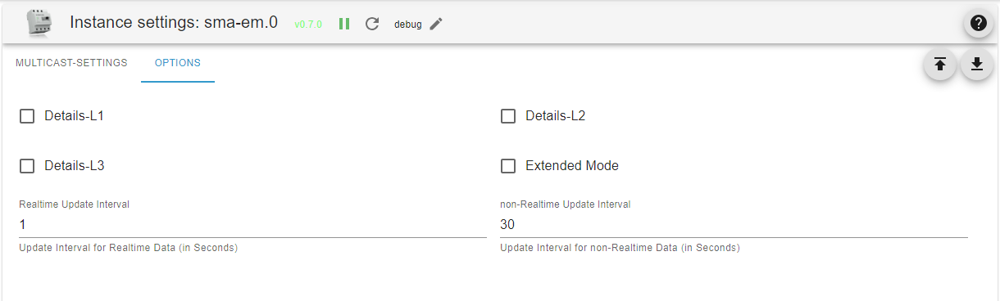
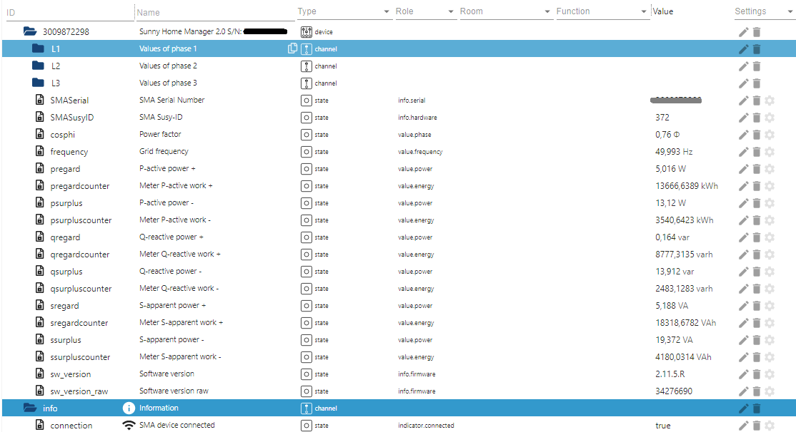

# SMA 电能表适配器文档
＃＃ 一般信息
SMA 电能表适配器从电能表或 Sunny Home Manager 接收多播数据报。它们每秒或更频繁地将带有测量数据的数据包发送到网络中。在 Sunny Portal 中可以设置 200ms、600ms 或 1000ms 的传输间隔。

## 管理/管理页面

- 选项卡组播设置
  - 多播 IP：默认设置和由 SMA 预定义的 IP 地址是 239.12.255.254。
  - 多播端口：SMA 预定义的默认设置是 UDP 端口 9522。
  - 自己的网络接口 IP：选择框显示 ioBroker 服务器上所有可用的网络接口 IPv4。从此框中选择网络接口 IP 以侦听多播。
  - 选择的网络接口 IP：当前选择的网络接口 IP 侦听多播消息。 IP 0.0.0.0 表示适配器侦听所有可用的网络接口。不建议使用此设置，因为它可能会导致某些网络出现问题。
  - 电表IP：特定电表的IP 地址。如果输入此项，则仅在适配器的一个实例中记录该电能表的数据。如果有多个电表，则可以在适配器的其他实例中单独配置它们。这一过程通过 ioBroker 发现得到简化，它检测网络中可以到达的 SMA 电表，并为找到的每个电表创建一个实例。

  IP 0.0.0.0 选择所有电表。所有现有的电表均由适配器的一个实例处理。这是默认设置，并提供与以前版本的适配器的兼容性。

- 选项卡选项
  - 扩展模式：提供更详细的信息，例如无功功率、视在功率、功率因数、电压、电流强度等。默认情况下禁用此设置。
  - 详细信息L1 - L3：这些选择点可用于显示每个阶段的详细信息。
  - 实时更新间隔：此处设置瞬时功率或电网频率等实时数据的更新间隔。这有助于减少系统负载。示例：数据包速率为 5/s（200ms 传输间隔）时，在一秒的实时更新间隔内对所有值进行求和，仅在间隔结束时计算频率和频率的平均值或中值。阶段在相应的 ioBroker 数据点中更新。
  - 非实时更新间隔：此处设置抄表等非实时数据的更新间隔。这里，仅在间隔结束时在相应的 ioBroker 数据点中更新最后接收的值。

## 文件夹结构/对象

安装并启动适配器后，将创建如图所示的文件夹结构。电能表的全部数据位于根文件夹中。如果已配置，则各个相位的值位于子文件夹 L1-L3 中。

## 对象 ID 说明
字母 p、q 和 s 源自电气工程，代表：

- P - 有功功率
- Q - 无功功率
- S——视在功率

- 这里的“重视”是“消费”的意思。 （从电网接收的电力）
- 这里“剩余”一词的意思是“馈入”。 （电力馈入电网）
- 这里“计数器”一词的意思是“能量计”。

由此，对象名称被放在一起，例如

- pregard - 从电网接收的有功功率
- psurplus - 馈入电网的有功功率
- pregardcounter - 从电网接收到的有功功率的电能表
- qregard - 从电网接收的无功功率
- ...

## Changelog
### 1.0.0 (2023-08-19)

- (pdbjjens) Change: node>=16, js-contoller>=4 and admin>=6 required
- (pdbjjens) Change: Configurable Energy Meters per adapter instance
- (pdbjjens) Change: Selectable own network device IP to listen for multicast messages
- (pdbjjens) Change: Objects "last_message" and "TimeTick" were removed
- (pdbjjens) New: Support ioBroker discovery
- (pdbjjens) New: Detect SMA-EM 1.0 (SUSy 270)
- (arteck) New: Detect new SHM 2.0 with SUSy 501
- (ticaki) Fix: Catch interface errors

### 0.7.0 (2023-03-14)

- (pdbjjens) New: Configurable data point update intervals to reduce system load
- (pdbjjens) New: Use JSON config

### 0.6.6 (2023-02-28)  2023 maintenance release

- (pdbjjens) Updated dependencies
- (pdbjjens) New: Use adapter-dev instead of gulp translate

### 0.6.5 (2022-02-19)

- Updated dependencies
- Compatibility check for js-controller 4.0
- Prevent onUnload warnings

### 0.6.4 (2021-08-19)

- (TGuybrush) Bug fixes
- Prevent warnings regarding non-existent objects upon adapter instance creation and start-up under js-controller 3.2.x
- Improved check of SMA Energy Meter multicast messages to prevent ghost devices and warnings regarding unknown OBIS values.

## License

The MIT License (MIT)

Copyright (c) 2023 IoBroker-Community

Permission is hereby granted, free of charge, to any person obtaining a copy
of this software and associated documentation files (the "Software"), to deal
in the Software without restriction, including without limitation the rights
to use, copy, modify, merge, publish, distribute, sublicense, and/or sell
copies of the Software, and to permit persons to whom the Software is
furnished to do so, subject to the following conditions:

The above copyright notice and this permission notice shall be included in
all copies or substantial portions of the Software.

THE SOFTWARE IS PROVIDED "AS IS", WITHOUT WARRANTY OF ANY KIND, EXPRESS OR
IMPLIED, INCLUDING BUT NOT LIMITED TO THE WARRANTIES OF MERCHANTABILITY,
FITNESS FOR A PARTICULAR PURPOSE AND NONINFRINGEMENT. IN NO EVENT SHALL THE
AUTHORS OR COPYRIGHT HOLDERS BE LIABLE FOR ANY CLAIM, DAMAGES OR OTHER
LIABILITY, WHETHER IN AN ACTION OF CONTRACT, TORT OR OTHERWISE, ARISING FROM,
OUT OF OR IN CONNECTION WITH THE SOFTWARE OR THE USE OR OTHER DEALINGS IN
THE SOFTWARE.