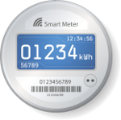

# IoBroker.smartmeter
 

**此适配器使用 Sentry 库自动向我（作为开发人员）报告异常和代码错误。** 更多详细信息请参见下文！

该 ioBroker 适配器允许读取和解析遵循 OBIS 数字逻辑的智能电表协议，以使其数据可用。

***适配器需要nodejs 16.x+才能工作！***

***此适配器当前需要安装 git 才能安装！***

## 参数说明
ioBroker-论坛主题：http://forum.iobroker.net/viewtopic.php?f=23&t=5047&p=54973

### 数据协议
支持的协议：

* **Sml**：二进制格式的 SML（智能消息语言）
* **D0**：D0（基于 IEC 62056-21:2002/IEC 61107/EN 61107）为 ASCII 格式（当前不支持二进制协议模式 E）
* **Json-Efr**：来自 EFR 智能电网中心的 OBIS 数据（JSON 格式）

＃＃＃ 数据传输
* **串口接收**：通过串口推送数据接收（智能电表定期发送数据，无需任何请求）。主要用于SML
* **串行双向通信**：模式 A、B、C 和 D 下的 D0 协议（当前不支持模式 E！），具有唤醒、登录、电位器。用于读出数据的 ACK 和数据消息（到目前为止尚未实现编程/写入模式）
* **Http-Requests**：通过请求定义的 URL 通过 HTTP 读取数据
* **本地文件**：从本地文件读取数据

### 数据请求间隔
等待下一个请求或暂停串口接收的秒数，值为0可以在完成一条消息后直接重新启动，

默认值：300（=5 分钟）

### 串行设备波特率
初始串行连接的波特率，如果未定义，则使用每个传输类型的默认值（SerialResponseTransprt 为 9600，SerialRequestResponseTransport 为 300）

### D0：登录消息命令
SignIn-Message 命令，默认“?”查询必填字段，其他值取决于设备。
示例：2WR5 热量计使用“#”查询更多数据（可选字段以及所有必填字段）

### D0：模式覆盖
适配器尝试确定规范中定义的 D0 协议模式。有些设备不符合规范，因此会带来问题。使用此选项您可以覆盖确定的协议模式。

* 模式 A：无波特率转换，无 Ack-Message
* 模式 B：波特率转换，无 Ack-Message
* 模式 C：需要波特率转换和 Ack-Message
* 模式 D：无波特率转换，波特率始终为 2400
* 模式 E：需要波特率转换和 Ack-Message，自定义协议，当前不支持！如果您有这样的智能电表请联系我

### D0：波特率-转换-覆盖
适配器尝试确定协议规范中定义的数据消息的波特率。但与模式一样，一些智能电表在这里提供错误的数据。因此，您可以根据需要使用它来覆盖数据消息的波特率。留空以使用智能电表定义的波特率转换。

## 适配器经过测试...
... 至少：

* Hager eHz 能量计（多个，例如 eHZ-IW8E2A5L0EK2P、EHZ363W5）
* EMH能量计
* EFR 智能电网中心
* 来自热站的西门子 2WR5 读卡器
* 埃尔斯特 AS1440
* 伊斯克拉梅科 MT174
* 伊斯克拉梅科 MT175
* Itron EM214 720 型
* 兰吉尔 E220
* 使用 DSRM 协议的荷兰智能电表（使用“仅串行设备读取数据”和“D0”作为协议）
* DZG DWS7412.1T
    * *重要*：似乎存在固件错误，有时当前的能耗变为负值！可以使用 https://github.com/Apollon77/smartmeter-obis/issues/75#issuecomment-581650736* 中的公式进行手动重新计算...等等

请向我发送有关您已成功使用该库的设备的信息，我将在此处添加它。

## 特殊智能电表和问题
### DZG DVS74
有时，SML 固件中似乎存在错误，并且 SML 消息中的值被错误编码，但消息本身是有效的。解决方案是使用 Javascript 对值进行后处理。请参阅 https://github.com/Apollon77/smartmeter-obis/issues/75#issuecomment-581650736

## 如何报告问题和功能请求
请为此使用 GitHub 问题。

最好的方法是将适配器设置为调试日志模式（实例 -> 专家模式 -> 列日志级别）。然后，请从磁盘获取日志文件（ioBroker 安装目录中的子目录“log”，而不是从管理员获取，因为管理员会截断行）。如果您不喜欢在 GitHub 问题中提供它，您也可以通过电子邮件将其发送给我 (iobroker@fischer-ka.de)。请添加对相关 GitHub 问题的引用，并描述我当时在日志中看到的内容。

## 什么是 Sentry 以及向服务器报告什么？
Sentry.io 是开发人员获取应用程序错误概览的一种方式。这正是在这个适配器中实现的。

当适配器崩溃或发生其他代码错误时，也会出现在 ioBroker 日志中的此错误消息会被提交到我们在德国托管的 Sentry 服务器。当您允许 iobroker GmbH 收集诊断数据时，您的安装 ID（这只是一个唯一的 ID **没有**关于您、电子邮件、姓名等的任何其他信息）也包含在内。这允许 Sentry 对错误进行分组并显示有多少唯一用户受到此类错误的影响。所有这些都有助于我提供基本上不会崩溃的无错误适配器。

## Changelog
### 3.4.0 (2023-11-25)
* IMPORTANT: This version requires at least Node.js 16+
* (Apollon77) Prevent some crash cases

### 3.3.4 (2022-03-11)
* (Apollon77) Restore functionality of Port list in Admin

### 3.3.3 (2022-02-21)
* IMPORTANT: This version requires at least Node.js 12.17+ (excluding non LTS like 13.x)
* (Apollon77) Prevent some crash cases

### 3.2.1 (2021-05-09)
* (Apollon77) Optimize for js-controller 3.3

### 3.2.0 (2021-01-24)
* (Apollon77) Add new protocolSmlInputEncoding option for SML protocol. With this also ascii or base64 based encodings (e.g. with TCP transports) are possible.

### 3.1.9 (2021-01-22)
* (Apollon77) optimize stop handling (Sentry IOBROKER-SMARTMETER-10)

### 3.1.8 (2021-01-14)
* (Apollon77) prevent last warnings with js-controller 3.2

### 3.1.7 (2021-01-13)
* (Apollon77) prevent warnings with js-controller 3.2
* (Apollon77) update js-controller dependency to at least require js-controller 2.0.0

### 3.1.6 (2020-11-15)
* (Apollon77) update OpenSML lib to support Holley DTZ541 wrongly implemented CRC Algorithm

### 3.1.5 (2020-09-21)
* (Apollon77) update dependencies to prevent some crash cases and optimize tcp mode

### 3.1.3 (2020-07-20)
* (Apollon77) update dependencies to prevent some crash cases

### 3.1.2 (2020-04-12)
* (Apollon77) catch errors when no memory is available anymore and stop processing

### 3.1.1 (2020-03-11)
* (Apollon77) fix admin when switching to TCPTransport
* (Apollon77) bugfixes and optimizations

### 3.1.0 (2020-03-08)
* (Apollon77) bugfixes and optimizations
* (Apollon77) experimental TCP support, please give feedback

### 3.0.10 (2020-02-05)
* (Apollon77) make sure HTTP based smartmeters are also polled frequently when responses are invalid
* (Apollon77) other optimizations
* (Apollon77) Switch Sentry to iobroker own instance hosted in germany

### 3.0.8 (2019-12-20)
* (Apollon77) errors prevented when stopping to process data

### 3.0.7 (2019-12-18)
* (Apollon77) errors prevented when stopping to process data

### 3.0.6 (2019-12-07)
* (Apollon77) serial port configuration further optimized
* (Apollon77) update smartmeter-obis lib to fix some edge case errors and serial close handling

### 3.0.3 (2019-11-30)
* (Apollon77) serial port configuration further optimized

### 3.0.2 (2019-11-29)
* (Apollon77) Fix use of "/dev/serial/by-id" paths on linux if available

### 3.0.1 (2019-11-27)
* (Apollon77) BREAKING CHANGE: Supports nodejs 8.x+ only, up to 12.x
* (Apollon77) support compact mode
* (Apollon77) update to latest library versions to fix problems and add special handling for some smart meters with broken firmware
* (Apollon77) Use "/dev/serial/by-id" paths on linux if available; add port selection to Admin
* (Apollon77) Add Sentry for error reporting

### 2.0.0 (2019-03-22)
* (Apollon77) BREAKING CHANGE: State names changed because * no longer supported. Is replaced by __ now because of possible collisions in state names with only one _

### 1.2.2 (2018-11-11)
* Update smartmeter library, fix HTTP-JSON-Transport

### 1.2.1 (2018-06-23)
* BREAKING CHANGE: State names changed because * no longer supported. Is replaced by _

### 1.1.3 (2018-04-13)
* Fix Admin

### 1.1.2 (26.03.2018)
* Add better support for devices with more then 16 values (OpenSML Library upgrade)

### 1.1.0 (31.01.2018)
* Allow multiple queries for D0 and Serial-Bidirectional communication
* a lot of bugfixing and Optimizations
* Switch to SerialPort 6.0.4 to hopefully get more stable (less/no SIGSEGV/SIGABRT ...)

### 1.0.0 (25.08.2017)
* Update smartmeter library and fix some timing issues

### 0.5.12 (23.07.2017)
* update SML library

### 0.5.11 (21.06.2017)
* optimize D0 handling and add support for Dutch smartmeter using DSRM protocol.

### 0.5.8 (06.04.2017)
* optimize Serial handling on Windows (because pause and resume are not supported there)

### 0.5.6 (02.04.2017)
* update library

### 0.5.5 (19.03.2017)
* improved baudrate-changeover logic for D0 protocol (now hopefully finally)
* enhanced D0 protocol support for multiple values

### 0.5.0 (26.02.2017)
* maintenance update

### 0.4.2 (27.02.2017)
* one last try to fix the crashes SIGABRT/SIGSEGV

### 0.4.1 (24.02.2017)
* Fix potential hanging communication with D0 Serial

### 0.4.0 (23.02.2017)
* Optimize for D0 Message handling and baudrate changeovers

### 0.3.2 (22.02.2017)
* Optimize D0 protocol handling for mode E

### 0.3.1 (12.02.2017)
* Finalize Adapter config and added some informations

### 0.3.0 (11.02.2017)
* We now should be quiet stable

### 0.1.1
* Update smartmeter-obis library to 0.2.5 to add Serial Timeout for Request/Response protocol

### 0.1.0
* Initial version for public testing

### 0.0.1
* Initial version for internal testing

## License

The MIT License (MIT)

Copyright (c) 2017-2023 Apollon77 <ingo@fischer-ka.de>

Permission is hereby granted, free of charge, to any person obtaining a copy
of this software and associated documentation files (the "Software"), to deal
in the Software without restriction, including without limitation the rights
to use, copy, modify, merge, publish, distribute, sublicense, and/or sell
copies of the Software, and to permit persons to whom the Software is
furnished to do so, subject to the following conditions:

The above copyright notice and this permission notice shall be included in all
copies or substantial portions of the Software.

THE SOFTWARE IS PROVIDED "AS IS", WITHOUT WARRANTY OF ANY KIND, EXPRESS OR
IMPLIED, INCLUDING BUT NOT LIMITED TO THE WARRANTIES OF MERCHANTABILITY,
FITNESS FOR A PARTICULAR PURPOSE AND NONINFRINGEMENT. IN NO EVENT SHALL THE
AUTHORS OR COPYRIGHT HOLDERS BE LIABLE FOR ANY CLAIM, DAMAGES OR OTHER
LIABILITY, WHETHER IN AN ACTION OF CONTRACT, TORT OR OTHERWISE, ARISING FROM,
OUT OF OR IN CONNECTION WITH THE SOFTWARE OR THE USE OR OTHER DEALINGS IN THE
SOFTWARE.